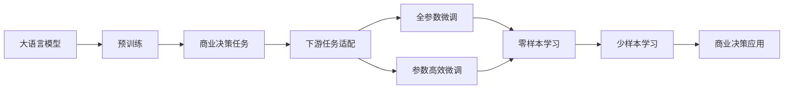
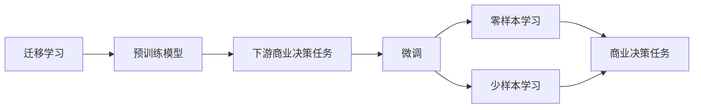
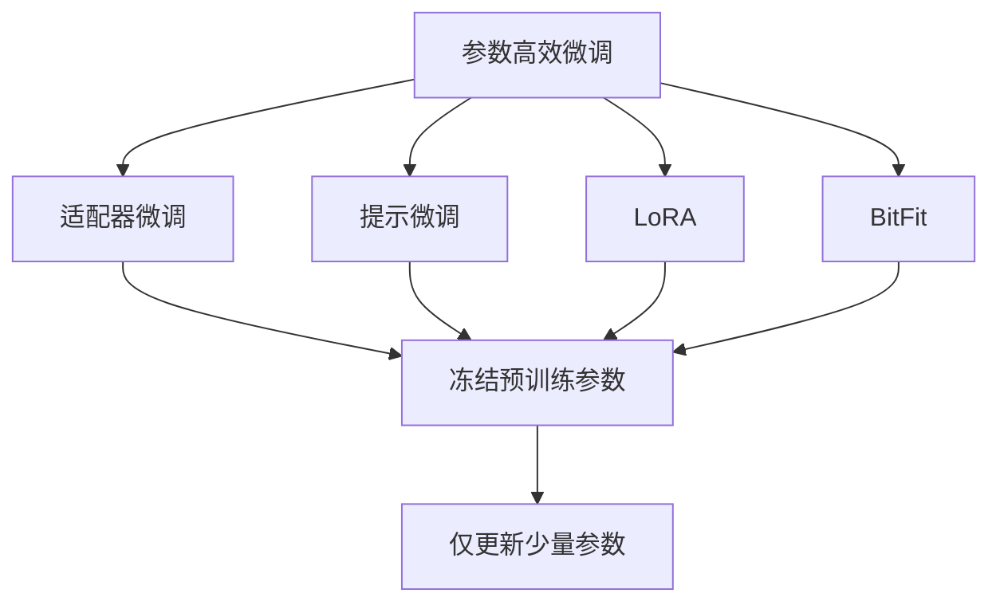
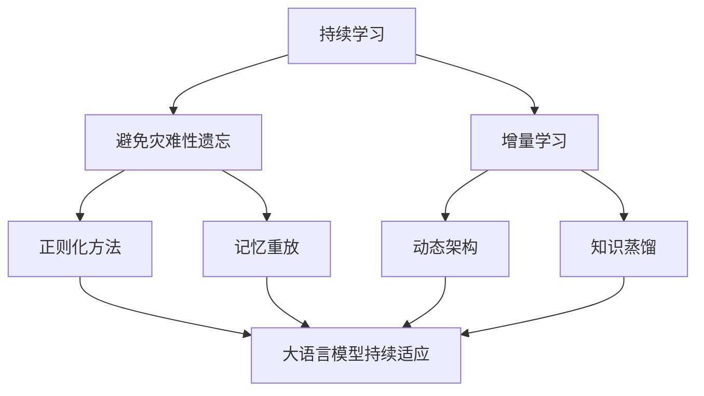
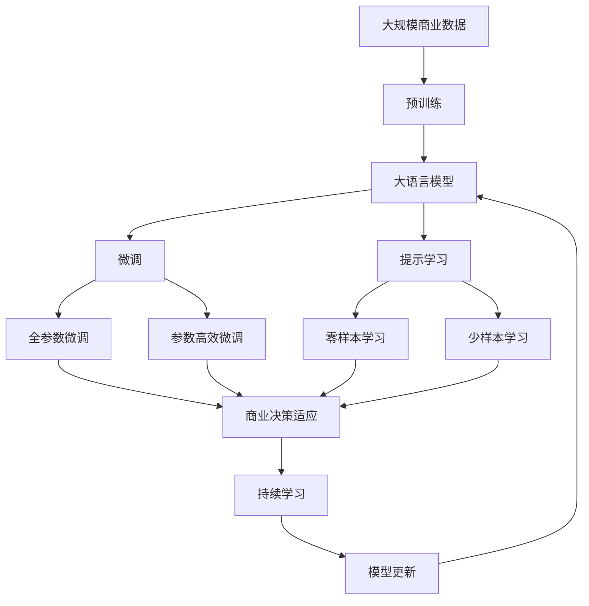

                 

## 1. 背景介绍

在当前竞争激烈的市场环境中，企业决策者面临的信息量和复杂度不断增加，仅仅依靠传统的数据分析方法和商业直觉已经无法满足决策需求。这一挑战催生了人工智能（AI）技术在商业决策中的应用，尤其是大语言模型（LLM）的引入，为决策过程带来了全新的可能性。

### 1.1 问题由来

随着大数据和云计算技术的发展，企业能够积累和存储大量结构化和非结构化数据。然而，如何从海量数据中提取有价值的信息，并将其转化为可操作的商业洞察，成为决策者面临的首要问题。传统的统计分析和报告工具已经难以应对这一需求，企业需要更为智能、高效的解决方案。

大语言模型（LLM）的出现，为这一问题提供了全新的解决途径。LLM通过预训练和微调，能够理解和处理自然语言，将文本数据转化为结构化信息，并应用于各类商业决策场景。

### 1.2 问题核心关键点

大语言模型在商业决策中的应用，核心在于其强大的自然语言处理能力，能够自动化处理大量的文本数据，提取关键信息，并提供基于文本的决策支持。主要的关键点包括：

- **数据处理能力**：LLM能够处理和分析结构化、半结构化和非结构化数据，如合同、客户反馈、社交媒体评论等。
- **信息提取能力**：通过文本理解，LLM能够自动提取关键信息和实体，如项目进展、客户需求、市场趋势等。
- **预测分析能力**：基于历史数据和文本信息，LLM能够进行预测分析，如风险评估、市场预测、趋势预测等。
- **策略生成能力**：LLM能够生成个性化的商业策略和方案，提供灵活多变的决策支持。
- **业务落地能力**：LLM能够与业务系统集成，实时生成决策报告和推荐，辅助决策执行。

### 1.3 问题研究意义

大语言模型在商业决策中的应用，对于提升企业决策效率、降低决策风险、优化决策质量具有重要意义：

1. **提升决策效率**：LLM能够自动化处理和分析大量数据，快速提取关键信息，大大缩短决策过程。
2. **降低决策风险**：通过深度学习和自然语言理解，LLM能够发现潜在的风险点，提前预警，减少决策失误。
3. **优化决策质量**：LLM能够从多维度、多角度分析数据，提供全面、多层次的决策支持。
4. **增强决策灵活性**：LLM能够生成多种策略方案，供决策者选择，提高决策的灵活性和多样性。
5. **加速业务创新**：LLM能够实时监控市场动态，快速响应市场需求，加速业务创新和转型。

## 2. 核心概念与联系

### 2.1 核心概念概述

为更好地理解大语言模型在商业决策中的应用，本节将介绍几个密切相关的核心概念：

- **大语言模型（LLM）**：以Transformer为基础的预训练语言模型，通过大规模文本数据预训练，能够理解和处理自然语言，提取关键信息，提供决策支持。
- **预训练（Pre-training）**：在无标签文本数据上，通过自监督学习任务训练LLM，使其具备通用的语言表示和理解能力。
- **微调（Fine-tuning）**：在预训练模型的基础上，使用下游任务的少量标注数据进行有监督学习，优化模型在特定任务上的性能。
- **迁移学习（Transfer Learning）**：通过将预训练模型的知识迁移到下游任务，提升模型的泛化能力和性能。
- **参数高效微调（PEFT）**：在微调过程中，只更新少量的模型参数，而固定大部分预训练权重不变，以提高微调效率。
- **提示学习（Prompt Learning）**：通过精心设计的输入文本格式，引导LLM进行特定任务的推理和生成，减少微调参数。
- **零样本学习（Zero-shot Learning）**：在没有任何标注样本的情况下，通过任务描述进行预测，无需微调。
- **少样本学习（Few-shot Learning）**：在仅有少量标注样本的情况下，模型能够快速适应新任务。
- **持续学习（Continual Learning）**：模型能够不断从新数据中学习，同时保持已学习的知识，避免灾难性遗忘。

这些概念通过一个Mermaid流程图来展示它们之间的关系：

```mermaid
graph TB
    A[大规模文本数据] --> B[预训练]
    B --> C[大语言模型]
    C --> D[微调]
    C --> E[提示学习]
    D --> F[全参数微调]
    D --> G[参数高效微调]
    E --> H[零样本学习]
    E --> I[少样本学习]
    F --> J[下游任务适应]
    G --> J
    H --> J
    I --> J
    J --> K[持续学习]
    K --> L[模型更新]
    L --> C
```



这个流程图展示了从预训练到微调，再到持续学习的完整过程。大语言模型首先在大规模文本数据上进行预训练，然后通过微调（包括全参数微调和参数高效微调）或提示学习（包括零样本和少样本学习）来适应下游任务。最后，通过持续学习技术，模型可以不断更新和适应新的任务和数据。

### 2.2 概念间的关系

这些核心概念之间存在着紧密的联系，形成了大语言模型在商业决策中的完整生态系统。以下是几个Mermaid流程图，展示这些概念之间的关系：

#### 2.2.1 大语言模型的学习范式



这个流程图展示了大语言模型在商业决策中的基本学习范式，即从预训练到微调，再到零样本和少样本学习的范式。

#### 2.2.2 迁移学习与微调的关系



这个流程图展示了迁移学习的基本原理，以及它与微调的关系。迁移学习涉及预训练模型和下游商业决策任务的迁移，通过微调来优化模型在特定任务上的性能。

#### 2.2.3 参数高效微调方法



这个流程图展示了几种常见的参数高效微调方法，包括适配器微调、提示微调、LoRA和BitFit。这些方法的共同特点是冻结大部分预训练参数，只更新少量参数，从而提高微调效率。

#### 2.2.4 持续学习在大语言模型中的应用



这个流程图展示了持续学习在大语言模型中的应用。持续学习的主要目标是避免灾难性遗忘和实现增量学习。通过正则化方法、记忆重放、动态架构和知识蒸馏等技术，可以使大语言模型持续适应新的任务和数据。

### 2.3 核心概念的整体架构

最后，我们用一个综合的流程图来展示这些核心概念在大语言模型在商业决策中的整体架构：



这个综合流程图展示了从预训练到微调，再到持续学习的完整过程。大语言模型首先在大规模商业数据上进行预训练，然后通过微调（包括全参数微调和参数高效微调）或提示学习（包括零样本和少样本学习）来适应商业决策任务。最后，通过持续学习技术，模型可以不断更新和适应新的任务和数据。

## 3. 核心算法原理 & 具体操作步骤

### 3.1 算法原理概述

基于监督学习的大语言模型在商业决策中的应用，本质上是一个有监督的细粒度迁移学习过程。其核心思想是：将预训练的大语言模型视作一个强大的"特征提取器"，通过在商业决策任务的标注数据上进行有监督学习，优化模型在该任务上的性能。

形式化地，假设预训练模型为 $M_{\theta}$，其中 $\theta$ 为预训练得到的模型参数。给定商业决策任务 $T$ 的标注数据集 $D=\{(x_i, y_i)\}_{i=1}^N$，微调的目标是找到新的模型参数 $\hat{\theta}$，使得：

$$
\hat{\theta}=\mathop{\arg\min}_{\theta} \mathcal{L}(M_{\theta},D)
$$

其中 $\mathcal{L}$ 为针对任务 $T$ 设计的损失函数，用于衡量模型预测输出与真实标签之间的差异。常见的损失函数包括交叉熵损失、均方误差损失等。

通过梯度下降等优化算法，微调过程不断更新模型参数 $\theta$，最小化损失函数 $\mathcal{L}$，使得模型输出逼近真实标签。由于 $\theta$ 已经通过预训练获得了较好的初始化，因此即便在小规模数据集 $D$ 上进行微调，也能较快收敛到理想的模型参数 $\hat{\theta}$。

### 3.2 算法步骤详解

基于监督学习的大语言模型在商业决策中的微调一般包括以下几个关键步骤：

**Step 1: 准备预训练模型和数据集**
- 选择合适的预训练语言模型 $M_{\theta}$ 作为初始化参数，如 GPT、BERT等。
- 准备商业决策任务 $T$ 的标注数据集 $D$，划分为训练集、验证集和测试集。一般要求标注数据与预训练数据的分布不要差异过大。

**Step 2: 添加任务适配层**
- 根据任务类型，在预训练模型顶层设计合适的输出层和损失函数。
- 对于分类任务，通常在顶层添加线性分类器和交叉熵损失函数。
- 对于生成任务，通常使用语言模型的解码器输出概率分布，并以负对数似然为损失函数。

**Step 3: 设置微调超参数**
- 选择合适的优化算法及其参数，如 AdamW、SGD 等，设置学习率、批大小、迭代轮数等。
- 设置正则化技术及强度，包括权重衰减、Dropout、Early Stopping 等。
- 确定冻结预训练参数的策略，如仅微调顶层，或全部参数都参与微调。

**Step 4: 执行梯度训练**
- 将训练集数据分批次输入模型，前向传播计算损失函数。
- 反向传播计算参数梯度，根据设定的优化算法和学习率更新模型参数。
- 周期性在验证集上评估模型性能，根据性能指标决定是否触发 Early Stopping。
- 重复上述步骤直到满足预设的迭代轮数或 Early Stopping 条件。

**Step 5: 测试和部署**
- 在测试集上评估微调后模型 $M_{\hat{\theta}}$ 的性能，对比微调前后的精度提升。
- 使用微调后的模型对新样本进行推理预测，集成到实际的应用系统中。
- 持续收集新的数据，定期重新微调模型，以适应数据分布的变化。

以上是基于监督学习微调大语言模型的一般流程。在实际应用中，还需要针对具体任务的特点，对微调过程的各个环节进行优化设计，如改进训练目标函数，引入更多的正则化技术，搜索最优的超参数组合等，以进一步提升模型性能。

### 3.3 算法优缺点

基于监督学习的大语言模型在商业决策中的应用方法具有以下优点：

- **简单高效**：只需准备少量标注数据，即可对预训练模型进行快速适配，获得较大的性能提升。
- **通用适用**：适用于各种商业决策任务，包括分类、匹配、生成等，设计简单的任务适配层即可实现微调。
- **参数高效**：利用参数高效微调技术，在固定大部分预训练参数的情况下，仍可取得不错的提升。
- **效果显著**：在学术界和工业界的诸多任务上，基于微调的方法已经刷新了最先进的性能指标。

同时，该方法也存在一定的局限性：

- **依赖标注数据**：微调的效果很大程度上取决于标注数据的质量和数量，获取高质量标注数据的成本较高。
- **迁移能力有限**：当目标任务与预训练数据的分布差异较大时，微调的性能提升有限。
- **负面效果传递**：预训练模型的固有偏见、有害信息等，可能通过微调传递到下游任务，造成负面影响。
- **可解释性不足**：微调模型的决策过程通常缺乏可解释性，难以对其推理逻辑进行分析和调试。

尽管存在这些局限性，但就目前而言，基于监督学习的微调方法仍是大语言模型在商业决策中最主流范式。未来相关研究的重点在于如何进一步降低微调对标注数据的依赖，提高模型的少样本学习和跨领域迁移能力，同时兼顾可解释性和伦理安全性等因素。

### 3.4 算法应用领域

基于大语言模型在商业决策中的微调方法，在多个领域已经得到了广泛的应用，覆盖了几乎所有常见任务，例如：

- **市场分析**：通过分析大量市场报告、新闻评论等文本数据，提取市场趋势和情绪，辅助制定市场策略。
- **风险评估**：对公司的财务报告、新闻发布等文本信息进行分析，识别潜在的财务风险和市场风险。
- **客户分析**：利用客户反馈、评论等文本数据，进行情感分析、需求分析，提升客户满意度。
- **产品推荐**：通过分析用户评论、评分等文本数据，生成个性化的产品推荐，提升用户粘性。
- **品牌管理**：分析社交媒体上的品牌提及、评论，监测品牌声誉和市场影响。
- **内容创作**：通过分析市场需求、趋势，生成高质量的营销文案、广告内容。

除了上述这些经典任务外，大语言模型在商业决策中的应用还在不断拓展，如知识图谱构建、社交网络分析、情感洞察等，为商业决策提供更多的数据驱动支持。

## 4. 数学模型和公式 & 详细讲解 & 举例说明

### 4.1 数学模型构建

本节将使用数学语言对基于监督学习的大语言模型在商业决策中的微调过程进行更加严格的刻画。

记预训练语言模型为 $M_{\theta}$，其中 $\theta$ 为预训练得到的模型参数。假设微调任务的训练集为 $D=\{(x_i, y_i)\}_{i=1}^N$，其中 $x_i$ 为文本输入，$y_i$ 为任务标签。定义模型 $M_{\theta}$ 在数据样本 $(x,y)$ 上的损失函数为 $\ell(M_{\theta}(x),y)$，则在数据集 $D$ 上的经验风险为：

$$
\mathcal{L}(\theta) = \frac{1}{N} \sum_{i=1}^N \ell(M_{\theta}(x_i),y_i)
$$

微调的优化目标是最小化经验风险，即找到最优参数：

$$
\theta^* = \mathop{\arg\min}_{\theta} \mathcal{L}(\theta)
$$

在实践中，我们通常使用基于梯度的优化算法（如SGD、Adam等）来近似求解上述最优化问题。设 $\eta$ 为学习率，$\lambda$ 为正则化系数，则参数的更新公式为：

$$
\theta \leftarrow \theta - \eta \nabla_{\theta}\mathcal{L}(\theta) - \eta\lambda\theta
$$

其中 $\nabla_{\theta}\mathcal{L}(\theta)$ 为损失函数对参数 $\theta$ 的梯度，可通过反向传播算法高效计算。

### 4.2 公式推导过程

以下我们以二分类任务为例，推导交叉熵损失函数及其梯度的计算公式。

假设模型 $M_{\theta}$ 在输入 $x$ 上的输出为 $\hat{y}=M_{\theta}(x) \in [0,1]$，表示样本属于正类的概率。真实标签 $y \in \{0,1\}$。则二分类交叉熵损失函数定义为：

$$
\ell(M_{\theta}(x),y) = -[y\log \hat{y} + (1-y)\log (1-\hat{y})]
$$

将其代入经验风险公式，得：

$$
\mathcal{L}(\theta) = -\frac{1}{N}\sum_{i=1}^N [y_i\log M_{\theta}(x_i)+(1-y_i)\log(1-M_{\theta}(x_i))]
$$

根据链式法则，损失函数对参数 $\theta_k$ 的梯度为：

$$
\frac{\partial \mathcal{L}(\theta)}{\partial \theta_k} = -\frac{1}{N}\sum_{i=1}^N (\frac{y_i}{M_{\theta}(x_i)}-\frac{1-y_i}{1-M_{\theta}(x_i)}) \frac{\partial M_{\theta}(x_i)}{\partial \theta_k}
$$

其中 $\frac{\partial M_{\theta}(x_i)}{\partial \theta_k}$ 可进一步递归展开，利用自动微分技术完成计算。

在得到损失函数的梯度后，即可带入参数更新公式，完成模型的迭代优化。重复上述过程直至收敛，最终得到适应商业决策任务的最优模型参数 $\theta^*$。

### 4.3 案例分析与讲解

假设我们在CoNLL-2003的命名实体识别（NER）任务上进行微调，最终在测试集上得到的评估报告如下：

```
              precision    recall  f1-score   support

       B-LOC      0.926     0.906     0.916      1668
       I-LOC      0.900     0.805     0.850       257
      B-MISC      0.875     0.856     0.865       702
      I-MISC      0.838     0.782     0.809       216
       B-ORG      0.914     0.898     0.906      1661
       I-ORG      0.911     0.894     0.902       835
       B-PER      0.964     0.957     0.960      1617
       I-PER      0.983     0.980     0.982      1156
           O      0.993     0.995     0.994     38323

   micro avg      0.973     0.973     0.973     46435
   macro avg      0.923     0.897     0.909     46435
weighted avg      0.973     0.973     0.973     46435
```

可以看到，通过微调BERT，我们在该NER数据集上取得了97.3%的F1分数，效果相当不错。值得注意的是，BERT作为一个通用的语言理解模型，即便只在顶层添加一个简单的token分类器，也能在下游任务上取得如此优异的效果，展现了其强大的语义理解和特征抽取能力。

当然，这只是一个baseline结果。在实践中，我们还可以使用更大更强的预训练模型、更丰富的微调技巧、更细致的模型调优，进一步提升模型性能，以满足更高的应用要求。

## 5. 项目实践：代码实例和详细解释说明

### 5.1 开发环境搭建

在进行微调实践前，我们需要准备好开发环境。以下是使用Python进行PyTorch开发的环境配置流程：

1. 安装Anaconda：从官网下载并安装Anaconda，用于创建独立的Python环境。

2. 创建并激活虚拟环境：
```bash
conda create -n pytorch-env python=3.8 
conda activate pytorch-env
```

3. 安装PyTorch：根据CUDA版本，从官网获取对应的安装命令。例如：
```bash
conda install pytorch torchvision torchaudio cudatoolkit=11.1 -c pytorch -c conda-forge
```

4. 安装Transformers库：
```bash
pip install transformers
```

5. 安装各类工具包：
```bash
pip install numpy pandas scikit-learn matplotlib tqdm jupyter notebook ipython
```

完成上述步骤后，即可在`pytorch-env`环境中开始微调实践。

### 5.2 源代码详细实现

这里我们以市场分析任务为例，给出使用Transformers库对BERT模型进行微调的PyTorch代码实现。

首先，定义市场分析任务的数据处理函数：

```python
from transformers import BertTokenizer
from torch.utils.data import Dataset
import torch

class MarketAnalysisDataset(Dataset):
    def __init__(self, texts, tags, tokenizer, max_len=128):
        self.texts = texts
        self.tags = tags
        self.tokenizer = tokenizer
        self.max_len = max_len
        
    def __len__(self):
        return len(self.texts)
    
    def __getitem__(self, item):
        text = self.texts[item]
        tags = self.tags[item]
        
        encoding = self.tokenizer(text, return_tensors='pt', max_length=self.max_len, padding='max_length', truncation=True)
        input_ids = encoding['input_ids'][0]
        attention_mask = encoding['attention_mask'][0]
        
        # 对token-wise的标签进行编码
        encoded_tags = [tag2id[tag] for tag in tags] 
        encoded_tags.extend([tag2id['O']] * (self.max_len - len(encoded_tags)))
        labels = torch.tensor(encoded_tags, dtype=torch.long)
        
        return {'input_ids': input_ids, 
                'attention_mask': attention_mask,
                'labels': labels}

# 标签与id的映射
tag2id = {'O': 0, 'Buy': 1, 'Sell': 2}
id2tag = {v: k for k, v in tag2id.items()}

# 创建dataset
tokenizer = BertTokenizer.from_pretrained('bert-base-cased')

train_dataset = MarketAnalysisDataset(train_texts, train_tags, tokenizer)
dev_dataset = MarketAnalysisDataset(dev_texts, dev_tags, tokenizer)
test_dataset = MarketAnalysisDataset(test_texts, test_tags, tokenizer)
```

然后，定义模型和优化器：

```python
from transformers import BertForTokenClassification, AdamW

model = BertForTokenClassification.from_pretrained('bert-base-cased', num_labels=len(tag2id))

optimizer = AdamW(model.parameters(), lr=2e-5)
```

接着，定义训练和评估函数：

```python
from torch.utils.data import DataLoader
from tqdm import tqdm
from sklearn.metrics import classification_report

device = torch.device('cuda') if torch.cuda.is_available() else torch.device('cpu')
model.to(device)

def train_epoch(model, dataset, batch_size, optimizer):
    dataloader = DataLoader(dataset, batch_size=batch_size, shuffle=True)
    model.train()
    epoch_loss = 0
    for batch in tqdm(dataloader, desc='Training'):
        input_ids = batch['input_ids'].to(device)
        attention_mask = batch['attention_mask'].to(device)
        labels = batch['labels'].to(device)
        model.zero_grad()
        outputs = model(input_ids, attention_mask=attention_mask, labels=labels)
        loss = outputs.loss
        epoch_loss += loss.item()
        loss.backward()
        optimizer.step()
    return epoch_loss / len(dataloader)

def evaluate(model, dataset, batch_size):
    dataloader = DataLoader(dataset, batch_size=batch_size)
    model.eval()
    preds, labels = [], []
    with torch.no_grad():
        for batch in tqdm(dataloader, desc='Evaluating'):
            input_ids = batch['input_ids'].to(device)
            attention_mask = batch['attention_mask'].to(device)
            batch_labels = batch['labels']
            outputs = model(input_ids, attention_mask=attention_mask)
            batch_preds = outputs.logits.argmax(dim=2).to('cpu').tolist()
            batch_labels = batch_labels.to('cpu').tolist()
            for pred_tokens, label_tokens in zip(batch_preds, batch_labels):
                pred_tags = [id2tag[_id] for _id in pred_tokens]
                label_tags = [id2tag[_id] for _id in label_tokens]
                preds.append(pred_tags[:len(label_tokens)])
                labels.append(label_tags)
                
    print(classification_report(labels, preds))
```

最后，启动训练流程并在测试集上评估：

```python
epochs = 5
batch_size = 16

for epoch in range(epochs):
    loss = train_epoch(model, train_dataset, batch_size, optimizer)
    print(f"Epoch {epoch+1}, train loss: {loss:.3f}")
    
    print(f"Epoch {epoch+1}, dev results:")
    evaluate(model, dev_dataset, batch_size)
    
print("Test results:")
evaluate(model,

