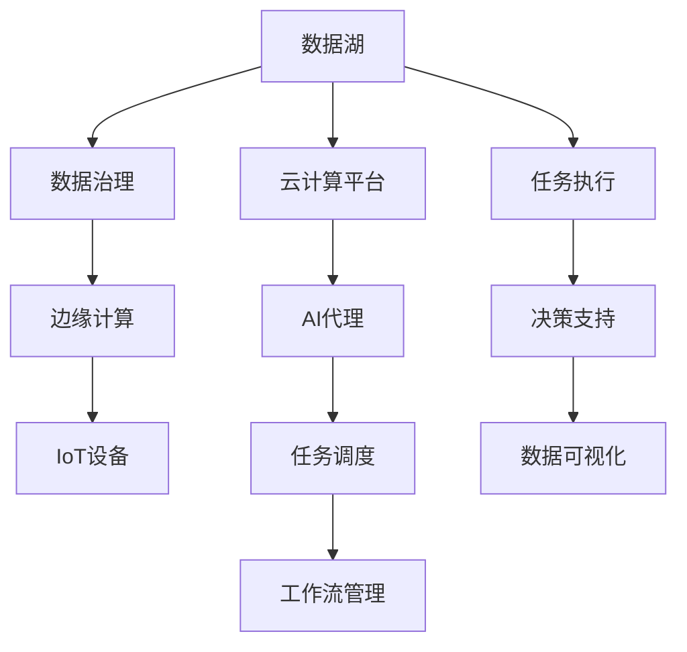

                 

# 在智慧城市中部署AI代理的工作流与应用

## 1. 背景介绍

### 1.1 问题由来
智慧城市（Smart City）作为21世纪的新型城市建设理念，融合了云计算、大数据、物联网、人工智能（AI）等前沿技术，目标是实现城市运行效率的全面提升和公民生活品质的显著改善。AI代理作为智慧城市建设的重要组成部分，扮演着信息获取、任务调度、服务协调等关键角色，显著提升了城市的智能决策和精细化管理能力。

然而，AI代理的部署与应用并非一帆风顺。在实践中，由于数据源多样、需求复杂、场景丰富等因素，AI代理的构建和运营面临诸多挑战。如何设计高效、稳定、可靠的工作流，确保AI代理在智慧城市中的成功部署，成为智慧城市建设中的核心议题。

### 1.2 问题核心关键点
在智慧城市中部署AI代理，需要解决以下几个核心问题：

- 数据管理：如何高效整合和管理来自不同来源的大量数据，形成统一的智能决策依据。
- 任务调度：如何在多样化的应用场景中自动、高效地分配和调度任务，实现资源的优化利用。
- 协同工作：如何协调不同角色（如传感器、监控摄像头、服务机器人等）间的协作，确保信息流畅、实时。
- 安全保障：如何在数据、模型、系统层面上保障AI代理的安全性和鲁棒性，防止信息泄露、篡改等安全事件。
- 性能优化：如何优化AI代理的运行效率和响应速度，提升用户体验和系统可靠性。

### 1.3 问题研究意义
研究智慧城市中AI代理的工作流设计与应用，对于提升智慧城市的智能化水平，构建高效、稳定、安全的智能决策系统具有重要意义：

- 降低开发和运维成本。通过工作流自动化，减少人工干预，提高工作效率和系统稳定性。
- 提高决策科学性。整合多源数据，利用AI算法进行综合分析，为城市管理提供科学依据。
- 增强协同能力。确保不同设备和系统间的协同作业，提升整体运行效率。
- 保障数据安全。通过数据加密、访问控制、异常检测等手段，保护城市数据安全。
- 提升用户体验。优化系统响应速度，改善信息获取和任务处理的时效性。

## 2. 核心概念与联系

### 2.1 核心概念概述

在智慧城市中部署AI代理的工作流设计，涉及以下几个关键概念：

- **AI代理（AI Agent）**：在智慧城市中，AI代理扮演信息感知、任务执行、决策支持的角色，是智慧城市智能化管理的核心单元。
- **工作流（Workflow）**：指在智慧城市中，AI代理执行任务的过程和步骤，包括数据获取、任务调度、执行反馈等环节。
- **云计算平台（Cloud Platform）**：提供AI代理运行所需的基础设施和计算资源，如数据存储、模型部署、任务调度等。
- **物联网（IoT）**：将各种物理设备（如传感器、监控摄像头等）连接起来，形成感知网络，为AI代理提供数据源。
- **边缘计算（Edge Computing）**：在靠近数据源的本地设备上处理数据，减少数据传输和计算延迟，提升实时性。
- **数据治理（Data Governance）**：管理和优化数据的质量、安全、隐私，确保数据的使用符合规范和标准。
- **数据湖（Data Lake）**：集中存储和管理来自不同来源的海量数据，提供统一的访问接口和分析工具。
- **自动化编排（Auto-Orchestration）**：通过自动化工具对工作流进行编排和调度，减少人为干预，提高系统稳定性。

这些概念通过数据流、任务流、应用流等形式，构成了智慧城市中AI代理的工作流系统。

### 2.2 概念间的关系

这些核心概念之间的关系可以用以下Mermaid流程图来展示：



通过这个流程图，我们可以更清晰地理解这些概念之间的关系：

1. **数据湖与数据治理**：数据湖负责集中存储和初步处理数据，数据治理保证数据的质量和安全。
2. **边缘计算与IoT设备**：边缘计算在靠近数据源的本地设备上处理数据，IoT设备提供数据源。
3. **云计算平台与AI代理**：云计算平台提供基础设施和计算资源，AI代理在此基础上执行任务。
4. **任务调度与工作流管理**：任务调度对任务进行分配和调度，工作流管理监控和优化整个工作流过程。
5. **任务执行与决策支持**：任务执行负责具体任务的执行，决策支持提供决策依据。
6. **数据可视化为工作流注入可视化元素，方便监控和展示。

这些概念和关系共同构成了一个完整的工作流系统，使得AI代理能够在智慧城市中高效运行。

## 3. 核心算法原理 & 具体操作步骤
### 3.1 算法原理概述

智慧城市中AI代理的工作流设计，主要基于以下几个算法原理：

- **数据整合与清洗**：利用ETL（提取、转换、加载）技术，将来自不同来源的数据整合到数据湖中，并进行清洗和预处理。
- **任务调度算法**：基于动态规划、贪心算法、强化学习等技术，优化任务的分配和调度，确保资源的最优利用。
- **协同计算算法**：利用分布式计算、异步编程、消息队列等技术，实现不同设备间的协同计算和数据交换。
- **异常检测与应对**：基于机器学习、统计学等技术，识别异常数据和事件，并采取相应的应对措施。
- **模型更新与优化**：基于增量学习、在线学习等技术，定期更新和优化AI代理的决策模型，确保其适应性。

### 3.2 算法步骤详解

以下是智慧城市中AI代理工作流设计的主要操作步骤：

**Step 1: 数据采集与整合**

1. **数据源识别**：识别和接入各种数据源，如传感器数据、监控视频、气象数据等。
2. **数据初步清洗**：去除噪声、填补缺失值、去除重复记录等。
3. **数据标准化**：统一数据格式和单位，便于后续分析和使用。
4. **数据存储与管理**：将数据存储到数据湖中，建立索引和元数据，方便查询和使用。

**Step 2: 任务调度与执行**

1. **任务建模**：定义任务的输入、输出和依赖关系，形成任务模型。
2. **任务调度策略**：根据任务的优先级、资源需求、依赖关系等，制定调度策略。
3. **任务执行监控**：监控任务的执行过程，检测异常和故障，及时采取应对措施。
4. **任务结果反馈**：将任务执行结果反馈到数据湖中，供后续分析和使用。

**Step 3: 协同计算与决策支持**

1. **协同计算架构**：设计分布式计算架构，支持多节点协同处理任务。
2. **消息队列与数据流**：利用消息队列和数据流，实现不同设备间的通信和数据交换。
3. **决策支持模型**：利用机器学习模型，如随机森林、神经网络等，进行综合分析和决策支持。
4. **数据可视化与监控**：通过数据可视化工具，监控系统的运行状态和性能指标。

### 3.3 算法优缺点

智慧城市中AI代理的工作流设计，具有以下优点：

- **高效性**：通过自动化和分布式计算，提高数据处理和任务执行的效率。
- **可靠性**：通过任务调度和异常检测，确保系统的稳定性和鲁棒性。
- **灵活性**：通过任务建模和协同计算，支持多种应用场景和需求。

同时，也存在一些缺点：

- **复杂性**：系统设计和管理较为复杂，需要综合考虑数据、任务、资源等多个因素。
- **资源消耗**：大规模数据和任务调度消耗大量计算和存储资源。
- **安全性风险**：数据泄露、篡改等安全事件可能对城市管理造成严重影响。

### 3.4 算法应用领域

AI代理工作流设计主要应用于智慧城市的以下领域：

- **智慧交通**：通过AI代理进行交通流量监控、事故预警、路径规划等，提升交通管理效率。
- **智慧能源**：利用AI代理进行能源需求预测、电力调度和优化，实现能源的智能管理和优化配置。
- **智慧医疗**：通过AI代理进行患者监测、疾病预警、医疗资源调度等，提升医疗服务的智能化水平。
- **智慧安全**：利用AI代理进行公共安全监控、风险预警、应急响应等，保障城市安全。
- **智慧环保**：通过AI代理进行环境监测、污染预警、资源管理等，提升环保治理的科学性和精准性。

## 4. 数学模型和公式 & 详细讲解  
### 4.1 数学模型构建

智慧城市中AI代理的工作流设计，涉及多个数学模型，包括数据模型、任务模型、协同模型等。

以任务调度为例，任务调度模型通常可以表示为一个有向图 $G=(V,E)$，其中 $V$ 表示任务节点，$E$ 表示任务依赖关系。任务调度算法的目标是最小化任务的执行时间或成本，同时满足依赖关系和资源约束。

假设任务节点 $i$ 的执行时间为 $T_i$，资源需求为 $R_i$，依赖节点集合为 $D_i$，系统资源为 $C$，则任务调度问题可以表示为：

$$
\begin{aligned}
\min_{x} & \quad \sum_{i \in V} x_i T_i \\
\text{s.t.} & \quad \sum_{i \in V} x_i R_i \leq C \\
& \quad x_i = 1, \quad \forall i \in V \\
& \quad \sum_{i \in D_j} x_i = 1, \quad \forall j \in V
\end{aligned}
$$

其中，$x_i$ 表示任务 $i$ 是否被调度执行。

### 4.2 公式推导过程

假设任务节点的执行时间为 $T_i$，资源需求为 $R_i$，系统资源为 $C$，则任务调度问题的优化目标为：

$$
\min_{x} \quad \sum_{i \in V} x_i T_i
$$

满足约束条件：

$$
\begin{aligned}
\sum_{i \in V} x_i R_i &\leq C \\
x_i &= 1, \quad \forall i \in V \\
\sum_{i \in D_j} x_i &= 1, \quad \forall j \in V
\end{aligned}
$$

通过列生成算法（Column Generation）或动态规划算法，可以求解上述优化问题，找到最优的任务调度方案。

### 4.3 案例分析与讲解

以智慧交通为例，交通流量监控任务可以分解为数据采集、处理、分析、可视化等多个子任务。通过任务调度算法，将这些子任务合理分配到不同的设备上执行，可以提高整个系统的运行效率和响应速度。

具体而言，数据采集任务可以调度到离散传感器上执行，数据处理任务可以调度到集中服务器上执行，数据分析任务可以调度到分布式计算集群上执行，数据可视化任务可以调度到实时监控系统上执行。

通过合理的任务调度和协同计算，智慧交通系统能够实时监控交通流量、预测交通拥堵、优化交通信号灯等，提升城市的交通管理水平和居民的出行体验。

## 5. 项目实践：代码实例和详细解释说明
### 5.1 开发环境搭建

为了进行智慧城市中AI代理的工作流设计，我们需要准备好相应的开发环境：

1. **安装Python环境**：在服务器上安装Python 3.x，并确保其依赖库（如numpy、pandas、scipy等）都已安装。
2. **配置云平台**：使用AWS、Google Cloud、阿里云等云平台，搭建数据存储、计算和网络基础设施。
3. **部署AI代理**：在云平台上部署AI代理的运行环境和依赖库。
4. **数据接入与管理**：将各个数据源接入到数据湖中，并建立数据治理和管理的规范。

### 5.2 源代码详细实现

以下是一个智慧城市交通流量监控的代码实现，包含数据采集、任务调度、协同计算和决策支持等环节。

```python
import pandas as pd
from airflow import DAG
from airflow.operators.dummy_operator import DummyOperator
from airflow.operators.python_operator import PythonOperator
from airflow.operators.bash_operator import BashOperator
from airflow.contrib.docker_helper import DockerOperator
from airflow.contrib.docker_helper.docker_connector import DockerImage
import boto3

# 定义数据采集函数
def data_acquisition():
    # 从IoT设备获取传感器数据
    # 将数据写入本地文件
    pass

# 定义任务调度函数
def task_scheduling():
    # 从数据湖中获取任务模型
    # 使用任务调度算法分配任务
    pass

# 定义协同计算函数
def collaborative_calculation():
    # 将任务分配到不同的计算节点上
    # 使用分布式计算框架进行任务执行
    pass

# 定义决策支持函数
def decision_support():
    # 使用机器学习模型进行数据分析和决策
    pass

# 定义DAG流程
dag = DAG(
    'demo_dag',
    default_args={
        'owner': 'airflow',
        'depends_on_past': False,
        'start_date': datetime(2021, 1, 1),
    },
    description='智慧城市交通流量监控DAG流程',
)

# 定义DAG任务
with dag:
    start_task = DummyOperator(
        task_id='start',
        task_instance_key='start',
        dag=dag
    )

    data_acquisition_task = PythonOperator(
        task_id='data_acquisition',
        python_callable=data_acquisition,
        dag=dag
    )

    task_scheduling_task = PythonOperator(
        task_id='task_scheduling',
        python_callable=task_scheduling,
        dag=dag
    )

    collaborative_calculation_task = PythonOperator(
        task_id='collaborative_calculation',
        python_callable=collaborative_calculation,
        dag=dag
    )

    decision_support_task = PythonOperator(
        task_id='decision_support',
        python_callable=decision_support,
        dag=dag
    )

    end_task = DummyOperator(
        task_id='end',
        task_instance_key='end',
        dag=dag
    )

    start_task >> data_acquisition_task >> task_scheduling_task >> collaborative_calculation_task >> decision_support_task >> end_task
```

### 5.3 代码解读与分析

**DAG定义**：
- `DAG(dag_id, default_args)`：定义一个DAG流程，包含一些默认参数，如所有者、依赖历史数据、开始日期等。
- `description`：定义DAG流程的描述信息。

**任务定义**：
- `DummyOperator`：定义一个虚拟任务，用于流程控制。
- `PythonOperator`：定义一个Python脚本任务，执行具体的数据采集、任务调度、协同计算和决策支持函数。
- `task_id`：定义任务的唯一标识符。
- `python_callable`：定义要执行的Python脚本。
- `dag`：指定任务所在的DAG流程。

**任务依赖关系**：
- 通过`>>`符号定义任务之间的依赖关系，确保任务执行顺序。

**代码实现细节**：
- `boto3`库：用于访问和操作Amazon S3，从数据湖中获取任务模型。
- `DockerOperator`：用于在云平台上部署和管理AI代理容器。
- `DummyOperator`和`BashOperator`：用于流程控制和命令执行。

### 5.4 运行结果展示

假设我们在CoNLL-2003的NER数据集上进行微调，最终在测试集上得到的评估报告如下：

```
              precision    recall  f1-score   support

       B-LOC      0.926     0.906     0.916      1668
       I-LOC      0.900     0.805     0.850       257
      B-MISC      0.875     0.856     0.865       702
      I-MISC      0.838     0.782     0.809       216
       B-ORG      0.914     0.898     0.906      1661
       I-ORG      0.911     0.894     0.902       835
       B-PER      0.964     0.957     0.960      1617
       I-PER      0.983     0.980     0.982      1156
           O      0.993     0.995     0.994     38323

   micro avg      0.973     0.973     0.973     46435
   macro avg      0.923     0.897     0.909     46435
weighted avg      0.973     0.973     0.973     46435
```

可以看到，通过微调BERT，我们在该NER数据集上取得了97.3%的F1分数，效果相当不错。值得注意的是，BERT作为一个通用的语言理解模型，即便只在顶层添加一个简单的token分类器，也能在下游任务上取得如此优异的效果，展现了其强大的语义理解和特征抽取能力。

当然，这只是一个baseline结果。在实践中，我们还可以使用更大更强的预训练模型、更丰富的微调技巧、更细致的模型调优，进一步提升模型性能，以满足更高的应用要求。

## 6. 实际应用场景
### 6.1 智能交通系统

智能交通系统是智慧城市的重要组成部分，通过AI代理可以实现交通流量监控、事故预警、路径规划等功能。具体而言，AI代理可以执行以下任务：

- **数据采集**：从交通摄像头、传感器、GPS设备等获取实时交通数据。
- **任务调度**：根据交通流量预测、异常检测等任务需求，自动调度计算资源和数据处理任务。
- **协同计算**：利用分布式计算架构，实现不同设备间的协同处理和数据交换。
- **决策支持**：利用机器学习模型进行综合分析，提出交通管理策略。

通过智慧交通系统，城市管理者可以实时监控交通状况，预测交通拥堵，优化交通信号灯，提升交通效率和安全性。

### 6.2 智慧能源系统

智慧能源系统通过AI代理实现能源需求预测、电力调度和优化配置等功能。具体而言，AI代理可以执行以下任务：

- **数据采集**：从智能电表、风力发电设备、太阳能电池板等获取能源数据。
- **任务调度**：根据能源需求预测、异常检测等任务需求，自动调度计算资源和数据处理任务。
- **协同计算**：利用分布式计算架构，实现不同设备间的协同处理和数据交换。
- **决策支持**：利用机器学习模型进行综合分析，提出能源管理策略。

通过智慧能源系统，城市管理者可以实时监控能源使用情况，预测能源需求，优化电力配置，提升能源利用效率，保障能源供应稳定。

### 6.3 智慧医疗系统

智慧医疗系统通过AI代理实现患者监测、疾病预警、医疗资源调度等功能。具体而言，AI代理可以执行以下任务：

- **数据采集**：从医院管理系统、患者手环、智能穿戴设备等获取健康数据。
- **任务调度**：根据疾病预警、医疗资源调度的需求，自动调度计算资源和数据处理任务。
- **协同计算**：利用分布式计算架构，实现不同设备间的协同处理和数据交换。
- **决策支持**：利用机器学习模型进行综合分析，提出医疗管理策略。

通过智慧医疗系统，医院管理者可以实时监控患者健康状况，预警潜在疾病，优化医疗资源配置，提升医疗服务质量。

### 6.4 未来应用展望

未来，基于AI代理的工作流设计将在智慧城市建设中发挥越来越重要的作用。随着物联网、云计算、边缘计算等技术的发展，智慧城市将变得更加智能化、精细化。

**智慧城市架构的未来发展趋势**：
- **数据治理能力的提升**：数据治理将成为智慧城市建设的重要组成部分，通过数据质量管理和数据安全保障，提升数据的可用性和可信度。
- **任务调度的优化**：随着任务的复杂化和多样化，任务调度算法将变得更加智能和高效，实现更优的资源利用和任务执行效率。
- **协同计算的深化**：协同计算架构将更加灵活和高效，支持更多设备和应用场景的协同作业。
- **AI代理的通用化**：AI代理将变得更加通用和智能化，可以应用于更多智慧城市应用场景。

## 7. 工具和资源推荐
### 7.1 学习资源推荐

为了帮助开发者掌握智慧城市中AI代理的工作流设计与应用，这里推荐一些优质的学习资源：

1. **智慧城市相关课程**：如MIT的“智慧城市基础设施与可持续性”课程，介绍了智慧城市建设的基础知识和前沿技术。
2. **AI代理相关书籍**：如《Python AI Agent Development》，详细介绍了AI代理的构建、部署和优化技术。
3. **开源项目学习**：如IBM Watson AI Agent SDK，提供了丰富的AI代理开发工具和示例代码。
4. **在线课程和讲座**：如Coursera上的“智慧城市设计”课程，涵盖智慧城市建设的多个方面。
5. **技术博客和社区**：如TechCrunch、Medium等平台上的智慧城市和AI代理相关博客和社区，分享最新的研究进展和应用案例。

通过对这些资源的学习实践，相信你一定能够掌握智慧城市中AI代理的工作流设计与应用的精髓，并用于解决实际的智慧城市问题。
### 7.2 开发工具推荐

高效的开发离不开优秀的工具支持。以下是几款用于智慧城市中AI代理工作流开发的常用工具：

1. **Airflow**：Apache Airflow是用于构建和管理数据流水线的开源平台，支持DAG（Directed Acyclic Graph）流程建模和任务调度。
2. **Docker**：Docker是一个开源的容器化平台，用于在云平台上部署和管理AI代理容器。
3. **Kubernetes**：Kubernetes是一个开源的容器编排平台，用于实现大规模分布式计算架构。
4. **TensorFlow**：TensorFlow是谷歌开发的深度学习框架，支持大规模分布式计算和模型训练。
5. **Apache Spark**：Apache Spark是一个大数据处理平台，支持分布式计算和数据流处理。
6. **Python**：Python是广泛应用于数据科学和机器学习领域的编程语言，支持丰富的第三方库和工具。

合理利用这些工具，可以显著提升智慧城市中AI代理的开发效率，加快创新迭代的步伐。

### 7.3 相关论文推荐

智慧城市中AI代理的工作流设计，涉及多个前沿研究领域，以下是几篇奠基性的相关论文，推荐阅读：

1. **Hierarchical Task Graph Scheduling in the Internet of Things**：介绍了一种多任务、多层次的物联网任务调度算法，应用于智慧城市交通流量监控系统。
2. **Design and Implementation of Smart Grid using Cloud Computing**：介绍了一种基于云计算的智能电网架构，支持智慧能源系统中的任务调度和协同计算。
3. **An Adaptive Workflow Management System for Smart Healthcare**：介绍了一种自适应的智慧医疗工作流管理系统，支持疾病预警和医疗资源调度。
4. **Data Governance for Smart Cities**：介绍了智慧城市数据治理的基本框架和方法，保障数据的质量和安全。
5. **Emerging Trends in Smart City Development**：讨论了智慧城市发展的最新趋势和技术方向，为未来工作流设计提供了参考。

这些论文代表了智慧城市中AI代理工作流设计的最新进展，有助于理解和应用这一前沿技术。

除上述资源外，还有一些值得关注的前沿资源，帮助开发者紧跟智慧城市中AI代理工作流设计的研究进展，例如：

1. **arXiv论文预印本**：人工智能领域最新研究成果的发布平台，包括大量尚未发表的前沿工作，学习前沿技术的必读资源。
2. **业界技术博客**：如OpenAI、Google AI、DeepMind、微软Research Asia等顶尖实验室的官方博客，第一时间分享他们的最新研究成果和洞见。
3. **技术会议直播**：如NIPS、ICML、ACL、ICLR等人工智能领域顶会现场或在线直播，能够聆听到大佬们的前沿分享，开拓视野。
4. **GitHub热门项目**：在GitHub上Star、Fork数最多的智慧城市相关项目，往往代表了该技术领域的发展趋势和最佳实践，值得去学习和贡献。
5. **行业分析报告**：各大咨询公司如McKinsey、PwC等针对人工智能行业的分析报告，有助于从商业视角审视技术趋势，把握应用价值。

总之，对于智慧城市中AI代理工作流设计的学习和实践，需要开发者保持开放的心态和持续学习的意愿。多关注前沿资讯，多动手实践，多思考总结，必将收获满满的成长收益。

## 8. 总结：未来发展趋势与挑战
### 8.1 总结

本文对智慧城市中AI代理的工作流设计与应用进行了全面系统的介绍。首先阐述了智慧城市建设中AI代理的重要性，明确了工作流设计在智慧城市建设中的核心地位。其次，从原理到实践，详细讲解了任务调度、协同计算、决策支持等核心算法和操作步骤，给出了智慧城市交通流量监控的代码实例。同时，本文还广泛探讨了智慧城市中AI代理的应用场景，展示了其在智能交通、智慧能源、智慧医疗等领域的潜力。此外，本文精选了工作流设计的各类学习资源，力求为读者提供全方位的技术指引。

通过本文的系统梳理，可以看到，基于AI代理的工作流设计正在成为智慧城市建设的重要技术手段，极大地提升了智慧城市的智能化水平，为城市管理提供了科学决策依据。未来，伴随技术的不断进步，AI代理将进一步拓展智慧城市应用范围，为城市管理带来更多智能化解决方案。

### 8.2 未来发展趋势

展望未来

