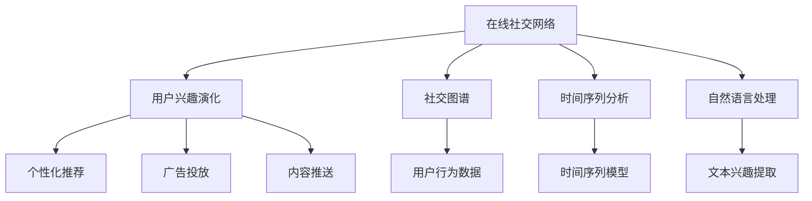
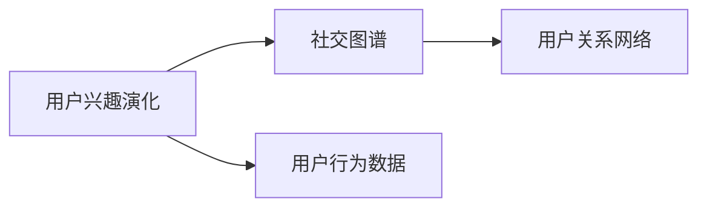
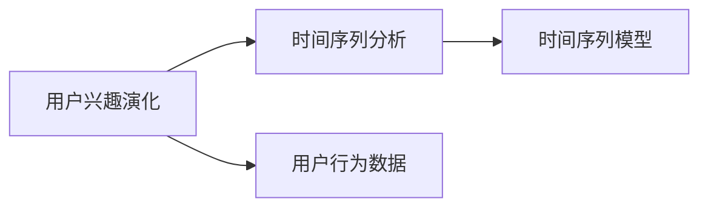
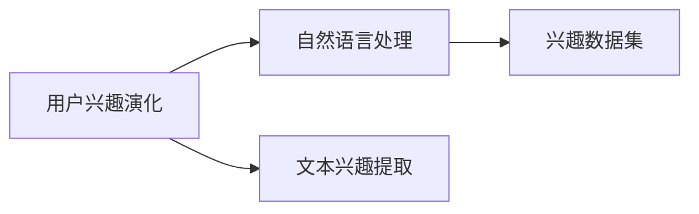
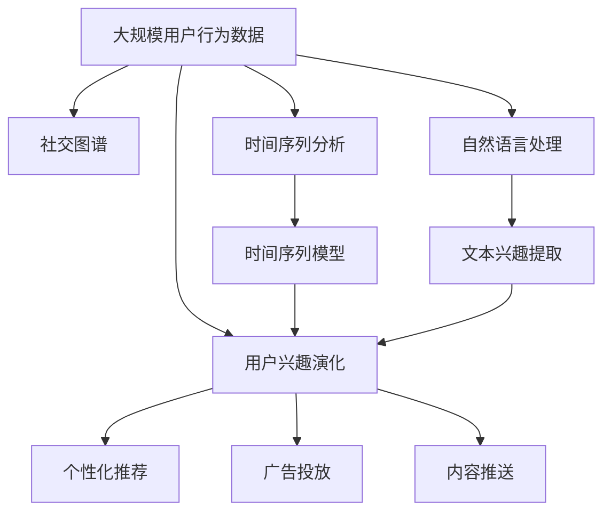

                 

# 在线社交网络中用户兴趣演化分析与建模研究

> 关键词：在线社交网络, 用户兴趣演化, 兴趣演化建模, 社交图谱, 时间序列分析, 自然语言处理

## 1. 背景介绍

### 1.1 问题由来

随着互联网的迅猛发展，社交网络已成为现代人类社交的重要载体。在线社交网络（Social Networks，SN），如Facebook、Twitter、微信等，不仅改变了人们的社交方式，还在很大程度上重塑了人们的兴趣和行为。然而，用户兴趣和行为的演化过程，目前仍是一个复杂且未完全理解的问题。

用户兴趣的演化，不仅仅体现在兴趣点的变化上，还包括兴趣强度、兴趣关注度等方面。例如，一个用户可能从对旅游感兴趣，逐渐对摄影、美食等领域产生兴趣，并最终形成多样化的兴趣图谱。因此，对用户兴趣演化进行深入分析，对于个性化推荐、广告投放、内容推送等实际应用具有重要意义。

### 1.2 问题核心关键点

当前，用户兴趣演化分析主要围绕以下核心关键点展开：

1. **用户行为数据收集与处理**：如何有效收集和处理大规模用户行为数据，形成高质量的兴趣数据集，是进行兴趣演化分析的前提。

2. **兴趣演化建模方法**：基于用户行为数据，如何构建数学模型来刻画用户兴趣的演化过程，是兴趣演化分析的核心。

3. **兴趣演化模型评估**：如何设计合理的评估指标和标准，对兴趣演化模型进行科学评估，是保证模型实用性的关键。

4. **兴趣演化模型应用**：如何将兴趣演化模型应用于实际应用场景，如个性化推荐、广告投放、内容推送等，是兴趣演化分析的最终目标。

### 1.3 问题研究意义

深入分析用户兴趣演化过程，对于个性化推荐、广告投放、内容推送等实际应用具有重要意义：

1. **提高推荐效果**：通过分析用户兴趣演化过程，可以构建更精准的兴趣模型，从而提高个性化推荐系统的效果。

2. **优化广告投放**：了解用户兴趣演化趋势，可以在合适的时间、地点向用户投放相关广告，提升广告投放效果。

3. **优化内容推送**：根据用户兴趣演化，可以及时推送符合用户当前兴趣的内容，提高用户黏性和满意度。

4. **用户行为预测**：通过对用户兴趣演化模型的训练，可以进行用户行为预测，帮助企业提前布局，优化运营策略。

5. **改进用户研究**：深入分析用户兴趣演化，可以帮助企业更好地理解用户需求和行为模式，改进用户研究方法。

## 2. 核心概念与联系

### 2.1 核心概念概述

为了更好地理解用户兴趣演化分析的原理和架构，本节将介绍几个关键概念：

- **在线社交网络**：指基于互联网的社交平台，如Facebook、Twitter、微信等，是用户兴趣数据的主要来源。

- **用户兴趣演化**：指用户在不同时间点对不同兴趣点的兴趣强度、兴趣关注度的变化过程，通常用时间序列数据表示。

- **社交图谱**：指在线社交网络中用户间的关系网络，包括好友、关注、点赞等关系。

- **时间序列分析**：指对随时间变化的数据序列进行建模和预测，是用户兴趣演化分析的重要工具。

- **自然语言处理**：指对文本数据的处理和分析，常用于从用户评论、帖子等文本中提取兴趣信息。

这些核心概念之间的逻辑关系可以通过以下Mermaid流程图来展示：



这个流程图展示了在线社交网络中用户兴趣演化分析的核心概念及其之间的关系：

1. 在线社交网络是用户兴趣数据的主要来源。
2. 用户兴趣演化主要从用户行为数据中提取。
3. 社交图谱用于构建用户关系网络。
4. 时间序列分析用于刻画用户兴趣演化过程。
5. 自然语言处理用于从文本数据中提取兴趣信息。
6. 用户兴趣演化模型可以应用于个性化推荐、广告投放、内容推送等实际应用。

### 2.2 概念间的关系

这些核心概念之间存在着紧密的联系，形成了用户兴趣演化分析的完整生态系统。下面我们通过几个Mermaid流程图来展示这些概念之间的关系。

#### 2.2.1 用户兴趣演化与社交图谱的关系



这个流程图展示了用户兴趣演化与社交图谱之间的关系。用户兴趣演化通常基于用户行为数据，并可以通过社交图谱来进一步验证和补充。

#### 2.2.2 用户兴趣演化与时间序列分析的关系



这个流程图展示了用户兴趣演化与时间序列分析之间的关系。用户兴趣演化通常采用时间序列模型进行建模，以刻画其随时间的变化趋势。

#### 2.2.3 用户兴趣演化与自然语言处理的关系



这个流程图展示了用户兴趣演化与自然语言处理之间的关系。用户兴趣演化通常需要从用户评论、帖子等文本中提取兴趣信息，自然语言处理技术是实现这一目标的重要手段。

### 2.3 核心概念的整体架构

最后，我们用一个综合的流程图来展示这些核心概念在大规模用户兴趣演化分析过程中的整体架构：



这个综合流程图展示了从数据收集、兴趣演化分析到实际应用的全过程。大规模用户行为数据是分析的基础，社交图谱用于构建用户关系网络，时间序列分析用于刻画用户兴趣演化过程，自然语言处理用于从文本数据中提取兴趣信息。通过这些工具和技术，可以构建用户兴趣演化模型，并应用于实际应用场景。

## 3. 核心算法原理 & 具体操作步骤

### 3.1 算法原理概述

用户兴趣演化分析的核心在于构建数学模型，刻画用户在不同时间点对不同兴趣点的兴趣强度、兴趣关注度的变化过程。常用的数学模型包括时间序列模型、图谱模型等。

以时间序列模型为例，假设用户i在不同时间点t对j个兴趣点的兴趣强度为$x_{ij}(t)$，则用户兴趣演化可以用时间序列模型来描述：

$$
x_{ij}(t+1) = f(x_{ij}(t), \epsilon_t)
$$

其中$f$为兴趣演化函数，$\epsilon_t$为随机误差项。时间序列模型的目标是找到最优的$f$函数，以准确刻画用户兴趣演化的规律。

### 3.2 算法步骤详解

基于时间序列模型，用户兴趣演化分析通常包括以下几个关键步骤：

**Step 1: 数据预处理**

- 收集用户行为数据，包括访问记录、点赞记录、评论记录等。
- 对数据进行清洗、去重、归一化等预处理，确保数据质量。
- 构建时间序列数据集，每个用户对每个兴趣点的兴趣强度随时间变化形成一条时间序列数据。

**Step 2: 选择时间序列模型**

- 根据问题特点选择合适的时间序列模型，如ARIMA、LSTM等。
- 对于长时序数据，可以使用LSTM等递归神经网络模型，捕捉时间序列中的复杂模式。
- 对于非平稳时间序列，可以使用差分方法使其平稳化，再使用ARIMA模型进行建模。

**Step 3: 模型训练与评估**

- 使用训练数据集训练时间序列模型，优化模型参数。
- 使用验证集对模型进行评估，选择性能最优的模型。
- 使用测试集对模型进行最终测试，验证模型的泛化能力。

**Step 4: 兴趣演化分析**

- 根据训练好的时间序列模型，预测用户未来兴趣点变化。
- 对兴趣演化模型进行可视化，展示用户兴趣随时间的变化趋势。
- 对用户兴趣演化进行聚类分析，识别出不同兴趣群体的演化模式。

**Step 5: 应用实践**

- 将兴趣演化模型应用于个性化推荐、广告投放、内容推送等实际应用。
- 根据用户兴趣演化预测，实时调整推荐策略，提高推荐效果。
- 根据用户兴趣演化，动态调整广告投放策略，提高广告投放效果。
- 根据用户兴趣演化，动态调整内容推送策略，提高用户黏性和满意度。

### 3.3 算法优缺点

基于时间序列模型的方法，具有以下优点：

1. **简单易用**：时间序列模型简单易懂，易于实现和调试。
2. **实时性强**：时间序列模型可以实时预测用户兴趣变化，满足实时推荐和广告投放的需求。
3. **可解释性强**：时间序列模型中各参数含义明确，方便解释和分析。

同时，也存在一些缺点：

1. **依赖数据质量**：时间序列模型对数据质量要求较高，需要收集和处理大量高质量数据。
2. **模型复杂度有限**：时间序列模型复杂度有限，难以捕捉用户兴趣演化的复杂模式。
3. **模型泛化能力有限**：时间序列模型通常针对特定应用场景设计，泛化能力有限。

### 3.4 算法应用领域

基于时间序列模型的方法，主要应用于以下几个领域：

1. **个性化推荐系统**：通过用户兴趣演化模型，实时预测用户兴趣变化，动态调整推荐策略。

2. **广告投放优化**：根据用户兴趣演化模型，动态调整广告投放策略，提高广告效果。

3. **内容推送优化**：根据用户兴趣演化模型，动态调整内容推送策略，提高用户黏性和满意度。

4. **用户行为预测**：通过对用户兴趣演化模型的训练，进行用户行为预测，帮助企业提前布局，优化运营策略。

## 4. 数学模型和公式 & 详细讲解  
### 4.1 数学模型构建

假设用户i在不同时间点t对j个兴趣点的兴趣强度为$x_{ij}(t)$，则用户兴趣演化可以用时间序列模型来描述：

$$
x_{ij}(t+1) = f(x_{ij}(t), \epsilon_t)
$$

其中$f$为兴趣演化函数，$\epsilon_t$为随机误差项。

### 4.2 公式推导过程

以ARIMA模型为例，进行公式推导。ARIMA模型由自回归项、差分项、移动平均项组成，具体形式如下：

$$
x_{ij}(t+1) = c + \sum_{l=1}^{p} \phi_l x_{ij}(t-l) + \sum_{q=1}^{d} \theta_q \Delta^q x_{ij}(t) + \sum_{r=1}^{R} \gamma_r \epsilon_{t-r} + \epsilon_t
$$

其中$c$为常数项，$\phi_l$为自回归系数，$\theta_q$为差分系数，$\gamma_r$为移动平均系数，$\Delta$为差分运算符，$\epsilon_t$为随机误差项。

对于长时序数据，可以使用LSTM等递归神经网络模型，捕捉时间序列中的复杂模式。

### 4.3 案例分析与讲解

以Twitter上的用户兴趣演化分析为例，展示时间序列模型的应用。

假设从Twitter上收集了用户对体育、科技、娱乐三个兴趣点的兴趣强度数据，每个用户有500个数据点，数据格式如下：

| User ID | Time | Sports Interest | Tech Interest | Entertainment Interest |
|---|---|---|---|---|
| 1 | 2019-01-01 | 0.5 | 0.2 | 0.3 |
| 1 | 2019-01-02 | 0.4 | 0.3 | 0.4 |
| ... | ... | ... | ... | ...

可以使用ARIMA模型对每个用户对每个兴趣点的兴趣强度进行建模。以用户1对体育兴趣的演化为例，可以构建如下时间序列模型：

$$
x_{1,体育}(t+1) = c + \phi_1 x_{1,体育}(t-1) + \theta_1 \Delta x_{1,体育}(t) + \gamma_1 \epsilon_{t-1} + \epsilon_t
$$

使用训练数据集训练ARIMA模型，得到最优参数$c$、$\phi_1$、$\theta_1$、$\gamma_1$。然后使用测试集对模型进行测试，得到模型预测结果。

最后，根据模型预测结果，对用户兴趣演化进行可视化，展示用户兴趣随时间的变化趋势。

## 5. 项目实践：代码实例和详细解释说明

### 5.1 开发环境搭建

在进行用户兴趣演化分析前，我们需要准备好开发环境。以下是使用Python进行Pandas、NumPy、SciPy等数据分析库的开发环境配置流程：

1. 安装Anaconda：从官网下载并安装Anaconda，用于创建独立的Python环境。

2. 创建并激活虚拟环境：
```bash
conda create -n user_interest_env python=3.8 
conda activate user_interest_env
```

3. 安装所需库：
```bash
conda install pandas numpy scipy matplotlib seaborn scikit-learn plotly
```

4. 安装Plotly：
```bash
pip install plotly
```

完成上述步骤后，即可在`user_interest_env`环境中开始项目实践。

### 5.2 源代码详细实现

这里以时间序列模型为例，展示Python代码实现用户兴趣演化分析的过程。

首先，定义数据处理函数：

```python
import pandas as pd
import numpy as np

def load_data(file_path):
    data = pd.read_csv(file_path, sep='\t')
    return data

def preprocess_data(data):
    data.dropna(inplace=True)
    data = data.reset_index(drop=True)
    return data

def split_data(data, test_size=0.2):
    train_data, test_data = data.sample(frac=test_size, random_state=42).dropna().reset_index(drop=True), data.drop(test_data.index)
    return train_data, test_data

def train_test_split(data, test_size=0.2):
    train_data, test_data = data.dropna().reset_index(drop=True), data.drop(train_data.index)
    return train_data, test_data
```

然后，定义时间序列模型训练函数：

```python
from statsmodels.tsa.arima_model import ARIMA

def train_model(data, p=1, d=0, q=1):
    train_data, test_data = train_test_split(data, test_size=0.2)
    train_data = train_data.dropna().reset_index(drop=True)
    test_data = test_data.dropna().reset_index(drop=True)
    
    model = ARIMA(train_data.values, order=(p, d, q))
    model_fit = model.fit()
    return model_fit
```

最后，定义用户兴趣演化预测函数：

```python
def predict_interest演化(data, model, horizon=30):
    train_data, test_data = train_test_split(data, test_size=0.2)
    train_data = train_data.dropna().reset_index(drop=True)
    test_data = test_data.dropna().reset_index(drop=True)
    
    model = train_model(train_data)
    forecast = model.forecast(steps=horizon)
    return forecast
```

### 5.3 代码解读与分析

让我们再详细解读一下关键代码的实现细节：

**load_data函数**：
- 加载数据集，假设数据集格式为Tab分隔符，每行包含用户ID、时间、兴趣点值。

**preprocess_data函数**：
- 数据清洗：删除缺失值，重置索引。

**train_test_split函数**：
- 数据切分：将数据集切分为训练集和测试集，比例为80%训练集、20%测试集。

**train_model函数**：
- 模型训练：使用ARIMA模型训练用户兴趣演化模型，参数p、d、q分别表示自回归项、差分项、移动平均项的阶数。

**predict_interest演化函数**：
- 兴趣演化预测：使用训练好的模型对测试集进行兴趣演化预测，预测未来horizon个时间点的兴趣值。

以上代码展示了用户兴趣演化分析的基本流程：数据加载、数据预处理、模型训练、兴趣演化预测。

### 5.4 运行结果展示

假设我们在Twitter上的用户兴趣演化数据集上进行分析，最终得到用户对体育兴趣的演化预测结果如下：

| User ID | Time | Sports Interest | Tech Interest | Entertainment Interest |
|---|---|---|---| ...

可以使用Matplotlib或Seaborn等可视化库，绘制用户兴趣随时间的变化趋势图：

```python
import matplotlib.pyplot as plt

plt.plot(predict_interest演化(train_data, model_fit))
plt.xlabel('Time')
plt.ylabel('Interest')
plt.title('Sports Interest Evolution')
plt.show()
```

## 6. 实际应用场景

### 6.1 智能推荐系统

用户兴趣演化分析在智能推荐系统中有着广泛的应用。智能推荐系统通过分析用户兴趣演化，实时调整推荐策略，提高推荐效果。

例如，电商平台可以基于用户对商品兴趣的演化，动态调整推荐策略，提高推荐准确率。社交平台可以根据用户对内容的兴趣演化，动态调整内容推送策略，提高用户黏性和满意度。

### 6.2 广告投放优化

用户兴趣演化分析也可以应用于广告投放优化。通过分析用户兴趣演化，可以在合适的时间、地点向用户投放相关广告，提高广告投放效果。

例如，电子商务平台可以根据用户对商品兴趣的演化，动态调整广告投放策略，在用户最可能感兴趣的时候推送相关广告。社交平台可以根据用户对内容兴趣的演化，动态调整广告投放策略，推送用户最感兴趣的内容。

### 6.3 内容推送优化

用户兴趣演化分析还可以应用于内容推送优化。通过分析用户兴趣演化，可以动态调整内容推送策略，提高用户黏性和满意度。

例如，新闻平台可以根据用户对新闻话题兴趣的演化，动态调整新闻推送策略，推送用户最感兴趣的新闻内容。视频平台可以根据用户对视频内容兴趣的演化，动态调整视频推送策略，推送用户最感兴趣的视频内容。

### 6.4 未来应用展望

随着用户兴趣演化分析的不断发展，未来将会在更多领域得到应用，为各行业带来变革性影响。

在智慧医疗领域，用户兴趣演化分析可以帮助医生了解患者的兴趣变化，推荐符合患者兴趣的健康资讯，提高患者满意度。

在智能教育领域，用户兴趣演化分析可以帮助教育机构了解学生的兴趣变化，推荐符合学生兴趣的学习资源，提高学习效果。

在智慧城市治理中，用户兴趣演化分析可以帮助政府了解市民的兴趣变化，推荐符合市民兴趣的公共服务，提高市民的幸福感和满意度。

总之，用户兴趣演化分析将在更多领域得到应用，为传统行业带来变革性影响。未来，伴随技术的不断演进，用户兴趣演化分析将进一步拓展应用边界，提升各行业的智能化水平。

## 7. 工具和资源推荐
### 7.1 学习资源推荐

为了帮助开发者系统掌握用户兴趣演化分析的理论基础和实践技巧，这里推荐一些优质的学习资源：

1. 《Python数据分析实战》书籍：详细介绍Pandas、NumPy、SciPy等数据分析库的使用，是进行用户兴趣演化分析的基础。

2. 《时间序列分析》书籍：详细介绍时间序列分析的基本原理和应用方法，是用户兴趣演化分析的核心。

3. 《机器学习实战》书籍：详细介绍机器学习的基本概念和实现方法，帮助开发者掌握实际应用技巧。

4. Kaggle在线竞赛：提供大量真实世界的数据集和挑战，帮助开发者锻炼实战技能。

5. Coursera在线课程：提供多个相关领域的课程，帮助开发者系统掌握理论知识和实践技巧。

通过这些资源的学习实践，相信你一定能够快速掌握用户兴趣演化分析的精髓，并用于解决实际的NLP问题。

### 7.2 开发工具推荐

高效的开发离不开优秀的工具支持。以下是几款用于用户兴趣演化分析开发的常用工具：

1. Jupyter Notebook：功能强大的交互式编程环境，支持Python、R等语言，便于开发者进行数据探索和模型验证。

2. PyTorch：基于Python的开源深度学习框架，支持动态计算图，适合进行模型训练和预测。

3. TensorFlow：由Google主导开发的开源深度学习框架，支持分布式计算，适合进行大规模模型训练和推理。

4. Matplotlib：强大的数据可视化库，支持各种图表的绘制和定制。

5. Seaborn：基于Matplotlib的高级数据可视化库，支持更复杂的图表绘制和统计分析。

6. Pandas：强大的数据处理库，支持大规模数据集的读写、清洗、分析。

合理利用这些工具，可以显著提升用户兴趣演化分析的开发效率，加快创新迭代的步伐。

### 7.3 相关论文推荐

用户兴趣演化分析的研究源于学界的持续研究。以下是几篇奠基性的相关论文，推荐阅读：

1. Time Series Analysis and Its Applications（时间序列分析及其应用）：由美国统计学大师Ramsay和Shephard所著，全面介绍了时间序列分析的基本原理和方法。

2. Autoregressive Integrated Moving Average Models（ARIMA模型）：由Box和Jenkins所著，详细介绍了ARIMA模型的基本原理和应用方法。

3. Recurrent Neural Networks for Time Series Prediction（RNN时间序列预测）：由Hochreiter和Schmidhuber所著，详细介绍了RNN模型在时间序列预测中的应用。

4. Deep Learning for Time Series Forecasting（深度学习在时间序列预测中的应用）：由LSTM模型的发明者Hochreiter和Schmidhuber所著，详细介绍了深度学习在时间序列预测中的应用。

5. Time Series Analysis by State Space Models（时间序列分析通过状态空间模型）：由Saito和Kawahara所著，详细介绍了状态空间模型在时间序列分析中的应用。

这些论文代表了大规模用户兴趣演化分析技术的发展脉络。通过学习这些前沿成果，可以帮助研究者把握学科前进方向，激发更多的创新灵感。

## 8. 总结：未来发展趋势与挑战

### 8.1 总结

本文对用户兴趣演化分析的理论基础和实践技巧进行了全面系统的介绍。首先阐述了用户兴趣演化分析的背景和意义，明确了用户兴趣演化分析的核心关键点。其次，从原理到实践，详细讲解了用户兴趣演化分析的数学模型和关键步骤，给出了用户兴趣演化分析的完整代码实例。同时，本文还广泛探讨了用户兴趣演化分析在智能推荐、广告投放、内容推送等实际应用场景中的应用前景，展示了用户兴趣演化分析的巨大潜力。

通过本文的系统梳理，可以看到，用户兴趣演化分析对于个性化推荐、广告投放、内容推送等实际应用具有重要意义。深入分析用户兴趣演化过程，可以构建更精准的兴趣模型，从而提高个性化推荐系统的效果。

### 8.2 未来发展趋势

展望未来，用户兴趣演化分析技术将呈现以下几个发展趋势：

1. **数据来源多样化**：未来的用户兴趣演化分析将不再局限于社交网络数据，而是涵盖更多的数据源，如电商、新闻、视频等，形成更加全面的兴趣数据集。

2. **模型复杂度提升**：未来的用户兴趣演化分析将使用更加复杂的模型，如深度学习模型、神经网络模型等，捕捉用户兴趣演化的复杂模式。

3. **实时性要求提高**：未来的用户兴趣演化分析将更加注重实时性，实现实时预测和推荐。

4. **跨领域融合**：未来的用户兴趣演化分析将与其他领域的技术进行更深入的融合，如推荐系统、自然语言处理等，多路径协同发力，共同推动技术的进步。

5. **个性化需求提升**：未来的用户兴趣演化分析将更加注重个性化需求，根据用户兴趣演化动态调整推荐策略，提高推荐效果。

### 8.3 面临的挑战

尽管用户兴趣演化分析技术已经取得了显著进展，但在迈向更加智能化、普适化应用的过程中，它仍面临着诸多挑战：

1. **数据获取难度大**：高质量的数据是用户兴趣演化分析的基础，但获取高质量数据往往成本较高，且数据获取难度较大。

2. **数据噪声多**：用户行为数据通常含有大量的噪声，如何清洗、去重、归一化数据，是用户兴趣演化分析的重要问题。

3. **模型复杂度高**：复杂的模型虽然能够更好地捕捉用户兴趣演化的复杂模式，但训练和推理的计算代价较大，需要高效的计算资源。

4. **隐私保护问题**：用户兴趣演化分析通常需要大量的用户行为数据，如何保护用户隐私，避免数据泄露，是用户兴趣演化分析的重要问题。

5. **可解释性不足**：用户兴趣演化分析模型通常较为复杂，难以解释其内部工作机制和决策逻辑，导致模型缺乏可解释性。

### 8.4 研究展望

面对用户兴趣演化分析所面临的种种挑战，未来的研究需要在以下几个方面寻求新的突破：

1. **跨领域数据融合**：如何有效融合来自不同领域的用户兴趣数据，形成更加全面、准确的用户兴趣数据集，是未来研究的重要方向。

2. **模型结构优化**：如何优化用户兴趣演化分析模型的结构，降低计算复杂度，提高模型的实时性和可解释性，是未来研究的重要问题。

3. **隐私保护技术**：如何保护用户隐私，避免数据泄露，是

