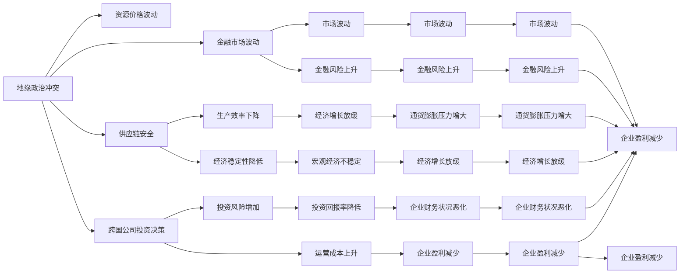
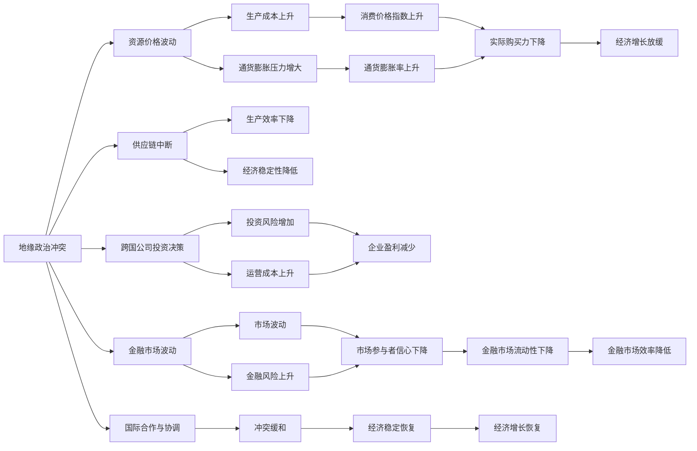

                 

# 地缘冲突加剧的经济后果

> 关键词：地缘政治,经济影响,国际关系,资源价格,供应链安全

## 1. 背景介绍

### 1.1 问题由来
地缘政治冲突（Geopolitical Conflict）通常指的是由于国家间或区域间的政治、军事或经济利益冲突而引起的紧张和对抗。近年来，地缘政治形势越发复杂多变，包括但不限于中俄关系紧张、俄乌冲突、中美贸易摩擦等，这些事件不仅直接影响国家安全，也对全球经济产生了深远的影响。

地缘冲突导致国际能源价格波动、贸易壁垒升高、全球供应链受阻等现象层出不穷，给各国经济带来严重挑战。通过深入研究地缘冲突对经济的影响，有助于制定更为稳健的宏观经济政策和投资策略，更好地应对风险。

### 1.2 问题核心关键点
本文重点讨论地缘政治冲突对经济的具体影响，包括资源价格波动、供应链安全、跨国公司投资决策、金融市场波动等方面，并探讨如何通过政策手段和市场机制缓解这些负面影响。

### 1.3 问题研究意义
研究地缘冲突对经济的影响，具有以下重要意义：

1. **政策制定**：理解地缘政治因素如何影响全球经济，有助于各国政府制定更为有效的经济政策和外交策略，以应对突发事件。
2. **投资策略**：投资者需了解地缘政治风险，优化资产配置，减少风险敞口。
3. **企业应对**：企业应关注地缘政治变化，灵活调整供应链和市场策略，确保运营稳定。
4. **学术研究**：为国际经济学、政治经济学等学科提供新的研究视角和实际案例。

## 2. 核心概念与联系

### 2.1 核心概念概述

为更好地理解地缘冲突对经济的影响，本节将介绍几个核心概念：

- **地缘政治冲突（Geopolitical Conflict）**：国家或区域间因政治、军事或经济利益产生的对抗和紧张状态。
- **资源价格波动（Resource Price Fluctuation）**：地缘冲突引发国际能源和金属等资源价格波动，影响各国经济。
- **供应链安全（Supply Chain Security）**：地缘政治风险导致供应链中断或成本上升，影响生产效率和经济稳定性。
- **跨国公司投资决策（Investment Decisions of Multinational Companies）**：地缘政治风险影响跨国公司在不同地区的投资和运营决策。
- **金融市场波动（Financial Market Volatility）**：地缘政治事件引发资本市场和货币市场波动，影响金融稳定。
- **国际合作与协调（International Cooperation and Coordination）**：国家间合作与协调有助于缓和地缘政治冲突，维护经济稳定。

这些概念之间的逻辑关系可以通过以下Mermaid流程图来展示：



这个流程图展示了大规模地缘政治冲突如何通过资源价格、供应链、跨国公司投资决策、金融市场等多方面，影响全球经济的多个关键节点。

### 2.2 概念间的关系

这些核心概念之间存在复杂的相互关系，进一步展开为以下几方面：

- **资源价格波动与经济增长**：地缘冲突导致能源和金属等资源价格剧烈波动，影响生产成本和通货膨胀水平，进而影响经济增长。
- **供应链安全与国际贸易**：地缘政治风险导致供应链中断或成本上升，影响国际贸易流动和全球市场供给，从而影响各国经济。
- **跨国公司投资决策与全球资本流动**：地缘政治风险影响跨国公司的投资决策，导致资本流动重新配置，影响资本市场的稳定性和效率。
- **金融市场波动与全球金融稳定**：地缘政治事件引发金融市场波动，影响金融资产价格和投资者信心，威胁全球金融稳定。

### 2.3 核心概念的整体架构

最后，我们用一个综合的流程图来展示这些核心概念在宏观经济中的整体架构：



这个综合流程图展示了地缘政治冲突如何通过资源价格、供应链、跨国公司投资决策、金融市场等多方面，影响全球经济的多个关键节点。

## 3. 核心算法原理 & 具体操作步骤
### 3.1 算法原理概述

研究地缘冲突对经济影响的核心算法包括回归分析、向量自回归（VAR）模型、蒙特卡罗模拟等。这些方法主要用来分析地缘政治因素如何影响经济变量，如GDP增长率、通货膨胀率、失业率等。

**回归分析**：通过多元线性回归模型，分析地缘政治因素（如军事冲突、贸易制裁等）对经济变量（如GDP增长率、通货膨胀率等）的影响。

**向量自回归（VAR）模型**：用于分析地缘政治因素对多个经济变量的影响，识别变量间的相互作用关系。

**蒙特卡罗模拟**：通过对经济模型进行模拟，评估不同地缘政治事件场景对经济系统的影响。

### 3.2 算法步骤详解

以下是一个简单的基于回归分析的步骤：

1. **数据准备**：收集地缘政治事件数据（如军事冲突、贸易制裁等）和经济变量数据（如GDP增长率、通货膨胀率等）。
2. **模型构建**：构建多元线性回归模型，设定地缘政治因素为自变量，经济变量为因变量。
3. **模型训练**：使用历史数据对模型进行训练，求解模型的参数。
4. **模型评估**：通过留一法或交叉验证等方法评估模型的拟合效果和泛化能力。
5. **预测分析**：使用训练好的模型对未来经济变量进行预测，分析地缘政治因素对预测结果的影响。

### 3.3 算法优缺点

**优点**：
- 回归分析和VAR模型能够捕捉复杂的多变量关系，分析地缘政治因素对经济变量的系统性影响。
- 蒙特卡罗模拟能够模拟不同的经济场景，评估地缘政治事件的影响范围和程度。

**缺点**：
- 数据可获得性和质量可能存在问题，影响模型的准确性。
- 模型依赖于历史数据，难以预测地缘政治突发事件。
- 多变量模型可能存在多重共线性问题，影响参数估计的稳定性。

### 3.4 算法应用领域

地缘政治冲突的经济影响研究在以下几个领域有重要应用：

1. **宏观经济学**：通过模型分析地缘政治因素对国家宏观经济指标的影响。
2. **国际贸易**：评估地缘政治冲突对国际贸易流动的影响，预测贸易保护主义的趋势。
3. **国际金融**：分析地缘政治事件对国际金融市场的波动和稳定性影响。
4. **投资策略**：评估地缘政治风险，优化跨国公司的投资组合。
5. **政府政策**：为政府制定应对地缘政治风险的经济政策提供依据。

## 4. 数学模型和公式 & 详细讲解  
### 4.1 数学模型构建

我们以回归分析为例，展示地缘政治冲突对经济变量的影响。

设地缘政治因素为$X_i$，经济变量为$Y_j$，$i=1,...,n$，$j=1,...,m$。建立多元线性回归模型：

$$
Y_j = \beta_{0j} + \sum_{i=1}^{n} \beta_{ij} X_i + \epsilon_j
$$

其中，$\beta_{0j}$为截距，$\beta_{ij}$为第$i$个地缘政治因素对第$j$个经济变量的系数，$\epsilon_j$为误差项。

### 4.2 公式推导过程

以最简单的二元回归模型为例，推导最小二乘估计（OLS）的求解过程：

1. **模型构建**：假设有两个地缘政治因素$X_1$和$X_2$，影响经济变量$Y$，模型为：
   $$
   Y = \beta_0 + \beta_1 X_1 + \beta_2 X_2 + \epsilon
   $$

2. **样本数据**：设样本量为$n$，观测数据为$(Y_i, X_{1i}, X_{2i})_{i=1}^{n}$。

3. **最小二乘估计**：求解$\beta_0, \beta_1, \beta_2$，使得残差平方和最小。即：
   $$
   \min \sum_{i=1}^{n} (Y_i - \beta_0 - \beta_1 X_{1i} - \beta_2 X_{2i})^2
   $$
   
   使用矩阵形式表示，可得：
   $$
   \hat{\beta} = (X^T X)^{-1} X^T Y
   $$

4. **模型验证**：通过留一法或交叉验证评估模型的拟合效果和泛化能力。

### 4.3 案例分析与讲解

以中俄关系紧张对石油价格的影响为例，分析地缘政治因素如何通过资源价格波动影响经济：

1. **数据准备**：收集中俄关系紧张事件数据和全球石油价格数据。
2. **模型训练**：构建多元线性回归模型，分析地缘政治因素对石油价格的影响。
3. **模型评估**：使用历史数据验证模型的准确性，评估模型预测能力。
4. **预测分析**：根据模型预测未来中俄关系紧张对石油价格的影响，评估对经济的潜在冲击。

## 5. 项目实践：代码实例和详细解释说明
### 5.1 开发环境搭建

为了进行回归分析，我们需要准备Python开发环境。以下是详细的搭建流程：

1. **安装Anaconda**：从官网下载并安装Anaconda，用于创建独立的Python环境。

2. **创建虚拟环境**：
```bash
conda create -n econ_env python=3.8 
conda activate econ_env
```

3. **安装必要的库**：
```bash
conda install pandas numpy statsmodels matplotlib seaborn jupyter notebook
```

4. **数据准备**：收集并预处理地缘政治因素和经济变量的数据，可以使用Pandas库进行数据清洗和转换。

5. **模型构建**：使用Scikit-learn库构建回归模型，进行参数估计和模型验证。

6. **模型评估**：通过交叉验证和R-squared等指标评估模型性能。

7. **预测分析**：使用训练好的模型进行预测，分析地缘政治因素对经济变量的影响。

### 5.2 源代码详细实现

以下是一个简单的回归分析代码示例，展示如何使用Scikit-learn进行地缘政治因素对经济变量的回归分析：

```python
from sklearn.linear_model import LinearRegression
from sklearn.model_selection import train_test_split
import pandas as pd
import numpy as np

# 加载数据
data = pd.read_csv('geopolitical_data.csv')

# 数据预处理
X = data[['X1', 'X2']]  # 地缘政治因素
y = data['Y']  # 经济变量

# 分割数据集
X_train, X_test, y_train, y_test = train_test_split(X, y, test_size=0.2, random_state=42)

# 建立模型
model = LinearRegression()

# 训练模型
model.fit(X_train, y_train)

# 评估模型
train_score = model.score(X_train, y_train)
test_score = model.score(X_test, y_test)

# 输出结果
print('训练分数:', train_score)
print('测试分数:', test_score)

# 预测分析
future_data = pd.DataFrame({'X1': [1, 2, 3], 'X2': [4, 5, 6]})
pred_y = model.predict(future_data)

print('未来预测:', pred_y)
```

### 5.3 代码解读与分析

- **数据加载**：使用Pandas库从CSV文件中加载数据。
- **数据预处理**：对数据进行清洗和转换，提取地缘政治因素和经济变量。
- **模型构建**：使用Scikit-learn库的LinearRegression类建立线性回归模型。
- **模型训练**：使用train_test_split函数将数据集分割为训练集和测试集，并使用fit方法进行模型训练。
- **模型评估**：使用score方法评估模型在训练集和测试集上的性能，R-squared表示模型拟合优度。
- **预测分析**：使用predict方法对未来数据进行预测，分析地缘政治因素对经济变量的影响。

## 6. 实际应用场景
### 6.1 智能能源管理

地缘政治冲突导致能源价格波动，给能源管理带来了巨大挑战。通过回归分析和VAR模型，可以预测地缘政治因素对能源价格的影响，指导能源市场的稳定运行。

具体应用场景如下：

- **预测能源价格**：收集地缘政治事件数据和历史能源价格数据，建立多元回归模型，预测未来能源价格变化。
- **调整能源策略**：根据预测结果，调整能源采购和储备策略，规避地缘政治风险。
- **风险管理**：开发风险评估模型，量化不同地缘政治事件对能源价格的影响，制定相应的风险管理方案。

### 6.2 全球供应链管理

地缘政治冲突影响全球供应链，导致物流成本上升，生产效率下降。通过回归分析和VAR模型，可以评估地缘政治因素对供应链的影响，优化供应链管理。

具体应用场景如下：

- **评估供应链风险**：收集地缘政治事件数据和供应链数据，建立回归模型，评估不同地缘政治事件对供应链的冲击。
- **优化供应链布局**：根据评估结果，优化供应链布局，减少地缘政治风险带来的影响。
- **制定应急预案**：制定应急预案，确保供应链在突发事件中的稳定性。

### 6.3 跨国公司投资决策

地缘政治冲突影响跨国公司的投资决策，导致资本流动重新配置。通过回归分析和VAR模型，可以评估地缘政治因素对跨国公司投资决策的影响，优化投资策略。

具体应用场景如下：

- **分析投资风险**：收集地缘政治事件数据和跨国公司投资数据，建立回归模型，评估不同地缘政治事件对跨国公司投资的影响。
- **优化投资组合**：根据分析结果，优化跨国公司的投资组合，分散地缘政治风险。
- **制定投资策略**：制定投资策略，选择合适的投资时机和区域，规避地缘政治风险。

### 6.4 未来应用展望

伴随技术的不断进步，地缘政治冲突的经济影响研究将进一步深化。未来可能的应用场景包括：

1. **大数据分析**：利用大数据技术，分析海量地缘政治数据，提取更丰富的经济影响因素。
2. **人工智能模型**：引入人工智能模型，提高地缘政治经济影响的预测精度。
3. **跨学科融合**：与政治学、社会学等学科结合，深入分析地缘政治冲突的根源和长期影响。

## 7. 工具和资源推荐
### 7.1 学习资源推荐

为了深入理解地缘政治冲突的经济影响，推荐以下学习资源：

1. **相关书籍**：《国际经济学导论》、《地缘政治与全球经济》等经典著作。
2. **学术期刊**：如《经济研究》、《国际金融研究》等，涵盖大量相关研究成果和前沿动态。
3. **在线课程**：如Coursera、edX等平台的国际经济学和金融经济学课程，提供系统化的学习资源。

### 7.2 开发工具推荐

为了进行地缘政治冲突的经济影响研究，推荐以下开发工具：

1. **Python**：作为数据科学和机器学习的通用语言，Python提供了丰富的数据处理和建模库。
2. **Jupyter Notebook**：交互式的编程环境，便于调试和展示分析结果。
3. **RStudio**：R语言的集成开发环境，适合统计分析和数据可视化。

### 7.3 相关论文推荐

地缘政治冲突的经济影响研究涉及多个学科，推荐以下相关论文：

1. "The Impact of Geopolitical Events on Global Financial Markets" - 探讨地缘政治事件对全球金融市场波动的影响。
2. "Geopolitical Conflict and Energy Prices: A Panel Data Analysis" - 分析地缘政治冲突对能源价格的长期影响。
3. "International Trade Flows and Geopolitical Risk" - 评估地缘政治风险对国际贸易的影响。

## 8. 总结：未来发展趋势与挑战
### 8.1 研究成果总结

通过上述分析，我们总结了地缘政治冲突对经济影响的核心研究方法，包括回归分析、VAR模型和蒙特卡罗模拟。这些方法能够帮助研究者理解地缘政治因素如何影响经济变量，预测其潜在冲击，优化政策制定和投资策略。

### 8.2 未来发展趋势

未来地缘政治冲突的经济影响研究将呈现以下几个趋势：

1. **数据驱动**：利用大数据和机器学习技术，分析更丰富的地缘政治数据，提升模型的预测精度。
2. **多学科融合**：结合政治学、社会学等学科，深入分析地缘政治冲突的根源和长期影响。
3. **跨领域应用**：拓展地缘政治经济影响的研究范围，涵盖能源、金融、贸易等多个领域。

### 8.3 面临的挑战

地缘政治冲突的经济影响研究面临以下挑战：

1. **数据获取困难**：地缘政治数据获取难度大，数据质量和代表性不足，影响研究结论的可靠性。
2. **模型复杂性高**：地缘政治因素多且复杂，建模过程需要考虑多个变量和交互作用，模型复杂度较高。
3. **政策不确定性**：地缘政治事件具有高度不确定性，政策干预效果难以预测，影响模型的准确性。

### 8.4 研究展望

未来研究需要在以下几个方面进一步探索：

1. **数据获取和处理**：开发更高效的数据采集和清洗工具，提升数据质量和可用性。
2. **模型简化**：简化模型结构，降低计算复杂度，提高模型在实际应用中的效率。
3. **政策模拟**：引入政策模拟和情景分析，评估不同政策干预的效果。

总之，地缘政治冲突对经济的影响是一个复杂而重要的问题，需要进行跨学科的深入研究。通过不断优化数据获取、模型设计和政策干预，我们可以更好地应对地缘政治风险，保障经济稳定。

## 9. 附录：常见问题与解答

**Q1：如何评估地缘政治冲突对经济的潜在影响？**

A: 评估地缘政治冲突对经济的潜在影响，可以采用回归分析、VAR模型和蒙特卡罗模拟等方法。回归分析可以分析地缘政治因素对经济变量的直接和间接影响。VAR模型可以分析变量之间的相互作用关系，评估地缘政治因素的长期影响。蒙特卡罗模拟可以对不同地缘政治事件场景进行模拟，评估其对经济系统的影响。

**Q2：地缘政治冲突对金融市场的具体影响有哪些？**

A: 地缘政治冲突对金融市场的具体影响包括：
1. **市场波动**：地缘政治事件引发市场波动，资本流动性下降，资产价格剧烈波动。
2. **风险偏好变化**：投资者风险偏好下降，避险资产（如黄金、国债等）需求增加，风险资产（如股票、房地产等）需求减少。
3. **市场流动性下降**：突发地缘政治事件导致市场流动性下降，交易成本上升，市场效率降低。
4. **金融制裁**：某些国家可能对受影响地区实施金融制裁，影响资本流动和金融稳定。

**Q3：如何应对地缘政治冲突对供应链的影响？**

A: 应对地缘政治冲突对供应链的影响，可以采取以下措施：
1. **多元化供应链**：建立多元化的供应链体系，分散地缘政治风险。
2. **本地化生产**：在关键原材料和零部件供应上，考虑本地化生产，减少对进口的依赖。
3. **备用供应链**：建立备用供应链，确保在主要供应链受阻时，仍能保证生产稳定。
4. **风险评估和预警**：建立供应链风险评估机制，实时监测地缘政治动态，及时预警并采取应对措施。

**Q4：跨国公司在地缘政治冲突中如何保护自身利益？**

A: 跨国公司在地缘政治冲突中保护自身利益，可以采取以下措施：
1. **风险评估**：对不同地区的政治风险进行评估，制定风险管理策略。
2. **多元化投资**：分散投资区域，减少单一地区的政治风险。
3. **应急预案**：制定应急预案，确保在突发事件中能够快速响应和调整。
4. **本地化运营**：考虑本地化运营，减少地缘政治冲突对生产的影响。

**Q5：如何利用地缘政治数据进行经济影响分析？**

A: 利用地缘政治数据进行经济影响分析，可以采用以下步骤：
1. **数据收集**：收集地缘政治事件数据、经济数据等，确保数据的时效性和完整性。
2. **数据预处理**：对数据进行清洗、转换和标准化，确保数据质量。
3. **模型构建**：选择合适的模型，如回归分析、VAR模型等，建立地缘政治因素和经济变量的关联模型。
4. **模型训练**：使用历史数据对模型进行训练，求解模型参数。
5. **模型评估**：通过交叉验证和R-squared等指标评估模型性能。
6. **预测分析**：使用训练好的模型进行预测，分析地缘政治因素对经济变量的影响。

---

作者：禅与计算机程序设计艺术 / Zen and the Art of Computer Programming

