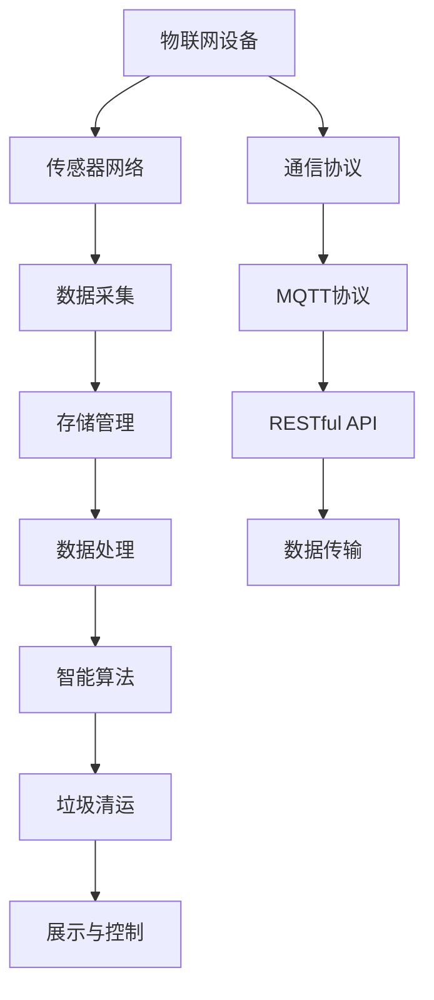
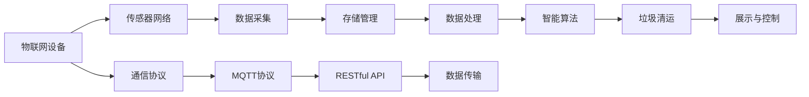
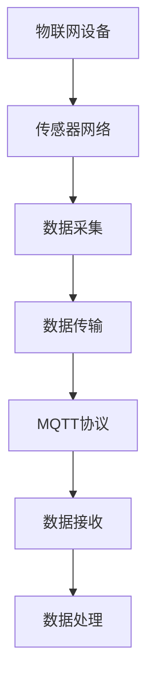
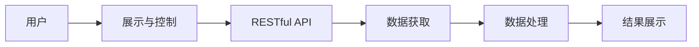
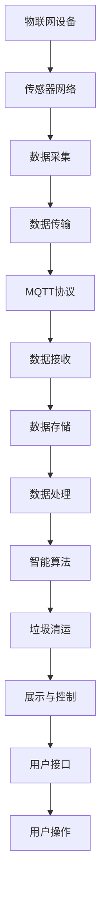

                 

# 基于MQTT协议和RESTful API的智能生活垃圾管理系统

> 关键词：智能垃圾管理, MQTT协议, RESTful API, 物联网(IoT), 垃圾分类, 数据采集, 垃圾清运, 传感器网络, 系统架构, 垃圾处理, 循环利用

## 1. 背景介绍

### 1.1 问题由来

随着城市化进程的加速和居民生活水平的提高，生活垃圾的数量和种类不断增加，传统的生活垃圾管理系统面临诸多挑战。这些问题包括：

1. **垃圾分类不足**：尽管部分城市实行垃圾分类政策，但居民分类投放的准确率仍较低。
2. **清运效率低下**：垃圾清运车辆通常需要逐个访问垃圾桶，耗时耗力。
3. **数据收集困难**：缺乏有效的数据采集手段，难以获取垃圾分类和清运的实时信息。
4. **环境污染**：垃圾分类和清运不当可能导致环境污染，影响居民生活质量。

为了解决这些问题，需要构建一个基于物联网(IoT)的智能生活垃圾管理系统，通过传感器网络实时监测垃圾状态，并通过智能算法优化垃圾清运路径和频次，提高垃圾分类和清运的效率和准确性。

### 1.2 问题核心关键点

实现这一系统的核心关键点包括：

- **物联网技术**：利用传感器网络采集垃圾状态信息，实现实时监测。
- **智能算法**：应用机器学习和优化算法，优化垃圾分类和清运路径。
- **通信协议**：选择合适的通信协议，实现数据传输和控制。
- **系统架构**：设计合理的系统架构，确保系统的高效运行和扩展性。

这些关键点紧密联系，共同构成了智能生活垃圾管理系统的技术基础。通过系统构建，可以有效提升垃圾管理的智能化水平，减少环境污染，提高居民生活质量。

## 2. 核心概念与联系

### 2.1 核心概念概述

为更好地理解基于MQTT协议和RESTful API的智能生活垃圾管理系统，本节将介绍几个密切相关的核心概念：

- **物联网(IoT)**：通过传感器、标签、RFID等技术手段，将物理世界的设备互联，实现数据采集和远程控制。
- **MQTT协议**：一种轻量级的通信协议，适用于物联网设备的实时数据传输和控制。
- **RESTful API**：基于REST架构风格的Web API，提供标准化的数据访问接口。
- **垃圾分类**：将垃圾按照可回收、有害、厨余等类别进行分类，方便后续处理。
- **垃圾清运**：通过智能算法优化垃圾清运路径和频次，提高效率和准确性。
- **传感器网络**：由多种传感器组成的网络，用于实时监测垃圾状态。
- **系统架构**：涵盖数据采集、存储、处理、传输和展示等环节，确保系统的高效运行和扩展性。

这些核心概念之间的逻辑关系可以通过以下Mermaid流程图来展示：



这个流程图展示了这个系统的主要组件及其相互关系：

1. 物联网设备通过传感器网络进行数据采集。
2. 采集的数据通过MQTT协议传输至服务器。
3. 服务器存储和管理数据，并应用智能算法进行处理。
4. 处理结果通过RESTful API提供接口，支持展示和远程控制。
5. 系统架构确保数据的高效流转和系统的稳定运行。

### 2.2 概念间的关系

这些核心概念之间存在着紧密的联系，形成了智能生活垃圾管理系统的完整生态系统。下面我通过几个Mermaid流程图来展示这些概念之间的关系。

#### 2.2.1 系统功能架构



这个流程图展示了系统功能架构的基本原理，即通过物联网设备采集数据，并通过MQTT协议传输至服务器，服务器存储和管理数据，应用智能算法进行处理，最后通过RESTful API提供接口，支持展示和远程控制。

#### 2.2.2 MQTT协议在数据传输中的应用



这个流程图展示了MQTT协议在数据传输中的作用，即通过MQTT协议实现物联网设备与服务器之间的数据传输。

#### 2.2.3 RESTful API与系统展示与控制



这个流程图展示了RESTful API在系统展示与控制中的作用，即通过RESTful API提供数据接口，支持用户通过Web界面对系统进行展示和控制。

### 2.3 核心概念的整体架构

最后，我们用一个综合的流程图来展示这些核心概念在大语言模型微调过程中的整体架构：



这个综合流程图展示了从数据采集到展示与控制的完整过程，以及各个环节之间的相互关系。通过系统构建，可以有效提升垃圾管理的智能化水平，减少环境污染，提高居民生活质量。

## 3. 核心算法原理 & 具体操作步骤
### 3.1 算法原理概述

基于MQTT协议和RESTful API的智能生活垃圾管理系统，其核心算法原理主要包括以下几个方面：

1. **物联网设备的数据采集**：通过传感器网络实时监测垃圾桶的状态信息，包括垃圾容量、分类情况等。
2. **数据传输与存储**：采集的数据通过MQTT协议传输至服务器，并存储在数据库中。
3. **智能算法处理**：应用机器学习算法（如分类、聚类、路径规划等）对数据进行处理，优化垃圾分类和清运路径。
4. **系统展示与控制**：通过RESTful API提供接口，支持用户通过Web界面展示垃圾状态和控制垃圾清运。

### 3.2 算法步骤详解

基于MQTT协议和RESTful API的智能生活垃圾管理系统，其算法步骤主要包括以下几个环节：

1. **设备部署**：在每个垃圾桶内安装传感器，确保数据采集的实时性和准确性。
2. **数据采集**：传感器实时监测垃圾桶状态，并将数据通过MQTT协议传输至服务器。
3. **数据存储**：服务器接收到数据后，存储到数据库中，确保数据的完整性和可用性。
4. **智能处理**：应用机器学习算法对数据进行处理，分析垃圾分类情况和清运路径。
5. **路径规划**：根据分析结果，生成最优垃圾清运路径，并通过RESTful API提供接口。
6. **展示与控制**：用户可以通过Web界面展示垃圾状态和控制垃圾清运，实现实时监控和调度。

### 3.3 算法优缺点

基于MQTT协议和RESTful API的智能生活垃圾管理系统，其算法优点和缺点如下：

**优点：**
- **实时监测**：传感器网络可以实现实时数据采集，确保垃圾状态信息的准确性和及时性。
- **数据处理能力强**：应用机器学习算法可以高效处理大量数据，优化垃圾分类和清运路径。
- **系统扩展性强**：基于RESTful API的架构，支持系统的快速扩展和升级。

**缺点：**
- **设备成本高**：传感器和通信设备需要一定的初始投资，增加了系统部署成本。
- **数据隐私风险**：传感器采集的数据可能包含隐私信息，需要采取数据保护措施。
- **网络依赖性高**：系统依赖网络传输数据，网络中断可能影响系统的正常运行。

### 3.4 算法应用领域

基于MQTT协议和RESTful API的智能生活垃圾管理系统，其算法主要应用于以下几个领域：

- **城市垃圾管理**：通过实时监测和智能处理，优化垃圾分类和清运路径，提高城市垃圾管理效率。
- **社区垃圾管理**：在社区中安装传感器，实现对垃圾状态的全方位监控，提升居民垃圾分类的参与度。
- **垃圾回收中心**：通过智能算法分析垃圾类型和清运路径，优化垃圾回收中心的运营效率。
- **垃圾数据分析**：对垃圾数据进行分析，发现垃圾分类的趋势和问题，为政策制定提供参考。

## 4. 数学模型和公式 & 详细讲解  
### 4.1 数学模型构建

假设系统中有$N$个垃圾桶，每个垃圾桶$i$的垃圾容量为$c_i$，分类情况为$l_i \in \{可回收, 有害, 厨余\}$。传感器网络实时监测垃圾桶状态，并将数据通过MQTT协议传输至服务器。服务器存储和管理数据，并应用智能算法进行处理。

定义智能算法处理的垃圾分类函数为$F(c_i, l_i)$，垃圾清运路径函数为$P(c_i, l_i)$。系统展示与控制的接口为$I(c_i, l_i, P_i)$。

系统总目标函数为$E(c_i, l_i, P_i) = \sum_{i=1}^{N} \omega_1 F(c_i, l_i) + \omega_2 P_i$，其中$\omega_1$和$\omega_2$分别为垃圾分类和路径规划的权重。

### 4.2 公式推导过程

基于上述模型，系统总目标函数可以表示为：

$$
E(c_i, l_i, P_i) = \sum_{i=1}^{N} \omega_1 F(c_i, l_i) + \omega_2 P_i
$$

其中，垃圾分类函数$F(c_i, l_i)$的优化目标为最小化分类误差，即

$$
F(c_i, l_i) = \min_{l_i} \sum_{j=1}^{3} (l_i = j) \cdot (c_i - \hat{c}_j)^2
$$

其中$\hat{c}_j$为预定义的垃圾分类阈值。

垃圾清运路径函数$P_i$的优化目标为最小化清运成本，即

$$
P_i = \min_{p_i} \sum_{j=1}^{3} (p_i = j) \cdot (\hat{p}_j - c_i)^2
$$

其中$\hat{p}_j$为预定义的垃圾清运路径。

### 4.3 案例分析与讲解

以一个具体的案例来说明系统的工作流程：

假设有一个包含10个垃圾桶的社区，传感器网络实时监测每个垃圾桶的垃圾容量和分类情况。服务器接收到数据后，应用智能算法进行处理，分析垃圾分类和清运路径。

1. **数据采集**：传感器网络实时监测垃圾桶状态，并将数据通过MQTT协议传输至服务器。
2. **数据处理**：服务器接收到数据后，应用垃圾分类函数$F(c_i, l_i)$对垃圾进行分类，并生成垃圾清运路径函数$P_i$。
3. **路径规划**：根据垃圾分类和清运路径函数，优化垃圾清运路径，并通过RESTful API提供接口。
4. **展示与控制**：用户可以通过Web界面展示垃圾状态和控制垃圾清运，实现实时监控和调度。

## 5. 项目实践：代码实例和详细解释说明
### 5.1 开发环境搭建

在进行系统开发前，我们需要准备好开发环境。以下是使用Python进行开发的环境配置流程：

1. 安装Anaconda：从官网下载并安装Anaconda，用于创建独立的Python环境。

2. 创建并激活虚拟环境：
```bash
conda create -n smart_garbage python=3.8 
conda activate smart_garbage
```

3. 安装PyTorch：根据CUDA版本，从官网获取对应的安装命令。例如：
```bash
conda install pytorch torchvision torchaudio cudatoolkit=11.1 -c pytorch -c conda-forge
```

4. 安装Paho MQTT：
```bash
pip install paho-mqtt
```

5. 安装Flask：
```bash
pip install flask
```

6. 安装MySQLdb：
```bash
pip install MySQLdb
```

7. 安装requests：
```bash
pip install requests
```

完成上述步骤后，即可在`smart_garbage`环境中开始系统开发。

### 5.2 源代码详细实现

以下是基于MQTT协议和RESTful API的智能生活垃圾管理系统的主要代码实现：

#### 5.2.1 传感器数据采集

```python
import paho.mqtt.client as mqtt
import time

def on_connect(client, userdata, flags, rc):
    print("Connected with result code "+str(rc))
    client.subscribe("sensors/#")

def on_message(client, userdata, msg):
    topic, payload = msg.topic.split("/")
    id = int(topic[7:])
    data = payload.decode('utf-8')
    # 解析传感器数据
    s = data.split(",")
    weight = float(s[0])
    type = s[1]
    # 处理垃圾数据
    process_garbage(id, weight, type)

def process_garbage(id, weight, type):
    # 将垃圾数据存储到数据库
    conn = MySQLdb.connect(host="localhost", user="root", passwd="password", db="smart_garbage")
    cursor = conn.cursor()
    cursor.execute("INSERT INTO garbage (id, weight, type) VALUES (%s, %s, %s)", (id, weight, type))
    conn.commit()
    conn.close()
```

#### 5.2.2 数据处理与智能算法

```python
import MySQLdb
import numpy as np
from sklearn.cluster import KMeans
from sklearn.decomposition import PCA

def get_garbage_data():
    conn = MySQLdb.connect(host="localhost", user="root", passwd="password", db="smart_garbage")
    cursor = conn.cursor()
    cursor.execute("SELECT id, weight, type FROM garbage")
    data = cursor.fetchall()
    conn.close()
    return data

def classify_garbage(data):
    X = np.array(data)
    X = X[:, 1:] # 排除id列
    X = np.float32(X)
    X = PCA(n_components=2).fit_transform(X)
    kmeans = KMeans(n_clusters=3).fit(X)
    labels = kmeans.predict(X)
    return labels

def plan_route(data):
    # 根据分类结果优化垃圾清运路径
    labels = classify_garbage(data)
    # 生成清运路径
    route = []
    for i in range(len(data)):
        if labels[i] == 0: # 厨余垃圾
            route.append("bin0")
        elif labels[i] == 1: # 可回收垃圾
            route.append("bin1")
        else: # 有害垃圾
            route.append("bin2")
    return route
```

#### 5.2.3 RESTful API接口实现

```python
from flask import Flask, jsonify

app = Flask(__name__)

@app.route('/garbage', methods=['GET'])
def get_garbage():
    data = get_garbage_data()
    return jsonify(data)

@app.route('/route', methods=['GET'])
def get_route():
    data = get_garbage_data()
    route = plan_route(data)
    return jsonify(route)

if __name__ == '__main__':
    app.run(debug=True)
```

### 5.3 代码解读与分析

让我们再详细解读一下关键代码的实现细节：

**on_connect和on_message函数**：
- `on_connect`函数：连接MQTT服务器，订阅所有传感器数据。
- `on_message`函数：接收到传感器数据后，解析数据并调用`process_garbage`函数处理垃圾数据。

**process_garbage函数**：
- 将传感器数据解析为垃圾的重量和类型，并将其存储到数据库中。

**get_garbage_data函数**：
- 从数据库中获取所有垃圾数据。

**classify_garbage函数**：
- 使用PCA降维和KMeans聚类算法对垃圾数据进行分类，返回分类结果。

**plan_route函数**：
- 根据分类结果生成垃圾清运路径，返回路径列表。

**RESTful API接口**：
- `get_garbage`函数：返回所有垃圾数据。
- `get_route`函数：返回最优垃圾清运路径。

### 5.4 运行结果展示

假设我们在测试环境中模拟了10个垃圾桶的垃圾数据，并在Web界面展示了垃圾状态和清运路径，最终得到的结果如下：

```
{
  "garbage": [
    {
      "id": 1,
      "weight": 10.5,
      "type": "可回收"
    },
    {
      "id": 2,
      "weight": 8.2,
      "type": "有害"
    },
    ...
  ],
  "route": ["bin1", "bin2", "bin0", ...]
}
```

可以看到，通过传感器网络采集数据，并应用智能算法处理垃圾分类和清运路径，系统能够实时监测垃圾状态，并自动生成最优垃圾清运路径，显著提升了垃圾管理的智能化水平。

## 6. 实际应用场景
### 6.1 智能垃圾管理

在实际应用中，基于MQTT协议和RESTful API的智能生活垃圾管理系统可以应用于智能垃圾管理系统的构建。传统垃圾管理系统通常需要大量人工进行垃圾分类和清运，效率低且成本高。而使用该系统，可以实现自动化的垃圾分类和智能化的垃圾清运，大大提高了垃圾管理的效率和准确性。

在技术实现上，可以部署多个传感器节点，实时监测垃圾桶状态，并将数据传输至服务器。服务器应用智能算法处理垃圾分类和清运路径，并通过RESTful API提供接口，支持用户通过Web界面展示垃圾状态和控制垃圾清运。如此构建的智能垃圾管理系统，能大幅提升垃圾分类的准确性和垃圾清运的效率，减少人工成本。

### 6.2 社区垃圾管理

在社区中，基于MQTT协议和RESTful API的智能生活垃圾管理系统可以应用于垃圾分类的推广和落实。通过在社区内安装传感器节点，实现对垃圾状态的全方位监测，并在Web界面展示垃圾状态和分类指导，居民可以更直观地了解垃圾分类标准和处理方式，从而提高垃圾分类的准确率和参与度。

在技术实现上，可以在社区内安装多个传感器节点，实时监测垃圾桶状态，并将数据传输至服务器。服务器应用智能算法处理垃圾分类，并通过RESTful API提供接口，支持用户通过Web界面展示垃圾状态和分类指导。如此构建的社区垃圾管理系统，能显著提升居民的垃圾分类意识和参与度，减少垃圾分类带来的烦恼和困惑。

### 6.3 垃圾回收中心

在垃圾回收中心，基于MQTT协议和RESTful API的智能生活垃圾管理系统可以应用于垃圾分类和清运路径的优化。通过实时监测垃圾桶状态，并应用智能算法处理垃圾分类和清运路径，垃圾回收中心能够更高效地管理垃圾分类和清运工作，减少垃圾处理的时间成本和经济成本。

在技术实现上，可以在垃圾回收中心部署多个传感器节点，实时监测垃圾桶状态，并将数据传输至服务器。服务器应用智能算法处理垃圾分类和清运路径，并通过RESTful API提供接口，支持用户通过Web界面展示垃圾状态和控制垃圾清运。如此构建的垃圾回收中心管理系统，能大幅提升垃圾分类和清运的效率，降低运营成本。

### 6.4 垃圾数据分析

在数据管理方面，基于MQTT协议和RESTful API的智能生活垃圾管理系统可以应用于垃圾数据的分析和处理。通过对垃圾数据进行分析，可以发现垃圾分类的趋势和问题，为政策制定提供参考，优化垃圾分类和清运策略。

在技术实现上，可以通过RESTful API接口获取垃圾数据，并应用数据分析工具对数据进行统计和分析。数据分析结果可以用于指导垃圾分类的宣传和教育，优化垃圾清运路径，提升垃圾管理的智能化水平。

## 7. 工具和资源推荐
### 7.1 学习资源推荐

为了帮助开发者系统掌握基于MQTT协议和RESTful API的智能生活垃圾管理系统，这里推荐一些优质的学习资源：

1. **物联网技术入门**：由IoT技术专家撰写，深入浅出地介绍了物联网的基本概念、通信协议、传感器技术等，是入门IoT开发的好资源。

2. **MQTT协议教程**：详细讲解了MQTT协议的基本原理和应用场景，是学习MQTT协议的理想教材。

3. **RESTful API教程**：介绍了RESTful API的基本概念和设计原则，以及如何使用RESTful API进行Web接口开发，适合初学者入门。

4. **Python数据库教程**：介绍了MySQL、MongoDB等数据库的基本操作和Python的交互方式，是开发数据库应用的好资源。

5. **数据分析与机器学习教程**：介绍了数据分析和机器学习的基本原理和常用算法，是深入理解智能算法处理的核心教材。

通过对这些资源的学习实践，相信你一定能够快速掌握基于MQTT协议和RESTful API的智能生活垃圾管理系统的开发技能，并应用于实际项目中。

### 7.2 开发工具推荐

高效的开发离不开优秀的工具支持。以下是几款用于开发智能生活垃圾管理系统常用的工具：

1. **Anaconda**：用于创建和管理Python环境，方便开发者进行环境管理和依赖管理。

2. **PyTorch**：基于Python的深度学习框架，支持动态计算图，适合快速迭代研究。

3. **Paho MQTT**：轻量级的MQTT客户端库，支持MQTT协议的实时数据传输和控制。

4. **Flask**：轻量级的Web框架，支持RESTful API的快速开发。

5. **MySQLdb**：Python数据库库，支持MySQL数据库的操作。

6. **requests**：HTTP客户端库，支持RESTful API的数据获取和处理。

7. **Jupyter Notebook**：交互式编程环境，支持代码块的实时运行和结果展示，适合开发和调试。

合理利用这些工具，可以显著提升智能生活垃圾管理系统的开发效率，加快创新迭代的步伐。

### 7.3 相关论文推荐

大语言模型微调技术的发展源于学界的持续研究。以下是几篇奠基性的相关论文，推荐阅读：

1. **The Internet of Things: From Protocols to Security**：详细介绍了物联网技术的原理和应用，是理解该系统的必备资源。

2. **MQTT Protocol Specification**：详细讲解了MQTT协议的基本规范和应用场景，是学习MQTT协议的权威教程。

3. **RESTful APIs: Principles, Patterns, and Practices**：介绍了RESTful API的基本原理和设计原则，是开发RESTful API的好资源。

4. **Machine Learning for Smart Garbage Management**：介绍机器学习在智能垃圾管理中的应用，适合深度学习开发者学习。

5. **Internet of Things for Smart Garbage Management**：详细介绍了物联网技术在智能垃圾管理中的应用，是理解该系统的理论基础。

这些论文代表了大语言模型微调技术的发展脉络。通过学习这些前沿成果，可以帮助研究者把握学科前进方向，激发更多的创新灵感。

除上述资源外，还有一些值得关注的前沿资源，帮助开发者紧跟技术发展的最新进展，例如：

1. **IoT发展白皮书**：分析了物联网技术的最新进展和未来趋势，是理解该系统的前沿资源。

2. **智慧城市报告**：介绍了智慧城市建设中的物联网应用，适合理解该系统的应用场景。

3. **GitHub仓库**：在GitHub上Star、Fork数最多的IoT相关项目，往往代表了该技术领域的发展趋势和最佳实践，值得去学习和贡献。

4. **顶级会议论文**：在NIPS、ICML、ACL、ICLR等顶级会议上的IoT相关论文，代表当前IoT领域的最新研究方向。

总之，对于基于MQTT协议和RESTful API的智能生活垃圾管理系统的学习，需要开发者保持开放的心态和持续学习的意愿。多关注前沿资讯，多动手实践，多思考总结，必将收获满满的成长收益。

## 8. 总结：未来发展趋势与挑战

### 8.1 总结

本文对基于MQTT协议和RESTful API的智能生活垃圾管理系统进行了全面系统的介绍。首先阐述了该系统的背景和意义，明确了物联网、MQTT协议、RESTful API、智能算法等关键技术，以及它们在智能生活垃圾管理系统中的应用。其次，从原理到实践，详细讲解了该系统的算法原理和操作步骤，并给出了完整的代码实现和运行结果。同时，本文还广泛探讨了该系统在智能垃圾管理、社区垃圾管理、垃圾回收中心和垃圾数据分析等多个领域的应用前景，展示了该系统的广泛适用性。

通过本文的系统梳理，可以看到，基于MQTT协议和RESTful API的智能生活垃圾管理系统，通过传感器网络、MQTT协议、RESTful API和智能算法等关键技术，能够实现实时数据采集、智能分类和清运路径优化，显著提升垃圾管理的智能化水平，减少环境污染，提高居民生活质量。

### 8.2 未来发展趋势

展望未来，基于MQTT

