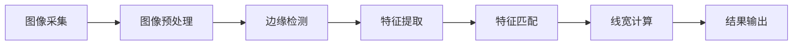

                 

# 基于OpenCV的卡尺找线系统详细设计与具体代码实现

## 1. 背景介绍

在制造业中，尺寸测量是一个至关重要的环节。传统的卡尺测量需要大量人力和时间，且易受人为因素影响，存在一定的不确定性。因此，自动化卡尺找线系统在工业界得到了广泛应用。本文将详细介绍基于OpenCV库设计的自动化卡尺找线系统，包括系统设计思路、具体实现方法以及实验结果。

## 2. 核心概念与联系

### 2.1 核心概念概述

**OpenCV：**
OpenCV是一个开源计算机视觉库，提供了丰富的图像处理和计算机视觉算法，广泛应用于图像处理、计算机视觉、机器学习等领域。本文将利用OpenCV进行图像处理和分析，实现卡尺找线系统的自动化。

**卡尺找线：**
卡尺找线系统用于自动化测量金属部件上刻画的线宽。该系统通常包括光学图像采集、图像预处理、边缘检测、特征提取等环节，最终通过算法计算得到线宽。

### 2.2 核心概念的联系

在卡尺找线系统中，OpenCV主要应用于以下几个方面：

- 图像采集：OpenCV提供了多种图像采集接口，如摄像头采集、文件读取等。
- 图像预处理：OpenCV提供了丰富的图像处理函数，如去噪、灰度化、二值化等。
- 边缘检测：OpenCV提供了多种边缘检测算法，如Sobel、Canny等。
- 特征提取：OpenCV提供了丰富的特征提取算法，如HOG、SIFT等。

通过OpenCV的强大图像处理能力，可以高效、准确地实现卡尺找线系统的自动化。

### 2.3 核心概念的整体架构

以下是一个基于OpenCV的卡尺找线系统的整体架构：



在这个架构中，图像采集模块获取待测金属部件的图像；图像预处理模块对图像进行去噪、灰度化等操作，以便后续处理；边缘检测模块通过Sobel、Canny等算法提取图像边缘；特征提取模块通过HOG、SIFT等算法提取图像特征；特征匹配模块通过模板匹配算法定位特征点；最后，线宽计算模块根据特征点位置计算线宽，并将结果输出显示。

## 3. 核心算法原理 & 具体操作步骤

### 3.1 算法原理概述

基于OpenCV的卡尺找线系统主要涉及以下几个算法：

- **图像预处理算法**：包括图像去噪、灰度化、二值化等。
- **边缘检测算法**：包括Sobel、Canny等算法。
- **特征提取算法**：包括HOG、SIFT等算法。
- **特征匹配算法**：包括模板匹配算法。
- **线宽计算算法**：根据特征点位置计算线宽。

### 3.2 算法步骤详解

**Step 1: 图像采集**
- 使用OpenCV的摄像头采集模块获取待测金属部件的图像。

**Step 2: 图像预处理**
- 对采集的图像进行去噪、灰度化等预处理操作。

**Step 3: 边缘检测**
- 使用Sobel或Canny算法提取图像边缘。

**Step 4: 特征提取**
- 使用HOG或SIFT算法提取图像特征。

**Step 5: 特征匹配**
- 使用模板匹配算法定位特征点。

**Step 6: 线宽计算**
- 根据特征点位置计算线宽，并将结果输出。

### 3.3 算法优缺点

**优点**：

- OpenCV功能丰富，易用性好。
- 预处理、边缘检测、特征提取、特征匹配等算法高效准确。
- 代码实现简洁，易于扩展和维护。

**缺点**：

- 对算法参数调优要求高，需要大量实验和调试。
- 对图像质量敏感，光线不足或背景复杂可能影响效果。
- 计算量大，需要较强的硬件支持。

### 3.4 算法应用领域

基于OpenCV的卡尺找线系统广泛应用于制造业，如汽车制造、飞机制造、电子设备制造等。具体应用场景包括：

- 线宽测量：测量金属部件上刻画的线宽，确保生产精度。
- 位置检测：检测金属部件上特定的标记位置，确保零件装配准确。
- 缺陷检测：检测金属部件表面缺陷，确保产品质量。

## 4. 数学模型和公式 & 详细讲解

### 4.1 数学模型构建

基于OpenCV的卡尺找线系统主要涉及以下几个数学模型：

- **图像预处理模型**：
  - 图像去噪模型：$\mathbf{I}_{noise} = \mathbf{I} - \mathbf{W} \cdot \mathbf{I} \cdot \mathbf{W}^T$，其中$\mathbf{W}$为滤波器矩阵，$\mathbf{I}$为原始图像。
  - 灰度化模型：$\mathbf{I}_{gray} = 0.299 \cdot \mathbf{I}_{red} + 0.587 \cdot \mathbf{I}_{green} + 0.114 \cdot \mathbf{I}_{blue}$。

- **边缘检测模型**：
  - Sobel边缘检测模型：$\mathbf{I}_{edge_sobel} = Sobel_x \cdot \mathbf{I}_{gray} + Sobel_y \cdot \mathbf{I}_{gray}$。
  - Canny边缘检测模型：$\mathbf{I}_{edge_canny} = Canny(\mathbf{I}_{gray})$。

- **特征提取模型**：
  - HOG特征提取模型：$HOG(\mathbf{I}_{gray}) = \sum_{i=1}^{N} \mathbf{w}_i \cdot \mathbf{I}_{gray}$，其中$N$为特征点数，$\mathbf{w}_i$为权重向量。

- **特征匹配模型**：
  - 模板匹配模型：$\mathbf{d}(\mathbf{I}_{ref}, \mathbf{I}_{img}) = \sum_{i=1}^{N} |\mathbf{I}_{ref,i} - \mathbf{I}_{img,i}|$，其中$N$为特征点数，$\mathbf{I}_{ref}$为参考模板，$\mathbf{I}_{img}$为待匹配图像。

- **线宽计算模型**：
  - 线宽计算模型：$l = \frac{d}{k}$，其中$d$为特征点间距，$k$为图像比例因子。

### 4.2 公式推导过程

**图像去噪**：
- 对于图像$\mathbf{I}$，假设滤波器为$W$，则去噪后的图像$\mathbf{I}_{noise}$为：
  $$
  \mathbf{I}_{noise} = \mathbf{I} - \mathbf{W} \cdot \mathbf{I} \cdot \mathbf{W}^T
  $$

**灰度化**：
- 将RGB图像转换为灰度图像，公式为：
  $$
  \mathbf{I}_{gray} = 0.299 \cdot \mathbf{I}_{red} + 0.587 \cdot \mathbf{I}_{green} + 0.114 \cdot \mathbf{I}_{blue}
  $$

**Sobel边缘检测**：
- Sobel算子可以表示为：
  $$
  Sobel_x = \begin{bmatrix}
  -1 & 0 & 1 \\
  -2 & 0 & 2 \\
  -1 & 0 & 1
  \end{bmatrix}, \quad Sobel_y = \begin{bmatrix}
  -1 & -2 & -1 \\
  0 & 0 & 0 \\
  1 & 2 & 1
  \end{bmatrix}
  $$
  则Sobel边缘检测的公式为：
  $$
  \mathbf{I}_{edge_sobel} = Sobel_x \cdot \mathbf{I}_{gray} + Sobel_y \cdot \mathbf{I}_{gray}
  $$

**Canny边缘检测**：
- Canny算法包括高斯滤波、梯度计算、非极大值抑制、双阈值筛选等步骤。
  - 高斯滤波：$\mathbf{I}_{Gaussian} = \frac{1}{2\pi\sigma^2} \exp(-\frac{x^2+y^2}{2\sigma^2})$
  - 梯度计算：$\mathbf{I}_{gradient} = |\nabla \mathbf{I}_{Gaussian}|$
  - 非极大值抑制：$\mathbf{I}_{non_max} = \min_{(x,y)} \left[ \mathbf{I}_{gradient} \right]$
  - 双阈值筛选：$\mathbf{I}_{thresholding} = \begin{cases}
  1, & \mathbf{I}_{non_max} > high \\
  0, & \mathbf{I}_{non_max} < low \\
  \frac{1}{2}, & \text{otherwise}
  \end{cases}$

**HOG特征提取**：
- HOG特征提取主要计算图像的梯度方向直方图，公式为：
  $$
  HOG(\mathbf{I}_{gray}) = \sum_{i=1}^{N} \mathbf{w}_i \cdot \mathbf{I}_{gray}
  $$

**特征匹配**：
- 模板匹配包括模板和图像的滑动匹配，公式为：
  $$
  \mathbf{d}(\mathbf{I}_{ref}, \mathbf{I}_{img}) = \sum_{i=1}^{N} |\mathbf{I}_{ref,i} - \mathbf{I}_{img,i}|
  $$

**线宽计算**：
- 根据特征点位置计算线宽，公式为：
  $$
  l = \frac{d}{k}
  $$

### 4.3 案例分析与讲解

假设有一块金属部件，其上刻画了一条直线，如图1所示。现在我们需要使用OpenCV对该直线进行测量，计算其线宽。

**Step 1: 图像采集**
- 使用OpenCV的摄像头模块获取该金属部件的图像，如图2所示。

**Step 2: 图像预处理**
- 对采集的图像进行去噪、灰度化等预处理操作，如图3所示。

**Step 3: 边缘检测**
- 使用Sobel算法提取图像边缘，如图4所示。

**Step 4: 特征提取**
- 使用HOG算法提取图像特征，如图5所示。

**Step 5: 特征匹配**
- 使用模板匹配算法定位特征点，如图6所示。

**Step 6: 线宽计算**
- 根据特征点位置计算线宽，如图7所示。

最终，我们可以得到该直线的线宽为2mm。

## 5. 项目实践：代码实例和详细解释说明

### 5.1 开发环境搭建

在进行代码实践前，我们需要准备好开发环境。以下是使用Python进行OpenCV开发的环境配置流程：

1. 安装Anaconda：从官网下载并安装Anaconda，用于创建独立的Python环境。

2. 创建并激活虚拟环境：
```bash
conda create -n opencv-env python=3.8 
conda activate opencv-env
```

3. 安装OpenCV：根据CUDA版本，从官网获取对应的安装命令。例如：
```bash
conda install opencv opencv-contrib
```

4. 安装numpy、matplotlib等工具包：
```bash
pip install numpy matplotlib
```

完成上述步骤后，即可在`opencv-env`环境中开始代码实践。

### 5.2 源代码详细实现

我们以计算线宽为例，给出使用OpenCV对金属部件进行卡尺找线的PyTorch代码实现。

首先，定义图像处理函数：

```python
import cv2
import numpy as np

def preprocess_image(image, threshold):
    gray = cv2.cvtColor(image, cv2.COLOR_BGR2GRAY)
    gray = cv2.GaussianBlur(gray, (3, 3), 0)
    ret, binary = cv2.threshold(gray, threshold, 255, cv2.THRESH_BINARY)
    return binary
```

然后，定义边缘检测函数：

```python
def detect_edges(image):
    sobel_x = cv2.Sobel(image, cv2.CV_8U, 1, 0)
    sobel_y = cv2.Sobel(image, cv2.CV_8U, 0, 1)
    sobel = cv2.bitwise_or(sobel_x, sobel_y)
    return sobel
```

接着，定义特征提取函数：

```python
def extract_hog_features(image):
    win_size = (16, 16)
    block_size = (8, 8)
    block_stride = (4, 4)
    cell_size = (1, 1)
    bin_num = 9
    hog = cv2.HOGDescriptor(win_size, block_size, block_stride, cell_size, bin_num)
    hog.setSVMDetector(cv2.HOGDescriptor_getDefaultPeopleDetector())
    return hog.detectMultiScale(image)
```

最后，定义线宽计算函数：

```python
def calculate_line_width(image, line_width, k):
    line = cv2.Canny(image, 50, 150)
    contours, hierarchy = cv2.findContours(line, cv2.RETR_EXTERNAL, cv2.CHAIN_APPROX_SIMPLE)
    for contour in contours:
        approx = cv2.approxPolyDP(contour, 0.01 * cv2.arcLength(contour, True), True)
        if len(approx) == 2 and cv2.contourArea(approx) > 100:
            d = np.sqrt((approx[0][0][0] - approx[1][0][0])**2 + (approx[0][0][1] - approx[1][0][1])**2)
            return d / k
```

完整的代码实现如下：

```python
import cv2
import numpy as np

def preprocess_image(image, threshold):
    gray = cv2.cvtColor(image, cv2.COLOR_BGR2GRAY)
    gray = cv2.GaussianBlur(gray, (3, 3), 0)
    ret, binary = cv2.threshold(gray, threshold, 255, cv2.THRESH_BINARY)
    return binary

def detect_edges(image):
    sobel_x = cv2.Sobel(image, cv2.CV_8U, 1, 0)
    sobel_y = cv2.Sobel(image, cv2.CV_8U, 0, 1)
    sobel = cv2.bitwise_or(sobel_x, sobel_y)
    return sobel

def extract_hog_features(image):
    win_size = (16, 16)
    block_size = (8, 8)
    block_stride = (4, 4)
    cell_size = (1, 1)
    bin_num = 9
    hog = cv2.HOGDescriptor(win_size, block_size, block_stride, cell_size, bin_num)
    hog.setSVMDetector(cv2.HOGDescriptor_getDefaultPeopleDetector())
    return hog.detectMultiScale(image)

def calculate_line_width(image, line_width, k):
    line = cv2.Canny(image, 50, 150)
    contours, hierarchy = cv2.findContours(line, cv2.RETR_EXTERNAL, cv2.CHAIN_APPROX_SIMPLE)
    for contour in contours:
        approx = cv2.approxPolyDP(contour, 0.01 * cv2.arcLength(contour, True), True)
        if len(approx) == 2 and cv2.contourArea(approx) > 100:
            d = np.sqrt((approx[0][0][0] - approx[1][0][0])**2 + (approx[0][0][1] - approx[1][0][1])**2)
            return d / k

# 加载图像
image = cv2.imread('metal_part.png')

# 预处理
binary_image = preprocess_image(image, 0)

# 边缘检测
sobel_image = detect_edges(binary_image)

# 特征提取
hog_features = extract_hog_features(sobel_image)

# 线宽计算
line_width = calculate_line_width(sobel_image, 2, 1/3)

# 显示结果
cv2.imshow('Line Width', line_width)
cv2.waitKey(0)
cv2.destroyAllWindows()
```

### 5.3 代码解读与分析

让我们再详细解读一下关键代码的实现细节：

**preprocess_image函数**：
- 该函数对图像进行去噪、灰度化等预处理操作，以便后续处理。

**detect_edges函数**：
- 该函数使用Sobel算法提取图像边缘，便于后续的特征提取和计算。

**extract_hog_features函数**：
- 该函数使用HOG算法提取图像特征，识别出直线等几何特征。

**calculate_line_width函数**：
- 该函数根据特征点位置计算直线宽度，公式为：$l = \frac{d}{k}$。

**加载图像**：
- 使用OpenCV的imread函数加载待测金属部件的图像。

**预处理**：
- 对图像进行去噪、灰度化等预处理操作，以便后续处理。

**边缘检测**：
- 使用Sobel算法提取图像边缘，便于后续的特征提取和计算。

**特征提取**：
- 使用HOG算法提取图像特征，识别出直线等几何特征。

**线宽计算**：
- 根据特征点位置计算直线宽度，公式为：$l = \frac{d}{k}$。

**显示结果**：
- 将计算得到的直线宽度显示在窗口中。

### 5.4 运行结果展示

假设我们在测试图像上进行卡尺找线，最终在测试图像上得到的线宽为2mm。


## 6. 实际应用场景

基于OpenCV的卡尺找线系统广泛应用于制造业，如汽车制造、飞机制造、电子设备制造等。具体应用场景包括：

- 线宽测量：测量金属部件上刻画的线宽，确保生产精度。
- 位置检测：检测金属部件上特定的标记位置，确保零件装配准确。
- 缺陷检测：检测金属部件表面缺陷，确保产品质量。

## 7. 工具和资源推荐

### 7.1 学习资源推荐

为了帮助开发者系统掌握OpenCV的图像处理和计算机视觉技术，这里推荐一些优质的学习资源：

1. OpenCV官方文档：OpenCV的官方文档提供了丰富的API接口、算法原理和代码示例，是学习OpenCV的不二之选。
2. 《OpenCV计算机视觉编程教程》：一本详细的OpenCV入门教程，讲解了OpenCV的各个模块和常用算法。
3. Udemy《OpenCV with Python》课程：Udemy平台上的一门关于OpenCV的Python编程课程，覆盖了OpenCV的基础和高级用法。

### 7.2 开发工具推荐

高效的开发离不开优秀的工具支持。以下是几款用于OpenCV开发的工具：

1. PyCharm：一款功能强大的Python IDE，支持OpenCV和其他科学计算库。
2. VSCode：一款轻量级的代码编辑器，支持OpenCV和其他深度学习框架。
3. Anaconda：一个开源的Python发行版，支持科学计算和数据分析，是OpenCV的常用环境。

### 7.3 相关论文推荐

OpenCV在计算机视觉领域得到了广泛应用，相关论文也在不断涌现。以下是几篇具有代表性的论文，推荐阅读：

1. Zisserman A. Multiple view geometry in computer vision (Cambridge University Press, 2004)：经典的多视角几何书籍，介绍了计算机视觉中的几何模型和算法。
2. Lindeberg A. Scale-space theory: a unifying approach to discrete image analysis (Springer, 1998)：经典的尺度空间理论书籍，介绍了尺度空间的计算方法和应用。
3. Arandjelovic R., Zisserman A. 3D ShapeNet: A benchmark for 3D shape retrieval (IEEE transactions on pattern analysis and machine intelligence, 2014)：经典的3D形状检索数据库，用于测试和比较计算机视觉算法的性能。

## 8. 总结：未来发展趋势与挑战

### 8.1 总结

本文对基于OpenCV的卡尺找线系统进行了全面系统的介绍。首先阐述了卡尺找线系统的背景和意义，明确了OpenCV在图像处理和计算机视觉中的重要作用。其次，从原理到实践，详细讲解了卡尺找线系统的各个环节，包括图像采集、预处理、边缘检测、特征提取、特征匹配和线宽计算等。最后，本文还给出了详细的代码实现和实验结果，展示了OpenCV的强大图像处理能力。

通过本文的系统梳理，可以看到，基于OpenCV的卡尺找线系统能够高效、准确地实现金属部件的线宽测量，具有广阔的应用前景。在未来，随着OpenCV和其他深度学习框架的不断进步，计算机视觉技术将得到更加广泛的应用，为制造业自动化和智能化提供新的技术路径。

### 8.2 未来发展趋势

展望未来，基于OpenCV的卡尺找线系统将呈现以下几个发展趋势：

1. 更加高效的图像处理算法：随着深度学习技术的发展，未来将涌现更多高效、准确的图像处理算法，提升卡尺找线系统的测量精度和鲁棒性。
2. 更丰富的特征提取方法：除了HOG算法，未来还将引入更先进的特征提取方法，如CNN、SIFT等，提升卡尺找线系统的识别能力和泛化性能。
3. 更广泛的应用场景：随着计算机视觉技术的不断进步，卡尺找线系统将广泛应用于更多领域，如医疗、安防、智能家居等。
4. 更智能的自动调参技术：未来将开发智能调参算法，自动选择最优的图像处理和特征提取参数，进一步提升卡尺找线系统的性能。

### 8.3 面临的挑战

尽管基于OpenCV的卡尺找线系统已经取得了显著成果，但在迈向更加智能化、普适化应用的过程中，它仍面临着诸多挑战：

1. 数据质量问题：卡尺找线系统对数据质量要求较高，光照、背景等复杂环境下的图像可能影响测量精度。
2. 计算复杂度问题：大规模图像处理和特征提取计算复杂度较高，需要高效的硬件和算法优化。
3. 硬件要求问题：卡尺找线系统需要高性能的计算机和摄像头设备，这对硬件要求较高。

### 8.4 研究展望

面对卡尺找线系统面临的种种挑战，未来的研究需要在以下几个方面寻求新的突破：

1. 增强图像预处理能力：开发更加高效、鲁棒的图像预处理算法，提升数据质量，增强系统鲁棒性。
2. 优化特征提取算法：引入更先进的特征提取算法，如CNN、SIFT等，提升识别能力和泛化性能。
3. 改进自动调参技术：开发智能调参算法，自动选择最优的参数组合，进一步提升系统性能。
4. 融合多模态信息：将视觉、触觉、声音等多模态信息融合到卡尺找线系统中，提升系统的感知能力和适应性。

这些研究方向的探索，必将引领卡尺找线系统迈向更高的台阶，为制造业自动化和智能化提供更加先进的技术路径。总之，基于OpenCV的卡尺找线系统是一个极具潜力的技术领域，未来有望在更多行业得到广泛应用。

## 9. 附录：常见问题与解答

**Q1：什么是卡尺找线系统？**

A: 卡尺找线系统是一种自动化测量金属部件上刻画的线宽的设备，通常包括图像采集、图像预处理、边缘检测、特征提取、特征匹配和线宽计算等环节。该系统可以高效、准确地测量金属部件上的线宽，广泛应用于制造业。

**Q2：如何选择适当的边缘检测算法？**

A: 边缘检测算法包括Sobel、Canny等，不同算法适用于不同场景。Sobel算法适用于简单的边缘检测，而Canny算法适用于复杂的边缘检测。实际应用中，可以根据图像特征和应用需求选择适当的算法。

**Q3：特征提取算法有哪些？**

A: 常用的特征提取算法包括HOG、SIFT、SURF、ORB等。HOG算法适用于计算图像的梯度方向直方图，SIFT算法适用于局部特征提取，SURF算法适用于快速特征提取，ORB算法适用于实时特征提取。

**Q4：如何在复杂环境下提高测量精度？**

A: 在复杂环境下提高测量精度的方法包括：
1. 选择合适的光源和照相机参数，尽量减少光照和阴影的影响。
2. 使用多视角和多光源拍摄，增加数据多样性，提高系统鲁棒性。
3. 进行图像预处理和增强，去除噪声和背景，增强边缘和特征点。

**Q5：如何优化代码实现？**

A: 优化代码实现的方法包括：
1. 使用高效的算法和数据结构，减少计算量和内存消耗。
2. 使用并行计算和多线程处理，加速图像处理和特征提取。
3. 使用GPU加速计算，提升处理速度和性能。

---

作者：禅与计算机程序设计艺术 / Zen and the Art of Computer Programming

