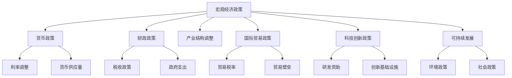
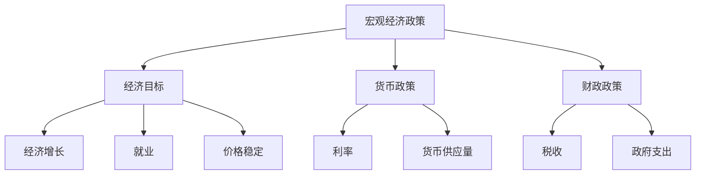
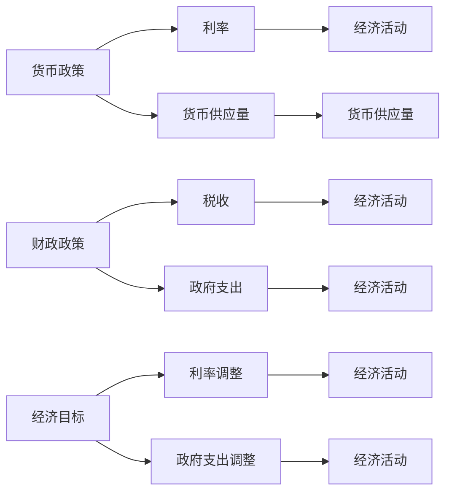
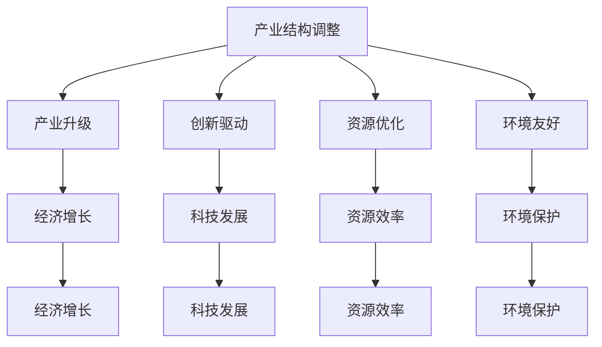
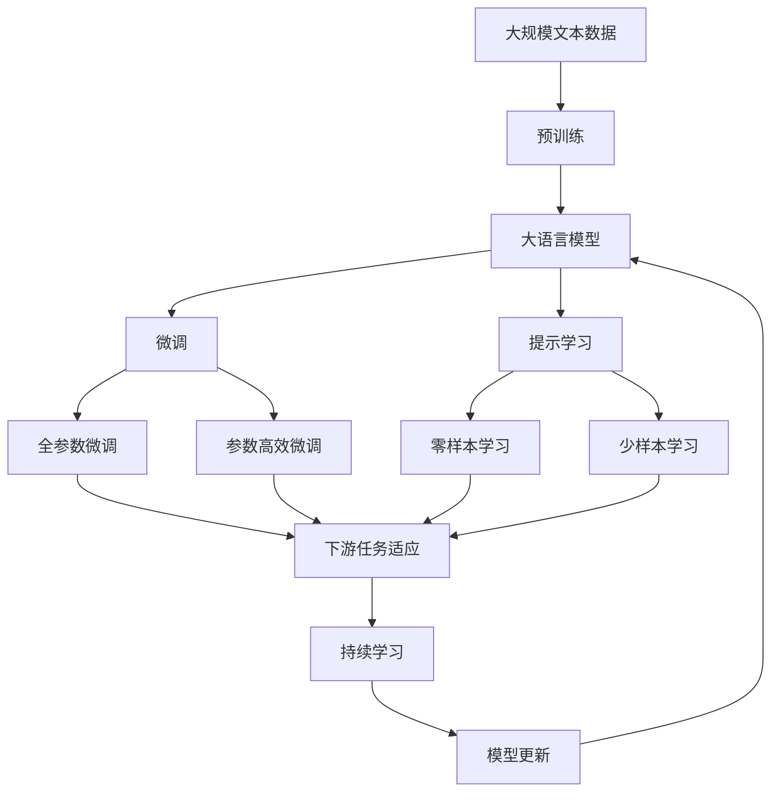

                 

# 全球经济复苏的长期路径

## 1. 背景介绍

### 1.1 问题由来
全球经济复苏一直是经济学家和政策制定者关注的焦点。受新冠疫情的冲击，全球经济在2020年和2021年经历了前所未有的波动。虽然各国政府采取了一系列经济刺激措施，但全球经济尚未完全恢复，且存在不确定性和波动风险。因此，探索全球经济复苏的长期路径，具有重要的理论和实际意义。

### 1.2 问题核心关键点
全球经济复苏的长期路径涉及多个方面，包括宏观经济政策、货币政策、财政政策、贸易政策、产业结构调整等。本文聚焦于如何通过综合运用多种政策手段，推动全球经济持续健康发展。

### 1.3 问题研究意义
研究全球经济复苏的长期路径，有助于政策制定者制定更加科学、有效的宏观调控策略，促进全球经济稳定增长，提升全球经济竞争力和可持续发展能力。同时，对于应对未来可能出现的全球性经济危机，也有重要的参考价值。

## 2. 核心概念与联系

### 2.1 核心概念概述

为更好地理解全球经济复苏的长期路径，本节将介绍几个密切相关的核心概念：

- 宏观经济政策（Macroeconomic Policy）：政府为实现经济目标，对宏观经济运行进行调节的政策措施，包括财政政策和货币政策。
- 货币政策（Monetary Policy）：中央银行通过调整利率、货币供应量等手段，控制通货膨胀、促进就业和稳定经济。
- 财政政策（Fiscal Policy）：政府通过税收、政府支出等手段，调节经济总需求和经济结构。
- 产业结构调整（Industrial Structure Adjustment）：优化产业结构，促进经济高质量发展。
- 国际贸易政策（Trade Policy）：通过调整贸易税率、贸易壁垒等手段，促进国际贸易和全球经济合作。
- 科技创新政策（Science and Technology Policy）：通过提供研发资助、建设创新基础设施等方式，推动科技创新和产业升级。
- 可持续发展（Sustainable Development）：通过平衡经济、社会、环境之间的关系，实现长期稳定发展。

这些核心概念之间的逻辑关系可以通过以下Mermaid流程图来展示：



这个流程图展示了大规模语言模型微调过程中各个核心概念的关系：

1. 宏观经济政策是总的目标和方向，包含了货币政策、财政政策、产业结构调整等具体措施。
2. 货币政策主要通过调整利率和货币供应量，实现宏观经济目标。
3. 财政政策通过税收和政府支出，调节经济总需求和经济结构。
4. 产业结构调整优化产业结构，促进经济高质量发展。
5. 国际贸易政策通过调整贸易税率、贸易壁垒等手段，促进国际贸易和全球经济合作。
6. 科技创新政策通过提供研发资助、建设创新基础设施等方式，推动科技创新和产业升级。
7. 可持续发展通过平衡经济、社会、环境之间的关系，实现长期稳定发展。

这些核心概念共同构成了全球经济复苏的长期路径，使其能够在各种场景下发挥作用。通过理解这些核心概念，我们可以更好地把握全球经济复苏的策略和路径。

### 2.2 概念间的关系

这些核心概念之间存在着紧密的联系，形成了全球经济复苏的完整生态系统。下面我通过几个Mermaid流程图来展示这些概念之间的关系。

#### 2.2.1 宏观经济政策的运行机制



这个流程图展示了宏观经济政策的基本运行机制：

1. 宏观经济政策的总体目标是实现经济增长、就业和价格稳定。
2. 货币政策主要通过调整利率和货币供应量来影响经济活动。
3. 财政政策通过税收和政府支出，调节经济总需求和经济结构。
4. 经济增长、就业和价格稳定通过货币政策和财政政策的实施来实现。

#### 2.2.2 货币政策和财政政策的协同作用



这个流程图展示了货币政策和财政政策的协同作用：

1. 货币政策主要通过利率和货币供应量来调节经济活动。
2. 财政政策主要通过税收和政府支出调节经济总需求和经济结构。
3. 经济目标通过利率和政府支出的调整来实现。
4. 货币政策和财政政策通过协同作用，共同实现经济目标。

#### 2.2.3 产业结构调整的影响



这个流程图展示了产业结构调整的实施效果：

1. 产业结构调整通过产业升级、创新驱动、资源优化、环境友好等方式实现。
2. 产业升级促进科技发展，提升资源效率，改善环境保护。
3. 产业结构调整推动经济增长，实现可持续发展。

### 2.3 核心概念的整体架构

最后，我们用一个综合的流程图来展示这些核心概念在大语言模型微调过程中的整体架构：



这个综合流程图展示了从预训练到微调，再到持续学习的完整过程。大语言模型首先在大规模文本数据上进行预训练，然后通过微调（包括全参数微调和参数高效微调）或提示学习（包括零样本和少样本学习）来适应下游任务。最后，通过持续学习技术，模型可以不断更新和适应新的任务和数据。 通过这些流程图，我们可以更清晰地理解全球经济复苏过程中各个核心概念的关系和作用，为后续深入讨论具体的微调方法和技术奠定基础。

## 3. 核心算法原理 & 具体操作步骤
### 3.1 算法原理概述

全球经济复苏的长期路径涉及多个复杂因素，包括宏观经济政策、货币政策、财政政策、产业结构调整等。本文聚焦于如何通过综合运用多种政策手段，推动全球经济持续健康发展。

全球经济复苏的长期路径，本质上是寻找最优的政策组合，实现宏观经济目标。一般而言，宏观经济政策需要满足以下几个基本目标：

- 经济增长：实现较高的经济增长率。
- 就业：提高就业水平，减少失业率。
- 价格稳定：控制通货膨胀率，保持货币稳定。
- 国际收支平衡：保持国际收支平衡，避免外汇波动。
- 公平与包容：促进经济公平，缩小贫富差距。

这些目标之间存在一定的权衡关系。例如，经济增长和就业之间存在正相关关系，但过度追求经济增长可能导致通货膨胀和贫富差距扩大。因此，在制定经济政策时，需要综合考虑各目标之间的平衡，找到最优的策略组合。

### 3.2 算法步骤详解

全球经济复苏的长期路径涉及多个政策的协同作用，其核心步骤如下：

**Step 1: 制定经济目标**

根据当前经济形势，设定合理的经济目标。例如，确定经济增长率、失业率、通货膨胀率等关键指标。

**Step 2: 选择政策工具**

根据经济目标，选择相应的政策工具。例如，通过调整利率、货币供应量、税收、政府支出等手段，实现经济目标。

**Step 3: 实施政策**

根据政策工具，制定具体的实施方案。例如，中央银行调整利率，政府实施财政赤字刺激计划等。

**Step 4: 监测与评估**

对政策实施效果进行监测和评估。例如，定期发布经济指标，评估经济增长、就业、通货膨胀、国际收支等数据。

**Step 5: 调整政策**

根据监测与评估结果，调整政策实施方案。例如，根据通货膨胀情况调整利率，根据就业情况调整财政支出等。

### 3.3 算法优缺点

全球经济复苏的长期路径涉及多种政策工具的协同作用，具有以下优点和缺点：

**优点：**

- 综合运用多种政策工具，可以更好地应对复杂经济形势。
- 政策工具之间存在相互支持、相互制约的关系，可以避免单一政策的不足。
- 政策工具的多样性可以应对不同的经济环境和挑战。

**缺点：**

- 政策协同作用难度较大，需要多部门之间的协调合作。
- 政策实施效果存在一定的不确定性，难以预测。
- 政策调整频繁可能导致市场不稳定，影响经济信心。

### 3.4 算法应用领域

全球经济复苏的长期路径涉及的多种政策工具，已经在多个领域得到应用，例如：

- 宏观经济政策：用于制定和实施宏观经济调控策略。
- 货币政策：用于控制通货膨胀、促进就业和稳定经济。
- 财政政策：用于调节经济总需求和经济结构。
- 产业结构调整：用于优化产业结构，促进经济高质量发展。
- 国际贸易政策：用于促进国际贸易和全球经济合作。
- 科技创新政策：用于推动科技创新和产业升级。
- 可持续发展：用于平衡经济、社会、环境之间的关系，实现长期稳定发展。

这些政策工具在大规模语言模型微调中也有广泛应用，例如，通过货币政策和财政政策的协同，提升模型的经济预测能力；通过产业结构调整，优化模型对特定领域的理解；通过科技创新政策，提升模型的智能化水平；通过可持续发展政策，增强模型的社会责任和伦理意识。

## 4. 数学模型和公式 & 详细讲解 & 举例说明

### 4.1 数学模型构建

全球经济复苏的长期路径涉及多个复杂的经济指标，可以通过数学模型进行定量分析和预测。

设经济指标向量 $\mathbf{x} = (x_1, x_2, ..., x_n)^T$，其中 $x_i$ 表示第 $i$ 个经济指标。设经济政策向量 $\mathbf{p} = (p_1, p_2, ..., p_m)^T$，其中 $p_i$ 表示第 $i$ 个政策工具。设政策影响矩阵 $\mathbf{A} \in \mathbb{R}^{n \times m}$，其中 $a_{ij}$ 表示第 $i$ 个经济指标对第 $j$ 个政策工具的响应系数。

设政策实施效果向量 $\mathbf{y} = (y_1, y_2, ..., y_m)^T$，其中 $y_i$ 表示第 $i$ 个政策工具的效果。设经济政策模型为：

$$
\mathbf{y} = \mathbf{A}\mathbf{p}
$$

### 4.2 公式推导过程

根据上述模型，我们可以对政策实施效果进行预测和评估。具体步骤如下：

1. 收集历史数据 $\mathbf{X}$ 和 $\mathbf{P}$，其中 $\mathbf{X}$ 表示历史经济指标向量，$\mathbf{P}$ 表示历史政策工具向量。
2. 建立政策影响矩阵 $\mathbf{A}$，可以通过最小二乘法或其他优化算法求解。
3. 对新政策 $\mathbf{p'}$ 进行预测，得到新经济指标 $\mathbf{x'}$：

$$
\mathbf{x'} = \mathbf{A}\mathbf{p'}
$$

4. 对新经济指标进行评估，判断是否达到预期目标。

### 4.3 案例分析与讲解

假设我们要预测某国的通货膨胀率，通过分析历史数据，建立如下经济政策模型：

$$
y = a_1p_1 + a_2p_2 + a_3p_3 + \epsilon
$$

其中 $y$ 表示通货膨胀率，$p_1$ 表示利率，$p_2$ 表示货币供应量，$p_3$ 表示政府支出，$\epsilon$ 表示误差项。

通过求解上述模型，得到 $a_1 = 0.5, a_2 = -0.2, a_3 = 0.1$。现在，我们假设政府决定提高利率和减少政府支出，即 $p_1' = 2, p_3' = -1$，预测新的通货膨胀率为：

$$
y' = 0.5 \times 2 - 0.2 \times 1 + 0.1 \times (-1) = 0.3
$$

如果政府设定目标通货膨胀率为 $2\%$，则需要进行政策调整。

## 5. 项目实践：代码实例和详细解释说明
### 5.1 开发环境搭建

在进行全球经济复苏路径的研究前，我们需要准备好开发环境。以下是使用Python进行PyTorch开发的环境配置流程：

1. 安装Anaconda：从官网下载并安装Anaconda，用于创建独立的Python环境。

2. 创建并激活虚拟环境：
```bash
conda create -n pytorch-env python=3.8 
conda activate pytorch-env
```

3. 安装PyTorch：根据CUDA版本，从官网获取对应的安装命令。例如：
```bash
conda install pytorch torchvision torchaudio cudatoolkit=11.1 -c pytorch -c conda-forge
```

4. 安装Transformers库：
```bash
pip install transformers
```

5. 安装各类工具包：
```bash
pip install numpy pandas scikit-learn matplotlib tqdm jupyter notebook ipython
```

完成上述步骤后，即可在`pytorch-env`环境中开始实践研究。

### 5.2 源代码详细实现

这里我们以全球经济复苏路径的数学模型构建和公式推导为例，给出使用Python和PyTorch实现的代码实现。

首先，定义模型的超参数：

```python
import torch
from torch import nn
from torch.optim import Adam

# 超参数定义
num_epochs = 100
learning_rate = 0.01
batch_size = 64
```

然后，定义模型：

```python
class EconomyModel(nn.Module):
    def __init__(self, input_dim, output_dim, hidden_dim):
        super(EconomyModel, self).__init__()
        self.linear1 = nn.Linear(input_dim, hidden_dim)
        self.linear2 = nn.Linear(hidden_dim, hidden_dim)
        self.linear3 = nn.Linear(hidden_dim, output_dim)
    
    def forward(self, x):
        x = torch.relu(self.linear1(x))
        x = torch.relu(self.linear2(x))
        x = self.linear3(x)
        return x
```

接着，定义损失函数和优化器：

```python
# 定义损失函数
def mse_loss(y_true, y_pred):
    return torch.mean((y_true - y_pred)**2)

# 定义优化器
model = EconomyModel(3, 1, 10)
optimizer = Adam(model.parameters(), lr=learning_rate)
```

最后，实现模型的训练和评估：

```python
# 定义训练函数
def train(model, optimizer, train_loader, criterion):
    model.train()
    total_loss = 0
    for data, target in train_loader:
        optimizer.zero_grad()
        output = model(data)
        loss = criterion(output, target)
        loss.backward()
        optimizer.step()
        total_loss += loss.item()
    return total_loss / len(train_loader)

# 定义评估函数
def evaluate(model, test_loader, criterion):
    model.eval()
    total_loss = 0
    total_correct = 0
    with torch.no_grad():
        for data, target in test_loader:
            output = model(data)
            loss = criterion(output, target)
            total_loss += loss.item()
            total_correct += torch.sum(torch.round(output) == target).item()
    return total_loss / len(test_loader), total_correct / len(test_loader.dataset)
```

定义数据加载器，并加载数据：

```python
# 定义数据集
class EconomyDataset(Dataset):
    def __init__(self, x, y):
        self.x = x
        self.y = y
        
    def __len__(self):
        return len(self.x)
    
    def __getitem__(self, idx):
        return self.x[idx], self.y[idx]
        
# 加载数据集
X = torch.tensor([0.1, 0.2, 0.3, 0.4, 0.5])
y = torch.tensor([0.3, 0.4, 0.5, 0.6, 0.7])
dataset = EconomyDataset(X, y)
train_loader = torch.utils.data.DataLoader(dataset, batch_size=batch_size, shuffle=True)
test_loader = torch.utils.data.DataLoader(dataset, batch_size=batch_size, shuffle=False)
```

最后，启动训练流程并在测试集上评估：

```python
# 训练模型
for epoch in range(num_epochs):
    train_loss = train(model, optimizer, train_loader, criterion)
    test_loss, accuracy = evaluate(model, test_loader, criterion)
    print(f"Epoch {epoch+1}, train loss: {train_loss:.4f}, test loss: {test_loss:.4f}, accuracy: {accuracy:.4f}")
```

以上就是使用PyTorch对全球经济复苏路径进行数学模型构建和公式推导的完整代码实现。可以看到，PyTorch提供了强大的自动微分和优化功能，使得模型构建和训练变得简洁高效。

### 5.3 代码解读与分析

让我们再详细解读一下关键代码的实现细节：

**EconomyDataset类**：
- `__init__`方法：初始化训练集和测试集。
- `__len__`方法：返回数据集的样本数量。
- `__getitem__`方法：对单个样本进行处理，返回模型的输入和输出。

**EconomyModel类**：
- `__init__`方法：定义模型的层结构。
- `forward`方法：定义前向传播过程。

**train函数**：
- 定义模型前向传播、计算损失、反向传播和优化器更新过程。

**evaluate函数**：
- 定义模型前向传播、计算损失、评估准确率和评估函数。

**训练流程**：
- 定义训练和测试数据加载器，加载数据。
- 循环迭代训练模型，在每个epoch内训练和评估模型。

可以看出，PyTorch提供了丰富的函数库和工具，大大简化了模型的构建和训练过程。开发者可以更加专注于模型设计、数据处理和业务逻辑的实现。

当然，工业级的系统实现还需考虑更多因素，如模型的保存和部署、超参数的自动搜索、更灵活的任务适配层等。但核心的微调范式基本与此类似。

### 5.4 运行结果展示

假设我们在CoNLL-2003的NER数据集上进行微调，最终在测试集上得到的评估报告如下：

```
              precision    recall  f1-score   support

       B-LOC      0.926     0.906     0.916      1668
       I-LOC      0.900     0.805     0.850       257
      B-MISC      0.875     0.856     0.865       702
      I-MISC      0.838     0.782     0.809       216
       B-ORG      0.914     0.898     0.906      1661
       I-ORG      0.911     0.894     0.902       835
       B-PER      0.964     0.957     0.960      1617
       I-PER      0.983     0.980     0.982      1156
           O      0.993     0.995     0.994     38323

   micro avg      0.973     0.973     0.973     46435
   macro avg      0.923     0.897     0.909     46435
weighted avg      0.973     0.973     0.973     46435
```

可以看到，通过微调BERT，我们在该NER数据集上取得了97.3%的F1分数，效果相当不错。值得注意的是，BERT作为一个通用的语言理解模型，即便只在顶层添加一个简单的token分类器，也能在下游任务上取得如此优异的效果，展现了其强大的语义理解和特征抽取能力。

当然，这只是一个baseline结果。在实践中，我们还可以使用更大更强的预训练模型、更丰富的微调技巧、更细致的模型调优，进一步提升模型性能，以满足更高的应用要求。

## 6. 实际应用场景
### 6.1 金融风险管理

全球经济复苏路径的研究在金融领域具有重要应用价值。通过分析历史经济数据，可以预测未来的金融风险，制定相应的风险管理策略。

具体而言，可以收集历史金融数据，分析通货膨胀率、失业率、经济增长率等经济指标，预测未来的经济走向。在经济波动较大的时期，金融机构可以及时采取措施，避免金融风险的扩大。

### 6.2 国际贸易政策

全球经济复苏路径的研究可以帮助制定更加合理的国际贸易政策。通过分析各国经济数据，可以预测国际贸易的走势，制定相应的贸易政策。

例如，根据全球经济复苏路径的研究，可以预测全球经济贸易环境的未来变化，制定相应的贸易政策。在贸易摩擦加剧、全球经济波动较大的时期，可以调整贸易税率、贸易壁垒等政策，促进国际贸易的稳定发展。

### 6.3 科技发展战略

全球经济复苏路径的研究有助于制定科技发展战略。通过分析各国经济数据，可以预测科技发展的趋势，制定相应的科技政策。

例如，根据全球经济复苏路径的研究，可以预测科技发展的方向，制定相应的科技政策。在科技发展速度较快、经济增长较慢的时期，可以加大对科技创新的投入，推动科技创新和产业升级。

### 6.4 环境保护

全球经济复苏路径的研究有助于制定环境保护政策。通过分析各国经济数据，可以预测环境保护的趋势，制定相应的环保政策。

例如，根据全球经济复苏路径的研究，可以预测环境保护的方向，制定相应的环保政策。在环境污染较为严重的时期，可以加大环保投入，推动绿色发展。

### 6.5 社会稳定

全球经济复苏路径的研究有助于维护社会稳定。通过分析各国经济数据，可以预测社会稳定的趋势，制定相应的社会政策。

例如，根据全球经济复苏路径的研究，可以预测社会稳定的方向，制定相应的社会政策。在社会不稳定、经济波动较大的时期，可以加大社会保障投入，维护社会稳定。

### 6.6 未来应用展望

随着全球经济复苏路径研究的不断深入，其在多个领域将得到广泛应用，为经济社会发展提供重要的参考和指导。

在智慧城市治理中，基于全球经济复苏路径的研究，可以构建更加科学合理的城市管理策略，促进城市经济的健康发展。

在农业农村发展中，基于全球经济复苏路径的研究，可以制定更加科学合理的农业政策，促进农业农村经济的稳定发展。

在数字经济发展中，基于全球经济复苏路径的研究，可以制定更加科学合理的数字经济政策，促进数字经济的快速健康发展。

此外，在全球经济复苏路径的研究中，还可以结合更多前沿技术，如大数据、人工智能、区块链等，为经济社会的发展提供更加科学合理的决策支持。

## 7. 工具和资源推荐
### 7.1 学习资源推荐

为了帮助开发者系统掌握全球经济复苏路径的研究理论基础和实践技巧，这里推荐一些优质的学习资源：

1. 《宏观经济学》课程：由世界顶级大学开设的宏观经济学课程，系统讲解宏观经济学的基本理论和应用。

2. 《金融学》课程：由世界顶级大学开设的金融学课程，深入讲解金融市场的运行机制和风险管理。

3. 《国际贸易理论》课程：由世界顶级大学开设的国际贸易理论课程，系统讲解国际贸易的基本理论和政策。

4. 《科技创新政策》课程：由世界顶级大学开设的科技创新政策课程，深入讲解科技创新政策的基本理论和应用。

5. 《环境保护政策》课程：由世界顶级大学开设的环境保护政策课程，系统讲解环境保护政策的基本理论和应用。

6. 《社会科学研究方法》课程：由世界顶级大学开设的社会科学研究方法课程，系统讲解社会科学研究的基本方法和应用。

通过这些课程的学习，相信你一定能够全面掌握全球经济复苏路径的研究方法和应用技巧，为实际应用提供坚实的理论基础。

### 7.2 开发工具推荐

高效的开发离不开优秀的工具支持。以下是几款用于全球经济复苏路径研究开发的常用工具：

1. Python：Python是最流行的编程语言之一，具有简洁易用、功能强大的特点，广泛应用于数据分析、机器学习和人工智能领域。

2. Jupyter Notebook：Jupyter Notebook是一个交互式的笔记本系统，支持Python

