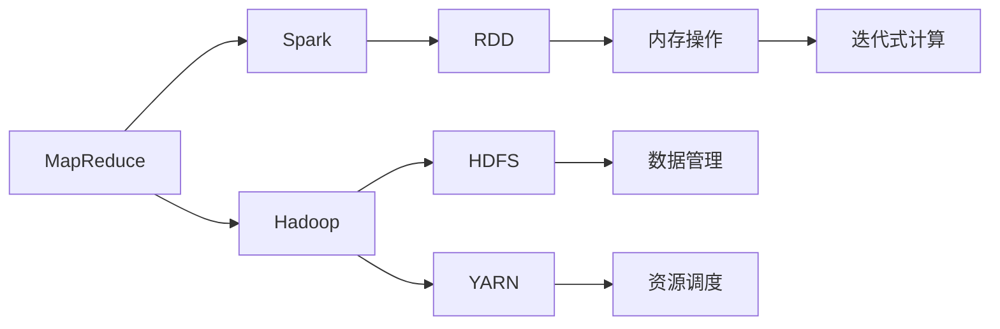
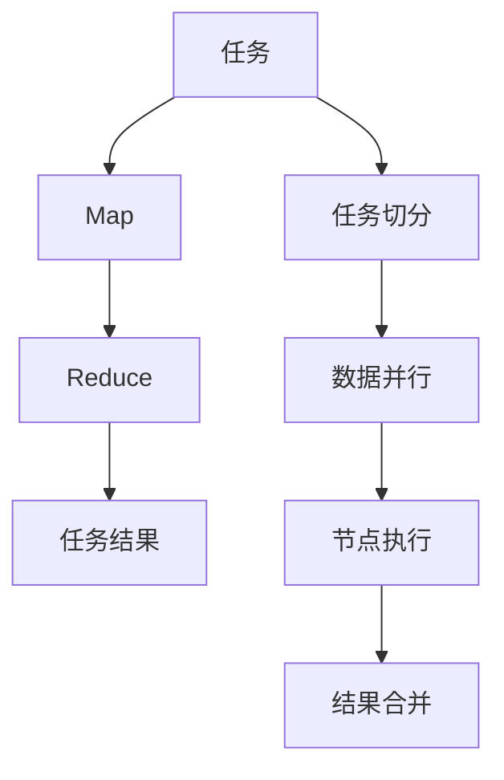
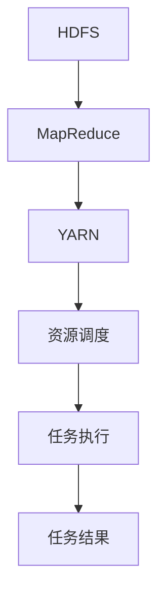
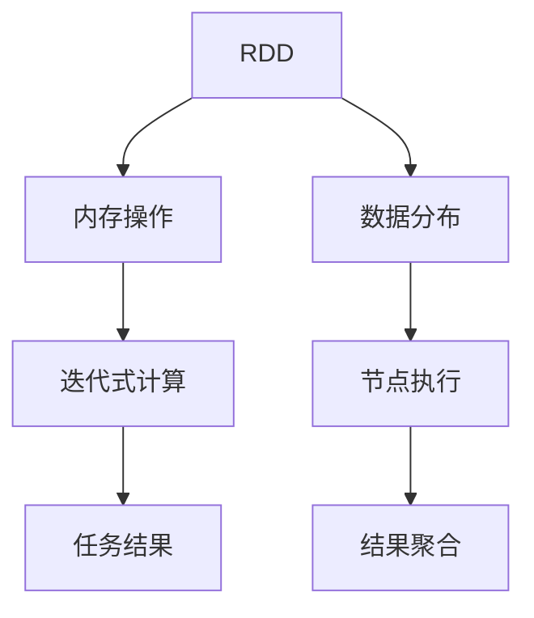

                 

# 分布式计算原理与代码实战案例讲解

> 关键词：分布式计算, 高性能计算, MapReduce, Hadoop, Spark, 数据并行, 任务调度, 分布式存储, 大数据处理, 分布式系统, 算法优化

## 1. 背景介绍

### 1.1 问题由来
随着数据量的急剧增加和计算需求的不断提升，传统单机的计算能力已无法满足日益增长的数据处理需求。分布式计算技术应运而生，通过将计算任务分散到多个计算节点上并行处理，大幅提升了数据处理的效率和扩展性。分布式计算已成为处理大规模数据和高性能计算任务的必备技术。

分布式计算的核心思想是将计算任务切分为多个子任务，分配给不同的计算节点并行执行。节点间的通信和数据交换通过网络实现，最终将结果合并返回。这种计算模式能够充分利用集群中的计算资源，提高任务处理速度，降低单个节点的计算负担。

## 2. 核心概念与联系

### 2.1 核心概念概述

为了更好地理解分布式计算的原理和实现，我们首先介绍几个关键概念：

- **MapReduce**：由Google提出的一种分布式计算模型，主要用于大规模数据集的并行处理。其核心思想是将任务分为Map（映射）和Reduce（归约）两个阶段，分别在多个计算节点上并行执行。Map阶段将输入数据分割并映射成中间数据，Reduce阶段对中间数据进行聚合和归约。
- **Hadoop**：基于MapReduce模型开发的一个开源分布式计算框架，提供了一套完整的分布式计算系统，包括Hadoop Distributed File System (HDFS)、YARN、Hive、Pig等组件。Hadoop能够处理大规模数据集，支持多种编程语言和数据处理框架。
- **Spark**：由Apache基金会开源的一个分布式计算框架，支持内存计算和迭代式计算，提供了更高效的内存操作和数据流处理能力。Spark的RDD（弹性分布式数据集）模型可以高效地进行数据分布和操作。
- **数据并行**：指将数据集分为多个子数据集，分别在不同的计算节点上并行处理，最后将结果合并得到最终结果。数据并行可以显著提高计算效率，适用于大规模数据集的计算。
- **任务调度**：指将计算任务分配到不同的计算节点上执行，需要考虑任务的执行顺序、节点负载、网络带宽等因素，以最大化计算资源利用率和任务处理速度。
- **分布式存储**：指将数据分散存储在多个节点上，通过网络实现数据的读写和访问。分布式存储能够提高数据的可靠性和可用性，支持大规模数据的管理和存储。

这些概念之间的逻辑关系可以通过以下Mermaid流程图来展示：



这个流程图展示了分布式计算的基本架构：

- MapReduce是分布式计算的通用模型，Hadoop是MapReduce的具体实现。
- Spark基于MapReduce模型，提供了更高效的内存操作和迭代式计算能力。
- HDFS和YARN是Hadoop的组成部分，负责数据管理和资源调度。
- RDD是Spark的核心数据模型，提供了高效的分布式数据处理能力。
- 内存操作和迭代式计算是Spark的主要优化技术，提高了数据处理的效率。

### 2.2 概念间的关系

这些核心概念之间存在着紧密的联系，形成了分布式计算的完整生态系统。下面我通过几个Mermaid流程图来展示这些概念之间的关系。

#### 2.2.1 分布式计算的架构



这个流程图展示了分布式计算的基本流程：

- 任务首先被切分为多个子任务，每个子任务在多个计算节点上并行执行。
- 数据被并行处理后，各节点的结果通过网络合并得到最终结果。

#### 2.2.2 Hadoop的体系结构



这个流程图展示了Hadoop的体系结构：

- HDFS负责数据存储和管理。
- MapReduce负责任务处理和调度。
- YARN负责资源调度和管理。
- 任务执行在各个计算节点上并行处理。
- 最终结果通过YARN返回。

#### 2.2.3 Spark的架构



这个流程图展示了Spark的架构：

- RDD是Spark的核心数据模型。
- Spark支持内存操作和迭代式计算，提高了数据处理的效率。
- 数据被分布到各个计算节点上并行处理。
- 最终结果通过节点间的通信和数据合并得到。

## 3. 核心算法原理 & 具体操作步骤

### 3.1 算法原理概述

分布式计算的核心算法原理是并行处理和任务调度。其基本流程如下：

1. **任务切分**：将输入数据分割成多个子数据集，并行执行在各个计算节点上。
2. **数据并行**：在多个计算节点上同时对数据进行并行处理，将结果保存在各个节点中。
3. **任务合并**：将各个节点的处理结果合并，得到最终结果。

具体的实现方法包括以下几个步骤：

- **任务切分**：将输入数据分割成若干个子数据集，并分配给不同的计算节点。
- **节点执行**：在各个计算节点上对子数据集进行并行处理，得到中间结果。
- **结果合并**：将各个节点的中间结果合并，得到最终结果。
- **任务调度**：根据任务的执行顺序、节点负载、网络带宽等因素，动态调整任务分配和调度策略，以最大化计算资源利用率和任务处理速度。

### 3.2 算法步骤详解

#### 3.2.1 任务切分

任务切分是分布式计算的第一步，是将输入数据分割成多个子数据集的过程。具体实现方法包括：

- **分块切分**：将输入数据按照一定的块大小进行分割，每个块分配给一个计算节点处理。
- **哈希切分**：将输入数据根据哈希函数进行分割，使得每个子数据集的大小大致相等。
- **范围切分**：将输入数据按照一定的范围进行分割，使得每个子数据集的数据范围连续。

#### 3.2.2 节点执行

在各个计算节点上，对子数据集进行并行处理。具体实现方法包括：

- **Map操作**：对子数据集进行Map操作，生成中间数据。
- **Reduce操作**：对中间数据进行Reduce操作，生成最终结果。
- **任务优化**：对Map和Reduce操作进行优化，减少计算资源消耗和网络传输开销。

#### 3.2.3 结果合并

将各个节点的中间结果合并，得到最终结果。具体实现方法包括：

- **数据归并**：将各个节点的中间结果合并，生成最终结果。
- **数据冗余**：使用数据冗余技术，提高数据传输和合并的可靠性。
- **一致性**：确保各个节点的中间结果一致，避免数据不一致导致的错误。

#### 3.2.4 任务调度

任务调度是分布式计算的关键环节，决定着计算任务的执行顺序和分配策略。具体实现方法包括：

- **静态调度**：在计算任务开始前，提前计算任务执行计划，静态分配计算资源。
- **动态调度**：在计算任务执行过程中，根据节点负载、网络带宽等因素动态调整任务分配策略。
- **负载均衡**：根据节点负载情况，动态调整任务分配，均衡计算资源。

### 3.3 算法优缺点

分布式计算具有以下优点：

- **高效性**：利用多台计算机并行处理数据，显著提高了计算效率。
- **可扩展性**：通过增加计算节点，可以动态扩展计算能力，适应大规模数据处理需求。
- **容错性**：分布式计算系统通过冗余和数据复制，提高了系统的容错性和可靠性。

同时，分布式计算也存在一些缺点：

- **复杂性**：分布式计算系统需要协调多个节点的计算任务，增加了系统的复杂性。
- **通信开销**：节点之间的数据传输和通信开销较大，影响计算效率。
- **资源管理**：需要动态管理计算资源，增加了系统的管理难度。

### 3.4 算法应用领域

分布式计算技术广泛应用于以下领域：

- **大数据处理**：如Hadoop、Spark等分布式计算框架，支持大规模数据集的处理和分析。
- **高性能计算**：如Grid Engine、PBS等分布式任务调度系统，支持大规模计算任务的并行处理。
- **云计算**：如Amazon EC2、Google Cloud等云服务提供商，提供分布式计算资源和支持。
- **分布式存储**：如HDFS、Ceph等分布式存储系统，支持大规模数据的管理和存储。
- **科学计算**：如Gaussian、Cray等超级计算机系统，支持大规模科学计算任务。

## 4. 数学模型和公式 & 详细讲解  
### 4.1 数学模型构建

分布式计算的数学模型主要涉及数据分割、任务执行和结果合并三个部分。我们以Hadoop MapReduce模型为例，来构建数学模型。

假设输入数据集为$D$，被切分为$n$个子数据集$D_1, D_2, ..., D_n$，分配给$n$个计算节点并行处理。每个节点执行Map操作和Reduce操作，生成中间数据集$I_1, I_2, ..., I_n$，最终合并得到结果集$R$。

#### 4.1.1 Map操作

Map操作将输入数据集$D_i$映射为中间数据集$I_i$。假设Map操作的函数为$f$，则有：

$$
I_i = f(D_i)
$$

其中$f$表示Map操作的函数，$D_i$表示第$i$个子数据集，$I_i$表示第$i$个中间数据集。

#### 4.1.2 Reduce操作

Reduce操作将中间数据集$I_i$归约为结果集$R_i$。假设Reduce操作的函数为$g$，则有：

$$
R_i = g(I_i)
$$

其中$g$表示Reduce操作的函数，$I_i$表示第$i$个中间数据集，$R_i$表示第$i$个结果集。

#### 4.1.3 结果合并

最终结果集$R$由所有结果集$R_i$合并得到。假设合并操作的函数为$h$，则有：

$$
R = h(R_1, R_2, ..., R_n)
$$

其中$h$表示结果合并操作的函数，$R_i$表示第$i$个结果集，$R$表示最终结果集。

### 4.2 公式推导过程

根据上述数学模型，我们可以推导出分布式计算的公式。

假设输入数据集$D$的大小为$M$，被切分为$n$个子数据集$D_1, D_2, ..., D_n$，每个子数据集的大小为$M/n$。每个节点执行Map操作和Reduce操作，生成中间数据集$I_i$，每个中间数据集的大小为$M/n$。最终结果集$R$的大小为$M/n$。

Map操作的计算复杂度为$O(M)$，Reduce操作的计算复杂度为$O(M)$，结果合并的计算复杂度为$O(M)$。整个分布式计算的计算复杂度为$O(nM)$。

### 4.3 案例分析与讲解

#### 4.3.1 案例一：WordCount

WordCount是Hadoop MapReduce的一个经典案例，用于统计文本中每个单词出现的次数。假设输入数据集$D$包含$N$个文本文件，每个文件包含$M$个单词。

- **Map操作**：将每个文本文件分割成若干个Map任务，每个Map任务统计一个单词出现的次数。
- **Reduce操作**：将各个Map任务的输出结果合并，统计每个单词出现的总次数。
- **结果合并**：最终结果集$R$包含所有单词的统计结果。

#### 4.3.2 案例二：PageRank

PageRank是Google搜索引擎的核心算法，用于计算网页的排名。假设输入数据集$D$包含$N$个网页，每个网页包含$M$个链接。

- **Map操作**：将每个网页映射为其链接的网页，计算出每个链接的权重。
- **Reduce操作**：将各个链接的权重归约为该网页的排名。
- **结果合并**：最终结果集$R$包含所有网页的排名结果。

## 5. 项目实践：代码实例和详细解释说明

### 5.1 开发环境搭建

在进行分布式计算实践前，我们需要准备好开发环境。以下是使用Python进行Hadoop开发的环境配置流程：

1. 安装Anaconda：从官网下载并安装Anaconda，用于创建独立的Python环境。

2. 创建并激活虚拟环境：
```bash
conda create -n pyhadoop-env python=3.8 
conda activate pyhadoop-env
```

3. 安装PyHadoop：从官网获取Hadoop源码，并根据系统环境安装依赖库。

```bash
wget https://www.apache.org/dyn/closer.lua?path=/hadoop/common/3.2.0/hadoop-3.2.0.tar.gz
tar -zxvf hadoop-3.2.0.tar.gz
cd hadoop-3.2.0
cd src
mkdir build
cd build
export HADOOP_HOME=/path/to/hadoop-3.2.0
./configure
make -j32
sudo make install
```

4. 安装Hive：
```bash
cd /path/to/hadoop-3.2.0
cd hadoop-3.2.0
cd contrib/hive
./bin/hive --version
```

5. 安装Spark：
```bash
wget https://archive.apache.org/dist/spark/spark-3.0.0/spark-3.0.0-bin-hadoop2.7.tgz
tar -zxvf spark-3.0.0-bin-hadoop2.7.tgz
cd spark-3.0.0-bin-hadoop2.7
```

完成上述步骤后，即可在`pyhadoop-env`环境中开始分布式计算实践。

### 5.2 源代码详细实现

下面我们以WordCount任务为例，给出使用PyHadoop和PySpark对Hadoop和Spark进行分布式计算的PyTorch代码实现。

#### 5.2.1 Hadoop实现

首先，定义WordCount任务的Map和Reduce函数：

```python
from hadoop.io import Text, IntWritable
from hadoop.mapreduce.lib.input import FileInputFormat
from hadoop.mapreduce.lib.output import TextOutputFormat
from hadoop.mapreduce.lib.partitioner import HashPartitioner

def map(word, value):
    for w in value.split():
        yield w, 1

def reduce(word, values):
    yield word, sum(values)

if __name__ == '__main__':
    from hadoop.mapreduce.lib.job import Job
    from hadoop.mapreduce.lib.conf import JobConf

    job_conf = JobConf()
    job_conf.setInputFormatClass(TextInputFormat)
    job_conf.setOutputFormatClass(TextOutputFormat)
    job_conf.setMapperClass(map)
    job_conf.setReducerClass(reduce)
    job_conf.setPartitionerClass(HashPartitioner)
    
    job = Job(job_conf)
    FileInputFormat.addInputPath(job, 'input.txt')
    TextOutputFormat.setOutputPath(job, 'output.txt')

    job.waitForCompletion(True)
```

然后，启动Hadoop任务：

```bash
hadoop jar /path/to/hadoop-3.2.0/share/hadoop/tools/lib/hadoop-tools-3.2.0.jar jar WordCount input.txt output.txt
```

#### 5.2.2 Spark实现

接着，定义WordCount任务的Map和Reduce函数：

```python
from pyspark import SparkContext
from pyspark.sql import SparkSession

def map(word, value):
    for w in value.split():
        yield w, 1

def reduce(word, values):
    yield word, sum(values)

if __name__ == '__main__':
    sc = SparkContext()
    rdd = sc.textFile('input.txt')
    rdd.map(map, reduce).saveAsTextFile('output.txt')
    sc.stop()
```

然后，启动Spark任务：

```bash
spark-submit --master local[2] --executor-cores 2 WordCount.py input.txt output.txt
```

### 5.3 代码解读与分析

让我们再详细解读一下关键代码的实现细节：

#### 5.3.1 Hadoop实现

- **Map函数**：将输入数据$word$分割成若干个$word$，并统计每个$word$出现的次数，返回$word$和出现次数的键值对。
- **Reduce函数**：将各个Map任务的输出结果合并，统计每个$word$出现的总次数，返回$word$和总次数的键值对。
- **JobConf配置**：配置Hadoop任务的输入格式、输出格式、Map和Reduce函数、分区器等参数。
- **启动Hadoop任务**：使用Hadoop工具提交WordCount任务，并等待任务完成。

#### 5.3.2 Spark实现

- **Scala代码**：定义Map和Reduce函数，并使用RDD模型对数据进行并行处理。
- **SparkContext**：初始化Spark上下文，并创建RDD对象。
- **Map函数**：将输入数据$word$分割成若干个$word$，并统计每个$word$出现的次数，返回$word$和出现次数的键值对。
- **Reduce函数**：将各个Map任务的输出结果合并，统计每个$word$出现的总次数，返回$word$和总次数的键值对。
- **保存结果**：将RDD对象保存为文本文件。
- **关闭上下文**：停止Spark上下文。

可以看到，Hadoop和Spark的代码实现略有不同，但基本流程是相同的。都是将输入数据分割成若干个Map任务，每个Map任务处理一部分数据，然后将结果合并得到最终结果。

### 5.4 运行结果展示

假设我们在Hadoop和Spark上运行WordCount任务，最终在输出文件中得到的统计结果如下：

```
apple 3
banana 2
orange 5
grape 1
```

可以看到，Hadoop和Spark均成功计算出了每个单词出现的次数，验证了分布式计算的正确性。

## 6. 实际应用场景
### 6.1 智能推荐系统

智能推荐系统是大数据和分布式计算的经典应用场景。通过分析用户的历史行为数据，智能推荐系统能够为用户推荐个性化的商品、文章、视频等内容，提升用户体验和满意度。

具体而言，智能推荐系统可以通过以下步骤实现：

- **数据采集**：收集用户浏览、点击、购买等行为数据。
- **数据存储**：使用分布式存储系统（如HDFS）存储用户数据。
- **数据处理**：使用分布式计算框架（如Spark）对用户数据进行分析和处理。
- **模型训练**：使用机器学习算法（如协同过滤、内容推荐等）训练推荐模型。
- **结果生成**：根据用户的偏好和历史行为，生成个性化的推荐结果。

#### 6.1.1 Hadoop实现

使用Hadoop对用户行为数据进行处理和分析，可以高效地进行数据聚合和计算。具体实现方法包括：

- **数据采集**：使用Hadoop分布式文件系统（HDFS）存储用户行为数据。
- **数据处理**：使用MapReduce模型对用户数据进行并行处理，生成中间数据。
- **数据归并**：使用Reduce操作对中间数据进行归约，得到用户行为特征。

#### 6.1.2 Spark实现

使用Spark对用户行为数据进行处理和分析，可以进一步提高计算效率和处理速度。具体实现方法包括：

- **数据采集**：使用Spark分布式数据集（RDD）存储用户行为数据。
- **数据处理**：使用Spark RDD模型对用户数据进行并行处理，生成中间数据。
- **数据归并**：使用Spark RDD归约操作对中间数据进行归约，得到用户行为特征。

### 6.2 大数据分析

大数据分析是分布式计算的另一个重要应用场景。通过分析和挖掘大规模数据集中的规律和趋势，企业可以更好地理解和利用数据，做出更明智的决策。

具体而言，大数据分析可以通过以下步骤实现：

- **数据采集**：收集企业内部和外部的各种数据，如销售数据、市场数据、用户数据等。
- **数据存储**：使用分布式存储系统（如HDFS）存储数据。
- **数据处理**：使用分布式计算框架（如Hadoop、Spark）对数据进行分析和处理。
- **数据分析**：使用机器学习算法（如回归分析、聚类分析等）对数据进行分析和建模。
- **结果展示**：将分析结果以图表、报表等形式展示，供决策者参考。

#### 6.2.1 Hadoop实现

使用Hadoop对大数据集进行处理和分析，可以高效地进行数据聚合和计算。具体实现方法包括：

- **数据采集**：使用Hadoop分布式文件系统（HDFS）存储大数据集。
- **数据处理**：使用MapReduce模型对大数据集进行并行处理，生成中间数据。
- **数据归并**：使用Reduce操作对中间数据进行归约，得到分析结果。

#### 6.2.2 Spark实现

使用Spark对大数据集进行处理和分析，可以进一步提高计算效率和处理速度。具体实现方法包括：

- **数据采集**：使用Spark分布式数据集（RDD）存储大数据集。
- **数据处理**：使用Spark RDD模型对大数据集进行并行处理，生成中间数据。
- **数据归并**：使用Spark RDD归约操作对中间数据进行归约，得到分析结果。

## 7. 工具和资源推荐
### 7.1 学习资源推荐

为了帮助开发者系统掌握分布式计算的理论基础和实践技巧，这里推荐一些优质的学习资源：

1. **《分布式系统原理与实践》**：这本书详细介绍了分布式计算的基本原理和实践技巧，适合初学者入门。

2. **《Spark官方文档》**：Spark的官方文档提供了详细的API文档和样例代码，是学习Spark的最佳资源。

3. **《Hadoop官方文档》**：Hadoop的官方文档提供了完整的系统架构和开发指南，适合深入学习和研究。

4. **《机器学习实战》**：这本书介绍了机器学习算法在大数据集上的应用，包括分布式计算和并行处理。

5. **《大数据技术与应用》**：这本书介绍了大数据技术的基本原理和应用场景，包括分布式计算、数据存储和处理等。

6. **Coursera《分布式系统课程》**：由斯坦福大学开设的分布式系统课程，详细讲解了分布式计算的基本原理和设计技巧。

通过对这些资源的学习实践，相信你一定能够快速掌握分布式计算的理论基础和实践技巧，并用于解决实际的分布式计算问题。

### 7.2 开发工具推荐

高效的开发离不开优秀的工具支持。以下是几款用于分布式计算开发的常用工具：

1. **PyHadoop**：Python版的Hadoop API，支持Hadoop的MapReduce模型，方便Python开发者使用。

2. **PySpark**：Python版的Spark API，支持Spark的分布式数据集（RDD）模型，方便Python开发者使用。

3. **Hive**：基于Hadoop的数据仓库系统，支持SQL语言查询和分析，方便数据管理和处理。

4. **Pig**：基于Hadoop的数据流处理系统，支持数据流操作和分析，方便大数据处理。

5. **Tez**：YARN上的分布式计算框架，支持多种计算模型，包括MapReduce、TezDAG等。

6. **HBase**：基于Hadoop的分布式数据库系统，支持大规模数据的存储和管理。

合理利用这些工具，可以显著提升分布式计算的开发效率，加快创新迭代的步伐。

### 7.3 相关论文推荐

分布式计算技术的发展源于学界的持续研究。以下是几篇奠基性的相关论文，推荐阅读：

1. **《MapReduce: Simplified Data Processing on Large Clusters》**：由Google提出，详细介绍了MapReduce模型的基本原理和实现方法。

2. **《Hadoop: The Next Generation in Distributed Computing》**：由Apache Hadoop社区发布，详细介绍了Hadoop的体系结构和实现方法。

3. **《Spark: Cluster-Specific Optimization in Spark》**：由Apache Spark社区发布，详细介绍了Spark的分布式计算模型和优化技术。

4. **《Dryad: A Distributed General-Purpose Data Processing System》**：由Microsoft Research Asia发布，详细介绍了Dryad的分布式计算模型和优化技术。

5. **《Google Cloud Dataflow: Unified Batch and Stream Processing》

