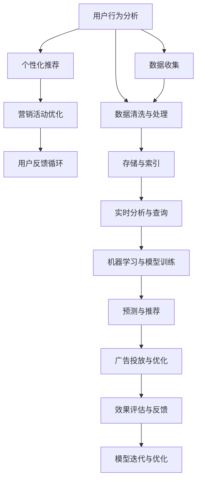

                 

## 1. 背景介绍

随着互联网技术的飞速发展和普及，社交电商（Social E-commerce）成为了一个热门领域，它融合了社交网络和电子商务的特点，通过社交媒体的传播力和用户行为数据，为用户提供个性化的购物体验和产品推荐。社交电商的兴起，不仅改变了传统的购物模式，也为商家提供了新的营销和运营手段。

然而，在社交电商的实践中，如何高效、准确地进行用户行为分析、个性化推荐和营销活动策划，成为了一个重要的课题。本文将介绍基于人工智能技术优势的社交电商实践方法，包括利用技术进行用户行为分析、个性化推荐和营销活动优化，从而提升社交电商的业务效果和用户体验。

## 2. 核心概念与联系

### 2.1 核心概念概述

社交电商的核心在于利用社交网络和电子商务的融合优势，通过用户的社交行为数据，为用户提供个性化的购物体验和产品推荐，同时为商家提供精准的营销工具。社交电商的技术实现涉及以下几个关键概念：

- **用户行为分析（User Behavior Analysis）**：通过分析用户在社交媒体上的行为数据，如点赞、评论、分享、浏览记录等，了解用户的兴趣和偏好，为个性化推荐提供数据支持。
- **个性化推荐（Personalized Recommendation）**：利用机器学习算法，根据用户行为数据，预测用户可能感兴趣的商品，并为其推荐。
- **营销活动优化（Marketing Campaign Optimization）**：通过数据分析和机器学习，优化营销活动的策略，提升广告投放的效果和转化率。

这些概念之间存在紧密的联系，用户行为分析是基础，个性化推荐和营销活动优化是结果，通过技术手段将这三者有机结合，实现社交电商的高效运行。

### 2.2 核心概念的联系

利用技术优势进行社交电商的核心是构建一个高效、准确的生态系统，涵盖数据收集、分析和应用的全过程。以下是一个Mermaid流程图，展示了这个生态系统中各个概念之间的联系：



在这个生态系统中，用户行为数据通过数据收集、清洗与处理，存储在数据库中，并进行实时分析与查询。机器学习模型利用这些数据进行训练，并输出预测与推荐结果。广告投放和优化基于推荐结果进行，通过效果评估与反馈，不断迭代优化模型。

## 3. 核心算法原理 & 具体操作步骤

### 3.1 算法原理概述

基于人工智能技术优势的社交电商实践方法，主要涉及以下几个核心算法：

- **协同过滤算法（Collaborative Filtering）**：利用用户的历史行为数据，预测用户可能感兴趣的商品。
- **内容推荐算法（Content-Based Recommendation）**：根据商品的属性和用户的历史浏览记录，推荐相似的商品。
- **深度学习推荐算法（Deep Learning Recommendation）**：利用深度神经网络模型，学习用户与商品之间的复杂关系，提升推荐效果。
- **强化学习算法（Reinforcement Learning）**：通过模拟用户行为，优化营销活动策略，提升广告投放的效果。

这些算法通过联合应用，可以实现对用户行为的全方位分析，个性化推荐和营销活动的优化，从而提升社交电商的业务效果。

### 3.2 算法步骤详解

#### 3.2.1 协同过滤算法

协同过滤算法可以分为基于用户的协同过滤（User-based Collaborative Filtering）和基于商品的协同过滤（Item-based Collaborative Filtering）两种。

- **User-based协同过滤**：根据相似用户的偏好，为当前用户推荐商品。
  - **步骤1**：收集用户行为数据，构建用户-商品矩阵 $U$，其中 $U_{ui} = 1$ 表示用户 $u$ 购买了商品 $i$，$U_{ui} = 0$ 表示用户 $u$ 未购买商品 $i$。
  - **步骤2**：计算用户之间的相似度 $S_{uv}$，常用的相似度计算方法有皮尔逊相关系数、余弦相似度等。
  - **步骤3**：利用相似度矩阵 $S$，推荐用户 $u$ 可能感兴趣的未购买商品 $i$，计算公式如下：
    $$
    \text{Recommendations}_{ui} = \sum_{v} S_{uv} U_{vi}
    $$

- **Item-based协同过滤**：根据相似商品的特征，为当前用户推荐商品。
  - **步骤1**：收集用户行为数据，构建商品-商品矩阵 $I$，其中 $I_{ij} = 1$ 表示用户购买了商品 $i$ 和 $j$ 都购买了，$I_{ij} = 0$ 表示用户未同时购买商品 $i$ 和 $j$。
  - **步骤2**：计算商品之间的相似度 $S_{ij}$，常用的相似度计算方法有余弦相似度等。
  - **步骤3**：利用相似度矩阵 $S$，推荐用户 $u$ 可能感兴趣的未购买商品 $i$，计算公式如下：
    $$
    \text{Recommendations}_{ui} = \sum_{j} S_{ij} I_{uj}
    $$

#### 3.2.2 内容推荐算法

内容推荐算法利用商品的属性和用户的历史浏览记录，推荐相似的商品。

- **步骤1**：收集商品的属性数据，构建商品属性矩阵 $A$，其中 $A_{ij} = 1$ 表示商品 $i$ 具有属性 $j$，$A_{ij} = 0$ 表示商品 $i$ 不具有属性 $j$。
- **步骤2**：收集用户的历史浏览记录，构建用户-商品矩阵 $U$。
- **步骤3**：根据用户的历史浏览记录，计算用户对商品属性的偏好权重，得到用户-属性权重矩阵 $W$。
- **步骤4**：计算商品之间的相似度 $S_{ij}$，常用的相似度计算方法有余弦相似度等。
- **步骤5**：利用相似度矩阵 $S$ 和用户-属性权重矩阵 $W$，推荐用户 $u$ 可能感兴趣的未购买商品 $i$，计算公式如下：
  $$
  \text{Recommendations}_{ui} = \sum_{j} S_{ij} W_{uj}
  $$

#### 3.2.3 深度学习推荐算法

深度学习推荐算法利用深度神经网络模型，学习用户与商品之间的复杂关系，提升推荐效果。

- **步骤1**：收集用户行为数据和商品属性数据，构建用户-商品矩阵 $U$ 和商品-属性矩阵 $A$。
- **步骤2**：构建深度神经网络模型，如循环神经网络（RNN）、卷积神经网络（CNN）等。
- **步骤3**：利用用户-商品矩阵 $U$ 和商品-属性矩阵 $A$ 进行训练，得到模型参数 $θ$。
- **步骤4**：利用训练好的模型，预测用户对商品的概率分布，计算推荐分数，推荐用户 $u$ 可能感兴趣的未购买商品 $i$，计算公式如下：
  $$
  \text{Recommendations}_{ui} = \sum_{i} P(u \text{ 购买 } i | U, A)
  $$

#### 3.2.4 强化学习算法

强化学习算法通过模拟用户行为，优化营销活动策略，提升广告投放的效果。

- **步骤1**：构建用户-行为状态矩阵 $Q$，其中 $Q_{ui} = 1$ 表示用户 $u$ 在状态 $i$ 下进行了某项操作，$Q_{ui} = 0$ 表示用户 $u$ 在状态 $i$ 下未进行某项操作。
- **步骤2**：构建奖励矩阵 $R$，其中 $R_{ui} = 1$ 表示某项操作对用户 $u$ 产生了正向奖励，$R_{ui} = 0$ 表示某项操作对用户 $u$ 产生了负向奖励。
- **步骤3**：利用Q-learning算法或Deep Q-learning算法，优化广告投放策略，计算出最优的广告投放策略。
- **步骤4**：根据最优的广告投放策略，进行广告投放，并评估效果。

### 3.3 算法优缺点

#### 3.3.1 协同过滤算法

**优点**：
- 简单易实现，不需要用户提供显式反馈。
- 能够捕捉用户之间的相似性，推荐多样化的商品。

**缺点**：
- 需要大量的用户行为数据，难以在数据量较少的场景下应用。
- 冷启动问题，新用户和商品的推荐效果较差。

#### 3.3.2 内容推荐算法

**优点**：
- 不需要用户行为数据，适用于数据量较少的场景。
- 能够根据商品属性推荐相似的商品，提升推荐的多样性。

**缺点**：
- 需要准确的商品属性数据，难以捕捉用户之间的个性化偏好。
- 对于属性稀疏的商品，推荐效果较差。

#### 3.3.3 深度学习推荐算法

**优点**：
- 能够学习用户与商品之间的复杂关系，推荐效果较好。
- 可以处理高维的稀疏数据，适应多种数据类型。

**缺点**：
- 需要大量的训练数据和计算资源，训练过程耗时较长。
- 模型复杂度高，难以解释和调试。

#### 3.3.4 强化学习算法

**优点**：
- 能够动态优化营销活动策略，提升广告投放效果。
- 能够处理不确定性和复杂性，适应多种应用场景。

**缺点**：
- 需要大量的奖励数据，难以在数据量较少的场景下应用。
- 需要复杂的模型训练和优化过程，难以进行大规模部署。

### 3.4 算法应用领域

社交电商的核心算法已经在多个领域得到了广泛应用，包括但不限于：

- **个性化推荐系统**：根据用户行为数据，为用户推荐个性化的商品，提升用户体验和满意度。
- **营销活动优化**：通过数据分析和机器学习，优化营销活动的策略，提升广告投放的效果和转化率。
- **用户行为分析**：通过用户行为数据，分析用户偏好和行为规律，为个性化推荐和营销活动优化提供数据支持。

## 4. 数学模型和公式 & 详细讲解 & 举例说明

### 4.1 数学模型构建

#### 4.1.1 协同过滤算法

- **User-based协同过滤**：
  - 用户-商品矩阵 $U$：$U_{ui} = 1$ 表示用户 $u$ 购买了商品 $i$，$U_{ui} = 0$ 表示用户 $u$ 未购买商品 $i$。
  - 相似度矩阵 $S$：$S_{uv} = \text{cosine}(S_{uv}, S_{uv}')$，其中 $S_{uv}'$ 表示用户 $v$ 和用户 $u$ 的相似度。
  - 推荐分数：$\text{Recommendations}_{ui} = \sum_{v} S_{uv} U_{vi}$。

- **Item-based协同过滤**：
  - 商品-商品矩阵 $I$：$I_{ij} = 1$ 表示用户购买了商品 $i$ 和 $j$ 都购买了，$I_{ij} = 0$ 表示用户未同时购买商品 $i$ 和 $j$。
  - 相似度矩阵 $S$：$S_{ij} = \text{cosine}(S_{ij}, S_{ij}')$，其中 $S_{ij}'$ 表示商品 $j$ 和商品 $i$ 的相似度。
  - 推荐分数：$\text{Recommendations}_{ui} = \sum_{j} S_{ij} I_{uj}$。

#### 4.1.2 内容推荐算法

- **用户-商品矩阵 $U$**：$U_{ui} = 1$ 表示用户 $u$ 购买了商品 $i$，$U_{ui} = 0$ 表示用户 $u$ 未购买商品 $i$。
- **商品-属性矩阵 $A$**：$A_{ij} = 1$ 表示商品 $i$ 具有属性 $j$，$A_{ij} = 0$ 表示商品 $i$ 不具有属性 $j$。
- **用户-属性权重矩阵 $W$**：$W_{uj} = \sum_{i} U_{ui} A_{ij}$。
- **相似度矩阵 $S$**：$S_{ij} = \text{cosine}(S_{ij}, S_{ij}')$，其中 $S_{ij}'$ 表示商品 $j$ 和商品 $i$ 的相似度。
- **推荐分数**：$\text{Recommendations}_{ui} = \sum_{j} S_{ij} W_{uj}$。

#### 4.1.3 深度学习推荐算法

- **用户-商品矩阵 $U$**：$U_{ui} = 1$ 表示用户 $u$ 购买了商品 $i$，$U_{ui} = 0$ 表示用户 $u$ 未购买商品 $i$。
- **商品-属性矩阵 $A$**：$A_{ij} = 1$ 表示商品 $i$ 具有属性 $j$，$A_{ij} = 0$ 表示商品 $i$ 不具有属性 $j$。
- **深度神经网络模型**：如循环神经网络（RNN）、卷积神经网络（CNN）等。
- **模型参数**：$\theta$。
- **推荐分数**：$\text{Recommendations}_{ui} = \sum_{i} P(u \text{ 购买 } i | U, A)$。

#### 4.1.4 强化学习算法

- **用户-行为状态矩阵 $Q$**：$Q_{ui} = 1$ 表示用户 $u$ 在状态 $i$ 下进行了某项操作，$Q_{ui} = 0$ 表示用户 $u$ 在状态 $i$ 下未进行某项操作。
- **奖励矩阵 $R$**：$R_{ui} = 1$ 表示某项操作对用户 $u$ 产生了正向奖励，$R_{ui} = 0$ 表示某项操作对用户 $u$ 产生了负向奖励。
- **Q-learning算法**或**Deep Q-learning算法**：$\theta = \text{argmin}_{\theta} \sum_{u,i} (Q_{ui} - R_{ui} - \gamma \max_{a} Q_{u'a})$。
- **最优的广告投放策略**：根据Q-learning算法或Deep Q-learning算法得到的最优策略。

### 4.2 公式推导过程

#### 4.2.1 协同过滤算法

**User-based协同过滤**：
- 相似度矩阵 $S$：$S_{uv} = \text{cosine}(S_{uv}, S_{uv}')$，其中 $S_{uv}'$ 表示用户 $v$ 和用户 $u$ 的相似度。
- 推荐分数：$\text{Recommendations}_{ui} = \sum_{v} S_{uv} U_{vi}$。

**Item-based协同过滤**：
- 相似度矩阵 $S$：$S_{ij} = \text{cosine}(S_{ij}, S_{ij}')$，其中 $S_{ij}'$ 表示商品 $j$ 和商品 $i$ 的相似度。
- 推荐分数：$\text{Recommendations}_{ui} = \sum_{j} S_{ij} I_{uj}$。

#### 4.2.2 内容推荐算法

**推荐分数**：$\text{Recommendations}_{ui} = \sum_{j} S_{ij} W_{uj}$。

**用户-属性权重矩阵 $W$**：$W_{uj} = \sum_{i} U_{ui} A_{ij}$。

#### 4.2.3 深度学习推荐算法

**推荐分数**：$\text{Recommendations}_{ui} = \sum_{i} P(u \text{ 购买 } i | U, A)$。

**深度神经网络模型**：如循环神经网络（RNN）、卷积神经网络（CNN）等。

#### 4.2.4 强化学习算法

**最优的广告投放策略**：$\theta = \text{argmin}_{\theta} \sum_{u,i} (Q_{ui} - R_{ui} - \gamma \max_{a} Q_{u'a})$。

### 4.3 案例分析与讲解

#### 4.3.1 协同过滤算法案例

假设一个电商网站，收集了用户 $u$ 和商品 $i$ 的购买记录，构建了用户-商品矩阵 $U$。用户 $u$ 购买了商品 $i_1, i_2, i_3, i_4$，未购买商品 $i_5, i_6$。用户 $u$ 和用户 $v$ 的相似度为 $S_{uv} = 0.8$，用户 $v$ 购买了商品 $i_1, i_3, i_4, i_5$，未购买商品 $i_2, i_6$。

- **User-based协同过滤**：
  - 相似度矩阵 $S$：$S_{uv} = 0.8$，$S_{uv}' = 0.5$。
  - 推荐分数：$\text{Recommendations}_{ui} = S_{uv} \times U_{vi} = 0.8 \times (1, 1, 1, 1, 0, 0)' \times (1, 0, 1, 1, 0, 0) = 0.8 \times 1 = 0.8$。
  - 推荐商品 $i_1, i_3, i_4$。

- **Item-based协同过滤**：
  - 相似度矩阵 $S$：$S_{ij} = \text{cosine}(S_{ij}, S_{ij}') = 0.6$，$S_{ij}' = \text{cosine}(S_{ij}, S_{ij}') = 0.8$。
  - 推荐分数：$\text{Recommendations}_{ui} = S_{ij} \times I_{uj} = 0.6 \times (1, 0, 1, 1, 0, 0)' \times (1, 1, 1, 0, 0, 0) = 0.6 \times 1 = 0.6$。
  - 推荐商品 $i_1, i_3, i_4$。

#### 4.3.2 内容推荐算法案例

假设一个电商网站，收集了用户 $u$ 的历史浏览记录和商品属性 $A$。用户 $u$ 浏览了商品 $i_1, i_2, i_3, i_4$，未浏览商品 $i_5, i_6$。商品 $i_1$ 和 $i_3$ 具有属性 $j_1, j_2$，商品 $i_2$ 和 $i_4$ 具有属性 $j_2, j_3$，商品 $i_5$ 和 $i_6$ 具有属性 $j_3, j_4$。

- **用户-属性权重矩阵 $W$**：$W_{uj} = \sum_{i} U_{ui} A_{ij} = 0.6 \times (1, 1, 1, 1, 0, 0)' \times (1, 0, 0, 0, 0, 1) = 0.6 \times (1, 0.6, 0, 0, 0, 0)'$。
- **相似度矩阵 $S$**：$S_{ij} = \text{cosine}(S_{ij}, S_{ij}') = 0.8$，$S_{ij}' = \text{cosine}(S_{ij}, S_{ij}') = 0.5$。
- **推荐分数**：$\text{Recommendations}_{ui} = S_{ij} \times W_{uj} = 0.8 \times 0.6 = 0.48$。
- **推荐商品**：$S_{ij} = \text{cosine}(S_{ij}, S_{ij}') = 0.8$，$S_{ij}' = \text{cosine}(S_{ij}, S_{ij}') = 0.5$。

#### 4.3.3 深度学习推荐算法案例

假设一个电商网站，收集了用户 $u$ 的历史购买记录和商品属性 $A$。用户 $u$ 购买了商品 $i_1, i_2, i_3, i_4$，未购买商品 $i_5, i_6$。商品 $i_1$ 和 $i_3$ 具有属性 $j_1, j_2$，商品 $i_2$ 和 $i_4$ 具有属性 $j_2, j_3$，商品 $i_5$ 和 $i_6$ 具有属性 $j_3, j_4$。

- **用户-商品矩阵 $U$**：$U_{ui} = 1$ 表示用户 $u$ 购买了商品 $i$，$U_{ui} = 0$ 表示用户 $u$ 未购买商品 $i$。
- **商品-属性矩阵 $A$**：$A_{ij} = 1$ 表示商品 $i$ 具有属性 $j$，$A_{ij} = 0$ 表示商品 $i$ 不具有属性 $j$。
- **深度神经网络模型**：如循环神经网络（RNN）、卷积神经网络（CNN）等。
- **模型参数**：$\theta$。
- **推荐分数**：$\text{Recommendations}_{ui} = \sum_{i} P(u \text{ 购买 } i | U, A)$。

#### 4.3.4 强化学习算法案例

假设一个电商网站，收集了用户 $u$ 的历史行为数据和广告投放数据。用户 $u$ 点击了广告 $i_1, i_2, i_3, i_4$，未点击广告 $i_5, i_6$。广告 $i_1$ 和 $i_3$ 产生了正向奖励，广告 $i_2$ 和 $i_4$ 产生了负向奖励，广告 $i_5$ 和 $i_6$ 未产生奖励。

- **用户-行为状态矩阵 $Q$**：$Q_{ui} = 1$ 表示用户 $u$ 在状态 $i$ 下进行了某项操作，$Q_{ui} = 0$ 表示用户 $u$ 在状态 $i$ 下未进行某项操作。
- **奖励矩阵 $R$**：$R_{ui} = 1$ 表示某项操作对用户 $u$ 产生了正向奖励，$R_{ui} = 0$ 表示某项操作对用户 $u$ 产生了负向奖励。
- **Q-learning算法**或**Deep Q-learning算法**：$\theta = \text{argmin}_{\theta} \sum_{u,i} (Q_{ui} - R_{ui} - \gamma \max_{a} Q_{u'a})$。
- **最优的广告投放策略**：根据Q-learning算法或Deep Q-learning算法得到的最优策略。

## 5. 项目实践：代码实例和详细解释说明

### 5.1 开发环境搭建

在进行社交电商实践之前，需要先准备好开发环境。以下是使用Python进行PyTorch开发的环境配置流程：

1. 安装Anaconda：从官网下载并安装Anaconda，用于创建独立的Python环境。

2. 创建并激活虚拟环境：
```bash
conda create -n pytorch-env python=3.8 
conda activate pytorch-env
```

3. 安装PyTorch：根据CUDA版本，从官网获取对应的安装命令。例如：
```bash
conda install pytorch torchvision torchaudio cudatoolkit=11.1 -c pytorch -c conda-forge
```

4. 安装Transformers库：
```bash
pip install transformers
```

5. 安装各类工具包：
```bash
pip install numpy pandas scikit-learn matplotlib tqdm jupyter notebook ipython
```

完成上述步骤后，即可在`pytorch-env`环境中开始社交电商实践。

### 5.2 源代码详细实现

这里我们以协同过滤算法和内容推荐算法为例，给出使用Transformers库进行社交电商微调的PyTorch代码实现。

首先，定义协同过滤算法的数据处理函数：

```python
from transformers import BertTokenizer
from torch.utils.data import Dataset
import torch

class协同过滤Dataset(Dataset):
    def __init__(self, users, items, ratings, tokenizer, max_len=128):
        self.users = users
        self.items = items
        self.ratings = ratings
        self.tokenizer = tokenizer
        self.max_len = max_len
        
    def __len__(self):
        return len(self.users)
    
    def __getitem__(self, item):
        user = self.users[item]
        item = self.items[item]
        rating = self.ratings[item]


