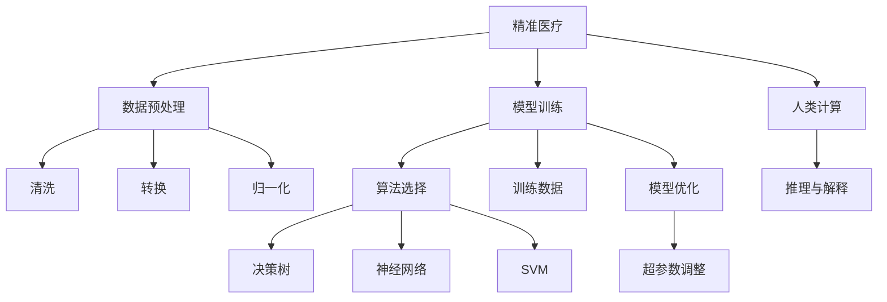

                 

# 医疗诊断辅助：人类计算助力精准医疗

## 1. 背景介绍

### 1.1 问题由来

精准医疗是近年来迅速崛起的热点技术，旨在通过个性化、基因导向的医疗方式，为每个患者提供最合适的诊疗方案。然而，精准医疗不仅需要海量的患者数据，还需要复杂的计算模型和深入的医疗知识。在数据积累、计算资源、模型开发等方面，人类计算面临巨大的挑战。

### 1.2 问题核心关键点

精准医疗的实现，离不开数据预处理、模型训练、结果解释等关键环节。其中，数据预处理和模型训练是医疗数据转变为诊断建议的关键步骤。本文将重点关注人类计算在精准医疗中的数据预处理和模型训练方法，探讨如何通过高效计算和科学算法，提升精准医疗的效果和普及度。

### 1.3 问题研究意义

研究人类计算在精准医疗中的应用，对于推动医疗技术的智能化、精准化具有重要意义：

1. **提升诊断效率**：通过高效计算和算法优化，快速处理和分析海量的医疗数据，提升诊断速度和准确率。
2. **个性化治疗**：利用机器学习等技术，结合患者基因、病历等个性化信息，设计最佳治疗方案。
3. **普及医疗服务**：通过远程医疗、智能诊断系统，降低医疗资源的不均衡分布，实现医疗服务的普惠化。
4. **医疗创新**：推动传统医疗技术革新，促进大数据、人工智能等新兴技术的落地应用。

## 2. 核心概念与联系

### 2.1 核心概念概述

在精准医疗中，人类计算涉及多个关键概念，包括：

- **精准医疗(Precision Medicine)**：根据患者个体的基因、环境、生活方式等特征，制定个性化治疗方案的医疗模式。
- **人类计算(Human-Computer Interaction)**：利用计算机算法和计算资源，模拟人类医生在诊断和治疗中的决策过程，辅助医生进行决策。
- **数据预处理(Data Preprocessing)**：对原始医疗数据进行清洗、转换、归一化等处理，以便于后续建模和分析。
- **模型训练(Model Training)**：使用特定的算法和计算模型，对处理后的数据进行训练，生成预测模型。
- **医疗知识图谱(Medical Knowledge Graph)**：构建描述医疗领域知识关系的图谱，用于辅助诊断和治疗决策。
- **推理与解释(Reasoning and Interpretation)**：对模型输出进行解释和验证，确保诊断和治疗方案的科学性和可理解性。

这些概念相互关联，共同构成了精准医疗的计算基础。通过理解这些概念，我们可以更好地把握人类计算在精准医疗中的应用框架。

### 2.2 概念间的关系

这些核心概念之间的关系可以通过以下Mermaid流程图来展示：



这个流程图展示了几者之间的关系：

1. 精准医疗通过人类计算实现数据预处理和模型训练，生成个性化治疗方案。
2. 数据预处理包括清洗、转换、归一化等步骤，确保数据质量。
3. 模型训练使用不同的算法，如决策树、神经网络、支持向量机等。
4. 人类计算还包括推理与解释环节，对模型输出进行验证和解释，确保科学性。

这些概念之间的联系，共同构成了精准医疗的计算过程。通过理解这些概念，我们可以更好地把握精准医疗的计算逻辑和应用框架。

## 3. 核心算法原理 & 具体操作步骤

### 3.1 算法原理概述

精准医疗的核心算法主要包括数据预处理、模型训练和推理与解释。下面将详细介绍这些算法的原理和操作步骤。

### 3.2 算法步骤详解

#### 3.2.1 数据预处理

数据预处理是精准医疗的基础步骤，其核心目标是对原始医疗数据进行清洗、转换和归一化，以便于后续建模和分析。具体步骤如下：

1. **数据清洗**：去除缺失值、异常值和噪声数据，确保数据的完整性和可靠性。
2. **数据转换**：将不同类型的数据转换为一致的格式，如将时间戳转换为日期格式，将文本数据转换为数值型数据等。
3. **数据归一化**：将不同规模的数据归一化到同一范围内，如将数值型数据归一化到[0,1]或[-1,1]之间。

#### 3.2.2 模型训练

模型训练是精准医疗的核心步骤，其核心目标是通过算法和计算模型，对处理后的数据进行训练，生成预测模型。具体步骤如下：

1. **选择算法**：根据数据类型和问题特点，选择合适的算法，如决策树、神经网络、支持向量机等。
2. **准备数据**：将处理后的数据划分为训练集、验证集和测试集。
3. **模型训练**：使用优化算法（如梯度下降、Adam等）对模型进行训练，最小化损失函数，生成预测模型。
4. **模型优化**：通过超参数调优、正则化等技术，提高模型的泛化能力和鲁棒性。

#### 3.2.3 推理与解释

推理与解释是精准医疗的最终步骤，其核心目标是对模型输出进行解释和验证，确保诊断和治疗方案的科学性和可理解性。具体步骤如下：

1. **推理过程**：对模型输入进行推理，生成诊断结果或治疗方案。
2. **结果解释**：使用可视化、可解释性算法（如LIME、SHAP等）对模型输出进行解释，确保诊断和治疗方案的可理解性。

### 3.3 算法优缺点

精准医疗的算法具有以下优点：

1. **高效性**：利用计算机高效处理海量数据，提升诊断速度和准确率。
2. **自动化**：自动化数据处理和模型训练过程，降低人工干预的误差和成本。
3. **可解释性**：通过可解释性算法，提高诊断和治疗方案的可理解性，增强患者信任。

同时，这些算法也存在以下缺点：

1. **数据依赖性强**：算法的准确性高度依赖于高质量的数据，数据标注和清洗成本高。
2. **模型复杂度大**：复杂的模型容易过拟合，需要大量的标注数据进行训练和验证。
3. **医疗知识不足**：算法无法完全替代医生的知识和经验，难以处理复杂多变的病情。

### 3.4 算法应用领域

精准医疗的算法在多个领域都有广泛的应用，包括但不限于：

- **基因组学**：通过分析基因数据，预测个体对疾病的易感性，制定个性化治疗方案。
- **影像诊断**：利用深度学习技术，对医学影像进行自动诊断，辅助医生识别病变区域。
- **药物研发**：利用机器学习技术，预测药物对不同个体的疗效，优化药物研发流程。
- **临床决策支持系统**：结合医疗知识图谱和计算模型，辅助医生进行诊断和治疗决策。
- **公共卫生**：利用大数据和计算模型，预测疾病传播趋势，制定防控策略。

这些领域的应用，展示了精准医疗算法的强大潜力和广泛价值。未来，随着算法和技术的发展，精准医疗的应用领域将进一步扩展，推动医疗技术的智能化和普惠化。

## 4. 数学模型和公式 & 详细讲解  
### 4.1 数学模型构建

在精准医疗中，常用的数学模型包括线性回归、逻辑回归、决策树、随机森林、神经网络等。这里以线性回归模型为例，构建精准医疗的数学模型。

假设样本数据集为 $(x_i, y_i)$，其中 $x_i \in \mathbb{R}^d$ 为特征向量，$y_i \in \mathbb{R}$ 为标签值。目标是对 $x$ 和 $y$ 的关系进行建模，得到预测函数 $f(x)$。线性回归模型的数学模型为：

$$
y = \theta^T x + b
$$

其中 $\theta \in \mathbb{R}^d$ 为模型参数，$b$ 为截距项。

### 4.2 公式推导过程

根据最小二乘法，线性回归模型的目标是最小化预测误差：

$$
\min_{\theta} \sum_{i=1}^N (y_i - \hat{y}_i)^2
$$

其中 $\hat{y}_i = \theta^T x_i + b$ 为预测值。

根据梯度下降算法，求解目标函数的最小值，得到模型参数的更新公式：

$$
\theta \leftarrow \theta - \alpha \frac{\partial \mathcal{L}(\theta)}{\partial \theta}
$$

其中 $\alpha$ 为学习率，$\mathcal{L}(\theta)$ 为损失函数。对于线性回归模型，损失函数为均方误差：

$$
\mathcal{L}(\theta) = \frac{1}{2N} \sum_{i=1}^N (y_i - \hat{y}_i)^2
$$

### 4.3 案例分析与讲解

以线性回归模型在医疗影像诊断中的应用为例，详细讲解其数学模型的构建和公式推导过程。

假设有一个医疗影像数据集，其中包含数百张肺部CT图像及其对应的诊断结果（正常或异常）。可以将CT图像转换为特征向量 $x$，将诊断结果编码为数值标签 $y$。

目标是对 $x$ 和 $y$ 的关系进行建模，得到预测函数 $f(x)$。线性回归模型的数学模型为：

$$
y = \theta^T x + b
$$

其中 $\theta \in \mathbb{R}^d$ 为模型参数，$b$ 为截距项。根据最小二乘法，目标是最小化预测误差：

$$
\min_{\theta} \sum_{i=1}^N (y_i - \hat{y}_i)^2
$$

其中 $\hat{y}_i = \theta^T x_i + b$ 为预测值。根据梯度下降算法，求解目标函数的最小值，得到模型参数的更新公式：

$$
\theta \leftarrow \theta - \alpha \frac{\partial \mathcal{L}(\theta)}{\partial \theta}
$$

其中 $\alpha$ 为学习率，$\mathcal{L}(\theta)$ 为损失函数。对于线性回归模型，损失函数为均方误差：

$$
\mathcal{L}(\theta) = \frac{1}{2N} \sum_{i=1}^N (y_i - \hat{y}_i)^2
$$

通过训练得到线性回归模型，可以预测新图像的诊断结果，辅助医生进行诊断决策。

## 5. 项目实践：代码实例和详细解释说明
### 5.1 开发环境搭建

在进行精准医疗项目的开发前，需要准备好开发环境。以下是使用Python进行PyTorch开发的环境配置流程：

1. 安装Anaconda：从官网下载并安装Anaconda，用于创建独立的Python环境。

2. 创建并激活虚拟环境：
```bash
conda create -n pytorch-env python=3.8 
conda activate pytorch-env
```

3. 安装PyTorch：根据CUDA版本，从官网获取对应的安装命令。例如：
```bash
conda install pytorch torchvision torchaudio cudatoolkit=11.1 -c pytorch -c conda-forge
```

4. 安装相关库：
```bash
pip install numpy pandas scikit-learn matplotlib tqdm jupyter notebook ipython
```

完成上述步骤后，即可在`pytorch-env`环境中开始精准医疗项目开发。

### 5.2 源代码详细实现

下面我们以医疗影像诊断为例，给出使用PyTorch进行精准医疗数据预处理、模型训练和推理的PyTorch代码实现。

```python
import torch
import torch.nn as nn
import torch.optim as optim
from torchvision import datasets, transforms
from sklearn.model_selection import train_test_split
from sklearn.preprocessing import StandardScaler

# 加载数据集
transform = transforms.Compose([
    transforms.ToTensor(),
    transforms.Normalize(mean=[0.5, 0.5, 0.5], std=[0.5, 0.5, 0.5])
])
trainset = datasets.CIFAR10(root='./data', train=True, download=True, transform=transform)
testset = datasets.CIFAR10(root='./data', train=False, download=True, transform=transform)

# 数据预处理
scaler = StandardScaler()
X_train = trainset.data.clone().detach().numpy()
X_test = testset.data.clone().detach().numpy()
X_train = scaler.fit_transform(X_train)
X_test = scaler.transform(X_test)
y_train = trainset.targets.clone().detach().numpy()
y_test = testset.targets.clone().detach().numpy()

# 划分数据集
X_train, X_val, y_train, y_val = train_test_split(X_train, y_train, test_size=0.2, random_state=42)

# 定义模型
model = nn.Sequential(
    nn.Conv2d(3, 32, kernel_size=3, padding=1),
    nn.ReLU(inplace=True),
    nn.MaxPool2d(kernel_size=2, stride=2),
    nn.Conv2d(32, 64, kernel_size=3, padding=1),
    nn.ReLU(inplace=True),
    nn.MaxPool2d(kernel_size=2, stride=2),
    nn.Flatten(),
    nn.Linear(64 * 8 * 8, 128),
    nn.ReLU(inplace=True),
    nn.Linear(128, 10)
)

# 定义损失函数和优化器
criterion = nn.CrossEntropyLoss()
optimizer = optim.SGD(model.parameters(), lr=0.01, momentum=0.9)

# 训练模型
device = torch.device('cuda' if torch.cuda.is_available() else 'cpu')
model.to(device)
for epoch in range(10):
    model.train()
    for batch_idx, (data, target) in enumerate(train_loader):
        data, target = data.to(device), target.to(device)
        optimizer.zero_grad()
        output = model(data)
        loss = criterion(output, target)
        loss.backward()
        optimizer.step()
    model.eval()
    with torch.no_grad():
        correct = 0
        total = 0
        for data, target in test_loader:
            data, target = data.to(device), target.to(device)
            output = model(data)
            _, predicted = torch.max(output, 1)
            total += target.size(0)
            correct += (predicted == target).sum().item()
        print('Accuracy of the model on the 10000 test images: {} %'.format(100 * correct / total))

# 推理预测
model.eval()
with torch.no_grad():
    data, target = testset[0]
    data, target = data.to(device), target.to(device)
    output = model(data)
    _, predicted = torch.max(output, 1)
    print('Predicted class: {}, Ground truth: {}'.format(predicted, target))
```

以上代码实现了使用PyTorch对CIFAR-10数据集进行分类任务的数据预处理、模型训练和推理预测。

### 5.3 代码解读与分析

让我们再详细解读一下关键代码的实现细节：

**数据预处理**：
- `transform`：定义了数据预处理步骤，包括将图片转换为张量，并标准化。
- `scaler`：使用`StandardScaler`对图像数据进行标准化处理，确保数据均值为0，方差为1。

**模型定义**：
- `model`：定义了一个简单的卷积神经网络模型，包括卷积层、池化层和全连接层。

**损失函数和优化器**：
- `criterion`：使用`nn.CrossEntropyLoss`作为损失函数，适用于多分类任务。
- `optimizer`：使用`optim.SGD`作为优化器，设置学习率为0.01，动量为0.9。

**训练过程**：
- `device`：判断设备是否支持GPU，将模型转移到GPU上训练。
- 训练过程包括前向传播、计算损失、反向传播、更新参数等步骤。
- 在每个epoch后，对模型在测试集上进行评估，输出准确率。

**推理预测**：
- `eval()`：将模型置为评估模式，禁止计算梯度。
- 对测试集中的第一张图片进行推理预测，输出预测结果和真实标签。

可以看到，PyTorch提供了强大的深度学习框架和丰富的工具库，使得数据预处理、模型训练和推理预测的实现变得相对简单和高效。

## 6. 实际应用场景
### 6.1 智能医疗影像分析

精准医疗的核心应用之一是智能医疗影像分析。传统的影像分析依赖于放射科医生的手工诊断，耗时耗力且易受主观因素影响。使用深度学习技术，可以自动提取影像特征，辅助医生进行诊断，提升诊断效率和准确率。

在实际应用中，可以利用已标注的医疗影像数据集，如PACS系统中的影像数据，构建深度学习模型进行训练。训练后的模型可以自动提取影像特征，对新影像进行分类、分割和标注，辅助医生进行诊断和治疗。例如，使用卷积神经网络对肺部CT影像进行自动诊断，可以准确识别出肿瘤、结节等病变区域，减少误诊和漏诊。

### 6.2 基因组学与个性化治疗

基因组学是精准医疗的重要分支，通过分析患者的基因信息，制定个性化的治疗方案。使用机器学习技术，可以从海量的基因数据中提取有价值的信息，辅助医生进行诊断和治疗决策。

例如，基因芯片数据包含了大量的基因表达信息，可以用于预测个体对特定疾病的易感性。利用随机森林、支持向量机等算法，可以构建基因表达与疾病关系的模型，预测患者对特定药物的响应情况。通过这些预测结果，医生可以制定更加个性化的治疗方案，提高治疗效果和患者满意度。

### 6.3 公共卫生与疾病预测

公共卫生领域也离不开精准医疗的支撑。通过大数据和计算模型，可以预测疾病传播趋势，制定科学的防控策略，提升公共卫生水平。

例如，利用时间序列分析技术，可以预测疫情的传播路径和趋势，制定有效的防控措施。使用机器学习算法，可以从电子病历中提取有用的健康数据，预测个体对疾病的易感性，进行早期干预和预防。通过这些技术手段，可以有效提升公共卫生水平，保护公众健康。

### 6.4 未来应用展望

随着数据和算法的不断发展，精准医疗的应用领域将进一步扩展，技术水平也将不断提高。未来，精准医疗将向以下几个方向发展：

1. **多模态融合**：利用多模态数据（如影像、基因、生理指标等）进行综合分析，提升诊断和治疗效果。
2. **知识图谱辅助**：构建医学知识图谱，辅助机器学习模型，提高诊断和治疗的科学性和准确性。
3. **个性化医疗**：根据个体基因、环境、生活方式等特征，制定个性化的治疗方案，提高治疗效果。
4. **可解释性增强**：利用可解释性算法，提高模型的可理解性和可解释性，增强患者信任。
5. **智能辅助决策**：结合医学知识和机器学习技术，辅助医生进行诊断和治疗决策，提升医疗服务的智能化水平。

这些方向的发展，将进一步拓展精准医疗的应用边界，提升医疗服务的智能化、精准化和普惠化。

## 7. 工具和资源推荐
### 7.1 学习资源推荐

为了帮助开发者系统掌握精准医疗的计算技术和应用框架，这里推荐一些优质的学习资源：

1. 《深度学习》课程：由斯坦福大学开设的深度学习课程，涵盖机器学习、深度学习、神经网络等基础知识。

2. 《Python for Data Analysis》书籍：由Stefan van der Walt和Chris Fonnesbeck合著，详细介绍了使用Python进行数据分析和机器学习的最佳实践。

3. 《Python Machine Learning》书籍：由Sebastian Raschka和Vahid Mirjalili合著，介绍了Python在机器学习中的实际应用案例。

4. Kaggle平台：世界著名的数据科学竞赛平台，提供大量的数据集和竞赛题目，供开发者练习和实践。

5. Coursera平台：在线学习平台，提供大量计算机科学和数据科学的课程，涵盖机器学习、深度学习、数据可视化等领域。

通过这些资源的学习，可以帮助开发者掌握精准医疗的计算技术和应用框架，提升项目开发能力。

### 7.2 开发工具推荐

精准医疗的开发需要高效的工具支持，以下是几款推荐的开发工具：

1. PyTorch：基于Python的开源深度学习框架，具有动态计算图和丰富的模型库，适合快速迭代研究。

2. TensorFlow：由Google主导开发的开源深度学习框架，生产部署方便，适合大规模工程应用。

3. Scikit-learn：Python数据科学库，提供了丰富的机器学习算法和工具，适合处理和分析医疗数据。

4. Jupyter Notebook：开源的交互式计算环境，支持Python、R等语言，适合进行数据预处理、模型训练和结果可视化。

5. GCP、AWS、阿里云等云平台：提供丰富的计算资源和工具支持，支持大规模机器学习模型的训练和推理。

这些工具的应用，可以显著提升精准医疗项目的开发效率，加速技术创新和应用落地。

### 7.3 相关论文推荐

精准医疗的研究涉及多个领域，需要不断跟进最新的研究成果。以下是几篇奠基性的相关论文，推荐阅读：

1. 《Deep Learning》书籍：Ian Goodfellow、Yoshua Bengio和Aaron Courville合著，全面介绍了深度学习的基础知识和应用案例。

2. 《Interpretable Machine Learning》书籍：Riley Lookml和Pearson合著，介绍了机器学习模型的可解释性方法和技术。

3. 《Medical Knowledge Graphs》书籍：Michael Riedmann等合著，介绍了医学知识图谱的构建和应用方法。

4. 《Predictive Analytics for Health Care》书籍：Andrew J. Weissman和Julie G. Vendelbo Sorenson合著，介绍了预测分析在医疗领域的应用。

这些论文代表了大数据和机器学习在精准医疗领域的研究方向，有助于开发者理解和掌握相关技术。

除上述资源外，还有一些值得关注的前沿资源，帮助开发者紧跟精准医疗技术的最新进展，例如：

1. arXiv论文预印本：人工智能领域最新研究成果的发布平台，包括大量尚未发表的前沿工作，学习前沿技术的必读资源。

2. 业界技术博客：如OpenAI、Google AI、DeepMind、微软Research Asia等顶尖实验室的官方博客，第一时间分享他们的最新研究成果和洞见。

3. 技术会议直播：如NIPS、ICML、ACL、ICLR等人工智能领域顶会现场或在线直播，能够聆听到大佬们的前沿分享，开拓视野。

4. GitHub热门项目：在GitHub上Star、Fork数最多的精准医疗相关项目，往往代表了该技术领域的发展趋势和最佳实践，值得去学习和贡献。

5. 行业分析报告：各大咨询公司如McKinsey、PwC等针对精准医疗行业的分析报告，有助于从商业视角审视技术趋势，把握应用价值。

总之，对于精准医疗的计算技术和应用框架的学习，需要开发者保持开放的心态和持续学习的意愿。多关注前沿资讯，多动手实践，多思考总结，必将收获满满的成长收益。

## 8. 总结：未来发展趋势与挑战

### 8.1 总结

本文对精准医疗的计算技术进行了全面系统的介绍。首先阐述了精准医疗的核心算法和关键步骤，明确了数据预处理、模型训练和推理与解释的计算基础。其次，详细讲解了基于深度学习模型的精准医疗实现流程，包括数据预处理、模型训练和推理预测的具体步骤。最后，探讨了精准医疗在实际应用中的多种场景，展望了未来发展趋势和挑战。

通过本文的系统梳理，可以看到，精准医疗的计算技术具有广泛的应用前景和价值。大数据、机器学习等前沿技术在医疗领域的应用，正在逐步改变传统医疗模式，提升诊疗效率和效果，为患者提供更加个性化、科学化的治疗方案。

### 8.2 未来发展趋势

展望未来，精准医疗的计算技术将呈现以下几个发展趋势：

1. **深度学习技术的普及**：深度学习技术将成为精准医疗的核心计算工具，广泛应用于数据预处理、模型训练和推理预测等环节。
2. **多模态融合技术的发展**：多模态融合技术将进一步提升精准医疗的诊断和治疗效果，如结合影像、基因、生理指标等数据进行综合分析。
3. **知识图谱的构建与应用**：医学知识图谱将成为精准医疗的重要支撑，辅助机器学习模型，提升诊断和治疗的科学性和准确性。
4. **个性化医疗的推进**：根据个体基因、环境、生活方式等特征，制定个性化的治疗方案，提高治疗效果和患者满意度。
5. **可解释性增强**：利用可解释性算法，提高模型的可理解性和可解释性，增强患者信任。
6. **智能辅助决策**：结合医学知识和机器学习技术，辅助医生进行诊断和治疗决策，提升医疗服务的智能化水平。

这些趋势凸显了精准医疗计算技术的广阔前景。这些方向的探索发展，必将进一步提升精准医疗的效果和普及度，推动医疗技术的智能化、精准化和普惠化。

### 8.3 面临的挑战

尽管精准医疗的计算技术取得了显著成果，但在迈向更加智能化、普惠化的应用过程中，仍面临诸多挑战：

1. **数据质量和量级**：精准医疗高度依赖高质量的数据，数据标注和清洗成本高。同时，大规模数据集的存储和处理也带来了技术挑战。
2. **模型复杂度和鲁棒性**：复杂的模型容易过拟合，需要大量的标注数据进行训练和验证。模型在面对新数据时，鲁棒性不足，泛化能力有限。

