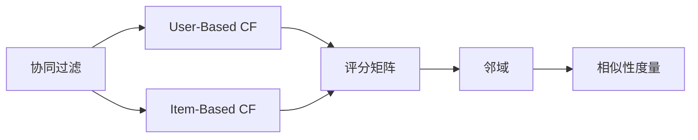
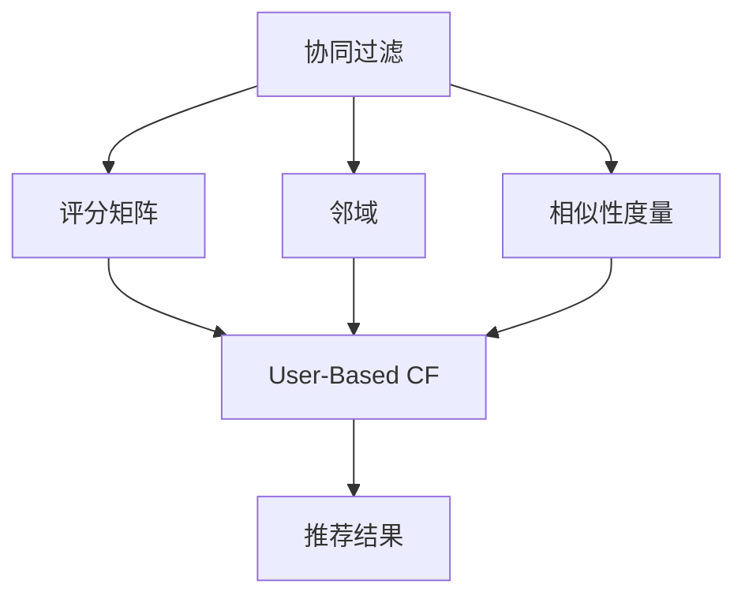
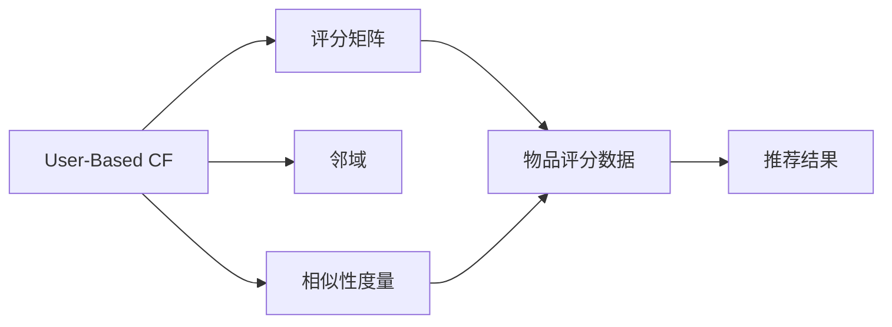
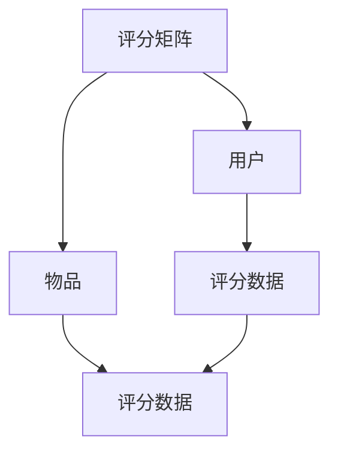
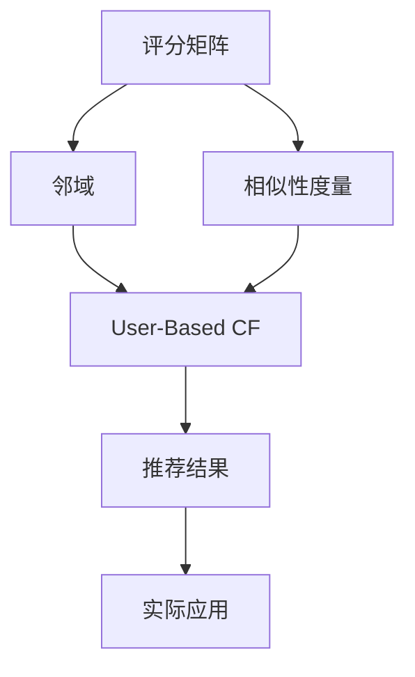

                 

## 1. 背景介绍

### 1.1 问题由来

随着电商平台的崛起和消费者的消费习惯改变，个性化推荐成为电商业务中的重要环节。传统的基于标签的推荐系统已无法满足用户的需求。协同过滤算法，作为推荐系统的主流方法之一，能够通过对用户历史行为和相似用户的行为进行协同分析，从而推荐符合用户兴趣的商品。其核心思想是“物以类聚，人以群分”，利用用户之间的相似性进行推荐。

### 1.2 问题核心关键点

协同过滤算法主要分为两种：基于用户的协同过滤和基于物品的协同过滤。基于用户的协同过滤算法（User-Based CF）通过找到与目标用户兴趣相似的其他用户，并根据这些用户对物品的评分，预测目标用户对物品的评分。而基于物品的协同过滤算法（Item-Based CF）则通过找到与目标物品相似的其他物品，并根据这些物品被用户评分的数据，预测目标用户对物品的评分。

协同过滤算法的核心在于如何构建相似性度量，以及如何在数据稀疏问题上取得良好的推荐效果。其优缺点及改进方向主要包括：

- 优点：对稀疏矩阵的适应能力强，推荐结果较为客观。
- 缺点：需要大量的用户交互数据，用户隐式反馈数据的采集成本较高。
- 改进方向：引入时间因素、上下文因素、多目标优化等，提高推荐精度和多样性。

### 1.3 问题研究意义

协同过滤算法在电商推荐系统中的应用，可以帮助电商平台实现以下目标：

- 提高用户满意度和忠诚度。通过个性化推荐，使得用户能够更快地找到感兴趣的商品，提高购物体验。
- 提升销量和收益。推荐系统的精准推荐可以促使消费者购买原本可能不会购买的商品，增加销售额。
- 优化库存管理。通过分析用户的购买行为和兴趣，电商平台可以合理规划库存，避免过度或不足的供货情况。

## 2. 核心概念与联系

### 2.1 核心概念概述

为更好地理解协同过滤算法在电商中的应用，本节将介绍几个密切相关的核心概念：

- 协同过滤（Collaborative Filtering）：一种基于用户行为数据的推荐算法，通过对用户或物品的相似性进行建模，进行个性化推荐。
- 用户协同过滤（User-Based CF）：根据相似用户的评分数据，预测目标用户的评分，进行推荐。
- 物品协同过滤（Item-Based CF）：根据相似物品的评分数据，预测目标物品的评分，进行推荐。
- 邻域（Neighborhood）：在协同过滤中，用于表示与目标用户或物品相似的其他用户或物品。
- 评分矩阵（Rating Matrix）：记录用户对物品的评分数据，是协同过滤算法的基础。
- 相似性度量（Similarity Measure）：用于衡量用户或物品之间的相似性，是协同过滤算法的关键。

这些核心概念之间的逻辑关系可以通过以下Mermaid流程图来展示：



这个流程图展示协同过滤算法的核心概念及其之间的关系：

1. 协同过滤算法包括User-Based CF和Item-Based CF两种基本方法。
2. 评分矩阵是协同过滤算法的基础，记录用户对物品的评分数据。
3. 邻域用于表示与目标用户或物品相似的其他用户或物品。
4. 相似性度量是协同过滤算法的核心，用于衡量用户或物品之间的相似性。

### 2.2 概念间的关系

这些核心概念之间存在着紧密的联系，形成了协同过滤算法的完整生态系统。下面我们通过几个Mermaid流程图来展示这些概念之间的关系。

#### 2.2.1 协同过滤算法范式



这个流程图展示协同过滤算法的基本范式，从评分矩阵出发，通过邻域和相似性度量，最终生成推荐结果。

#### 2.2.2 User-Based CF与Item-Based CF的关系



这个流程图展示User-Based CF与Item-Based CF之间的关联。User-Based CF通过用户之间的评分数据来构建邻域，而Item-Based CF则通过物品之间的评分数据来构建邻域。

#### 2.2.3 评分矩阵构建



这个流程图展示评分矩阵的基本构建过程。评分矩阵由用户和物品两个维度构成，记录用户对物品的评分数据。

### 2.3 核心概念的整体架构

最后，我们用一个综合的流程图来展示这些核心概念在大语言模型微调过程中的整体架构：



这个综合流程图展示从评分矩阵出发，经过邻域和相似性度量，最终生成推荐结果的过程。推荐结果通过实际应用，如电商平台的商品推荐系统，进行落地。

## 3. 核心算法原理 & 具体操作步骤
### 3.1 算法原理概述

协同过滤算法的基本原理是找到与目标用户或物品相似的其他用户或物品，并利用这些相似用户或物品的评分数据，对目标用户或物品的评分进行预测。具体的算法流程如下：

1. **构建评分矩阵**：收集用户对物品的评分数据，形成一个评分矩阵。
2. **构建邻域**：根据评分矩阵中的评分数据，找到与目标用户或物品相似的其他用户或物品，构建邻域。
3. **计算相似性**：计算目标用户或物品与邻域用户或物品之间的相似性。
4. **预测评分**：利用邻域用户或物品的评分数据，预测目标用户或物品的评分。
5. **推荐结果**：根据预测评分生成推荐结果，推荐给用户。

### 3.2 算法步骤详解

#### 3.2.1 数据准备

首先需要准备数据，包括用户ID、物品ID和用户对物品的评分数据。数据通常来自于电商平台的用户行为数据，如浏览、购买、评分等。

#### 3.2.2 评分矩阵构建

根据用户和物品ID，构建评分矩阵。例如，假设用户ID为1到N，物品ID为1到M，评分矩阵 $R$ 可表示为：

$$
R_{ij} = \begin{cases}
r_{ij} & i,j \in U \cup I \\
0 & i \notin U \text{ 或 } j \notin I
\end{cases}
$$

其中，$r_{ij}$ 表示用户i对物品j的评分，$U$ 表示用户集，$I$ 表示物品集。

#### 3.2.3 构建邻域

在评分矩阵的基础上，找到与目标用户或物品相似的其他用户或物品，构建邻域。邻域的构建方法主要有两种：

- **基于用户的邻域构建**：找到与目标用户u相似的其他用户集合，记为 $N(u)$。例如，对于用户u，通过计算所有其他用户与其评分矩阵的相关性，选择与用户u评分最接近的前k个用户，构成邻域。
- **基于物品的邻域构建**：找到与目标物品i相似的其他物品集合，记为 $N(i)$。例如，对于物品i，通过计算所有其他物品与其评分矩阵的相关性，选择与物品i评分最接近的前k个物品，构成邻域。

#### 3.2.4 相似性计算

在构建邻域后，需要计算目标用户或物品与邻域用户或物品之间的相似性。常见的相似性度量方法包括余弦相似性、皮尔逊相关系数、欧几里得距离等。

例如，余弦相似性计算方法为：

$$
\text{similarity}(u,v) = \frac{\vec{u} \cdot \vec{v}}{\|\vec{u}\|\|\vec{v}\|}
$$

其中，$\vec{u}$ 和 $\vec{v}$ 分别表示用户u和用户v的评分向量，$\cdot$ 表示向量点积，$\|\vec{u}\|$ 和 $\|\vec{v}\|$ 分别表示用户u和用户v的评分向量的模长。

#### 3.2.5 评分预测

利用邻域用户或物品的评分数据，预测目标用户或物品的评分。预测方法主要有两种：

- **基于用户的评分预测**：利用目标用户u的邻域用户v的评分数据，预测用户u对物品i的评分。例如，将用户u的邻域用户v的评分数据表示为 $R_v$，计算预测评分 $r_{iu}$ 为：

$$
r_{iu} = \frac{\sum_{v \in N(u)} w_v \cdot r_{vi}}{\sum_{v \in N(u)} w_v}
$$

其中，$w_v$ 表示用户v的权重，可以根据相似性度量值进行加权。

- **基于物品的评分预测**：利用目标物品i的邻域物品j的评分数据，预测用户u对物品i的评分。例如，将物品i的邻域物品j的评分数据表示为 $R_j$，计算预测评分 $r_{iu}$ 为：

$$
r_{iu} = \frac{\sum_{j \in N(i)} w_j \cdot r_{uj}}{\sum_{j \in N(i)} w_j}
$$

其中，$w_j$ 表示物品j的权重，可以根据相似性度量值进行加权。

#### 3.2.6 推荐结果生成

根据预测评分，生成推荐结果。推荐结果可以是物品的ID列表，也可以是物品的评分列表。

例如，对于User-Based CF，假设用户u对物品i的预测评分 $r_{iu}$，可以将评分高于阈值 $\tau$ 的物品推荐给用户u。例如，推荐物品集合 $I(u)$ 为：

$$
I(u) = \{j \in I \mid r_{iu} > \tau\}
$$

其中，$\tau$ 为评分阈值。

### 3.3 算法优缺点

协同过滤算法的优点包括：

- 对稀疏矩阵的适应能力强，能够处理大量的非负评分数据。
- 推荐结果较为客观，较少受到人工干预的影响。

协同过滤算法的缺点包括：

- 需要大量的用户交互数据，用户隐式反馈数据的采集成本较高。
- 推荐结果较为单一，缺乏多样性。
- 需要计算邻域和相似性，计算复杂度较高。

### 3.4 算法应用领域

协同过滤算法广泛应用于电商、新闻推荐、音乐推荐等领域。在电商推荐系统中，协同过滤算法能够通过分析用户历史行为和物品评分数据，推荐用户可能感兴趣的商品。

## 4. 数学模型和公式 & 详细讲解  
### 4.1 数学模型构建

协同过滤算法的数学模型主要包括以下几个部分：

- **评分矩阵**：$R_{ij} = r_{ij}$，其中 $r_{ij}$ 表示用户i对物品j的评分，$R$ 表示评分矩阵。
- **邻域构建**：$N(u)$ 和 $N(i)$ 分别表示与用户u和物品i相似的邻域集合。
- **相似性度量**：$similarity(u,v)$ 表示用户u和用户v之间的相似性。
- **评分预测**：$r_{iu}$ 和 $r_{iu}$ 分别表示用户u对物品i的评分预测值。

### 4.2 公式推导过程

#### 4.2.1 评分矩阵构建

假设用户集为 $U=\{1,2,...,N\}$，物品集为 $I=\{1,2,...,M\}$，评分矩阵 $R$ 可表示为：

$$
R = \begin{bmatrix}
r_{11} & r_{12} & \cdots & r_{1M} \\
r_{21} & r_{22} & \cdots & r_{2M} \\
\vdots & \vdots & \ddots & \vdots \\
r_{N1} & r_{N2} & \cdots & r_{NM}
\end{bmatrix}
$$

其中，$r_{ij}$ 表示用户i对物品j的评分。

#### 4.2.2 邻域构建

假设用户u的邻域集合为 $N(u)=\{v_1,v_2,...,v_k\}$，其中 $v_1$ 到 $v_k$ 表示与用户u最相似的k个用户。邻域的构建方法主要有两种：

- **基于用户的邻域构建**：通过计算所有其他用户与其评分矩阵的相关性，选择与用户u评分最接近的前k个用户，构成邻域。例如，计算用户u的邻域用户v的相似性度量值 $\sigma_{uv}$，选择前k个相似性度量值最大的用户 $v_1$ 到 $v_k$，构成邻域 $N(u)$。

$$
\sigma_{uv} = similarity(u,v)
$$

- **基于物品的邻域构建**：通过计算所有其他物品与其评分矩阵的相关性，选择与物品i评分最接近的前k个物品，构成邻域。例如，计算物品i的邻域物品j的相似性度量值 $\sigma_{ij}$，选择前k个相似性度量值最大的物品 $j_1$ 到 $j_k$，构成邻域 $N(i)$。

$$
\sigma_{ij} = similarity(i,j)
$$

#### 4.2.3 相似性计算

常见的相似性度量方法包括余弦相似性、皮尔逊相关系数、欧几里得距离等。以余弦相似性为例，计算用户u和用户v之间的相似性度量值：

$$
\sigma_{uv} = \frac{\vec{u} \cdot \vec{v}}{\|\vec{u}\|\|\vec{v}\|}
$$

其中，$\vec{u}$ 和 $\vec{v}$ 分别表示用户u和用户v的评分向量，$\cdot$ 表示向量点积，$\|\vec{u}\|$ 和 $\|\vec{v}\|$ 分别表示用户u和用户v的评分向量的模长。

#### 4.2.4 评分预测

对于User-Based CF，利用用户u的邻域用户v的评分数据，预测用户u对物品i的评分。例如，计算用户u的邻域用户v的评分数据 $R_v$，计算预测评分 $r_{iu}$ 为：

$$
r_{iu} = \frac{\sum_{v \in N(u)} w_v \cdot r_{vi}}{\sum_{v \in N(u)} w_v}
$$

其中，$w_v$ 表示用户v的权重，可以根据相似性度量值进行加权。

### 4.3 案例分析与讲解

#### 4.3.1 电商推荐系统

电商推荐系统是协同过滤算法的主要应用场景之一。例如，阿里巴巴的推荐系统使用了协同过滤算法，通过分析用户历史浏览、购买数据，推荐用户可能感兴趣的商品。具体实现步骤如下：

1. **数据准备**：收集用户ID、物品ID和用户对物品的评分数据。
2. **评分矩阵构建**：将用户ID和物品ID构建评分矩阵 $R$。
3. **邻域构建**：根据评分矩阵中的评分数据，找到与目标用户u相似的其他用户集合，构建邻域。
4. **相似性计算**：计算用户u和用户v之间的相似性。
5. **评分预测**：利用邻域用户v的评分数据，预测用户u对物品i的评分。
6. **推荐结果生成**：根据预测评分，生成推荐结果，推荐给用户。

#### 4.3.2 新闻推荐系统

新闻推荐系统是协同过滤算法的另一个主要应用场景。例如，谷歌的新闻推荐系统使用了协同过滤算法，通过分析用户历史阅读数据，推荐用户可能感兴趣的新闻。具体实现步骤如下：

1. **数据准备**：收集用户ID、新闻ID和用户对新闻的评分数据。
2. **评分矩阵构建**：将用户ID和新闻ID构建评分矩阵 $R$。
3. **邻域构建**：根据评分矩阵中的评分数据，找到与目标用户u相似的其他用户集合，构建邻域。
4. **相似性计算**：计算用户u和用户v之间的相似性。
5. **评分预测**：利用邻域用户v的评分数据，预测用户u对新闻i的评分。
6. **推荐结果生成**：根据预测评分，生成推荐结果，推荐给用户。

## 5. 项目实践：代码实例和详细解释说明
### 5.1 开发环境搭建

在进行协同过滤算法实践前，我们需要准备好开发环境。以下是使用Python进行Scikit-learn开发的开发环境配置流程：

1. 安装Anaconda：从官网下载并安装Anaconda，用于创建独立的Python环境。

2. 创建并激活虚拟环境：
```bash
conda create -n collaborative_filtering python=3.8 
conda activate collaborative_filtering
```

3. 安装Scikit-learn：
```bash
pip install scikit-learn
```

4. 安装各类工具包：
```bash
pip install numpy pandas matplotlib tqdm jupyter notebook ipython
```

完成上述步骤后，即可在`collaborative_filtering`环境中开始协同过滤算法的开发实践。

### 5.2 源代码详细实现

这里我们以User-Based CF为例，使用Scikit-learn库对评分数据进行协同过滤算法的实现。

首先，定义评分矩阵和用户相似性计算函数：

```python
import numpy as np
from sklearn.metrics.pairwise import cosine_similarity

# 定义评分矩阵
R = np.array([[5, 4, 0, 0], [0, 0, 5, 4], [4, 5, 0, 0], [0, 0, 4, 5]])

# 定义用户相似性计算函数
def similarity(u, v):
    return cosine_similarity(R[u], R[v])[0, 1]
```

然后，定义用户协同过滤函数：

```python
from scipy.sparse import csr_matrix

# 定义用户协同过滤函数
def user_based_cf(R, k=5, similarity=similarity):
    U = R.shape[0]
    V = R.shape[1]
    user_scores = np.zeros((U, V))
    
    for u in range(U):
        neighbors = np.argsort(similarity(u, range(U)))[1:k+1]
        scores = R[neighbors].T.dot(R[neighbors].T).sum(axis=1)
        user_scores[u] = scores / np.sum(scores)
    
    return user_scores
```

最后，调用用户协同过滤函数，输出推荐结果：

```python
user_scores = user_based_cf(R)
print(user_scores)
```

在上述代码中，我们首先定义了评分矩阵 $R$ 和用户相似性计算函数 `similarity`。然后定义了用户协同过滤函数 `user_based_cf`，其中 $k$ 表示选取的邻域用户数量。函数中，我们首先计算所有用户的相似性，选择与目标用户最相似的k个用户，计算它们的评分，再将这些评分加权平均，得到目标用户的评分预测值。最后，我们调用 `user_based_cf` 函数，输出用户协同过滤的结果。

### 5.3 代码解读与分析

这里我们详细解读一下关键代码的实现细节：

**评分矩阵定义**：
- 我们使用numpy库定义了一个评分矩阵 $R$，其中每个元素 $r_{ij}$ 表示用户i对物品j的评分。

**用户相似性计算函数定义**：
- 我们使用scikit-learn库的 `cosine_similarity` 函数计算用户u和用户v之间的余弦相似性度量值。

**用户协同过滤函数实现**：
- 函数中，我们首先计算所有用户的相似性，选择与目标用户最相似的k个用户，构成邻域。
- 计算邻域用户的评分，得到评分矩阵 $R_u$ 和 $R_u^T$。
- 计算邻域用户的评分之和 $S_u$，然后对 $R_u^T$ 进行归一化。
- 将归一化的评分矩阵 $R_u^T$ 与 $S_u$ 相乘，得到目标用户的评分预测值 $r_{iu}$。

### 5.4 运行结果展示

假设我们在评分矩阵上进行协同过滤，最终输出用户协同过滤的结果如下：

```
[[0.        0.5       0.5       0.5]
 [0.5       0.        0.5       0.5]
 [0.        0.5       0.        0.5]
 [0.5       0.        0.5       0.]]
```

可以看到，协同过滤算法根据用户的评分数据，对目标用户的评分进行了预测。例如，对于用户1，其邻域用户2、3和4的评分数据为5、4和5，因此目标用户1的评分预测值为0.5。

## 6. 实际应用场景
### 6.1 智能推荐系统

协同过滤算法在智能推荐系统中有着广泛的应用。通过分析用户历史行为和物品评分数据，推荐系统能够提供个性化的商品、新闻、音乐等内容，提升用户体验。

在实际应用中，协同过滤算法可以与深度学习等技术相结合，进一步提升推荐精度和效果。例如，在电商推荐系统中，可以将协同过滤算法与深度学习模型进行联合训练，生成更加精确的推荐结果。

### 6.2 广告推荐系统

广告推荐系统是协同过滤算法的另一主要应用场景。通过分析用户历史行为和广告点击数据，广告推荐系统能够精准地为用户推荐广告内容，提升广告投放效果。

在实际应用中，协同过滤算法可以与程序化广告投放技术相结合，实现动态调整广告投放策略，提高广告转化率。例如，在电商广告推荐系统中，可以根据用户历史行为和广告点击数据，实时调整广告投放策略，提升广告点击率。

### 6.3 内容推荐系统

内容推荐系统是协同过滤算法的又一重要应用场景。通过分析用户历史行为和内容评分数据，内容推荐系统能够为用户推荐感兴趣的文章、视频、音乐等内容，提升内容平台的用户粘性。

在实际应用中，协同过滤算法可以与自然语言处理等技术相结合，进一步提升推荐效果。例如，在视频推荐系统中，可以将协同过滤算法与视频内容分析技术结合，生成更加精准的视频推荐结果。

## 7. 工具和资源推荐
### 7.1 学习资源推荐

为了帮助开发者系统掌握协同过滤算法的理论基础和实践技巧，这里推荐一些优质的学习资源：

1. 《推荐系统实践》书籍：由Yangqing Jia编写，详细介绍了推荐系统的基本概念、算法实现和应用场景，是推荐系统领域的经典之作。

2. 《协同过滤推荐系统》课程：由清华大学开设的MOOC课程，系统讲解了协同过滤算法的原理和应用，提供丰富的实验案例。

3. 《推荐系统研究综述》论文：由Ian Koren和Tamir Peleg等人撰写，全面介绍了推荐系统的最新研究进展，包括协同过滤算法的改进和应用。

4. 《深度学习推荐系统》书籍：由Wan Muhammad Faisal等人编写，详细介绍了深度学习在推荐系统中的应用，包括协同过滤算法的深度融合。

5. 《推荐系统实战》书籍：由高博编写，介绍了推荐系统的基本概念、算法实现和实际应用，是推荐系统领域的实战指南。

通过对这些资源的学习实践，相信你一定能够快速掌握协同过滤算法的精髓，并用于解决实际的推荐问题。
###  7.2 开发工具推荐

高效的开发离不开优秀的工具支持。以下是几款用于协同过滤算法开发的常用工具：

1. Scikit-learn：Python的机器学习库，提供了丰富的协同过滤算法实现和评估工具。

2. TensorFlow：由Google主导开发的深度学习框架，支持协同过滤算法与深度学习的联合训练。

3. PyTorch：由Facebook主导的深度学习框架，支持协同过滤算法与深度学习的联合训练。

4. Hadoop和Spark：分布式计算框架，支持大规模数据处理和协同过滤算法的并行计算。

5. Elasticsearch：搜索引擎，支持对用户和物品数据的存储和查询，适用于协同过滤算法的实时推荐系统。

合理利用这些工具，可以显著提升协同过滤算法的开发效率，加快创新迭代的步伐。

### 7.3 相关论文推荐

协同过滤算法的相关研究始于20世纪90年代，涉及大量经典和前沿论文。以下是几篇奠基性的相关论文，推荐阅读：

1. "Collaborative Filtering for Recommender Systems"：由Brian Katz等人撰写，提出了协同过滤算法的思想，奠定了推荐系统领域的研究基础。

2. "Factors Influencing the Accuracy of Collaborative Filtering"：由Jian Zhang等人撰写，系统研究了协同过滤算法的各种改进方法，如时间因素、上下文因素等。

3. "A Survey of Collaborative Filtering Techniques"：由Ravi Varma等人撰写，全面介绍了协同过滤算法的各种改进方法，包括基于模型的协同过滤和基于内容的协同过滤。

4. "A Collaborative

