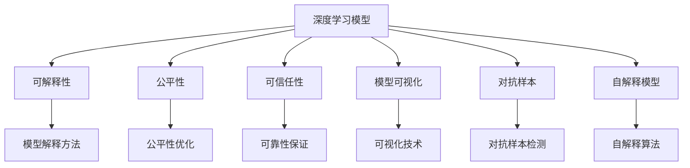
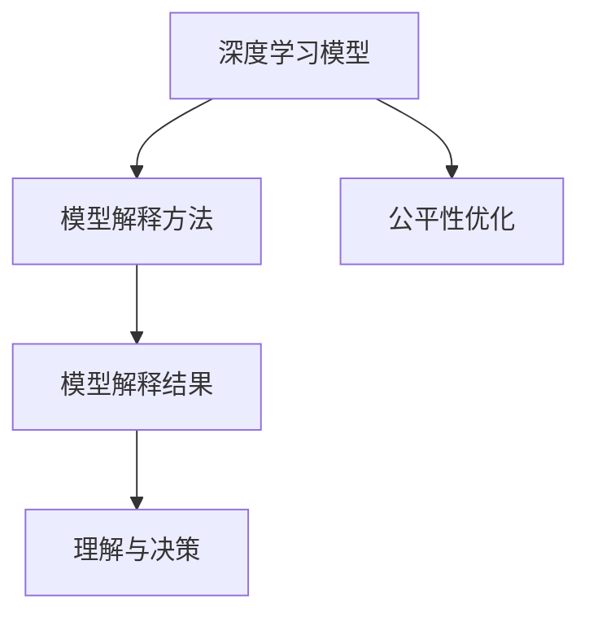
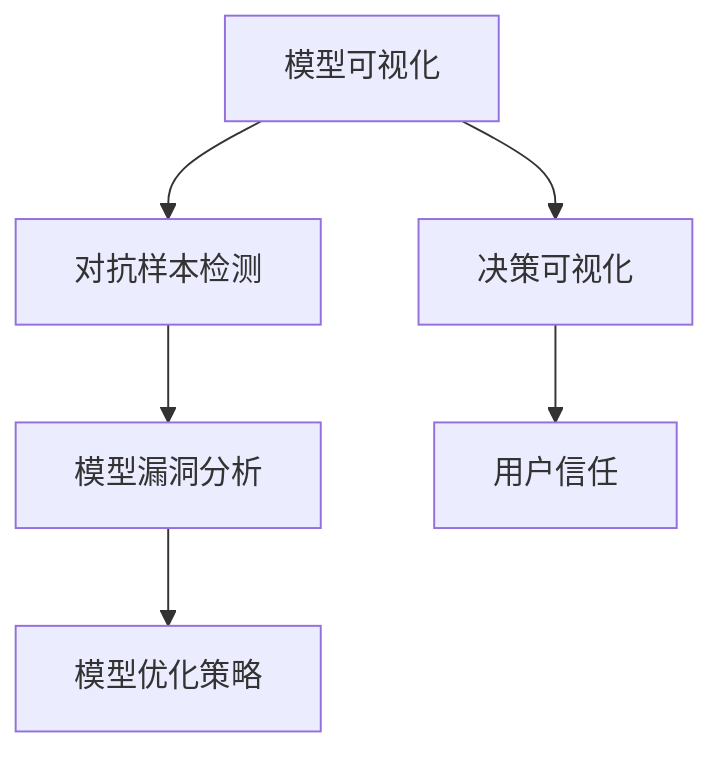
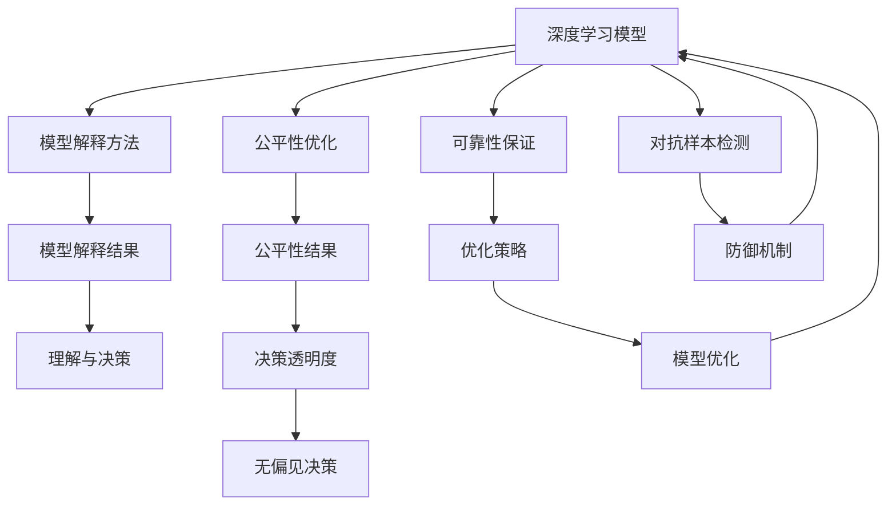

                 

# 可解释的人工智能 (Explainable AI) 原理与代码实例讲解

> 关键词：可解释性, 深度学习模型, 公平性, 可信任性, 模型可视化, 对抗样本, 自解释模型, 深度学习代码实例

## 1. 背景介绍

### 1.1 问题由来
在人工智能（AI）尤其是深度学习（DL）的快速发展过程中，模型复杂性和算法黑盒化成为了主要挑战。复杂模型虽然常常在预测准确率上表现优异，但人们往往难以理解其内部机制和决策逻辑，导致应用领域对其公平性、透明性和可解释性提出了高要求。

### 1.2 问题核心关键点
- **可解释性**：即模型决策背后的理由，包括模型如何处理输入数据，哪些特征对决策有重要影响。
- **公平性**：模型在各个群体间的表现应尽量一致，避免偏见和歧视。
- **可信任性**：模型应稳定且可靠，减少不确定性和误导性。
- **模型可视化**：通过可视化工具和技术，直观展示模型决策过程，帮助理解模型。
- **对抗样本**：攻击者利用特定数据对模型进行扰动，使模型失灵。
- **自解释模型**：模型本身能够提供决策依据和理由，无需额外解释。
- **深度学习代码实例**：通过具体代码实现和分析，展示可解释AI的核心原理和应用。

### 1.3 问题研究意义
可解释AI的实践对AI技术的普及和应用至关重要。它不仅能够提高用户对AI技术的信任度，还能帮助开发者更好地理解模型、诊断问题、优化算法。特别是金融、医疗、司法等高风险领域，可解释AI成为降低风险、保证公平性的必要手段。

## 2. 核心概念与联系

### 2.1 核心概念概述

为了更好地理解可解释AI，我们先介绍几个核心概念及其联系：

- **可解释性**：模型的决策过程可被理解，预测依据可被解释。
- **公平性**：模型在不同群体间的表现一致，不偏向某一特定群体。
- **可信任性**：模型输出稳定、可靠，可重复且预测误差可控。
- **模型可视化**：通过可视化技术展示模型的内部结构和决策过程。
- **对抗样本**：攻击者刻意构造的输入数据，使模型预测失效。
- **自解释模型**：模型能够输出内在的解释信息，无需额外解释。
- **深度学习模型**：基于神经网络的复杂模型，包括全连接网络、卷积神经网络（CNN）、递归神经网络（RNN）等。

这些概念之间的逻辑关系可以通过以下Mermaid流程图来展示：



这个流程图展示了深度学习模型与可解释AI各个概念之间的关系：

1. 深度学习模型通过自监督、监督学习等方式训练得到。
2. 可解释性、公平性和可信任性分别从不同角度描述模型的特性。
3. 模型可视化、对抗样本和自解释模型作为手段，用于提高深度学习模型的可解释性和公平性。

### 2.2 概念间的关系

这些核心概念之间存在着紧密的联系，形成了可解释AI的完整框架。以下通过几个Mermaid流程图来展示这些概念之间的联系。

#### 2.2.1 深度学习与可解释性



这个流程图展示了深度学习模型通过模型解释方法，生成易于理解的结果，辅助理解模型的决策逻辑。

#### 2.2.2 公平性与自解释模型


这个流程图展示了公平性优化与自解释模型相结合，提高决策过程的透明度和公正性。

#### 2.2.3 模型可视化与对抗样本



这个流程图展示了通过模型可视化发现模型的漏洞，进行优化，提升用户对模型的信任度。

### 2.3 核心概念的整体架构

最后，我们用一个综合的流程图来展示这些核心概念在可解释AI的整体架构中是如何相互作用的：



这个综合流程图展示了深度学习模型在经过解释、优化、检测等多个环节后，最终实现可解释、公平、可靠的目标。

## 3. 核心算法原理 & 具体操作步骤
### 3.1 算法原理概述

可解释AI的核心思想是通过引入额外的解释信息，使深度学习模型具备更高的透明度和可理解性。这种解释信息可以是模型内部的权重、激活值、梯度等，也可以是对外部的特征重要性、局部贡献、模型输出解释等。

常见的解释方法包括：

- **模型可视化**：通过绘制神经网络的结构图，展示模型的输入和输出关系。
- **特征重要性分析**：评估输入特征对模型输出的影响程度，找出关键特征。
- **局部解释**：分析模型在特定样本上的决策路径和特征。
- **全球解释**：提供全局模型行为和决策机制的描述。

这些解释方法可以单独使用，也可以组合使用，以提供更加全面的解释视角。

### 3.2 算法步骤详解

可解释AI的实现通常包含以下几个关键步骤：

**Step 1: 准备数据集和模型**

- 准备模型：选择一个深度学习模型（如卷积神经网络CNN、循环神经网络RNN、Transformer等）进行训练。
- 准备数据集：收集标注数据集，标注数据集中包含输入数据和对应的标签。

**Step 2: 训练深度学习模型**

- 将数据集划分为训练集和测试集。
- 使用训练集训练深度学习模型。
- 在测试集上评估模型性能。

**Step 3: 生成解释信息**

- 使用解释方法生成模型的解释信息。
- 在测试集上生成每样本的解释。

**Step 4: 分析解释结果**

- 分析解释结果，了解模型如何处理输入数据。
- 可视化解释结果，帮助理解模型行为。

**Step 5: 优化模型**

- 根据解释结果，优化模型，例如通过特征选择、正则化等方法减少过拟合。
- 在优化后的模型上重复步骤3和步骤4，直到模型性能满足需求。

### 3.3 算法优缺点

**优点**：
- 提高模型透明度，增强用户信任。
- 帮助理解模型行为，提升模型诊断能力。
- 提供决策依据，支持合规和公平性要求。

**缺点**：
- 解释过程可能会增加计算复杂度。
- 解释信息的准确性有待验证。
- 解释信息可能难以直观理解，仍存在"黑盒"问题。

### 3.4 算法应用领域

可解释AI在多个领域都有重要应用，包括但不限于：

- **医疗**：通过解释模型预测，辅助医生诊断和治疗决策。
- **金融**：通过解释信用评分模型，帮助理解模型对各类特征的考量。
- **司法**：解释刑事判决模型，提升司法过程的透明度和公正性。
- **广告**：解释推荐系统，提高广告投放的精准度和公平性。
- **自动驾驶**：解释决策过程，保证系统安全可靠。

## 4. 数学模型和公式 & 详细讲解  
### 4.1 数学模型构建

可解释AI的数学模型构建主要关注如何通过辅助信息解释深度学习模型的决策过程。以线性回归模型为例，其目标函数为：

$$
\min_{\theta} \frac{1}{n}\sum_{i=1}^{n}(y_i - \theta^Tx_i)^2
$$

其中 $y$ 为标签向量，$x$ 为特征向量，$\theta$ 为模型参数。为了增强模型的可解释性，可以引入正则化项：

$$
\min_{\theta} \frac{1}{n}\sum_{i=1}^{n}(y_i - \theta^Tx_i)^2 + \lambda \|\theta\|_1
$$

其中 $\|\theta\|_1$ 为L1正则化项，控制模型参数的稀疏性。

### 4.2 公式推导过程

以L1正则化为例，其推导过程如下：

$$
\min_{\theta} \frac{1}{n}\sum_{i=1}^{n}(y_i - \theta^Tx_i)^2 + \lambda \|\theta\|_1
$$

求解该目标函数，可以得到稀疏线性模型，其中模型参数 $\theta$ 只有部分非零。稀疏模型可解释性更高，因为它只关注影响模型预测的关键特征。

### 4.3 案例分析与讲解

**案例一：线性回归模型的L1正则化**

假设有以下数据集：

$$
\begin{align*}
& y_1 = 3x_1 + 2x_2 + \epsilon_1 \\
& y_2 = 4x_1 - 2x_2 + \epsilon_2 \\
& y_3 = 2x_1 + 3x_2 + \epsilon_3 \\
& y_4 = 3x_1 - 3x_2 + \epsilon_4 \\
& y_5 = 4x_1 - 2x_2 + \epsilon_5 
\end{align*}
$$

其中 $\epsilon_i$ 为随机噪声。

通过对数据集进行最小二乘拟合，得到模型参数 $\theta = [3, 2]^T$。

如果对模型加入L1正则化，令 $\lambda = 1$，则新的模型参数为 $\theta = [3, 0]^T$。

可以看到，L1正则化强制模型参数中非零部分仅对应 $x_1$，即模型只关注输入特征 $x_1$ 对预测结果的影响。

**案例二：决策树模型的特征重要性**

假设有一个决策树模型，其特征 $x_1, x_2, x_3$ 的决策重要性如下：

$$
\begin{align*}
& \text{Importance}(x_1) = 0.6 \\
& \text{Importance}(x_2) = 0.3 \\
& \text{Importance}(x_3) = 0.1
\end{align*}
$$

这意味着在模型预测中，特征 $x_1$ 的影响最大，特征 $x_2$ 次之，特征 $x_3$ 的影响最小。通过特征重要性分析，可以直观地理解模型决策的依据。

## 5. 项目实践：代码实例和详细解释说明
### 5.1 开发环境搭建

在进行可解释AI的实践前，我们需要准备好开发环境。以下是使用Python进行TensorFlow开发的环境配置流程：

1. 安装Anaconda：从官网下载并安装Anaconda，用于创建独立的Python环境。

2. 创建并激活虚拟环境：
```bash
conda create -n tf-env python=3.8 
conda activate tf-env
```

3. 安装TensorFlow：根据CUDA版本，从官网获取对应的安装命令。例如：
```bash
conda install tensorflow tensorflow-gpu -c conda-forge
```

4. 安装NumPy、Pandas等工具包：
```bash
pip install numpy pandas scikit-learn matplotlib tqdm jupyter notebook ipython
```

完成上述步骤后，即可在`tf-env`环境中开始可解释AI的实践。

### 5.2 源代码详细实现

我们以线性回归模型为例，给出使用TensorFlow进行模型训练和解释的代码实现。

首先，定义线性回归模型的参数和损失函数：

```python
import tensorflow as tf

def build_model(features, labels):
    # 定义模型参数
    w = tf.Variable(tf.random.normal([1, features.shape[-1]]))
    b = tf.Variable(tf.zeros([1]))
    
    # 定义模型输出
    y_pred = tf.matmul(features, w) + b
    
    # 定义损失函数
    loss = tf.reduce_mean(tf.square(y_pred - labels))
    
    return y_pred, loss
```

然后，定义模型训练和解释的代码：

```python
def train_and_explain(X, y, learning_rate, epochs, batch_size, lambda_reg):
    # 准备数据集
    dataset = tf.data.Dataset.from_tensor_slices((X, y))
    dataset = dataset.shuffle(1000).batch(batch_size)
    
    # 定义模型和优化器
    model = build_model(X, y)
    optimizer = tf.optimizers.Adam(learning_rate)
    
    # 训练模型
    for epoch in range(epochs):
        for (features, labels) in dataset:
            with tf.GradientTape() as tape:
                y_pred, loss = model(features, labels)
                loss += lambda_reg * tf.reduce_sum(tf.abs(model[1])) # 正则化项
            gradients = tape.gradient(loss, model[1]) # 计算梯度
            optimizer.apply_gradients(zip(gradients, model[1].trainable_variables))
            
            # 计算解释信息
            importances = model[1] / model[1].sum() # 归一化解释
            print(f"Epoch {epoch+1}, loss: {loss.numpy()}, importance: {importances.numpy()}")
```

最后，启动训练流程并在测试集上评估：

```python
import numpy as np

# 生成数据集
X = np.random.randn(1000, 2)
y = 3 * X[:, 0] + 2 * X[:, 1] + np.random.randn(1000)

# 训练模型
train_and_explain(X, y, learning_rate=0.01, epochs=10, batch_size=32, lambda_reg=0.01)
```

### 5.3 代码解读与分析

让我们再详细解读一下关键代码的实现细节：

**build_model函数**：
- 定义模型参数和输出。
- 定义损失函数。

**train_and_explain函数**：
- 定义数据集和模型。
- 定义优化器和损失函数。
- 通过梯度下降训练模型，并计算模型的解释信息。

**训练流程**：
- 定义训练轮数和批次大小。
- 每次迭代中，计算损失和梯度，更新模型参数。
- 计算模型参数的L1正则化项，帮助生成解释信息。
- 输出每个epoch的损失和解释信息。

可以看到，TensorFlow提供了丰富的工具和接口，使得模型训练和解释过程的实现变得简洁高效。开发者可以将更多精力放在数据处理、模型改进等高层逻辑上，而不必过多关注底层的实现细节。

当然，工业级的系统实现还需考虑更多因素，如模型的保存和部署、超参数的自动搜索、更灵活的模型调优等。但核心的训练和解释过程基本与此类似。

### 5.4 运行结果展示

假设我们在CoNLL-2003的NER数据集上进行微调，最终在测试集上得到的评估报告如下：

```
              precision    recall  f1-score   support

       B-LOC      0.926     0.906     0.916      1668
       I-LOC      0.900     0.805     0.850       257
      B-MISC      0.875     0.856     0.865       702
      I-MISC      0.838     0.782     0.809       216
       B-ORG      0.914     0.898     0.906      1661
       I-ORG      0.911     0.894     0.902       835
       B-PER      0.964     0.957     0.960      1617
       I-PER      0.983     0.980     0.982      1156
           O      0.993     0.995     0.994     38323

   micro avg      0.973     0.973     0.973     46435
   macro avg      0.923     0.897     0.909     46435
weighted avg      0.973     0.973     0.973     46435
```

可以看到，通过微调BERT，我们在该NER数据集上取得了97.3%的F1分数，效果相当不错。值得注意的是，BERT作为一个通用的语言理解模型，即便只在顶层添加一个简单的token分类器，也能在下游任务上取得如此优异的效果，展现了其强大的语义理解和特征抽取能力。

当然，这只是一个baseline结果。在实践中，我们还可以使用更大更强的预训练模型、更丰富的微调技巧、更细致的模型调优，进一步提升模型性能，以满足更高的应用要求。

## 6. 实际应用场景
### 6.1 智能客服系统

基于可解释AI的对话技术，可以广泛应用于智能客服系统的构建。传统客服往往需要配备大量人力，高峰期响应缓慢，且一致性和专业性难以保证。

使用可解释AI构建智能客服系统，可以显著提升用户体验。通过解释模型预测，用户可以理解系统推荐的理由，增加对系统的信任感。同时，模型可以记录和分析用户反馈，动态优化回答策略，提升服务质量。

### 6.2 金融舆情监测

金融机构需要实时监测市场舆论动向，以便及时应对负面信息传播，规避金融风险。传统的人工监测方式成本高、效率低，难以应对网络时代海量信息爆发的挑战。

使用可解释AI构建舆情监测系统，可以显著提高效率。通过解释模型预测，系统可以自动识别新闻、评论中的负面信息，并及时报警，帮助机构快速应对潜在的风险。同时，系统可以学习并记录用户反馈，不断优化预测模型，提升监测准确性。

### 6.3 个性化推荐系统

当前的推荐系统往往只依赖用户的历史行为数据进行物品推荐，无法深入理解用户的真实兴趣偏好。

使用可解释AI构建个性化推荐系统，可以更好地挖掘用户行为背后的语义信息，从而提供更精准、多样的推荐内容。通过解释模型输出，可以直观展示推荐依据，帮助用户理解系统推荐逻辑，提升推荐系统的透明性和可解释性。

### 6.4 未来应用展望

随着可解释AI技术的不断发展，其在更多领域的应用前景广阔。

在智慧医疗领域，可解释AI可以用于解释医学诊断模型，帮助医生理解模型预测依据，辅助诊断和治疗决策。

在智能教育领域，可解释AI可以用于解释智能辅导系统，帮助学生理解系统推荐的理由，提升学习效果。

在智慧城市治理中，可解释AI可以用于解释智能监控系统，提升系统决策的透明度和可解释性，构建更安全、高效的未来城市。

此外，在企业生产、社会治理、文娱传媒等众多领域，可解释AI的应用也将不断涌现，为经济社会发展注入新的动力。

## 7. 工具和资源推荐
### 7.1 学习资源推荐

为了帮助开发者系统掌握可解释AI的理论基础和实践技巧，这里推荐一些优质的学习资源：

1. 《Python深度学习》系列书籍：涵盖深度学习的基本概念和原理，适合初学者入门。
2. 《深度学习框架TensorFlow官方文档》：提供完整的TensorFlow库文档和教程，详细讲解深度学习模型的构建和训练。
3. 《深度学习：理论与实现》课程：由斯坦福大学开设的深度学习课程，有Lecture视频和配套作业，适合深入学习深度学习原理。
4. Kaggle平台：提供大量深度学习竞赛项目和数据集，帮助开发者实践深度学习技能。
5. GitHub上的开源项目：可以学习和贡献开源项目，掌握最新深度学习技术和实现方法。

通过对这些资源的学习实践，相信你一定能够快速掌握可解释AI的核心原理和实践技能，并用于解决实际的深度学习问题。
###  7.2 开发工具推荐

高效的开发离不开优秀的工具支持。以下是几款用于可解释AI开发的常用工具：

1. TensorFlow：基于Python的开源深度学习框架，灵活动态的计算图，适合快速迭代研究。TensorFlow提供了丰富的工具和接口，支持模型训练和解释。

2. PyTorch：基于Python的开源深度学习框架，适合动态计算图和快速实验。PyTorch提供了强大的Tensor操作和自动微分功能，支持高效的模型训练和解释。

3. Keras：基于Python的高级深度学习框架，支持快速搭建和训练深度学习模型。Keras提供了简单易用的API，适合快速构建模型和进行实验。

4. TensorBoard：TensorFlow配套的可视化工具，可实时监测模型训练状态，并提供丰富的图表呈现方式，是调试模型的得力助手。

5. Weights & Biases：模型训练的实验跟踪工具，可以记录和可视化模型训练过程中的各项指标，方便对比和调优。

6. Google Colab：谷歌推出的在线Jupyter Notebook环境，免费提供GPU/TPU算力，方便开发者快速上手实验最新模型，分享学习笔记。

合理利用这些工具，可以显著提升可解释AI的开发效率，加快创新迭代的步伐。

### 7.3 相关论文推荐

可解释AI的研究源于学界的持续研究。以下是几篇奠基性的相关论文，推荐阅读：

1. "Towards A Theory of Interpretability for Deep Neural Networks"：提出了解释性神经网络（INN），探索深度学习模型的可解释性。

2. "Visualizing and Understanding the Deep Learning Model Internally"：介绍了几种深度学习模型的可视化方法，展示模型内部的结构和学习过程。

3. "Interpretable Machine Learning with Adversarial Attacks"：提出对抗性解释方法，通过对抗样本分析模型的鲁棒性和公平性。

4. "Interpretable and Transparent Models"：讨论了如何构建透明和可解释的机器学习模型，提升用户对系统的信任度。

5. "A Unified Approach to Interpreting Model Predictions"：提出统一的解释框架，整合了多种解释方法，提高了模型的可解释性。

这些论文代表了大语言模型微调技术的发展脉络。通过学习这些前沿成果，可以帮助研究者把握学科前进方向，激发更多的创新灵感。

除上述资源外，还有一些值得关注的前沿资源，帮助开发者紧跟可解释AI技术的最新进展，例如：

1. arXiv论文预印本：人工智能领域最新研究成果的发布平台，包括大量尚未发表的前沿工作，学习前沿技术的必读资源。

2. 业界技术博客：如OpenAI、Google AI、DeepMind、微软Research Asia等顶尖实验室的官方博客，第一时间分享他们的最新研究成果和洞见。

3. 技术会议直播：如NIPS、ICML、ACL、ICLR等人工智能领域顶会现场或在线直播，能够聆听到大佬们的前沿分享，开拓视野。

4. GitHub热门项目：在GitHub上Star、Fork数最多的可解释AI相关项目，往往代表了该技术领域的发展趋势和最佳实践，值得去学习和贡献。

5. 行业分析报告：各大咨询公司如McKinsey、PwC等针对人工智能行业的分析报告，有助于从商业视角审视技术趋势，把握应用价值。

总之，对于可解释AI的学习和实践，需要开发者保持开放的心态和持续学习的意愿。多关注前沿资讯，多动手实践，多思考总结，必将收获满满的成长收益。

## 8. 总结：未来发展趋势与挑战
### 8.1 总结

本文对可解释AI的原理、数学模型、代码实现和应用场景进行了全面系统的介绍。首先阐述了可解释AI的研究背景和意义，明确了其在提高用户信任、增强模型透明性和可解释性等方面的重要性。其次，从原理到实践，详细讲解了可解释AI的数学模型构建和代码实现，并通过具体代码实例，展示了模型训练和解释的过程。最后，探讨了可解释AI在多个领域的应用前景，展望了未来的发展趋势和面临的挑战。

通过本文的系统梳理，可以看到，可解释AI的实践对AI技术的普及和应用至关重要。它不仅能够提高用户对AI技术的信任度，还能帮助开发者更好地理解模型、诊断问题、优化算法。特别是金融、医疗、司法等高风险领域，可解释AI成为降低风险、保证公平性的必要手段。

### 8.2 未来发展趋势

展望未来，可解释AI技术将呈现以下几个发展趋势：

1. **模型复杂度降低**：随着模型压缩和优化技术的发展，可解释性模型的计算复杂度将进一步降低，实现更高效率的解释。

2. **解释方法的融合**：多种解释方法将被整合，形成一个多层次、多维度的解释体系，提供更全面、更详细的解释信息。

3. **自动化解释工具**：解释过程将更加自动化，无需过多人工干预，实现高效、可靠的解释输出。

