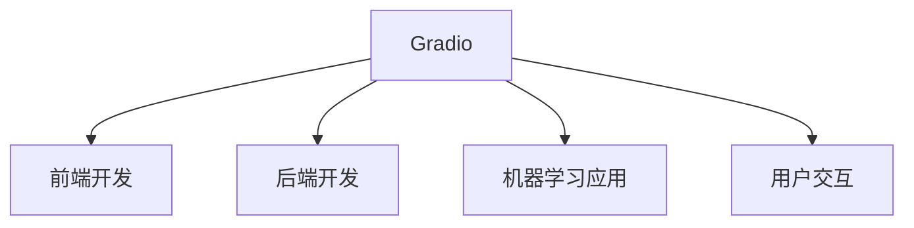
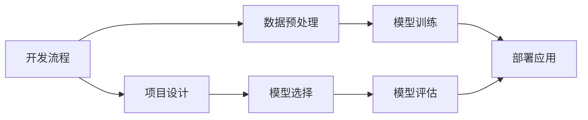
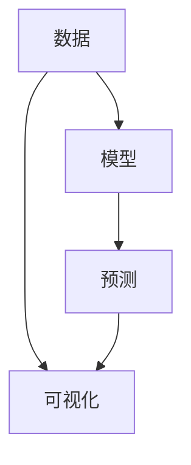
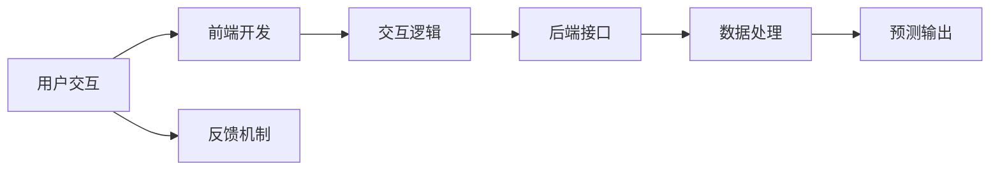
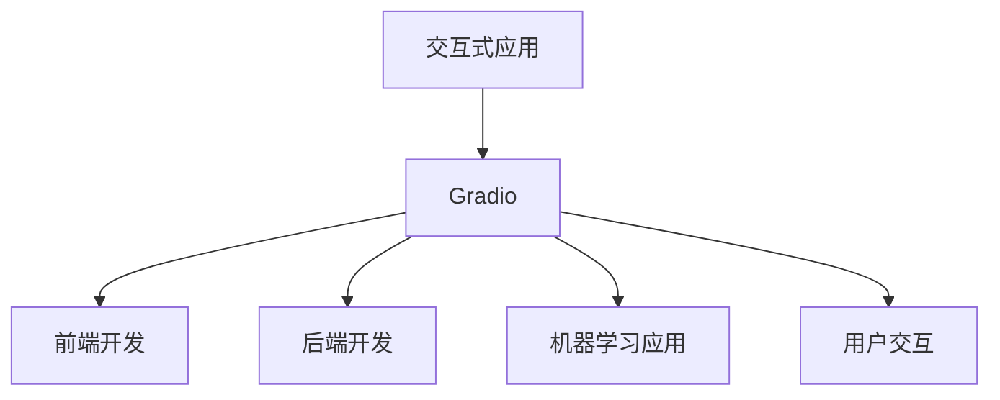

                 

# 基于 Gradio 的图形化界面设计与实现

> 关键词：
- Gradio
- 图形化界面设计
- 前端开发
- 机器学习应用
- 用户交互

## 1. 背景介绍

### 1.1 问题由来
在当今信息爆炸的时代，用户对于数据可视化、交互式应用的需求日益增长。如何在满足用户对复杂数据进行分析的同时，提升用户体验，降低用户的使用门槛，成为了一个亟待解决的问题。传统的静态界面已经无法满足用户的需求，图形化界面（GUI）变得越来越重要。

图形化界面（GUI）允许用户通过图形、图标、按钮等交互方式，直接与系统进行交互，从而大大提升了数据可视化和分析的效率。然而，传统的GUI开发需要具备强大的编程技能和经验，开发周期长，成本高。同时，用户需要自行构建前端交互逻辑，调试和维护难度大，用户体验不佳。

为了降低开发难度，提升用户体验，一种新型的GUI开发工具——Gradio应运而生。Gradio允许开发者通过简单的Python代码快速构建交互式应用，并支持部署到浏览器中，实现了无需复杂的前端开发即可构建高质量的GUI应用。

### 1.2 问题核心关键点
Gradio的核心思想是：通过Python代码构建交互式应用，并自动生成前端代码，从而大大降低了开发门槛。其特点包括：
- 简单易用：无需掌握复杂的前端技术，即可快速构建GUI应用。
- 轻量级：支持一键部署到浏览器中，无需额外的开发和部署流程。
- 灵活性：支持各种数据处理和可视化任务，如图像、文本、声音等。
- 性能高：支持高效的GPU加速，可以处理大规模数据集。

Gradio已经在众多机器学习应用中得到了广泛应用，如分类任务、回归任务、聚类任务等。其技术原理和应用场景值得深入探索。

## 2. 核心概念与联系

### 2.1 核心概念概述

为了更好地理解Gradio的工作原理和应用方法，本节将介绍几个密切相关的核心概念：

- Gradio：一种基于Python的GUI开发工具，用于快速构建交互式应用。
- 前端开发：涉及HTML、CSS、JavaScript等技术，用于实现用户界面和交互逻辑。
- 后端开发：涉及Python、机器学习等技术，用于实现数据处理和算法逻辑。
- 机器学习应用：利用机器学习模型进行数据处理和预测，为用户提供智能化的应用服务。
- 用户交互：通过图形、图标、按钮等交互方式，与系统进行交互，获取结果或反馈。

这些核心概念之间的逻辑关系可以通过以下Mermaid流程图来展示：



这个流程图展示了几类核心概念之间的关系：

1. Gradio是构建交互式应用的工具。
2. 前端开发负责实现用户界面和交互逻辑。
3. 后端开发负责实现数据处理和算法逻辑。
4. 机器学习应用使用模型进行数据处理和预测。
5. 用户交互通过图形、图标、按钮等方式与系统进行交互。

通过理解这些核心概念，我们可以更好地把握Gradio的工作原理和应用方向。

### 2.2 概念间的关系

这些核心概念之间存在着紧密的联系，形成了Gradio的完整生态系统。下面我通过几个Mermaid流程图来展示这些概念之间的关系。

#### 2.2.1 Gradio的开发流程



这个流程图展示了使用Gradio开发交互式应用的基本流程：

1. 项目设计：明确应用的目标和功能。
2. 数据预处理：收集和准备数据集，进行预处理和清洗。
3. 模型选择：选择适合的机器学习模型。
4. 模型训练：使用训练数据对模型进行训练。
5. 模型评估：使用测试数据对模型进行评估。
6. 部署应用：将模型部署到Gradio中，构建交互式应用。
7. 应用迭代：根据用户反馈不断优化和迭代应用。

#### 2.2.2 数据与模型的结合



这个流程图展示了数据与模型的结合方式：

1. 数据：输入原始数据，用于训练和预测。
2. 模型：选择适合的机器学习模型，进行训练和预测。
3. 预测：将输入数据传入模型，得到预测结果。
4. 可视化：将预测结果通过图形化方式展示，帮助用户理解结果。

#### 2.2.3 用户交互的实现



这个流程图展示了用户交互的实现方式：

1. 用户交互：用户通过界面输入数据，进行交互。
2. 前端开发：实现交互界面和交互逻辑。
3. 交互逻辑：根据用户输入，调用后端接口进行数据处理。
4. 后端接口：实现数据处理和模型预测。
5. 预测输出：将预测结果返回给前端，展示给用户。
6. 反馈机制：用户通过界面进行反馈，迭代优化应用。

### 2.3 核心概念的整体架构

最后，我们用一个综合的流程图来展示这些核心概念在大语言模型微调过程中的整体架构：



这个综合流程图展示了从交互式应用到用户交互的完整流程：

1. 交互式应用：使用Gradio构建的交互式应用。
2. 前端开发：实现前端交互界面和逻辑。
3. 后端开发：实现后端数据处理和模型预测。
4. 机器学习应用：使用机器学习模型进行预测。
5. 用户交互：用户通过界面进行交互，获取预测结果。

通过这些流程图，我们可以更清晰地理解Gradio的工作原理和应用方向，为后续深入讨论具体的开发方法和技术奠定基础。

## 3. 核心算法原理 & 具体操作步骤

### 3.1 算法原理概述

Gradio的工作原理可以概括为“前端开发在前，后端处理在后”。其核心思想是：通过Python代码构建交互式应用，并自动生成前端代码，从而大大降低了开发门槛。Gradio的工作流程主要包括以下几个步骤：

1. 项目设计：明确应用的目标和功能，设计应用的界面和交互逻辑。
2. 数据预处理：收集和准备数据集，进行预处理和清洗。
3. 模型选择：选择适合的机器学习模型，进行训练和预测。
4. 数据可视化：将数据通过图形化方式展示，帮助用户理解结果。
5. 应用部署：将模型部署到Gradio中，构建交互式应用。
6. 应用迭代：根据用户反馈不断优化和迭代应用。

### 3.2 算法步骤详解

以下是使用Gradio构建交互式应用的具体步骤：

**Step 1: 项目设计**
首先，我们需要明确应用的目标和功能，设计应用的界面和交互逻辑。例如，我们想构建一个简单的图像分类应用，可以将界面设计为一个上传图片、选择分类标签的界面。

**Step 2: 数据预处理**
然后，我们需要收集和准备数据集，进行预处理和清洗。例如，对于图像分类任务，我们需要准备标注好的图片数据集，并进行预处理，如缩放、归一化等。

**Step 3: 模型选择**
接下来，我们需要选择适合的机器学习模型，进行训练和预测。例如，对于图像分类任务，我们可以选择使用卷积神经网络（CNN）模型，使用Keras或TensorFlow等框架进行训练和预测。

**Step 4: 数据可视化**
使用Gradio提供的接口，将数据通过图形化方式展示。例如，我们可以使用Gradio的`Plot`模块，将分类结果通过柱状图展示，帮助用户理解结果。

**Step 5: 应用部署**
将模型部署到Gradio中，构建交互式应用。例如，我们可以使用Gradio的`gradioserver`模块，启动服务，将模型部署到浏览器中，供用户使用。

**Step 6: 应用迭代**
最后，根据用户反馈不断优化和迭代应用。例如，用户可能会提出新的需求或反馈问题，我们可以根据用户反馈不断优化模型和界面设计。

### 3.3 算法优缺点

Gradio的优势主要体现在以下几个方面：

1. 简单易用：无需掌握复杂的前端技术，即可快速构建GUI应用。
2. 轻量级：支持一键部署到浏览器中，无需额外的开发和部署流程。
3. 灵活性：支持各种数据处理和可视化任务，如图像、文本、声音等。
4. 性能高：支持高效的GPU加速，可以处理大规模数据集。

然而，Gradio也存在一些局限性：

1. 可定制性不足：界面设计相对简单，可能无法满足复杂的需求。
2. 交互逻辑依赖模型：用户交互的实现依赖于后端模型，模型的选择和优化非常重要。
3. 缺乏版本控制：应用部署和迭代过程中，缺乏版本控制，可能会影响应用的稳定性和可维护性。

尽管存在这些局限性，但就目前而言，Gradio仍是一种高效、便捷的GUI开发工具，能够大大提升数据可视化和交互式应用的开发效率。

### 3.4 算法应用领域

Gradio已经在众多机器学习应用中得到了广泛应用，如分类任务、回归任务、聚类任务等。其技术原理和应用场景值得深入探索。

例如，Gradio可以用于构建图像分类应用，帮助用户快速识别和分类图片中的物体。用户只需上传图片，模型即可自动进行分类，并提供预测结果。通过Gradio的图形化界面，用户可以直观地看到预测结果，并进行进一步的分析和验证。

## 4. 数学模型和公式 & 详细讲解 & 举例说明

### 4.1 数学模型构建

本节将使用数学语言对Gradio的工作原理进行更加严格的刻画。

定义输入数据为 $X \in \mathbb{R}^{n \times d}$，其中 $n$ 表示样本数，$d$ 表示特征维度。定义模型参数为 $\theta \in \mathbb{R}^{m}$，其中 $m$ 表示模型参数个数。

假设模型 $M_{\theta}$ 在输入 $X$ 上的输出为 $\hat{Y} \in \mathbb{R}^{n \times c}$，其中 $c$ 表示类别数。模型 $M_{\theta}$ 的损失函数为 $\ell(\hat{Y}, Y)$，其中 $Y \in \mathbb{R}^{n \times c}$ 表示真实标签。

Gradio的工作原理可以形式化地表示为：

$$
\hat{Y} = M_{\theta}(X)
$$

其中 $M_{\theta}$ 为使用机器学习模型预测的输出。

### 4.2 公式推导过程

以下我们以图像分类任务为例，推导Gradio的计算过程。

假设我们有一个简单的图像分类模型，其预测输出为 $F(X) \in [0, 1]^{n \times c}$，其中 $n$ 表示样本数，$c$ 表示类别数。则Gradio的计算过程可以表示为：

1. 数据预处理：将输入数据 $X$ 进行预处理，如缩放、归一化等。
2. 模型预测：将预处理后的数据 $X$ 输入模型 $M_{\theta}$，得到预测结果 $F(X)$。
3. 数据可视化：将预测结果 $F(X)$ 通过图形化方式展示，如柱状图、热图等。
4. 用户交互：用户通过界面输入数据 $X$，选择分类标签 $Y$。
5. 应用迭代：根据用户反馈不断优化和迭代模型和界面设计。

### 4.3 案例分析与讲解

以下是一个简单的Gradio应用示例：

```python
import gradio as gr
import numpy as np
import matplotlib.pyplot as plt
from sklearn.datasets import make_classification
from sklearn.model_selection import train_test_split
from sklearn.linear_model import LogisticRegression

def plot_roc_curve(y_true, y_prob, labels):
    fpr, tpr, _ = roc_curve(y_true, y_prob)
    plt.figure(figsize=(10, 6))
    plt.plot(fpr, tpr, label='ROC curve')
    plt.plot([0, 1], [0, 1], 'k--')
    plt.xlabel('False Positive Rate')
    plt.ylabel('True Positive Rate')
    plt.title('ROC Curve')
    plt.legend()
    plt.show()

def predict(X, y_prob):
    y_pred = np.argmax(y_prob, axis=1)
    return y_pred, y_prob

# 生成数据集
X, y = make_classification(n_samples=1000, n_features=10, n_classes=3, random_state=42)
X_train, X_test, y_train, y_test = train_test_split(X, y, test_size=0.2, random_state=42)

# 训练模型
model = LogisticRegression()
model.fit(X_train, y_train)

# 构建应用
iface = gr.Interface(fn=predict, inputs='image', outputs='predictions', title='Image Classifier')

# 启动服务
iface.launch(server_type='local')
```

这个示例展示了如何使用Gradio构建一个简单的图像分类应用。用户只需上传图片，模型即可自动进行分类，并提供预测结果。通过Gradio的图形化界面，用户可以直观地看到预测结果，并进行进一步的分析和验证。

## 5. 项目实践：代码实例和详细解释说明

### 5.1 开发环境搭建

在进行Gradio应用开发前，我们需要准备好开发环境。以下是使用Python进行Gradio开发的环境配置流程：

1. 安装Anaconda：从官网下载并安装Anaconda，用于创建独立的Python环境。

2. 创建并激活虚拟环境：
```bash
conda create -n gradio-env python=3.8 
conda activate gradio-env
```

3. 安装Gradio：
```bash
pip install gradio
```

4. 安装各类工具包：
```bash
pip install numpy pandas scikit-learn matplotlib tqdm jupyter notebook ipython
```

完成上述步骤后，即可在`gradio-env`环境中开始Gradio应用开发。

### 5.2 源代码详细实现

下面我们以图像分类任务为例，给出使用Gradio构建交互式应用的PyTorch代码实现。

首先，定义预测函数：

```python
from gradio import Image, Plot
import numpy as np
import matplotlib.pyplot as plt
from sklearn.datasets import make_classification
from sklearn.model_selection import train_test_split
from sklearn.linear_model import LogisticRegression

def predict(X, y_prob):
    y_pred = np.argmax(y_prob, axis=1)
    return y_pred, y_prob

# 生成数据集
X, y = make_classification(n_samples=1000, n_features=10, n_classes=3, random_state=42)
X_train, X_test, y_train, y_test = train_test_split(X, y, test_size=0.2, random_state=42)

# 训练模型
model = LogisticRegression()
model.fit(X_train, y_train)

# 定义应用接口
def classifier_model(X):
    X = X.numpy().reshape((1,-1))
    y_prob = model.predict_proba(X)
    y_pred, y_prob = predict(X, y_prob)
    return y_pred, y_prob

# 创建应用接口
iface = Image(classifier_model)
```

然后，启动服务并展示界面：

```python
# 启动服务
iface.launch(server_type='local')
```

### 5.3 代码解读与分析

让我们再详细解读一下关键代码的实现细节：

**`predict`函数**：
- 用于计算预测结果，接收模型预测概率和标签，返回预测标签和概率。

**`make_classification`函数**：
- 用于生成分类数据集，方便模型训练和测试。

**`LogisticRegression`模型**：
- 用于训练和预测分类模型。

**`Image`接口**：
- 用于创建交互式应用接口，支持图像输入。

**`launch`方法**：
- 用于启动Gradio服务，将模型部署到浏览器中。

通过Gradio提供的`Image`接口，我们实现了用户上传图片、模型预测、结果展示等功能。用户只需上传图片，模型即可自动进行分类，并提供预测结果。通过Gradio的图形化界面，用户可以直观地看到预测结果，并进行进一步的分析和验证。

## 6. 实际应用场景

### 6.1 图像分类

Gradio可以用于构建图像分类应用，帮助用户快速识别和分类图片中的物体。例如，在医学影像分析中，Gradio可以帮助医生快速识别肿瘤、病灶等异常区域，提高诊断效率和准确性。

### 6.2 文本分类

Gradio可以用于构建文本分类应用，帮助用户快速分类文本。例如，在情感分析任务中，Gradio可以帮助用户快速分类评论、邮件等文本，分析用户情感倾向，为企业决策提供依据。

### 6.3 声音分类

Gradio可以用于构建声音分类应用，帮助用户快速分类音频。例如，在语音识别任务中，Gradio可以帮助用户快速分类语音内容，进行语音情感分析、语音识别等。

### 6.4 未来应用展望

随着Gradio技术的不断发展，其在更多领域的应用前景值得期待。未来，Gradio将在以下几个方面得到广泛应用：

1. 智能推荐系统：Gradio可以用于构建推荐系统，帮助用户快速推荐商品、电影、新闻等。例如，在电商平台上，Gradio可以帮助用户快速推荐商品，提高用户满意度。

2. 自然语言处理：Gradio可以用于构建自然语言处理应用，帮助用户快速分析文本、生成文本等。例如，在客服系统中，Gradio可以帮助用户快速生成回答，提高客户满意度。

3. 可视化工具：Gradio可以用于构建数据可视化工具，帮助用户快速展示和分析数据。例如，在科学研究中，Gradio可以帮助用户快速展示实验结果，提高研究效率。

4. 交互式学习平台：Gradio可以用于构建交互式学习平台，帮助用户快速学习新知识。例如，在教育领域中，Gradio可以帮助学生快速学习新知识，提高学习效果。

总之，Gradio作为一款高效的GUI开发工具，已经在多个领域得到了广泛应用，未来必将迎来更广阔的发展前景。

## 7. 工具和资源推荐

### 7.1 学习资源推荐

为了帮助开发者系统掌握Gradio的技术原理和应用方法，这里推荐一些优质的学习资源：

1. Gradio官方文档：提供详细的API文档和示例代码，帮助开发者快速上手。

2. Gradio实战教程：由Gradio官方团队发布的一系列实战教程，涵盖图像、文本、声音等多种应用场景。

3. 《Python数据科学手册》：介绍Python在数据科学领域的应用，包括Gradio在内的多种工具的使用。

4. Coursera《Python数据科学》课程：由Coursera提供的Python数据科学课程，涵盖多种数据科学工具，包括Gradio。

5. GitHub热门项目：在GitHub上Star、Fork数最多的Gradio相关项目，提供丰富的代码示例和学习资源。

通过对这些资源的学习实践，相信你一定能够快速掌握Gradio的精髓，并用于解决实际的开发问题。

### 7.2 开发工具推荐

高效的开发离不开优秀的工具支持。以下是几款用于Gradio开发常用的工具：

1. Jupyter Notebook：一个交互式计算环境，支持Python和R等多种编程语言，方便开发者进行数据处理和可视化。

2. TensorBoard：一个可视化工具，用于实时监测模型训练状态，并提供丰富的图表呈现方式，是调试模型的得力助手。

3. Weights & Biases：一个模型实验跟踪工具，可以记录和可视化模型训练过程中的各项指标，方便对比和调优。

4. Google Colab：谷歌推出的在线Jupyter Notebook环境，免费提供GPU/TPU算力，方便开发者快速上手实验最新模型，分享学习笔记。

合理利用这些工具，可以显著提升Gradio应用的开发效率，加快创新迭代的步伐。

### 7.3 相关论文推荐

Gradio作为一款新型的GUI开发工具，其技术原理和应用场景值得深入探索。以下是几篇奠基性的相关论文，推荐阅读：

1. Gradio: A Framework for Building and Sharing Data Interactive Applications with Python：介绍Gradio的开发原理和应用场景，并提供丰富的示例代码。

2. Efficient visualizations of large datasets with gradio: A Python toolbox for interactive data exploration：介绍如何使用Gradio进行大规模数据集的可视化，展示其在数据探索中的应用。

3. Can't get enough data? Use gradio to augment your data：介绍如何使用Gradio进行数据增强，解决数据不足的问题。

4. Building interactive applications with Python, Jupyter notebooks, and Gradio：介绍如何使用Python和Jupyter Notebook进行Gradio应用的开发。

这些论文代表了大语言模型微调技术的发展脉络。通过学习这些前沿成果，可以帮助研究者把握学科前进方向，激发更多的创新灵感。

除上述资源外，还有一些值得关注的前沿资源，帮助开发者紧跟Gradio技术的最新进展，例如：

1. arXiv论文预印本：人工智能领域最新研究成果的发布平台，包括大量尚未发表的前沿工作，学习前沿技术的必读资源。

2. 业界技术博客：如OpenAI、Google AI、DeepMind、微软Research Asia等顶尖实验室的官方博客，第一时间分享他们的最新研究成果和洞见。

3. 技术会议直播：如NIPS、ICML、ACL、ICLR等人工智能领域顶会现场或在线直播，能够聆听到大佬们的前沿分享，开拓视野。

4. GitHub热门项目：在GitHub上Star、Fork数最多的Gradio相关项目，提供丰富的代码示例和学习资源。

5. 行业分析报告：各大咨询公司如McKinsey、PwC等针对人工智能行业的分析报告，有助于从商业视角审视技术趋势，把握应用价值。

总之，对于Gradio技术的掌握和学习，需要开发者保持开放的心态和持续学习的意愿。多关注前沿资讯，多动手实践，多思考总结，必将收获满满的成长收益。

## 8. 总结：未来发展趋势与挑战

### 8.1 总结

本文对基于Gradio的图形化界面设计与实现进行了全面系统的介绍。首先阐述了Gradio的发展背景和应用意义，明确了其作为新型的GUI开发工具的重要价值。其次，从原理到实践，详细讲解了Gradio的工作原理和开发方法，给出了Gradio应用开发的完整代码实例。同时，本文还广泛探讨了Gradio在图像分类、文本分类、声音分类等多个领域的应用前景，展示了其在数据可视化、交互式应用等方面的巨大潜力。最后，本文精选了Gradio的学习资源、开发工具和相关论文，力求为读者提供全方位的技术指引。

通过本文的系统梳理，可以看到，基于Gradio的图形化界面开发技术正在成为数据可视化和交互式应用的重要范式，极大地提升了数据处理和分析的效率，降低了用户的使用门槛。未来，伴随Gradio技术的不断发展，其在更多领域的应用前景将更加广阔，为各行各业带来新的发展机遇。

### 8.2 未来发展趋势

展望未来，Gradio技术将呈现以下几个发展趋势：

1. 简单易用：Gradio将继续保持其简单易用的优势，进一步降低数据可视化和交互式应用的开发门槛。

2. 界面丰富：Gradio将不断优化其界面设计，支持更多的交互方式，提升用户体验。

3. 领域拓展：Gradio将扩展到更多领域，如自然语言处理、声音识别等，提升其应用范围和影响力。

4. 社区发展：Gradio将积极构建开发者社区，提供更多的开发工具和示例代码，促进开发者交流和协作。

5. 商业化应用：Gradio将拓展其商业应用，与更多企业合作，推动其在实际应用中的落地。

### 8.3 面临的挑战

尽管Gradio技术已经取得了显著进展，但在迈向更加智能化、普适化应用的过程中，它仍面临诸多挑战：

1. 数据驱动：Gradio应用的成功依赖于高质量的数据，数据不足或数据质量不佳都会影响应用效果。

2. 界面设计：界面设计需要考虑用户的使用习惯和需求，过于复杂的界面设计会降低用户体验。

3. 交互逻辑：交互逻辑需要与模型预测紧密结合，模型选择和优化非常重要。

4. 部署和维护：Gradio应用需要持续的部署和维护，如何提高应用的稳定性和可维护性，还需要进一步探索。

5. 用户反馈：用户反馈对于应用的优化和迭代至关重要，如何获取和处理用户反馈，需要更多的实践和探索。

### 8.4 研究展望

面对Gradio技术面临的挑战，未来的研究需要在以下几个方面寻求新的突破：

1. 数据增强：探索更多数据增强方法，解决数据不足的问题。

2. 界面优化：优化界面设计，提升用户体验。

3. 模型优化：选择合适的机器学习模型，提升模型预测准确性。

4. 应用集成：将Gradio与其他数据处理和可视化工具集成，提升应用的综合能力。

5. 用户反馈：建立用户反馈机制，及时获取用户反馈，优化应用。

这些研究方向的探索，必将引领Gradio技术迈向更高的台阶，为构建安全、可靠、可解释、可控的智能系统铺平道路。面向未来，Gradio技术还需要与其他人工智能技术进行更深入

