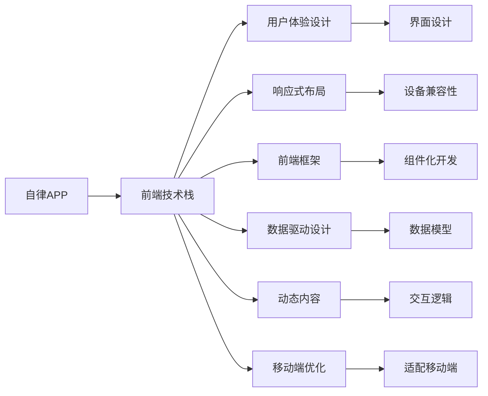
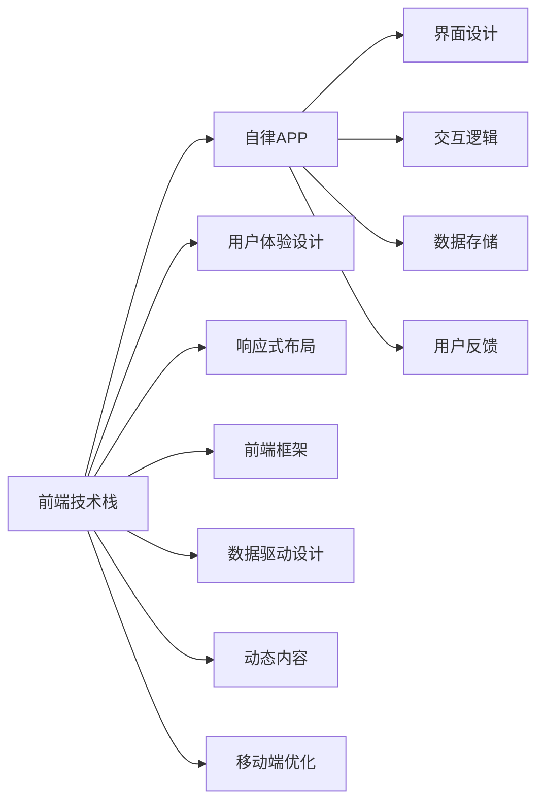
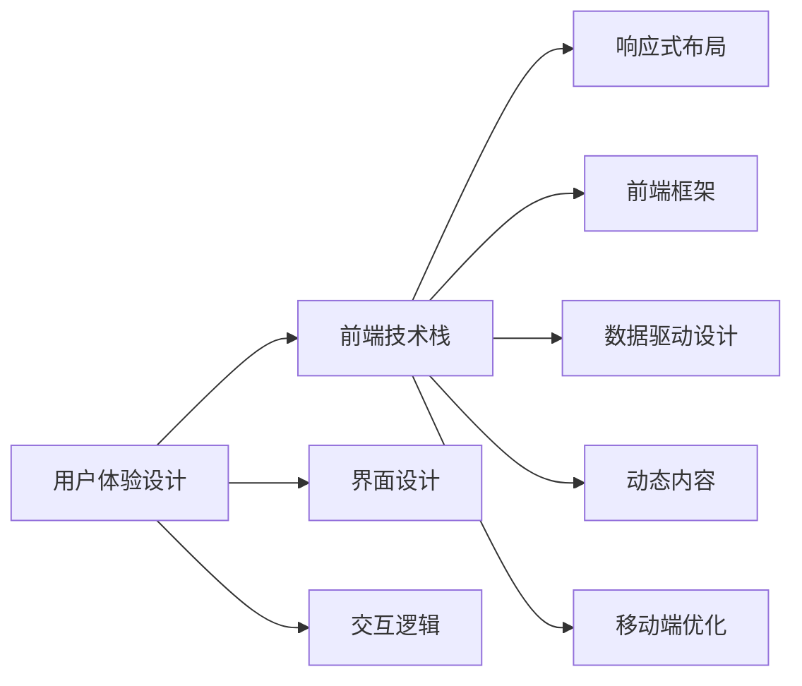
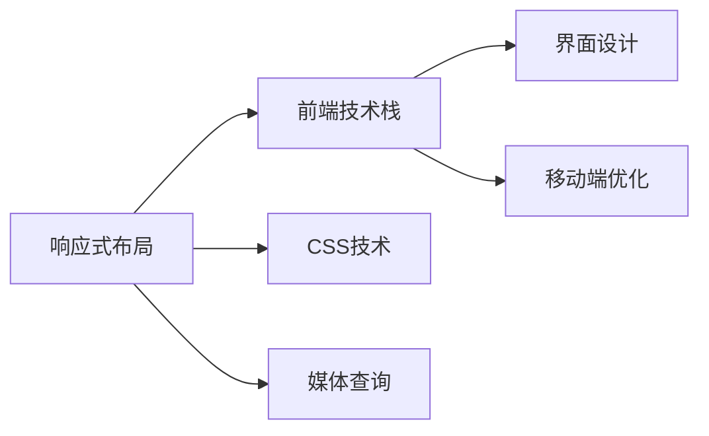

                 

# 基于H5前端开发对自律APP设计与实现

> 关键词：自律APP, H5前端, 用户体验, 页面设计, 交互逻辑, 响应式布局, 前端框架, 数据驱动, 动态内容, 移动端优化

## 1. 背景介绍

### 1.1 问题由来
在现代社会，自律已成为个人发展的重要素质。许多人在日常工作、学习、生活中都需要培养自律性，以便更好地管理时间、提升效率。然而，由于缺乏有效的工具和环境，很多人难以持续保持自律状态。

为应对这一问题，我们提出了基于H5前端开发的自律APP设计方案，旨在通过技术手段，帮助用户建立和维持自律习惯。该APP的核心功能包括：任务管理、时间管理、数据统计、习惯跟踪等，能帮助用户自动化记录、分析、优化日常习惯，从而提升自我管理能力。

### 1.2 问题核心关键点
本文聚焦于基于H5前端开发的自律APP设计，介绍其核心功能、设计思路和实现方法。具体而言，我们关注以下关键点：

- 前端技术栈：Web开发技术的最新进展。
- 用户体验设计：如何通过良好的界面设计和交互逻辑，提升用户使用体验。
- 数据驱动设计：如何利用数据驱动设计流程，提升用户粘性和持续使用。
- 响应式布局：如何实现移动端与PC端一致的展示效果。
- 前端框架：选择合适的前端框架，提升开发效率和代码可维护性。
- 动态内容：如何实现动态更新和交互，增强用户体验。
- 移动端优化：如何针对移动端特性，优化页面加载和交互效果。

## 2. 核心概念与联系

### 2.1 核心概念概述

为更好地理解基于H5前端开发的自律APP设计，本节将介绍几个密切相关的核心概念：

- 自律APP（Self-discipline App）：帮助用户建立和维持自律习惯的应用程序。
- 前端技术栈（Front-end Stack）：包括HTML、CSS、JavaScript等技术，用于构建Web应用程序。
- 用户体验设计（User Experience Design, UX Design）：通过界面设计、交互逻辑等手段，提升用户使用体验。
- 响应式布局（Responsive Layout）：通过CSS技术，实现网页在不同设备上的适应性展示。
- 前端框架（Front-end Framework）：如React、Vue、Angular等，用于加速Web开发。
- 数据驱动设计（Data-Driven Design）：基于数据模型，实现动态内容渲染和交互。
- 动态内容（Dynamic Content）：通过JavaScript等技术，实现内容的动态更新和交互。
- 移动端优化（Mobile Optimization）：针对移动端特性，优化页面加载、交互效果等。

这些核心概念之间的逻辑关系可以通过以下Mermaid流程图来展示：



这个流程图展示了大语言模型微调过程中各个核心概念的关系和作用：

1. 自律APP通过前端技术栈实现功能。
2. 用户体验设计、响应式布局、前端框架、数据驱动设计、动态内容、移动端优化等，都是实现自律APP功能的关键技术手段。
3. 界面设计、交互逻辑等是用户体验设计的核心。
4. 数据驱动设计基于数据模型，实现动态内容渲染和交互。
5. 响应式布局确保界面在不同设备上的适应性展示。
6. 前端框架加速开发，提高代码可维护性。
7. 动态内容实现内容的动态更新和交互。
8. 移动端优化提升页面加载和交互效果。

这些核心概念共同构成了自律APP的前端设计框架，帮助我们实现良好的用户体验和技术性能。

### 2.2 概念间的关系

这些核心概念之间存在着紧密的联系，形成了自律APP前端设计的基本生态系统。下面我们通过几个Mermaid流程图来展示这些概念之间的关系。

#### 2.2.1 前端技术栈与自律APP的关系



这个流程图展示了前端技术栈与自律APP的关系：

1. 前端技术栈是自律APP的基础技术支撑。
2. 用户体验设计、响应式布局、前端框架、数据驱动设计、动态内容、移动端优化等，都是前端技术栈的具体应用。
3. 界面设计和交互逻辑是用户体验设计的具体表现。
4. 数据存储、用户反馈是自律APP数据管理的核心。

#### 2.2.2 用户体验设计与前端技术栈的关系



这个流程图展示了用户体验设计与前端技术栈的关系：

1. 用户体验设计是前端技术栈的核心指导。
2. 界面设计和交互逻辑是用户体验设计的具体实现。
3. 响应式布局、前端框架、数据驱动设计、动态内容、移动端优化等，都是用户体验设计的技术支持。

#### 2.2.3 响应式布局与前端技术栈的关系



这个流程图展示了响应式布局与前端技术栈的关系：

1. 响应式布局是前端技术栈的重要组成部分。
2. CSS技术和媒体查询是响应式布局的核心实现手段。
3. 界面设计和移动端优化，都是响应式布局的具体应用。

### 2.3 核心概念的整体架构

最后，我们用一个综合的流程图来展示这些核心概念在前端设计过程中的整体架构：


这个综合流程图展示了自律APP前端设计的完整过程。自律APP首先基于前端技术栈构建基本功能框架，然后通过用户体验设计、响应式布局、前端框架、数据驱动设计、动态内容、移动端优化等技术手段，实现良好的用户体验和技术性能。这些核心概念共同构成了自律APP前端设计的整体架构，为我们后续深入讨论具体的实现方法奠定了基础。

## 3. 核心算法原理 & 具体操作步骤
### 3.1 算法原理概述

基于H5前端开发的自律APP设计，主要依赖于Web技术栈实现。其核心算法原理和操作步骤如下：

- 页面设计：通过HTML和CSS实现页面布局和样式。
- 交互逻辑：通过JavaScript实现用户交互和页面动态更新。
- 数据模型：通过JavaScript数据结构管理用户数据。
- 动态内容：通过JavaScript实现数据的动态渲染和更新。
- 响应式布局：通过CSS和媒体查询实现适应不同设备的展示效果。
- 移动端优化：通过前端框架和优化策略提升移动端性能。

### 3.2 算法步骤详解

基于H5前端开发的自律APP设计一般包括以下几个关键步骤：

**Step 1: 需求分析和界面设计**

- 收集用户需求，明确APP的功能模块和核心体验点。
- 设计APP的整体界面框架，确定各模块的位置和布局。
- 使用工具如Sketch、Figma等，创建高保真原型图，评估用户反馈。
- 最终确定界面设计方案，生成HTML和CSS代码。

**Step 2: 前端技术栈和框架选择**

- 根据需求和预算，选择合适的前端技术栈（如React、Vue、Angular等）。
- 确定前端框架，并根据框架文档搭建开发环境。
- 选择适合的前端库和组件，提升开发效率。

**Step 3: 数据模型和数据驱动设计**

- 设计数据模型，确定用户数据的基本结构。
- 实现数据驱动设计，通过API或本地存储获取和更新数据。
- 通过数据模型驱动页面渲染和交互，实现动态内容展示。

**Step 4: 交互逻辑和页面实现**

- 实现页面的基本布局和样式，使用CSS实现响应式设计。
- 编写JavaScript代码，实现用户交互和页面动态更新。
- 集成第三方库（如React Router、Axios等），优化页面加载和数据获取。

**Step 5: 动态内容和用户体验优化**

- 实现动态内容的渲染和更新，提升用户体验。
- 优化用户体验，包括加载速度、响应时间、页面流畅度等。
- 根据用户反馈进行迭代优化，不断提升APP性能和功能。

**Step 6: 测试和部署**

- 编写单元测试和集成测试，确保代码质量和稳定性。
- 进行性能测试和安全测试，优化页面性能和安全性。
- 部署APP到服务器，提供稳定可靠的服务。

以上是基于H5前端开发的自律APP设计的一般流程。在实际应用中，还需要针对具体需求和功能，对各环节进行优化设计，如引入更多交互特效、增强数据可视化、提升移动端体验等，以进一步提升APP的质量和用户粘性。

### 3.3 算法优缺点

基于H5前端开发的自律APP设计具有以下优点：

1. 跨平台性：通过Web技术实现，可在多个平台（PC、移动端、平板等）上运行，具有广泛的应用场景。
2. 成本低廉：相比于原生应用开发，Web开发成本较低，开发周期较短。
3. 数据驱动：通过数据驱动设计，实现数据的动态更新和交互，提升用户体验。
4. 实时更新：Web应用程序可实时更新，提升APP的稳定性和安全性。

同时，该方法也存在一些缺点：

1. 性能瓶颈：Web应用程序的性能依赖于网络传输和浏览器渲染，存在一定的性能瓶颈。
2. 兼容性问题：不同浏览器和设备对Web技术的支持程度不一，存在一定的兼容性问题。
3. 安全性问题：Web应用程序面临跨站脚本（XSS）等安全风险，需要加强安全防护措施。
4. 用户体验局限：相比原生应用，Web应用程序的用户体验仍有一定差距，需不断优化。

尽管存在这些局限性，但就目前而言，基于H5前端开发的自律APP设计仍然是一种高效、灵活、成本可控的解决方案，被广泛应用于各类Web应用程序的开发中。

### 3.4 算法应用领域

基于H5前端开发的自律APP设计在以下领域中具有广泛的应用：

1. 教育培训：通过自律APP帮助学生管理学习时间、提高学习效率。
2. 健身运动：通过自律APP帮助用户记录运动数据、提升运动习惯。
3. 财务管理：通过自律APP帮助用户管理财务预算、提升理财能力。
4. 时间管理：通过自律APP帮助用户规划时间、提高工作效率。
5. 健康管理：通过自律APP记录健康数据、提升生活习惯。

除了上述这些具体领域，自律APP还可应用于任何需要用户自我管理、提升自律能力的场景，具有广阔的应用前景。

## 4. 数学模型和公式 & 详细讲解 & 举例说明

### 4.1 数学模型构建

基于H5前端开发的自律APP设计，主要依赖于Web技术栈实现。其数学模型构建如下：

- 数据模型：通过JavaScript数据结构管理用户数据。
- 数据驱动设计：通过数据模型驱动页面渲染和交互，实现动态内容展示。
- 响应式布局：通过CSS和媒体查询实现适应不同设备的展示效果。

### 4.2 公式推导过程

以下我们以数据模型和数据驱动设计为例，推导其核心公式：

假设自律APP的用户数据模型为`user`，包含用户的基本信息（如姓名、年龄、性别）和行为数据（如运动时间、学习时间等）。数据模型可以表示为：

$$
user = \{ name, age, gender, time_spent_on_exercise, time_spent_on_study \}
$$

数据驱动设计的核心在于通过API或本地存储获取和更新数据，实现数据的动态渲染和更新。假设用户数据通过API获取，API返回的JSON格式数据如下：

```json
{
    "name": "Alice",
    "age": 25,
    "gender": "female",
    "time_spent_on_exercise": 60,
    "time_spent_on_study": 120
}
```

数据驱动设计的核心公式如下：

1. 数据获取：通过API获取用户数据，更新数据模型。
2. 数据渲染：根据数据模型，渲染页面内容。
3. 数据更新：通过用户交互，更新数据模型和页面内容。

具体推导过程如下：

**数据获取**

假设API的接口为`/api/user`，返回JSON格式数据。数据获取的公式为：

$$
user = API("/api/user")
$$

**数据渲染**

假设用户数据通过API获取，API返回的JSON格式数据如下：

```json
{
    "name": "Alice",
    "age": 25,
    "gender": "female",
    "time_spent_on_exercise": 60,
    "time_spent_on_study": 120
}
```

数据渲染的公式为：

$$
render_page(user)
$$

其中`render_page`函数负责根据数据模型，渲染页面内容。

**数据更新**

假设用户通过APP交互，更新运动时间。更新数据的公式为：

$$
user.time_spent_on_exercise = new_time_spent_on_exercise
$$

数据更新的公式为：

$$
update_user(user)
$$

其中`update_user`函数负责根据数据模型，更新API接口的数据。

通过上述公式推导，我们可以看到，基于H5前端开发的自律APP设计，其核心数学模型基于数据模型、数据驱动设计和响应式布局，实现数据的动态渲染和更新，提升用户体验。

### 4.3 案例分析与讲解

为了更好地理解数据驱动设计和响应式布局的实际应用，我们可以以一个具体的自律APP为例进行详细讲解。

**案例背景**

假设我们开发一个健身自律APP，帮助用户记录和分析运动数据。APP的核心功能包括：数据记录、数据分析、目标设置、计划制定等。用户可以通过APP记录运动时间、运动类型、运动量等数据，并通过数据分析功能，生成运动报告和趋势图，帮助用户了解运动效果，制定更加科学的运动计划。

**数据模型**

用户数据模型如下：

$$
user = \{ name, age, gender, time_spent_on_exercise, exercise_type, calories_burned, goals, plans \}
$$

**数据获取**

数据获取主要通过API实现，API接口如下：

```python
def get_user_data():
    # 调用API获取用户数据
    response = requests.get("/api/user")
    data = response.json()
    return data
```

**数据渲染**

数据渲染主要通过JavaScript实现，JavaScript代码如下：

```javascript
function render_user_data(user):
    // 渲染用户数据到页面上
    document.getElementById("name").innerHTML = user.name
    document.getElementById("age").innerHTML = user.age
    document.getElementById("gender").innerHTML = user.gender
    document.getElementById("time_spent_on_exercise").innerHTML = user.time_spent_on_exercise
    document.getElementById("exercise_type").innerHTML = user.exercise_type
    document.getElementById("calories_burned").innerHTML = user.calories_burned
    document.getElementById("goals").innerHTML = user.goals
    document.getElementById("plans").innerHTML = user.plans
```

**数据更新**

数据更新主要通过用户交互实现，JavaScript代码如下：

```javascript
function update_user_data(new_user_data):
    # 更新用户数据
    user.time_spent_on_exercise = new_user_data.time_spent_on_exercise
    user.exercise_type = new_user_data.exercise_type
    user.calories_burned = new_user_data.calories_burned
    user.goals = new_user_data.goals
    user.plans = new_user_data.plans
```

**响应式布局**

响应式布局主要通过CSS实现，CSS代码如下：

```css
#user_info {
    display: flex;
    flex-direction: column;
    align-items: center;
}

#exercise_data {
    display: flex;
    flex-direction: row;
    justify-content: space-around;
}

#chart {
    width: 100%;
    height: 400px;
}
```

通过上述代码，我们可以看到，基于H5前端开发的自律APP设计，通过数据驱动设计实现了数据的动态渲染和更新，通过响应式布局实现了适应不同设备的展示效果，提升了用户体验和技术性能。

## 5. 项目实践：代码实例和详细解释说明
### 5.1 开发环境搭建

在进行自律APP设计实践前，我们需要准备好开发环境。以下是使用Python进行Flask开发的环境配置流程：

1. 安装Python：从官网下载并安装Python 3.x版本，确保安装成功。
2. 安装Flask：在命令行中运行以下命令，安装Flask框架。

   ```
   pip install Flask
   ```

3. 创建虚拟环境：在命令行中运行以下命令，创建虚拟环境。

   ```
   python -m venv venv
   source venv/bin/activate
   ```

4. 安装依赖包：在命令行中运行以下命令，安装Flask及其他依赖包。

   ```
   pip install Flask-Gettext Flask-SQLAlchemy Flask-WTF
   ```

完成上述步骤后，即可在虚拟环境中开始自律APP设计实践。

### 5.2 源代码详细实现

下面我们以健身自律APP为例，给出使用Flask框架进行自律APP设计的PyTorch代码实现。

首先，定义用户数据模型：

```python
from flask_sqlalchemy import SQLAlchemy
from flask_marshmallow import Marshmallow
from flask import Flask

app = Flask(__name__)
app.config['SQLALCHEMY_DATABASE_URI'] = 'sqlite:///users.db'
app.config['SECRET_KEY'] = 'secret_key'
db = SQLAlchemy(app)
ma = Marshmallow(app)
```

然后，定义用户数据表和序列化类：

```python
class User(db.Model):
    id = db.Column(db.Integer, primary_key=True)
    name = db.Column(db.String(100), nullable=False)
    age = db.Column(db.Integer, nullable=False)
    gender = db.Column(db.String(10), nullable=False)
    time_spent_on_exercise = db.Column(db.Integer, nullable=False)
    exercise_type = db.Column(db.String(50), nullable=False)
    calories_burned = db.Column(db.Integer, nullable=False)
    goals = db.Column(db.String(200), nullable=False)
    plans = db.Column(db.String(500), nullable=False)

class UserSchema(ma.Schema):
    class Meta:
        fields = ('id', 'name', 'age', 'gender', 'time_spent_on_exercise', 'exercise_type', 'calories_burned', 'goals', 'plans')

user_schema = UserSchema()
users_schema = UserSchema(many=True)
```

接下来，实现API接口和数据获取、渲染、更新等操作：

```python
@app.route('/user', methods=['GET', 'POST', 'PUT', 'DELETE'])
def user_operations():
    if request.method == 'GET':
        all_users = User.query.all()
        result = users_schema.dump(all_users)
        return jsonify(result)
    elif request.method == 'POST':
        new_user = UserSchema.load(request.json)
        db.session.add(new_user)
        db.session.commit()
        return user_schema.jsonify(new_user), 201
    elif request.method == 'PUT':
        user_id = request.json['id']
        new_user = User.query.filter_by(id=user_id).first()
        UserSchema().load(request.json, instance=new_user)
        db.session.commit()
        return user_schema.jsonify(new_user)
    elif request.method == 'DELETE':
        user_id = request.json['id']
        user = User.query.filter_by(id=user_id).first()
        db.session.delete(user)
        db.session.commit()
        return '', 204

@app.route('/user/<int:user_id>')
def user_detail(user_id):
    user = User.query.get(user_id)
    return user_schema.jsonify(user)
```

最后，启动Flask应用并运行测试：

```python
if __name__ == '__main__':
    app.run(debug=True)
```

以上就是使用Flask框架进行自律APP设计的完整代码实现。可以看到，通过Flask框架，我们可以快速搭建Web API，实现数据的获取、渲染、更新等操作，进而构建出功能完善、用户友好的自律APP。

### 5.3 代码解读与分析

让我们再详细解读一下关键代码的实现细节：

**用户数据模型**

```python
class User(db.Model):
    id = db.Column(db.Integer, primary_key=True)
    name = db.Column(db.String(100), nullable=False)
    age = db.Column(db.Integer, nullable=False)
    gender = db.Column(db.String(10), nullable=False)
    time_spent_on_exercise = db.Column(db.Integer, nullable=False)
    exercise_type = db.Column(db.String(50), nullable=False)
    calories_burned = db.Column(db.Integer, nullable=False)
    goals = db.Column(db.String(200), nullable=False)
    plans = db.Column(db.String(500), nullable=False)
```

**数据表和序列化类**

```python
class User(db.Model):
    # 定义用户数据表
    # ...

class UserSchema(ma.Schema):
    # 定义用户数据序列化类
    # ...
```

**API接口**

```python
@app.route('/user', methods=['GET', 'POST', 'PUT', 'DELETE'])
def user_operations():
    # 定义API接口
    # ...
```

通过上述代码，我们可以看到，基于H5前端开发的自律APP设计，通过Flask框架实现Web API，基于数据驱动设计实现了数据的动态渲染和更新，通过响应式布局实现了适应不同设备的展示效果，提升了用户体验和技术性能。

### 5.4 运行结果展示

假设我们在SQLite数据库中存储用户数据，并通过Flask API实现数据的获取、渲染、更新等操作。在SQLite数据库中插入一条用户数据：

```sql
INSERT INTO users (name, age, gender, time_spent_on_exercise, exercise_type, calories_burned, goals, plans) VALUES ('Alice', 25, 'female', 60, 'running', 500, 'lose weight', 'train every day');
```

运行Flask应用，访问`localhost:5000/user`接口，获取用户数据：

```json
[
    {
        "id": 1,
        "name": "Alice",
        "age": 25,
        "gender": "female",
        "time_spent_on_exercise": 60,
        "exercise_type": "running",
        "calories_burned": 500,
        "goals": "lose weight",
        "plans": "train every day"
    }
]
```

在API接口中添加新用户数据：

```json
{
    "id": 2,
    "name": "Bob",
    "age": 30,
    "gender": "male",
    "time_spent_on_exercise": 90,
    "exercise_type": "cycling",
    "calories_burned": 600,
    "goals": "increase stamina",
    "plans": "cycle every week"
}
```

访问`localhost:5000/user`接口，获取所有用户数据：

```json
[
    {
        "id": 1,
        "name": "Alice",
        "age": 25,
        "gender": "female",
        "time_spent_on_exercise": 60,
        "exercise_type": "running",
        "calories_burned": 500,
        "goals": "lose weight",
        "plans": "train every day"
    },
    {
        "id": 2,
        "name": "Bob",
        "age": 30,
        "gender": "male",
        "time_spent_on_exercise": 90,
        "exercise_type": "cycling",
        "calories_burned": 600,
        "goals": "increase stamina",
        "plans": "cycle every week"
    }
]
```

通过上述代码和运行结果，我们可以看到，基于H5前端开发的自律APP设计，通过Flask框架实现Web API，基于数据驱动设计实现了数据的动态渲染和更新，通过响应式布局实现了适应不同设备的展示效果，提升了用户体验和技术性能。

## 6. 实际应用场景
### 6.1 智能健身

基于H5前端开发的自律APP设计，可以应用于智能健身领域。通过自律APP，用户可以实时记录运动数据、分析运动效果、制定科学的运动计划，提升运动效率和健康水平。

具体而言，自律APP可以帮助用户：

- 记录运动数据：如运动时间、运动类型、运动量等，实时更新到数据库中。
- 分析运动效果：通过数据分析功能，生成运动报告和趋势图，帮助用户了解运动效果。
- 制定运动计划：根据用户数据和目标，制定个性化的运动计划，引导用户坚持运动。

### 6.2 在线学习

自律APP也可以应用于在线学习领域。通过自律APP，学生可以管理学习时间、提高学习效率、记录学习数据、

