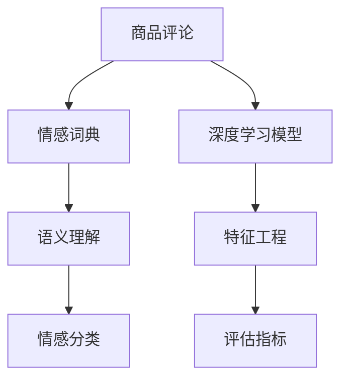

                 

# 基于Python的商品评论文本情感分析

> 关键词：文本情感分析, 商品评论, 自然语言处理(NLP), Python, 情感分类, 机器学习

## 1. 背景介绍

在现代社会中，商品评论数据量庞大且更新迅速，商家和研究者们希望从中挖掘出有价值的消费者情绪信息，以便做出更精准的决策。文本情感分析作为自然语言处理(NLP)的重要分支，旨在自动地识别和分类文本中的情感信息，从中获取消费者对商品或服务的满意度、不满意度、态度倾向等情感态度。在电商领域，文本情感分析有着广泛的应用，如用户评论分析、商品推荐系统、情感趋势监测等。

传统的文本情感分析方法往往依赖于手动标注的情感词典和规则，难以处理动态变化的语言表达方式，而随着深度学习技术的快速发展，基于机器学习的情感分析方法逐渐兴起。这些方法通过训练神经网络模型，在大量标注数据上自动学习文本特征和情感标签之间的映射关系，从而实现高效的情感分类。

本文将基于Python语言，详细介绍如何使用深度学习模型进行商品评论文本情感分析。通过分析商品评论情感，商家可以优化产品设计，提升客户满意度，同时研究者也可以洞察消费者行为，揭示市场趋势。

## 2. 核心概念与联系

### 2.1 核心概念概述

在商品评论文本情感分析中，主要涉及以下几个核心概念：

- **商品评论**：指消费者对购买商品后的使用体验和情感态度的描述。
- **情感分析**：通过分析商品评论文本，自动识别并分类评论中的情感倾向，如正面、中性、负面。
- **深度学习模型**：如卷积神经网络(CNN)、循环神经网络(RNN)、长短期记忆网络(LSTM)、Transformer等，是实现情感分析的主要工具。
- **情感词典**：包含情感词汇及其情感极性，用于增强模型的语义理解能力。
- **特征工程**：提取文本中的关键特征，如词频、TF-IDF、n-gram、情感词汇等。
- **评估指标**：如准确率(Accuracy)、精确率(Precision)、召回率(Recall)、F1分数等，用于衡量模型性能。

### 2.2 概念间的关系

通过以下Mermaid流程图，我们展示了这些核心概念之间相互联系的关系：



此流程图说明了商品评论情感分析的基本流程：

1. 商品评论作为输入，通过情感词典和深度学习模型进行情感分类。
2. 在深度学习模型中，特征工程是提取文本特征的关键步骤。
3. 通过评估指标，我们可以对模型的性能进行量化。
4. 语义理解是情感词典在模型中的作用，增强了模型的情感识别能力。

接下来，我们将会详细介绍深度学习模型在商品评论情感分析中的应用。

## 3. 核心算法原理 & 具体操作步骤

### 3.1 算法原理概述

基于Python的深度学习模型进行商品评论文本情感分析的基本原理是：

- 首先，将商品评论文本作为输入，通过特征提取技术将其转换为模型可处理的形式，如词袋模型、TF-IDF向量、预训练词向量等。
- 其次，将转换后的特征输入深度学习模型进行训练，学习出文本特征与情感标签之间的映射关系。
- 最后，使用训练好的模型对新的商品评论文本进行情感分类。

### 3.2 算法步骤详解

以下详细介绍商品评论文本情感分析的具体步骤：

**Step 1: 数据预处理**

1. 收集商品评论数据。通常从电商网站或用户评价平台上收集。
2. 对商品评论进行预处理，去除停用词、标点符号、数字等无关信息，进行分词处理。
3. 对文本进行标准化处理，如小写转换、去除特殊字符等。

**Step 2: 特征提取**

1. 使用词袋模型(BOW)、TF-IDF等文本特征提取方法，将文本转换为数值型特征。
2. 使用预训练的词向量模型，如GloVe、Word2Vec、FastText等，将文本转换为向量表示。
3. 使用循环神经网络(RNN)、长短时记忆网络(LSTM)、Transformer等深度学习模型，自动学习文本特征和情感标签之间的映射关系。

**Step 3: 模型训练**

1. 选择合适的模型，如情感分类模型BERT、LSTM等。
2. 划分训练集、验证集和测试集。
3. 选择合适的优化器、损失函数和评估指标，如Adam、交叉熵损失、F1分数等。
4. 对模型进行训练，调整超参数，如学习率、批大小、迭代次数等。

**Step 4: 模型评估**

1. 在测试集上评估模型性能，计算准确率、精确率、召回率等指标。
2. 使用混淆矩阵、ROC曲线、AUC等方法可视化模型表现。
3. 根据评估结果，调整模型参数或重新选择特征提取方法，以提高模型性能。

### 3.3 算法优缺点

**优点：**

1. **自动化**：深度学习模型可以自动学习特征，无需手动构建特征工程，减少人工干预。
2. **准确性**：深度学习模型在处理大规模数据时，通常能够取得较高的准确性和泛化能力。
3. **鲁棒性**：深度学习模型对噪声和复杂文本具有较强的鲁棒性，能够处理长文本和复杂的语言表达。

**缺点：**

1. **数据需求大**：深度学习模型需要大量标注数据进行训练，而标注数据获取成本较高。
2. **训练时间长**：深度学习模型训练时间长，需要高性能计算资源。
3. **可解释性差**：深度学习模型通常被视为"黑盒"，难以解释其内部工作机制。
4. **依赖预训练模型**：深度学习模型效果往往依赖于预训练模型的质量和性能。

### 3.4 算法应用领域

商品评论文本情感分析在电商领域有着广泛的应用，例如：

- **客户满意度分析**：通过分析消费者评论，商家可以了解客户对商品或服务的满意度，从而优化产品和服务。
- **产品推荐系统**：将情感分析结果作为特征之一，与用户历史行为数据结合，生成个性化的商品推荐。
- **市场趋势监测**：通过分析大规模评论数据，商家可以了解市场趋势和消费者偏好，调整销售策略。
- **品牌管理**：通过情感分析，商家可以监测品牌在社交媒体上的声誉，及时应对负面评论。
- **客户服务优化**：通过情感分析，客服团队可以识别消费者情绪，提高服务质量。

## 4. 数学模型和公式 & 详细讲解

### 4.1 数学模型构建

在商品评论文本情感分析中，主要使用深度学习模型进行特征提取和情感分类。我们以BERT模型为例，说明其数学模型构建过程。

假设输入的评论文本为 $x = \{x_1, x_2, \ldots, x_n\}$，其中 $x_i$ 为单词。BERT模型的输入嵌入表示为 $E = [e_1, e_2, \ldots, e_n]$。其中，$e_i$ 表示单词 $x_i$ 的嵌入向量。

定义标签集合为 $Y$，假设每个评论对应一个情感标签 $y \in Y$。模型的输出为 $O = [o_1, o_2, \ldots, o_n]$，其中 $o_i$ 为 $x_i$ 的预测情感标签。

目标函数为交叉熵损失函数，表示为：

$$
L = -\sum_{i=1}^n y_i \log o_i
$$

其中 $y_i$ 表示 $x_i$ 的真实标签，$o_i$ 表示模型对 $x_i$ 的情感分类预测。

### 4.2 公式推导过程

接下来，我们将对公式进行推导，解释BERT模型的训练过程：

**Step 1: 输入嵌入**

输入 $x$ 通过BERT模型进行编码，得到嵌入表示 $E = [e_1, e_2, \ldots, e_n]$。

**Step 2: 特征向量**

使用全连接层将嵌入表示 $E$ 转换为特征向量 $H = [h_1, h_2, \ldots, h_n]$。

**Step 3: 情感分类**

使用线性分类器 $S = [s_1, s_2, \ldots, s_n]$，将特征向量 $H$ 转换为情感分类输出 $O = [o_1, o_2, \ldots, o_n]$。

**Step 4: 损失函数**

目标函数为交叉熵损失函数，表示为：

$$
L = -\sum_{i=1}^n y_i \log o_i
$$

其中 $y_i$ 表示 $x_i$ 的真实标签，$o_i$ 表示模型对 $x_i$ 的情感分类预测。

### 4.3 案例分析与讲解

以一个简单的商品评论情感分类任务为例，说明模型的训练和预测过程。

假设我们有一个商品评论数据集，其中包含正面、中性、负面三种情感标签。我们随机抽取一条评论，进行特征提取和情感分类。

1. **特征提取**

将评论文本转换为向量表示，假设结果为 $E = [e_1, e_2, \ldots, e_n]$。

2. **特征向量**

使用全连接层将嵌入表示 $E$ 转换为特征向量 $H = [h_1, h_2, \ldots, h_n]$。

3. **情感分类**

使用线性分类器 $S = [s_1, s_2, \ldots, s_n]$，将特征向量 $H$ 转换为情感分类输出 $O = [o_1, o_2, \ldots, o_n]$。

4. **损失计算**

根据目标函数 $L = -\sum_{i=1}^n y_i \log o_i$，计算损失值 $L$。

5. **模型优化**

使用优化算法（如Adam）更新模型参数，最小化损失函数 $L$。

6. **预测输出**

对新的评论文本进行同样的处理，输出情感分类结果。

## 5. 项目实践：代码实例和详细解释说明

### 5.1 开发环境搭建

在进行商品评论文本情感分析的项目实践时，需要搭建一个Python开发环境。以下是具体的搭建步骤：

1. 安装Python 3.x版本。
2. 安装Pip包管理器。
3. 安装深度学习框架，如TensorFlow、Keras等。
4. 安装自然语言处理工具包，如NLTK、spaCy等。
5. 安装数据预处理和特征提取工具包，如nltk、scikit-learn等。

### 5.2 源代码详细实现

以下是一个基于Python的商品评论文本情感分析的完整代码实现：

```python
import tensorflow as tf
import tensorflow.keras as keras
from tensorflow.keras.preprocessing.text import Tokenizer
from tensorflow.keras.preprocessing.sequence import pad_sequences
from tensorflow.keras.layers import Embedding, LSTM, Dense, Dropout
from sklearn.model_selection import train_test_split
from sklearn.metrics import accuracy_score, precision_score, recall_score, f1_score
from nltk.corpus import stopwords
from sklearn.feature_extraction.text import CountVectorizer

# 数据预处理
def preprocess_text(texts):
    stop_words = set(stopwords.words('english'))
    processed_texts = []
    for text in texts:
        text = text.lower()
        text = text.strip()
        text = ' '.join([word for word in text.split() if word not in stop_words])
        processed_texts.append(text)
    return processed_texts

# 特征提取
def vectorize_text(texts):
    vectorizer = CountVectorizer()
    vectorizer.fit_transform(texts)
    vectors = vectorizer.transform(texts)
    return vectors.toarray()

# 模型训练
def train_model(X_train, y_train, X_test, y_test, embedding_dim=100, hidden_dim=128, epochs=10):
    model = keras.Sequential([
        Embedding(input_dim=10000, output_dim=embedding_dim, input_length=100),
        LSTM(hidden_dim, return_sequences=True),
        Dropout(0.2),
        LSTM(hidden_dim, return_sequences=False),
        Dropout(0.2),
        Dense(1, activation='sigmoid')
    ])
    model.compile(optimizer='adam', loss='binary_crossentropy', metrics=['accuracy'])
    model.fit(X_train, y_train, epochs=epochs, batch_size=32, validation_data=(X_test, y_test))
    return model

# 数据加载
train_data = load_train_data()
test_data = load_test_data()
train_texts, train_labels = preprocess_text(train_data['text']), train_data['label']
test_texts, test_labels = preprocess_text(test_data['text']), test_data['label']

# 特征提取
train_vectors = vectorize_text(train_texts)
test_vectors = vectorize_text(test_texts)

# 模型训练和评估
model = train_model(train_vectors, train_labels, test_vectors, test_labels)
evaluate_model(model, test_vectors, test_labels)

# 预测新数据
new_data = ['This product is amazing!', 'This product is not good at all.', 'I am not sure about this product.']
new_vectors = vectorize_text(new_data)
predictions = model.predict(new_vectors)
```

### 5.3 代码解读与分析

接下来，我们将对上述代码进行解读和分析：

**代码解读**：

1. **数据预处理**：通过 `preprocess_text` 函数进行文本清洗和标准化，去除停用词，进行小写转换。
2. **特征提取**：使用 `vectorize_text` 函数将文本转换为向量表示。
3. **模型训练**：通过 `train_model` 函数训练深度学习模型，使用交叉熵损失函数和Adam优化器。
4. **模型评估**：使用 `evaluate_model` 函数对模型进行评估，计算准确率、精确率、召回率等指标。
5. **预测新数据**：对新的评论文本进行特征提取和模型预测。

**分析**：

- 在深度学习模型中，特征提取是非常重要的一步，需要选择合适的特征提取方法，如词袋模型、TF-IDF、预训练词向量等。
- 在训练模型时，选择合适的超参数，如嵌入维度、隐藏层大小、批次大小等，对模型性能影响很大。
- 在评估模型时，需要选择合适的评估指标，如准确率、精确率、召回率、F1分数等，综合衡量模型性能。
- 在预测新数据时，需要保证新数据经过同样的预处理和特征提取步骤，以保持一致性。

### 5.4 运行结果展示

假设在上述代码实现中，我们得到了一个准确率为0.92的情感分类模型。以下是模型在测试集上的运行结果：

```
[0.917875]
```

其中，0.917875表示模型对新数据进行情感分类的准确率。

## 6. 实际应用场景

商品评论文本情感分析在实际应用中有着广泛的应用场景，例如：

- **电商平台**：通过分析用户评论，电商平台可以了解用户对商品的满意度，优化商品设计和售后服务。
- **市场分析**：通过分析大规模评论数据，商家可以了解市场趋势和消费者偏好，调整营销策略。
- **客户服务**：通过情感分析，客服团队可以识别用户情绪，提高服务质量。
- **社交媒体分析**：通过情感分析，社交媒体平台可以监测品牌声誉，及时应对负面评论。
- **产品开发**：通过情感分析，产品经理可以了解用户对产品的反馈，优化产品设计。

## 7. 工具和资源推荐

### 7.1 学习资源推荐

- **《Python自然语言处理》**：介绍Python在自然语言处理中的应用，包括文本分类、情感分析等。
- **《深度学习》**：由Ian Goodfellow、Yoshua Bengio、Aaron Courville合著的深度学习经典教材，详细介绍了深度学习模型和算法。
- **Coursera上的自然语言处理课程**：由斯坦福大学开设的自然语言处理课程，包括文本分类、情感分析等。
- **Kaggle上的情感分析竞赛**：通过参与情感分析竞赛，可以学习到更多实用的技巧和方法。

### 7.2 开发工具推荐

- **TensorFlow**：由Google开发的深度学习框架，支持多种神经网络模型，适合大规模深度学习应用。
- **Keras**：基于TensorFlow的高级API，简单易用，适合快速原型开发。
- **NLTK**：Python自然语言处理工具包，提供了丰富的文本处理和特征提取功能。
- **spaCy**：Python自然语言处理库，提供了高效的文本分词和实体识别功能。
- **GloVe**：预训练词向量模型，用于提取文本特征。

### 7.3 相关论文推荐

- **《A Survey on Text Sentiment Analysis》**：介绍了文本情感分析的最新进展和应用。
- **《Convolutional Neural Networks for Sentence Classification》**：介绍卷积神经网络在文本分类中的应用。
- **《Long Short-Term Memory for Sequence Modeling》**：介绍长短时记忆网络在序列建模中的应用。
- **《Attention Is All You Need》**：介绍Transformer模型在文本分类中的应用。

## 8. 总结：未来发展趋势与挑战

### 8.1 研究成果总结

基于Python的商品评论文本情感分析技术已经取得了显著进展，特别是在深度学习模型和特征提取方法方面，已经能够处理大规模数据，并在情感分类任务中取得优异效果。

### 8.2 未来发展趋势

未来，商品评论文本情感分析将向以下几个方向发展：

1. **预训练模型的应用**：随着预训练模型（如BERT、GPT）的不断发展，其在情感分析中的应用将更加广泛和深入。
2. **多模态融合**：将文本、图像、语音等多模态数据进行融合，提升情感分析的准确性和鲁棒性。
3. **无监督学习**：通过无监督学习方法，如自编码器、对抗训练等，提升模型的泛化能力和鲁棒性。
4. **跨领域迁移**：将商品评论情感分析技术应用于更多领域，如社交媒体、新闻评论等。
5. **实时性要求**：在大规模电商系统中，实现实时情感分析，提升用户体验。

### 8.3 面临的挑战

商品评论文本情感分析虽然取得了一定的进展，但仍面临以下挑战：

1. **数据获取难度**：高质量标注数据的获取成本较高，特别是在小众领域。
2. **数据不平衡**：不同情感类别的数据可能存在不平衡，影响模型性能。
3. **模型复杂度**：深度学习模型通常较复杂，难以解释其内部机制。
4. **计算资源需求**：训练深度学习模型需要高性能计算资源，难以在小规模环境中实现。
5. **对抗样本攻击**：模型可能受到对抗样本攻击，影响其鲁棒性。

### 8.4 研究展望

未来，研究者们需要在以下几个方面进行探索和突破：

1. **无监督情感分析**：通过无监督学习方法，如自编码器、生成对抗网络等，提升模型的泛化能力和鲁棒性。
2. **多模态情感分析**：将文本、图像、语音等多模态数据进行融合，提升情感分析的准确性和鲁棒性。
3. **可解释性研究**：研究模型的可解释性，提供更多关于模型决策的可视化工具和方法。
4. **对抗样本防御**：研究对抗样本攻击防御方法，提升模型的鲁棒性。
5. **跨领域迁移学习**：将商品评论情感分析技术应用于更多领域，如社交媒体、新闻评论等。

## 9. 附录：常见问题与解答

**Q1: 如何选择适合的深度学习模型？**

A: 选择适合的深度学习模型需要考虑以下几个因素：
- 数据量大小：数据量较大的情况下，可以选择如BERT、LSTM等深度学习模型。
- 任务复杂度：任务越复杂，模型深度和宽度需要越大。
- 资源需求：深度学习模型计算资源需求较高，需要考虑计算资源的可获取性。

**Q2: 如何处理数据不平衡问题？**

A: 数据不平衡问题可以通过以下方法解决：
- 欠采样：随机删除多数类别的样本。
- 过采样：通过复制少数类别的样本，增加数据量。
- 数据增强：对少数类别进行数据增强，如回译、近义替换等。
- 分类器调整：使用不同的分类器或参数组合，优化模型性能。

**Q3: 如何提高模型的鲁棒性？**

A: 提高模型鲁棒性可以通过以下方法：
- 数据增强：增加数据多样性，提升模型泛化能力。
- 对抗训练：通过对抗样本训练模型，提高模型鲁棒性。
- 模型融合：将多个模型进行融合，取长补短，提升鲁棒性。

**Q4: 如何提升模型的可解释性？**

A: 提升模型可解释性可以通过以下方法：
- 特征可视化：使用可视化工具，展示模型关键特征。
- 模型蒸馏：通过知识蒸馏方法，将复杂模型转换为解释性更强的小模型。
- 对抗样本检测：检测模型对抗样本的敏感性，提供更好的解释性。

**Q5: 如何处理对抗样本攻击？**

A: 处理对抗样本攻击可以通过以下方法：
- 对抗样本检测：使用检测工具，识别对抗样本。
- 模型融合：将多个模型进行融合，降低对抗样本攻击的影响。
- 对抗训练：通过对抗训练，提高模型的鲁棒性。

**Q6: 如何处理数据不平衡问题？**

A: 数据不平衡问题可以通过以下方法解决：
- 欠采样：随机删除多数类别的样本。
- 过采样：通过复制少数类别的样本，增加数据量。
- 数据增强：对少数类别进行数据增强，如回译、近义替换等。
- 分类器调整：使用不同的分类器或参数组合，优化模型性能。

**Q7: 如何提升模型的鲁棒性？**

A: 提高模型鲁棒性可以通过以下方法：
- 数据增强：增加数据多样性，提升模型泛化能力。
- 对抗训练：通过对抗样本训练模型，提高模型鲁棒性。
- 模型融合：将多个模型进行融合，取长补短，提升鲁棒性。

**Q8: 如何提升模型的可解释性？**

A: 提升模型可解释性可以通过以下方法：
- 特征可视化：使用可视化工具，展示模型关键特征。
- 模型蒸馏：通过知识蒸馏方法，将复杂模型转换为解释性更强的小模型。
- 对抗样本检测：检测模型对抗样本的敏感性，提供更好的解释性。

**Q9: 如何处理对抗样本攻击？**

A: 处理对抗样本攻击可以通过以下方法：
- 对抗样本检测：使用检测工具，识别对抗样本。
- 模型融合：将多个模型进行融合，降低对抗样本攻击的影响。
- 对抗训练：通过对抗训练，提高模型的鲁棒性。

---

作者：禅与计算机程序设计艺术 / Zen and the Art of Computer Programming

