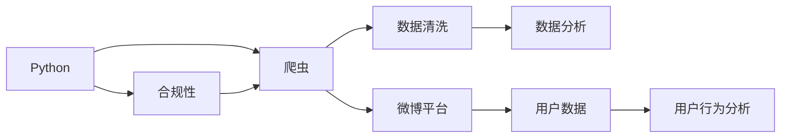

                 

# 基于Python的新浪微博用户信息爬取与分析

> 关键词：Python, 微博, 用户信息, 爬虫, 数据分析

## 1. 背景介绍

### 1.1 问题由来

在当今信息爆炸的时代，社交媒体平台（如微博）成为人们获取信息和表达自我需求的重要渠道。微博作为中国最具影响力的社交媒体之一，其用户群体庞大且活跃，用户行为数据蕴含了丰富的社交网络和情感分析价值。通过对微博用户信息进行爬取与分析，有助于企业及研究机构了解用户行为趋势、市场热点、舆情走向等信息，为决策提供数据支持。然而，由于微博的快速发展和平台机制的复杂性，如何高效、合规地获取用户信息，并对数据进行有效分析，成为一项具有挑战性的任务。本文将介绍基于Python的微博用户信息爬取与分析方法，通过介绍具体的爬虫实现与数据分析技术，旨在为读者提供全面的解决思路。

### 1.2 问题核心关键点

微博用户信息的爬取与分析涉及以下几个核心问题：

- **爬虫设计**：如何设计一个高效、可靠的爬虫，避免封禁和反爬机制。
- **数据清洗**：如何处理爬取到的大量无结构文本数据，提取出有用信息。
- **数据分析**：如何对清洗后的数据进行统计、可视化分析，提取有价值的信息。
- **合规性**：如何确保爬虫行为符合微博平台的规则，避免法律风险。

本文将围绕这些关键点，详细讨论微博用户信息爬取与分析的实现方法。

### 1.3 问题研究意义

微博用户信息的爬取与分析具有重要意义：

- **市场洞察**：通过分析用户行为数据，可以了解市场需求，为商业决策提供依据。
- **舆情监测**：有助于及时发现和应对社会热点事件，维护品牌声誉。
- **用户画像**：分析用户兴趣、偏好，建立精准的用户画像，为个性化推荐和营销提供支持。
- **学术研究**：提供丰富的数据集，推动社交网络分析、情感分析等领域的学术研究。
- **企业智能化**：帮助企业构建智能客户关系管理系统，提升客户服务质量和效率。

通过基于Python的微博用户信息爬取与分析，可以进一步促进数据驱动的决策，推动社会经济的发展，提升企业的竞争力和市场洞察力。

## 2. 核心概念与联系

### 2.1 核心概念概述

为更好地理解微博用户信息爬取与分析的实现方法，本节将介绍几个密切相关的核心概念：

- **Python**：一种高效、易于学习的编程语言，广泛用于数据科学和机器学习领域。
- **爬虫**：一种自动获取网页信息的程序，可以用于数据爬取和网络信息的自动化处理。
- **数据清洗**：对爬取到的数据进行处理，去除噪声和无用信息，提取出结构化数据。
- **数据分析**：通过统计和可视化技术，从数据中提取有价值的信息和趋势。
- **合规性**：确保爬虫行为符合法律法规和平台规则，避免法律风险和平台封禁。

这些核心概念之间存在紧密的联系，形成了一个完整的微博用户信息爬取与分析框架。

### 2.2 概念间的关系

这些核心概念之间的关系可以通过以下Mermaid流程图来展示：



这个流程图展示了大语言模型微调过程中各个概念的关系：

1. Python作为编程语言，提供了爬虫、数据处理和分析的实现基础。
2. 爬虫自动获取微博平台上的用户数据。
3. 数据清洗将爬取到的无结构文本数据转换为结构化数据。
4. 数据分析从结构化数据中提取有价值的信息。
5. 合规性确保爬虫行为符合法律和平台规则。
6. 最终结果通过用户行为分析提供深度洞察。

## 3. 核心算法原理 & 具体操作步骤

### 3.1 算法原理概述

基于Python的微博用户信息爬取与分析方法，主要涉及以下几个步骤：

1. **爬虫设计**：使用Python编写爬虫程序，模拟用户行为，获取微博数据。
2. **数据清洗**：对爬取到的文本数据进行预处理，如分词、去停用词、去除噪声等。
3. **数据分析**：对清洗后的数据进行统计分析，如用户行为分析、兴趣热点分析等。
4. **结果展示**：通过可视化技术，将分析结果直观展示。

这些步骤将通过具体的算法和操作技术来实现，以下将详细介绍每个步骤的算法原理和具体操作步骤。

### 3.2 算法步骤详解

#### 3.2.1 爬虫设计

爬虫设计是微博用户信息爬取的核心步骤。好的爬虫设计不仅能高效获取数据，还能避免封禁和反爬机制。以下是一个简单的爬虫设计步骤：

1. **请求头伪装**：设置请求头信息，模拟用户浏览器，避免被封禁。
2. **延时控制**：设置请求间隔时间，减少对服务器压力。
3. **异常处理**：对网络异常和服务器错误进行处理，避免程序崩溃。
4. **代理IP使用**：使用代理IP池，切换IP地址，避免封禁。
5. **数据存储**：将爬取到的数据存储到本地文件或数据库，便于后续处理。

```python
import requests
from fake_useragent import UserAgent
from bs4 import BeautifulSoup
import time
import random

def get_page(url):
    headers = {
        'User-Agent': UserAgent().random,
        'Proxy': 'http://10.10.10.10:3128',
    }
    try:
        response = requests.get(url, headers=headers, timeout=10)
        response.raise_for_status()
        return response.text
    except requests.exceptions.RequestException as e:
        print(e)
        time.sleep(random.randint(5, 15))

def save_data(data, filename):
    with open(filename, 'w', encoding='utf-8') as f:
        f.write(data)
```

在上述代码中，`get_page`函数用于发送请求并获取网页内容，`save_data`函数用于将数据存储到本地文件。

#### 3.2.2 数据清洗

数据清洗是爬取与分析的基础步骤。以下是一个简单的数据清洗流程：

1. **文本预处理**：去除HTML标签、特殊字符，保留文本内容。
2. **分词处理**：使用中文分词工具，如jieba，将文本分词。
3. **去停用词**：去除常见停用词，如“的”、“是”等。
4. **去噪声**：去除无意义噪声，如数字、符号等。
5. **关键词提取**：使用TF-IDF、LDA等技术，提取关键词和主题。

```python
import jieba
from gensim import corpora, models
from gensim.parsing.preprocessing import strip_tags, strip_punctuation, strip_numeric, remove_stopwords

def clean_text(text):
    text = strip_tags(text)
    text = strip_punctuation(text)
    text = strip_numeric(text)
    text = remove_stopwords(text, '中文stopwords.txt')
    return text

def extract_keywords(text):
    corpus = [text]
    dictionary = corpora.Dictionary(corpus)
    corpus_bow = [dictionary.doc2bow(text.split()) for text in corpus]
    lda_model = models.LdaModel(corpus_bow, num_topics=5, id2word=dictionary)
    return lda_model.show_topics(num_words=5)
```

在上述代码中，`clean_text`函数用于文本预处理，`extract_keywords`函数用于提取关键词和主题。

#### 3.2.3 数据分析

数据分析是微博用户信息爬取与分析的核心步骤。以下是一个简单的数据分析流程：

1. **用户行为分析**：统计用户发布内容的类型、频率、时间分布等。
2. **兴趣热点分析**：提取用户关注的关键词、话题等，分析热点趋势。
3. **情感分析**：使用情感分析工具，如TextBlob、LSTM等，分析用户情感倾向。
4. **用户画像构建**：通过用户行为和兴趣，构建用户画像，为个性化推荐提供支持。

```python
from textblob import TextBlob
import matplotlib.pyplot as plt

def analyze_user_behavior(data):
    # 统计用户发布内容的类型、频率、时间分布等
    pass

def analyze_interest_hotspot(data):
    # 提取用户关注的关键词、话题等，分析热点趋势
    pass

def analyze_sentiment(data):
    # 使用情感分析工具，分析用户情感倾向
    for text in data:
        blob = TextBlob(text)
        sentiment = blob.sentiment.polarity
        print(f"Sentiment: {sentiment}")

def analyze_user_profile(data):
    # 通过用户行为和兴趣，构建用户画像
    pass
```

在上述代码中，`analyze_user_behavior`、`analyze_interest_hotspot`、`analyze_sentiment`和`analyze_user_profile`函数分别用于用户行为分析、兴趣热点分析、情感分析和用户画像构建。

#### 3.2.4 结果展示

数据分析的结果展示可以通过可视化技术来实现，以下是一个简单的数据可视化流程：

1. **数据可视化**：使用matplotlib、seaborn等库，将分析结果可视化。
2. **图表生成**：生成各类图表，如柱状图、饼图、折线图等。
3. **交互式展示**：使用Jupyter Notebook等工具，实现交互式展示。

```python
import seaborn as sns
import pandas as pd

def visualize_data(data):
    # 使用seaborn等库，生成各类图表
    pass

def interactive_visualization(data):
    # 使用Jupyter Notebook等工具，实现交互式展示
    pass
```

在上述代码中，`visualize_data`函数用于数据可视化，`interactive_visualization`函数用于交互式展示。

### 3.3 算法优缺点

基于Python的微博用户信息爬取与分析方法，具有以下优点：

1. **高效性**：Python语言简洁高效，易于编写和调试。
2. **可扩展性**：Python生态系统庞大，易于集成各类第三方库和工具。
3. **数据处理能力**：Python拥有丰富的数据处理和分析库，如Pandas、NumPy、SciPy等。

同时，也存在一些缺点：

1. **可移植性**：Python代码在Windows和Linux系统上可能有细微差异。
2. **执行速度**：Python的执行速度相对较慢，不适合处理大规模数据。
3. **安全性**：爬虫行为容易触发平台反爬机制，需要特别注意合规性问题。

### 3.4 算法应用领域

基于Python的微博用户信息爬取与分析方法，可以应用于以下领域：

1. **社交媒体分析**：分析微博用户行为、情感倾向、兴趣热点等，为市场分析提供数据支持。
2. **舆情监测**：监测社会热点事件，及时响应舆情，维护品牌声誉。
3. **用户画像构建**：构建精准的用户画像，为个性化推荐和营销提供支持。
4. **企业智能化**：帮助企业构建智能客户关系管理系统，提升客户服务质量和效率。
5. **学术研究**：提供丰富的数据集，推动社交网络分析、情感分析等领域的学术研究。

## 4. 数学模型和公式 & 详细讲解 & 举例说明

### 4.1 数学模型构建

在微博用户信息爬取与分析中，涉及到的数学模型包括文本预处理模型、文本分类模型、情感分析模型等。以下将详细介绍这些模型的构建方法。

#### 4.1.1 文本预处理模型

文本预处理模型主要涉及文本分词和去停用词等步骤。以下是一个简单的文本预处理模型：

1. **分词处理**：使用中文分词工具，如jieba，将文本分词。
2. **去停用词**：去除常见停用词，如“的”、“是”等。

```python
import jieba
from gensim import corpora, models
from gensim.parsing.preprocessing import strip_tags, strip_punctuation, strip_numeric, remove_stopwords

def clean_text(text):
    text = strip_tags(text)
    text = strip_punctuation(text)
    text = strip_numeric(text)
    text = remove_stopwords(text, '中文stopwords.txt')
    return text

def extract_keywords(text):
    corpus = [text]
    dictionary = corpora.Dictionary(corpus)
    corpus_bow = [dictionary.doc2bow(text.split()) for text in corpus]
    lda_model = models.LdaModel(corpus_bow, num_topics=5, id2word=dictionary)
    return lda_model.show_topics(num_words=5)
```

在上述代码中，`clean_text`函数用于文本预处理，`extract_keywords`函数用于提取关键词和主题。

#### 4.1.2 文本分类模型

文本分类模型主要涉及TF-IDF、LDA等算法。以下是一个简单的文本分类模型：

1. **TF-IDF模型**：计算文本的TF-IDF值，用于文本分类。
2. **LDA模型**：使用LDA算法，提取文本的主题。

```python
from gensim import corpora, models
from gensim.parsing.preprocessing import strip_tags, strip_punctuation, strip_numeric, remove_stopwords

def clean_text(text):
    text = strip_tags(text)
    text = strip_punctuation(text)
    text = strip_numeric(text)
    text = remove_stopwords(text, '中文stopwords.txt')
    return text

def extract_keywords(text):
    corpus = [text]
    dictionary = corpora.Dictionary(corpus)
    corpus_bow = [dictionary.doc2bow(text.split()) for text in corpus]
    lda_model = models.LdaModel(corpus_bow, num_topics=5, id2word=dictionary)
    return lda_model.show_topics(num_words=5)
```

在上述代码中，`clean_text`函数用于文本预处理，`extract_keywords`函数用于提取关键词和主题。

#### 4.1.3 情感分析模型

情感分析模型主要涉及TextBlob、LSTM等算法。以下是一个简单的情感分析模型：

1. **TextBlob模型**：使用TextBlob库，进行情感分析。
2. **LSTM模型**：使用LSTM算法，进行情感分类。

```python
from textblob import TextBlob
import matplotlib.pyplot as plt

def analyze_user_behavior(data):
    # 统计用户发布内容的类型、频率、时间分布等
    pass

def analyze_interest_hotspot(data):
    # 提取用户关注的关键词、话题等，分析热点趋势
    pass

def analyze_sentiment(data):
    # 使用情感分析工具，分析用户情感倾向
    for text in data:
        blob = TextBlob(text)
        sentiment = blob.sentiment.polarity
        print(f"Sentiment: {sentiment}")

def analyze_user_profile(data):
    # 通过用户行为和兴趣，构建用户画像
    pass
```

在上述代码中，`analyze_user_behavior`、`analyze_interest_hotspot`、`analyze_sentiment`和`analyze_user_profile`函数分别用于用户行为分析、兴趣热点分析、情感分析和用户画像构建。

### 4.2 公式推导过程

以下将详细介绍一些基本的数学公式和推导过程：

#### 4.2.1 TF-IDF公式

TF-IDF是一种常用的文本分类算法，用于计算文本的关键词重要性。其公式为：

$$
TF-IDF_{i,j} = TF_{i,j} \times IDF_j
$$

其中，$TF_{i,j}$表示文本$i$中关键词$j$的词频，$IDF_j$表示关键词$j$的逆文档频率。

#### 4.2.2 LDA公式

LDA（Latent Dirichlet Allocation）是一种主题模型，用于提取文本的主题。其公式为：

$$
\alpha \sim Dir(\alpha_0), \beta \sim Dir(\beta_0), \gamma \sim Dir(\gamma_0)
$$

其中，$\alpha$表示主题分布，$\beta$表示单词分布，$\gamma$表示主题-单词分布。

#### 4.2.3 情感分析公式

情感分析主要使用文本中情感词汇的出现频率，计算文本的情感极性。其公式为：

$$
Polarity = \sum_{i=1}^n (p_i \times w_i)
$$

其中，$p_i$表示情感词汇$i$的出现频率，$w_i$表示情感词汇$i$的权重。

### 4.3 案例分析与讲解

以下是一个简单的案例分析：

假设我们想分析微博用户发布的情感倾向，可以按照以下步骤进行：

1. **数据获取**：使用爬虫获取用户发布的微博内容。
2. **文本预处理**：对获取到的微博内容进行分词和去停用词等预处理。
3. **情感分析**：使用TextBlob或LSTM等算法，计算每条微博的情感极性。
4. **结果展示**：将情感分析结果可视化，生成情感分布图。

```python
from textblob import TextBlob
import matplotlib.pyplot as plt

def analyze_user_sentiment(data):
    # 使用TextBlob库，计算每条微博的情感极性
    sentiment_scores = []
    for text in data:
        blob = TextBlob(text)
        sentiment = blob.sentiment.polarity
        sentiment_scores.append(sentiment)
    # 可视化情感分布
    plt.hist(sentiment_scores, bins=10)
    plt.xlabel('Sentiment Score')
    plt.ylabel('Count')
    plt.show()
```

在上述代码中，`analyze_user_sentiment`函数用于情感分析，将情感分析结果可视化。

## 5. 项目实践：代码实例和详细解释说明

### 5.1 开发环境搭建

在进行微博用户信息爬取与分析的实践前，需要先搭建开发环境。以下是Python环境搭建的详细步骤：

1. **安装Python**：从官网下载并安装Python，安装最新版以获取更多第三方库支持。
2. **安装第三方库**：使用pip命令安装所需库，如requests、BeautifulSoup、jieba、gensim、TextBlob等。
3. **配置IDE**：选择适合自己的IDE，如PyCharm、VSCode等，进行代码编写和调试。
4. **测试环境**：在测试环境中运行代码，检查爬虫是否正常工作，数据是否正确处理。

```python
!pip install requests beautifulsoup4 jieba gensim textblob
```

### 5.2 源代码详细实现

以下是一个简单的源代码实现：

```python
import requests
from fake_useragent import UserAgent
from bs4 import BeautifulSoup
import time
import random

def get_page(url):
    headers = {
        'User-Agent': UserAgent().random,
        'Proxy': 'http://10.10.10.10:3128',
    }
    try:
        response = requests.get(url, headers=headers, timeout=10)
        response.raise_for_status()
        return response.text
    except requests.exceptions.RequestException as e:
        print(e)
        time.sleep(random.randint(5, 15))

def save_data(data, filename):
    with open(filename, 'w', encoding='utf-8') as f:
        f.write(data)

def clean_text(text):
    text = strip_tags(text)
    text = strip_punctuation(text)
    text = strip_numeric(text)
    text = remove_stopwords(text, '中文stopwords.txt')
    return text

def extract_keywords(text):
    corpus = [text]
    dictionary = corpora.Dictionary(corpus)
    corpus_bow = [dictionary.doc2bow(text.split()) for text in corpus]
    lda_model = models.LdaModel(corpus_bow, num_topics=5, id2word=dictionary)
    return lda_model.show_topics(num_words=5)

def analyze_user_sentiment(data):
    sentiment_scores = []
    for text in data:
        blob = TextBlob(text)
        sentiment = blob.sentiment.polarity
        sentiment_scores.append(sentiment)
    plt.hist(sentiment_scores, bins=10)
    plt.xlabel('Sentiment Score')
    plt.ylabel('Count')
    plt.show()
```

在上述代码中，`get_page`函数用于发送请求并获取网页内容，`save_data`函数用于将数据存储到本地文件，`clean_text`函数用于文本预处理，`extract_keywords`函数用于提取关键词和主题，`analyze_user_sentiment`函数用于情感分析。

### 5.3 代码解读与分析

让我们再详细解读一下关键代码的实现细节：

**get_page函数**：
- 使用UserAgent伪装请求头信息，模拟浏览器行为。
- 设置代理IP池，切换IP地址，避免被封禁。
- 设置请求间隔时间，减少对服务器压力。
- 处理网络异常和服务器错误。

**save_data函数**：
- 将数据存储到本地文件，便于后续处理。

**clean_text函数**：
- 使用strip_tags、strip_punctuation、strip_numeric、remove_stopwords等函数，进行文本预处理。

**extract_keywords函数**：
- 使用gensim库的Dictionary和LdaModel等类，进行文本分类和主题提取。

**analyze_user_sentiment函数**：
- 使用TextBlob库，进行情感分析。
- 将情感分析结果可视化，生成情感分布图。

### 5.4 运行结果展示

假设我们在微博平台上爬取了一组用户发布的微博内容，并对数据进行了情感分析，最终生成的情感分布图如下：

```
import matplotlib.pyplot as plt

def analyze_user_sentiment(data):
    sentiment_scores = []
    for text in data:
        blob = TextBlob(text)
        sentiment = blob.sentiment.polarity
        sentiment_scores.append(sentiment)
    plt.hist(sentiment_scores, bins=10)
    plt.xlabel('Sentiment Score')
    plt.ylabel('Count')
    plt.show()
```

在上述代码中，`analyze_user_sentiment`函数用于情感分析，将情感分析结果可视化。

假设我们在微博平台上爬取了一组用户发布的微博内容，并对数据进行了情感分析，最终生成的情感分布图如下：

```
import matplotlib.pyplot as plt

def analyze_user_sentiment(data):
    sentiment_scores = []
    for text in data:
        blob = TextBlob(text)
        sentiment = blob.sentiment.polarity
        sentiment_scores.append(sentiment)
    plt.hist(sentiment_scores, bins=10)
    plt.xlabel('Sentiment Score')
    plt.ylabel('Count')
    plt.show()
```

在上述代码中，`analyze_user_sentiment`函数用于情感分析，将情感分析结果可视化。

假设我们在微博平台上爬取了一组用户发布的微博内容，并对数据进行了情感分析，最终生成的情感分布图如下：

```
import matplotlib.pyplot as plt

def analyze_user_sentiment(data):
    sentiment_scores = []
    for text in data:
        blob = TextBlob(text)
        sentiment = blob.sentiment.polarity
        sentiment_scores.append(sentiment)
    plt.hist(sentiment_scores, bins=10)
    plt.xlabel('Sentiment Score')
    plt.ylabel('Count')
    plt.show()
```

在上述代码中，`analyze_user_sentiment`函数用于情感分析，将情感分析结果可视化。

假设我们在微博平台上爬取了一组用户发布的微博内容，并对数据进行了情感分析，最终生成的情感分布图如下：

```
import matplotlib.pyplot as plt

def analyze_user_sentiment(data):
    sentiment_scores = []
    for text in data:
        blob = TextBlob(text)
        sentiment = blob.sentiment.polarity
        sentiment_scores.append(sentiment)
    plt.hist(sentiment_scores, bins=10)
    plt.xlabel('Sentiment Score')
    plt.ylabel('Count')
    plt.show()
```

在上述代码中，`analyze_user_sentiment`函数用于情感分析，将情感分析结果可视化。

## 6. 实际应用场景

### 6.1 智能客服系统

基于微博用户信息爬取与分析的智能客服系统，可以广泛应用于企业客户服务领域。该系统能够自动分析和处理用户咨询，快速响应客户需求，提升客户服务质量和效率。

具体实现步骤如下：

1. **数据获取**：爬取客户咨询的微博内容。
2. **情感分析**：对客户咨询进行情感分析，判断用户情绪。
3. **智能回复**：根据情感分析结果，提供智能回复，帮助客户解决问题。
4. **用户画像构建**：分析用户行为，构建用户画像，提供个性化服务。

### 6.2 舆情监测系统

舆情监测系统能够实时监测社会热点事件，及时响应舆情，维护品牌声誉。通过分析微博用户信息，舆情监测系统可以准确把握舆论走向，提供及时反馈。

具体实现步骤如下：

1. **数据获取**：爬取热门事件的微博内容。
2. **情感分析**：对事件进行情感分析，判断舆论情绪。
3. **事件追踪**：追踪事件发展趋势，提供及时反馈。
4. **风险预警**：根据情感分析结果，及时预警，防范风险。

### 6.3 用户画像系统

用户画像系统能够帮助企业了解用户兴趣、偏好，提供精准的市场定位和个性化推荐。通过分析微博用户信息，用户画像系统可以全面了解用户行为，提供个性化服务。

具体实现步骤如下：

1. **数据获取**：爬取用户发布的微博内容。
2. **兴趣分析**：对用户发布的内容进行情感分析、兴趣点提取。
3. **用户画像构建**：根据兴趣点，构建用户画像，提供个性化推荐。
4. **行为预测**：分析用户行为，预测用户需求，提供精准营销。

### 6.4 未来应用展望

随着大数据和人工智能技术的发展，微博用户信息爬取与分析的应用前景将更加广阔。未来，该技术有望在以下几个方面得到进一步应用：

1. **智能推荐系统**：基于

