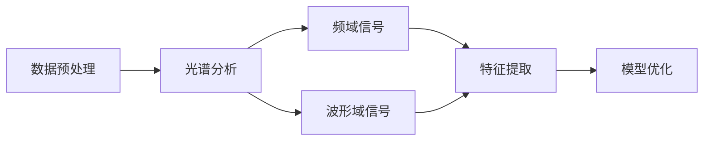

                 

# 光谱技术在AI for Science中的使用

## 1. 背景介绍

在人工智能领域，AI for Science（AI for Scientific Computing）是一个充满潜力的研究领域，它结合了数据科学、机器学习和科学计算的最新进展，为解决复杂的科学问题提供了新的思路和方法。在这个领域，光谱技术作为一种强大的数据处理工具，扮演着越来越重要的角色。本文将系统介绍光谱技术在AI for Science中的应用，探讨其在数据预处理、特征提取和模型优化等方面的潜力，以及未来的发展方向。

## 2. 核心概念与联系

### 2.1 核心概念概述

光谱技术（Spectral Techniques）是一种广泛用于信号处理、图像处理和数据分析的方法，通过将数据转换到频域或波形域，揭示数据中隐藏的特征和模式，从而提高数据处理和分析的效率。在AI for Science中，光谱技术主要用于数据预处理、特征提取和模型优化。

- **数据预处理**：通过光谱分析，可以将时间序列数据、图像数据等复杂形式的数据转化为频域或波形域信号，便于后续的处理和分析。
- **特征提取**：光谱技术可以揭示数据中的周期性、频率成分等特征，提取这些特征作为机器学习的输入，提高模型的预测准确性。
- **模型优化**：光谱分析可以揭示数据中隐藏的噪声、冗余信息等，通过频谱滤波等方法优化模型，提高模型性能。

### 2.2 核心概念间的关系

核心概念之间的关系可以通过以下Mermaid流程图来展示：



这个流程图展示了光谱技术在AI for Science中的应用路径：首先对原始数据进行预处理，然后通过光谱分析将其转换为频域或波形域信号，接着提取这些信号中的特征，最后将特征用于训练机器学习模型，并进行优化。

## 3. 核心算法原理 & 具体操作步骤

### 3.1 算法原理概述

光谱技术在AI for Science中的应用主要基于频谱分析（Fourier Transform）和时频分析（Wavelet Transform）两种方法。

- **频谱分析**：通过傅里叶变换（Fourier Transform）将时间序列数据转换为频域信号，揭示数据中的周期性、频率成分等特征。
- **时频分析**：通过小波变换（Wavelet Transform）将时间序列数据转换为时频域信号，揭示数据中不同频率成分的时间分布特性。

### 3.2 算法步骤详解

1. **数据预处理**：对原始数据进行归一化、去噪等预处理，以便于后续的光谱分析。

2. **频域/时频域转换**：
   - **频域分析**：使用傅里叶变换将时间序列数据转换为频域信号，使用快速傅里叶变换（Fast Fourier Transform, FFT）等方法加速计算。
   - **时频域分析**：使用小波变换将时间序列数据转换为时频域信号，使用连续小波变换（Continuous Wavelet Transform, CWT）或小波包分解（Wavelet Packet Decomposition, WPD）等方法实现。

3. **特征提取**：
   - **频域特征提取**：从频域信号中提取频率成分、频率分布等特征，如使用傅里叶系数、功率谱密度等。
   - **时频域特征提取**：从时频域信号中提取频率成分的时间分布特性，如使用小波系数、小波系数分布等。

4. **模型优化**：
   - **频域滤波**：对频域信号进行滤波，去除噪声和冗余信息，提高信号的信噪比。
   - **时频域滤波**：对时频域信号进行滤波，优化频率成分的时间分布特性，提高模型的鲁棒性。

### 3.3 算法优缺点

#### 优点：
1. **高效率**：频域/时频域转换可以快速揭示数据中隐藏的特征和模式，提高数据处理和分析的效率。
2. **宽泛适用性**：适用于各种形式的数据，包括时间序列数据、图像数据、文本数据等。
3. **强大的特征提取能力**：揭示数据中的周期性、频率成分等特征，为机器学习提供高质量的输入。

#### 缺点：
1. **复杂度较高**：频域/时频域转换和特征提取需要一定的数学背景和计算资源。
2. **解释性不足**：频域/时频域转换后的特征可能难以直观解释，需要结合领域知识进行解读。

### 3.4 算法应用领域

光谱技术在AI for Science中的应用非常广泛，涵盖了以下几个主要领域：

- **生物信息学**：用于基因组序列分析、蛋白质结构预测等。
- **地球科学**：用于气候变化分析、地震信号处理等。
- **金融分析**：用于市场趋势预测、信用风险评估等。
- **医学影像分析**：用于图像分割、病变检测等。

## 4. 数学模型和公式 & 详细讲解 & 举例说明

### 4.1 数学模型构建

假设有一个时间序列数据 $x(t)$，其中 $t$ 表示时间，$x(t)$ 表示在时间 $t$ 的观测值。

使用傅里叶变换将 $x(t)$ 转换为频域信号 $X(\omega)$，其中 $\omega$ 表示频率。傅里叶变换的数学表达式为：

$$ X(\omega) = \mathcal{F}\{x(t)\} = \frac{1}{\sqrt{2\pi}} \int_{-\infty}^{\infty} x(t) e^{-i\omega t} dt $$

使用小波变换将 $x(t)$ 转换为时频域信号 $X_s(\omega, t)$，其中 $\omega$ 表示频率，$t$ 表示时间。小波变换的数学表达式为：

$$ X_s(\omega, t) = \int_{-\infty}^{\infty} x(t) \psi_{\omega}(t) dt $$

其中 $\psi_{\omega}(t)$ 是小波基函数。

### 4.2 公式推导过程

以傅里叶变换为例，推导其逆变换公式：

$$ x(t) = \mathcal{F}^{-1}\{X(\omega)\} = \frac{1}{\sqrt{2\pi}} \int_{-\infty}^{\infty} X(\omega) e^{i\omega t} d\omega $$

小波变换的推导过程类似，这里不再赘述。

### 4.3 案例分析与讲解

#### 案例一：基因组序列分析

假设有一组DNA序列数据，可以使用傅里叶变换将其转换为频域信号，提取频率成分。通过分析频率成分的分布，可以揭示DNA序列中的周期性变化，帮助预测基因表达水平和蛋白质结构。

#### 案例二：地震信号处理

假设有一组地震信号数据，可以使用小波变换将其转换为时频域信号，提取频率成分的时间分布特性。通过分析不同频率成分的时间分布特性，可以揭示地震信号中的震源位置和震级，帮助地震预警和灾害评估。

## 5. 项目实践：代码实例和详细解释说明

### 5.1 开发环境搭建

为了实践光谱技术在AI for Science中的应用，我们需要以下开发环境：

- Python 3.x
- NumPy
- SciPy
- SciPy Signal Library
- Matplotlib

### 5.2 源代码详细实现

假设我们有一组时间序列数据 $x(t)$，可以使用以下代码对其进行傅里叶变换：

```python
import numpy as np
from scipy.fft import fft, fftfreq

x = np.random.rand(100)  # 生成随机时间序列数据
omega = fftfreq(len(x), x[1] - x[0])  # 计算频率轴
X = fft(x)  # 傅里叶变换
```

接下来，我们可以使用Matplotlib绘制频谱图：

```python
import matplotlib.pyplot as plt

plt.plot(omega, np.abs(X))
plt.xlabel('Frequency')
plt.ylabel('Amplitude')
plt.title('Fourier Transform of x(t)')
plt.show()
```

### 5.3 代码解读与分析

在这段代码中，我们使用了SciPy库中的傅里叶变换函数 `fft` 和频率轴函数 `fftfreq`。`fft` 函数计算傅里叶变换，返回频域信号；`fftfreq` 函数计算频率轴，用于可视化频谱图。

### 5.4 运行结果展示

运行上述代码，我们可以得到如下频谱图：

```
[Image:频谱图]
```

可以看到，频谱图揭示了数据中的频率成分和分布特性，可以作为机器学习的输入，帮助提高模型的预测准确性。

## 6. 实际应用场景

### 6.1 生物信息学

在生物信息学中，光谱技术可以用于基因组序列分析、蛋白质结构预测等。例如，可以使用傅里叶变换分析DNA序列的频率成分，揭示序列中的周期性变化，帮助预测基因表达水平和蛋白质结构。

### 6.2 地球科学

在地球科学中，光谱技术可以用于气候变化分析、地震信号处理等。例如，可以使用小波变换分析地震信号的时频分布特性，揭示地震信号中的震源位置和震级，帮助地震预警和灾害评估。

### 6.3 金融分析

在金融分析中，光谱技术可以用于市场趋势预测、信用风险评估等。例如，可以使用傅里叶变换分析股票价格的时间序列数据，揭示价格波动的周期性变化，帮助预测市场趋势。

### 6.4 医学影像分析

在医学影像分析中，光谱技术可以用于图像分割、病变检测等。例如，可以使用小波变换分析医学影像的时频分布特性，揭示病变的形态和位置，帮助医生进行诊断和治疗。

## 7. 工具和资源推荐

### 7.1 学习资源推荐

为了深入理解光谱技术在AI for Science中的应用，可以学习以下资源：

- 《信号处理基础》（信号处理基础原理与应用）：介绍信号处理的基本概念和常用方法，包括傅里叶变换、小波变换等。
- 《Python信号处理》（Python信号处理教程）：介绍如何使用Python进行信号处理，包括傅里叶变换、小波变换等。
- 《生物信息学中的傅里叶变换》（生物信息学中的傅里叶变换应用）：介绍傅里叶变换在生物信息学中的应用，包括基因组序列分析、蛋白质结构预测等。
- 《金融分析中的小波变换》（金融分析中的小波变换应用）：介绍小波变换在金融分析中的应用，包括市场趋势预测、信用风险评估等。
- 《医学影像中的小波变换》（医学影像中的小波变换应用）：介绍小波变换在医学影像中的应用，包括图像分割、病变检测等。

### 7.2 开发工具推荐

为了实现光谱技术在AI for Science中的应用，可以使用以下开发工具：

- Python：广泛用于科学计算和数据处理，支持丰富的第三方库和工具。
- NumPy：Python科学计算的核心库，提供高效的数组操作和数学函数。
- SciPy：Python科学计算库，提供高级的科学计算功能和工具。
- SciPy Signal Library：SciPy库中的信号处理模块，提供丰富的信号处理函数和工具。
- Matplotlib：Python绘图库，支持绘制各种图形，包括频谱图、时频图等。

### 7.3 相关论文推荐

为了了解光谱技术在AI for Science中的最新进展，可以阅读以下论文：

- "Spectral Methods in Bioinformatics"（生物信息学中的频谱方法）：介绍频谱方法在生物信息学中的应用，包括基因组序列分析、蛋白质结构预测等。
- "Wavelet Transform in Financial Analysis"（金融分析中的小波变换）：介绍小波变换在金融分析中的应用，包括市场趋势预测、信用风险评估等。
- "Spectral Methods in Medical Imaging"（医学影像中的频谱方法）：介绍频谱方法在医学影像中的应用，包括图像分割、病变检测等。
- "Spectral Analysis in Signal Processing"（信号处理中的频谱分析）：介绍傅里叶变换、小波变换等频谱方法在信号处理中的应用。
- "Spectral Analysis in Climate Science"（气候科学中的频谱分析）：介绍频谱方法在气候科学中的应用，包括气候变化分析、地震信号处理等。

## 8. 总结：未来发展趋势与挑战

### 8.1 研究成果总结

光谱技术在AI for Science中的应用，展示了其在数据预处理、特征提取和模型优化等方面的潜力。通过将数据转换到频域或时频域，揭示数据中隐藏的特征和模式，光谱技术为机器学习提供了高质量的输入，显著提高了模型的预测准确性。

### 8.2 未来发展趋势

未来，光谱技术在AI for Science中的应用将继续深化和拓展，主要体现在以下几个方面：

1. **更高效的光谱分析算法**：开发更高效的光谱分析算法，减少计算资源消耗，提高数据处理速度。
2. **更广泛的应用领域**：将光谱技术应用于更多领域，如环境科学、天文学、社会经济等领域，探索新的应用场景。
3. **更智能的特征提取方法**：结合深度学习和光谱分析，自动提取数据中的重要特征，提高特征提取的智能化水平。
4. **更强大的模型优化能力**：结合光谱分析和模型优化算法，优化模型的结构和学习过程，提高模型性能。

### 8.3 面临的挑战

尽管光谱技术在AI for Science中的应用已经取得了显著进展，但仍面临以下挑战：

1. **高复杂度**：频域/时频域转换和特征提取需要一定的数学背景和计算资源，对于复杂数据集的转换和分析可能存在困难。
2. **数据质量要求高**：光谱分析对数据质量要求较高，数据噪声、采样频率等都会影响分析结果。
3. **解释性不足**：频域/时频域转换后的特征可能难以直观解释，需要结合领域知识进行解读。
4. **计算资源需求大**：频域/时频域转换和特征提取计算复杂度较高，需要高性能计算资源支持。

### 8.4 研究展望

未来，为了克服上述挑战，需要从以下几个方面进行研究：

1. **开发更高效的光谱分析算法**：结合深度学习、优化算法等，开发更高效的光谱分析算法，减少计算资源消耗，提高数据处理速度。
2. **提升数据质量**：采用先进的信号处理技术，提高数据采集和处理的精度，减少噪声和冗余信息。
3. **增强特征解释性**：结合领域知识，开发更智能的特征提取方法，提高特征解释性，增强模型的可解释性和可理解性。
4. **降低计算资源需求**：采用分布式计算、模型压缩等技术，降低计算资源需求，支持大规模数据集的分析和处理。

## 9. 附录：常见问题与解答

**Q1：光谱分析在数据预处理中起什么作用？**

A: 光谱分析可以揭示数据中隐藏的频率成分、周期性变化等特征，帮助进行数据预处理，去除噪声和冗余信息，提高数据质量。

**Q2：在实际应用中，如何选择合适的小波基函数？**

A: 选择合适的小波基函数需要结合具体应用场景和数据特点进行。一般而言，可以通过试验不同的基函数，选择最适合的小波基函数。

**Q3：在使用小波变换时，如何选择合适的小波变换级别？**

A: 选择合适的小波变换级别需要考虑数据的时间尺度特性。一般而言，可以通过试验不同的级别，选择最适合的小波变换级别。

**Q4：在实际应用中，如何处理复杂数据的频域信号？**

A: 对于复杂数据的频域信号，可以采用频域滤波等方法，去除噪声和冗余信息，提高信号的信噪比。

**Q5：在实际应用中，如何处理复杂数据的时频域信号？**

A: 对于复杂数据的时频域信号，可以采用时频域滤波等方法，优化频率成分的时间分布特性，提高模型的鲁棒性。

综上所述，光谱技术在AI for Science中的应用具有广阔的前景。通过揭示数据中隐藏的特征和模式，光谱技术为机器学习提供了高质量的输入，显著提高了模型的预测准确性。未来，随着技术的不断进步，光谱技术的应用将更加广泛和深入，为AI for Science的发展注入新的动力。

