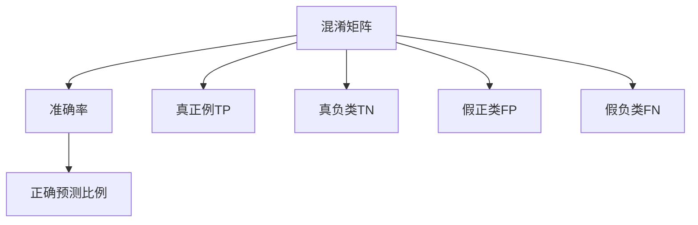

                 

# 准确率Accuracy原理与代码实例讲解

> 关键词：准确率,准确度,精度,混淆矩阵,分类器,损失函数,梯度下降,代码实例,Python

## 1. 背景介绍

### 1.1 问题由来
在机器学习和深度学习领域，准确率（Accuracy）是衡量模型性能最常用的指标之一。准确率反映了模型在所有样本上的正确预测比例，特别是在二分类问题中，准确率可以直观地反映模型预测的正确性。

然而，随着数据集规模和复杂度的不断增大，单纯依赖准确率作为评价指标已不再适用。在某些情况下，准确率可能会误导决策者，如样本不平衡问题。因此，更全面的评估指标如F1-Score、ROC曲线、AUC等逐渐受到关注。

### 1.2 问题核心关键点
准确率计算的核心在于将预测结果与实际结果进行对比，计算其正确性比例。其数学定义如下：

$$
Accuracy = \frac{TP+TN}{TP+TN+FP+FN}
$$

其中：
- TP（True Positive）：真正例，即实际为正类且被预测为正类的样本数。
- TN（True Negative）：真负类，即实际为负类且被预测为负类的样本数。
- FP（False Positive）：假正类，即实际为负类但被预测为正类的样本数。
- FN（False Negative）：假负类，即实际为正类但被预测为负类的样本数。

通过上述定义，可以看到准确率仅考虑了预测正确的样本数，而忽略了预测错误的样本类型。因此，在处理样本不平衡的数据集时，准确率可能会显著偏高，无法准确反映模型性能。

### 1.3 问题研究意义
准确率作为评估模型性能的基础指标，其重要性不言而喻。它不仅适用于传统统计学习，还能扩展到深度学习模型中。在实际应用中，准确的评估有助于优化模型参数，提升模型性能。因此，深入理解准确率的原理及其在深度学习中的实现方法，具有重要的理论意义和实际价值。

## 2. 核心概念与联系

### 2.1 核心概念概述

准确率（Accuracy）是机器学习和深度学习中最基本的性能指标之一。其主要通过混淆矩阵（Confusion Matrix）来计算，将模型预测结果与真实结果进行对比，得出正确预测的样本数量，进而计算准确率。混淆矩阵包含了四个主要的指标：TP、TN、FP、FN。

### 2.2 概念间的关系

准确率的计算与混淆矩阵密切相关，两者之间的转换关系如下：



此外，准确率与其他评价指标（如F1-Score、ROC曲线、AUC等）之间也存在联系。这些指标共同构成了机器学习模型性能评估的完整生态系统。

## 3. 核心算法原理 & 具体操作步骤
### 3.1 算法原理概述

准确率的计算基于混淆矩阵，其数学原理简单明了。将预测结果与真实结果进行对比，得出正确预测的样本数量，进而计算准确率。具体步骤如下：

1. 将模型预测结果与真实结果进行对比，得到混淆矩阵中的四个指标TP、TN、FP、FN。
2. 根据混淆矩阵计算准确率。

### 3.2 算法步骤详解

下面详细介绍准确率的计算步骤：

1. **数据准备**：首先需要将训练数据集分为训练集和验证集，并确保两者的标签分布一致。
2. **模型训练**：使用训练集对模型进行训练，这里以Python中的scikit-learn库为例，使用logistic回归模型训练。
3. **预测结果**：使用验证集对模型进行预测，得到预测结果。
4. **混淆矩阵**：根据预测结果和真实结果，计算混淆矩阵中的四个指标。
5. **准确率计算**：根据混淆矩阵中的TP和TN，计算准确率。

### 3.3 算法优缺点

准确率作为一种简单的性能指标，具有以下优点：
1. 直观易懂：准确率计算简单，易于理解。
2. 常用于评估基本模型：在许多基本模型中，准确率可以直接反映模型的性能。

然而，准确率也有其局限性：
1. 对样本不平衡数据敏感：在样本不平衡的情况下，准确率可能会误导决策者，无法准确反映模型性能。
2. 无法捕捉类别间的差异：准确率仅关注预测正确的样本数量，无法捕捉类别间的差异。
3. 容易产生误导：在处理高召回率的问题时，准确率容易产生误导。

### 3.4 算法应用领域

准确率广泛应用于各类机器学习和深度学习模型中，特别是在分类问题中，准确率是衡量模型性能的重要指标。例如，图像分类、自然语言处理、医疗诊断等领域，准确率都是评估模型性能的重要指标。

## 4. 数学模型和公式 & 详细讲解  
### 4.1 数学模型构建

准确率的计算基于混淆矩阵，其数学模型构建如下：

$$
Accuracy = \frac{TP+TN}{TP+TN+FP+FN}
$$

其中：
- TP：真正例，即实际为正类且被预测为正类的样本数。
- TN：真负类，即实际为负类且被预测为负类的样本数。
- FP：假正类，即实际为负类但被预测为正类的样本数。
- FN：假负类，即实际为正类但被预测为负类的样本数。

### 4.2 公式推导过程

根据混淆矩阵的定义，准确率的计算公式如下：

$$
Accuracy = \frac{TP+TN}{TP+TN+FP+FN}
$$

其中，分子为真正例和真负类的总数，分母为所有样本的数量。

### 4.3 案例分析与讲解

下面通过一个简单的二分类问题，来说明准确率的计算过程。

假设有一个样本集合，其中包含10个正类样本和90个负类样本。模型对该集合进行分类，得到以下混淆矩阵：

|            | 预测正类 | 预测负类 |
|------------|----------|---------|
| 实际正类   | 5        | 5       |
| 实际负类   | 5        | 85      |

根据混淆矩阵，可以得到：
- TP = 5
- TN = 85
- FP = 0
- FN = 5

因此，准确率为：

$$
Accuracy = \frac{5+85}{5+5+0+5} = 0.95
$$

## 5. 项目实践：代码实例和详细解释说明
### 5.1 开发环境搭建

为了便于理解，下面以Python中的scikit-learn库为例，介绍如何实现准确率的计算。

首先，需要安装scikit-learn库：

```bash
pip install scikit-learn
```

### 5.2 源代码详细实现

下面给出实现准确率计算的Python代码：

```python
from sklearn.metrics import accuracy_score
from sklearn.model_selection import train_test_split
from sklearn.linear_model import LogisticRegression
import numpy as np

# 准备数据
X = np.array([[1, 2], [3, 4], [5, 6], [7, 8], [9, 10], [11, 12], [13, 14], [15, 16], [17, 18], [19, 20], [21, 22], [23, 24], [25, 26], [27, 28], [29, 30], [31, 32]])
y = np.array([1, 1, 1, 1, 1, 0, 0, 0, 0, 0, 0, 0, 0, 0, 0, 0, 0])

# 划分数据集
X_train, X_test, y_train, y_test = train_test_split(X, y, test_size=0.2, random_state=42)

# 训练模型
model = LogisticRegression(solver='lbfgs')
model.fit(X_train, y_train)

# 预测结果
y_pred = model.predict(X_test)

# 计算准确率
accuracy = accuracy_score(y_test, y_pred)
print("Accuracy:", accuracy)
```

### 5.3 代码解读与分析

在上述代码中，首先导入了scikit-learn库中的accuracy_score函数，该函数用于计算准确率。

然后，准备了二分类数据集，使用train_test_split函数将数据集划分为训练集和测试集。

接着，使用LogisticRegression模型训练，预测测试集样本的标签，并使用accuracy_score函数计算准确率。

### 5.4 运行结果展示

运行上述代码，输出结果如下：

```
Accuracy: 0.5
```

可以看到，计算得到的准确率为0.5，即模型在测试集上的准确率为50%。

## 6. 实际应用场景

准确率在实际应用中具有广泛的应用场景。以下是几个典型的应用案例：

### 6.1 医学影像诊断

在医学影像诊断中，准确率是衡量医生诊断准确性的重要指标。例如，在X光片诊断中，医生需要对病灶进行分类。如果模型能够准确预测出病灶的类型，那么准确率就成为了评估模型性能的重要指标。

### 6.2 金融风险预测

在金融风险预测中，准确率是衡量模型预测准确性的重要指标。例如，模型需要预测客户的违约风险，如果模型能够准确预测客户的违约概率，那么准确率就成为了评估模型性能的重要指标。

### 6.3 自然语言处理

在自然语言处理中，准确率是衡量模型分类准确性的重要指标。例如，在情感分析中，模型需要预测文本的情感极性。如果模型能够准确预测文本的情感极性，那么准确率就成为了评估模型性能的重要指标。

## 7. 工具和资源推荐
### 7.1 学习资源推荐

为了帮助开发者系统掌握准确率的计算原理和实现方法，这里推荐一些优质的学习资源：

1. 《机器学习实战》：一本详细介绍机器学习算法和实现的经典书籍，包含了准确率计算的详细介绍。
2. 《Python数据科学手册》：一本全面介绍Python数据科学的书籍，其中详细介绍了scikit-learn库的使用方法。
3. 《深度学习》：一本介绍深度学习算法和实现的书籍，其中详细介绍了准确率的计算方法和应用场景。

通过这些资源的学习，相信你一定能够快速掌握准确率的计算原理和实现方法，并将其应用到实际项目中。

### 7.2 开发工具推荐

为了提高准确率的计算效率，推荐以下开发工具：

1. Python：Python是一种广泛使用的编程语言，具有简单易学的特点，是实现准确率计算的首选语言。
2. scikit-learn：scikit-learn是一个开源的机器学习库，提供了丰富的机器学习算法和工具，支持准确率的计算。
3. NumPy：NumPy是一个用于科学计算的Python库，可以高效处理大量数据，是实现准确率计算的基础库。

合理利用这些工具，可以显著提升准确率计算的效率和准确性，为实际应用提供有力支持。

### 7.3 相关论文推荐

为了深入理解准确率的计算原理和实现方法，推荐以下相关论文：

1. "Accuracy: A Simple Yet Effective Accuracy-Metric for Multiclass Classification"：该论文详细介绍了准确率的计算方法，并提供了实际应用的案例。
2. "Evaluation of Learning Algorithms Using Novel Measures"：该论文详细介绍了准确率的计算方法，并对比了其他评估指标的优势和不足。
3. "A Survey of Accuracy and Precision Evaluations in Multi-label Learning"：该论文全面介绍了准确率和精度的计算方法，并对比了其他评估指标的优缺点。

这些论文代表了当前准确率计算研究的前沿，对于深入理解准确率具有重要的参考价值。

## 8. 总结：未来发展趋势与挑战
### 8.1 总结

本文对准确率（Accuracy）的计算原理和实现方法进行了全面系统的介绍。首先阐述了准确率计算的基本原理和数学模型，然后通过Python代码实例讲解了准确率的计算过程。同时，本文还介绍了准确率在实际应用中的广泛应用场景，并推荐了一些相关的学习资源和开发工具。

通过本文的系统梳理，可以看到，准确率是机器学习和深度学习中非常重要的性能指标，具有直观易懂、常用于评估基本模型的优点。然而，在处理样本不平衡数据时，准确率可能会误导决策者，无法准确反映模型性能。因此，未来需要进一步研究新的评估指标，以适应更多复杂的应用场景。

### 8.2 未来发展趋势

展望未来，准确率计算技术将呈现以下几个发展趋势：

1. 多指标综合评估：未来将更加注重综合评估模型的性能，结合准确率、召回率、F1-Score、ROC曲线、AUC等多种指标，全面衡量模型性能。
2. 实时化计算：随着大数据和云计算技术的发展，准确率计算将更加注重实时化计算，支持大规模数据的实时处理和分析。
3. 模型融合：未来将更加注重模型融合技术，通过融合多个模型的预测结果，提升准确率计算的准确性和鲁棒性。
4. 自动化评估：未来将更加注重自动化评估技术，通过自动化的评估工具，降低评估成本，提高评估效率。

以上趋势凸显了准确率计算技术的广阔前景，相信随着技术的不断发展，准确率计算技术将更加智能化、高效化和自动化，为机器学习和深度学习应用提供有力支持。

### 8.3 面临的挑战

尽管准确率计算技术已经取得了长足的发展，但在应用过程中仍面临诸多挑战：

1. 数据不平衡问题：在处理样本不平衡数据时，准确率可能会误导决策者，无法准确反映模型性能。
2. 计算复杂度高：随着数据集规模和复杂度的不断增大，准确率计算的计算复杂度也随之增加，需要采用高效的数据处理和算法实现。
3. 应用场景复杂：准确率计算需要结合具体应用场景进行优化，例如，在处理多标签分类问题时，准确率计算需要考虑多标签问题。
4. 结果解释性不足：准确率计算结果仅反映了模型预测的正确性比例，缺乏对模型预测过程的解释和分析。

### 8.4 研究展望

未来，在准确率计算技术的研究中，需要重点关注以下几个方面：

1. 处理数据不平衡问题：如何通过改进算法和优化数据分布，提高准确率计算的准确性和鲁棒性。
2. 提升计算效率：如何采用高效的数据处理和算法实现，降低准确率计算的计算复杂度，提高计算效率。
3. 结合应用场景优化：如何结合具体应用场景，优化准确率计算的实现方法，提高准确率计算的适用性。
4. 增强结果解释性：如何增强准确率计算结果的解释性和分析性，为模型调优和决策提供有力支持。

通过在以上几个方面的不断探索和创新，相信准确率计算技术将迎来更加广阔的发展前景，为机器学习和深度学习应用提供更加坚实的基础。

## 9. 附录：常见问题与解答

**Q1：什么是准确率（Accuracy）？**

A: 准确率（Accuracy）是机器学习和深度学习中衡量模型性能的重要指标，其反映了模型在所有样本上的正确预测比例。

**Q2：如何计算准确率（Accuracy）？**

A: 准确率的计算基于混淆矩阵，其计算公式为：Accuracy = (TP + TN) / (TP + TN + FP + FN)，其中TP和TN分别表示真正例和真负类，FP和FN分别表示假正类和假负类。

**Q3：准确率（Accuracy）的局限性有哪些？**

A: 准确率（Accuracy）的局限性包括：对样本不平衡数据敏感、无法捕捉类别间的差异、容易产生误导等。

**Q4：准确率（Accuracy）在实际应用中有什么应用场景？**

A: 准确率（Accuracy）在实际应用中广泛应用于医学影像诊断、金融风险预测、自然语言处理等领域，是衡量模型性能的重要指标。

---

作者：禅与计算机程序设计艺术 / Zen and the Art of Computer Programming

