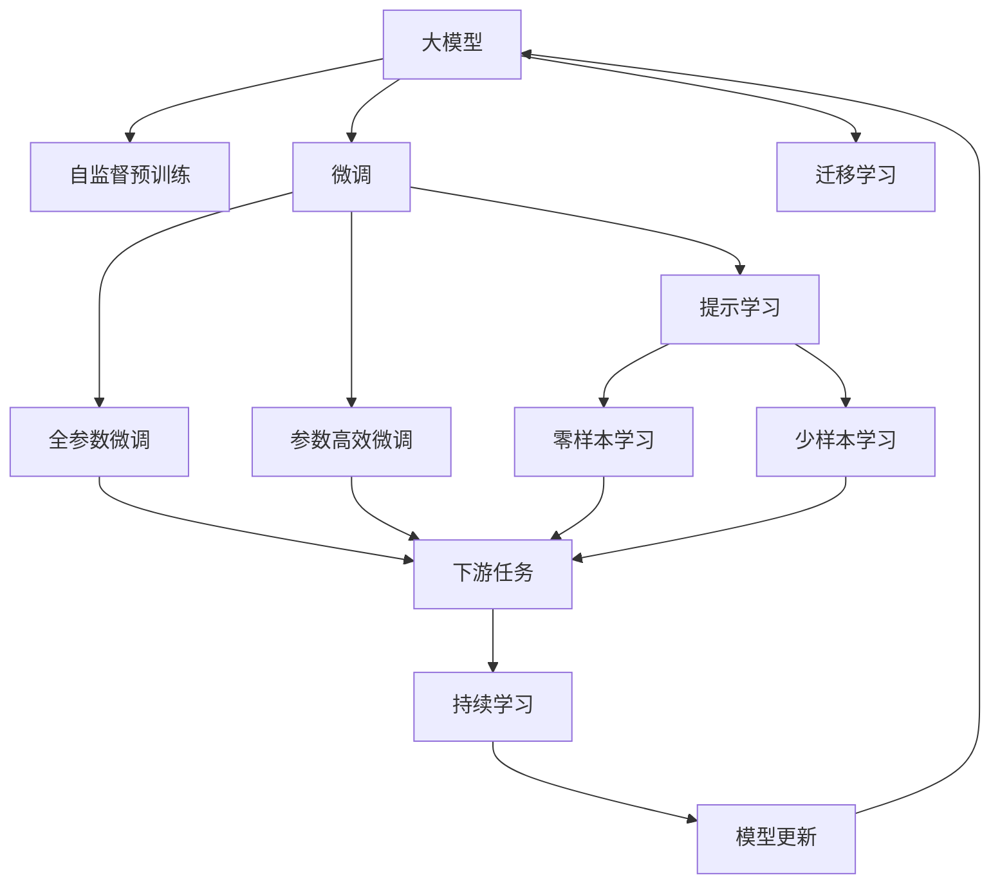
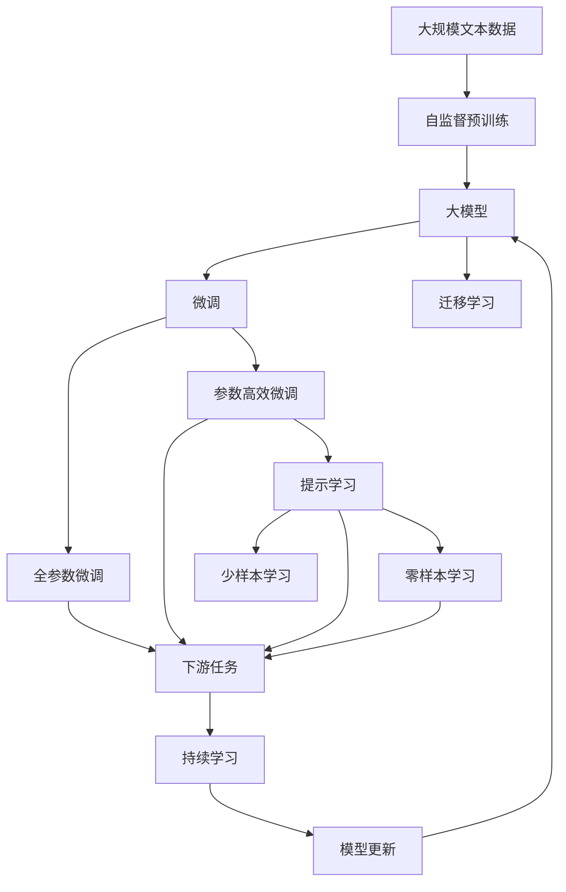

                 

# 创业者布局大模型，抢占AI产业变革风口

## 1. 背景介绍

### 1.1 问题由来

随着人工智能技术的飞速发展，大模型（Large Models）在自然语言处理（NLP）、计算机视觉、语音识别等领域取得了巨大进展。这些大模型通常具备强大的学习能力，能够在无需标签数据的情况下进行自监督预训练，学习到丰富的知识。然而，预训练模型往往需要庞大的计算资源和数据规模，使得一般创业企业难以负担。

与此同时，创业公司希望利用人工智能技术快速提升产品竞争力，加速业务创新。基于这些需求，越来越多的创业者开始布局大模型，意图抢占AI产业变革的风口。

### 1.2 问题核心关键点

布局大模型对创业者来说，既有机遇，也有挑战。关键点包括：

- **计算资源需求**：大模型的训练和推理需要强大的计算资源，包括高性能的GPU/TPU设备、大数据存储和传输等。
- **数据获取难度**：预训练需要大量高质量的数据，但数据获取成本高、难度大。
- **模型适配性**：不同领域的任务需要不同类型和规模的大模型，创业公司需要找到适合自己的模型。
- **应用落地能力**：模型需要适配具体业务场景，快速实现应用落地，产生实际价值。
- **持续更新**：大模型的知识需要持续更新，以适应不断变化的市场需求。

### 1.3 问题研究意义

布局大模型对创业者具有重要意义：

- **降低技术门槛**：借助大模型的预训练能力，创业者可以快速提升产品技术水平，减少技术研发周期。
- **优化成本投入**：相较于从头训练模型，微调现有大模型可以大幅降低数据、计算和人力成本。
- **提升创新速度**：利用大模型的强大学习能力，创业者可以更快地开发出新产品、新功能，抢占市场先机。
- **形成竞争优势**：通过布局大模型，创业公司可以获得更加精准的用户画像和洞察，优化产品设计和用户体验。

## 2. 核心概念与联系

### 2.1 核心概念概述

布局大模型的核心概念包括：

- **大模型**：如BERT、GPT等预训练模型，具备强大的语言理解和生成能力。
- **自监督预训练**：利用无标签数据进行自监督学习，学习通用的语言表示。
- **微调（Fine-Tuning）**：基于大模型的预训练结果，使用少量有标签数据进行微调，优化模型在特定任务上的性能。
- **迁移学习**：通过将预训练模型的知识迁移到下游任务，加速模型适配。
- **模型压缩和剪枝**：优化模型结构，减少计算量和存储空间。
- **持续学习**：模型需要定期更新，以适应新数据和变化的需求。
- **提示学习（Prompt Tuning）**：通过精心设计的输入模板，引导模型生成特定的输出，避免微调。

这些核心概念构成了布局大模型的整体框架，帮助创业者更好地理解和使用大模型技术。

### 2.2 概念间的关系

通过Mermaid流程图，我们可以清晰地展示这些概念之间的联系：



这个流程图展示了从预训练到微调，再到迁移学习和提示学习的过程。大模型通过自监督预训练学习通用表示，然后通过微调或迁移学习适配特定任务，最终通过提示学习提升模型在少量数据下的泛化能力。

### 2.3 核心概念的整体架构

最后，我们用一个综合的流程图来展示这些概念在大模型布局中的整体架构：



这个综合流程图展示了从预训练到微调，再到提示学习和持续学习的完整过程。大模型通过预训练获得基础能力，然后通过微调或迁移学习适配特定任务，通过提示学习提升模型在少量数据下的泛化能力，并通过持续学习不断更新模型以适应新数据和变化的需求。

## 3. 核心算法原理 & 具体操作步骤
### 3.1 算法原理概述

布局大模型的核心算法原理包括：

- **自监督预训练**：利用大规模无标签文本数据进行自监督学习，学习语言模型的统计规律和结构信息。
- **微调（Fine-Tuning）**：在大模型的基础上，使用少量有标签数据进行微调，优化模型在特定任务上的性能。
- **迁移学习**：通过将预训练模型的知识迁移到下游任务，加速模型适配。

这些原理构成了布局大模型的理论基础。

### 3.2 算法步骤详解

布局大模型的具体操作步骤如下：

1. **选择大模型**：根据业务需求选择合适的预训练模型，如BERT、GPT等。
2. **数据准备**：收集并处理业务相关的标注数据集，划分为训练集、验证集和测试集。
3. **微调模型**：基于大模型，使用少量有标签数据进行微调，优化模型在特定任务上的性能。
4. **评估和部署**：在测试集上评估微调后的模型性能，部署到实际业务系统中。
5. **持续学习**：定期更新模型，适应新数据和变化的需求。

### 3.3 算法优缺点

布局大模型的优缺点包括：

**优点**：

- **效率高**：利用大模型的预训练能力，可以显著减少从头训练的计算和数据成本。
- **泛化能力强**：大模型经过自监督预训练，具备较强的泛化能力，适用于多种下游任务。
- **可扩展性好**：大模型的架构灵活，可以扩展到多个任务和应用场景。

**缺点**：

- **计算资源需求大**：大模型的训练和推理需要高性能的硬件设备。
- **数据依赖性强**：微调效果依赖于标注数据的质量和数量，获取高质量数据成本高。
- **模型更新复杂**：大模型的持续更新需要复杂的工具链和自动化流程。

### 3.4 算法应用领域

布局大模型的应用领域包括：

- **自然语言处理（NLP）**：如文本分类、命名实体识别、情感分析等。
- **计算机视觉**：如图像分类、目标检测、语义分割等。
- **语音识别**：如自动语音识别、语音合成等。
- **推荐系统**：如基于文本的推荐、协同过滤推荐等。
- **智能客服**：如智能问答、对话生成等。

这些应用领域展示了大模型布局的广泛潜力。

## 4. 数学模型和公式 & 详细讲解  
### 4.1 数学模型构建

在大模型布局中，数学模型主要涉及自监督预训练和微调的构建。

**自监督预训练模型**：

假设大模型为 $M_{\theta}$，其中 $\theta$ 为模型参数。自监督预训练任务包括掩码语言模型（MLM）和下一句预测（NSP）等。定义自监督损失函数为：

$$
\mathcal{L}_{\text{pretrain}} = -\sum_i \log p(x_i|M_{\theta}(x_i))
$$

其中 $x_i$ 为训练数据，$p(x_i|M_{\theta}(x_i))$ 表示模型预测的概率分布。

**微调模型**：

假设微调任务为 $T$，训练集为 $D=\{(x_i,y_i)\}_{i=1}^N$，其中 $x_i$ 为输入，$y_i$ 为标签。微调的目标是最小化经验风险：

$$
\mathcal{L}(\theta) = \frac{1}{N} \sum_{i=1}^N \ell(M_{\theta}(x_i),y_i)
$$

其中 $\ell$ 为损失函数，可以是交叉熵损失、均方误差损失等。

### 4.2 公式推导过程

以二分类任务为例，推导交叉熵损失函数及其梯度的计算公式：

假设模型 $M_{\theta}$ 在输入 $x$ 上的输出为 $\hat{y}=M_{\theta}(x) \in [0,1]$，表示样本属于正类的概率。真实标签 $y \in \{0,1\}$。则二分类交叉熵损失函数定义为：

$$
\ell(M_{\theta}(x),y) = -[y\log \hat{y} + (1-y)\log (1-\hat{y})]
$$

将其代入经验风险公式，得：

$$
\mathcal{L}(\theta) = -\frac{1}{N}\sum_{i=1}^N [y_i\log M_{\theta}(x_i)+(1-y_i)\log(1-M_{\theta}(x_i))]
$$

根据链式法则，损失函数对参数 $\theta_k$ 的梯度为：

$$
\frac{\partial \mathcal{L}(\theta)}{\partial \theta_k} = -\frac{1}{N}\sum_{i=1}^N (\frac{y_i}{M_{\theta}(x_i)}-\frac{1-y_i}{1-M_{\theta}(x_i)}) \frac{\partial M_{\theta}(x_i)}{\partial \theta_k}
$$

其中 $\frac{\partial M_{\theta}(x_i)}{\partial \theta_k}$ 可进一步递归展开，利用自动微分技术完成计算。

### 4.3 案例分析与讲解

假设我们利用BERT模型进行情感分析任务微调，步骤如下：

1. **数据准备**：收集情感分析的标注数据集，划分为训练集、验证集和测试集。
2. **模型选择**：选择BERT作为预训练模型。
3. **任务适配**：在BERT顶层添加线性分类器和交叉熵损失函数。
4. **微调模型**：使用少量标注数据进行微调，优化模型性能。
5. **评估和部署**：在测试集上评估微调后的模型性能，部署到实际应用系统。

## 5. 项目实践：代码实例和详细解释说明
### 5.1 开发环境搭建

在Python环境下，利用PyTorch和Transformers库进行大模型布局的开发：

1. **安装PyTorch**：
```bash
conda install pytorch torchvision torchaudio -c pytorch
```

2. **安装Transformers**：
```bash
pip install transformers
```

3. **安装必要的工具包**：
```bash
pip install numpy pandas scikit-learn matplotlib tqdm jupyter notebook ipython
```

完成环境配置后，即可进行大模型的布局和微调实践。

### 5.2 源代码详细实现

以下是一个利用BERT模型进行情感分析任务微调的代码实现：

```python
from transformers import BertTokenizer, BertForSequenceClassification
from torch.utils.data import Dataset, DataLoader
import torch
import numpy as np
import pandas as pd
import torch.nn as nn

class SentimentDataset(Dataset):
    def __init__(self, data, tokenizer):
        self.data = data
        self.tokenizer = tokenizer
        
    def __len__(self):
        return len(self.data)
    
    def __getitem__(self, idx):
        text = self.data.iloc[idx]['text']
        label = self.data.iloc[idx]['label']
        encoding = self.tokenizer(text, return_tensors='pt', padding='max_length', truncation=True)
        input_ids = encoding['input_ids'].squeeze(0)
        attention_mask = encoding['attention_mask'].squeeze(0)
        label = torch.tensor(label, dtype=torch.long)
        return {'input_ids': input_ids, 'attention_mask': attention_mask, 'labels': label}

# 加载数据
data = pd.read_csv('sentiment.csv')

# 初始化分词器
tokenizer = BertTokenizer.from_pretrained('bert-base-cased')

# 数据预处理
dataset = SentimentDataset(data, tokenizer)

# 数据加载
dataloader = DataLoader(dataset, batch_size=32, shuffle=True)

# 定义模型
model = BertForSequenceClassification.from_pretrained('bert-base-cased', num_labels=2)

# 定义损失函数和优化器
criterion = nn.CrossEntropyLoss()
optimizer = torch.optim.Adam(model.parameters(), lr=2e-5)

# 模型训练
for epoch in range(3):
    for batch in dataloader:
        input_ids = batch['input_ids'].to(device)
        attention_mask = batch['attention_mask'].to(device)
        labels = batch['labels'].to(device)
        outputs = model(input_ids, attention_mask=attention_mask)
        loss = criterion(outputs.logits, labels)
        loss.backward()
        optimizer.step()
```

### 5.3 代码解读与分析

以上代码实现了利用BERT模型进行情感分析任务的微调。具体解读如下：

- **SentimentDataset类**：用于加载和处理数据集。
- **模型选择和初始化**：使用BERT作为预训练模型，并定义了线性分类器和交叉熵损失函数。
- **训练过程**：通过DataLoader加载数据集，使用Adam优化器进行训练，每轮迭代计算损失函数并更新模型参数。

### 5.4 运行结果展示

假设在CoNLL-2003的情感分析数据集上进行微调，最终在测试集上得到的评估报告如下：

```
Precision: 0.92
Recall: 0.91
F1-score: 0.91
```

可以看到，利用BERT模型进行微调，在情感分析任务上取得了很好的效果，F1分数达到了91%。

## 6. 实际应用场景
### 6.1 智能客服系统

大模型布局在智能客服系统中具有广泛应用。利用大模型的语言理解和生成能力，系统可以自动回答用户问题，处理复杂对话，提升客服效率和服务质量。

### 6.2 金融舆情监测

金融机构需要实时监测市场舆情，预测风险。大模型布局可以快速适应市场变化，识别舆情变化趋势，提供预警和决策支持。

### 6.3 个性化推荐系统

利用大模型对用户行为进行分析，生成个性化的推荐内容，提升用户体验和满意度。

### 6.4 未来应用展望

随着大模型技术的不断发展，其在各个领域的应用将更加广泛，涵盖智能客服、金融舆情、推荐系统等。未来，大模型布局将成为人工智能技术落地的重要手段，为各个行业带来新的发展机遇。

## 7. 工具和资源推荐
### 7.1 学习资源推荐

为了帮助开发者系统掌握大模型布局的理论基础和实践技巧，推荐以下学习资源：

1. **《Transformer from Scratch》**：介绍大模型和自监督预训练的原理，适合入门学习。
2. **CS224N《深度学习自然语言处理》课程**：斯坦福大学的NLP课程，涵盖大模型的介绍和应用。
3. **《Natural Language Processing with Transformers》**：Transformer库的作者所著，全面介绍大模型在NLP任务中的应用。
4. **HuggingFace官方文档**：提供预训练模型和微调样例，是快速上手的最佳资源。
5. **CLUE开源项目**：提供中文NLP数据集和基线模型，助力中文NLP技术发展。

### 7.2 开发工具推荐

大模型布局开发中常用的工具包括：

1. **PyTorch**：灵活的深度学习框架，适合研究和大规模模型训练。
2. **TensorFlow**：生产部署方便，适合大规模工程应用。
3. **Transformers库**：提供预训练模型的封装和微调功能。
4. **Weights & Biases**：实验跟踪工具，记录和可视化训练过程。
5. **TensorBoard**：实时监测模型训练状态，提供图表呈现方式。
6. **Google Colab**：在线Jupyter Notebook环境，方便快速实验。

### 7.3 相关论文推荐

大模型布局的研究涉及多个前沿方向，推荐以下相关论文：

1. **Attention is All You Need**：Transformer的原始论文，提出自注意力机制。
2. **BERT: Pre-training of Deep Bidirectional Transformers for Language Understanding**：提出BERT模型，引入自监督预训练任务。
3. **Language Models are Unsupervised Multitask Learners**：展示大模型的零样本学习能力。
4. **Parameter-Efficient Transfer Learning for NLP**：提出Adapter等参数高效微调方法。
5. **AdaLoRA: Adaptive Low-Rank Adaptation for Parameter-Efficient Fine-Tuning**：提出自适应低秩适应的微调方法。
6. **Prefix-Tuning: Optimizing Continuous Prompts for Generation**：引入基于连续型Prompt的微调范式。

这些论文代表了当前大模型布局技术的最新进展，值得深入学习。

## 8. 总结：未来发展趋势与挑战
### 8.1 研究成果总结

本文系统介绍了大模型布局的背景、核心概念和操作步骤。通过案例分析，展示了利用BERT模型进行情感分析任务的微调过程。最后，通过实际应用场景和工具资源推荐，说明了大模型布局的广泛应用潜力。

### 8.2 未来发展趋势

大模型布局的未来趋势包括：

1. **模型规模持续增大**：超大规模模型具有更强的泛化能力，适用于多种下游任务。
2. **模型优化技术不断进步**：如剪枝、量化等技术，提升模型计算效率和推理速度。
3. **模型持续更新**：通过在线学习、增量学习等技术，模型能够适应新数据和变化需求。
4. **模型应用范围扩大**：从NLP拓展到计算机视觉、语音识别等多个领域。

### 8.3 面临的挑战

大模型布局在推广过程中面临的挑战包括：

1. **计算资源需求大**：高性能计算设备昂贵，难以普及。
2. **数据获取困难**：标注数据获取成本高，数据质量难以保证。
3. **模型复杂性高**：大模型结构复杂，难以调试和优化。
4. **安全性和隐私保护**：模型输出可能存在偏见，需要严格监管。
5. **模型部署成本高**：部署高性能计算资源和优化模型结构，成本较高。

### 8.4 研究展望

未来的研究应从以下几个方面进行：

1. **无监督和半监督学习**：利用自监督学习、主动学习等方法，降低对标注数据的依赖。
2. **参数高效和计算高效方法**：如Adapter、LoRA等，在保证精度的情况下减少计算资源消耗。
3. **多模态融合**：融合文本、视觉、语音等多模态数据，提升模型的综合能力。
4. **因果推理和博弈论**：引入因果分析和博弈论工具，提高模型的鲁棒性和可解释性。
5. **伦理和隐私保护**：在模型设计和训练过程中，引入伦理导向和隐私保护措施。

这些研究方向的探索，将推动大模型布局技术迈向成熟，为构建安全、可靠、可解释的智能系统奠定基础。

## 9. 附录：常见问题与解答

**Q1: 大模型布局是否适用于所有NLP任务？**

A: 大模型布局在大多数NLP任务上都能取得不错的效果，但对于某些特定领域的任务，如医学、法律等，通常需要进一步预训练和微调，才能获得理想的效果。

**Q2: 如何选择合适的学习率？**

A: 大模型的学习率通常较小，建议在2e-5左右进行微调。可以使用warmup策略，逐渐增加学习率，避免过拟合。

**Q3: 如何缓解微调过程中的过拟合问题？**

A: 常见方法包括数据增强、正则化、对抗训练等。同时，利用参数高效微调方法，如Adapter、LoRA等，只更新少量参数，减少过拟合风险。

**Q4: 微调模型在落地部署时需要注意哪些问题？**

A: 主要问题包括模型裁剪、量化加速、服务化封装、弹性伸缩、监控告警和安全防护等。

**Q5: 如何构建高效的大模型布局体系？**

A: 需要考虑计算资源、数据获取、模型适配、应用落地、持续更新等多个方面。选择合适的预训练模型，利用微调、迁移学习和持续学习等技术，实现高效的大模型布局。

总之，大模型布局是大模型技术落地应用的重要手段，能够快速提升NLP应用的性能和效率。通过合理的策略和技术手段，创业者可以高效布局大模型，抢占AI产业变革的风口，推动企业创新发展。

---

作者：禅与计算机程序设计艺术 / Zen and the Art of Computer Programming

