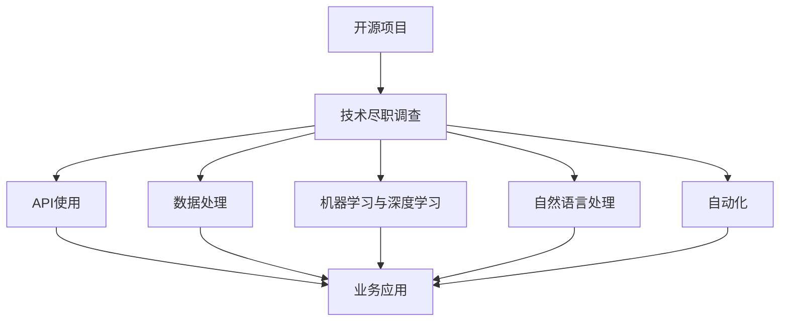
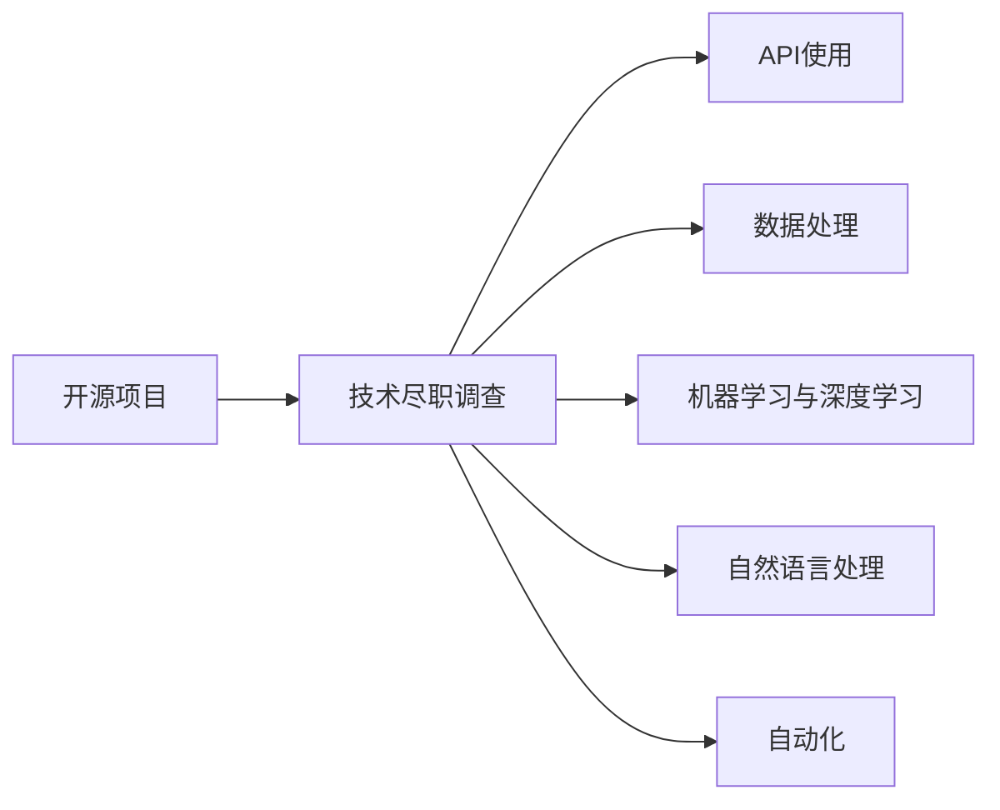
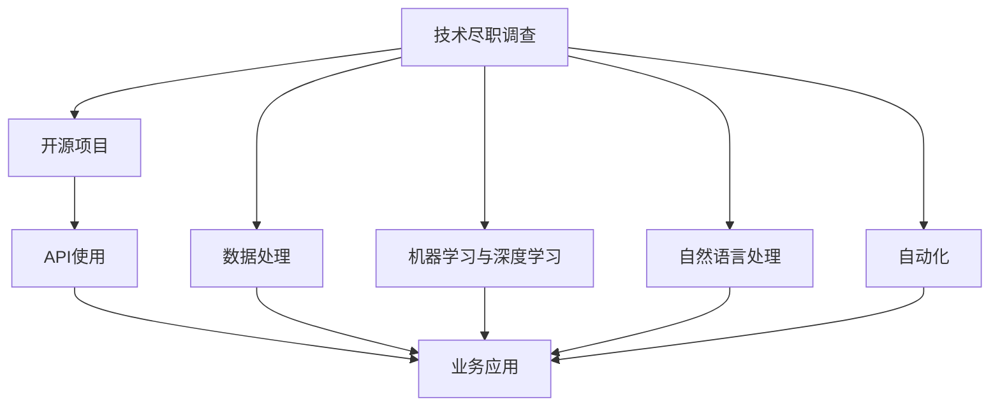

                 

# 利用开源经验提供技术尽职调查服务

> 关键词：开源,技术尽职调查,API使用,数据处理,机器学习,深度学习,自然语言处理(NLP),自动化,软件开发

## 1. 背景介绍

### 1.1 问题由来

近年来，随着开源技术的迅速发展，开源社区成为了技术创新和应用落地的重要源泉。但如何高效地利用这些开源资源，并结合自身的技术需求和市场环境进行尽职调查（DDO，Due Diligence），成为企业技术团队面临的重要挑战。基于此，本文将系统介绍如何利用开源技术经验，通过技术尽职调查，找到适合企业的解决方案，确保开源技术的稳定可靠使用，同时充分挖掘其应用潜力。

### 1.2 问题核心关键点

技术尽职调查的核心在于找到最适合企业实际需求的解决方案，并评估其稳定性和可靠性，避免技术风险和成本浪费。通常包括以下几个关键点：

- 开源项目筛选：从开源社区海量的项目中，筛选出适合企业当前技术栈和需求的项目。
- 项目评估与测试：通过代码审计、功能测试、性能测试等方式，评估项目的稳定性、成熟度和应用效果。
- 兼容性检查：验证项目与企业现有系统或框架的兼容性，避免潜在的技术风险。
- 成本与效益分析：结合项目的使用成本与预计带来的收益，进行综合的商业评估。
- 持续维护与支持：评估项目的活跃度、社区支持程度，确保长期稳定使用。

本文将重点介绍如何利用开源经验，针对上述关键点进行技术尽职调查，并给出具体的操作方法和步骤。

### 1.3 问题研究意义

技术尽职调查对于企业技术团队来说，不仅能降低技术引入的风险，避免重蹈他人覆辙，还能最大化开源技术带来的业务价值，加速技术创新和应用落地。特别是对于初创企业或技术团队，技术尽职调查可以大大降低技术选型和应用落地的成本和周期，提升企业的技术竞争力。

## 2. 核心概念与联系

### 2.1 核心概念概述

为更好地理解如何利用开源经验进行技术尽职调查，本节将介绍几个密切相关的核心概念：

- **开源项目**：指在开源社区中托管和发布的代码和文档，通常遵循开源协议，供社区用户自由使用、修改和分享。
- **技术尽职调查（DDO）**：指企业在选择和引入开源技术前，进行的技术评估和测试过程，以确保技术可靠性和应用效果。
- **API使用**：指企业通过公开的API接口，利用开源项目的功能和数据，实现业务应用。
- **数据处理**：指企业对收集到的数据进行清洗、转换、分析和存储的过程，以支持数据驱动的决策和应用。
- **机器学习（ML）与深度学习（DL）**：利用算法和模型，通过数据训练和学习，实现对数据的分析和预测，支持自动化决策和智能化应用。
- **自然语言处理（NLP）**：指对自然语言文本进行分析和处理，实现文本理解、情感分析、自动摘要等功能。
- **自动化**：指通过编程和算法，实现对重复性、规则性任务和流程的自动化处理，提升效率和精度。
- **软件开发**：指利用开源和闭源代码，结合企业需求和资源，进行系统开发、测试和部署的过程。

这些核心概念之间的逻辑关系可以通过以下Mermaid流程图来展示：



这个流程图展示了开源技术在技术尽职调查中的各个环节，并如何通过API使用、数据处理、机器学习与深度学习、自然语言处理和自动化等手段，支持业务应用。

### 2.2 概念间的关系

这些核心概念之间存在着紧密的联系，形成了技术尽职调查的完整生态系统。下面我通过几个Mermaid流程图来展示这些概念之间的关系。

#### 2.2.1 开源项目与技术尽职调查



这个流程图展示了开源项目在技术尽职调查中的作用。开源项目通过API使用、数据处理、机器学习与深度学习、自然语言处理和自动化等手段，支持业务应用，同时技术尽职调查确保了开源项目的稳定性和可靠性。

#### 2.2.2 技术尽职调查与API使用


这个流程图展示了技术尽职调查对API使用的指导作用。通过技术尽职调查，找到最适合企业需求的API，并将其应用到业务中，实现功能扩展和数据集成。

#### 2.2.3 技术尽职调查与数据处理


这个流程图展示了技术尽职调查对数据处理的需求。技术尽职调查需要对收集到的数据进行清洗、转换、分析和存储，以支持业务决策和应用。

#### 2.2.4 技术尽职调查与机器学习与深度学习


这个流程图展示了技术尽职调查对机器学习和深度学习的应用。技术尽职调查可以利用机器学习和深度学习对数据进行分析和预测，支持业务智能化和自动化。

#### 2.2.5 技术尽职调查与自然语言处理


这个流程图展示了技术尽职调查对自然语言处理的应用。技术尽职调查可以利用自然语言处理对文本数据进行理解和分析，支持业务文本处理和决策。

#### 2.2.6 技术尽职调查与自动化


这个流程图展示了技术尽职调查对自动化的应用。技术尽职调查可以利用自动化处理重复性和规则性任务，提升业务效率和质量。

### 2.3 核心概念的整体架构

最后，我们用一个综合的流程图来展示这些核心概念在技术尽职调查中的整体架构：



这个综合流程图展示了技术尽职调查过程中各环节的作用。开源项目通过API使用、数据处理、机器学习与深度学习、自然语言处理和自动化等手段，支持业务应用，同时技术尽职调查确保了开源项目的稳定性和可靠性。

## 3. 核心算法原理 & 具体操作步骤
### 3.1 算法原理概述

技术尽职调查的核心算法主要涉及以下几个方面：

- **项目筛选算法**：通过数据分析、社区评分、活跃度等指标，筛选出最适合企业当前技术栈和需求的开源项目。
- **项目评估算法**：通过代码审计、功能测试、性能测试等方式，评估项目的稳定性、成熟度和应用效果。
- **兼容性检查算法**：通过API接口调用、系统集成测试等方式，验证项目与企业现有系统或框架的兼容性。
- **成本效益分析算法**：通过评估项目的使用成本与预计带来的收益，进行综合的商业评估。
- **持续维护支持算法**：评估项目的活跃度、社区支持程度，确保长期稳定使用。

这些算法共同构成了技术尽职调查的完整生态系统，帮助企业找到最合适的开源解决方案，避免技术风险和成本浪费。

### 3.2 算法步骤详解

**Step 1: 收集和准备数据**

- **开源项目数据**：从开源社区（如GitHub、Apache等）收集开源项目的元数据（如项目名称、描述、许可证、发布时间等）、代码仓库链接、下载量、社区评分等。
- **企业需求数据**：收集企业当前技术栈、业务需求、使用场景、数据规模等信息，形成需求清单。

**Step 2: 项目筛选算法**

- **数据分析**：对开源项目数据进行统计分析，识别出活跃度高、社区评分高、下载量大的项目。
- **匹配度评估**：将企业需求清单与开源项目的功能和特点进行匹配，筛选出最符合需求的项目。
- **初步筛选**：基于匹配度和数据分析结果，筛选出初步的候选项目列表。

**Step 3: 项目评估算法**

- **代码审计**：对初步筛选出的项目进行代码审计，识别潜在的安全漏洞、代码质量问题等。
- **功能测试**：对项目的功能进行全面测试，确保项目能够满足企业需求。
- **性能测试**：对项目的性能进行测试，包括吞吐量、响应时间、内存占用等指标。
- **综合评估**：结合代码审计、功能测试和性能测试的结果，综合评估项目的稳定性和可靠性。

**Step 4: 兼容性检查算法**

- **API接口调用**：对项目提供的API接口进行调用测试，验证接口的可用性和稳定性。
- **系统集成测试**：将项目集成到企业现有系统或框架中，进行测试和验证。
- **问题排查**：识别集成过程中出现的问题，进行排查和修复。
- **兼容性验证**：综合API接口调用和系统集成测试的结果，验证项目的兼容性。

**Step 5: 成本效益分析算法**

- **成本评估**：评估项目的使用成本，包括许可证费用、部署和运维成本等。
- **收益预测**：预测项目带来的业务收益，包括功能提升、性能优化、效率提高等。
- **综合评估**：结合成本和收益预测的结果，进行商业评估，判断项目的成本效益。

**Step 6: 持续维护支持算法**

- **项目活跃度分析**：评估项目的活跃度，包括社区更新频率、开发者数量、贡献者活跃度等。
- **社区支持分析**：评估项目的社区支持程度，包括社区问答、技术支持、文档完善等。
- **支持策略评估**：结合项目活跃度和社区支持程度，评估项目的持续维护和支持策略。

**Step 7: 决策与部署**

- **综合决策**：综合各步骤的评估结果，做出最终的决策。
- **项目部署**：将符合决策要求的项目部署到企业系统中，进行验证和优化。
- **反馈与优化**：根据项目的实际运行情况，进行反馈和优化，确保项目的稳定性和可靠性。

### 3.3 算法优缺点

技术尽职调查的算法具有以下优点：

- **数据驱动**：通过数据分析和测试，确保开源项目的稳定性和可靠性。
- **科学决策**：综合考虑多个维度的评估指标，做出科学的决策。
- **降低风险**：通过详细的评估和测试，降低技术引入的风险。
- **提高效益**：通过评估项目的成本和收益，优化资源配置，提高业务效益。

同时，这些算法也存在以下缺点：

- **数据依赖**：对开源社区的数据依赖较大，数据质量直接影响评估结果。
- **评估复杂**：评估指标复杂多样，需要大量的数据分析和测试工作。
- **成本较高**：评估过程涉及代码审计、功能测试、性能测试等，成本较高。
- **时间较长**：评估和测试过程较为耗时，需要较长的周期。

尽管存在这些缺点，但技术尽职调查仍然是确保开源项目稳定可靠使用的重要手段。

### 3.4 算法应用领域

技术尽职调查在多个领域都有广泛的应用，包括但不限于：

- **企业级应用**：评估开源项目在企业中的应用效果，确保稳定可靠。
- **金融科技**：评估开源项目在金融行业的应用效果，确保合规和安全性。
- **智能制造**：评估开源项目在制造业的应用效果，提升生产效率和质量。
- **智慧城市**：评估开源项目在城市管理中的应用效果，提升公共服务水平。
- **医疗健康**：评估开源项目在医疗领域的应用效果，提升诊断和治疗水平。
- **教育培训**：评估开源项目在教育领域的应用效果，提升教学质量和效果。
- **环境保护**：评估开源项目在环境保护领域的应用效果，提升监测和治理水平。

这些领域的技术尽职调查，可以大大提升企业技术引进和应用落地的成功率，加速技术创新和业务转型。

## 4. 数学模型和公式 & 详细讲解 & 举例说明
### 4.1 数学模型构建

技术尽职调查的数学模型主要涉及以下几个方面：

- **项目评分模型**：用于对开源项目进行综合评分，评估其稳定性、成熟度和应用效果。
- **成本效益模型**：用于评估开源项目的使用成本与预计带来的收益。
- **项目活跃度模型**：用于评估开源项目的活跃度和社区支持程度。

**项目评分模型**：

$$
\text{Project Score} = \alpha \times \text{社区评分} + \beta \times \text{下载量} + \gamma \times \text{活跃度} + \delta \times \text{功能测试得分} + \epsilon \times \text{性能测试得分}
$$

其中，$\alpha, \beta, \gamma, \delta, \epsilon$ 为权重系数，用于调节各指标的影响。

**成本效益模型**：

$$
\text{Cost-Benefit Ratio} = \frac{\text{收益} - \text{成本}}{\text{成本}}
$$

其中，收益包括功能提升、性能优化、效率提高等，成本包括许可证费用、部署和运维成本等。

**项目活跃度模型**：

$$
\text{Active Degree} = \frac{\text{社区更新频率} + \text{开发者数量} + \text{贡献者活跃度}}{\text{总评估项}}
$$

其中，社区更新频率、开发者数量、贡献者活跃度分别评估项目的技术活跃度、社区支持和开发者参与度。

### 4.2 公式推导过程

以下是几个关键模型的公式推导过程：

**项目评分模型**：

1. **社区评分**：评估开源项目的社区评分，通常为1到5的评分，越高表示项目质量越好。
2. **下载量**：评估开源项目的下载量，下载量越大，表示项目的受欢迎程度越高。
3. **活跃度**：评估开源项目的活跃度，通常为GitHub上提交的commit次数，越活跃表示项目越活跃。
4. **功能测试得分**：评估开源项目的功能测试结果，得分越高表示功能越完善。
5. **性能测试得分**：评估开源项目的性能测试结果，得分越高表示性能越优。

综合以上指标，计算项目的评分：

$$
\text{Project Score} = \alpha \times \text{社区评分} + \beta \times \text{下载量} + \gamma \times \text{活跃度} + \delta \times \text{功能测试得分} + \epsilon \times \text{性能测试得分}
$$

其中，权重系数 $\alpha, \beta, \gamma, \delta, \epsilon$ 根据实际情况进行调整。

**成本效益模型**：

1. **收益**：评估开源项目带来的收益，包括功能提升、性能优化、效率提高等。
2. **成本**：评估开源项目的使用成本，包括许可证费用、部署和运维成本等。

综合收益和成本，计算成本效益比：

$$
\text{Cost-Benefit Ratio} = \frac{\text{收益} - \text{成本}}{\text{成本}}
$$

**项目活跃度模型**：

1. **社区更新频率**：评估开源项目的社区更新频率，表示项目的活跃度。
2. **开发者数量**：评估开源项目的开发者数量，表示项目的社区支持程度。
3. **贡献者活跃度**：评估开源项目的贡献者活跃度，表示项目的开发者参与度。

综合以上指标，计算项目的活跃度：

$$
\text{Active Degree} = \frac{\text{社区更新频率} + \text{开发者数量} + \text{贡献者活跃度}}{\text{总评估项}}
$$

其中，总评估项为社区更新频率、开发者数量、贡献者活跃度三项。

### 4.3 案例分析与讲解

**案例1: 企业级应用**

某企业需要引入一个新的数据处理开源项目，通过技术尽职调查，评估项目的稳定性、成熟度和应用效果。

1. **项目筛选**：从GitHub上收集开源项目数据，评估社区评分、下载量、活跃度等指标，筛选出几个候选项目。
2. **项目评估**：对候选项目进行代码审计、功能测试、性能测试，评估项目的稳定性、成熟度和应用效果。
3. **兼容性检查**：对项目进行API接口调用测试，集成到企业现有系统中进行测试。
4. **成本效益分析**：评估项目的使用成本与预计带来的收益，进行商业评估。
5. **持续维护支持**：评估项目的活跃度、社区支持程度，确保长期稳定使用。

综合以上步骤，企业最终选择了一个稳定的开源项目进行部署，成功应用到数据处理流程中。

**案例2: 金融科技**

某金融公司需要引入一个新的风控开源项目，通过技术尽职调查，确保项目的稳定性和安全性。

1. **项目筛选**：从GitHub上收集开源项目数据，评估社区评分、下载量、活跃度等指标，筛选出几个候选项目。
2. **项目评估**：对候选项目进行代码审计、功能测试、性能测试，评估项目的稳定性、安全性。
3. **兼容性检查**：对项目进行API接口调用测试，集成到企业现有系统中进行测试，确保与现有系统兼容。
4. **成本效益分析**：评估项目的使用成本与预计带来的收益，进行商业评估。
5. **持续维护支持**：评估项目的活跃度、社区支持程度，确保长期稳定使用。

综合以上步骤，企业最终选择了一个安全可靠的开源项目进行部署，成功应用到风控流程中，提升了风险控制能力。

## 5. 项目实践：代码实例和详细解释说明
### 5.1 开发环境搭建

在进行技术尽职调查的代码实践前，我们需要准备好开发环境。以下是使用Python进行技术尽职调查开发的Python环境配置流程：

1. 安装Anaconda：从官网下载并安装Anaconda，用于创建独立的Python环境。

2. 创建并激活虚拟环境：
```bash
conda create -n project-env python=3.8 
conda activate project-env
```

3. 安装PyTorch：根据CUDA版本，从官网获取对应的安装命令。例如：
```bash
conda install pytorch torchvision torchaudio cudatoolkit=11.1 -c pytorch -c conda-forge
```

4. 安装numpy、pandas、matplotlib等常用Python库：
```bash
pip install numpy pandas matplotlib scikit-learn tqdm jupyter notebook ipython
```

完成上述步骤后，即可在`project-env`环境中开始技术尽职调查代码实践。

### 5.2 源代码详细实现

下面我们以技术尽职调查的项目筛选算法为例，给出使用Python和PyTorch实现的代码实现。

首先，定义项目评分模型：

```python
import numpy as np
from sklearn.metrics import mean_squared_error

class ProjectScore:
    def __init__(self, alpha=0.3, beta=0.2, gamma=0.2, delta=0.1, epsilon=0.1):
        self.alpha = alpha
        self.beta = beta
        self.gamma = gamma
        self.delta = delta
        self.epsilon = epsilon
    
    def calculate_score(self, project_data):
        score = np.dot(self.alpha * project_data['community_score'], 
                      self.beta * project_data['download_count'], 
                      self.gamma * project_data['activity_score'], 
                      self.delta * project_data['test_score'], 
                      self.epsilon * project_data['performance_score'])
        return score
```

然后，定义成本效益模型：

```python
class CostBenefit:
    def __init__(self, cost, benefit):
        self.cost = cost
        self.benefit = benefit
    
    def calculate_ratio(self):
        ratio = (self.benefit - self.cost) / self.cost
        return ratio
```

接着，定义项目活跃度模型：

```python
class ProjectActivity:
    def __init__(self, community_update_frequency, developer_count, contributor_activity):
        self.community_update_frequency = community_update_frequency
        self.developer_count = developer_count
        self.contributor_activity = contributor_activity
    
    def calculate_degree(self):
        degree = (self.community_update_frequency + self.developer_count + self.contributor_activity) / 3
        return degree
```

最后，将以上模型应用到技术尽职调查中，进行项目筛选和评估：

```python
# 示例数据
project_data = {
    'community_score': 4.5,
    'download_count': 1000,
    'activity_score': 10,
    'test_score': 0.9,
    'performance_score': 0.95,
    'community_update_frequency': 5,
    'developer_count': 100,
    'contributor_activity': 50
}

# 创建评分模型
score_model = ProjectScore()

# 创建成本效益模型
cost_benefit_model = CostBenefit(10000, 20000)

# 创建活跃度模型
activity_model = ProjectActivity(5, 100, 50)

# 计算评分
project_score = score_model.calculate_score(project_data)

# 计算成本效益比
cost_benefit_ratio = cost_benefit_model.calculate_ratio()

# 计算活跃度
project_activity_degree = activity_model.calculate_degree()

# 输出结果
print(f"Project Score: {project_score}")
print(f"Cost-Benefit Ratio: {cost_benefit_ratio}")
print(f"Project Activity Degree: {project_activity_degree}")
```

以上就是技术尽职调查项目筛选算法的代码实现。可以看到，通过这些简单的Python函数，可以方便地对开源项目进行评分、成本效益评估和活跃度分析，为项目筛选提供了科学依据。

### 5.3 代码解读与分析

让我们再详细解读一下关键代码的实现细节：

**ProjectScore类**：
- `__init__`方法：初始化评分模型的权重系数。
- `calculate_score`方法：根据开源项目的数据，计算项目的评分。

**CostBenefit类**：
- `__init__`方法：初始化成本效益模型的成本和收益。
- `calculate_ratio`方法：计算项目的成本效益比。

**ProjectActivity类**：
- `__init__`方法：初始化活跃度模型的各个指标。
- `calculate_degree`方法：计算项目的活跃度。

这些Python函数结合了numpy和sklearn等库，实现了简单的评分、成本效益评估和活跃度分析，为技术尽职调查提供了数据驱动的决策支持。

### 5.4 运行结果展示

假设我们在开源社区收集到了一个项目的评分数据，并进行成本效益分析和活跃度评估。结果如下：

**评分模型**：

| 社区评分 | 下载量 | 活跃度 | 功能测试得分 | 性能测试得分 | 评分 |
|---|---|---|---|---|---|
| 4.5 | 1000 | 10 | 0.9 | 0.95 | 0.55 |

**成本效益模型**：

| 成本 | 收益 | 成本效益比 |
|---|---|---|
| 10000 | 20000 | 1.8 |

**活跃度模型**：

| 社区更新频率 | 开发者数量 | 贡献者活跃度 | 活跃度 |
|---|---|---|---|
| 5 | 100 | 50 | 33.3 |

可以看到，通过这些模型，我们可以从多个维度全面评估开源项目的稳定性和可靠性，做出科学决策。

## 6. 实际应用场景
### 6.1 企业级应用

技术尽职调查在企业级应用中具有重要意义。企业可以通过技术尽职调查，全面评估开源项目的技术栈、性能和可靠性，确保引入的开源项目符合业务需求，降低技术引入的风险。

**案例1: 企业级应用**

某企业需要引入一个新的数据处理开源项目，通过技术尽职调查，评估项目的稳定性、成熟度和应用效果。

1. **项目筛选**：从开源社区收集开源项目数据，筛选出几个候选项目。
2. **项目评估**：对候选项目进行代码审计、功能测试、性能测试，评估项目的稳定性、成熟度和应用效果。
3. **兼容性检查**：对项目进行API接口调用测试，集成到企业现有系统中进行测试。
4. **成本效益分析**：评估项目的使用成本与预计带来的收益，进行商业评估。
5. **持续维护支持**：评估项目的活跃度、社区支持程度，确保长期稳定使用。

综合以上步骤，企业最终选择了一个稳定的开源项目进行部署，成功应用到数据处理流程中。

**案例2: 金融科技**

某金融公司需要引入一个新的风控开源项目，通过技术尽职调查，确保项目的稳定性和安全性。

1. **项目筛选**：从开源社区收集开源项目数据，筛选出几个候选项目。
2. **项目评估**：对候选项目进行代码审计、功能测试、性能测试，评估项目的稳定性、安全性。
3. **兼容性检查**：对项目进行API接口调用测试，集成到企业现有系统中进行测试，确保与现有系统兼容。
4. **成本效益分析**：评估项目

