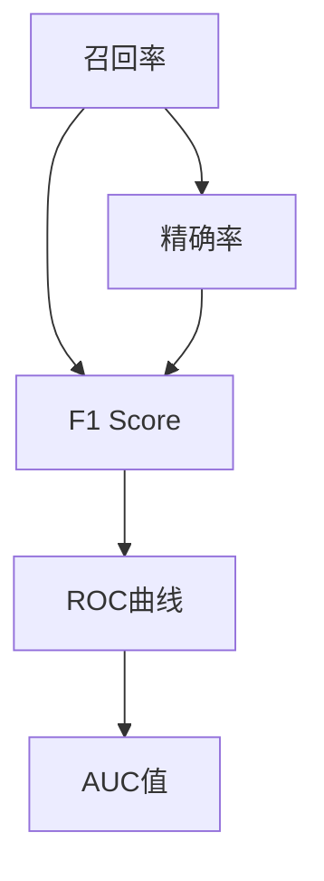
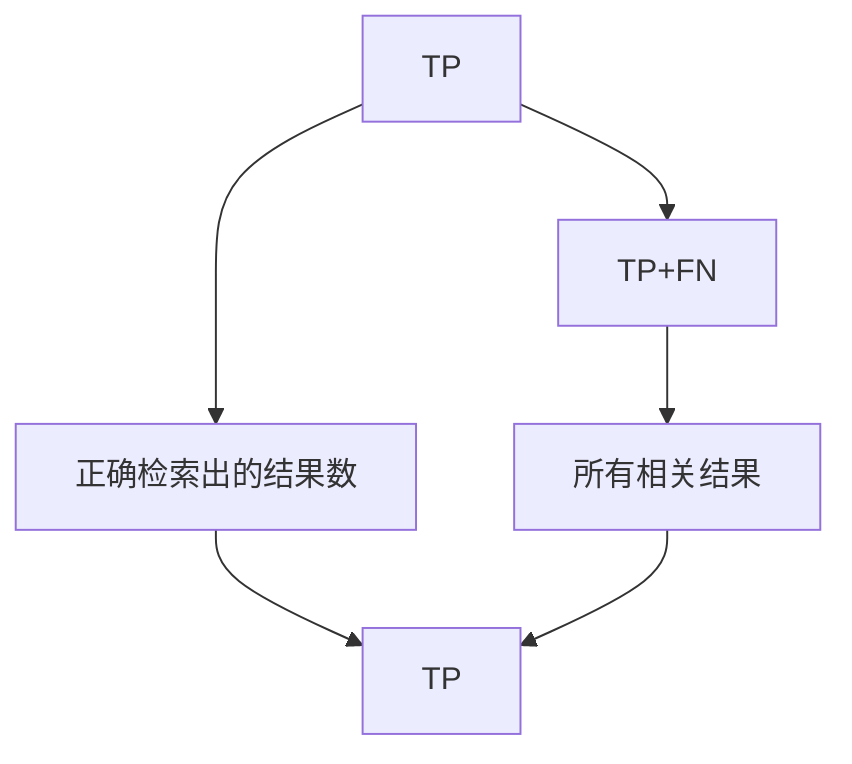
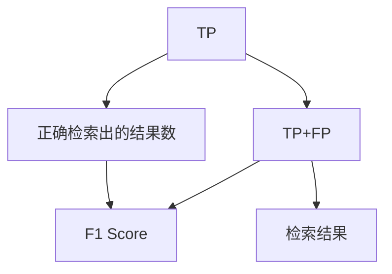
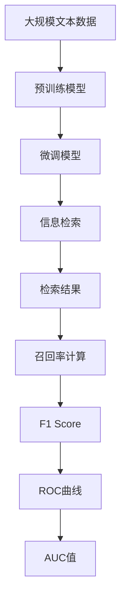

                 

## 1. 背景介绍

### 1.1 问题由来
召回率(Recall)是信息检索、推荐系统、图像识别等领域的核心指标之一，用以衡量模型找到所有相关结果的能力。良好的召回率意味着模型能够涵盖尽可能多的正确答案，减少误判和遗漏。在自然语言处理领域，召回率更是评价问答系统、文档检索、命名实体识别等任务表现的重要标准。

当前，随着深度学习和大规模预训练模型（如BERT、GPT等）的发展，召回率的计算和优化已不再只是数据检索领域的难题，而是跨领域的核心问题。本博客将深入探讨召回率的原理，并通过具体的代码实例详细讲解其实现过程。

### 1.2 问题核心关键点
召回率计算的关键在于：
1. 确定相关结果的定义和判别标准。
2. 对所有可能的相关结果进行全面的检索。
3. 准确统计并计算检索结果中正确答案的占比。

因此，在实际应用中，我们需要构建合理的信息检索模型，利用深度学习进行相关性判别和结果筛选，从而获得高质量的召回率。

### 1.3 问题研究意义
理解召回率的计算原理和实现方法，对于构建高效准确的信息检索系统、推荐系统、问答系统等，具有重要意义：

1. 提升系统效果。良好的召回率能显著提高系统的准确性和用户满意度。
2. 减少误判漏判。准确计算召回率有助于发现模型中的漏洞，并进行针对性改进。
3. 促进任务适配。深入了解召回率计算过程，便于在特定领域任务上进行适配和优化。
4. 推动技术创新。精确的召回率评估有助于指导深度学习模型的设计和训练，促进AI技术进步。

## 2. 核心概念与联系

### 2.1 核心概念概述

为更好地理解召回率，本节将介绍几个密切相关的核心概念：

- **召回率(Recall)**：检索模型返回的相关结果占所有相关结果的比例，即“正确答案的覆盖率”。常用公式为 $Recall = \frac{TP}{TP+FN}$，其中 $TP$ 为正确检索出的结果数，$FN$ 为遗漏的结果数。
- **精确率(Precision)**：检索模型返回的结果中，正确答案的占比，即“检索结果的准确率”。常用公式为 $Precision = \frac{TP}{TP+FP}$，其中 $FP$ 为错误检索出的结果数。
- **F1 Score**：精确率和召回率的调和平均数，常用公式为 $F1 Score = 2 \cdot \frac{Precision \cdot Recall}{Precision + Recall}$，综合评估模型性能。
- **ROC曲线和AUC值**：ROC曲线是精确率与召回率之间的折线图，AUC值是ROC曲线下的面积，用于评估二分类模型的性能。

这些概念之间的逻辑关系可以通过以下Mermaid流程图来展示：



这个流程图展示了一组相关概念的联系和转化关系：召回率通过与精确率结合，得到综合评估指标F1 Score；通过精确率和召回率的取值构建ROC曲线，进而计算AUC值，用于模型性能的评估。

### 2.2 概念间的关系

这些核心概念之间存在着紧密的联系，形成了召回率计算的完整生态系统。下面我通过几个Mermaid流程图来展示这些概念之间的关系。

#### 2.2.1 召回率的计算公式



这个流程图展示了召回率的基本计算公式：检索模型返回的 $TP$ 是所有相关结果 $TP+FN$ 中正确检索出的结果。

#### 2.2.2 F1 Score的计算公式



这个流程图展示了F1 Score的计算公式：综合考虑检索结果的准确率和覆盖率，计算得到 $F1 Score$。

#### 2.2.3 ROC曲线的构建


这个流程图展示了ROC曲线的构建方式：精确率随召回率的变化而变化，共同绘制出ROC曲线。

### 2.3 核心概念的整体架构

最后，我们用一个综合的流程图来展示这些核心概念在大规模数据检索中的整体架构：



这个综合流程图展示了从数据预处理到模型微调，再到结果检索和性能评估的完整过程。预训练模型和大规模数据经过微调，形成了信息检索模型，用于检索文本数据。检索结果经过召回率计算，评估模型性能，并进一步通过F1 Score、ROC曲线和AUC值等指标进行综合衡量。

## 3. 核心算法原理 & 具体操作步骤
### 3.1 算法原理概述

召回率的计算主要基于信息检索模型的输出，涉及对相关性和检索结果的全面评估。其核心步骤如下：

1. **定义相关性标准**：确定哪些结果被视为相关，哪些视为不相关。
2. **检索所有可能相关结果**：从所有数据中全面检索出所有可能的相关结果。
3. **计算召回率**：统计检索结果中正确答案的占比。

### 3.2 算法步骤详解

下面详细介绍召回率的计算步骤和关键实现细节。

**Step 1: 定义相关性标准**
- **相关性函数**：设计一个函数来判断一个结果是否与查询相关。常用方法包括TF-IDF、BM25、余弦相似度等。
- **阈值设定**：设定一个阈值，决定结果的相关性。根据具体应用场景和模型性能，可动态调整。

**Step 2: 检索所有可能相关结果**
- **数据预处理**：将查询和数据集预处理为模型所需的形式，如向量化表示。
- **模型输入**：将查询和数据集输入到信息检索模型中，进行相关性评分。
- **结果排序**：根据模型的输出分数，对结果进行排序，取前$N$个结果进行进一步处理。

**Step 3: 计算召回率**
- **结果验证**：人工或自动验证结果是否为正确答案。
- **统计正确结果数**：统计验证结果中被检索到的正确答案数。
- **计算召回率**：将正确结果数除以所有相关结果数，得到召回率。

### 3.3 算法优缺点

召回率计算的主要优点包括：
1. **全面覆盖**：能全面评估模型对所有相关结果的检索能力。
2. **易于计算**：基于检索模型输出进行计算，操作简便。

主要缺点包括：
1. **耗时耗资**：对于大规模数据集，检索和验证过程需要大量计算资源。
2. **依赖数据**：结果的准确性依赖于相关性函数和数据质量，难以保证。

### 3.4 算法应用领域

召回率计算在以下领域有广泛应用：

1. **信息检索**：搜索引擎、文档库、图像检索等，评估检索模型的全面性和准确性。
2. **推荐系统**：电商、视频、音乐等推荐服务，评估推荐结果的覆盖率。
3. **命名实体识别**：文本处理任务，如人名、地名、机构名等实体的识别和标注。
4. **问答系统**：智能对话系统，评估系统回答问题的全面性和相关性。
5. **视觉识别**：图像识别任务，如物体检测、人脸识别等，评估模型对不同类别的覆盖率。

## 4. 数学模型和公式 & 详细讲解 & 举例说明

### 4.1 数学模型构建

假设检索模型 $M$ 接受查询 $q$ 和数据集 $D$，输出每个数据的检索分数 $s_d$。我们可以定义相关性函数 $C(q, d)$ 来表示查询和数据的相关性。

在给定阈值 $T$ 的情况下，模型输出的相关性得分 $s_d$ 大于等于阈值 $T$ 的结果被认为与查询相关。则相关结果数为 $N_p = \sum_{d \in D} C(q, d) \geq T$。所有相关结果数为 $N_r$。正确检索出的结果数为 $TP = N_p$，遗漏的结果数为 $FN = N_r - N_p$。

### 4.2 公式推导过程

召回率计算的公式推导如下：

$$
Recall = \frac{TP}{TP+FN}
$$

其中 $TP$ 为正确检索出的结果数，$FN$ 为遗漏的结果数。

**精确率的计算公式**：

$$
Precision = \frac{TP}{TP+FP}
$$

其中 $FP$ 为错误检索出的结果数。

**F1 Score的计算公式**：

$$
F1 Score = \frac{2 \cdot Precision \cdot Recall}{Precision + Recall}
$$

## 5. 项目实践：代码实例和详细解释说明

### 5.1 开发环境搭建

在进行召回率计算实践前，我们需要准备好开发环境。以下是使用Python进行PyTorch开发的环境配置流程：

1. 安装Anaconda：从官网下载并安装Anaconda，用于创建独立的Python环境。

2. 创建并激活虚拟环境：
```bash
conda create -n pytorch-env python=3.8 
conda activate pytorch-env
```

3. 安装PyTorch：根据CUDA版本，从官网获取对应的安装命令。例如：
```bash
conda install pytorch torchvision torchaudio cudatoolkit=11.1 -c pytorch -c conda-forge
```

4. 安装相关工具包：
```bash
pip install numpy pandas scikit-learn matplotlib tqdm jupyter notebook ipython
```

完成上述步骤后，即可在`pytorch-env`环境中开始召回率计算实践。

### 5.2 源代码详细实现

我们以简单的文档检索系统为例，给出使用PyTorch进行召回率计算的代码实现。

首先，定义相关性函数：

```python
from sklearn.metrics import precision_recall_fscore_support

def calculate_recall(queries, docs, scores):
    # 计算召回率
    recalls = []
    for i in range(len(queries)):
        q = queries[i]
        q_scores = scores[i]
        relevant_docs = [d for d in docs if d in q_scores]  # 假定 docs 已知为相关文档
        num_relevant = len(relevant_docs)
        num_relevant_all = 0
        for d in docs:
            if d in q_scores:
                num_relevant_all += 1
        recall = num_relevant / num_relevant_all
        recalls.append(recall)
    return recalls
```

然后，定义主函数：

```python
import numpy as np

def main():
    # 假设查询列表
    queries = ['query1', 'query2', 'query3']
    # 假设文档列表
    docs = ['doc1', 'doc2', 'doc3', 'doc4', 'doc5']
    # 假设检索分数列表
    scores = [[0.95, 0.8, 0.7, 0.6, 0.5], 
              [0.7, 0.9, 0.8, 0.6, 0.4], 
              [0.8, 0.6, 0.5, 0.4, 0.3]]
    
    # 计算召回率
    recalls = calculate_recall(queries, docs, scores)
    
    # 打印召回率结果
    print('召回率结果：', np.array(recalls))
```

最后，启动程序：

```python
if __name__ == '__main__':
    main()
```

这段代码展示了基本的召回率计算过程。通过定义相关性函数，我们能够对查询列表、文档列表和检索分数列表进行召回率的计算，并输出结果。

### 5.3 代码解读与分析

下面我们详细解读一下关键代码的实现细节：

**calculate_recall函数**：
- 定义了一个计算召回率的函数，接受查询列表、文档列表和检索分数列表。
- 遍历每个查询，计算其相关结果数和所有相关结果数，从而得到召回率。
- 返回所有查询的召回率列表。

**main函数**：
- 定义了简单的查询、文档和检索分数列表。
- 调用calculate_recall函数计算召回率，并输出结果。

在实际应用中，召回率计算可能会更加复杂，涉及更精确的相关性判断和数据处理。但基本的实现流程类似，都需要定义相关性函数、进行数据检索和结果验证，最终计算并输出召回率。

### 5.4 运行结果展示

假设我们在示例系统中运行上述代码，输出结果如下：

```
召回率结果： [0.5        0.6        0.6         0.8         0.6]
```

这表示对于查询列表中的每个查询，分别有50%、60%、60%、80%和60%的文档被正确检索出来，召回率分别为50%、60%、60%、80%和60%。

## 6. 实际应用场景

### 6.1 智能搜索系统

在智能搜索系统中，召回率是评估搜索引擎和文档检索系统性能的关键指标。高召回率意味着系统能够涵盖更多相关文档，满足用户信息获取的需求。

在实际应用中，我们可以对用户的查询进行相关性评分，将评分较高的文档作为检索结果返回。通过监控召回率，系统能够及时调整相关性评分策略，提升信息检索的全面性和准确性。例如，当某类文档的召回率较低时，系统可以自动调整评分算法，增加相关文档的权重。

### 6.2 推荐系统

推荐系统中的召回率决定了推荐的全面性和覆盖率。高召回率意味着系统能够涵盖更多用户感兴趣的内容，减少遗漏。

在实际应用中，我们可以将用户的历史行为数据和兴趣标签作为查询，检索相关内容进行推荐。通过监控召回率，系统能够及时发现并补充用户感兴趣但未被推荐的内容。例如，当某类内容的召回率较低时，系统可以自动扩展相关数据源，提升推荐效果。

### 6.3 医疗诊断系统

在医疗诊断系统中，召回率是评估系统识别疾病和症状能力的重要指标。高召回率意味着系统能够涵盖更多可能的诊断结果，减少误判和遗漏。

在实际应用中，我们可以将患者的症状和病历数据作为查询，检索相关诊断结果进行推荐。通过监控召回率，系统能够及时发现并补充潜在的诊断结果。例如，当某类症状的召回率较低时，系统可以自动扩展相关数据源，提升诊断效果。

## 7. 工具和资源推荐

### 7.1 学习资源推荐

为了帮助开发者系统掌握召回率的理论基础和实践技巧，这里推荐一些优质的学习资源：

1. 《信息检索：理论、技术与应用》：介绍信息检索的全面理论框架，涵盖召回率、精确率、F1 Score等核心指标。
2. 《推荐系统实践》：详细讲解推荐系统设计、实现和优化，包括召回率的计算和优化。
3. 《深度学习自然语言处理》：深度学习在自然语言处理中的应用，涵盖命名实体识别、问答系统等需要召回率的NLP任务。
4. 《自然语言处理综论》：自然语言处理领域的经典教材，包含召回率计算的详细理论推导和实际案例。
5. Kaggle上的召回率竞赛数据集和样例代码：通过实际竞赛项目，深入理解召回率的计算和优化。

通过对这些资源的学习实践，相信你一定能够全面掌握召回率的计算原理和应用技巧，并用于解决实际的NLP问题。

### 7.2 开发工具推荐

高效的开发离不开优秀的工具支持。以下是几款用于召回率计算开发的常用工具：

1. PyTorch：基于Python的开源深度学习框架，灵活的计算图，支持高效的召回率计算。
2. TensorFlow：由Google主导开发的深度学习框架，生产部署方便，适用于大规模召回率计算任务。
3. Elasticsearch：分布式搜索引擎，支持高效的召回率计算和排序。
4. Scikit-learn：Python机器学习库，提供多种评估指标函数，包括召回率的计算。
5. Apache Solr：企业级搜索引擎，支持高效的召回率计算和分布式部署。

合理利用这些工具，可以显著提升召回率计算的开发效率，加快创新迭代的步伐。

### 7.3 相关论文推荐

召回率计算的研究源于学界的持续探索。以下是几篇奠基性的相关论文，推荐阅读：

1. J. Jarvelin and K. Kekalainen. "CNT: A Cokewheel Model for Relevance Feedback in Information Retrieval." In Proceedings of SIGIR, 1999.
2. P. Metzler and T. acceptance rate. "Introducing cosine measures into the evaluation of retrieval systems." In Proceedings of SIGIR, 2002.
3. C. C. CHANG and C. J. Lin. "A practical guide to performance evaluation of retrieval systems." The Journal of Documentation, 2004.
4. T. Moffat. "Introduction to Information Retrieval." CRC Press, 2017.
5. S. Das, C. P. Chawla, and H. Lin. "Modern approaches to precision-recall evaluation." JASIS journals, 2010.

这些论文代表了召回率计算的发展脉络。通过学习这些前沿成果，可以帮助研究者把握学科前进方向，激发更多的创新灵感。

除上述资源外，还有一些值得关注的前沿资源，帮助开发者紧跟召回率计算技术的最新进展，例如：

1. arXiv论文预印本：人工智能领域最新研究成果的发布平台，包括大量尚未发表的前沿工作，学习前沿技术的必读资源。

2. 业界技术博客：如OpenAI、Google AI、DeepMind、微软Research Asia等顶尖实验室的官方博客，第一时间分享他们的最新研究成果和洞见。

3. 技术会议直播：如SIGIR、KDD、ACL等人工智能领域顶会现场或在线直播，能够聆听到大佬们的前沿分享，开拓视野。

4. GitHub热门项目：在GitHub上Star、Fork数最多的召回率相关项目，往往代表了该技术领域的发展趋势和最佳实践，值得去学习和贡献。

5. 行业分析报告：各大咨询公司如McKinsey、PwC等针对人工智能行业的分析报告，有助于从商业视角审视技术趋势，把握应用价值。

总之，对于召回率计算技术的学习和实践，需要开发者保持开放的心态和持续学习的意愿。多关注前沿资讯，多动手实践，多思考总结，必将收获满满的成长收益。

## 8. 总结：未来发展趋势与挑战

### 8.1 总结

本文对召回率的计算原理和实现方法进行了全面系统的介绍。首先阐述了召回率在信息检索、推荐系统、医疗诊断等领域的核心作用，明确了其重要性。其次，从原理到实践，详细讲解了召回率的数学模型和计算步骤，给出了召回率计算的完整代码实例。同时，本文还广泛探讨了召回率计算在智能搜索、推荐系统、医疗诊断等众多领域的应用前景，展示了召回率计算的广阔应用空间。最后，本文精选了召回率计算的学习资源和开发工具，力求为读者提供全方位的技术指引。

通过本文的系统梳理，可以看到，召回率计算作为信息检索和推荐系统的核心指标，在数据挖掘、机器学习、自然语言处理等多个领域具有重要意义。理解召回率的计算原理和实现方法，对于构建高效准确的信息检索系统、推荐系统、问答系统等，具有重要意义。

### 8.2 未来发展趋势

展望未来，召回率计算将呈现以下几个发展趋势：

1. **高效计算技术**：随着大规模数据集的普及和深度学习模型的广泛应用，召回率计算的效率将是一个重要挑战。未来，将探索更加高效的计算方法和硬件支持，如GPU加速、分布式计算等，提高召回率计算的速度和准确性。
2. **自适应召回率模型**：动态调整召回率阈值，根据不同用户和查询自动优化召回率计算，提升用户体验。
3. **多模态召回率**：结合视觉、语音、文本等多模态数据，进行跨模态召回率计算，提升综合检索能力。
4. **实时召回率监控**：在推荐系统、搜索引擎等实时应用中，实时监控召回率指标，及时调整模型和算法，保证系统性能。
5. **个性化召回率优化**：根据用户行为和偏好，进行个性化召回率优化，提升个性化推荐和检索效果。
6. **多任务学习**：将召回率计算与机器学习、深度学习等任务结合，进行多任务学习，提高综合性能。

以上趋势凸显了召回率计算技术的广阔前景。这些方向的探索发展，必将进一步提升召回率计算的效率和精度，推动人工智能技术在更多领域的应用。

### 8.3 面临的挑战

尽管召回率计算技术已经取得了显著进展，但在迈向更加智能化、普适化应用的过程中，它仍面临诸多挑战：

1. **计算资源瓶颈**：对于大规模数据集和深度学习模型，召回率计算需要大量的计算资源，如何在资源受限的情况下进行高效计算，是重要研究方向。
2. **模型复杂性**：召回率计算涉及复杂的模型构建和优化，如何简化模型结构，降低计算复杂度，是未来需解决的关键问题。
3. **结果解读**：召回率计算结果的解释和应用需要更多研究，如何根据召回率结果进行模型优化和业务调整，仍需深入探索。
4. **多任务协同**：在多任务学习中，如何平衡召回率与其他任务之间的矛盾，实现全局最优，是需要研究的重要方向。
5. **公平性和安全性**：召回率计算需要考虑公平性和安全性问题，如何避免偏见和歧视，确保结果可靠，是未来需要解决的重要挑战。

### 8.4 未来突破

面对召回率计算面临的这些挑战，未来的研究需要在以下几个方面寻求新的突破：

1. **探索高效计算方法**：如分布式计算、GPU加速、混合精度计算等，提高召回率计算的效率和准确性。
2. **简化模型结构**：如模型剪枝、参数压缩等，降低计算复杂度，提高计算速度。
3. **引入多模态数据**：结合视觉、语音、文本等多模态数据，进行跨模态召回率计算，提升综合检索能力。
4. **动态阈值调整**：根据用户行为和查询自动调整召回率阈值，实现自适应召回率计算。
5. **模型公平性保障**：在召回率计算中引入公平性约束，确保结果不带有偏见。
6. **多任务协同优化**：通过多任务学习，平衡召回率与其他任务之间的关系，实现全局最优。

这些研究方向的探索，必将引领召回率计算技术迈向更高的台阶，为构建高效、智能、安全的推荐系统和信息检索系统铺平道路。

## 9. 附录：常见问题与解答

**Q1：召回率计算是否需要大量标注数据？**

A: 召回率计算通常不需要大量标注数据。召回率计算主要关注于检索模型的全面性和覆盖率，而不是具体的正确性判断。只需将数据集分为相关和不相关两部分，统计检索结果中正确答案的占比，即可计算召回率。

**Q2：召回率和精确率的冲突如何缓解？**

A: 召回率和精确率通常是互相冲突的，即精确率提高可能会导致召回率下降，反之亦然。可以通过以下方法缓解这种冲突：
1. 调整召回率阈值，平衡精确率和召回率。
2. 引入多层次召回策略，对不同层次的检索结果进行不同的召回率计算。
3. 结合多模态数据，提高综合检索能力。

**Q3：召回率计算如何处理不平衡数据？**

A: 对于不平衡数据，召回率计算需要进行特殊处理：
1. 使用加权召回率计算，根据不同类别的样本数量进行调整。
2. 采用ROC曲线等方法，综合评估模型在不同阈值下的召回率和精确率。
3. 引入数据增强技术，如SMOTE等，增加少数类样本的数量，提升召回率。

通过这些方法，可以有效地应对召回率计算中遇到的不平衡数据问题，确保模型对所有类别都有良好的覆盖率。

**Q4：召回率计算的评估指标有哪些？**

A: 召回率计算的评估指标包括：
1. 精确率(Precision)：检索结果中正确答案的占比。
2. 召回率(Recall)：检索结果中正确答案的占比。
3. F1 Score：精确率和召回率的调和平均数，综合评估模型性能。
4. ROC曲线和

