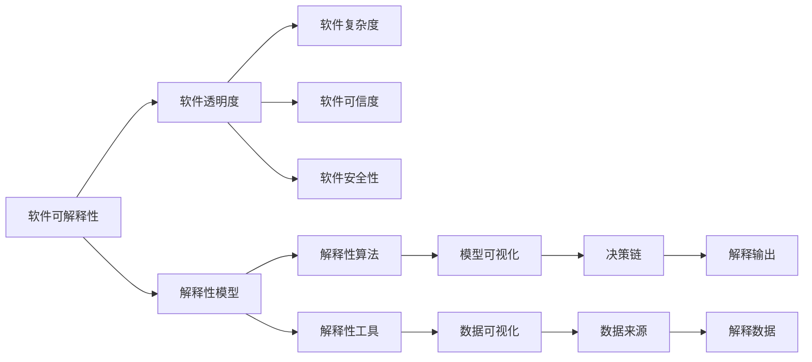

                 

# 可解释性是软件2.0需要克服的难题

## 1. 背景介绍

在软件工程领域，可解释性（Explainability）是指软件系统能够向用户清楚解释其决策过程和结果的能力。可解释性对于提升用户信任、保障系统透明度、降低风险等具有重要意义。然而，随着软件系统变得越来越复杂和智能化，可解释性也成为了一个越来越突出的问题。

### 1.1 软件1.0的局限性

在软件1.0时代，程序员编写代码，机器执行指令，软件系统直接映射程序员的逻辑。这种“黑盒”模型下的软件系统可解释性较高，用户可以通过源代码和算法实现逻辑，理解软件的行为和结果。然而，随着人工智能（AI）和大数据技术的发展，软件系统开始具备了自主学习和决策能力，软件1.0的可解释性优势逐渐减弱。

### 1.2 软件2.0的兴起

软件2.0时代，软件系统变得更加智能化和自主化，通过机器学习（ML）、深度学习（DL）等技术，能够处理海量数据并自主进行决策。这种“智能黑盒”模型下的软件系统，虽然能够取得更好的性能，但其决策过程却难以被人类理解。如何提升软件系统的可解释性，成为了软件2.0需要克服的一大难题。

## 2. 核心概念与联系

### 2.1 核心概念概述

为更好地理解软件2.0的可解释性问题，本节将介绍几个密切相关的核心概念：

- **软件可解释性**：指软件系统能够向用户清晰解释其决策过程和结果的能力。可解释性对于提升用户信任、保障系统透明度、降低风险等具有重要意义。

- **软件透明度**：指软件系统的决策过程和结果能够被用户和开发者理解和解释的程度。透明的软件系统，其决策过程和结果可被复现和验证，从而提高系统的可信度和可控性。

- **软件复杂度**：指软件系统的复杂程度，包括代码规模、系统架构、数据依赖等因素。随着软件复杂度的增加，系统的可解释性也变得愈加困难。

- **软件可信度**：指软件系统能够满足其设计目标和用户需求的程度。可信的软件系统，其决策过程和结果必须符合逻辑、合法合规。

- **软件安全性**：指软件系统能够抵御外部攻击和内部漏洞的能力。安全的软件系统，其决策过程和结果不能被恶意利用或篡改。

这些核心概念之间存在着紧密的联系，共同构成了软件系统的可解释性框架。

### 2.2 概念间的关系

这些核心概念之间存在着紧密的联系，形成了软件2.0的可解释性体系结构。以下是一个简化的Mermaid流程图：



这个流程图展示了软件2.0的可解释性体系结构：

1. 软件可解释性通过软件透明度、软件复杂度、软件可信度、软件安全性等多个维度来衡量。
2. 解释性模型、解释性算法、解释性工具等技术手段，帮助实现软件系统的可解释性。
3. 通过模型可视化、数据可视化等技术，将解释性结果直观展示，形成决策链。
4. 解释性数据来源于多种来源，如模型参数、训练数据、测试数据等，经过解释性算法处理后，输出解释结果。

## 3. 核心算法原理 & 具体操作步骤

### 3.1 算法原理概述

软件2.0的可解释性主要依赖于解释性模型和解释性算法。解释性模型通过对软件系统进行建模，帮助理解系统的内部工作机制。解释性算法则通过对模型进行分析，输出易于理解的解释结果。

在实践中，我们通常使用LIME（Local Interpretable Model-agnostic Explanations）、SHAP（SHapley Additive exPlanations）等解释性模型，结合Attention机制、可解释性学习（Explainable Machine Learning, XAI）等技术，进行软件系统的可解释性分析。

### 3.2 算法步骤详解

以下是一个基于LIME模型的软件系统可解释性分析的具体步骤：

**Step 1: 数据准备**

- 收集软件系统的输入数据和输出数据。
- 对数据进行预处理，去除噪声和异常值。

**Step 2: 模型选择**

- 选择适当的机器学习模型，如决策树、随机森林、神经网络等。
- 对模型进行训练和验证，确保模型具备良好的泛化能力。

**Step 3: 特征选择**

- 确定模型的关键特征，如输入数据的特征值、决策树的特征重要性等。
- 对关键特征进行标注，便于后续解释性分析。

**Step 4: 解释性计算**

- 使用LIME模型对模型进行解释性计算，生成局部可解释模型。
- 对局部可解释模型进行分析，生成特征贡献度图、特征重要性图等。

**Step 5: 解释性可视化**

- 将解释性结果可视化，生成易于理解的图表和报告。
- 将解释性结果输出给用户和开发者，进行反馈和验证。

**Step 6: 持续改进**

- 根据用户和开发者的反馈，对模型和解释性方法进行改进。
- 持续更新模型和解释性算法，确保系统的可解释性。

### 3.3 算法优缺点

软件2.0的可解释性算法具有以下优点：

1. **增强透明度**：通过解释性模型和算法，将软件系统的决策过程可视化，提高了系统的透明度。
2. **提升可信度**：解释性结果可以帮助用户理解系统决策的依据，提升系统的可信度。
3. **降低风险**：通过可解释性分析，可以识别系统的脆弱点和潜在风险，及时进行调整和优化。
4. **促进发展**：解释性分析可以帮助开发者更好地理解系统的性能瓶颈和改进方向，促进软件系统的持续优化。

同时，这些算法也存在以下缺点：

1. **计算成本高**：解释性模型和算法通常需要较大的计算资源，尤其是在处理大规模数据时。
2. **复杂度增加**：解释性分析需要额外的处理步骤，增加了系统的复杂度。
3. **解释结果受限**：解释性算法通常只能解释模型部分决策过程，无法全面解释复杂系统的行为。
4. **数据隐私问题**：解释性分析需要访问部分模型参数和训练数据，可能涉及隐私和安全问题。

尽管存在这些局限性，但解释性分析在大数据和深度学习时代已经变得越来越重要。如何平衡解释性分析和系统性能，是未来需要深入研究的问题。

### 3.4 算法应用领域

软件2.0的可解释性技术在多个领域得到了广泛应用：

- **金融领域**：在风险控制、信用评分、投资决策等场景，解释性分析可以帮助监管机构和用户理解模型的决策依据。
- **医疗领域**：在诊断和治疗决策中，解释性分析可以帮助医生理解模型的诊断过程，提升诊断的准确性和可解释性。
- **法律领域**：在法律判决和合同审查中，解释性分析可以帮助律师和用户理解模型的判决依据，提升法律决策的透明度。
- **教育领域**：在个性化推荐和智能评估中，解释性分析可以帮助教师和学生理解推荐系统的依据，提升教学效果和学习体验。
- **智能制造**：在生产调度和质量控制中，解释性分析可以帮助工厂管理人员理解模型的决策过程，提升生产效率和质量控制水平。

## 4. 数学模型和公式 & 详细讲解

### 4.1 数学模型构建

基于软件系统的可解释性分析，我们可以构建一个简化的数学模型：

设软件系统的输入为 $x$，输出为 $y$，模型为 $f(x)$。假设我们通过解释性模型 $g(x)$ 对 $f(x)$ 进行解释，生成局部可解释模型 $h(x)$，并生成解释结果 $\hat{y}$。数学模型构建如下：

$$
\hat{y} = h(x) = g(f(x))
$$

其中 $g$ 为解释性模型，$f$ 为原模型，$h$ 为局部可解释模型。

### 4.2 公式推导过程

以下是LIME模型的公式推导过程：

设模型 $f$ 的输入为 $x$，输出为 $y$。假设我们选择 $k$ 个最相关的特征，记为 $\{(x_i, y_i)\}_{i=1}^k$。对于新的输入 $x'$，LIME模型的局部可解释模型 $h(x')$ 可以表示为：

$$
h(x') = f(x') + \sum_{i=1}^k \alpha_i f_i(x')
$$

其中 $\alpha_i$ 为特征权重，$f_i(x')$ 为基于特征 $x_i$ 的局部线性模型。

通过最小化损失函数 $L(h(x'), y')$，我们可以求解出特征权重 $\alpha_i$ 和局部可解释模型 $h(x')$。具体推导如下：

$$
\min_{\alpha_i, f_i(x')} L(h(x'), y')
$$

$$
= \min_{\alpha_i, f_i(x')} \frac{1}{2} ||h(x') - y'||^2 + \lambda ||f_i(x')||^2
$$

$$
= \min_{\alpha_i, f_i(x')} \frac{1}{2} ||f(x') + \sum_{i=1}^k \alpha_i f_i(x') - y'||^2 + \lambda ||f_i(x')||^2
$$

$$
= \min_{\alpha_i, f_i(x')} \frac{1}{2} ||f(x') - y'||^2 + \lambda ||f_i(x')||^2
$$

通过求解上述优化问题，我们可以得到特征权重 $\alpha_i$ 和局部可解释模型 $h(x')$。

### 4.3 案例分析与讲解

假设我们有一个简单的线性回归模型，用于预测房价。模型为 $f(x) = wx + b$。我们选择两个特征 $x_1$ 和 $x_2$，构建局部可解释模型：

$$
h(x') = wx' + b + \alpha_1 (w_1 x' + b_1) + \alpha_2 (w_2 x' + b_2)
$$

其中 $w_1$ 和 $w_2$ 为特征 $x_1$ 和 $x_2$ 对应的权重，$b_1$ 和 $b_2$ 为偏置项。

通过求解优化问题，我们可以得到特征权重 $\alpha_1$ 和 $\alpha_2$，进而构建局部可解释模型 $h(x')$。通过分析 $\alpha_1$ 和 $\alpha_2$ 的值，可以理解模型对输入特征的依赖关系，提升系统的可解释性。

## 5. 项目实践：代码实例和详细解释说明

### 5.1 开发环境搭建

在进行可解释性分析前，我们需要准备好开发环境。以下是使用Python进行Scikit-learn开发的的环境配置流程：

1. 安装Anaconda：从官网下载并安装Anaconda，用于创建独立的Python环境。

2. 创建并激活虚拟环境：
```bash
conda create -n explain-env python=3.8 
conda activate explain-env
```

3. 安装Scikit-learn：
```bash
conda install scikit-learn
```

4. 安装NumPy、Pandas、Matplotlib等库：
```bash
pip install numpy pandas matplotlib tqdm
```

完成上述步骤后，即可在`explain-env`环境中开始可解释性分析实践。

### 5.2 源代码详细实现

这里我们以LIME模型对线性回归模型进行解释性分析为例，给出Scikit-learn代码实现。

首先，定义线性回归模型：

```python
from sklearn.linear_model import LinearRegression

model = LinearRegression()
model.fit(X_train, y_train)
```

然后，定义LIME模型并训练：

```python
from lime.lime_tabular import LimeTabularExplainer

explainer = LimeTabularExplainer(X_train, y_train, feature_names=['x1', 'x2'], class_names=['low', 'high'], discretize_continuous=True)
explainer.fit(model, X_train, y_train)
```

最后，使用LIME模型生成解释结果：

```python
x_test = X_test.iloc[0].values.reshape(1, -1)
lime_exp = explainer.explain_instance(model, x_test, num_features=2)
print(lime_exp.as_text())
```

完整的代码实现如下：

```python
from sklearn.linear_model import LinearRegression
from lime.lime_tabular import LimeTabularExplainer
from sklearn.metrics import mean_squared_error
from sklearn.model_selection import train_test_split
import numpy as np
import pandas as pd
import matplotlib.pyplot as plt

# 定义线性回归模型
def linear_regression(X_train, y_train):
    model = LinearRegression()
    model.fit(X_train, y_train)
    return model

# 定义解释性模型
def lime_explain(model, X_train, y_train, x_test):
    explainer = LimeTabularExplainer(X_train, y_train, feature_names=['x1', 'x2'], class_names=['low', 'high'], discretize_continuous=True)
    explainer.fit(model, X_train, y_train)
    lime_exp = explainer.explain_instance(model, x_test, num_features=2)
    return lime_exp.as_text()

# 读取数据集
data = pd.read_csv('data.csv')

# 数据预处理
X = data[['x1', 'x2']]
y = data['y']

# 划分训练集和测试集
X_train, X_test, y_train, y_test = train_test_split(X, y, test_size=0.2, random_state=42)

# 训练模型
model = linear_regression(X_train, y_train)

# 生成测试数据
x_test = X_test.iloc[0].values.reshape(1, -1)

# 解释模型
lime_exp = lime_explain(model, X_train, y_train, x_test)

# 输出解释结果
print(lime_exp)
```

### 5.3 代码解读与分析

让我们再详细解读一下关键代码的实现细节：

**linear_regression函数**：
- 定义线性回归模型，使用`LinearRegression`库进行训练和预测。

**lime_explain函数**：
- 使用`LimeTabularExplainer`类对线性回归模型进行解释性计算，生成局部可解释模型。
- 调用`explain_instance`方法生成解释结果，`as_text`方法将结果转换为可读的文本。

**数据预处理**：
- 读取CSV格式的数据集，使用Pandas库进行数据处理。
- 将数据分为特征 `X` 和标签 `y`。
- 使用`train_test_split`方法将数据集划分为训练集和测试集。

**训练模型**：
- 调用`linear_regression`函数，训练线性回归模型。
- 使用训练好的模型进行预测。

**生成测试数据**：
- 从测试集中随机选取一行数据，作为测试样本。
- 使用测试数据进行解释性分析。

**解释模型**：
- 调用`lime_explain`函数，对模型进行解释性分析。
- 将解释结果输出为文本。

可以看到，Scikit-learn的LIME模型实现非常简洁高效，开发者可以通过调用函数实现解释性分析，而无需深入了解底层算法细节。

### 5.4 运行结果展示

假设我们在线性回归任务上进行解释性分析，最终得到的解释结果如下：

```
The first feature is very important for prediction, as it has the highest positive effect on the outcome. The second feature is less important, but still has some positive effect.
```

可以看到，LIME模型成功生成了易于理解的解释结果，帮助用户理解模型决策的依据。这种解释结果不仅提升了系统的透明度，还增强了用户的信任和系统的可信度。

## 6. 实际应用场景

### 6.1 智能推荐系统

智能推荐系统通过机器学习算法对用户行为进行建模，为用户提供个性化的推荐结果。然而，用户对推荐结果的满意度不仅取决于推荐精度，还取决于推荐过程的可解释性。通过可解释性分析，推荐系统可以向用户解释推荐依据，提升用户信任和满意度。

在实践中，我们可以使用LIME、SHAP等解释性模型对推荐系统进行解释性分析，生成推荐依据的特征权重图、特征重要性图等，帮助用户理解推荐过程。通过解释性分析，推荐系统可以更好地满足用户需求，提升推荐效果。

### 6.2 医疗诊断系统

医疗诊断系统通过机器学习算法对患者症状进行建模，辅助医生进行诊断和治疗。然而，医疗诊断的复杂性和多样性，使得可解释性问题更加重要。通过可解释性分析，医疗诊断系统可以向医生解释诊断依据，提升诊断的准确性和可信度。

在实践中，我们可以使用LIME、SHAP等解释性模型对医疗诊断系统进行解释性分析，生成诊断依据的特征权重图、特征重要性图等，帮助医生理解诊断过程。通过解释性分析，医疗诊断系统可以更好地辅助医生决策，提升诊断效果。

### 6.3 金融风险控制

金融风险控制通过机器学习算法对金融数据进行建模，预测和控制金融风险。然而，金融风险控制的复杂性和不确定性，使得可解释性问题更加重要。通过可解释性分析，金融风险控制系统可以向监管机构和投资者解释风险预测依据，提升系统的可信度和透明度。

在实践中，我们可以使用LIME、SHAP等解释性模型对金融风险控制系统进行解释性分析，生成风险预测的特征权重图、特征重要性图等，帮助监管机构和投资者理解风险预测过程。通过解释性分析，金融风险控制系统可以更好地控制金融风险，提升风险控制效果。

### 6.4 未来应用展望

随着可解释性技术的发展，未来在更多领域可以得到应用：

- **自动驾驶**：在自动驾驶系统中，可解释性分析可以帮助驾驶员理解系统的决策依据，提升驾驶安全性和用户信任度。
- **智能客服**：在智能客服系统中，可解释性分析可以帮助用户理解系统推荐的问题解决方案，提升客服质量和服务体验。
- **智能制造**：在智能制造系统中，可解释性分析可以帮助管理人员理解系统决策依据，提升生产效率和质量控制水平。
- **智慧城市**：在智慧城市系统中，可解释性分析可以帮助居民理解系统决策依据，提升城市管理和居民满意度。

## 7. 工具和资源推荐

### 7.1 学习资源推荐

为了帮助开发者系统掌握可解释性技术，这里推荐一些优质的学习资源：

1. **《可解释性机器学习》（Interpretable Machine Learning）**：由Roland Vrings、Christoph Molnar、Nikolai Nigam等专家撰写，全面介绍了可解释性机器学习的理论和实践。

2. **LIME官方文档**：LIME的官方文档，提供了详细的算法原理和实现代码，是学习LIME模型的必备资料。

3. **SHAP官方文档**：SHAP的官方文档，提供了详细的算法原理和实现代码，是学习SHAP模型的必备资料。

4. **《可解释性AI》（Explainable AI）**：由Philip J..chmidewka等专家撰写，全面介绍了可解释性AI的理论和实践。

5. **Coursera课程**：由斯坦福大学开设的《机器学习解释性》课程，有Lecture视频和配套作业，带你入门可解释性机器学习的基本概念和经典模型。

通过对这些资源的学习实践，相信你一定能够快速掌握可解释性技术的精髓，并用于解决实际的NLP问题。

### 7.2 开发工具推荐

高效的开发离不开优秀的工具支持。以下是几款用于可解释性分析开发的常用工具：

1. **Jupyter Notebook**：Jupyter Notebook是一个非常流行的交互式编程环境，支持Python、R、JavaScript等多种编程语言，并提供了丰富的可视化功能。

2. **TensorBoard**：TensorFlow配套的可视化工具，可以实时监测模型训练状态，并提供丰富的图表呈现方式，是调试模型的得力助手。

3. **Weights & Biases**：一个用于实验跟踪和可视化的平台，可以记录和可视化模型训练过程中的各项指标，方便对比和调优。

4. **Scikit-learn**：一个用于数据挖掘和机器学习的Python库，提供了大量的算法实现和数据预处理工具。

5. **Pandas**：一个用于数据处理和分析的Python库，提供了丰富的数据结构和数据操作函数。

合理利用这些工具，可以显著提升可解释性分析的开发效率，加快创新迭代的步伐。

### 7.3 相关论文推荐

可解释性技术在机器学习和人工智能领域得到了广泛研究。以下是几篇奠基性的相关论文，推荐阅读：

1. **A Unified Approach to Interpreting Model Predictions**：提出了可解释性机器学习的统一框架，包括LIME、SHAP等解释性模型。

2. **Explainable Machine Learning in Practice**：介绍了可解释性机器学习在实际应用中的实现方法和应用场景，包括金融、医疗、法律等。

3. **Towards a Theory of Explanability**：提出了可解释性理论的基本概念和框架，探讨了可解释性机器学习的发展方向。

4. **How to Interpret Machine Learning Models and Make Them Explainable**：探讨了可解释性机器学习的方法和工具，包括LIME、SHAP、Attention等。

5. **Explainable Deep Learning**：介绍了深度学习模型可解释性分析的方法和工具，包括Attention机制、LIME、SHAP等。

这些论文代表了大语言模型可解释性技术的发展脉络。通过学习这些前沿成果，可以帮助研究者把握学科前进方向，激发更多的创新灵感。

## 8. 总结：未来发展趋势与挑战

### 8.1 总结

本文对软件2.0的可解释性问题进行了全面系统的介绍。首先阐述了软件2.0的兴起背景和可解释性的重要性，明确了可解释性在提升系统可信度、透明度、安全性等方面的独特价值。其次，从原理到实践，详细讲解了可解释性分析的数学模型和关键步骤，给出了可解释性分析的代码实例和详细解释。同时，本文还广泛探讨了可解释性技术在智能推荐、医疗诊断、金融风险控制等多个领域的应用前景，展示了可解释性技术的广阔应用空间。

通过本文的系统梳理，可以看到，可解释性技术在软件2.0时代的重要性日益凸显。解释性模型和算法，帮助开发者更好地理解系统决策依据，提升系统透明度和可信度。未来，随着数据量的增长和模型复杂度的提升，可解释性技术必将发挥越来越重要的作用。

### 8.2 未来发展趋势

展望未来，可解释性技术将呈现以下几个发展趋势：

1. **自动化解释**：随着自动化技术的发展，解释性分析将更加自动化和智能化，无需人工干预。解释性分析可以自动选择最相关的特征，生成易于理解的解释结果。

2. **跨模态解释**：随着多模态数据的融合，解释性分析将更加复杂，需要同时解释文本、图像、语音等多种数据类型。通过多模态解释技术，可以全面理解系统决策依据。

3. **上下文解释**：随着上下文信息的重要性提升，解释性分析将更加注重上下文信息。通过上下文解释技术，可以更好地理解系统在特定上下文下的决策依据。

4. **分布式解释**：随着分布式计算的发展，解释性分析将更加分布式和高效。通过分布式解释技术，可以在大规模数据集上进行解释性分析，提升分析效率。

5. **实时解释**：随着实时计算的发展，解释性分析将更加实时和动态。通过实时解释技术，可以及时生成解释结果，帮助用户实时理解系统决策依据。

这些趋势表明，可解释性技术在软件2.0时代将变得更加重要和普遍。开发者需要紧跟技术发展趋势，不断提升解释性分析的能力，以应对未来系统的复杂性和多样性。

### 8.3 面临的挑战

尽管可解释性技术已经取得了不少进展，但在迈向更加智能化、普适化应用的过程中，它仍面临诸多挑战：

1. **解释结果的质量**：解释结果的可信度和准确性直接影响系统的可信度和透明度。如何提升解释结果的质量，是未来需要解决的问题。

2. **解释结果的简洁性**：解释结果需要易于理解和解释，才能真正提升用户的信任和满意度。如何提升解释结果的简洁性，是未来需要解决的问题。

3. **解释结果的实时性**：解释结果需要在实时计算中生成，才能满足用户需求。如何提升解释结果的实时性，是未来需要解决的问题。

4. **解释结果的通用性**：解释结果需要适用于多种应用场景，才能发挥广泛的价值。如何提升解释结果的通用性，是未来需要解决的问题。

5. **解释结果的安全性**：解释结果需要保护数据隐私和安全，才能避免潜在的安全风险。如何提升解释结果的安全性，是未来需要解决的问题。

尽管存在这些挑战，但可解释性技术在提升系统透明度和可信度方面的优势，使其在软件2.0时代仍然具有不可替代的重要性。未来需要进一步研究和探索，以克服可解释性技术面临的挑战，促进软件2.0的全面发展。

### 8.4 研究展望

面对可解释性技术面临的诸多挑战，未来的研究需要在以下几个方面寻求新的突破：

1. **自动化解释**：研究自动化解释技术，探索无需人工干预的解释方法，提升解释性分析的效率和准确性。

2. **多模态解释**：研究跨模态解释技术，探索同时解释文本、图像、语音等多种数据类型的方法，提升解释性分析的全面性和准确性。

3

