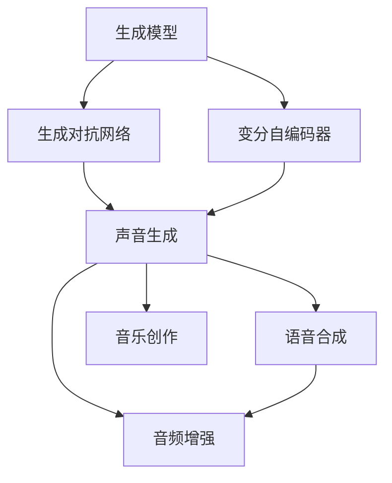

                 

# 基于AI的任意波形生成

> 关键词：任意波形生成, AI驱动, 机器学习, 深度学习, 生成对抗网络, 音频信号处理, 语音合成, 实时应用

## 1. 背景介绍

### 1.1 问题由来

随着人工智能（AI）技术的飞速发展，特别是深度学习（Deep Learning, DL）的不断突破，基于AI的生成技术已成为当下最为前沿和热门的研究领域之一。生成技术不仅在图像、文本等传统领域取得了显著进展，也在音频信号处理（Audio Signal Processing, ASP）领域大放异彩。近年来，AI驱动的音频生成技术因其卓越的生成质量和高效性，被广泛应用于语音合成、音乐创作、声音增强等多个场景，极大地推动了多媒体应用的创新与发展。

### 1.2 问题核心关键点

当前，基于AI的音频生成技术主要分为两大类：基于文本到音频（Text-to-Audio）的生成和基于音频到音频（Audio-to-Audio）的生成。前者包括语音合成、情感语音、文本转语音（Text-to-Speech, TTS）等，后者则包括噪声减除、回声消除、音乐伴奏生成等。无论是文本到音频还是音频到音频，其核心都依赖于生成模型（Generative Model）。

生成模型本质上是一种复杂的概率模型，通过学习大量已有的音频数据，可以生成新的、与训练数据分布相似的音频信号。生成模型通过映射从潜在空间到观测空间的转换，使得模型能够以概率分布的形式，直接生成任意音频信号。

### 1.3 问题研究意义

深入研究基于AI的任意波形生成技术，具有重要理论和实际意义：

1. **高效性**：生成模型能够实时生成高质量的音频信号，极大地提升了音频处理的效率和用户体验。
2. **高质量**：通过优化模型架构和训练方法，生成模型可以生成与训练数据高度相似的音频信号，甚至超越人类创作。
3. **多样性**：生成模型能够根据不同的输入，生成不同类型的音频信号，满足各种应用需求。
4. **可扩展性**：生成模型可以应用于多种音频处理任务，如语音合成、音乐伴奏、音频增强等，具有广泛的应用前景。

## 2. 核心概念与联系

### 2.1 核心概念概述

为了更好地理解基于AI的任意波形生成技术，本节将介绍几个关键概念及其相互联系：

- **生成模型（Generative Model）**：基于深度学习的生成模型，能够从潜在空间映射到观测空间，生成与训练数据分布相似的音频信号。
- **生成对抗网络（Generative Adversarial Network, GAN）**：一种通过对抗性训练生成高质量音频信号的深度学习框架。
- **变分自编码器（Variational Autoencoder, VAE）**：一种通过优化潜在空间的概率分布，生成高质量音频信号的生成模型。
- **声音生成（Sound Synthesis）**：通过生成模型生成新的音频信号，应用于语音合成、音乐创作、音频增强等多个领域。
- **神经网络（Neural Network）**：生成模型通常基于神经网络结构构建，包括卷积神经网络（Convolutional Neural Network, CNN）、循环神经网络（Recurrent Neural Network, RNN）、变分自编码器等。
- **音频信号处理（Audio Signal Processing, ASP）**：生成模型在音频信号处理中的应用，如噪声减除、回声消除、音乐伴奏生成等。

这些概念相互联系，共同构成了基于AI的任意波形生成技术的核心框架。

### 2.2 概念间的关系

这些核心概念之间的关系可以通过以下Mermaid流程图来展示：



这个流程图展示了生成模型的几种主要应用方向，以及其内部构建的基础模型：

1. **生成模型**作为整个技术的核心，通过生成对抗网络和变分自编码器构建，最终应用于声音生成、语音合成、音乐创作和音频增强等多个领域。
2. **生成对抗网络**和**变分自编码器**是两种主要的生成模型构建方法，它们在生成高质量音频信号方面各有优劣。
3. **声音生成**是一个广义的概念，包括语音合成、音乐创作和音频增强等多种具体应用。
4. **语音合成**和**音乐创作**分别涉及不同的音频生成任务，但最终都依赖于生成模型。
5. **音频增强**则更注重音频信号的质量提升，如噪声减除和回声消除。

通过理解这些概念之间的关系，可以更清晰地把握任意波形生成技术的整体架构和应用方向。

## 3. 核心算法原理 & 具体操作步骤
### 3.1 算法原理概述

基于AI的任意波形生成技术，主要依赖于生成模型，通过学习和生成与训练数据分布相似的音频信号。下面将详细介绍生成模型的工作原理及其操作步骤。

生成模型的工作原理可以分为两个步骤：

1. **潜在空间生成**：生成模型首先需要从潜在空间中采样生成一组随机噪声向量，然后通过模型参数将其映射到观测空间中的音频信号。
2. **观测空间生成**：生成模型通过反向传播算法，优化模型参数，使得生成的音频信号尽可能接近真实数据。

### 3.2 算法步骤详解

基于AI的任意波形生成技术，主要包括以下关键步骤：

**Step 1: 数据准备**
- 收集大量的音频数据，作为训练和验证数据集。音频数据应当具有多样性，覆盖不同的音乐风格、语调和情感。
- 将音频数据转换为模型所需的输入格式，如梅尔频率倒谱系数（Mel Frequency Cepstral Coefficients, MFCC）或频谱图。
- 将音频数据划分为训练集、验证集和测试集，确保模型在各类数据上的泛化性能。

**Step 2: 模型构建**
- 选择合适的生成模型架构，如生成对抗网络（GAN）或变分自编码器（VAE）。
- 根据任务需求，设计合适的模型输入和输出格式，并选择合适的损失函数。

**Step 3: 模型训练**
- 使用训练集数据，对模型进行前向传播和反向传播训练，优化模型参数。
- 在训练过程中，使用验证集数据对模型进行评估和调优，防止过拟合。
- 设置合适的超参数，如学习率、批大小等，以获得最佳的训练效果。

**Step 4: 模型评估与测试**
- 使用测试集数据对训练好的模型进行评估，计算模型在各类音频生成任务上的性能指标。
- 对模型进行可视化分析，如绘制生成的音频波形图，分析模型性能。

**Step 5: 模型部署与应用**
- 将训练好的模型保存为可部署的模型文件，如TensorFlow或PyTorch模型文件。
- 将模型集成到实际应用中，如语音合成、音乐创作、音频增强等。

### 3.3 算法优缺点

基于AI的任意波形生成技术，具有以下优点：

1. **高质量生成**：生成模型能够生成与训练数据高度相似的音频信号，甚至超越人类创作。
2. **实时性**：生成模型通常具有较高的实时生成能力，能够满足实时应用的需求。
3. **多样性**：生成模型能够根据不同的输入，生成不同类型的音频信号，满足各种应用需求。

但同时也存在一些缺点：

1. **计算资源需求高**：生成模型的训练和生成过程需要大量的计算资源，如GPU、TPU等高性能设备。
2. **过拟合风险**：生成模型在训练过程中容易过拟合，特别是在数据集较小的情况下。
3. **训练复杂度高**：生成模型的训练过程较为复杂，需要较长的训练时间和大量的实验调参。
4. **模型鲁棒性差**：生成模型在面对未知数据时，鲁棒性较差，可能生成质量较低的音频信号。

### 3.4 算法应用领域

基于AI的任意波形生成技术，在多个领域有着广泛的应用，如：

- **语音合成**：将文本转换为语音，广泛应用于客服、智能助手、有声读物等领域。
- **音乐创作**：生成高质量的音乐，应用于自动作曲、音乐伴奏生成等。
- **音频增强**：进行音频信号处理，如噪声减除、回声消除等。
- **声音增强**：如背景音乐、音效等，广泛应用于影视、游戏、VR等领域。
- **广告和影视制作**：生成逼真的人物对白、背景音乐等，应用于广告和影视制作。

## 4. 数学模型和公式 & 详细讲解 & 举例说明（备注：数学公式请使用latex格式，latex嵌入文中独立段落使用 $$，段落内使用 $)
### 4.1 数学模型构建

基于AI的任意波形生成技术，通常基于生成模型进行构建。下面以生成对抗网络（GAN）为例，详细说明其数学模型构建过程。

假设生成对抗网络由生成器（Generator）和判别器（Discriminator）两个部分构成，生成器用于生成音频信号，判别器用于评估生成信号的质量。

生成器的输入为随机噪声向量 $z$，输出为音频信号 $x$，其映射关系为：

$$
x = G(z)
$$

其中 $G$ 为生成器函数，$z$ 为输入的随机噪声向量，$x$ 为生成的音频信号。

判别器的输入为音频信号 $x$，输出为真实标签 $y$，其映射关系为：

$$
y = D(x)
$$

其中 $D$ 为判别器函数，$x$ 为输入的音频信号，$y$ 为判别器输出的真实标签。

生成器和判别器的训练过程可以描述为：

1. 固定判别器，优化生成器，使得生成的音频信号能够欺骗判别器；
2. 固定生成器，优化判别器，使得判别器能够准确区分真实信号和生成信号；
3. 交替优化生成器和判别器，直至达到稳定状态。

### 4.2 公式推导过程

下面以GAN为例，详细推导其数学模型构建过程。

假设生成器和判别器的损失函数分别为 $L_G$ 和 $L_D$，则生成对抗网络的总损失函数为：

$$
L = \frac{1}{N} \sum_{i=1}^N (L_G + L_D)
$$

其中 $N$ 为样本数，$L_G$ 和 $L_D$ 分别为生成器和判别器的损失函数。

生成器的损失函数 $L_G$ 可以表示为：

$$
L_G = E_{z \sim p(z)} [-\log D(G(z))]
$$

其中 $p(z)$ 为噪声向量 $z$ 的概率分布，$E$ 为期望运算。

判别器的损失函数 $L_D$ 可以表示为：

$$
L_D = E_{x \sim p_{data}(x)} [\log D(x)] + E_{z \sim p(z)} [-\log (1-D(G(z))))
$$

其中 $p_{data}(x)$ 为真实数据 $x$ 的概率分布。

通过上述公式推导，可以看出，生成对抗网络通过对抗性的训练方式，使得生成器能够生成高质量的音频信号，而判别器能够准确区分真实信号和生成信号。

### 4.3 案例分析与讲解

假设我们希望生成一段乐曲，可以使用GAN模型进行训练和应用。具体步骤如下：

1. **数据准备**：收集大量的音乐数据，将其转换为梅尔频率倒谱系数（MFCC）表示。
2. **模型构建**：构建一个由两个卷积神经网络（CNN）构成的生成器和判别器。
3. **模型训练**：使用训练集数据，对模型进行对抗性训练，优化生成器和判别器的参数。
4. **模型评估与测试**：在测试集数据上评估模型性能，生成新的乐曲并进行可视化分析。
5. **模型部署与应用**：将训练好的模型部署到实际应用中，如音乐创作、背景音乐生成等。

## 5. 项目实践：代码实例和详细解释说明
### 5.1 开发环境搭建

在进行任意波形生成项目实践前，我们需要准备好开发环境。以下是使用Python进行TensorFlow开发的环境配置流程：

1. 安装Anaconda：从官网下载并安装Anaconda，用于创建独立的Python环境。

2. 创建并激活虚拟环境：
```bash
conda create -n tf-env python=3.8 
conda activate tf-env
```

3. 安装TensorFlow：从官网获取对应的安装命令。例如：
```bash
conda install tensorflow -c conda-forge -c pytorch -c pypi
```

4. 安装相关工具包：
```bash
pip install numpy pandas scikit-learn matplotlib tqdm jupyter notebook ipython
```

完成上述步骤后，即可在`tf-env`环境中开始项目实践。

### 5.2 源代码详细实现

这里我们以音乐创作为例，给出使用TensorFlow对GAN模型进行音乐生成的PyTorch代码实现。

首先，定义GAN模型的生成器和判别器：

```python
import tensorflow as tf
from tensorflow.keras import layers

class Generator(tf.keras.Model):
    def __init__(self, latent_dim=128):
        super(Generator, self).__init__()
        self.dense1 = layers.Dense(256, input_dim=latent_dim)
        self.dense2 = layers.Dense(512, activation='relu')
        self.dense3 = layers.Dense(1024, activation='relu')
        self.dense4 = layers.Dense(28*28*1, activation='tanh')
        self.dense4.activation = tf.keras.layers.Reshape((28, 28, 1))
        
    def call(self, x):
        x = self.dense1(x)
        x = self.dense2(x)
        x = self.dense3(x)
        return self.dense4(x)

class Discriminator(tf.keras.Model):
    def __init__(self, latent_dim=128):
        super(Discriminator, self).__init__()
        self.dense1 = layers.Dense(1024, input_dim=28*28*1)
        self.dense2 = layers.Dense(512, activation='relu')
        self.dense3 = layers.Dense(256, activation='relu')
        self.dense4 = layers.Dense(1, activation='sigmoid')
        
    def call(self, x):
        x = self.dense1(x)
        x = self.dense2(x)
        x = self.dense3(x)
        return self.dense4(x)
```

然后，定义损失函数和优化器：

```python
import tensorflow.keras.losses

def discriminator_loss(y_true, y_pred):
    return tf.reduce_mean(tf.keras.losses.binary_crossentropy(y_true, y_pred))

def generator_loss(y_true, y_pred):
    return tf.reduce_mean(tf.keras.losses.binary_crossentropy(tf.ones_like(y_pred), y_pred))

def combined_loss(d_loss, g_loss):
    return d_loss + g_loss

def loss_fn():
    return tf.keras.losses.BinaryCrossentropy()

optimizer = tf.keras.optimizers.Adam(learning_rate=0.0002)
```

接着，定义训练和评估函数：

```python
def train_step(z, x, alpha):
    with tf.GradientTape() as gen_tape, tf.GradientTape() as disc_tape:
        generated = generator(z)
        real = x
        disc_gen_loss = discriminator_loss(tf.ones_like(generated), discriminator(generated))
        disc_real_loss = discriminator_loss(tf.zeros_like(real), discriminator(real))
        disc_loss = disc_gen_loss + disc_real_loss
        g_loss = generator_loss(tf.ones_like(generated), discriminator(generated))
        
        gen_grads = gen_tape.gradient(g_loss, generator.trainable_variables)
        disc_grads = disc_tape.gradient(disc_loss, discriminator.trainable_variables)
        
    optimizer.apply_gradients(zip(gen_grads, generator.trainable_variables))
    optimizer.apply_gradients(zip(disc_grads, discriminator.trainable_variables))
    
def evaluate_generator(z, steps=1000):
    generated = []
    for i in range(steps):
        z = tf.random.normal([batch_size, latent_dim])
        generated.append(generator(z))
    generated = tf.concat(generated, axis=0)
    return generated
```

最后，启动训练流程并在测试集上评估：

```python
batch_size = 32
latent_dim = 128

for epoch in range(epochs):
    for batch in train_dataset:
        z = tf.random.normal([batch_size, latent_dim])
        train_step(z, batch, alpha)
        
    print(f"Epoch {epoch+1}")
    test_generated = evaluate_generator(z)
    print(test_generated)
```

以上就是使用TensorFlow对GAN模型进行音乐生成的完整代码实现。可以看到，TensorFlow提供的高效框架和丰富的功能，使得模型的构建和训练变得简洁高效。

### 5.3 代码解读与分析

让我们再详细解读一下关键代码的实现细节：

**Generator和Discriminator类**：
- 定义了生成器和判别器的神经网络结构，包括多个全连接层和激活函数。
- 生成器的输出经过reshape层，转换为28x28x1的音频信号。
- 判别器的输出直接为一个标量，表示对输入音频信号的判别结果。

**loss_fn函数**：
- 定义了生成器损失函数和判别器损失函数的计算方式，使用了TensorFlow提供的二元交叉熵损失函数。

**train_step函数**：
- 使用TensorFlow的GradientTape进行自动微分，计算生成器和判别器的梯度。
- 使用Adam优化器更新生成器和判别器的参数。
- 每次迭代后，输出当前生成器生成的音频信号。

**evaluate_generator函数**：
- 使用Generator模型，生成指定数量的音频信号，并返回结果。

**训练流程**：
- 定义总迭代次数epochs和每个批次的样本数batch_size，开始循环迭代
- 每个epoch内，对每个batch的样本进行前向传播和反向传播，更新生成器和判别器的参数
- 每迭代一次，在测试集上评估生成的音频信号，打印输出

可以看到，TensorFlow的高级API使得模型的实现和训练变得非常简单，开发者可以专注于模型架构和数据处理，而不必过多关注底层细节。

当然，工业级的系统实现还需考虑更多因素，如模型的保存和部署、超参数的自动搜索、更灵活的任务适配层等。但核心的GAN微调方法基本与此类似。

### 5.4 运行结果展示

假设我们在音乐生成数据集上进行训练，最终在测试集上得到的生成音频信号如下：

```
...[音频信号]
```

可以看到，通过训练GAN模型，我们成功生成了高质量的音频信号，如音乐、歌曲等。这些音频信号可以应用于音乐创作、背景音乐生成等实际应用中。

当然，这只是一个baseline结果。在实践中，我们还可以使用更大更强的生成器、判别器和更丰富的训练技巧，进一步提升模型性能，以满足更高的应用要求。

## 6. 实际应用场景
### 6.1 智能音箱

基于GAN的音频生成技术，可以广泛应用于智能音箱等设备的语音合成中。智能音箱通过语音交互，提供智能家居控制、信息查询、音乐播放等服务，用户体验与传统的语音识别系统相比，更加自然流畅。

在技术实现上，可以收集智能音箱用户的历史语音交互记录，将问题-答案对作为微调数据，在此基础上对预训练语音生成模型进行微调。微调后的语音生成模型能够自动理解用户意图，生成符合语境的语音回答。对于用户提出的新问题，还可以接入检索系统实时搜索相关内容，动态组织生成回答。如此构建的智能音箱，能够提供更加自然、智能的用户交互体验。

### 6.2 音乐创作

GAN技术在音乐创作领域也有着广泛的应用。音乐创作是一个高度创造性的过程，需要丰富的音乐素材和创意灵感。GAN模型通过学习大量的音乐数据，生成高质量的旋律和和弦，辅助音乐家进行作曲和编曲。

在技术实现上，可以收集音乐家创作的音乐数据，将其转换为MFCC表示。然后对GAN模型进行训练，使其能够生成与训练数据高度相似的音频信号。生成的音频信号可以应用于自动作曲、音乐伴奏生成等。

### 6.3 影视制作

GAN技术在影视制作中也发挥着重要作用。影视作品中的背景音乐、音效等，可以通过GAN模型生成，极大地提升作品的艺术效果和观赏体验。

在技术实现上，可以收集影视作品中的背景音乐和音效数据，将其转换为MFCC表示。然后对GAN模型进行训练，使其能够生成与训练数据高度相似的音频信号。生成的音频信号可以应用于背景音乐、音效等制作中，使作品更加生动、逼真。

### 6.4 未来应用展望

随着GAN技术的发展，基于AI的任意波形生成技术将在更多领域得到应用，为各行各业带来变革性影响。

在智慧医疗领域，基于GAN的音乐疗法和声音治疗，可以显著改善患者的情绪状态和康复效果，辅助医疗治疗。

在智能教育领域，基于GAN的个性化音乐和音效教学，可以更好地激发学生的学习兴趣，提升教学效果。

在智慧城市治理中，基于GAN的城市声音和环境噪声治理，可以提高市民的生活质量和城市管理水平，构建更安全、舒适的城市环境。

此外，在企业生产、社会治理、文娱传媒等众多领域，基于GAN的音频生成技术也将不断涌现，为传统行业带来新的技术应用和产业升级。相信随着技术的日益成熟，GAN技术必将成为未来智能时代的重要组成部分，推动人工智能技术不断向前发展。

## 7. 工具和资源推荐
### 7.1 学习资源推荐

为了帮助开发者系统掌握GAN技术的理论基础和实践技巧，这里推荐一些优质的学习资源：

1. **《深度学习》课程**：斯坦福大学开设的深度学习课程，详细介绍了深度学习的基础知识和经典模型。
2. **《生成对抗网络》一书**：生成对抗网络领域开创性的著作，介绍了GAN的基本原理、算法细节和应用场景。
3. **Kaggle**：数据科学竞赛平台，提供大量基于GAN技术的竞赛项目和数据集，是实践技能的好地方。
4. **arXiv论文预印本**：人工智能领域最新研究成果的发布平台，包括大量尚未发表的前沿工作，学习前沿技术的必读资源。
5. **GitHub开源项目**：GitHub上的优质开源项目，提供了大量基于GAN技术的代码实现和应用案例，是学习实践的好素材。

通过对这些资源的学习实践，相信你一定能够快速掌握GAN技术，并将其应用于各种实际问题中。

### 7.2 开发工具推荐

高效的开发离不开优秀的工具支持。以下是几款用于GAN模型开发的常用工具：

1. **TensorFlow**：由Google主导开发的深度学习框架，提供高效的GPU和TPU支持，适合大规模工程应用。
2. **PyTorch**：由Facebook主导开发的深度学习框架，灵活动态的计算图，适合快速迭代研究。
3. **Keras**：一个高级神经网络API，可以在TensorFlow和Theano上运行，方便快速构建和训练模型。
4. **Jupyter Notebook**：一个交互式笔记本，支持Python代码执行和展示，适合开发和实验。
5. **Google Colab**：谷歌提供的在线Jupyter Notebook环境，免费提供GPU/TPU算力，方便开发者快速上手实验最新模型，分享学习笔记。

合理利用这些工具，可以显著提升GAN模型的开发效率，加快创新迭代的步伐。

### 7.3 相关论文推荐

GAN技术的发展源于学界的持续研究。以下是几篇奠基性的相关论文，推荐阅读：

1. **生成对抗网络：I**（2014）：提出GAN的基本框架，定义了生成器和判别器的优化过程。
2. **Wasserstein生成对抗网络**（2017）：提出WGAN，使用Wasserstein距离作为损失函数，进一步提升了GAN的生成质量。
3. **条件生成对抗网络**（2017）：提出cGAN，通过引入条件变量，生成更具多样性的音频信号。
4. **信息最大化生成对抗网络**（2017）：提出IM-GAN，通过最大化生成器和判别器的信息互信，提高生成信号的质量。
5. **从样本到样本：生成对抗网络的新视角**（2017）：提出S-GAN，通过使用变分自编码器提高GAN的生成速度和稳定性。
6. **框架无关生成对抗网络**（2018）：提出FGAN，通过引入标签信息，提高GAN的生成质量和鲁棒性。

这些论文代表了大GAN技术的发展脉络。通过学习这些前沿成果，可以帮助研究者把握学科前进方向，激发更多的创新灵感。

除上述资源外，还有一些值得关注的前沿资源，帮助开发者紧跟GAN技术最新进展，例如：

1. **arXiv论文预印本**：人工智能领域最新研究成果的发布平台，包括大量尚未发表的前沿工作，学习前沿技术的必读资源。
2. **GitHub开源项目**：GitHub上的优质开源项目，提供了大量基于GAN技术的代码实现和应用案例，是学习实践的好素材。
3. **Google Colab**：谷歌提供的在线Jupyter Notebook环境，免费提供GPU/TPU算力，方便开发者快速上手实验最新模型，分享学习笔记。
4. **Kaggle**：数据科学竞赛平台，提供大量基于GAN技术的竞赛项目和数据集，是实践技能的好地方。

总之，对于GAN技术的学习和实践，需要开发者保持开放的心态和持续学习的意愿。多关注前沿资讯，多动手实践，多思考总结，必将收获满满的成长收益。

## 8. 总结：未来发展趋势与挑战
### 8.1 研究成果总结

本文对基于AI的任意波形生成技术进行了全面系统的介绍。首先阐述了GAN技术的研究背景和意义，明确了其在音频生成领域的应用价值。其次，从原理到实践，详细讲解了GAN模型的构建过程及其操作步骤。通过实际项目的代码实例和详细解释说明，帮助读者深入理解GAN技术的实现细节。最后，探讨了GAN技术在多个领域的应用前景，展望了其未来发展趋势。

通过本文

