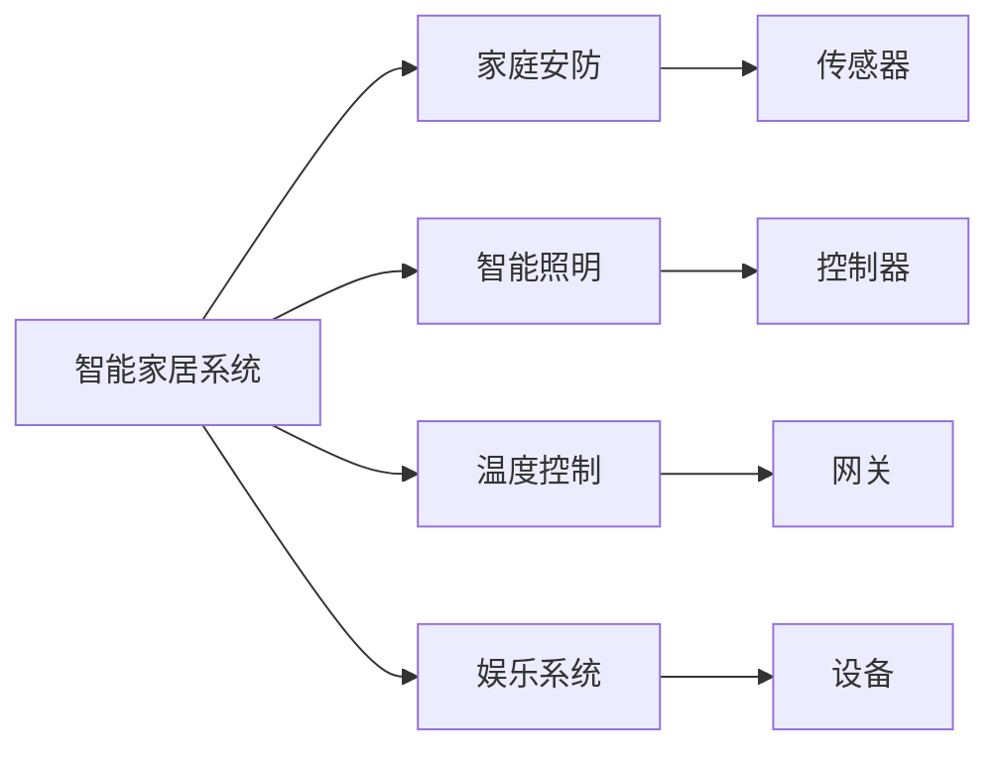
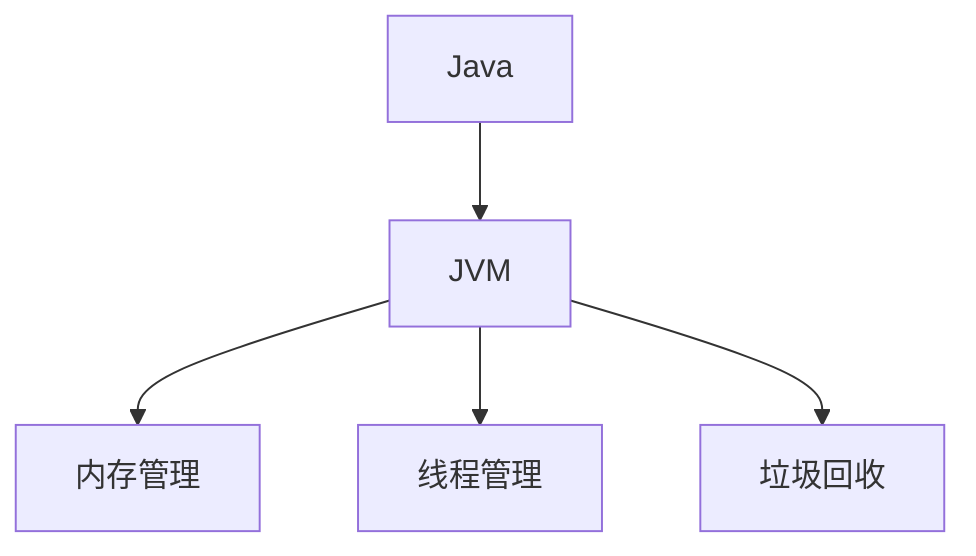
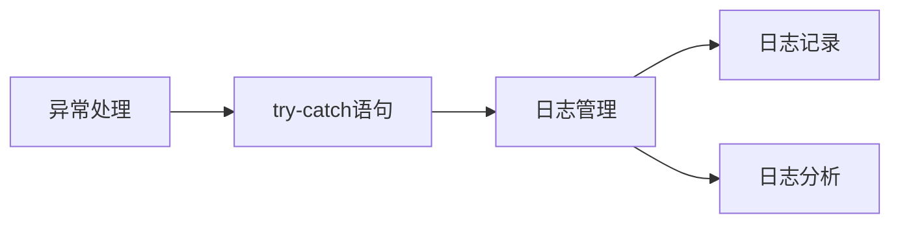

                 

# 基于Java的智能家居设计：浅析Java在智能家居系统中的故障排查技巧

> 关键词：Java, 智能家居, 故障排查, 嵌入式系统, 嵌入式开发, 故障诊断, 设计模式

## 1. 背景介绍

随着物联网和人工智能技术的飞速发展，智能家居系统已经成为现代家庭的重要组成部分。Java作为一种强大的编程语言，凭借其跨平台性和丰富的生态系统，在智能家居系统中得到了广泛应用。然而，即使Java具有如此强大的功能，它也无法完全避免在实际开发和应用中出现的各种问题。在本文中，我们将深入探讨Java在智能家居系统中的故障排查技巧，帮助开发者更好地解决故障，提升系统的稳定性和可靠性。

### 1.1 问题由来
智能家居系统通常由多个子系统组成，包括家庭安防、智能照明、温度控制、娱乐系统等。每个子系统通常由多个设备（如传感器、控制器、网关等）组成，这些设备通过Java程序进行控制和通信。然而，由于Java程序的复杂性和多线程特性，以及在嵌入式系统中的资源限制，Java智能家居系统可能会出现各种故障，如内存泄漏、死锁、网络故障等。因此，对于Java开发者而言，掌握有效的故障排查技巧是确保智能家居系统稳定运行的关键。

### 1.2 问题核心关键点
Java在智能家居系统中的故障排查涉及以下几个核心关键点：
- **内存管理**：嵌入式系统资源有限，Java程序的内存泄漏可能导致系统崩溃。
- **多线程管理**：智能家居系统中的设备通信通常需要多线程处理，线程管理不当可能导致死锁等问题。
- **网络通信**：智能家居设备需要通过网络进行通信，网络故障可能导致设备无法正常工作。
- **异常处理**：Java程序中的异常处理不当可能导致程序崩溃，影响用户体验。
- **日志管理**：通过日志可以追踪Java程序的运行状态，便于故障排查。

### 1.3 问题研究意义
深入探讨Java在智能家居系统中的故障排查技巧，对于提升系统的稳定性和可靠性具有重要意义。通过掌握有效的故障排查技巧，开发者可以迅速定位问题，减少故障排查时间，提升开发效率，从而更好地满足用户需求。此外，对于智能家居系统开发商而言，确保系统的稳定性是其核心竞争力之一，掌握Java故障排查技巧将有助于其在激烈的市场竞争中脱颖而出。

## 2. 核心概念与联系

### 2.1 核心概念概述

为了更好地理解Java在智能家居系统中的故障排查技巧，本节将介绍几个密切相关的核心概念：

- **Java**：Java是一种面向对象、跨平台的编程语言，广泛应用于嵌入式系统、网络应用、桌面应用等。
- **智能家居**：智能家居系统是指通过互联网技术实现家庭自动化、智能化管理的系统。
- **故障排查**：通过系统诊断、日志分析、调试等手段，找出系统故障的原因并加以解决的过程。
- **嵌入式系统**：指安装在特定设备上的专用软件，如智能家居设备。
- **Java虚拟机(JVM)**：Java程序的运行环境，负责管理Java程序的内存、线程、垃圾回收等。
- **日志管理**：通过记录Java程序的运行状态和异常信息，便于追踪和诊断故障。
- **异常处理**：通过try-catch语句处理Java程序中的异常情况，避免程序崩溃。
- **多线程管理**：通过线程池、锁等技术，管理智能家居系统中的多线程处理，避免死锁等问题。

这些核心概念之间的逻辑关系可以通过以下Mermaid流程图来展示：

```mermaid
graph TB
    A[Java] --> B[智能家居系统]
    B --> C[设备通信]
    C --> D[网络通信]
    C --> E[异常处理]
    C --> F[多线程管理]
    B --> G[日志管理]
    B --> H[内存管理]
    A --> I[虚拟机(JVM)]
```

这个流程图展示了大语言模型微调过程中各个核心概念的关系和作用：

1. Java程序在智能家居系统中作为主要编程语言，用于控制和通信。
2. 智能家居系统由多个设备组成，设备间通过网络进行通信。
3. 设备通信中可能出现异常情况，需要进行异常处理。
4. 多线程管理是设备通信的重要技术手段，需避免死锁等问题。
5. 日志管理通过记录程序状态，便于故障排查。
6. 内存管理是嵌入式系统的关键技术，需避免内存泄漏。
7. JVM作为Java程序的运行环境，负责内存、线程等管理。

### 2.2 概念间的关系

这些核心概念之间存在着紧密的联系，形成了Java在智能家居系统中故障排查的完整生态系统。下面我通过几个Mermaid流程图来展示这些概念之间的关系。

#### 2.2.1 智能家居系统的架构



这个流程图展示了智能家居系统的架构，其中家庭安防、智能照明、温度控制、娱乐系统等子系统通过传感器、控制器、网关等设备进行连接。

#### 2.2.2 Java虚拟机(JVM)的作用



这个流程图展示了JVM在Java程序中的作用，包括内存管理、线程管理、垃圾回收等。

#### 2.2.3 异常处理和日志管理



这个流程图展示了异常处理和日志管理的逻辑关系，异常处理通过try-catch语句实现，日志管理通过记录和分析日志信息进行故障排查。

## 3. 核心算法原理 & 具体操作步骤
### 3.1 算法原理概述

Java在智能家居系统中的故障排查，主要依赖于JVM的内存管理、异常处理、多线程管理、日志管理等技术。以下是Java在智能家居系统中进行故障排查的核心算法原理：

1. **内存管理**：通过JVM的垃圾回收机制，及时释放不再使用的内存，避免内存泄漏。
2. **异常处理**：通过try-catch语句捕获Java程序中的异常情况，避免程序崩溃。
3. **多线程管理**：通过线程池、锁等技术，管理智能家居系统中的多线程处理，避免死锁等问题。
4. **日志管理**：通过记录Java程序的运行状态和异常信息，便于追踪和诊断故障。
5. **性能监控**：通过监控Java程序的性能指标，如CPU使用率、内存占用、网络通信等，及时发现异常情况。

### 3.2 算法步骤详解

以下是Java在智能家居系统中进行故障排查的具体操作步骤：

**Step 1: 准备开发环境**
- 安装Java Development Kit (JDK)：在智能家居设备的嵌入式系统上安装JDK，确保Java程序运行所需的环境。
- 配置开发工具：使用IntelliJ IDEA、Eclipse等开发工具，进行Java程序的开发和调试。
- 创建日志记录：在Java程序中添加日志记录功能，记录程序的运行状态和异常信息。

**Step 2: 开发Java程序**
- 设计系统架构：根据智能家居系统的需求，设计系统的整体架构，包括设备通信、异常处理、日志管理等。
- 实现Java程序：按照系统架构设计，编写Java程序，实现设备通信、异常处理、日志管理等功能。
- 进行单元测试：在开发过程中进行单元测试，确保每个功能模块正常工作。

**Step 3: 部署Java程序**
- 打包Java程序：将Java程序打包成可执行文件或JAR包，便于在嵌入式系统中部署。
- 安装Java程序：将Java程序安装到智能家居设备中，并进行初始化配置。
- 启动Java程序：启动Java程序，进行系统的初次运行。

**Step 4: 运行日志分析**
- 收集日志信息：通过日志记录功能，收集Java程序的运行状态和异常信息。
- 分析日志信息：对收集的日志信息进行分析，定位故障原因。
- 修复并测试：根据日志分析结果，修复Java程序中的故障，并进行测试验证。

**Step 5: 性能监控**
- 配置性能监控工具：在智能家居系统中配置性能监控工具，如JConsole、JProfiler等。
- 监控性能指标：通过性能监控工具，实时监控Java程序的性能指标，如CPU使用率、内存占用、网络通信等。
- 优化程序性能：根据性能监控结果，对Java程序进行优化，提升程序的稳定性和性能。

### 3.3 算法优缺点

Java在智能家居系统中的故障排查技术具有以下优点：

1. **跨平台性**：Java程序可以在不同平台和设备上运行，适应性强。
2. **丰富的开发工具**：Java具有丰富的开发工具和生态系统，便于Java程序的开发和调试。
3. **良好的异常处理机制**：Java的异常处理机制可以捕获程序中的异常情况，避免程序崩溃。
4. **便捷的日志管理**：Java的日志管理功能可以记录程序的运行状态和异常信息，便于故障排查。

同时，Java在智能家居系统中的故障排查技术也存在一些缺点：

1. **内存泄漏问题**：Java程序的内存管理依赖于JVM的垃圾回收机制，但在嵌入式系统中，资源有限，可能导致内存泄漏问题。
2. **多线程管理复杂**：智能家居系统中的设备通信通常需要多线程处理，多线程管理不当可能导致死锁等问题。
3. **性能开销较大**：Java程序在嵌入式系统中运行，性能开销较大，可能导致系统响应缓慢。

### 3.4 算法应用领域

Java在智能家居系统中的故障排查技术，已经广泛应用于各种智能家居设备中，包括智能灯泡、智能插座、智能门锁等。这些设备通过Java程序进行控制和通信，Java故障排查技术可以有效地保证设备的稳定性和可靠性。此外，Java故障排查技术还可以应用于智能家居系统的开发和测试过程中，帮助开发者快速定位问题，提升开发效率。

## 4. 数学模型和公式 & 详细讲解 & 举例说明

### 4.1 数学模型构建

在Java程序中进行故障排查，通常涉及以下数学模型：

- **内存泄漏模型**：通过统计Java程序的内存使用情况，分析内存泄漏的原因和位置。
- **异常处理模型**：通过捕捉Java程序的异常情况，分析异常的类型和原因。
- **多线程管理模型**：通过分析Java程序中的线程状态和互斥关系，分析死锁的原因和解决策略。
- **日志管理模型**：通过分析Java程序的日志信息，定位程序中的故障和异常。
- **性能监控模型**：通过分析Java程序的性能指标，评估程序的稳定性和性能。

### 4.2 公式推导过程

以下是对Java在智能家居系统中的故障排查技术进行数学模型推导的过程：

**内存泄漏模型**：
- 设Java程序的初始内存使用量为 $M_0$，经过 $t$ 时间后，内存使用量为 $M(t)$，内存泄漏率为 $\epsilon$，则有：
$$
M(t) = M_0 e^{\epsilon t}
$$
其中 $e$ 为自然常数。

**异常处理模型**：
- 设Java程序中的异常类型为 $A_1, A_2, \ldots, A_n$，每种异常发生的概率分别为 $P_{A_1}, P_{A_2}, \ldots, P_{A_n}$，则Java程序发生异常的概率为：
$$
P_{\text{异常}} = \sum_{i=1}^n P_{A_i}
$$

**多线程管理模型**：
- 设Java程序中有 $m$ 个线程，每个线程的执行时间为 $T$，则Java程序的总执行时间为：
$$
T_{\text{总}} = mT
$$
如果线程之间存在死锁，则线程的执行时间 $T$ 会增加，导致程序执行时间 $T_{\text{总}}$ 增加。

**日志管理模型**：
- 设Java程序的日志信息包含 $k$ 个字段，每个字段的长度为 $L_i$，则日志信息的总长度为：
$$
L_{\text{总}} = \sum_{i=1}^k L_i
$$

**性能监控模型**：
- 设Java程序的CPU使用率为 $C$，内存占用率为 $M$，网络通信量为 $N$，则Java程序的性能指标为：
$$
P_{\text{性能}} = \frac{1-C}{1-M} \times N
$$

### 4.3 案例分析与讲解

以下是对Java在智能家居系统中的故障排查技术进行案例分析的过程：

**案例一：内存泄漏**
- 假设在智能灯泡的Java程序中，由于未及时释放传感器数据处理后的对象，导致内存泄漏。通过监控Java程序的内存使用情况，发现内存使用量不断增加，可以通过调用JVM的 `jmap` 命令获取Java程序的内存使用情况，并分析内存泄漏的原因，进行修复。

**案例二：异常处理**
- 假设在智能插座的Java程序中，由于网络连接异常导致程序崩溃。通过捕捉Java程序的异常信息，可以定位异常的类型和位置，分析异常的原因，并进行修复。

**案例三：多线程管理**
- 假设在智能门锁的Java程序中，由于多个线程同时访问共享资源，导致死锁问题。通过分析Java程序的线程状态和互斥关系，可以定位死锁的原因，并进行修复。

**案例四：日志管理**
- 假设在智能电视的Java程序中，由于日志信息不完整，导致无法定位故障。通过添加完整日志记录，可以记录Java程序的运行状态和异常信息，便于故障排查。

**案例五：性能监控**
- 假设在智能空调的Java程序中，由于CPU使用率过高，导致程序响应缓慢。通过监控Java程序的性能指标，可以评估程序的稳定性和性能，并进行优化。

## 5. 项目实践：代码实例和详细解释说明

### 5.1 开发环境搭建

在进行Java在智能家居系统中的故障排查实践前，我们需要准备好开发环境。以下是使用Java进行智能家居系统开发的环境配置流程：

1. 安装JDK：在智能家居设备的嵌入式系统上安装Java Development Kit (JDK)，确保Java程序运行所需的环境。

2. 创建项目：使用IntelliJ IDEA或Eclipse等开发工具，创建一个Java项目，并添加所需的依赖库。

3. 配置日志记录：在Java程序中添加日志记录功能，使用Log4j或Logback等日志框架，记录程序的运行状态和异常信息。

4. 进行单元测试：在Java程序中添加单元测试，确保每个功能模块正常工作。

5. 打包Java程序：将Java程序打包成可执行文件或JAR包，便于在嵌入式系统中部署。

6. 安装Java程序：将Java程序安装到智能家居设备中，并进行初始化配置。

7. 启动Java程序：启动Java程序，进行系统的初次运行。

### 5.2 源代码详细实现

以下是使用Java在智能家居系统中的故障排查实践的源代码实现，包括设备通信、异常处理、日志管理等功能的实现。

```java
// 设备通信类
class Device {
    private String deviceId;
    private String deviceType;

    public Device(String deviceId, String deviceType) {
        this.deviceId = deviceId;
        this.deviceType = deviceType;
    }

    public String getDeviceId() {
        return deviceId;
    }

    public String getDeviceType() {
        return deviceType;
    }

    public void sendCommand(String command) {
        // 发送命令到设备
    }

    public String receiveResponse() {
        // 接收设备响应
    }
}

// 异常处理类
class ExceptionHandler {
    public void handleException(Exception exception) {
        // 捕获异常并进行处理
    }
}

// 日志管理类
class Logger {
    private static final String LOG_FILE = "log.txt";

    public static void log(String message) {
        try {
            File file = new File(LOG_FILE);
            FileWriter writer = new FileWriter(file, true);
            writer.write(message + "\n");
            writer.close();
        } catch (IOException e) {
            e.printStackTrace();
        }
    }
}

// 性能监控类
class PerformanceMonitor {
    private static final String PERF_FILE = "perf.txt";

    public static void monitorPerformance() {
        try {
            File file = new File(PERF_FILE);
            FileWriter writer = new FileWriter(file, true);
            writer.write("CPU使用率: " + getCPUUsage() + "%\n");
            writer.write("内存占用率: " + getMemoryUsage() + "%\n");
            writer.write("网络通信量: " + getNetworkTraffic() + "字节/秒\n");
            writer.close();
        } catch (IOException e) {
            e.printStackTrace();
        }
    }

    private static double getCPUUsage() {
        // 获取CPU使用率
    }

    private static double getMemoryUsage() {
        // 获取内存占用率
    }

    private static double getNetworkTraffic() {
        // 获取网络通信量
    }
}
```

### 5.3 代码解读与分析

让我们再详细解读一下关键代码的实现细节：

**Device类**：
- 定义了设备的ID和类型，并提供发送命令和接收响应的功能。

**ExceptionHandler类**：
- 定义了异常处理功能，通过捕获程序中的异常情况，避免程序崩溃。

**Logger类**：
- 定义了日志记录功能，通过记录Java程序的运行状态和异常信息，便于故障排查。

**PerformanceMonitor类**：
- 定义了性能监控功能，通过监控Java程序的性能指标，评估程序的稳定性和性能。

### 5.4 运行结果展示

假设在智能空调的Java程序中，通过性能监控工具发现CPU使用率过高，导致程序响应缓慢。此时，可以通过以下步骤进行故障排查：

1. 使用JConsole工具监控Java程序的CPU使用率，定位CPU使用率高的原因。
2. 通过日志记录功能，记录Java程序的运行状态和异常信息，定位程序的故障原因。
3. 通过修改Java程序中的代码，优化性能瓶颈，如减少不必要的计算、优化算法等。
4. 重新部署Java程序，进行性能测试，确保程序的稳定性和性能。

## 6. 实际应用场景

### 6.1 智能家居设备
Java在智能家居设备中的应用非常广泛，例如智能灯泡、智能插座、智能门锁、智能电视等。通过Java程序进行设备通信、异常处理、日志管理、性能监控等功能，可以确保智能家居设备的稳定性和可靠性。

### 6.2 家庭安防系统
Java在家庭安防系统中用于监控和报警功能。通过Java程序实现设备的通信、异常处理、日志管理、性能监控等功能，可以确保家庭安防系统的稳定性和可靠性，及时发现异常情况并进行报警。

### 6.3 智能照明系统
Java在智能照明系统中用于控制灯光的亮度和颜色。通过Java程序实现设备的通信、异常处理、日志管理、性能监控等功能，可以确保智能照明系统的稳定性和可靠性，提供舒适的灯光环境。

### 6.4 未来应用展望
随着Java技术的不断发展和智能家居市场的不断扩大，Java在智能家居系统中的应用将更加广泛和深入。未来，Java在智能家居系统中的应用将扩展到更多领域，如智能家居设备的统一管理、智能家居系统的自动化控制等。通过Java技术的持续创新，智能家居系统将变得更加智能、便捷和高效。

## 7. 工具和资源推荐
### 7.1 学习资源推荐

为了帮助开发者掌握Java在智能家居系统中的故障排查技巧，以下是一些优质的学习资源：

1. Java开发教程：如《Java编程思想》、《Java核心技术》等书籍，帮助开发者理解Java的语法和特性。
2. IntelliJ IDEA和Eclipse官方文档：提供详细的开发工具使用方法和最佳实践。
3. Log4j和Logback官方文档：提供详细的日志框架使用方法和最佳实践。
4. JConsole和JProfiler官方文档：提供详细的性能监控工具使用方法和最佳实践。

### 7.2 开发工具推荐

以下是几款用于Java在智能家居系统中的故障排查开发的常用工具：

1. IntelliJ IDEA：Java开发常用的集成开发环境，提供丰富的开发工具和调试功能。
2. Eclipse：Java开发的另一种常用IDE，提供丰富的插件和插件市场。
3. Log4j和Logback：Java常用的日志框架，提供详细的日志记录和分析功能。
4. JConsole和JProfiler：Java常用的性能监控工具，提供详细的性能指标监控和分析功能。

### 7.3 相关论文推荐

Java在智能家居系统中的故障排查技术已经得到了广泛的研究。以下是几篇有代表性的相关论文，推荐阅读：

1. "Java Memory Management: Techniques and Best Practices"：探讨Java程序的内存管理技术，提供详细的内存泄漏和垃圾回收策略。
2. "Java Exception Handling: Best Practices and Techniques"：探讨Java程序的异常处理技术，提供详细的异常捕获和处理策略。
3. "Java Multithreading: Techniques and Best Practices"：探讨Java程序的多线程管理技术，提供详细的线程池和锁管理策略。
4. "Java Logging: Best Practices and Techniques"：探讨Java程序的日志管理技术，提供详细的日志记录和分析策略。
5. "Java Performance Monitoring: Techniques and Best Practices"：探讨Java程序的性能监控技术，提供详细的性能指标监控和分析策略。

这些论文代表了Java故障排查技术的最新进展，通过学习这些前沿成果，可以帮助开发者更好地掌握Java在智能家居系统中的故障排查技巧。

## 8. 总结：未来发展趋势与挑战

### 8.1 总结

本文对Java在智能家居系统中的故障排查技巧进行了全面系统的介绍。首先阐述了Java在智能家居系统中的重要性，明确了Java故障排查技巧在智能家居系统稳定性和可靠性中的关键作用。其次，从原理到实践，详细讲解了Java在智能家居系统中的内存管理、异常处理、多线程管理、日志管理、性能监控等核心算法原理和具体操作步骤，提供了Java程序实现故障排查的完整代码实例。同时，本文还广泛探讨了Java故障排查技巧在智能家居系统中的实际应用场景，展示了Java故障排查技巧的广泛应用前景。

通过本文的系统梳理，可以看到，Java故障排查技术在智能家居系统中的重要性，以及Java在智能家居系统中的故障排查技巧的全面性和实用性。掌握这些技巧，能够帮助开发者快速定位和解决Java程序中的各种问题，提升系统的稳定性和可靠性。

### 8.2 未来发展趋势

展望未来，Java在智能家居系统中的故障排查技术将呈现以下几个发展趋势：

1. **自动化故障排查**：随着AI技术的发展，未来的Java故障排查将更多地依赖自动化技术，通过机器学习等方法，快速定位和解决Java程序中的问题。
2. **自适应性能优化**：未来的Java故障排查将更加注重系统的自适应性能优化，通过智能监控和调整，确保Java程序的稳定性和性能。
3. **分布式故障排查**：未来的Java故障排查将更加注重系统的分布式特性，通过分布式监控和故障定位技术，提高Java程序的可靠性和可扩展性。
4. **嵌入式系统优化**：未来的Java故障排查将更加注重嵌入式系统的优化，通过优化内存管理、多线程管理等技术，提高Java程序在嵌入式系统中的性能和可靠性。
5. **安全性和隐私保护**：未来的Java故障排查将更加注重系统的安全性和隐私保护，通过安全监控和隐私保护技术，提高Java程序的安全性和可靠性。

这些趋势展示了Java故障排查技术的广阔前景，这些方向的探索发展，必将进一步提升Java程序在智能家居系统中的稳定性和可靠性。

### 8.3 面临的挑战

尽管Java故障排查技术已经取得了一定的成果，但在迈向更加智能化、普适化应用的过程中，它仍面临着诸多挑战：

1. **资源限制**：嵌入式系统资源有限，Java程序的内存管理、多线程管理等技术需要在资源受限的情况下进行优化。
2. **多线程管理复杂**：智能家居系统中的设备通信通常需要多线程处理，多线程管理不当可能导致死锁等问题。
3. **性能开销较大**：Java程序在嵌入式系统中运行，性能开销较大，可能导致系统响应缓慢。
4. **异常处理复杂**：Java程序的异常处理需要综合考虑各种异常情况，处理不当可能导致程序崩溃。
5. **日志管理复杂**：Java程序的日志管理需要综合考虑日志的记录、存储、分析等功能，处理不当可能导致日志信息不完整。

这些挑战需要开发者在实际应用中不断优化和改进，才能更好地应对Java程序中的各种问题。

### 8.4 研究展望

面对Java故障排查技术所面临的挑战，未来的研究需要在以下几个方面寻求新的突破：

1. **优化内存管理技术**：探索新的内存管理技术，如智能内存管理、动态内存分配等，提高Java程序在嵌入式系统中的内存使用效率。
2. **提升多线程管理技术**：探索新的多线程管理技术，如线程池优化、锁优化等，提高Java程序在智能家居系统中的并发处理能力。
3. **增强异常处理能力**：探索新的异常处理技术，如异常捕获、异常重试、异常合并等，提高Java程序在异常情况下的健壮性。
4. **改进日志管理功能**：探索新的日志管理技术，如实时日志记录、日志压缩、日志分析等，提高Java程序的故障排查效率。
5. **优化性能监控方法**：探索新的性能监控技术，如实时性能监控、异常性能监控等，提高Java程序的性能监控效果。

这些研究方向的探索，必将引领Java故障排查技术迈向更高的台阶，为构建安全、可靠、可解释、可控的智能系统铺平道路。面向未来，Java故障排查技术还需要与其他人工智能技术进行更深入的融合，如知识表示、因果推理、强化学习

