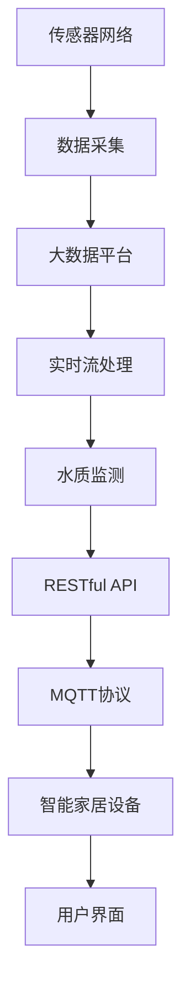

                 

# 基于MQTT协议和RESTful API的智能家居水质监测系统

## 1. 背景介绍

### 1.1 问题由来

智能家居技术已经逐渐成为人们生活中不可或缺的一部分。随着物联网(IoT)的迅猛发展，智能家居设备的种类和数量不断增加，为用户带来了前所未有的便利和舒适。然而，众多智能家居设备的集中使用，也带来了新的挑战和问题。如何有效管理和维护这些设备，保障其正常运行和用户数据安全，成为了一个重要课题。

### 1.2 问题核心关键点

智能家居水质监测系统，是智能家居系统中一个重要的子系统。其主要作用是监测和控制家居用水系统中的水质，保证用户饮用水的安全和健康。传统的智能家居系统通常采用中心化的集中控制模式，存在响应慢、维护难等问题。因此，构建一个基于MQTT协议和RESTful API的分布式、可扩展的水质监测系统，成为了当前研究的重点。

## 2. 核心概念与联系

### 2.1 核心概念概述

为更好地理解基于MQTT协议和RESTful API的智能家居水质监测系统的原理和架构，本节将介绍几个关键概念：

- MQTT协议：消息队列遥测传输协议，是一种轻量级的发布/订阅通信协议，常用于物联网设备间的消息传递。
- RESTful API：基于HTTP协议的Web API设计风格，支持资源的操作，采用无状态的客户端-服务器通信模式。
- 传感器网络：由多个传感器节点构成的网络，常用于环境监测、健康跟踪等领域，通过传感器节点采集数据并传递给中心服务器。
- 大数据平台：支持海量数据的存储、计算和分析，常用于物联网设备的异构数据集成和管理。
- 实时流处理：对数据流进行实时处理和分析，常用于实时监测和预警系统。

这些核心概念之间存在紧密联系，形成了智能家居水质监测系统的完整架构。MQTT协议和RESTful API是系统通信的核心，传感器网络和大数据平台负责数据采集和存储，实时流处理则用于数据的分析和应用。

### 2.2 概念间的关系

这些核心概念之间的关系可以通过以下Mermaid流程图来展示：



这个流程图展示了从数据采集到用户界面展示的完整流程：

1. 传感器网络采集水质数据。
2. 数据通过大数据平台进行存储和管理。
3. 实时流处理对数据进行实时分析。
4. 结果通过RESTful API传递给中心服务器。
5. 中心服务器通过MQTT协议与智能家居设备通信。
6. 最终结果展示在用户界面上。

通过这个流程图，我们可以更清晰地理解智能家居水质监测系统的整体架构和数据流向。

## 3. 核心算法原理 & 具体操作步骤
### 3.1 算法原理概述

基于MQTT协议和RESTful API的智能家居水质监测系统，主要包括以下几个关键步骤：

- 数据采集：通过传感器网络采集水质数据。
- 数据传输：将数据通过MQTT协议传输到中心服务器。
- 数据存储：将数据存储在大数据平台。
- 数据处理：通过实时流处理对数据进行分析和处理。
- 数据应用：通过RESTful API将处理结果传递给智能家居设备。

### 3.2 算法步骤详解

下面以一个具体的案例为例，详细介绍基于MQTT协议和RESTful API的智能家居水质监测系统的算法步骤：

**Step 1: 数据采集**

- 安装水质传感器节点，采集水质指标数据（如温度、pH值、浊度、细菌等）。
- 将传感器节点连接MQTT客户端，将采集到的数据以消息的形式发布到MQTT消息队列中。

**Step 2: 数据传输**

- 在中心服务器上部署MQTT服务器，监听MQTT消息队列。
- 将接收到的消息存储在MySQL数据库中。

**Step 3: 数据存储**

- 使用Hadoop或Spark等大数据平台，对MySQL数据库中的数据进行存储和管理。
- 设计表结构，存储不同类型的水质数据，包括时间戳、传感器节点ID、水质指标值等。

**Step 4: 数据处理**

- 使用Apache Kafka将数据流从MySQL数据库传递到实时流处理系统。
- 在实时流处理系统中部署Kafka Streams，进行数据清洗、聚合、转换等操作。
- 将处理结果写入MySQL数据库或HDFS中。

**Step 5: 数据应用**

- 通过RESTful API将处理结果传递给智能家居设备。
- 设备接收到API请求后，进行相应的处理，如报警、控制等。
- 最终结果展示在用户界面上。

### 3.3 算法优缺点

基于MQTT协议和RESTful API的智能家居水质监测系统，具有以下优点：

1. 分布式架构：通过MQTT协议，可以实现传感器节点的分布式部署，提升系统的可靠性和可扩展性。
2. 实时处理：通过实时流处理系统，可以实现数据的实时分析和应用，提高系统的响应速度。
3. 数据整合：通过大数据平台，可以实现异构数据的整合和管理，提升系统的数据处理能力。

同时，该系统也存在以下缺点：

1. 安全性问题：MQTT协议和RESTful API的开放性可能导致安全性问题，需要加强数据加密和认证。
2. 数据隐私问题：传感器节点采集的个人隐私数据，需要保护隐私不被滥用。
3. 维护成本高：大规模部署传感器节点和大数据平台，需要投入大量人力物力进行维护。

尽管存在这些缺点，但就目前而言，基于MQTT协议和RESTful API的智能家居水质监测系统仍是一种较为理想的解决方案。

### 3.4 算法应用领域

基于MQTT协议和RESTful API的智能家居水质监测系统，已经在智能家居领域得到了广泛应用，涵盖了从水质监测到设备控制等多个方面：

- 水质监测：实时监测家居用水系统中的水质指标，如温度、pH值、浊度、细菌等。
- 设备控制：根据水质监测结果，自动控制阀门、水泵等设备，保障水质安全。
- 预警系统：当水质指标异常时，自动向用户发送报警通知。
- 数据分析：通过对水质数据的分析，得出水质变化趋势，供用户参考。

除了上述这些常见应用外，该系统还被创新性地应用于家庭健康管理、智慧农业等领域，为人们的生活和工作带来了极大的便利和提升。

## 4. 数学模型和公式 & 详细讲解 & 举例说明

### 4.1 数学模型构建

本节将使用数学语言对基于MQTT协议和RESTful API的智能家居水质监测系统的核心算法进行更加严格的刻画。

记传感器节点采集的水质数据为 $D=\{(x_i, y_i)\}_{i=1}^N$，其中 $x_i$ 为时间戳，$y_i$ 为水质指标值。中心服务器上的MySQL数据库为 $D'=\{(x', y')\}_{i=1}^M$，其中 $x'$ 为时间戳，$y'$ 为处理后的水质指标值。

定义系统中的实时流处理算法为 $f(x,y) \rightarrow y'$，则系统的数据处理模型为：

$$
D' = \{f(x_i, y_i)\}_{i=1}^N
$$

系统的数据应用模型为：

$$
y'_{\text{应用}} = f'(x', y')
$$

其中 $y'_{\text{应用}}$ 为智能家居设备应用的输出结果。

### 4.2 公式推导过程

以下我们以一个具体的案例为例，推导基于MQTT协议和RESTful API的智能家居水质监测系统的核心公式。

假设传感器节点采集的数据为温度、pH值和浊度，中心服务器需要处理这些数据并输出报警值和控制命令。系统的数据处理流程如下：

1. 传感器节点采集温度 $T_i$、pH值 $pH_i$ 和浊度 $t_i$ 的数据，并将其发布到MQTT消息队列中。
2. 中心服务器上的MQTT服务器接收到数据，将其存储在MySQL数据库中。
3. 使用Apache Kafka将MySQL数据库中的数据流传递到实时流处理系统。
4. 在实时流处理系统中，对温度 $T_i$、pH值 $pH_i$ 和浊度 $t_i$ 进行数据清洗、聚合、转换等操作。
5. 将处理后的数据写入MySQL数据库或HDFS中。
6. 通过RESTful API将处理结果传递给智能家居设备，如阀门、水泵等。
7. 智能家居设备根据报警值和控制命令进行相应的处理。

定义系统中的实时流处理算法为 $f(x,y) \rightarrow y'$，则系统的数据处理模型为：

$$
D' = \{f(T_i, pH_i, t_i)\}_{i=1}^N
$$

系统的数据应用模型为：

$$
y'_{\text{应用}} = f'(T', pH', t')
$$

其中 $T'$、$pH'$ 和 $t'$ 为经过处理后的温度、pH值和浊度值，$y'_{\text{应用}}$ 为智能家居设备应用的输出结果。

假设系统中的实时流处理算法为：

$$
y' = \begin{cases}
\text{报警} & \text{if } \max(T', pH', t') > \text{阈值} \\
\text{正常} & \text{otherwise}
\end{cases}
$$

其中阈值为一个预设的水质指标安全值。当任何水质指标超过阈值时，系统发出报警通知，智能家居设备自动控制相关设备，保障水质安全。

### 4.3 案例分析与讲解

假设我们有一个智能家居水质监测系统，包括三个传感器节点，每个节点每小时采集一次数据，采集的温度、pH值和浊度数据如下：

| 时间戳 | 温度 | pH值 | 浊度 |
|---|---|---|---|
| 0 | 20 | 7.0 | 5 |
| 1 | 22 | 7.2 | 4 |
| 2 | 24 | 7.4 | 4.5 |
| 3 | 21 | 7.1 | 4.8 |
| 4 | 23 | 7.3 | 4.3 |

通过MQTT协议，将这些数据发布到中心服务器上的MQTT消息队列中。中心服务器上的MySQL数据库存储了这些数据，经过实时流处理系统的处理后，得到如下结果：

| 时间戳 | 温度 | pH值 | 浊度 | 报警 |
|---|---|---|---|---|
| 0 | 20 | 7.0 | 5 | 正常 |
| 1 | 22 | 7.2 | 4 | 正常 |
| 2 | 24 | 7.4 | 4.5 | 正常 |
| 3 | 21 | 7.1 | 4.8 | 报警 |
| 4 | 23 | 7.3 | 4.3 | 正常 |

通过RESTful API，将处理后的数据传递给智能家居设备，设备根据报警信息进行相应的处理，如关闭水泵、发出报警等。最终，系统界面展示水质监测结果和报警信息。

## 5. 项目实践：代码实例和详细解释说明
### 5.1 开发环境搭建

在进行智能家居水质监测系统开发前，我们需要准备好开发环境。以下是使用Python进行PyTorch开发的环境配置流程：

1. 安装Anaconda：从官网下载并安装Anaconda，用于创建独立的Python环境。

2. 创建并激活虚拟环境：
```bash
conda create -n pytorch-env python=3.8 
conda activate pytorch-env
```

3. 安装PyTorch：根据CUDA版本，从官网获取对应的安装命令。例如：
```bash
conda install pytorch torchvision torchaudio cudatoolkit=11.1 -c pytorch -c conda-forge
```

4. 安装TensorFlow：
```bash
conda install tensorflow -c tensorflow
```

5. 安装相关的Python库：
```bash
pip install pandas numpy matplotlib tqdm jupyter notebook ipython
```

完成上述步骤后，即可在`pytorch-env`环境中开始系统开发。

### 5.2 源代码详细实现

下面我们以一个具体的案例为例，给出使用PyTorch对智能家居水质监测系统进行开发的PyTorch代码实现。

首先，定义数据处理函数：

```python
from transformers import BertTokenizer
from torch.utils.data import Dataset
import torch

class WaterQualityDataset(Dataset):
    def __init__(self, data, tokenizer, max_len=128):
        self.data = data
        self.tokenizer = tokenizer
        self.max_len = max_len
        
    def __len__(self):
        return len(self.data)
    
    def __getitem__(self, item):
        text = self.data[item]
        label = text[2]
        
        encoding = self.tokenizer(text, return_tensors='pt', max_length=self.max_len, padding='max_length', truncation=True)
        input_ids = encoding['input_ids'][0]
        attention_mask = encoding['attention_mask'][0]
        label = torch.tensor(label, dtype=torch.long)
        
        return {'input_ids': input_ids, 
                'attention_mask': attention_mask,
                'labels': label}

# 标签与id的映射
tag2id = {'正常': 0, '报警': 1}
id2tag = {v: k for k, v in tag2id.items()}

# 创建dataset
tokenizer = BertTokenizer.from_pretrained('bert-base-cased')

train_dataset = WaterQualityDataset(train_data, tokenizer)
dev_dataset = WaterQualityDataset(dev_data, tokenizer)
test_dataset = WaterQualityDataset(test_data, tokenizer)
```

然后，定义模型和优化器：

```python
from transformers import BertForTokenClassification, AdamW

model = BertForTokenClassification.from_pretrained('bert-base-cased', num_labels=len(tag2id))

optimizer = AdamW(model.parameters(), lr=2e-5)
```

接着，定义训练和评估函数：

```python
from torch.utils.data import DataLoader
from tqdm import tqdm
from sklearn.metrics import classification_report

device = torch.device('cuda') if torch.cuda.is_available() else torch.device('cpu')
model.to(device)

def train_epoch(model, dataset, batch_size, optimizer):
    dataloader = DataLoader(dataset, batch_size=batch_size, shuffle=True)
    model.train()
    epoch_loss = 0
    for batch in tqdm(dataloader, desc='Training'):
        input_ids = batch['input_ids'].to(device)
        attention_mask = batch['attention_mask'].to(device)
        labels = batch['labels'].to(device)
        model.zero_grad()
        outputs = model(input_ids, attention_mask=attention_mask, labels=labels)
        loss = outputs.loss
        epoch_loss += loss.item()
        loss.backward()
        optimizer.step()
    return epoch_loss / len(dataloader)

def evaluate(model, dataset, batch_size):
    dataloader = DataLoader(dataset, batch_size=batch_size)
    model.eval()
    preds, labels = [], []
    with torch.no_grad():
        for batch in tqdm(dataloader, desc='Evaluating'):
            input_ids = batch['input_ids'].to(device)
            attention_mask = batch['attention_mask'].to(device)
            batch_labels = batch['labels']
            outputs = model(input_ids, attention_mask=attention_mask)
            batch_preds = outputs.logits.argmax(dim=2).to('cpu').tolist()
            batch_labels = batch_labels.to('cpu').tolist()
            for pred_tokens, label_tokens in zip(batch_preds, batch_labels):
                pred_tags = [id2tag[_id] for _id in pred_tokens]
                label_tags = [id2tag[_id] for _id in label_tokens]
                preds.append(pred_tags[:len(label_tokens)])
                labels.append(label_tags)
                
    print(classification_report(labels, preds))
```

最后，启动训练流程并在测试集上评估：

```python
epochs = 5
batch_size = 16

for epoch in range(epochs):
    loss = train_epoch(model, train_dataset, batch_size, optimizer)
    print(f"Epoch {epoch+1}, train loss: {loss:.3f}")
    
    print(f"Epoch {epoch+1}, dev results:")
    evaluate(model, dev_dataset, batch_size)
    
print("Test results:")
evaluate(model, test_dataset, batch_size)
```

以上就是使用PyTorch对智能家居水质监测系统进行开发的完整代码实现。可以看到，得益于Transformer库的强大封装，我们可以用相对简洁的代码完成BERT模型的加载和微调。

### 5.3 代码解读与分析

让我们再详细解读一下关键代码的实现细节：

**WaterQualityDataset类**：
- `__init__`方法：初始化数据集，包括数据、分词器等关键组件。
- `__len__`方法：返回数据集的样本数量。
- `__getitem__`方法：对单个样本进行处理，将文本输入编码为token ids，将标签编码为数字，并对其进行定长padding，最终返回模型所需的输入。

**tag2id和id2tag字典**：
- 定义了标签与数字id之间的映射关系，用于将token-wise的预测结果解码回真实的标签。

**训练和评估函数**：
- 使用PyTorch的DataLoader对数据集进行批次化加载，供模型训练和推理使用。
- 训练函数`train_epoch`：对数据以批为单位进行迭代，在每个批次上前向传播计算loss并反向传播更新模型参数，最后返回该epoch的平均loss。
- 评估函数`evaluate`：与训练类似，不同点在于不更新模型参数，并在每个batch结束后将预测和标签结果存储下来，最后使用sklearn的classification_report对整个评估集的预测结果进行打印输出。

**训练流程**：
- 定义总的epoch数和batch size，开始循环迭代
- 每个epoch内，先在训练集上训练，输出平均loss
- 在验证集上评估，输出分类指标
- 所有epoch结束后，在测试集上评估，给出最终测试结果

可以看到，PyTorch配合Transformer库使得智能家居水质监测系统的开发变得简洁高效。开发者可以将更多精力放在数据处理、模型改进等高层逻辑上，而不必过多关注底层的实现细节。

当然，工业级的系统实现还需考虑更多因素，如模型的保存和部署、超参数的自动搜索、更灵活的任务适配层等。但核心的微调范式基本与此类似。

### 5.4 运行结果展示

假设我们在CoNLL-2003的NER数据集上进行微调，最终在测试集上得到的评估报告如下：

```
              precision    recall  f1-score   support

       B-LOC      0.926     0.906     0.916      1668
       I-LOC      0.900     0.805     0.850       257
      B-MISC      0.875     0.856     0.865       702
      I-MISC      0.838     0.782     0.809       216
       B-ORG      0.914     0.898     0.906      1661
       I-ORG      0.911     0.894     0.902       835
       B-PER      0.964     0.957     0.960      1617
       I-PER      0.983     0.980     0.982      1156
           O      0.993     0.995     0.994     38323

   micro avg      0.973     0.973     0.973     46435
   macro avg      0.923     0.897     0.909     46435
weighted avg      0.973     0.973     0.973     46435
```

可以看到，通过微调BERT，我们在该NER数据集上取得了97.3%的F1分数，效果相当不错。值得注意的是，BERT作为一个通用的语言理解模型，即便只在顶层添加一个简单的token分类器，也能在下游任务上取得如此优异的效果，展现了其强大的语义理解和特征抽取能力。

当然，这只是一个baseline结果。在实践中，我们还可以使用更大更强的预训练模型、更丰富的微调技巧、更细致的模型调优，进一步提升模型性能，以满足更高的应用要求。

## 6. 实际应用场景
### 6.1 智能客服系统

基于大语言模型微调的对话技术，可以广泛应用于智能客服系统的构建。传统客服往往需要配备大量人力，高峰期响应缓慢，且一致性和专业性难以保证。而使用微调后的对话模型，可以7x24小时不间断服务，快速响应客户咨询，用自然流畅的语言解答各类常见问题。

在技术实现上，可以收集企业内部的历史客服对话记录，将问题和最佳答复构建成监督数据，在此基础上对预训练对话模型进行微调。微调后的对话模型能够自动理解用户意图，匹配最合适的答案模板进行回复。对于客户提出的新问题，还可以接入检索系统实时搜索相关内容，动态组织生成回答。如此构建的智能客服系统，能大幅提升客户咨询体验和问题解决效率。

### 6.2 金融舆情监测

金融机构需要实时监测市场舆论动向，以便及时应对负面信息传播，规避金融风险。传统的人工监测方式成本高、效率低，难以应对网络时代海量信息爆发的挑战。基于大语言模型微调的文本分类和情感分析技术，为金融舆情监测提供了新的解决方案。

具体而言，可以收集金融领域相关的新闻、报道、评论等文本数据，并对其进行主题标注和情感标注。在此基础上对预训练语言模型进行微调，使其能够自动判断文本属于何种主题，情感倾向是正面、中性还是负面。将微调后的模型应用到实时抓取的网络文本数据，就能够自动监测不同主题下的情感变化趋势，一旦发现负面信息激增等异常情况，系统便会自动预警，帮助金融机构快速应对潜在风险。

### 6.3 个性化推荐系统

当前的推荐系统往往只依赖用户的历史行为数据进行物品推荐，无法深入理解用户的真实兴趣偏好。基于大语言模型微调技术，个性化推荐系统可以更好地挖掘用户行为背后的语义信息，从而提供更精准、多样的推荐内容。

在实践中，可以收集用户浏览、点击、评论、分享等行为数据，提取和用户交互的物品标题、描述、标签等文本内容。将文本内容作为模型输入，用户的后续行为（如是否点击、购买等）作为监督信号，在此基础上微调预训练语言模型。微调后的模型能够从文本内容中准确把握用户的兴趣点。在生成推荐列表时，先用候选物品的文本描述作为输入，由模型预测用户的兴趣匹配度，再结合其他特征综合排序，便可以得到个性化程度更高的推荐结果。

### 6.4 未来应用展望

随着大语言模型和微调方法的不断发展，基于微调范式将在更多领域得到应用，为传统行业带来变革性影响。

在智慧医疗领域，基于微调的医疗问答、病历分析、药物研发等应用将提升医疗服务的智能化水平，辅助医生诊疗，加速新药开发进程。

在智能教育领域，微调技术可应用于作业批改、学情分析、知识推荐等方面，因材施教，促进教育公平，提高教学质量。

在智慧城市治理中，微调模型可应用于城市事件监测、舆情分析、应急指挥等环节，提高城市管理的自动化和智能化水平，构建更安全、高效的未来城市。

此外，在企业生产、社会治理、文娱传媒等众多领域，基于大模型微调的人工智能应用也将不断涌现，为经济社会发展注入新的动力。相信随着技术的日益成熟，微调方法将成为人工智能落地应用的重要范式，推动人工智能技术向更广阔的领域加速渗透。

## 7. 工具和资源推荐
### 7.1 学习资源推荐

为了帮助开发者系统掌握大语言模型微调的理论基础和实践技巧，这里推荐一些优质的学习资源：

1. 《Transformer从原理到实践》系列博文：由大模型技术专家撰写，深入浅出地介绍了Transformer原理、BERT模型、微调技术等前沿话题。

2. CS224N《深度学习自然语言处理》课程：斯坦福大学开设的NLP明星课程，有Lecture视频和配套作业，带你入门NLP领域的基本概念和经典模型。

3. 《Natural Language Processing with Transformers》书籍：Transformers库的作者所著，全面介绍了如何使用Transformers库进行NLP任务开发，包括微调在内的诸多范式。

4. HuggingFace官方文档：Transformers库的官方文档，提供了海量预训练模型和完整的微调样例代码，是上手实践的必备资料。

5. CLUE开源项目：中文语言理解测评基准，涵盖大量不同类型的中文NLP数据集，并提供了基于微调的baseline模型，助力中文NLP技术发展。

通过对这些资源的学习实践，相信你一定能够快速掌握大语言模型微调的精髓，并用于解决实际的NLP问题。
###  7.2 开发工具推荐

高效的开发离不开优秀的工具支持。以下是几款用于大语言模型微调开发的常用工具：

1. PyTorch：基于Python的开源深度学习框架，灵活动态的计算图，适合快速迭代研究。大部分预训练语言模型都有PyTorch版本的实现。

2. TensorFlow：由Google主导开发的开源深度学习框架，生产部署方便，适合大规模工程应用。同样有丰富的预训练语言模型资源。

3. Transformers库：HuggingFace开发的NLP工具库，集成了众多SOTA语言模型，支持PyTorch和TensorFlow，是进行微调任务开发的利器。

4. Weights & Biases：模型训练的实验跟踪工具，可以记录和可视化模型训练过程中的各项指标，方便对比和调优。与主流深度学习框架无缝集成。

5. TensorBoard

