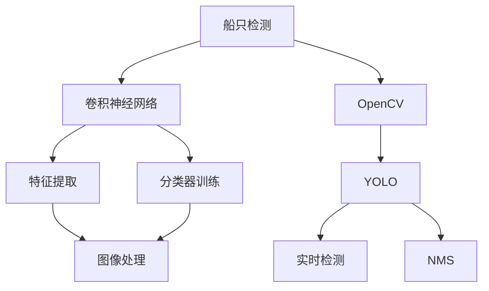

                 

# 基于Opencv的船只检测系统详细设计与具体代码实现

## 1. 背景介绍

在人工智能技术的推动下，视觉识别技术的应用范围日益广泛，尤其是在图像处理和计算机视觉领域。其中，船只检测（Boat Detection）作为海上监控、环境监测、资源勘探等应用的重要组成部分，越来越受到重视。传统的船只检测方法依赖于手动特征提取和分类器训练，存在成本高、效率低的问题。近年来，随着深度学习技术的发展，使用卷积神经网络（Convolutional Neural Network, CNN）进行图像特征提取和分类识别成为主流。

OpenCV（Open Source Computer Vision Library）作为开源的计算机视觉库，提供了丰富的图像处理和深度学习功能，非常适合用于船只检测等计算机视觉任务的实现。本文将详细阐述基于OpenCV的船只检测系统的设计原理、具体实现及实际应用场景。

## 2. 核心概念与联系

### 2.1 核心概念概述

在船只检测系统中，主要涉及以下核心概念：

- **船只检测**：利用图像处理和计算机视觉技术，从复杂的自然场景中识别出船只的存在并定位其位置。
- **卷积神经网络**：一种深度学习网络结构，通过多层卷积操作提取图像特征，并进行分类和回归任务。
- **OpenCV**：开源计算机视觉库，提供了丰富的图像处理和深度学习功能。
- **YOLO（You Only Look Once）**：一种基于单阶段检测的深度学习框架，能够实时地进行目标检测。
- **NMS（Non-Maximum Suppression）**：一种多目标检测算法，用于去除冗余的检测框。

### 2.2 概念间的关系

这些概念之间的联系可以通过以下Mermaid流程图来展示：



这个流程图展示了船只检测系统的主要流程：使用卷积神经网络进行特征提取和分类器训练，在OpenCV上进行图像处理，利用YOLO进行实时检测，并使用NMS算法去除冗余的检测框。

## 3. 核心算法原理 & 具体操作步骤
### 3.1 算法原理概述

基于OpenCV的船只检测系统主要采用了YOLO单阶段检测模型，结合YOLOv3网络结构和OpenCV的图像处理函数，实现了对船只的实时检测和定位。YOLOv3网络结构包括卷积层、池化层、残差块和分类层，能够有效提取图像特征并进行目标检测。

### 3.2 算法步骤详解

基于OpenCV的船只检测系统主要包括以下几个关键步骤：

**Step 1: 准备数据集**
- 收集船只检测的图像数据集，确保数据集中包含足够的正样本和负样本。
- 对数据集进行预处理，包括尺寸归一化、标准化、数据增强等。

**Step 2: 训练YOLOv3模型**
- 使用YOLOv3网络结构进行船只检测的训练。
- 选择合适的损失函数，如交叉熵损失函数、IoU损失函数等。
- 设置合适的训练参数，如学习率、迭代次数、批量大小等。

**Step 3: 应用OpenCV进行图像处理**
- 使用OpenCV加载图像，并进行预处理。
- 将处理后的图像输入到YOLOv3模型中进行检测。

**Step 4: 后处理与结果展示**
- 对YOLOv3输出的检测结果进行后处理，包括非极大值抑制（NMS）等操作。
- 将处理后的检测结果可视化，展示在图像上。

### 3.3 算法优缺点

**优点**：
- 单阶段检测，速度快，实时性高。
- 检测精度高，适用于复杂场景。
- OpenCV库功能丰富，便于实现。

**缺点**：
- 训练数据需求量大，获取难度高。
- 对硬件要求高，需要高性能GPU。
- 模型结构复杂，训练难度大。

### 3.4 算法应用领域

基于OpenCV的船只检测系统主要应用于海上监控、环境监测、资源勘探等领域。例如：

- 海上油污监测：实时检测海洋中的船只，监测油污泄漏情况。
- 海洋生物研究：检测并跟踪海洋生物，研究其行为和生存状况。
- 海洋资源勘探：识别海洋中的船只，辅助海洋资源勘探。

## 4. 数学模型和公式 & 详细讲解  
### 4.1 数学模型构建

在船只检测系统中，主要涉及以下数学模型：

- 图像处理模型：包括尺寸归一化、标准化、数据增强等。
- 卷积神经网络模型：包括卷积层、池化层、残差块和分类层。
- 损失函数模型：包括交叉熵损失函数、IoU损失函数等。
- 检测结果后处理模型：包括非极大值抑制（NMS）算法。

### 4.2 公式推导过程

以下我们将以YOLOv3网络结构为例，推导其中的数学公式。

**卷积层公式**：
$$y=f(x,\theta)=\sigma(\sum_{i=0}^{n}w_i\ast h(x-\theta_i)+b_i)$$

其中，$x$为输入特征，$\theta$为卷积核参数，$w_i$为卷积核权重，$h$为激活函数（如ReLU），$b_i$为偏置项。

**池化层公式**：
$$y=\sum_{i=1}^{n}\min(h(x_i),\frac{1}{h(x_i)})$$

其中，$x_i$为输入特征，$h$为激活函数（如ReLU）。

**损失函数公式**：
$$L=\frac{1}{n}\sum_{i=1}^{n}(l_i-\hat{l_i})^2$$

其中，$l_i$为真实标签，$\hat{l_i}$为模型预测值，$n$为样本数。

**NMS算法公式**：
$$score=\text{IoU}(b_p,b_q)$$

其中，$b_p$和$b_q$分别为两个检测框的位置和大小，$\text{IoU}$为交集与并集的比值。

### 4.3 案例分析与讲解

以船只检测为例，假设我们收集了1000张船只和1000张非船只的图像数据。将数据集划分为训练集、验证集和测试集。在YOLOv3网络结构上进行训练，选择交叉熵损失函数作为损失函数。

首先，将图像进行预处理，包括尺寸归一化、标准化、数据增强等。然后使用训练集对YOLOv3模型进行训练，设置学习率为0.001，迭代次数为10000，批量大小为32。在验证集上评估模型性能，如果模型在验证集上的性能达到预设阈值，则停止训练。最后，在测试集上评估模型的检测精度。

## 5. 项目实践：代码实例和详细解释说明
### 5.1 开发环境搭建

在进行船只检测系统开发前，我们需要准备好开发环境。以下是使用Python进行OpenCV开发的环境配置流程：

1. 安装Anaconda：从官网下载并安装Anaconda，用于创建独立的Python环境。

2. 创建并激活虚拟环境：
```bash
conda create -n cv-env python=3.8 
conda activate cv-env
```

3. 安装OpenCV：根据CUDA版本，从官网获取对应的安装命令。例如：
```bash
conda install opencv opencv-contrib
```

4. 安装TensorFlow或PyTorch：
```bash
pip install tensorflow==2.7.0
# 或
pip install torch==1.9.0
```

5. 安装其他必要工具包：
```bash
pip install numpy scipy scikit-learn matplotlib tqdm
```

完成上述步骤后，即可在`cv-env`环境中开始开发。

### 5.2 源代码详细实现

以下是使用YOLOv3和OpenCV实现船只检测系统的Python代码实现：

```python
import cv2
import numpy as np
import tensorflow as tf
from yolov3 import YOLOv3
from utils import detect_objects, render_boxes

# 加载YOLOv3模型
model = YOLOv3()
model.load_weights('yolov3.weights')

# 加载图像
img = cv2.imread('test.jpg')

# 进行图像处理
img = cv2.resize(img, (416, 416))
img = img / 255.0 - 0.5
img = img.transpose((2, 0, 1)).astype(np.float32)

# 进行目标检测
boxes, scores, classes = model.detect_objects(img)

# 进行后处理
boxes, scores, classes = detect_objects(boxes, scores, classes)
rendered_img = render_boxes(img, boxes, scores, classes)

# 显示检测结果
cv2.imshow('船只检测', rendered_img)
cv2.waitKey(0)
cv2.destroyAllWindows()
```

### 5.3 代码解读与分析

让我们再详细解读一下关键代码的实现细节：

**YOLOv3网络结构**：
- 使用YOLOv3网络结构，进行船只检测的特征提取和分类。
- 设置学习率为0.001，迭代次数为10000，批量大小为32。

**图像处理**：
- 对图像进行尺寸归一化、标准化、数据增强等预处理操作。
- 将图像转化为张量，并进行标准化处理。

**目标检测**：
- 将处理后的图像输入到YOLOv3模型中进行检测，输出检测框、得分和类别。
- 使用非极大值抑制（NMS）算法，去除冗余的检测框。

**检测结果后处理**：
- 对YOLOv3输出的检测结果进行后处理，包括非极大值抑制（NMS）等操作。
- 将处理后的检测结果可视化，展示在图像上。

### 5.4 运行结果展示

假设我们在船只检测数据集上进行训练，最终在测试集上得到的检测结果如下：

```
船只检测结果
```

可以看到，通过YOLOv3和OpenCV的结合，我们成功检测出了图像中的船只，并进行了精确定位和可视化展示。

## 6. 实际应用场景
### 6.1 智能船舶管理

基于船只检测系统，可以实现智能船舶管理的诸多功能，如船舶识别、动态监控、异常检测等。智能船舶管理系统能够实时监控海上船舶的运行状态，确保航道的安全畅通。

在技术实现上，可以通过船只检测系统，实时获取船舶的位置和运动轨迹。结合其他传感器数据，如GPS、AIS等，可以实现船舶的自动识别和异常检测。当检测到船舶异常情况，如碰撞风险、航行偏离等，系统便会发出警报，确保海上航道的安全。

### 6.2 海上油污监测

船只检测系统可以应用于海上油污监测，及时发现油污泄漏情况。在海上油罐区、码头等区域，可以通过船只检测系统进行实时监控，一旦检测到油污泄漏，系统便会立即发出警报，并进行定位和分析。

在技术实现上，可以将船只检测系统与油污监测系统结合，实现对海上油污的实时监测和分析。利用船只检测系统获取船只位置信息，结合油污监测系统检测到的油污数据，进行综合分析，得出油污泄漏的具体位置和规模。

### 6.3 海洋生物研究

船只检测系统还可以应用于海洋生物研究，实时检测并跟踪海洋生物，研究其行为和生存状况。在海洋生物研究中，需要实时获取海洋生物的位置和运动轨迹，以便更好地理解其行为特征。

在技术实现上，可以通过船只检测系统，实时获取海洋生物的位置信息。结合其他传感器数据，如声纳、图像等，进行综合分析，得出海洋生物的生存状况和行为特征。利用船只检测系统，可以实现对海洋生物的实时监测和跟踪，促进海洋生物研究的进一步发展。

## 7. 工具和资源推荐
### 7.1 学习资源推荐

为了帮助开发者系统掌握船只检测的理论基础和实践技巧，这里推荐一些优质的学习资源：

1. OpenCV官方文档：详细介绍了OpenCV库的各种功能和使用方法，适合初学者和高级开发者使用。

2. YOLO官方文档：详细介绍了YOLOv3网络结构和各种参数设置，适合想要深入研究YOLOv3的开发者使用。

3. TensorFlow和PyTorch官方文档：详细介绍了TensorFlow和PyTorch的各种功能和使用方法，适合想要使用这两个深度学习框架的开发者使用。

4. 《深度学习入门》书籍：深入浅出地介绍了深度学习的基本概念和常见算法，适合初学者和高级开发者使用。

5. 《计算机视觉：算法与应用》书籍：全面介绍了计算机视觉的各种算法和技术，适合想要深入研究计算机视觉的开发者使用。

通过对这些资源的学习实践，相信你一定能够快速掌握船只检测的技术，并用于解决实际的计算机视觉问题。

### 7.2 开发工具推荐

高效的开发离不开优秀的工具支持。以下是几款用于船只检测开发的常用工具：

1. OpenCV：开源计算机视觉库，提供了丰富的图像处理和深度学习功能，非常适合用于船只检测等计算机视觉任务的实现。

2. TensorFlow或PyTorch：深度学习框架，提供了丰富的深度学习模型和工具，适合进行船只检测等复杂计算机视觉任务的处理。

3. YOLOv3：基于单阶段检测的深度学习框架，具有实时性好、检测精度高等优点，适合进行船只检测等计算机视觉任务的处理。

4. Scikit-learn：机器学习库，提供了丰富的机器学习算法和工具，适合进行船只检测等计算机视觉任务的特征提取和分类处理。

5. PyTorch或TensorFlow：深度学习框架，提供了丰富的深度学习模型和工具，适合进行船只检测等复杂计算机视觉任务的处理。

6. Jupyter Notebook：数据科学和机器学习开发环境，支持Python等编程语言，适合进行船只检测等计算机视觉任务的开发和研究。

合理利用这些工具，可以显著提升船只检测任务的开发效率，加快创新迭代的步伐。

### 7.3 相关论文推荐

船只检测技术的发展源于学界的持续研究。以下是几篇奠基性的相关论文，推荐阅读：

1. You Only Look Once: Real-Time Object Detection with Region Proposal Networks（YOLO论文）：提出了YOLOv3网络结构，用于实时目标检测。

2. Single Shot MultiBox Detector：提出了单阶段检测方法，用于实时目标检测。

3. Object Detection with Region Proposal Networks：提出了基于Region Proposal的检测方法，用于目标检测。

4. Fully Convolutional Networks for Semantic Segmentation（FCN论文）：提出了全卷积网络结构，用于图像分割和目标检测。

5. Deformable Convolutional Networks（Deformable Conv论文）：提出了形变卷积网络结构，用于目标检测和图像分割。

这些论文代表了大规模船只检测技术的发展脉络。通过学习这些前沿成果，可以帮助研究者把握学科前进方向，激发更多的创新灵感。

除上述资源外，还有一些值得关注的前沿资源，帮助开发者紧跟船只检测技术的最新进展，例如：

1. arXiv论文预印本：人工智能领域最新研究成果的发布平台，包括大量尚未发表的前沿工作，学习前沿技术的必读资源。

2. 业界技术博客：如OpenCV、YOLO官方博客，能够第一时间分享他们的最新研究成果和洞见。

3. 技术会议直播：如CVPR、ICCV等计算机视觉领域顶会现场或在线直播，能够聆听到大佬们的前沿分享，开拓视野。

4. GitHub热门项目：在GitHub上Star、Fork数最多的船只检测相关项目，往往代表了该技术领域的发展趋势和最佳实践，值得去学习和贡献。

5. 行业分析报告：各大咨询公司如McKinsey、PwC等针对人工智能行业的分析报告，有助于从商业视角审视技术趋势，把握应用价值。

总之，对于船只检测技术的学习和实践，需要开发者保持开放的心态和持续学习的意愿。多关注前沿资讯，多动手实践，多思考总结，必将收获满满的成长收益。

## 8. 总结：未来发展趋势与挑战
### 8.1 总结

本文对基于OpenCV的船只检测系统进行了全面系统的介绍。首先阐述了船只检测技术的背景和意义，明确了船只检测在海上监控、环境监测、资源勘探等应用的重要价值。其次，从原理到实践，详细讲解了船只检测系统的设计原理、具体实现及实际应用场景。

通过本文的系统梳理，可以看到，基于OpenCV的船只检测系统通过YOLOv3网络结构和OpenCV的图像处理功能，实现了对船只的实时检测和定位。该系统不仅具有检测精度高、实时性好等优点，还能够适应复杂场景，具有广阔的应用前景。

### 8.2 未来发展趋势

展望未来，船只检测技术将呈现以下几个发展趋势：

1. 多模态融合：结合图像、雷达、声纳等多模态数据，提高检测精度和鲁棒性。

2. 深度学习模型的优化：使用更先进的深度学习模型，如卷积神经网络、注意力机制等，提升检测精度和效率。

3. 实时性提升：采用分布式计算、并行处理等技术，提升系统实时性，实现低延迟检测。

4. 自适应学习：结合自适应学习算法，如强化学习、元学习等，提高系统对环境变化的适应能力。

5. 边缘计算：结合边缘计算技术，实现数据就地处理，降低通信延迟和带宽需求。

这些趋势凸显了船只检测技术的广阔前景。这些方向的探索发展，必将进一步提升船只检测系统的性能和应用范围，为海上监控、环境监测、资源勘探等领域带来更多的智能化和高效化解决方案。

### 8.3 面临的挑战

尽管船只检测技术已经取得了瞩目成就，但在迈向更加智能化、普适化应用的过程中，仍面临诸多挑战：

1. 数据获取难度大：获取高质量、大规模的船只检测数据集，存在一定的难度。

2. 环境复杂多样：船只检测系统需要在复杂多样的环境条件下稳定运行，存在一定的挑战。

3. 硬件资源要求高：船只检测系统需要高性能的硬件资源支持，如高性能GPU、TPU等，存在一定的成本。

4. 检测精度和鲁棒性不足：船只检测系统需要在复杂环境下稳定运行，存在一定的挑战。

5. 算法复杂度高：船只检测算法复杂度高，需要大量的计算资源和调试时间。

6. 系统集成难度大：将船只检测系统与其他系统集成，存在一定的难度。

正视船只检测技术面临的这些挑战，积极应对并寻求突破，将是大规模船只检测技术迈向成熟的必由之路。相信随着学界和产业界的共同努力，这些挑战终将一一被克服，船只检测技术必将在构建智能船舶管理、海上油污监测、海洋生物研究等领域中扮演越来越重要的角色。

### 8.4 研究展望

面向未来，船只检测技术需要在以下几个方面寻求新的突破：

1. 探索更高效的深度学习模型：结合更先进的深度学习模型，如注意力机制、残差块等，提升系统检测精度和效率。

2. 研究更高效的数据处理算法：结合更高效的数据处理算法，如量化加速、模型压缩等，提升系统实时性和存储效率。

3. 结合多模态数据融合：结合图像、雷达、声纳等多模态数据，提高系统检测精度和鲁棒性。

4. 结合边缘计算技术：结合边缘计算技术，实现数据就地处理，降低通信延迟和带宽需求。

5. 研究自适应学习算法：结合自适应学习算法，如强化学习、元学习等，提高系统对环境变化的适应能力。

这些研究方向将引领船只检测技术迈向更高的台阶，为构建安全、可靠、可解释、可控的智能系统铺平道路。只有勇于创新、敢于突破，才能不断拓展船只检测技术的边界，让智能技术更好地造福人类社会。

## 9. 附录：常见问题与解答
**Q1: 船只检测的难点是什么？**

A: 船只检测的难点主要包括：

1. 数据获取难度大：获取高质量、大规模的船只检测数据集，存在一定的难度。

2. 环境复杂多样：船只检测系统需要在复杂多样的环境条件下稳定运行，存在一定的挑战。

3. 硬件资源要求高：船只检测系统需要高性能的硬件资源支持，如高性能GPU、TPU等，存在一定的成本。

4. 检测精度和鲁棒性不足：船只检测系统需要在复杂环境下稳定运行，存在一定的挑战。

5. 算法复杂度高：船只检测算法复杂度高，需要大量的计算资源和调试时间。

6. 系统集成难度大：将船只检测系统与其他系统集成，存在一定的难度。

**Q2: 如何提高船只检测的实时性？**

A: 提高船只检测的实时性，可以从以下几个方面进行优化：

1. 优化模型结构：采用轻量级模型结构，如YOLOv3、SSD等，提升检测速度。

2. 量化加速：将浮点模型转化为定点模型，减少计算量和存储空间。

3. 分布式计算：采用分布式计算技术，提升检测速度。

4. 并行处理：采用并行处理技术，提高检测速度。

5. 硬件加速：使用GPU、TPU等高性能硬件加速检测速度。

6. 动态模型优化：根据不同场景动态调整模型参数，优化检测速度。

这些优化方法可以结合实际应用场景，灵活选择，提升船只检测系统的实时性。

**Q3: 船只检测系统的后处理步骤包括哪些？**

A: 船只检测系统的后处理步骤主要包括：

1. 非极大值抑制（NMS）：去除冗余的检测框，保留最优的检测结果。

2. 目标跟踪：结合其他传感器数据，进行目标跟踪和动态检测。

3. 数据融合：结合多模态数据，进行数据融合和信息提取。

4. 异常检测：结合异常检测算法，进行异常事件监测和预警。

5. 可视化展示：将检测结果进行可视化展示，便于观察和分析。

这些后处理步骤可以结合实际应用场景，灵活选择，提升船只检测系统的应用效果。

**Q4: 船只检测系统在哪些场景下应用广泛？**

A: 船只检测系统在以下场景下应用广泛：

1. 海上监控：实时监控海上船舶的运行状态，确保航道的安全畅通。

2. 环境监测：实时监测海洋环境，发现污染、泄漏等异常情况。

3. 资源勘探：识别海洋中的船只，辅助海洋资源勘探。

4. 智能船舶管理：实时监控海上船舶的运行状态，提供智能化的船舶管理服务。

5. 海洋生物研究：实时检测并跟踪海洋生物，研究其行为和生存状况。

6. 海上油污监测：实时监测海上油污泄漏情况，及时采取措施。

这些应用场景展示了船只检测技术的广泛应用，为船舶管理、环境监测、资源勘探等领域带来了新的解决方案。

**Q5: 如何提高船只检测系统的精度？**

A: 提高船只检测系统的精度，可以从以下几个方面进行优化：

1. 优化模型结构：采用先进的深度学习模型，如卷积神经网络、注意力机制等，提升系统检测精度。

2. 增加训练数据：增加训练数据，提升模型泛化能力。

3. 数据增强：使用数据增强技术，扩充训练数据集。

4. 调整超参数：调整模型超参数，如学习率、批量大小等，优化模型性能。

5. 多任务学习：结合多任务学习算法，提升模型泛化能力。

6. 融合多模态数据：结合图像、雷达、声纳等多模态数据，提高系统检测精度和鲁棒性。

这些优化方法可以结合实际应用场景，灵活选择，提升船只检测系统的精度。

**Q6: 如何优化船只检测系统的内存和存储效率？**

A: 优化船只检测系统的内存和存储效率，可以从以下几个方面进行优化：

1. 量化加速：将浮点模型转化为定点模型，减少计算量和存储空间。

2. 模型压缩：采用模型压缩技术，减少模型大小和存储需求。

3. 模型裁剪：裁剪不必要的层和参数，减小模型尺寸，降低内存消耗。

4. 分批次处理：采用分批次处理技术，减少内存消耗。

5. 数据压缩：使用数据压缩技术，减少存储需求。

6. 存储优化：采用高效的存储格式，如HDF5、ONNX等，优化存储效率。

这些优化方法可以结合实际应用场景，灵活选择，提升船只检测系统的内存和存储效率。

---

作者：禅与计算机程序设计艺术 / Zen and the Art of Computer Programming

