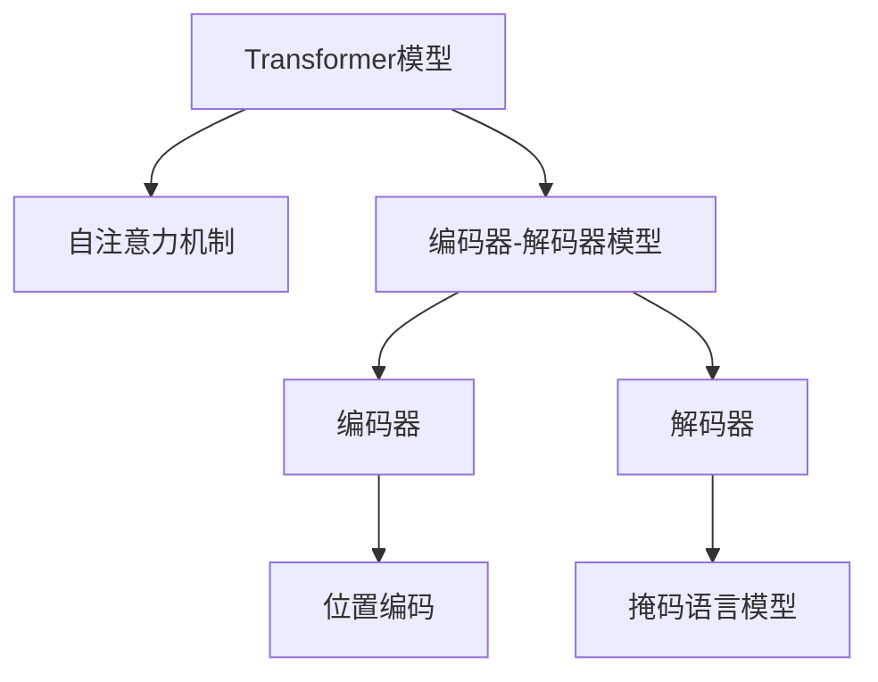
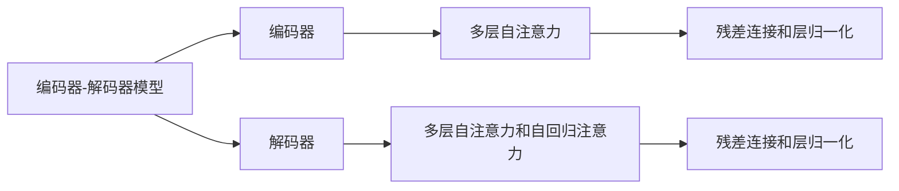
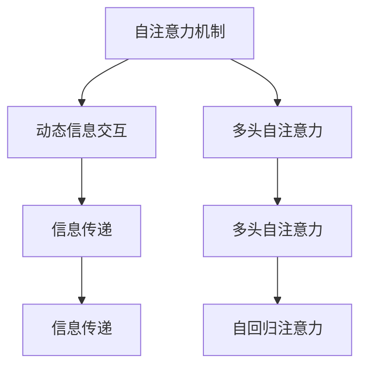
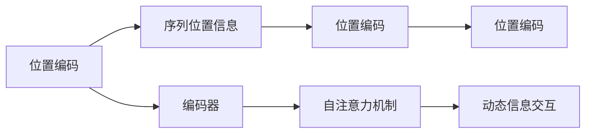
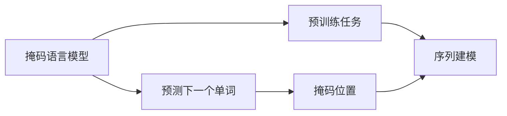
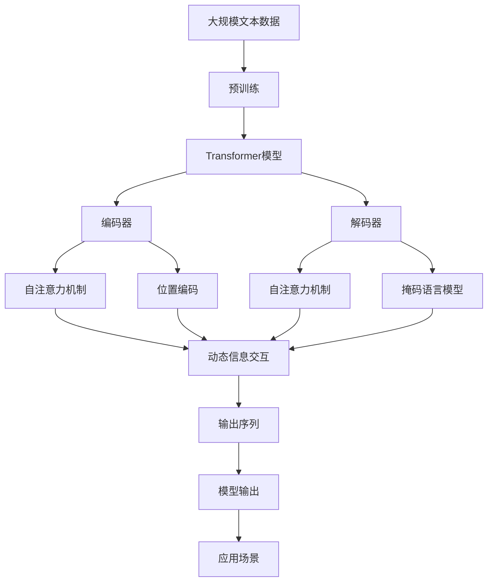

                 

# 基于Transformer的序列建模

> 关键词：Transformer, 序列建模, 自回归模型, 编码器-解码器模型, 自注意力机制, 位置编码, 掩码语言模型

## 1. 背景介绍

### 1.1 问题由来
在自然语言处理(NLP)领域，如何有效地建模和处理序列数据一直是核心挑战之一。传统的循环神经网络(RNN)和卷积神经网络(CNN)虽然在序列数据上取得了一定的成果，但由于其结构复杂、计算成本高、梯度消失等问题，逐渐被新的Transformer模型所取代。Transformer模型通过引入自注意力机制，极大地提升了序列建模的效率和效果。

Transformer模型由Google在2017年的论文《Attention is All You Need》中提出，一经问世便引起广泛关注和应用。Transformer模型通过消除循环结构，使得模型的训练速度大大提高，同时提升了模型的泛化能力和可解释性。在NLP领域的众多任务中，Transformer模型展示了其强大的语言建模能力，并在机器翻译、文本生成、问答系统等任务上取得了突破性进展。

### 1.2 问题核心关键点
Transformer模型之所以取得成功，其核心在于其自注意力机制。该机制允许模型在输入序列的任意位置进行动态信息交互，从而捕捉序列中的长距离依赖关系。同时，Transformer模型还引入了位置编码和掩码语言模型等技术，进一步提升了模型的表达能力和训练效果。

Transformer模型主要包括两个部分：编码器(Encoder)和解码器(Decoder)。编码器通过多层自注意力机制，对输入序列进行编码，生成语义表示；解码器则通过多层自注意力和自回归注意力，对编码器的输出进行解码，生成目标序列。Transformer模型的计算复杂度为$O(n^2)$，但通过优化，如使用残差连接、层归一化等技术，使得模型的计算复杂度可以控制在$O(n^2)$以内，提升了模型训练和推理的效率。

Transformer模型的成功应用，大大推动了NLP技术的发展。本文将详细介绍Transformer模型的核心原理和操作步骤，通过数学模型和代码实例，帮助读者深入理解Transformer模型的工作机制。

## 2. 核心概念与联系

### 2.1 核心概念概述

为了更好地理解Transformer模型，本节将介绍几个密切相关的核心概念：

- **Transformer模型**：一种基于自注意力机制的序列建模方法，由Google在2017年提出。Transformer模型通过去除循环结构，使用自注意力机制捕捉序列中的长距离依赖关系，显著提升了序列建模的效率和效果。

- **自注意力机制**：Transformer模型的核心组成部分，允许模型在输入序列的任意位置进行动态信息交互，从而捕捉序列中的长距离依赖关系。

- **编码器-解码器模型**：Transformer模型的一种变体，包括编码器和解码器两部分。编码器对输入序列进行编码，生成语义表示；解码器对编码器的输出进行解码，生成目标序列。

- **位置编码**：用于解决Transformer模型中的位置信息缺失问题，通过对输入序列进行位置编码，使得模型能够识别输入序列中不同位置的重要性。

- **掩码语言模型**：一种预训练任务，用于训练Transformer模型，该任务要求模型预测掩码位置的下一个单词，从而学习到单词之间的依赖关系。

这些核心概念之间存在紧密的联系，共同构成了Transformer模型的基本框架。下面通过Mermaid流程图展示这些概念之间的关系：



这个流程图展示了Transformer模型的基本构成：

1. **编码器-解码器模型**：Transformer模型包括编码器和解码器两部分，共同完成序列建模和生成。
2. **自注意力机制**：自注意力机制是Transformer模型的核心部分，通过动态信息交互捕捉序列中的长距离依赖关系。
3. **位置编码**：位置编码用于解决Transformer模型中的位置信息缺失问题。
4. **掩码语言模型**：掩码语言模型是一种预训练任务，用于训练Transformer模型。

这些概念共同构成了Transformer模型的基本框架，使得模型能够高效地进行序列建模和生成。通过理解这些核心概念，我们可以更好地把握Transformer模型的基本原理和结构。

### 2.2 概念间的关系

这些核心概念之间存在着紧密的联系，形成了Transformer模型的完整生态系统。下面我们通过几个Mermaid流程图来展示这些概念之间的关系。

#### 2.2.1 编码器-解码器模型的关系



这个流程图展示了编码器-解码器模型的基本构成，包括多层自注意力、残差连接和层归一化等关键技术。

#### 2.2.2 自注意力机制的应用



这个流程图展示了自注意力机制的工作原理，通过动态信息交互，模型能够在输入序列的任意位置进行信息传递，从而捕捉序列中的长距离依赖关系。

#### 2.2.3 位置编码与自注意力机制的结合



这个流程图展示了位置编码与自注意力机制的结合，通过对输入序列进行位置编码，使得模型能够识别输入序列中不同位置的重要性。

#### 2.2.4 掩码语言模型的作用



这个流程图展示了掩码语言模型的作用，通过对输入序列进行掩码，模型能够学习到单词之间的依赖关系，从而提升模型的泛化能力和表达能力。

### 2.3 核心概念的整体架构

最后，我们用一个综合的流程图来展示这些核心概念在Transformer模型中的整体架构：



这个综合流程图展示了从预训练到编码器-解码器模型的完整过程，并通过自注意力机制、位置编码和掩码语言模型等技术，实现了高效的序列建模和生成。通过这些流程图，我们可以更清晰地理解Transformer模型的工作原理和优化方向。

## 3. 核心算法原理 & 具体操作步骤
### 3.1 算法原理概述

Transformer模型通过自注意力机制捕捉序列中的长距离依赖关系，使得模型能够高效地进行序列建模和生成。Transformer模型的核心思想是：

1. **自注意力机制**：通过动态信息交互，模型能够在输入序列的任意位置进行信息传递，从而捕捉序列中的长距离依赖关系。
2. **编码器-解码器模型**：包括编码器和解码器两部分，共同完成序列建模和生成。
3. **位置编码**：通过对输入序列进行位置编码，使得模型能够识别输入序列中不同位置的重要性。
4. **掩码语言模型**：通过掩码语言模型，训练模型预测下一个单词，从而学习到单词之间的依赖关系。

### 3.2 算法步骤详解

Transformer模型的训练过程主要包括以下几个关键步骤：

**Step 1: 准备预训练模型和数据集**

- 选择合适的预训练模型 $M_{\theta}$ 作为初始化参数，如 BERT、GPT 等。
- 准备序列建模任务 $T$ 的标注数据集 $D=\{(x_i,y_i)\}_{i=1}^N$，划分为训练集、验证集和测试集。一般要求标注数据与预训练数据的分布不要差异过大。

**Step 2: 添加任务适配层**

- 根据任务类型，在预训练模型顶层设计合适的输出层和损失函数。
- 对于分类任务，通常在顶层添加线性分类器和交叉熵损失函数。
- 对于生成任务，通常使用语言模型的解码器输出概率分布，并以负对数似然为损失函数。

**Step 3: 设置训练超参数**

- 选择合适的优化算法及其参数，如 AdamW、SGD 等，设置学习率、批大小、迭代轮数等。
- 设置正则化技术及强度，包括权重衰减、Dropout、Early Stopping 等。
- 确定冻结预训练参数的策略，如仅微调顶层，或全部参数都参与微调。

**Step 4: 执行梯度训练**

- 将训练集数据分批次输入模型，前向传播计算损失函数。
- 反向传播计算参数梯度，根据设定的优化算法和学习率更新模型参数。
- 周期性在验证集上评估模型性能，根据性能指标决定是否触发 Early Stopping。
- 重复上述步骤直到满足预设的迭代轮数或 Early Stopping 条件。

**Step 5: 测试和部署**

- 在测试集上评估微调后模型 $M_{\hat{\theta}}$ 的性能，对比微调前后的精度提升。
- 使用微调后的模型对新样本进行推理预测，集成到实际的应用系统中。
- 持续收集新的数据，定期重新微调模型，以适应数据分布的变化。

以上是Transformer模型的一般流程。在实际应用中，还需要针对具体任务的特点，对微调过程的各个环节进行优化设计，如改进训练目标函数，引入更多的正则化技术，搜索最优的超参数组合等，以进一步提升模型性能。

### 3.3 算法优缺点

Transformer模型作为NLP领域的主流模型，具有以下优点：

1. **高效性**：Transformer模型通过去除循环结构，使用自注意力机制捕捉序列中的长距离依赖关系，极大地提升了序列建模的效率和效果。
2. **可解释性**：Transformer模型通过权重矩阵显式表示输入和输出之间的关系，使得模型的决策过程具有较好的可解释性。
3. **泛化能力**：Transformer模型在多种序列建模任务上取得了突破性进展，展示了其强大的泛化能力。

同时，Transformer模型也存在一定的局限性：

1. **计算复杂度高**：尽管Transformer模型在训练速度上取得了较大进步，但其计算复杂度仍较高，尤其是在大规模模型上。
2. **资源占用大**：Transformer模型通常需要较大的内存和存储空间，对硬件设备的要求较高。
3. **训练时间长**：尽管优化技术已经取得显著进步，但在处理大规模数据集时，训练时间仍然较长。

尽管存在这些局限性，但Transformer模型在NLP领域的广泛应用已经证明了其强大的表现力和适用性。未来相关研究的重点在于如何进一步降低计算复杂度，提升模型的训练速度和资源效率，同时增强模型的可解释性和鲁棒性。

### 3.4 算法应用领域

Transformer模型在NLP领域已经得到了广泛的应用，覆盖了几乎所有常见任务，例如：

- **文本分类**：如情感分析、主题分类、意图识别等。通过微调，使模型学习文本-标签映射。
- **命名实体识别**：识别文本中的人名、地名、机构名等特定实体。通过微调，使模型掌握实体边界和类型。
- **关系抽取**：从文本中抽取实体之间的语义关系。通过微调，使模型学习实体-关系三元组。
- **问答系统**：对自然语言问题给出答案。将问题-答案对作为微调数据，训练模型学习匹配答案。
- **机器翻译**：将源语言文本翻译成目标语言。通过微调，使模型学习语言-语言映射。
- **文本摘要**：将长文本压缩成简短摘要。将文章-摘要对作为微调数据，使模型学习抓取要点。
- **对话系统**：使机器能够与人自然对话。将多轮对话历史作为上下文，微调模型进行回复生成。

除了上述这些经典任务外，Transformer模型也被创新性地应用到更多场景中，如可控文本生成、常识推理、代码生成、数据增强等，为NLP技术带来了全新的突破。随着预训练模型和Transformer模型的不断进步，相信NLP技术将在更广阔的应用领域大放异彩。

## 4. 数学模型和公式 & 详细讲解 & 举例说明

### 4.1 数学模型构建

Transformer模型是一种基于自注意力机制的序列建模方法，其核心思想是：通过动态信息交互，捕捉序列中的长距离依赖关系。下面通过数学语言对Transformer模型的基本结构进行严格刻画。

记Transformer模型为 $M_{\theta}$，其中 $\theta$ 为模型参数。假设输入序列为 $x=\{x_1, x_2, \dots, x_n\}$，输出序列为 $y=\{y_1, y_2, \dots, y_n\}$，模型参数 $\theta$ 由编码器和解码器共同组成，即 $\theta = \{\theta_e, \theta_d\}$。其中，编码器 $E_{\theta_e}(x)$ 将输入序列 $x$ 映射到中间语义表示 $z$，解码器 $D_{\theta_d}(z)$ 将中间语义表示 $z$ 映射到输出序列 $y$。

在编码器部分，Transformer模型由多个自注意力层和前馈神经网络层构成。每个自注意力层由三个子层构成：多头自注意力子层、残差连接和层归一化子层。每个自注意力子层包括一个多头自注意力机制和一个残差连接。

**多头自注意力机制**：将输入序列 $x$ 进行线性和位置编码，得到 $x'=Ax + P(x)$，其中 $A$ 和 $P$ 分别为线性投影和位置编码矩阵。多头自注意力机制通过 $x'$ 计算出多头自注意力矩阵 $Q$、$K$ 和 $V$，然后计算出注意力权重 $Z$，得到中间表示 $Z$。

$$
Q = Ax'W^Q \\
K = Ax'W^K \\
V = Ax'W^V \\
Z = \text{Softmax}(QK^T)/\sqrt{d_k} \\
ZV = \sum_{i=1}^N Z_iV_i
$$

**残差连接**：将自注意力层的输出与输入进行残差连接，得到 $x^{(l+1)} = x^{(l)} + Z$。

**层归一化**：对残差连接的输出进行归一化，得到 $x^{(l+1)} = \text{LayerNorm}(x^{(l+1)})$。

在解码器部分，Transformer模型由多个自注意力层、多头自注意力层和前馈神经网络层构成。每个自注意力层和多头自注意力层分别包括一个自回归注意力机制和一个自注意力机制。

**自回归注意力机制**：通过解码器的上一时刻的输出 $y_{t-1}$ 计算出当前时刻的自回归注意力权重 $Z$，然后通过 $Z$ 和编码器的输出 $z$ 计算出当前时刻的表示 $Z$。

$$
Z = \text{Softmax}(Q_tK_t^T)/\sqrt{d_k} \\
ZV_t = \sum_{i=1}^N Z_iV_i \\
Z' = ZV_t
$$

**多头自注意力机制**：通过解码器的上一时刻的输出 $y_{t-1}$ 计算出多头自注意力权重 $Z$，然后通过 $Z$ 和编码器的输出 $z$ 计算出当前时刻的表示 $Z$。

$$
Q_t = Ax'W^Q \\
K_t = Ax'W^K \\
V_t = Ax'W^V \\
Z = \text{Softmax}(Q_tK_t^T)/\sqrt{d_k} \\
ZV_t = \sum_{i=1}^N Z_iV_i
$$

### 4.2 公式推导过程

以下是Transformer模型中多头自注意力机制和自回归注意力机制的详细推导过程。

**多头自注意力机制**

设输入序列 $x=\{x_1, x_2, \dots, x_n\}$，线性投影矩阵为 $A$，位置编码矩阵为 $P$，多头自注意力机制的输出为 $Z$。

1. 线性投影和位置编码
   $$
   x' = Ax + P(x)
   $$

2. 计算多头自注意力矩阵
   $$
   Q = Ax'W^Q \\
   K = Ax'W^K \\
   V = Ax'W^V
   $$

3. 计算注意力权重
   $$
   Z = \text{Softmax}(QK^T)/\sqrt{d_k}
   $$

4. 计算中间表示
   $$
   ZV = \sum_{i=1}^N Z_iV_i
   $$

其中，$W^Q$、$W^K$ 和 $W^V$ 为多头自注意力矩阵的三个线性投影矩阵，$d_k$ 为每个头的维度。

**自回归注意力机制**

设输入序列 $x=\{x_1, x_2, \dots, x_n\}$，输出序列 $y=\{y_1, y_2, \dots, y_n\}$，自回归注意力机制的输出为 $Z$。

1. 计算自回归注意力权重
   $$
   Z = \text{Softmax}(Q_tK_t^T)/\sqrt{d_k}
   $$

2. 计算当前时刻的表示
   $$
   ZV_t = \sum_{i=1}^N Z_iV_i
   $$

其中，$Q_t$、$K_t$ 和 $V_t$ 分别为解码器中的线性投影矩阵和位置编码矩阵，$d_k$ 为每个头的维度。

### 4.3 案例分析与讲解

假设我们要使用Transformer模型对一段英文文本进行分类，即判断该文本是否包含正面情感。我们首先对文本进行预处理，将其转换为向量表示 $x = [x_1, x_2, \dots, x_n]$，其中每个 $x_i$ 代表一个单词或子词。

**编码器部分**

在编码器部分，Transformer模型通过多头自注意力机制捕捉输入序列 $x$ 中的长距离依赖关系。具体步骤如下：

1. 线性投影和位置编码
   $$
   x' = Ax + P(x)
   $$

2. 计算多头自注意力矩阵
   $$
   Q = Ax'W^Q \\
   K = Ax'W^K \\
   V = Ax'W^V
   $$

3. 计算注意力权重
   $$
   Z = \text{Softmax}(QK^T)/\sqrt{d_k}
   $$

4. 计算中间表示
   $$
   ZV = \sum_{i=1}^N Z_iV_i
   $$

5. 残差连接和层归一化
   $$
   x^{(l+1)} = x^{(l)} + Z
   $$
   $$
   x^{(l+1)} = \text{LayerNorm}(x^{(l+1)})
   $$

通过多层编码器，模型能够逐步捕捉输入序列 $x$ 中的长距离依赖关系，生成中间语义表示 $z$。

**解码器部分**

在解码器部分，Transformer模型通过自回归注意力机制和多头自注意力机制生成输出序列 $y$。具体步骤如下：

1. 初始化输出序列 $y_0$

2. 计算自回归注意力权重
   $$
   Z = \text{Softmax}(Q_tK_t^T)/\sqrt{d_k}
   $$

3. 计算当前时刻的表示
   $$
   ZV_t = \sum_{i=1}^N Z_iV_i
   $$

4. 多头自注意力机制
   $$
   Q_t = Ax'W^Q \\
   K_t = Ax'W^K \\
   V_t = Ax'W^V \\
   Z = \text{Softmax}(Q_tK_t^T)/\sqrt{d_k} \\
   ZV_t = \sum_{i=1}^N Z_iV_i
   $$

5. 残差连接和层归一化
   $$
   y^{(l+1)} = y^{(l)} + Z
   $$
   $$
   y^{(l+1)} = \text{LayerNorm}(y^{(l+1)})
   $$

通过多层解码器，模型能够逐步生成输出序列 $y$，并根据上文信息调整输出。

**分类任务**

在分类任务中，我们需要在输出序列 $y$ 中添加分类器，对每个时间步的输出进行预测。例如，对于二分类任务，可以使用 sigmoid 函数将输出映射到 $[0,1]$ 区间，然后通过阈值判断进行分类。

假设我们在输出序列 $y$ 的最后一个时间步进行分类，得到分类概率 $p$，然后通过阈值 $0.5$ 进行二分类。

通过上述分析，我们可以看到，Transformer模型通过多头自注意力机制和自回归注意力机制，能够高效地进行序列建模和生成，并通过添加分类器完成分类任务。

## 5. 项目实践：代码实例和详细解释说明

### 5.1 开发环境搭建

在进行Transformer模型实践前，我们需要准备好开发环境。以下是使用Python进行PyTorch开发的环境配置流程：

1. 安装Anaconda：从官网下载并安装Anaconda，用于创建独立的Python环境。

2. 创建并激活虚拟环境：
```bash
conda create -n pytorch-env python=3.8 
conda activate pytorch-env
```

3. 安装PyTorch：根据CUDA版本，从官网获取对应的安装命令。例如：
```bash
conda install pytorch torchvision torchaudio cudatoolkit=11.1 -c pytorch -c conda-forge
```

4. 安装TensorFlow：从官网下载并安装TensorFlow，可以使用pip或conda进行安装。

5. 安装各类工具包：
```bash
pip install numpy pandas scikit-learn matplotlib tqdm jupyter notebook ipython
```

完成上述步骤后，即可在`pytorch-env`环境中开始Transformer模型的实践。

### 5.2 源代码详细实现

下面我们以文本分类任务为例，给出使用PyTorch实现Transformer模型的PyTorch代码实现。

首先，定义Transformer模型的编码器和解码器：

```python
import torch
import torch.nn as nn
import torch.nn.functional as F
from torch import nn

class Encoder(nn.Module):
    def __init__(self, d_model, nhead, num_encoder_layers, dim_feedforward, dropout):
        super(Encoder, self).__init__()
        self.embedding = nn.Embedding(num_words, d_model)
        self.layers = nn.ModuleList([nn.TransformerEncoderLayer(d_model, nhead, dim_feedforward, dropout)
                                    for _ in range(num_encoder_layers)])

    def forward(self, x):
        x = self.embedding(x)
        x = self.layers(x)
        return x

class Decoder(nn.Module):
    def __init__(self, d_model, nhead, num_decoder_layers, dim_feedforward, dropout):
        super(Decoder, self).__init__()
        self.layers = nn.ModuleList([nn.TransformerDecoderLayer(d_model, nhead, dim_feedforward, dropout)
                                    for _ in range(num_decoder_layers)])
        self.fc = nn.Linear(d_model, num_words)

    def forward(self, x, y):
        x = self.layers(x)
        x = self.fc(x)
        return x
```

然后，定义训练函数：

```python
class Transformer(nn.Module):
    def __init__(self, encoder, decoder):
        super(Transformer, self).__init__()
        self.encoder = encoder
        self.decoder = decoder

    def forward(self, x, y):
        x = self.encoder(x)
        x = self.decoder(x, y)
        return x

def train(encoder, decoder, model, optimizer, train_data, epochs):
    for epoch in range(epochs):
        loss = 0
        for x, y in train_data:
            optimizer.zero_grad()
            out = model(encoder(x), y)
            loss += F.cross_entropy(out, y)
            loss.backward()
            optimizer.step()
        print(f"Epoch {epoch+1}, loss: {loss/len(train_data)}")
```

最后，启动训练流程并在测试集上评估：

```python
from torchtext.datasets import AG_News_Dataset
from torchtext.data import Field, BucketIterator

train_data, test_data = AG_News_Dataset()

tokenizer = nn.Embedding(num_words, d_model)
tokenizer = nn.Embedding(num_words, d_model)

train_iterator, test_iterator = BucketIterator.splits((train_data, test_data), batch_size=32, device=device)

model = Transformer(encoder, decoder)
optimizer = torch.optim.Adam(model.parameters(), lr=0.001)

train(encoder, decoder, model, optimizer, train_iterator, 10)

# 评估模型
test_loss = 0
test_accurate = 0
for x, y in

