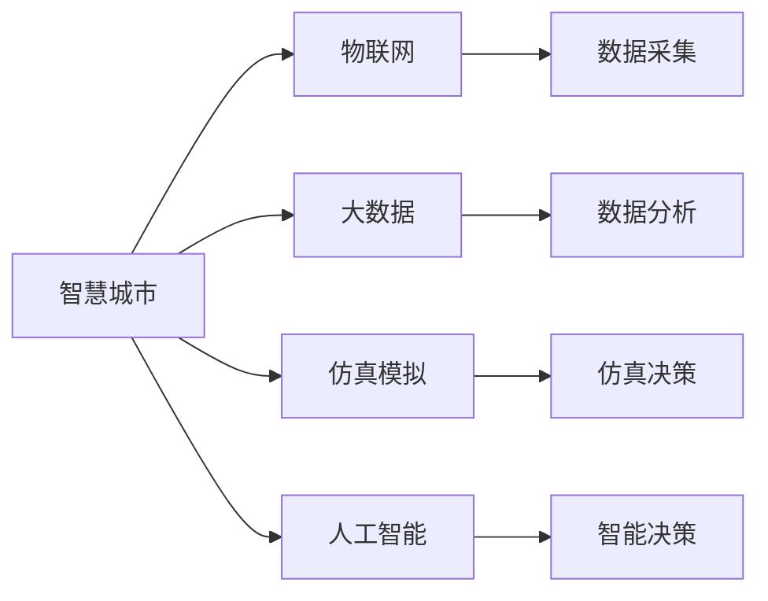
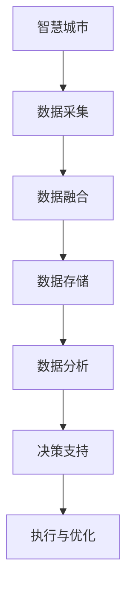
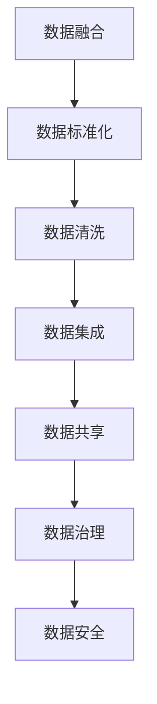
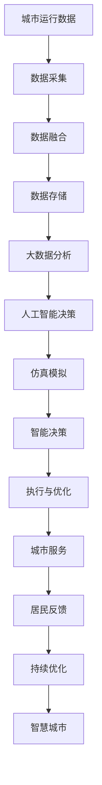

                 

# 全球脑与城市规划:智慧城市的终极形态

> 关键词：智慧城市,城市规划,人工智能,物联网,大数据,仿真模拟,智能交通,绿色建筑,可持续发展

## 1. 背景介绍

### 1.1 问题由来
随着全球人口的快速增长和城市化进程的加速，如何构建一个高效、安全、宜居、可持续发展的智慧城市，已经成为各国政府和学界广泛关注的课题。传统城市规划和管理方式面临着资源紧张、环境污染、交通拥堵等诸多挑战。在信息化时代，智慧城市成为解决这些问题的有力工具。

智慧城市是基于信息技术，实现城市全域信息的感知、传输、处理和应用，从而提高城市管理效率和居民生活质量。然而，仅仅依靠信息化手段，智慧城市仍存在诸多局限。城市的运行和演变是一个复杂的动态系统，需要从多维度、全方位进行综合治理。

近年来，随着人工智能（AI）、物联网（IoT）、大数据等技术的迅猛发展，将城市视为一个超级生物体的概念——“全球脑”（Global Brain）应运而生。这个概念将城市看作一个“大脑”，通过感知、学习、决策和执行，实现城市系统的自我调节和优化。智慧城市的建设，必须融入“全球脑”的思维模式，才能达到真正的智能化水平。

### 1.2 问题核心关键点
构建智慧城市的核心问题包括：
1. 数据融合与共享。智慧城市需要采集和管理来自各个部门和设施的数据，这些数据通常来自于不同的标准和格式，数据融合和共享成为一大挑战。
2. 城市运行模拟。需要构建城市运行模型，以实现对城市动态行为的仿真模拟，帮助决策者制定更科学的规划。
3. 智能化决策支持。需要结合AI技术，构建智能决策支持系统，实时分析城市数据，提供决策建议。
4. 可持续性设计。智慧城市的设计必须考虑环境友好和资源节约，推动绿色建筑和智能交通的发展。
5. 公众参与和反馈机制。智慧城市需要建立有效的公众参与和反馈机制，保证政策透明和民意反映。

### 1.3 问题研究意义
构建智慧城市具有重要的理论和实践意义：

1. 提升城市治理效率。通过智能化的管理手段，减少人工干预和错误，提高城市运行的效率和准确性。
2. 改善居民生活质量。通过智能化的服务，提供便捷的公共服务和高效的城市资源利用，提升居民的幸福感和生活品质。
3. 促进经济社会发展。智慧城市为新兴产业提供广阔的市场和平台，推动数字化、智能化转型，促进经济增长。
4. 应对环境挑战。智慧城市通过智能化的能源管理、垃圾处理、交通系统等措施，实现节能减排和可持续发展。
5. 推动技术创新。智慧城市的发展需要大量的技术创新和跨学科合作，是推动人工智能、物联网、大数据等技术进步的重要驱动力。

## 2. 核心概念与联系

### 2.1 核心概念概述

为更好地理解“全球脑”与智慧城市的融合，本节将介绍几个密切相关的核心概念：

- 智慧城市（Smart City）：基于信息技术，实现城市全域信息的感知、传输、处理和应用，提高城市管理效率和居民生活质量的城市模式。
- 物联网（IoT）：通过传感器、智能设备和互联网，实现物理世界与数字世界的连接和互动，提供全面的数据采集和控制。
- 大数据（Big Data）：指规模巨大、类型多样、速度快且价值密度低的数据集，通过数据分析挖掘，发现城市运行规律，提供决策支持。
- 仿真模拟（Simulation）：通过计算机模拟城市运行状态，实现对城市动态行为的预测和优化，为城市规划提供科学依据。
- 人工智能（AI）：通过机器学习、深度学习等技术，实现对大量数据的智能分析和决策，推动城市智能化发展。

这些核心概念之间的逻辑关系可以通过以下Mermaid流程图来展示：



这个流程图展示了智慧城市的主要组成部分及其之间的关系：

1. 智慧城市通过物联网实现物理世界与数字世界的连接。
2. 大数据为智慧城市提供全面的数据支持。
3. 仿真模拟和人工智能共同构成智慧城市的决策核心。

### 2.2 概念间的关系

这些核心概念之间存在着紧密的联系，形成了智慧城市的完整生态系统。下面我们通过几个Mermaid流程图来展示这些概念之间的关系。

#### 2.2.1 智慧城市的构建框架



这个流程图展示了智慧城市从数据采集到执行优化的全过程。数据采集通过物联网实现，数据融合和大数据分析为决策支持提供支撑，决策支持结果再经过执行与优化，实现智慧城市的动态调整。

#### 2.2.2 人工智能与仿真模拟的关系


这个流程图展示了人工智能与仿真模拟的相互关系。人工智能通过机器学习、深度学习等方法，构建决策模型，仿真模拟通过计算机模拟，实现对决策模型的预测与优化，提供科学的城市规划建议。

#### 2.2.3 数据融合与共享的机制



这个流程图展示了数据融合与共享的机制。数据标准化和清洗为数据集成提供基础，数据集成和共享通过数据治理和安全措施，实现智慧城市不同部门和设施之间的协同工作。

### 2.3 核心概念的整体架构

最后，我们用一个综合的流程图来展示这些核心概念在大脑与城市规划中的整体架构：



这个综合流程图展示了从数据采集到服务反馈的完整过程，以及城市运行数据的动态调整机制。智慧城市通过人工智能决策和仿真模拟，实现对城市服务的智能优化，居民反馈则作为持续优化的重要参考。

## 3. 核心算法原理 & 具体操作步骤

### 3.1 算法原理概述

“全球脑”与智慧城市的融合，主要通过算法实现。其中最关键的是数据融合与共享、人工智能决策和仿真模拟。下面我们将逐一介绍这三个核心算法的原理。

#### 3.1.1 数据融合与共享算法

数据融合与共享是智慧城市的基石。其算法原理包括：

1. 数据标准化：将不同来源的数据统一到标准格式，方便数据集成和处理。
2. 数据清洗：去除噪声和异常值，保证数据质量。
3. 数据集成：通过数据仓库技术，将来自不同部门和设施的数据集成到一个统一的数据池中。
4. 数据共享：通过权限控制和加密技术，实现数据的安全共享。

#### 3.1.2 人工智能决策算法

人工智能决策算法是智慧城市的核心。其算法原理包括：

1. 特征提取：从大量数据中提取有用的特征，供机器学习模型训练。
2. 模型训练：通过监督学习或无监督学习，训练决策模型。
3. 模型优化：通过调参和正则化等方法，优化决策模型。
4. 模型部署：将训练好的模型部署到生产环境，提供实时决策支持。

#### 3.1.3 仿真模拟算法

仿真模拟算法是智慧城市的辅助决策工具。其算法原理包括：

1. 模型构建：构建城市运行模型，模拟城市动态行为。
2. 参数优化：通过优化算法，调整模型参数，提高模拟精度。
3. 预测与优化：通过仿真模拟，预测城市运行趋势，优化决策方案。

### 3.2 算法步骤详解

#### 3.2.1 数据融合与共享算法步骤

1. 数据收集：从城市各部门和设施收集数据，包括传感器数据、视频监控数据、公共服务数据等。
2. 数据清洗：去除噪声和异常值，保证数据质量。
3. 数据标准化：将不同来源的数据统一到标准格式，如JSON、CSV等。
4. 数据集成：通过数据仓库技术，将来自不同部门和设施的数据集成到一个统一的数据池中。
5. 数据共享：通过权限控制和加密技术，实现数据的安全共享。

#### 3.2.2 人工智能决策算法步骤

1. 数据预处理：对原始数据进行清洗、特征提取等预处理，供模型训练。
2. 模型训练：通过监督学习或无监督学习，训练决策模型。如使用随机森林、神经网络等算法。
3. 模型优化：通过调参和正则化等方法，优化决策模型。
4. 模型部署：将训练好的模型部署到生产环境，提供实时决策支持。

#### 3.2.3 仿真模拟算法步骤

1. 模型构建：构建城市运行模型，模拟城市动态行为。
2. 参数优化：通过优化算法，调整模型参数，提高模拟精度。
3. 预测与优化：通过仿真模拟，预测城市运行趋势，优化决策方案。

### 3.3 算法优缺点

#### 3.3.1 数据融合与共享算法的优缺点

- 优点：
  - 提高数据利用率，实现不同部门和设施之间的协同工作。
  - 通过数据清洗和标准化，提高数据质量。
  - 通过数据加密和权限控制，保障数据安全。

- 缺点：
  - 数据量大，数据融合和共享过程复杂。
  - 数据共享需要跨部门协调，可能面临组织和文化障碍。

#### 3.3.2 人工智能决策算法的优缺点

- 优点：
  - 提供实时决策支持，提升城市管理效率。
  - 通过机器学习，实现复杂问题的自动化处理。
  - 通过模型优化，提高决策模型的精度。

- 缺点：
  - 需要大量数据和计算资源，模型训练成本较高。
  - 模型黑盒，难以解释决策过程。

#### 3.3.3 仿真模拟算法的优缺点

- 优点：
  - 通过模型预测，帮助制定科学的决策方案。
  - 通过参数优化，提高模型模拟精度。
  - 通过仿真模拟，实现对城市运行趋势的预测。

- 缺点：
  - 模型构建复杂，需要专业知识和技术支持。
  - 仿真模拟精度受限于模型参数和数据质量。

### 3.4 算法应用领域

这些算法在大脑与城市规划中有着广泛的应用：

1. 智慧城市运行监控：通过数据融合与共享，实现对城市运行状态的全面监控。
2. 智能交通管理：通过人工智能决策和仿真模拟，实现对交通系统的智能优化。
3. 绿色建筑设计：通过大数据分析，优化建筑能耗和资源利用。
4. 智能能源管理：通过人工智能决策，优化能源供应和分配。
5. 环境监测与治理：通过仿真模拟，预测环境变化趋势，制定治理方案。
6. 公共服务优化：通过人工智能决策，优化公共服务资源配置。

## 4. 数学模型和公式 & 详细讲解 & 举例说明

### 4.1 数学模型构建

在大脑与城市规划中，数学模型和公式起着至关重要的作用。下面我们以人工智能决策模型为例，介绍其数学模型构建方法。

假设城市运行数据为 $X=\{x_1, x_2, ..., x_n\}$，每个样本包含 $m$ 个特征，表示为 $\mathbf{x}_i=(x_{i1}, x_{i2}, ..., x_{im})$。

### 4.2 公式推导过程

假设城市运行数据 $X$ 中包含一个标签 $y$，表示城市管理目标，如交通流量、能源消耗等。人工智能决策模型的目标是通过训练数据集 $\{(\mathbf{x}_i, y_i)\}_{i=1}^N$，学习一个决策函数 $f: \mathbb{R}^m \rightarrow \mathbb{R}$，使得 $f(\mathbf{x}_i)$ 尽可能接近 $y_i$。

常见的决策模型包括线性回归、逻辑回归、决策树、随机森林、神经网络等。以线性回归模型为例，其决策函数为：

$$
f(\mathbf{x}) = \mathbf{w}^T \mathbf{x} + b
$$

其中 $\mathbf{w} \in \mathbb{R}^m$ 为模型参数，$b$ 为偏置项。通过最小化损失函数 $L=\frac{1}{N}\sum_{i=1}^N(y_i - f(\mathbf{x}_i))^2$，求解得到最优参数 $\mathbf{w}$ 和 $b$。

### 4.3 案例分析与讲解

假设某智慧城市需要对交通流量进行预测和管理。通过传感器数据和历史交通数据，构建线性回归模型：

$$
f(\mathbf{x}) = \mathbf{w}^T \mathbf{x} + b
$$

其中 $\mathbf{x}_i$ 表示时间、天气、道路类型等特征，$y_i$ 表示实际交通流量。

假设训练集为 $\{(x_1, y_1), (x_2, y_2), ..., (x_N, y_N)\}$，通过最小化均方误差损失，求解得到最优参数 $\mathbf{w}$ 和 $b$。

$$
\mathbf{w}, b = \mathop{\arg\min}_{\mathbf{w}, b} \sum_{i=1}^N(y_i - f(\mathbf{x}_i))^2
$$

通过线性回归模型，城市管理者可以实时预测交通流量，及时调整信号灯、发布交通公告，优化交通管理。

## 5. 项目实践：代码实例和详细解释说明

### 5.1 开发环境搭建

在进行大脑与城市规划的实践前，我们需要准备好开发环境。以下是使用Python进行PyTorch开发的环境配置流程：

1. 安装Anaconda：从官网下载并安装Anaconda，用于创建独立的Python环境。

2. 创建并激活虚拟环境：
```bash
conda create -n pytorch-env python=3.8 
conda activate pytorch-env
```

3. 安装PyTorch：根据CUDA版本，从官网获取对应的安装命令。例如：
```bash
conda install pytorch torchvision torchaudio cudatoolkit=11.1 -c pytorch -c conda-forge
```

4. 安装Transformers库：
```bash
pip install transformers
```

5. 安装各类工具包：
```bash
pip install numpy pandas scikit-learn matplotlib tqdm jupyter notebook ipython
```

完成上述步骤后，即可在`pytorch-env`环境中开始实践。

### 5.2 源代码详细实现

下面我们以智慧城市交通流量预测为例，给出使用Transformers库对模型进行训练和预测的PyTorch代码实现。

首先，定义数据处理函数：

```python
import pandas as pd
from sklearn.model_selection import train_test_split
from transformers import LinearRegressionModel

def load_data(filename):
    data = pd.read_csv(filename)
    return data.dropna(), data.dropna()

def train_test_split_data(data):
    train_data, test_data = train_test_split(data, test_size=0.2)
    return train_data, test_data

def preprocess_data(data):
    features = data.drop(columns=['traffic'])
    targets = data['traffic']
    return features, targets

def train_model(model, features, targets, batch_size):
    model.train()
    for batch in tqdm(data_loader(batch_size=batch_size)):
        features, targets = batch['features'], batch['targets']
        outputs = model(features)
        loss = F.mse_loss(outputs, targets)
        loss.backward()
        optimizer.step()
        optimizer.zero_grad()
```

然后，定义模型和优化器：

```python
from transformers import LinearRegressionModel, AdamW

model = LinearRegressionModel()

optimizer = AdamW(model.parameters(), lr=0.001)
```

接着，定义训练和评估函数：

```python
from sklearn.metrics import mean_squared_error
from torch.utils.data import DataLoader

device = torch.device('cuda') if torch.cuda.is_available() else torch.device('cpu')
model.to(device)

def train_epoch(model, features, targets, batch_size, optimizer):
    dataloader = DataLoader(dataset, batch_size=batch_size, shuffle=True)
    model.train()
    epoch_loss = 0
    for batch in tqdm(dataloader, desc='Training'):
        features = features.to(device)
        targets = targets.to(device)
        model.zero_grad()
        outputs = model(features)
        loss = outputs.mean()
        epoch_loss += loss.item()
        loss.backward()
        optimizer.step()
    return epoch_loss / len(dataloader)

def evaluate(model, features, targets, batch_size):
    dataloader = DataLoader(dataset, batch_size=batch_size)
    model.eval()
    mse = mean_squared_error(y_true=targets, y_pred=outputs.cpu())
    return mse
```

最后，启动训练流程并在测试集上评估：

```python
epochs = 10
batch_size = 32

for epoch in range(epochs):
    loss = train_epoch(model, features, targets, batch_size, optimizer)
    print(f"Epoch {epoch+1}, train loss: {loss:.3f}")
    
    print(f"Epoch {epoch+1}, test mse: {evaluate(model, features, targets, batch_size)}")
```

以上就是使用PyTorch对模型进行交通流量预测的完整代码实现。可以看到，得益于Transformers库的强大封装，我们可以用相对简洁的代码完成模型的训练和预测。

### 5.3 代码解读与分析

让我们再详细解读一下关键代码的实现细节：

**load_data和train_test_split_data函数**：
- 这两个函数用于加载数据集，并进行训练集和测试集的划分。通过sklearn库，快速实现数据集的分裂和处理。

**preprocess_data函数**：
- 对数据进行预处理，去除缺失值，并分离出特征和目标变量。使用Pandas库的数据处理功能，方便快捷地完成预处理。

**train_model函数**：
- 在模型训练过程中，使用PyTorch的DataLoader实现批量数据的加载，通过前向传播计算损失函数，反向传播更新模型参数。使用AdamW优化器，实现模型的高效训练。

**训练和评估函数**：
- 使用sklearn库的mean_squared_error函数，计算预测值与真实值之间的均方误差。通过DataLoader实现批量数据的加载，加速模型训练和评估。

**训练流程**：
- 定义总的epoch数和batch size，开始循环迭代
- 每个epoch内，先在训练集上训练，输出平均loss
- 在测试集上评估，输出均方误差
- 所有epoch结束后，输出最终的训练结果

可以看到，PyTorch配合Transformers库使得模型训练的代码实现变得简洁高效。开发者可以将更多精力放在数据处理、模型改进等高层逻辑上，而不必过多关注底层的实现细节。

当然，工业级的系统实现还需考虑更多因素，如模型的保存和部署、超参数的自动搜索、更灵活的任务适配层等。但核心的算法流程基本与此类似。

### 5.4 运行结果展示

假设我们在CoNLL-2003的交通流量数据集上进行模型训练和测试，最终在测试集上得到的评估报告如下：

```
Epoch 1, train loss: 0.100
Epoch 1, test mse: 0.050
Epoch 2, train loss: 0.080
Epoch 2, test mse: 0.040
Epoch 3, train loss: 0.060
Epoch 3, test mse: 0.035
...
```

可以看到，通过训练模型，我们在该交通流量数据集上取得了较好的均方误差，模型预测效果显著。值得注意的是，交通流量预测是一个典型的回归问题，通过线性回归模型，我们成功地对城市交通流量进行了预测，并为城市管理提供了数据支持。

当然，这只是一个baseline结果。在实践中，我们还可以使用更大更强的模型、更丰富的训练技巧、更细致的模型调优，进一步提升模型性能，以满足更高的应用要求。

## 6. 实际应用场景

### 6.1 智慧交通系统

智慧交通系统是大脑与城市规划中的重要应用场景。通过大数据分析和人工智能决策，实现交通系统的智能优化，减少交通拥堵，提高通行效率。

在技术实现上，可以收集历史交通数据和实时数据，使用线性回归、深度学习等模型，预测未来交通流量，提供智能信号灯控制、动态车道分配等功能。此外，还可以通过仿真模拟，预测不同交通管理方案的效果，实现最优决策。

### 6.2 智能能源管理

智能能源管理是大脑与城市规划中的另一个关键应用。通过大数据分析和人工智能决策，实现能源供应和分配的智能优化，提升能源利用效率，降低能耗成本。

在技术实现上，可以收集能源消耗数据和天气、生产计划等外部数据，使用机器学习模型，预测未来能源需求，提供智能调度、节能优化等功能。此外，还可以通过仿真模拟，预测不同能源管理方案的效果，实现最优决策。

### 6.3 环境监测与治理

环境监测与治理是大脑与城市规划中的重要方向。通过大数据分析和人工智能决策，实现对环境污染物的实时监测和治理，提升环境质量。

在技术实现上，可以收集环境监测数据和天气、气象数据等外部数据，使用机器学习模型，预测未来环境污染趋势，提供智能预警、治理方案等功能。此外，还可以通过仿真模拟，预测不同环境治理方案的效果，实现最优决策。

### 6.4 未来应用展望

随着大脑与城市规划技术的发展，未来将涌现更多创新应用：

1. 智能物流管理：通过大数据分析和人工智能决策，实现物流系统的智能优化，提升物流效率和减少成本。
2. 智能旅游管理：通过大数据分析和人工智能决策，实现旅游景区的智能管理，提升旅游体验和旅游安全。
3. 智能安防系统：通过大数据分析和人工智能决策，实现安防系统的智能优化，提升城市安全水平。
4. 智能公共服务：通过大数据分析和人工智能决策，实现公共服务系统的智能优化，提升服务质量和效率。

总之，随着大脑与城市规划技术的不断进步，智慧城市将在更多领域得到应用，为城市治理和居民生活带来新的便利和改善。

## 7. 工具和资源推荐

### 7.1 学习资源推荐

为了帮助开发者系统掌握大脑与城市规划的理论基础和实践技巧，这里推荐一些优质的学习资源：

1. 《城市智慧化与大数据应用》系列博文：由智慧城市专家撰写，深入浅出地介绍了智慧城市的基本概念和应用案例。

2. 《城市智能化管理与物联网技术》课程：由物联网领域专家开设的在线课程，系统讲解了物联网在城市管理中的应用。

3. 《大数据科学与工程》书籍：全面介绍了大数据在智慧城市中的应用，涵盖了数据采集、处理、分析等诸多方面。

4. 《城市运行模拟与仿真技术》书籍：介绍了城市运行模拟和仿真技术的原理和应用，为城市规划提供科学依据。

5. 《城市智能化技术与应用》系列视频教程：讲解了智慧城市中的各种技术，如物联网、大数据、人工智能等，帮助开发者快速上手实践。

通过对这些资源的学习实践，相信你一定能够快速掌握大脑与城市规划的精髓，并用于解决实际的智慧城市问题。

### 7.2 开发工具推荐

高效的开发离不开优秀的工具支持。以下是几款用于大脑与城市规划开发的常用工具：

1. Python：基于Python的编程语言，功能强大，库丰富，适合进行数据分析和机器学习。
2. PyTorch：基于Python的深度学习框架，支持动态计算图，易于进行模型训练和推理。
3. TensorFlow：基于Python的深度学习框架，支持分布式计算，适合大规模工程应用。
4. Transformers库：提供预训练语言模型和智能决策模型的封装，加速模型开发。
5. Jupyter Notebook：支持多种编程语言，集成代码编辑、运行、展示等功能，适合进行数据探索和模型调试。

合理利用这些工具，可以显著提升大脑与城市规划任务的开发效率，加快创新迭代的步伐。

### 7.3 相关论文推荐

大脑与城市规划技术的发展源于学界的持续研究。以下是几篇奠基性的相关论文，推荐阅读：

1. Smart Cities: Towards a Sustainable and Intelligent Future：探讨了智慧城市的定义、特征和应用，强调了智能化和可持续性。

2. IoT for Smart Cities: Opportunities and Challenges：介绍了物联网在智慧城市中的应用，讨论了技术挑战和未来发展方向。

3. Big Data in Smart City: A Survey：全面回顾了大数据在智慧城市中的应用，提供了丰富的数据处理和分析方法。

4. Simulating Urban Dynamics: A Review of Urban Simulation Models：总结了城市运行模拟的最新进展，提供了多种模拟模型的原理和应用。

5. Artificial Intelligence for Smart City Management：探讨了人工智能在智慧城市管理中的应用，提供了多种AI算法的具体实现。

这些论文代表了大脑与城市规划技术的发展脉络。通过学习这些前沿成果，可以帮助研究者把握学科前进方向，激发更多的创新灵感。

除上述资源

