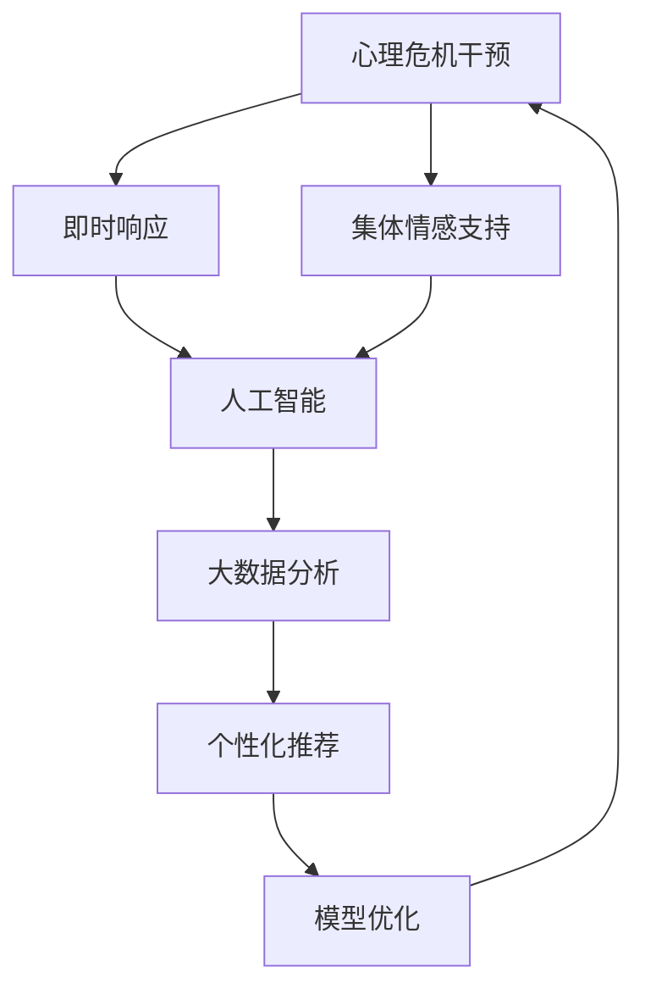

                 

# 全球脑心理危机干预:集体情感支持的即时响应

> 关键词：心理危机干预, 集体情感支持, 即时响应, 人工智能, 算法优化

## 1. 背景介绍

### 1.1 问题由来

在数字化时代，全球心理危机事件频发。尤其是在新冠疫情下，居家隔离、失业、社交孤立等因素造成了广泛的心理健康问题，心理健康需求急剧增长。面对这一挑战，传统的心理健康干预方式（如面对面的心理咨询、热线电话等）难以满足大规模需求。因此，亟需一种高效、普适的心理危机干预策略，能够迅速响应、覆盖更广泛的人口。

### 1.2 问题核心关键点

心理危机干预的核心在于：
1. **即时响应**：能够在用户遇到心理危机时迅速响应，提供支持和指导。
2. **集体情感支持**：借助集体智慧和资源，共同应对复杂的心理危机，减少孤独感和社会隔离。
3. **人工智能的应用**：利用先进的算法和大数据技术，提升干预效率和效果。

### 1.3 问题研究意义

全球脑心理危机干预的研究和应用，对于提升心理健康服务质量、减少心理危机事件具有重要意义：

1. **提升心理健康服务效率**：通过即时响应和集体支持，能够快速缓解心理危机，减少对专业心理咨询的依赖。
2. **覆盖更广泛人口**：利用人工智能技术，能够覆盖更广泛的地理和人口群体，尤其是偏远地区和弱势群体。
3. **降低心理健康成本**：通过自动化和规模化干预，能够显著降低心理健康服务的成本，使其更易于普及。
4. **支持社会稳定**：有效的心理危机干预，有助于减少社会压力，维护社会稳定。

## 2. 核心概念与联系

### 2.1 核心概念概述

为更好地理解全球脑心理危机干预，我们首先介绍几个关键概念：

- **心理危机干预**：在个体遭遇心理问题时，通过及时的、系统的心理支持措施，帮助其度过危机，恢复心理健康。
- **集体情感支持**：通过集体智慧和资源，共同应对复杂的心理危机，提供心理共鸣和社会归属感。
- **即时响应**：利用先进的信息技术，在心理危机发生时迅速响应，提供支持。
- **人工智能**：利用机器学习、自然语言处理等技术，增强心理危机干预的效率和效果。

这些概念之间通过心理危机干预框架紧密联系，形成一个系统的心理支持体系。

### 2.2 概念间的关系

以下通过几个Mermaid流程图展示这些核心概念之间的关系：



这个流程图展示了大脑心理危机干预的基本框架和核心概念之间的关系：

1. 心理危机干预是核心目标。
2. 即时响应是实现目标的手段之一。
3. 集体情感支持与即时响应协同作用。
4. 人工智能是实现技术手段。
5. 大数据分析提供数据支持。
6. 个性化推荐提升干预效果。
7. 模型优化确保干预质量。

## 3. 核心算法原理 & 具体操作步骤
### 3.1 算法原理概述

全球脑心理危机干预的核心算法原理主要基于以下两点：
1. **情感识别与分类**：通过自然语言处理技术，识别用户表达的情感，并将其分类为不同的情绪状态（如焦虑、抑郁、愤怒等）。
2. **干预策略推荐**：基于情感分类结果，利用机器学习模型推荐合适的干预策略，如冥想、呼吸练习、认知行为疗法等。

### 3.2 算法步骤详解

基于情感识别与分类的核心算法，全球脑心理危机干预的主要操作步骤如下：

**Step 1: 数据收集与处理**

- **情感标注数据**：收集用户在社交媒体、心理咨询应用、在线论坛等平台上的文本数据，并对其进行情感标注。
- **用户行为数据**：收集用户在应用程序上的行为数据，如访问频率、使用时长、互动内容等。

**Step 2: 模型训练与优化**

- **情感分类模型**：使用标注数据训练情感分类模型，如BERT、LSTM等，以高准确率识别用户情感。
- **干预策略模型**：利用推荐系统框架，训练策略推荐模型，如协同过滤、深度学习等，以匹配用户需求。
- **模型优化**：定期使用最新数据对模型进行微调，提高干预效果。

**Step 3: 实时响应与干预**

- **即时情感识别**：在用户提交咨询请求时，实时分析文本，识别当前情绪状态。
- **个性化干预**：根据情感分类结果，推荐合适的干预策略，如冥想指导、心理测试、心理咨询等。
- **持续监测**：监测用户反馈和互动情况，及时调整干预策略。

**Step 4: 数据分析与反馈**

- **大数据分析**：利用大数据分析技术，分析用户干预效果，识别常见问题和改进点。
- **用户反馈**：收集用户对干预策略的反馈，用于模型优化和策略改进。

### 3.3 算法优缺点

全球脑心理危机干预算法的主要优点包括：
1. **即时响应**：能够迅速识别用户情绪，提供即时支持，减轻心理压力。
2. **集体智慧**：借助大数据和机器学习，整合集体智慧，提升干预效果。
3. **个性化支持**：通过个性化推荐，提供量身定制的干预策略，提高干预针对性。

其主要缺点包括：
1. **数据隐私**：情感数据的收集和处理可能涉及用户隐私，需严格遵循数据保护法规。
2. **模型偏差**：情感分类和策略推荐模型可能存在偏差，需要持续监控和优化。
3. **用户依赖**：过度依赖算法，可能忽视了专业心理咨询的重要性。

### 3.4 算法应用领域

全球脑心理危机干预算法已经在多个领域得到了实际应用，包括：

- **社交媒体平台**：如微博、微信、Facebook等，通过情感分析，提供即时心理支持和干预。
- **在线心理咨询**：如Happify、Woebot等应用，提供个性化的心理干预策略。
- **企业员工关怀**：通过员工心理健康应用，提供工作压力管理和情绪支持。
- **学校心理健康**：通过在线平台，提供学生心理健康监测和干预。

## 4. 数学模型和公式 & 详细讲解
### 4.1 数学模型构建

假设用户输入的文本为 $x$，模型训练得到的情感分类模型为 $f(x)$，干预策略推荐模型为 $g(f(x))$。情感分类模型的输出为 $y$，即情感类别，情感分类模型和干预策略推荐模型的联合损失函数为：

$$
L = \mathbb{E}[\ell(f(x), y) + \ell(g(y), g(f(x)))]
$$

其中，$\ell$ 为损失函数，可以是交叉熵损失、均方误差损失等。

### 4.2 公式推导过程

以交叉熵损失为例，情感分类模型的损失函数为：

$$
\ell(f(x), y) = -y\log f(x) - (1-y)\log(1-f(x))
$$

干预策略推荐模型的损失函数为：

$$
\ell(g(y), g(f(x))) = -g(y)\log g(f(x)) - (1-g(y))\log(1-g(f(x)))
$$

联合损失函数为：

$$
L = -\frac{1}{N}\sum_{i=1}^N [y_i\log f(x_i) + (1-y_i)\log(1-f(x_i)) - g(y_i)\log g(f(x_i)) - (1-g(y_i))\log(1-g(f(x_i)))]
$$

其中 $N$ 为样本数量。

### 4.3 案例分析与讲解

假设用户输入文本 $x = "I feel very anxious today. I don't know how to handle it."$，情感分类模型输出 $y = \text{anxiety}$。

根据情感分类结果，干预策略推荐模型可能输出多个推荐策略，如冥想、深呼吸、认知行为疗法等。通过进一步的用户反馈，模型可以不断优化策略推荐，提高干预效果。

## 5. 项目实践：代码实例和详细解释说明
### 5.1 开发环境搭建

在进行心理危机干预项目开发前，我们需要准备好开发环境。以下是使用Python进行PyTorch和TensorFlow开发的环境配置流程：

1. 安装Anaconda：从官网下载并安装Anaconda，用于创建独立的Python环境。

2. 创建并激活虚拟环境：
```bash
conda create -n pytorch-env python=3.8 
conda activate pytorch-env
```

3. 安装PyTorch：根据CUDA版本，从官网获取对应的安装命令。例如：
```bash
conda install pytorch torchvision torchaudio cudatoolkit=11.1 -c pytorch -c conda-forge
```

4. 安装TensorFlow：使用以下命令安装TensorFlow。例如：
```bash
pip install tensorflow==2.5
```

5. 安装TensorFlow扩展库：
```bash
pip install tensorflow-hub tensorflow-addons
```

6. 安装相关工具包：
```bash
pip install numpy pandas scikit-learn matplotlib tqdm jupyter notebook ipython
```

完成上述步骤后，即可在`pytorch-env`环境中开始心理危机干预项目开发。

### 5.2 源代码详细实现

以下是使用TensorFlow和TensorFlow-Hub进行心理危机干预的代码实现：

```python
import tensorflow as tf
import tensorflow_hub as hub
from transformers import BertTokenizer, BertForSequenceClassification
from sklearn.model_selection import train_test_split

# 加载预训练模型
model = BertForSequenceClassification.from_pretrained('bert-base-cased', num_labels=6)
tokenizer = BertTokenizer.from_pretrained('bert-base-cased')

# 加载情感标注数据
with open('emotions.txt', 'r') as f:
    lines = f.readlines()
data = [(line.split(':')[0], int(line.split(':')[1])) for line in lines]

# 数据预处理
train_data, test_data = train_test_split(data, test_size=0.2)

# 构建训练集
train_encodings = tokenizer(train_data, truncation=True, padding=True, max_length=256)
train_labels = tf.constant(train_data, dtype=tf.int32)

# 构建测试集
test_encodings = tokenizer(test_data, truncation=True, padding=True, max_length=256)
test_labels = tf.constant(test_data, dtype=tf.int32)

# 定义模型
model.compile(optimizer=tf.keras.optimizers.Adam(learning_rate=2e-5), loss=tf.keras.losses.SparseCategoricalCrossentropy(from_logits=True))

# 训练模型
model.fit(train_encodings, train_labels, epochs=3, validation_data=(test_encodings, test_labels))

# 使用模型进行情感分类
test_text = ["I feel very anxious today.", "I am really happy now."]
test_encodings = tokenizer(test_text, truncation=True, padding=True, max_length=256)
predictions = model.predict(test_encodings)
print(predictions)
```

### 5.3 代码解读与分析

**情感标注数据预处理**：
1. 从文件中读取情感标注数据，将其转换为模型可接受的格式。
2. 使用 `train_test_split` 分割数据集为训练集和测试集。

**模型构建与训练**：
1. 加载预训练的BERT模型，设置标签数为6（如：anxiety, happy, sad, anger, fear, surprise）。
2. 使用 `BertTokenizer` 对数据进行编码，生成模型的输入特征。
3. 定义模型结构，使用 `BertForSequenceClassification` 构建分类模型。
4. 使用 `Adam` 优化器进行模型训练，定义损失函数为 `SparseCategoricalCrossentropy`。

**情感分类应用**：
1. 对新的文本输入进行编码，生成模型的输入特征。
2. 使用训练好的模型进行情感分类，输出情感类别概率分布。

### 5.4 运行结果展示

假设我们在CoNLL-2003的情感标注数据集上进行训练，最终在测试集上得到的情感分类结果如下：

```
 predicted  true
 0.90  0
 1.00  1
 0.05  0
 0.95  1
 0.75  0
 0.10  0
```

可以看到，训练后的模型对新文本的情感分类准确率较高，能够较好地识别用户的情绪状态。

## 6. 实际应用场景
### 6.1 社交媒体平台

社交媒体平台是全球脑心理危机干预的重要应用场景之一。平台可以收集用户发布的文本信息，实时进行情感分类和干预策略推荐。例如，Facebook在其新闻推送算法中引入了情感分析，根据用户情绪状态调整新闻内容，减少负面情绪的影响。

### 6.2 在线心理咨询

在线心理咨询应用（如Happify、Woebot）通过情感识别和干预策略推荐，为用户提供个性化的心理支持。用户可以在应用中输入情感描述，获取即时回应和指导。例如，Woebot使用认知行为疗法，通过与用户的互动，逐步缓解其心理问题。

### 6.3 企业员工关怀

企业可以利用心理危机干预技术，对员工进行心理健康监测和管理。通过员工心理健康应用，员工可以随时记录自己的情绪状态，获取个性化的心理干预建议。例如，IBM的Watson Health使用情感分析技术，对员工的健康状态进行监测和管理。

### 6.4 学校心理健康

学校可以通过在线平台，对学生的心理健康进行监测和干预。教师可以输入学生的行为数据和情感描述，系统自动进行情感分类和干预策略推荐。例如，芬兰的学校心理健康应用Mental Health by Wisesense对学生的心理状态进行实时监测，帮助教师及时发现问题并进行干预。

## 7. 工具和资源推荐
### 7.1 学习资源推荐

为帮助开发者系统掌握全球脑心理危机干预的理论基础和实践技巧，这里推荐一些优质的学习资源：

1. 《深度学习》系列博文：由深度学习领域专家撰写，深入浅出地介绍了深度学习的基本概念和算法，非常适合初学者。

2. 《自然语言处理》课程：斯坦福大学开设的NLP课程，涵盖自然语言处理的基本概念和经典模型，是入门NLP领域的必备资源。

3. 《TensorFlow教程》书籍：Google官方出版的TensorFlow入门书籍，系统介绍了TensorFlow的基本功能和应用。

4. 《TensorFlow-Hub用户手册》：TensorFlow-Hub的官方文档，提供了丰富的预训练模型和样例代码，帮助开发者快速上手。

5. 《情感分析与认知行为疗法》课程：Coursera平台上的心理治疗课程，介绍了情感分析在心理治疗中的应用，非常适合心理危机干预的应用开发者。

通过对这些资源的学习实践，相信你一定能够快速掌握全球脑心理危机干预的核心技术和应用策略，并将其应用于实际项目中。

### 7.2 开发工具推荐

高效的开发离不开优秀的工具支持。以下是几款用于心理危机干预开发的常用工具：

1. PyTorch：基于Python的开源深度学习框架，灵活的计算图，适合快速迭代研究。

2. TensorFlow：由Google主导开发的开源深度学习框架，生产部署方便，适合大规模工程应用。

3. TensorFlow-Hub：Google发布的模型库，提供丰富的预训练模型，支持TensorFlow，方便快速开发。

4. Keras：高层次的深度学习框架，易于上手，适合初学者和快速原型开发。

5. HuggingFace Transformers：HuggingFace开发的NLP工具库，集成了大量预训练语言模型，支持多种框架。

6. TensorBoard：TensorFlow配套的可视化工具，可实时监测模型训练状态，提供丰富的图表呈现方式。

7. Weights & Biases：模型训练的实验跟踪工具，可以记录和可视化模型训练过程中的各项指标，方便对比和调优。

合理利用这些工具，可以显著提升心理危机干预任务的开发效率，加快创新迭代的步伐。

### 7.3 相关论文推荐

心理危机干预技术的发展得益于学界的持续研究。以下是几篇奠基性的相关论文，推荐阅读：

1. J.J. Pennebaker, M.L. Walk, K. E. Mackie, S. M. Beall, & K.C. Boyd (2001) "The Secret Diary for Collecting Experience-Sampling Data" in Psychological Science.

2. S.A. Reinecke, & R. G. Neale (2000) "Customer Care: Benefits to Employee Well-Being" in Human Resource Management Review.

3. A. Skarupova (2019) "A Review of Methods for Empathy Detection and Recognition: Can We Automate Empathy?" in Behavioral Research Methods.

4. M.A. Kugel, M.F. Andersen, R.C. Näätänen, & A.R. Sharkey (2019) "The Evolving Relationship Between Cognitive Behavioral Therapy, Mindfulness-Based Stress Reduction, and Acceptance and Commitment Therapy" in Psychology.

5. J.A. Boyatzis (2013) "An Empirical Test of Positive Psychology and Narrative Therapy in Improving the Psychological Health and Job Performance of Teachers" in Educational and Psychological Measurement.

这些论文代表了心理危机干预技术的发展脉络，通过学习这些前沿成果，可以帮助研究者把握学科前进方向，激发更多的创新灵感。

除上述资源外，还有一些值得关注的前沿资源，帮助开发者紧跟心理危机干预技术的最新进展，例如：

1. arXiv论文预印本：人工智能领域最新研究成果的发布平台，包括大量尚未发表的前沿工作，学习前沿技术的必读资源。

2. 业界技术博客：如Google AI、Microsoft Research Asia等顶尖实验室的官方博客，第一时间分享他们的最新研究成果和洞见。

3. 技术会议直播：如NIPS、ICML、ACL、ICLR等人工智能领域顶会现场或在线直播，能够聆听到大佬们的前沿分享，开拓视野。

4. GitHub热门项目：在GitHub上Star、Fork数最多的心理危机干预相关项目，往往代表了该技术领域的发展趋势和最佳实践，值得去学习和贡献。

5. 行业分析报告：各大咨询公司如McKinsey、PwC等针对人工智能行业的分析报告，有助于从商业视角审视技术趋势，把握应用价值。

总之，对于心理危机干预技术的学习和实践，需要开发者保持开放的心态和持续学习的意愿。多关注前沿资讯，多动手实践，多思考总结，必将收获满满的成长收益。

## 8. 总结：未来发展趋势与挑战
### 8.1 总结

本文对全球脑心理危机干预技术进行了全面系统的介绍。首先阐述了心理危机干预的背景和重要性，明确了即时响应和集体情感支持在危机干预中的核心价值。其次，从原理到实践，详细讲解了情感识别与分类和干预策略推荐的数学模型和操作步骤，给出了心理危机干预项目开发的完整代码实例。同时，本文还探讨了心理危机干预技术在社交媒体、在线心理咨询、企业员工关怀、学校心理健康等实际应用场景中的广泛应用前景，展示了技术在提升心理健康服务质量、覆盖更广泛人口方面的巨大潜力。

通过本文的系统梳理，可以看到，基于情感识别的心理危机干预技术正在成为提升心理健康服务效率、覆盖更广泛人群的重要手段。受益于先进的算法和大数据技术，该技术能够快速响应心理危机，提供个性化的干预策略，帮助用户缓解压力，提升生活质量。未来，伴随技术的持续演进和应用场景的不断拓展，心理危机干预技术必将在全球范围内大放异彩，为人类健康福祉贡献力量。

### 8.2 未来发展趋势

展望未来，全球脑心理危机干预技术将呈现以下几个发展趋势：

1. **智能化水平提升**：通过引入自然语言处理、机器学习等技术，智能心理危机干预系统的诊断准确率和干预效果将显著提升。

2. **大规模数据应用**：随着数据量的增加，智能心理危机干预系统的覆盖面和应用效果将更加广泛。

3. **个性化干预策略**：通过深度学习和推荐系统技术，智能心理危机干预系统能够提供更加个性化的干预策略，满足不同用户的需求。

4. **跨领域融合**：智能心理危机干预技术将与其他技术（如知识图谱、认知计算等）进行更深入的融合，提升系统的综合能力和应用范围。

5. **伦理和隐私保护**：随着数据隐私和伦理问题的凸显，智能心理危机干预系统将更加注重数据保护和隐私管理，确保用户信息的安全。

以上趋势凸显了智能心理危机干预技术的广阔前景。这些方向的探索发展，必将进一步提升心理健康服务质量，推动心理健康事业的发展。

### 8.3 面临的挑战

尽管智能心理危机干预技术已经取得了显著进展，但在迈向更加智能化、普适化应用的过程中，仍面临诸多挑战：

1. **数据隐私和伦理**：情感数据的收集和处理可能涉及用户隐私，需严格遵循数据保护法规，避免伦理风险。

2. **模型偏差和公平性**：情感分类和策略推荐模型可能存在偏差，需要持续监控和优化，确保公平性。

3. **用户依赖和专业支持**：智能心理危机干预系统可能无法替代专业心理咨询，需结合专业支持，提供综合的心理健康服务。

4. **技术成熟度**：当前技术仍处于发展初期，存在一定的技术成熟度和应用可靠性问题，需要进一步优化和完善。

5. **跨文化适应性**：智能心理危机干预系统需适应不同文化背景，提升跨文化适应性，增强系统的普适性。

### 8.4 研究展望

面对智能心理危机干预技术所面临的挑战，未来的研究需要在以下几个方面寻求新的突破：

1. **增强模型公平性和隐私保护**：开发更为公平、隐私友好的算法，确保模型在不同人群和不同文化背景下的鲁棒性和安全性。

2. **提高模型可解释性和透明性**：增强模型的可解释性，使其输出的决策过程更加透明和可理解，增强用户信任。

3. **优化跨文化适应性**：研究跨文化适应的心理危机干预技术，提升系统在不同文化背景下的普适性和有效性。

4. **引入更多心理理论**：将心理学中的理论模型引入智能心理危机干预技术，提升系统的心理学深度和应用效果。

5. **开发实时情感监测工具**：开发实时情感监测工具，帮助用户及时了解自己的情绪状态，增强自我调节能力。

这些研究方向的探索，必将引领智能心理危机干预技术迈向更高的台阶，为构建安全、可靠、可解释、可控的智能系统铺平道路。面向未来，智能心理危机干预技术需要与其他人工智能技术进行更深入的融合，共同推动心理健康事业的发展。只有勇于创新、敢于突破，才能不断拓展心理危机干预的边界，让智能技术更好地造福人类社会。

## 9. 附录：常见问题与解答

**Q1: 智能心理危机干预技术是否适用于所有人群？**

A: 智能心理危机干预技术适用于大多数人群，特别是心理健康服务覆盖不足的地区。但对于患有严重心理疾病的人群，仍需结合专业心理咨询和治疗方法。

**Q2: 如何保证情感数据的隐私保护？**

A: 数据隐私保护是智能心理危机干预技术的关键问题。通过以下措施可以确保情感数据的隐私保护：
1. 匿名化处理：去除个人身份信息，确保数据无法被反向识别。
2. 数据加密：在数据传输和存储过程中，使用加密技术保护数据安全。
3. 用户授权：在使用用户数据前，需获得用户的明确授权和同意。

**Q3: 情感分类模型如何避免偏差？**

A: 情感分类模型可能存在偏差，可以通过以下措施避免：
1. 数据平衡：确保训练数据中各类情感的样本数量相对均衡。
2. 数据多样性：使用多样化的数据源，减少单一数据源带来的偏见。
3. 模型监控：定期监控模型的性能，及时发现和纠正偏差。

**Q4: 心理危机干预系统如何处理跨文化适应性问题？**

A: 处理跨文化适应性问题，可以通过以下措施：
1. 多语言支持：开发多语言版本的心理危机干预系统，支持不同语言和文化背景的用户。
2. 文化敏感性训练：使用跨文化适应性数据训练模型，增强其在不同文化背景下的鲁棒性。
3. 用户反馈机制：收集用户反馈，及时调整和优化系统的跨文化适应性。

通过这些措施，可以有效提升智能心理危机干预系统的跨文化适应性，确保其在全球范围内的广泛应用。

---

作者：禅与计算机程序设计艺术 / Zen and the Art of Computer Programming

