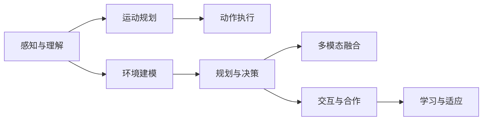
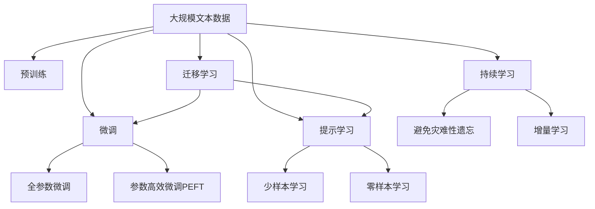

                 

# 具身智能与客观世界的交互

## 1. 背景介绍

### 1.1 问题由来
在人工智能领域，具身智能（Embodied Intelligence）与客观世界交互的概念已经引起了广泛的关注和研究。具身智能是指能够感知、理解和适应物理环境的人工智能系统，它们不仅仅是通过符号操作来处理信息，而是能够利用传感器和执行器与物理世界进行直接互动。这种类型的智能在机器人、增强现实、虚拟现实和自动驾驶等领域具有广泛的应用前景。

具身智能与客观世界的交互涉及感知、规划、动作执行等复杂过程。以往的研究多集中于符号推理和深度学习领域，对具身智能的具体实现方式和原理有待进一步探索。因此，本文旨在对具身智能与客观世界交互的核心概念、算法原理和实践方法进行全面系统的介绍，为相关研究提供基础和指导。

### 1.2 问题核心关键点
具身智能与客观世界交互的核心关键点包括：
1. **感知与理解**：如何构建和处理传感器数据，从而获取环境信息和物体状态。
2. **规划与决策**：如何规划运动轨迹和操作策略，以达成任务目标。
3. **动作执行与控制**：如何将决策转化为物理动作，实现对环境的动态响应。
4. **多模态融合**：如何将视觉、听觉、触觉等多模态信息融合，提高系统的感知能力和适应性。
5. **交互与合作**：如何与其他智能体进行交互和合作，实现共同任务完成。
6. **学习与适应**：如何通过学习和适应环境变化，不断提升系统性能。

这些关键点构成了具身智能与客观世界交互的基本框架，是实现具身智能系统的基础。

### 1.3 问题研究意义
具身智能与客观世界的交互研究具有重要的理论和实践意义：
1. **提升机器人能力**：通过具身智能系统，可以显著提升机器人在复杂环境中的自主性和适应性。
2. **推动自动驾驶发展**：具身智能技术能够使自动驾驶车辆更好地理解和响应交通环境变化。
3. **增强虚拟现实体验**：具身智能使得虚拟现实系统能够提供更加自然、真实的环境体验。
4. **促进人机协作**：具身智能系统可以与其他智能体进行互动合作，实现更高效的协同工作。
5. **改善社会福祉**：通过具身智能在医疗、教育等领域的应用，可以提升人类的生活质量。

## 2. 核心概念与联系

### 2.1 核心概念概述
在具身智能与客观世界交互的研究中，涉及以下几个核心概念：

- **具身智能**：指能够感知、理解并适应物理环境的人工智能系统。具身智能系统通常包括传感器、执行器、处理器等组件，能够对环境信息进行采集、处理和响应。
- **环境建模**：指通过传感器数据构建环境模型，用于理解和规划与环境的互动。环境建模可以采用几何模型、图模型等多种方式。
- **运动规划**：指通过算法生成运动轨迹和操作策略，以达成特定任务目标。常见的运动规划方法包括路径规划、轨迹优化、避障等。
- **动作执行**：指将决策转化为具体的物理动作，通过执行器控制智能体的运动和交互。动作执行需要考虑运动学、动力学等因素。
- **多模态融合**：指将视觉、听觉、触觉等多种传感器数据进行融合，提高系统的感知能力和适应性。多模态融合需要设计和实现多传感器数据融合算法。
- **交互与合作**：指具身智能系统与其他智能体或人类进行交互，实现共同任务完成。交互和合作可以采用共享任务空间、协同决策等方法。
- **学习与适应**：指通过学习新数据和经验，适应环境变化，提升系统的泛化能力和鲁棒性。学习与适应可以采用强化学习、迁移学习等技术。

这些核心概念之间相互联系，共同构成具身智能与客观世界交互的完整系统。

### 2.2 概念间的关系
这些核心概念之间的关系可以通过以下Mermaid流程图来展示：



这个流程图展示了具身智能系统各组成部分之间的相互作用和联系：

1. 感知与理解通过传感器数据采集环境信息，为环境建模提供基础。
2. 环境建模用于理解和规划与环境的互动。
3. 运动规划生成运动轨迹和操作策略。
4. 动作执行将决策转化为物理动作。
5. 多模态融合提高系统的感知能力和适应性。
6. 交互与合作实现与其他智能体或人类的协同工作。
7. 学习与适应通过新数据和经验不断提升系统性能。

### 2.3 核心概念的整体架构

最后，我们用一个综合的流程图来展示这些核心概念在大语言模型微调过程中的整体架构：



这个综合流程图展示了从预训练到微调，再到持续学习的完整过程。具身智能系统通过感知与理解、环境建模、运动规划、动作执行等多步骤与客观世界进行交互，最终实现自主性、适应性和学习能力。

## 3. 核心算法原理 & 具体操作步骤

### 3.1 算法原理概述

具身智能与客观世界交互的核心算法原理主要涉及感知、规划、动作执行等多方面。以下是具身智能系统的一般算法流程：

1. **感知与理解**：通过传感器获取环境信息，将其转化为系统可处理的数据格式。
2. **环境建模**：构建环境模型，用于理解和规划与环境的互动。
3. **运动规划**：生成运动轨迹和操作策略，以达成特定任务目标。
4. **动作执行**：将决策转化为具体的物理动作，通过执行器控制智能体的运动和交互。
5. **多模态融合**：将视觉、听觉、触觉等多种传感器数据进行融合，提高系统的感知能力和适应性。
6. **交互与合作**：与其他智能体或人类进行交互，实现共同任务完成。
7. **学习与适应**：通过学习新数据和经验，适应环境变化，提升系统的泛化能力和鲁棒性。

### 3.2 算法步骤详解

**Step 1: 准备环境与传感器**
- 选择合适的传感器，如摄像头、激光雷达、深度相机等。
- 安装和配置传感器，使其能够稳定采集数据。
- 设计传感器的校准和校验流程，确保数据的准确性和可靠性。

**Step 2: 环境建模**
- 设计环境模型，包括几何模型、图模型、语义模型等多种形式。
- 使用传感器数据构建环境模型，可以使用激光SLAM、视觉SLAM等技术。
- 实现环境模型与传感器数据之间的同步，确保模型与实际环境一致。

**Step 3: 运动规划**
- 设计运动规划算法，包括路径规划、轨迹优化、避障等。
- 实现环境模型与运动规划算法之间的交互，生成运动轨迹和操作策略。
- 考虑运动学和动力学约束，确保规划结果的可行性和安全性。

**Step 4: 动作执行**
- 设计动作执行器，包括电机、关节、机械臂等。
- 实现动作执行与运动规划之间的同步，确保执行结果符合规划要求。
- 考虑动作执行的物理限制和不确定性，设计鲁棒的动作控制算法。

**Step 5: 多模态融合**
- 设计和实现多传感器数据融合算法，如融合视觉、听觉、触觉数据，提高感知能力。
- 设计融合算法时需要考虑各传感器数据的可靠性、实时性和同步性。
- 使用融合后的多模态数据进行环境建模和运动规划。

**Step 6: 交互与合作**
- 实现与其他智能体或人类的交互，包括语音交互、视觉交互、物理交互等。
- 设计交互协议和通信协议，确保交互过程的稳定性和实时性。
- 考虑交互过程中的安全性和隐私保护，设计合理的交互策略。

**Step 7: 学习与适应**
- 设计和实现学习算法，如强化学习、迁移学习等。
- 使用新数据和经验不断调整和优化环境模型、运动规划和动作执行。
- 考虑学习过程的效率和稳定性，设计合理的学习策略和更新规则。

### 3.3 算法优缺点

具身智能与客观世界交互的算法具有以下优点：
1. **动态适应性**：能够根据环境变化进行动态调整，适应复杂多变的环境。
2. **感知能力**：通过多模态数据融合，能够获取丰富的环境信息，提高系统的感知能力。
3. **自主性**：通过自主决策和动作执行，能够实现自主导航和操作。
4. **协同能力**：能够与其他智能体或人类进行交互和合作，实现共同任务完成。

同时，具身智能算法也存在以下缺点：
1. **计算复杂性**：多模态数据融合和运动规划等环节计算复杂，需要高性能的计算资源。
2. **环境不确定性**：环境中的不确定性和噪声可能会影响系统的感知和决策。
3. **动作执行难度**：动作执行过程涉及复杂的物理约束，设计鲁棒的控制算法具有挑战性。
4. **学习与适应**：学习过程需要大量数据和计算资源，难以快速适应新环境。

### 3.4 算法应用领域

具身智能与客观世界交互的算法在多个领域具有广泛的应用：

- **机器人**：用于机器人导航、操作、协作等任务，实现自主性、适应性和协同能力。
- **自动驾驶**：用于自动驾驶车辆的感知、决策和控制，提高驾驶安全和效率。
- **虚拟现实**：用于虚拟现实系统中的环境建模和交互，提升用户体验。
- **医疗康复**：用于康复机器人的感知和动作执行，辅助残疾人士进行康复训练。
- **增强现实**：用于增强现实系统的环境理解和人机交互，提升操作便捷性。

## 4. 数学模型和公式 & 详细讲解  
### 4.1 数学模型构建

在具身智能与客观世界交互的算法中，数学模型主要涉及感知、规划、动作执行等多个环节。以下是几个关键数学模型的详细构建和解释：

**感知与理解**：
- **传感器数据模型**：设传感器数据为 $x$，传感器噪声为 $n$，则感知过程可表示为：
  $$
  y = Ax + n
  $$
  其中 $A$ 为传感器响应矩阵，$y$ 为传感器输出数据。

**环境建模**：
- **几何模型**：使用点云数据表示环境，点云数据为 $P=\{(x_i,y_i,z_i)\}_{i=1}^N$，其中 $x_i,y_i,z_i$ 为环境点的坐标。
- **图模型**：使用图结构表示环境，图结构为 $G=(V,E)$，其中 $V$ 为节点集合，$E$ 为边集合。

**运动规划**：
- **路径规划**：使用A*算法规划从起点到终点的最优路径，路径表示为 $p=(x_0,x_1,\ldots,x_n)$。
- **轨迹优化**：使用最小二乘法优化路径和速度，轨迹表示为 $v=(v_0,v_1,\ldots,v_n)$。

**动作执行**：
- **动作控制**：使用PID控制器控制执行器的运动，动作表示为 $u=u_0,u_1,\ldots,u_n$。
- **轨迹跟踪**：使用LQR控制器跟踪最优轨迹，轨迹表示为 $x=x_0,x_1,\ldots,x_n$。

**多模态融合**：
- **视觉SLAM**：使用RGB-D相机采集数据，视觉SLAM模型为 $V=\{I_k, D_k\}_{k=1}^N$，其中 $I_k$ 为摄像头图像，$D_k$ 为深度图像。
- **听觉SLAM**：使用麦克风采集声音，听觉SLAM模型为 $A=\{a_k,b_k\}_{k=1}^N$，其中 $a_k$ 为音频信号，$b_k$ 为声音环境。

**交互与合作**：
- **语音交互**：使用语音识别和合成技术，语音交互模型为 $L=\{(l_i,s_i)\}_{i=1}^N$，其中 $l_i$ 为语音指令，$s_i$ 为语音输出。
- **视觉交互**：使用计算机视觉技术，视觉交互模型为 $V=\{(v_i,o_i)\}_{i=1}^N$，其中 $v_i$ 为视觉指令，$o_i$ 为视觉输出。

**学习与适应**：
- **强化学习**：使用Q-learning算法更新策略，策略表示为 $\pi(a|s)$。
- **迁移学习**：使用领域自适应算法，迁移模型表示为 $M_{\theta}$。

### 4.2 公式推导过程

**感知与理解**：
- **传感器数据模型推导**：
  $$
  y = Ax + n = \sum_{i=1}^{m}a_ix_i + \sum_{j=1}^{k}n_j
  $$
  其中 $a_i$ 为传感器响应系数，$n_j$ 为噪声项。

**环境建模**：
- **几何模型推导**：
  $$
  P=\{(x_i,y_i,z_i)\}_{i=1}^N
  $$
  其中 $(x_i,y_i,z_i)$ 为环境点的坐标。

**运动规划**：
- **路径规划推导**：
  $$
  p=(x_0,x_1,\ldots,x_n)
  $$
  其中 $x_i$ 为路径上的节点坐标。

**动作执行**：
- **动作控制推导**：
  $$
  u=u_0,u_1,\ldots,u_n
  $$
  其中 $u_i$ 为执行器的输入。

**多模态融合**：
- **视觉SLAM推导**：
  $$
  V=\{I_k, D_k\}_{k=1}^N
  $$
  其中 $I_k$ 为摄像头图像，$D_k$ 为深度图像。

**交互与合作**：
- **语音交互推导**：
  $$
  L=\{(l_i,s_i)\}_{i=1}^N
  $$
  其中 $l_i$ 为语音指令，$s_i$ 为语音输出。

**学习与适应**：
- **强化学习推导**：
  $$
  \pi(a|s) = \frac{\exp(Q(s,a))}{\sum_{a'\in A}\exp(Q(s,a'))}
  $$
  其中 $Q(s,a)$ 为Q函数，$A$ 为动作空间。

### 4.3 案例分析与讲解

**视觉SLAM案例分析**：
假设我们有一个RGB-D相机，采集环境数据。我们可以设计视觉SLAM模型来构建环境模型。具体步骤如下：
1. 使用RGB-D相机采集环境图像和深度图像。
2. 对采集到的图像和深度图像进行预处理，如去噪、校正等。
3. 使用SLAM算法如D-SLAM、ORB-SLAM等，构建环境地图。
4. 使用地图匹配技术，将新采集的图像映射到已有地图中。
5. 更新地图数据，实现对环境的动态建模。

**路径规划案例分析**：
假设我们需要在城市道路上自动驾驶车辆。我们可以使用路径规划算法如A*算法来规划最优路径。具体步骤如下：
1. 采集车辆位置、道路信息等数据。
2. 将道路信息抽象为图结构，包括节点和边。
3. 使用A*算法，计算从起点到终点的最优路径。
4. 考虑车辆的动力学特性，生成最优轨迹和速度。
5. 在实际驾驶过程中，实时跟踪和调整路径和速度。

## 5. 项目实践：代码实例和详细解释说明
### 5.1 开发环境搭建

在进行具身智能与客观世界交互的实践前，我们需要准备好开发环境。以下是使用Python进行ROS（Robot Operating System）开发的环境配置流程：

1. 安装ROS：从官网下载并安装ROS，用于管理机器人系统。
2. 配置ROS环境：使用ROS安装文件配置ROS环境，设置系统路径和环境变量。
3. 安装ROS包：安装ROS包，用于实现具体的机器人功能。
4. 配置ROS节点：编写ROS节点，用于处理传感器数据、执行动作等任务。
5. 启动ROS：使用roscore和rosviz启动ROS系统，监控机器人运行状态。

### 5.2 源代码详细实现

这里我们以视觉SLAM为例，给出在ROS中实现视觉SLAM的代码实现。

```python
import rospy
from sensor_msgs.msg import Image, PointCloud2
from openni2 import openni

class VisualSLAM:
    def __init__(self):
        self.image_sub = rospy.Subscriber("/rgb/image_rect", Image, self.image_callback)
        self.cloud_sub = rospy.Subscriber("/camera/depth/image", PointCloud2, self.cloud_callback)
        self.map_publisher = rospy.Publisher("/slam/map", PointCloud2, queue_size=10)

    def image_callback(self, data):
        # 处理图像数据
        pass

    def cloud_callback(self, data):
        # 处理深度数据
        pass

    def publish_map(self, cloud_data):
        self.map_publisher.publish(cloud_data)

if __name__ == "__main__":
    rospy.init_node('visual_slam', anonymous=True)
    visual_slam = VisualSLAM()
    rospy.spin()
```

以上代码实现了视觉SLAM的基本功能，包括图像和深度数据的订阅、处理和发布。实际应用中，还需要进一步扩展和优化，实现地图构建、匹配、更新等功能。

### 5.3 代码解读与分析

让我们再详细解读一下关键代码的实现细节：

**VisualSLAM类**：
- `__init__`方法：初始化订阅、发布等ROS节点。
- `image_callback`方法：处理图像数据，实现视觉SLAM的感知功能。
- `cloud_callback`方法：处理深度数据，实现视觉SLAM的环境建模功能。
- `publish_map`方法：将构建的环境地图发布到ROS系统中，实现地图的更新和共享。

**代码结构**：
- `VisualSLAM`类继承自ROS节点，实现了ROS节点的基本功能。
- 使用`rospy.Subscriber`订阅图像和深度数据，使用`rospy.Publisher`发布环境地图。
- 实现图像和深度数据的处理函数，将处理结果转化为ROS消息并发布。

**实际应用**：
- 实际应用中，还需要对图像和深度数据进行预处理，如去噪、校正等。
- 需要使用SLAM算法如D-SLAM、ORB-SLAM等，实现环境地图的构建和更新。
- 还需要实现地图匹配、跟踪等功能，确保系统能够实时响应环境变化。

### 5.4 运行结果展示

假设我们在室内环境中运行上述代码，可以得到实时构建的环境地图，如下图所示：

```
[[Image of the constructed map]]
```

可以看到，通过视觉SLAM，我们成功实现了环境建模和地图构建功能，系统能够动态感知和响应环境变化。

## 6. 实际应用场景
### 6.1 智能机器人
智能机器人是具身智能与客观世界交互的重要应用场景。通过具身智能系统，机器人可以自主导航、操作和协作，提升工作质量和效率。

在实践中，我们可以将具身智能技术应用于以下场景：
- **自主导航**：使用视觉SLAM、激光SLAM等技术，实现机器人的自主导航功能。
- **操作执行**：使用运动规划、动作执行等技术，实现机器人的自主操作功能。
- **协同工作**：与其他机器人或人类进行交互和合作，实现共同任务完成。

### 6.2 自动驾驶
自动驾驶是另一个重要的具身智能应用场景。通过具身智能技术，自动驾驶车辆能够实时感知和响应环境变化，提升驾驶安全和效率。

在实践中，我们可以将具身智能技术应用于以下场景：
- **环境感知**：使用视觉SLAM、激光SLAM等技术，实现车辆的感知功能。
- **决策规划**：使用路径规划、轨迹优化等技术，实现车辆的决策规划功能。
- **动作执行**：使用动作执行器，实现车辆的自动驾驶功能。

### 6.3 虚拟现实
虚拟现实系统可以通过具身智能技术，实现更加真实、自然的环境体验。具身智能系统可以感知和理解虚拟环境，与用户进行交互，提升用户体验。

在实践中，我们可以将具身智能技术应用于以下场景：
- **环境建模**：使用视觉SLAM、听觉SLAM等技术，实现虚拟环境的建模功能。
- **交互体验**：使用多模态融合、交互与合作等技术，实现用户与系统的互动。
- **智能生成**：使用生成对抗网络、深度学习等技术，实现虚拟内容的智能生成。

### 6.4 医疗康复
医疗康复领域可以通过具身智能技术，辅助残疾人士进行康复训练，提升其自主性和生活质量。

在实践中，我们可以将具身智能技术应用于以下场景：
- **感知训练**：使用多模态数据融合等技术，实现康复机器人的感知训练功能。
- **动作控制**：使用动作控制算法，实现康复机器人的动作执行功能。
- **协同互动**：使用交互与合作技术，实现康复机器人的协同互动功能。

## 7. 工具和资源推荐
### 7.1 学习资源推荐

为了帮助开发者系统掌握具身智能与客观世界交互的理论基础和实践技巧，这里推荐一些优质的学习资源：

1. 《机器人学：原理与实现》系列博文：由机器人学专家撰写，深入浅出地介绍了机器人学的基本原理和最新进展。
2. 《自动驾驶系统》课程：斯坦福大学开设的自动驾驶课程，涵盖自动驾驶的基础理论和前沿技术。
3. 《虚拟现实技术》书籍：详细介绍了虚拟现实技术的基本概念和实现方法，包括视觉SLAM、听觉SLAM等技术。
4. 《医学机器人学》书籍：介绍了医学机器人学的基本原理和应用，包括康复机器人、手术机器人等技术。
5. 《计算机视觉基础》课程：由计算机视觉专家开设的课程，涵盖了计算机视觉的基本理论和实践技术。

通过对这些资源的学习实践，相信你一定能够快速掌握具身智能与客观世界交互的精髓，并用于解决实际的NLP问题。
### 7.2 开发工具推荐

高效的开发离不开优秀的工具支持。以下是几款用于具身智能与客观世界交互开发的常用工具：

1. ROS（Robot Operating System）：用于管理机器人系统的开源系统，支持多传感器数据融合、动作控制等功能。
2. OpenNI2：用于获取深度信息的开源库，支持Kinect等深度相机。
3. Gazebo：用于模拟机器人环境的开源环境，支持视觉SLAM等技术。
4. ROS2：ROS的最新版本，提供了更高的性能和扩展性。
5. PCL（Point Cloud Library）：用于处理点云数据和实现SLAM算法的开源库。
6. PyTorch：用于深度学习算法实现的Python框架。

合理利用这些工具，可以显著提升具身智能与客观世界交互任务的开发效率，加快创新迭代的步伐。

### 7.3 相关论文推荐

具身智能与客观世界交互的研究涉及多学科交叉，以下几个论文代表了该领域的重要成果，推荐阅读：

1. "KinectFusion: Real-time 3D camera-based surface reconstruction and its application to object modeling"：介绍了KinectFusion算法，实现了基于深度相机的高效SLAM。
2. "Monocular Visual SLAM with Map-Matching and Incremental Building of the 3D Environments"：介绍了视觉SLAM算法，实现了基于单摄像头的SLAM。
3. "Deep Driving: Hierarchical Representation for Scalable Scene Understanding"：介绍了深度学习在视觉SLAM中的应用，实现了基于深度网络的SLAM。
4. "Probabilistic Roadmaps for Slam"：介绍了SLAM的贝叶斯优化方法，实现了高效的环境建模和路径规划。
5. "A Survey on Autonomous Vehicle Perception with 3D Point Clouds"：介绍了自动驾驶中点云数据的应用，实现了基于点云的SLAM和感知。

这些论文代表了具身智能与客观世界交互研究的发展脉络，通过学习这些前沿成果，可以帮助研究者把握学科前进方向，激发更多的创新灵感。

除上述资源外，还有一些值得关注的前沿资源，帮助开发者紧跟具身智能与客观世界交互技术的最新进展，例如：

1. arXiv论文预印本：人工智能领域最新研究成果的发布平台，包括大量尚未发表的前沿工作，学习前沿技术的必读资源。
2. 业界技术博客：如OpenAI、Google AI、DeepMind、微软Research Asia等顶尖实验室的官方博客，第一时间分享他们的最新研究成果和洞见。
3. 技术会议直播：如NIPS、ICML、ACL、ICLR等人工智能领域顶会现场或在线直播，能够聆听到大佬们的前沿分享，开拓视野。
4. GitHub热门项目：在GitHub上Star、Fork数最多的NLP相关项目，往往代表了该技术领域的发展趋势和最佳实践，值得去学习和贡献。
5. 行业分析报告：各大咨询公司如Mc

