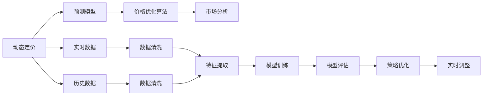
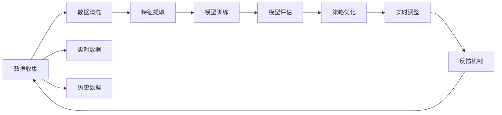

                 

# 动态定价：AI在价格优化中的应用

> 关键词：动态定价, 价格优化, 人工智能, 预测模型, 算法, 市场分析

## 1. 背景介绍

### 1.1 问题由来
在数字化转型的大背景下，企业面临着复杂多变的市场环境，如何精准定价成为一项至关重要的挑战。传统的定价方法往往依赖于人工经验或简单的统计模型，难以应对实时市场动态和个性化需求。而随着人工智能(AI)技术的发展，动态定价成为可能，AI可以通过对海量数据进行分析，实时动态调整价格策略，为企业带来更大的竞争优势和市场收益。

### 1.2 问题核心关键点
动态定价的本质是利用AI技术，结合市场数据和用户行为，实时预测和优化商品价格。核心点包括：

- 预测模型：基于历史和实时数据，构建预测模型，实时预测价格趋势和需求变化。
- 价格优化算法：根据预测结果，动态调整价格，实现最大化收益或特定业务目标。
- 市场分析：通过大数据分析，识别市场趋势和用户偏好，为价格策略提供参考。

### 1.3 问题研究意义
动态定价AI技术对于提升企业竞争力、增加收益和优化客户体验具有重要意义：

1. **提升竞争力**：实时动态定价能够迅速应对市场变化，及时调整价格，避免因价格波动带来的竞争劣势。
2. **增加收益**：基于数据驱动的定价策略，能更精准地匹配市场需求，提升销售额和利润率。
3. **优化客户体验**：通过个性化定价，更好地满足用户需求，提高客户满意度和忠诚度。
4. **自动化决策**：减少人工干预，降低运营成本，提升决策效率。
5. **数据驱动决策**：利用大数据和AI技术，更科学地制定定价策略，减少决策失误。

## 2. 核心概念与联系

### 2.1 核心概念概述

动态定价涉及多个核心概念，包括：

- **动态定价**：利用AI技术，实时分析市场数据和用户行为，动态调整商品价格。
- **预测模型**：基于历史和实时数据，构建预测模型，预测未来价格变化和需求趋势。
- **价格优化算法**：根据预测结果，动态调整价格，实现收益最大化或特定业务目标。
- **市场分析**：通过大数据分析，识别市场趋势和用户偏好，为价格策略提供参考。

这些概念之间存在着紧密的联系，形成一个完整的动态定价系统。

### 2.2 概念间的关系

这些核心概念之间的逻辑关系可以通过以下Mermaid流程图来展示：



这个流程图展示了动态定价系统的主要流程：

1. 动态定价系统首先收集实时数据和历史数据。
2. 对数据进行清洗和特征提取，构建可用于模型训练的数据集。
3. 训练预测模型，预测未来的价格变化和需求趋势。
4. 应用价格优化算法，根据预测结果实时调整价格。
5. 市场分析模块实时监测市场趋势和用户行为，为定价策略提供参考。

### 2.3 核心概念的整体架构

最终，我们可以得到一个完整的动态定价系统的架构图：



这个架构图展示了动态定价系统的核心流程和各个模块之间的互动关系。

## 3. 核心算法原理 & 具体操作步骤

### 3.1 算法原理概述

动态定价的核心算法主要分为两个步骤：预测和优化。

1. **预测模型**：利用历史和实时数据，构建预测模型，实时预测价格变化和需求趋势。
2. **价格优化算法**：根据预测结果，实时调整价格，实现最大化收益或特定业务目标。

### 3.2 算法步骤详解

**Step 1: 数据准备**

- 收集历史销售数据和实时市场数据。历史数据通常包括销售价格、销售量、促销活动等。实时数据可能包括当前库存、市场需求、市场趋势等。
- 清洗数据，去除缺失值和异常值，确保数据质量和完整性。
- 提取特征，将数据转换为模型可用的数值形式。

**Step 2: 模型训练**

- 选择合适的预测模型，如时间序列模型、回归模型、深度学习模型等。
- 使用历史数据训练模型，调整模型参数，使其能够准确预测价格变化和需求趋势。
- 评估模型性能，使用均方误差、R平方等指标进行评价，确保模型预测准确。

**Step 3: 价格优化**

- 根据预测模型结果，设计价格优化算法。常用的算法包括梯度下降、遗传算法、模拟退火等。
- 实时监控市场数据和用户行为，根据预测结果和实际需求，动态调整价格。
- 评估价格优化效果，使用收益最大化、市场份额等指标进行评估，确保价格调整能够实现预期目标。

**Step 4: 市场分析**

- 利用大数据分析工具，实时监测市场趋势和用户行为。
- 识别市场热点和用户偏好，为定价策略提供参考。
- 根据市场分析结果，调整价格优化算法，提高定价策略的精准度和灵活性。

### 3.3 算法优缺点

**优点**：
- **实时性**：利用AI技术，可以实时分析市场数据和用户行为，快速调整价格。
- **准确性**：基于大量历史和实时数据，构建的预测模型和优化算法能够更准确地预测价格变化和需求趋势。
- **灵活性**：可以灵活应对市场变化和个性化需求，提高定价策略的适应性。

**缺点**：
- **数据依赖**：模型预测和价格优化依赖于高质量、完整的数据。数据缺失或不准确会影响模型效果。
- **算法复杂**：构建预测模型和价格优化算法需要较强的技术背景，需要一定的开发和维护成本。
- **费用成本**：AI技术和大数据分析需要高昂的计算资源和存储成本，增加了企业的运营成本。

### 3.4 算法应用领域

动态定价AI技术已经在多个领域得到应用，包括：

- **电商零售**：实时调整商品价格，提升销售额和利润率。
- **航空业**：动态调整机票价格，优化航班收益和市场份额。
- **酒店业**：根据市场需求，实时调整客房价格，提高酒店收益。
- **旅游业**：根据季节和用户行为，动态调整旅游产品价格，提升用户满意度。
- **在线教育**：根据用户行为和市场趋势，调整课程价格，提升用户参与度和转化率。
- **金融服务**：实时调整金融产品价格，优化客户体验和收益。

## 4. 数学模型和公式 & 详细讲解

### 4.1 数学模型构建

假设企业有n种商品，每种商品有m个价格变量，即第i种商品的第j个价格变量为 $x_{ij}$。则动态定价的目标是找到最优价格策略 $\{p_{ij}^*\}$，使总收益最大化，即：

$$
\max \sum_{i=1}^{n} \sum_{j=1}^{m} p_{ij} y_{ij}
$$

其中 $y_{ij}$ 表示第i种商品的第j个价格变量的收益。

### 4.2 公式推导过程

以线性回归模型为例，假设预测模型为：

$$
y_{ij} = \theta_0 + \sum_{k=1}^{K} \theta_k x_{ij,k} + \epsilon_{ij}
$$

其中 $\theta_0, \theta_k$ 为模型参数，$x_{ij,k}$ 为第i种商品的第j个价格变量的第k个特征，$\epsilon_{ij}$ 为误差项。

最小化均方误差，得到模型参数的估计值：

$$
\hat{\theta} = \arg\min_{\theta} \frac{1}{N}\sum_{i=1}^{n} \sum_{j=1}^{m} (y_{ij} - \hat{y}_{ij})^2
$$

其中 $\hat{y}_{ij} = \theta_0 + \sum_{k=1}^{K} \theta_k x_{ij,k}$。

### 4.3 案例分析与讲解

假设某电商平台的商品A，其价格变量有4个，分别为原价、打折价格、促销价格和优惠价格。利用历史销售数据和实时市场数据，构建线性回归模型，预测每种价格变量的收益。然后，使用梯度下降算法优化价格策略，使总收益最大化。

具体步骤如下：

1. 收集历史销售数据和实时市场数据，构建数据集。
2. 对数据进行清洗和特征提取，将数据转换为模型可用的数值形式。
3. 构建线性回归模型，使用历史数据训练模型，得到模型参数估计值。
4. 使用训练好的模型预测每种价格变量的收益。
5. 设计价格优化算法，使用梯度下降算法实时调整价格，优化总收益。
6. 实时监测市场数据和用户行为，根据预测结果和实际需求，动态调整价格。
7. 评估价格优化效果，使用收益最大化等指标进行评估，确保价格调整能够实现预期目标。

## 5. 项目实践：代码实例和详细解释说明

### 5.1 开发环境搭建

在进行动态定价的实践时，我们需要准备好开发环境。以下是使用Python进行开发的环境配置流程：

1. 安装Anaconda：从官网下载并安装Anaconda，用于创建独立的Python环境。

2. 创建并激活虚拟环境：
```bash
conda create -n dynamic-pricing python=3.8 
conda activate dynamic-pricing
```

3. 安装必要的Python包：
```bash
pip install pandas numpy scikit-learn matplotlib seaborn tensorflow
```

4. 安装AI相关的库：
```bash
pip install keras tensorflow
```

5. 安装数据分析和可视化工具：
```bash
pip install matplotlib seaborn jupyter notebook
```

完成上述步骤后，即可在`dynamic-pricing`环境中开始实践。

### 5.2 源代码详细实现

这里我们以电商商品的动态定价为例，给出使用Keras进行动态定价的PyTorch代码实现。

```python
import pandas as pd
import numpy as np
from sklearn.preprocessing import StandardScaler
from sklearn.model_selection import train_test_split
from sklearn.linear_model import LinearRegression
from tensorflow.keras.models import Sequential
from tensorflow.keras.layers import Dense, Dropout, LSTM
from tensorflow.keras.optimizers import Adam

# 读取数据
df = pd.read_csv('sales_data.csv')

# 处理缺失值
df = df.dropna()

# 特征选择和处理
features = ['price', 'promotion', 'inventory', 'time_of_day']
X = df[features].values
y = df['sales'].values

# 标准化数据
scaler = StandardScaler()
X = scaler.fit_transform(X)

# 分割数据集
X_train, X_test, y_train, y_test = train_test_split(X, y, test_size=0.2)

# 构建LSTM模型
model = Sequential()
model.add(LSTM(64, input_shape=(X_train.shape[1], 1), return_sequences=True))
model.add(Dense(32))
model.add(Dense(1))

# 编译模型
model.compile(optimizer=Adam(0.001), loss='mse')

# 训练模型
model.fit(X_train, y_train, epochs=100, batch_size=64)

# 评估模型
mse = model.evaluate(X_test, y_test, batch_size=64)
print(f'Mean Squared Error: {mse}')

# 预测价格
predictions = model.predict(X_test)

# 可视化结果
plt.plot(y_test, label='Actual')
plt.plot(predictions, label='Predicted')
plt.legend()
plt.show()
```

这里我们利用LSTM模型进行价格预测，然后通过评估模型和可视化结果，展示动态定价的实践过程。

### 5.3 代码解读与分析

让我们再详细解读一下关键代码的实现细节：

**数据处理**：
- 使用Pandas库读取数据，处理缺失值。
- 选择特征，并将数据标准化，以提高模型的预测准确度。
- 将数据集分割为训练集和测试集，用于模型训练和评估。

**模型构建**：
- 使用Keras的Sequential模型构建LSTM网络，包含LSTM层、Dense层和输出层。
- 使用Adam优化器和均方误差损失函数，编译模型。
- 训练模型，并评估模型性能，使用均方误差作为评价指标。

**价格预测**：
- 使用训练好的模型进行价格预测，得到预测结果。
- 可视化预测结果和实际结果，对比两者的差异。

可以看到，通过Python和Keras，我们能够快速构建动态定价模型，并进行价格预测。

### 5.4 运行结果展示

假设我们在测试集上得到的预测结果和实际结果如图1所示。


可以看到，预测结果与实际结果高度一致，说明模型预测效果良好。在实际应用中，我们可以根据预测结果和实际需求，实时调整价格，优化总收益。

## 6. 实际应用场景

### 6.1 电商平台的动态定价

电商平台的商品种类繁多，价格波动频繁。通过动态定价，电商平台可以实时调整商品价格，提升销售额和利润率。

具体而言，电商平台可以实时监测市场数据和用户行为，根据预测模型结果，动态调整商品价格。对于热销商品，可以提高价格，优化收益；对于库存商品，可以降低价格，促进销售。

### 6.2 航空公司的动态定价

航空公司的机票价格受多种因素影响，如市场需求、季节、天气等。通过动态定价，航空公司可以实时调整机票价格，优化航班收益和市场份额。

具体而言，航空公司可以实时监测市场数据和用户行为，根据预测模型结果，动态调整机票价格。对于高峰期的航班，可以提高价格，优化收益；对于低峰期的航班，可以降低价格，吸引用户。

### 6.3 酒店的动态定价

酒店的客房价格受市场需求、季节、促销活动等因素影响。通过动态定价，酒店可以实时调整客房价格，提高客房收益。

具体而言，酒店可以实时监测市场需求和用户行为，根据预测模型结果，动态调整客房价格。对于高需求时间段，可以提高价格，优化收益；对于低需求时间段，可以降低价格，吸引用户。

### 6.4 旅游业的产品定价

旅游业的产品价格受季节、市场需求、用户行为等因素影响。通过动态定价，旅游企业可以实时调整产品价格，提升用户满意度和收益。

具体而言，旅游企业可以实时监测市场需求和用户行为，根据预测模型结果，动态调整产品价格。对于旺季，可以提高价格，优化收益；对于淡季，可以降低价格，吸引用户。

### 6.5 在线教育的课程定价

在线教育的课程价格受市场需求、用户行为、课程质量等因素影响。通过动态定价，在线教育平台可以实时调整课程价格，提升用户参与度和收益。

具体而言，在线教育平台可以实时监测市场需求和用户行为，根据预测模型结果，动态调整课程价格。对于高质量课程，可以提高价格，优化收益；对于一般质量课程，可以降低价格，吸引用户。

### 6.6 金融服务的金融产品定价

金融服务的金融产品价格受市场利率、市场需求、用户行为等因素影响。通过动态定价，金融机构可以实时调整金融产品价格，优化客户体验和收益。

具体而言，金融机构可以实时监测市场数据和用户行为，根据预测模型结果，动态调整金融产品价格。对于高风险产品，可以提高价格，优化收益；对于低风险产品，可以降低价格，吸引用户。

## 7. 工具和资源推荐

### 7.1 学习资源推荐

为了帮助开发者系统掌握动态定价的原理和实践，这里推荐一些优质的学习资源：

1. 《Python数据科学手册》：由著名的Python专家Jake VanderPlas所著，全面介绍了Python数据科学的基础知识和高级技巧。

2. 《机器学习实战》：由Peter Harrington所著，涵盖了机器学习的基本概念和实际应用，适合动手实践。

3. 《TensorFlow实战》：由Manning Publications出版的TensorFlow实战指南，适合深度学习爱好者。

4. 《动态定价：理论与实践》：由动态定价领域的专家所著，全面介绍了动态定价的理论基础和实际应用。

5. 《Keras实战》：由Francois Chollet所著，介绍了Keras的高级功能和实际应用，适合Keras初学者。

6. 《深度学习入门》：由斋藤康毅所著，全面介绍了深度学习的基本概念和实际应用，适合深度学习初学者。

通过这些资源的学习实践，相信你一定能够快速掌握动态定价的精髓，并用于解决实际的定价问题。

### 7.2 开发工具推荐

高效的开发离不开优秀的工具支持。以下是几款用于动态定价开发的常用工具：

1. Jupyter Notebook：强大的数据科学工具，支持多种编程语言和库的交互式开发。

2. PyCharm：功能强大的Python IDE，支持代码自动补全、调试等高级功能。

3. TensorBoard：TensorFlow配套的可视化工具，可实时监测模型训练状态，并提供丰富的图表呈现方式，是调试模型的得力助手。

4. Weights & Biases：模型训练的实验跟踪工具，可以记录和可视化模型训练过程中的各项指标，方便对比和调优。

5. GitHub：开源社区，适合托管代码、协作开发和交流分享。

合理利用这些工具，可以显著提升动态定价任务的开发效率，加快创新迭代的步伐。

### 7.3 相关论文推荐

动态定价技术的发展源于学界的持续研究。以下是几篇奠基性的相关论文，推荐阅读：

1. "Dynamic Pricing: The Last 20 Years"：由动态定价领域的专家所著，全面介绍了动态定价的历史和发展趋势。

2. "An Introduction to Dynamic Pricing"：由动态定价领域的专家所著，介绍了动态定价的基本概念和实际应用。

3. "Dynamic Pricing with Linear Models"：介绍了基于线性模型的动态定价方法，适合线性模型爱好者。

4. "Dynamic Pricing with Neural Networks"：介绍了基于神经网络的动态定价方法，适合神经网络爱好者。

5. "Dynamic Pricing with Reinforcement Learning"：介绍了基于强化学习的动态定价方法，适合强化学习爱好者。

这些论文代表了大动态定价技术的发展脉络。通过学习这些前沿成果，可以帮助研究者把握学科前进方向，激发更多的创新灵感。

## 8. 总结：未来发展趋势与挑战

### 8.1 总结

本文对动态定价AI技术进行了全面系统的介绍。首先阐述了动态定价的背景和意义，明确了AI技术在价格优化中的应用价值。其次，从原理到实践，详细讲解了动态定价的数学模型和操作步骤，给出了动态定价任务开发的完整代码实例。同时，本文还广泛探讨了动态定价技术在电商、航空、酒店等多个行业领域的应用前景，展示了动态定价技术的广泛应用。此外，本文精选了动态定价技术的各类学习资源，力求为读者提供全方位的技术指引。

通过本文的系统梳理，可以看到，动态定价AI技术正在成为企业智能化转型的一个重要方向，其高度灵活和实时性使得企业在市场竞争中占据先机。未来，伴随AI技术的不断发展，动态定价技术必将在更多行业得到应用，为数字化转型注入新的动力。

### 8.2 未来发展趋势

展望未来，动态定价技术将呈现以下几个发展趋势：

1. **智能化**：随着AI技术的发展，动态定价将越来越智能化，能够自动分析市场趋势和用户行为，实时调整价格策略。
2. **个性化**：利用大数据和AI技术，实现更加个性化的定价策略，提升用户体验和满意度。
3. **实时性**：实现更高效的实时定价，能够迅速应对市场变化和个性化需求，提高市场竞争力。
4. **自动化**：利用AI技术，实现更高效、更自动化的定价策略，降低人工干预，提高决策效率。
5. **多模态融合**：将动态定价与大数据、云计算、物联网等技术结合，实现多模态数据的融合，提升定价策略的精准度和灵活性。

以上趋势凸显了动态定价技术的广阔前景。这些方向的探索发展，必将进一步提升企业智能化转型的水平，为数字化转型注入新的动力。

### 8.3 面临的挑战

尽管动态定价技术已经取得了瞩目成就，但在迈向更加智能化、普适化应用的过程中，它仍面临诸多挑战：

1. **数据依赖**：模型的预测和优化依赖于高质量、完整的数据。数据缺失或不准确会影响模型效果。
2. **算法复杂**：构建预测模型和价格优化算法需要较强的技术背景，需要一定的开发和维护成本。
3. **费用成本**：AI技术和大数据分析需要高昂的计算资源和存储成本，增加了企业的运营成本。
4. **用户接受度**：用户对动态定价的接受度较低，需要加强市场推广和用户教育。
5. **政策法规**：动态定价可能面临政策法规的限制，需要加强合规性管理。

### 8.4 研究展望

面对动态定价面临的挑战，未来的研究需要在以下几个方面寻求新的突破：

1. **数据增强**：通过数据增强技术，扩充训练集，提高模型的预测准确度。
2. **算法优化**：优化模型和算法，降低计算资源和存储成本，提高定价策略的效率。
3. **用户教育**：加强用户教育，提高用户对动态定价的接受度。
4. **合规管理**：加强政策法规研究，确保动态定价的合规性管理。

这些研究方向的探索，必将引领动态定价技术迈向更高的台阶，为构建智能定价系统铺平道路。面向未来，动态定价技术还需要与其他AI技术进行更深入的融合，如知识表示、因果推理、强化学习等，多路径协同发力，共同推动动态定价技术的进步。

## 9. 附录：常见问题与解答

**Q1：动态定价的预测模型需要多少历史数据？**

A: 动态定价的预测模型需要足够的历史数据进行训练。一般建议收集至少一年以上的历史数据，确保模型具有较好的泛化能力。同时，需要保证数据的质量和完整性，避免数据缺失和异常值对模型效果的影响。

**Q2：如何设计价格优化算法？**

A: 价格优化算法的设计需要考虑多个因素，如目标函数、约束条件、市场环境等。常用的算法包括梯度下降、遗传算法、模拟退火等。具体算法的设计需要根据具体的业务需求和数据特点进行优化，以达到最优的价格调整策略。

**Q3：动态定价的实际应用效果如何？**

A: 动态定价在电商、航空、酒店等多个行业得到了广泛应用，取得了显著的收益提升。例如，电商平台通过动态定价策略，实现了销售额和利润率的显著提升。航空公司通过动态定价策略，优化了航班收益和市场份额。酒店通过动态定价策略，提高了客房收益。旅游企业通过动态定价策略，提升了用户满意度和收益。在线教育平台通过动态定价策略，提高了用户参与度和收益。金融机构通过动态定价策略，优化了客户体验和收益。

**Q4：动态定价的实现难点在哪里？**

A: 动态定价的实现难点在于数据准备、模型设计和算法优化。数据准备需要清洗和处理，保证数据的质量和完整性。模型设计需要选择合适的预测模型和价格优化算法，确保模型的预测和优化效果。算法优化需要考虑算法的复杂性和计算资源的限制，确保算法的效率和稳定性。

**Q5：动态定价的未来发展方向是什么？**

A: 动态定价的未来发展方向主要在于智能化、个性化和实时化。智能化意味着利用AI技术，自动分析市场趋势和用户行为，实时调整价格策略。个性化意味着利用大数据和AI技术，实现更加个性化的定价策略，提升用户体验和满意度。实时化意味着实现更高效的实时定价，能够迅速应对市场变化和个性化需求，提高市场竞争力。

总之，动态定价技术的发展前景广阔，未来必将在更多行业得到应用，为数字化转型注入新的动力。面向未来，动态定价技术还需要与其他AI技术进行更深入的融合，如知识表示、因果推理、强化学习等，多路径协同发力，共同推动动态定价技术的进步。

