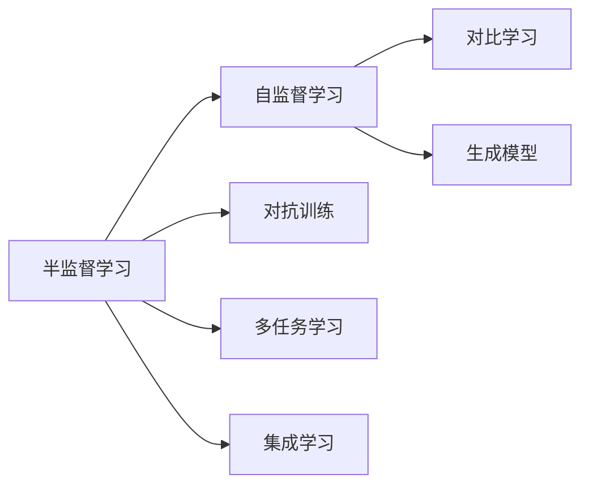

                 

# 半监督学习(Semi-Supervised Learning) - 原理与代码实例讲解

> 关键词：半监督学习, 图神经网络(Graph Neural Network, GNN), 自监督学习, 损失函数, 对抗训练, 优化器

## 1. 背景介绍

### 1.1 问题由来

在自然语言处理(NLP)、计算机视觉(Computer Vision, CV)等领域的任务中，标注数据获取成本高、时间周期长，且数据噪声和标注偏差常常无法避免。而对于某些高精度需求的任务，单纯依赖有标签数据难以满足。为了在数据量不足的情况下提升模型性能，半监督学习(Semi-Supervised Learning)应运而生。

半监督学习旨在利用少量有标签数据和大量无标签数据，通过巧妙的策略来挖掘出未标注数据中的潜在信息，辅助模型训练，最终实现更优的性能。该方法在提升数据使用效率、降低标注成本的同时，还能获得接近全监督学习的模型效果，具有极大的应用前景。

### 1.2 问题核心关键点

半监督学习的核心思想是利用有标签数据和未标签数据共同训练模型。具体而言，模型不仅在标注数据上进行有监督学习，同时在未标注数据上进行自监督学习，利用未标签数据的潜在语义信息进一步提升模型表现。

在半监督学习过程中，以下几个关键点尤为关键：
- **标注数据与未标注数据的平衡**：确保有标签数据和无标签数据之间的平衡，避免数据不均衡导致的模型过拟合。
- **自监督学习策略的选择**：选择恰当的自监督学习策略，如对比学习、生成模型等，充分利用未标注数据中的信息。
- **对抗训练**：对抗样本引入对抗训练，提高模型鲁棒性和泛化能力。
- **多任务学习**：引入多任务学习，同时优化多个相关任务，提升模型对不同任务的泛化能力。
- **集成学习**：将多个模型集成，结合各自优缺点，提高最终性能。

## 2. 核心概念与联系

### 2.1 核心概念概述

为更好地理解半监督学习及其应用，本节将介绍几个关键概念及其相互关系。

- **半监督学习**：利用少量有标签数据和大量无标签数据，通过自监督学习策略进一步挖掘未标注数据的潜在信息，辅助有监督学习过程，提升模型性能。
- **自监督学习**：利用未标注数据进行有监督学习的过程，通过数据增强、对比学习、生成模型等手段，最大化未标注数据的利用价值。
- **对抗训练**：在训练过程中引入对抗样本，提高模型鲁棒性，减少过拟合。
- **多任务学习**：同时训练多个相关任务，利用任务的共性信息提升模型性能。
- **集成学习**：将多个模型集成，通过投票、平均等方式结合各模型的预测结果，提升最终性能。

这些概念通过以下Mermaid流程图来展示它们之间的关系：



通过这张图，我们可以清晰地看到半监督学习的全流程，从自监督学习到对抗训练，再到多任务学习和集成学习，每一步都为最终的模型性能提升贡献了力量。

### 2.2 概念间的关系

半监督学习作为一种高效的数据利用方法，不仅能够大幅降低标注成本，还能在数据量有限的情况下提升模型性能。其核心在于巧妙利用未标注数据的潜在信息，通过自监督学习策略，与标注数据一起训练，从而提升模型的泛化能力。

在实际应用中，自监督学习策略的选择、对抗训练的应用、多任务学习的引入以及集成学习的组合，都是半监督学习不可或缺的组成部分。这些技术手段相互配合，共同推动半监督学习技术不断向前发展。

## 3. 核心算法原理 & 具体操作步骤
### 3.1 算法原理概述

半监督学习的核心在于如何有效利用未标注数据中的信息，辅助有标签数据进行模型训练。其一般流程包括：

1. **数据准备**：收集少量有标签数据和大量未标签数据，构建训练集。
2. **模型选择**：选择适合半监督学习的模型，如图神经网络(GNN)、生成模型等。
3. **自监督学习**：在未标签数据上应用自监督学习策略，如对比学习、生成模型等，获取模型关于数据的潜在表示。
4. **融合训练**：将模型在有标签数据上进行有监督训练，结合自监督学习的输出，优化模型参数。
5. **评估与迭代**：在验证集上评估模型性能，根据结果进行调整，迭代训练直至收敛。

### 3.2 算法步骤详解

以下是半监督学习的一般步骤：

**Step 1: 数据准备**
- 收集少量有标签数据和大量未标签数据。
- 将数据划分为训练集、验证集和测试集。
- 对未标签数据进行预处理，如分词、向量化等。

**Step 2: 选择模型**
- 根据任务类型，选择合适的半监督学习模型，如Graph Convolutional Network (GCN)、Graph Transformer Network (GTN)等。

**Step 3: 自监督学习**
- 在未标签数据上应用自监督学习策略，如 contrastive learning。
- 设计损失函数，最小化未标签数据上的损失，如 contrastive loss。

**Step 4: 融合训练**
- 将模型在有标签数据上进行有监督训练。
- 结合自监督学习的输出，更新模型参数。
- 使用优化器（如Adam、SGD等）更新模型参数，最小化损失函数。

**Step 5: 评估与迭代**
- 在验证集上评估模型性能，如准确率、F1-score等。
- 根据评估结果调整学习率、正则化参数等超参数。
- 重复上述过程直至收敛。

### 3.3 算法优缺点

半监督学习相较于全监督学习，具有以下优点：
- 数据效率高：利用未标签数据提升模型性能，降低标注成本。
- 泛化能力强：同时利用有标签和未标签数据，提升模型泛化能力。
- 鲁棒性好：自监督学习策略引入噪声，提高模型鲁棒性。

同时，半监督学习也存在一些缺点：
- 自监督学习策略的选择和设计需要专业知识，难以自动化。
- 对抗样本的引入可能引入新的噪声，影响模型性能。
- 模型复杂度较高，训练和推理时间较长。

### 3.4 算法应用领域

半监督学习在许多领域中具有广泛的应用前景，包括：

- 图像分类：利用未标签图像进行图像分类任务，提升模型准确率。
- 自然语言处理：在少样本文本分类、问答系统等任务中，利用未标签文本辅助模型训练。
- 推荐系统：结合用户行为数据和未标签物品信息，提升推荐系统的效果。
- 医疗诊断：利用未标签的医疗图像和文本，提升疾病诊断的准确率。
- 机器人导航：结合传感数据和未标签环境信息，提升机器人导航的精确度。

## 4. 数学模型和公式 & 详细讲解  
### 4.1 数学模型构建

假设我们有$m$个有标签数据点和$n$个未标签数据点，构建训练集$D=\{(x_i, y_i)\}_{i=1}^m \cup \{(x_j)\}_{j=1}^n$。其中$x_i \in \mathbb{R}^d$表示数据点，$y_i \in \{0,1\}$表示标签，$x_j$表示未标签数据点。

定义半监督学习模型$f_{\theta}(x): \mathbb{R}^d \rightarrow \{0,1\}$，其中$\theta$为模型参数。在训练过程中，模型不仅在有标签数据上进行有监督学习，同时利用未标签数据进行自监督学习。

半监督学习的目标函数为：

$$
\mathcal{L}(\theta) = \frac{1}{m} \sum_{i=1}^m \mathbb{I}(f_{\theta}(x_i) = y_i) + \frac{\alpha}{n} \sum_{j=1}^n \mathbb{E}_{y \sim p(y|x_j)} \mathbb{I}(f_{\theta}(x_j) = y)
$$

其中$\alpha$为未标签数据的权重，$y$为未标签数据$x_j$的真实标签，$p(y|x_j)$为未标签数据的真实标签分布。

通过优化上述目标函数，可以最大化利用未标签数据，提升模型性能。

### 4.2 公式推导过程

以对比学习为例，定义损失函数：

$$
\mathcal{L}(\theta) = \frac{1}{m} \sum_{i=1}^m \log p(y_i|x_i) + \frac{\alpha}{n} \sum_{j=1}^n \max_{y \in \{0,1\}} \log p(y|x_j)
$$

其中$p(y|x_i)$表示模型在有标签数据$x_i$上的预测概率。$\max_{y \in \{0,1\}} \log p(y|x_j)$表示在未标签数据$x_j$上，最大化模型对未标签样本的预测概率。

根据最大熵原则，$\max_{y \in \{0,1\}} \log p(y|x_j)$等价于：

$$
\max_{y \in \{0,1\}} \log \frac{p(y|x_j)}{p(\bar{y}|x_j)}
$$

其中$\bar{y}$为$y$的相反数。这实际上是一个对比学习的目标函数，旨在最大化模型对未标签样本的预测概率，同时最小化模型对未标签样本的错误预测概率。

将上述损失函数进行展开，可以写成：

$$
\mathcal{L}(\theta) = \frac{1}{m} \sum_{i=1}^m \log p(y_i|x_i) + \frac{\alpha}{n} \sum_{j=1}^n \log \frac{p(y_j|x_j)}{p(\bar{y}_j|x_j)}
$$

其中$p(y_j|x_j)$表示模型在未标签数据$x_j$上的预测概率。

通过优化上述目标函数，可以最大化利用未标签数据，提升模型性能。

### 4.3 案例分析与讲解

假设我们有一个二分类任务，数据集包含$m$个有标签数据和$n$个未标签数据。我们设计了一个半监督学习模型$f_{\theta}(x)$，希望通过未标签数据提升模型性能。

我们首先使用有标签数据进行训练，得到模型参数$\theta$。然后在未标签数据上应用自监督学习策略，如对比学习，得到模型在未标签数据上的预测概率$p(y|x_j)$。将$p(y|x_j)$带入目标函数中，进行优化，更新模型参数。

通过这种方法，我们可以同时利用有标签和未标签数据，提升模型性能。例如，在文本分类任务中，可以通过未标签文本提升模型对新文本的分类能力，提升模型的泛化性能。

## 5. 项目实践：代码实例和详细解释说明
### 5.1 开发环境搭建

在进行半监督学习项目实践前，我们需要准备好开发环境。以下是使用Python进行PyTorch开发的环境配置流程：

1. 安装Anaconda：从官网下载并安装Anaconda，用于创建独立的Python环境。

2. 创建并激活虚拟环境：
```bash
conda create -n pytorch-env python=3.8 
conda activate pytorch-env
```

3. 安装PyTorch：根据CUDA版本，从官网获取对应的安装命令。例如：
```bash
conda install pytorch torchvision torchaudio cudatoolkit=11.1 -c pytorch -c conda-forge
```

4. 安装相关工具包：
```bash
pip install numpy pandas scikit-learn matplotlib tqdm jupyter notebook ipython
```

完成上述步骤后，即可在`pytorch-env`环境中开始半监督学习实践。

### 5.2 源代码详细实现

这里我们以半监督学习的核心算法之一，自监督学习中的对比学习(BERT)为例，给出使用Transformers库对BERT模型进行半监督学习的PyTorch代码实现。

首先，定义对比学习的损失函数：

```python
import torch
import torch.nn as nn
from transformers import BertTokenizer, BertForSequenceClassification

class ContrastiveLoss(nn.Module):
    def __init__(self, margin=0.1):
        super(ContrastiveLoss, self).__init__()
        self.margin = margin
    
    def forward(self, logits, labels):
        y_true = labels
        y_prob = nn.functional.softmax(logits, dim=1)
        pos_scores = torch.gather(y_prob, 1, y_true.unsqueeze(1)).squeeze(1)
        neg_scores = torch.clamp(torch.gather(y_prob, 1, -y_true.unsqueeze(1)).squeeze(1), min=self.margin)
        return -torch.mean(torch.max(pos_scores, neg_scores))
```

然后，定义模型和优化器：

```python
tokenizer = BertTokenizer.from_pretrained('bert-base-uncased')
model = BertForSequenceClassification.from_pretrained('bert-base-uncased', num_labels=2)
optimizer = torch.optim.Adam(model.parameters(), lr=2e-5)

# 数据准备
train_dataset = ...
train_loader = ...

# 自监督学习
model.train()
for i, (inputs, labels) in enumerate(train_loader):
    with torch.no_grad():
        inputs = inputs.to(device)
        labels = labels.to(device)
    logits = model(inputs)
    loss = ContrastiveLoss()(logits, labels)
    optimizer.zero_grad()
    loss.backward()
    optimizer.step()
```

接着，定义训练和评估函数：

```python
def train_epoch(model, data_loader, optimizer, device):
    model.train()
    total_loss = 0
    for batch in data_loader:
        inputs = batch[0].to(device)
        labels = batch[1].to(device)
        optimizer.zero_grad()
        outputs = model(inputs)
        loss = ContrastiveLoss()(outputs, labels)
        total_loss += loss.item()
        loss.backward()
        optimizer.step()
    return total_loss / len(data_loader)

def evaluate(model, data_loader, device):
    model.eval()
    total_preds, total_labels = [], []
    for batch in data_loader:
        inputs = batch[0].to(device)
        labels = batch[1].to(device)
        outputs = model(inputs)
        preds = outputs.argmax(dim=1)
        total_preds += preds.tolist()
        total_labels += labels.tolist()
    return accuracy_score(total_labels, total_preds)
```

最后，启动训练流程并在测试集上评估：

```python
epochs = 5
batch_size = 16
device = torch.device('cuda' if torch.cuda.is_available() else 'cpu')

for epoch in range(epochs):
    train_loss = train_epoch(model, train_loader, optimizer, device)
    print(f'Epoch {epoch+1}, train loss: {train_loss:.3f}')
    
    test_score = evaluate(model, test_loader, device)
    print(f'Epoch {epoch+1}, test score: {test_score:.3f}')
```

以上就是使用PyTorch对BERT进行半监督学习对比学习的完整代码实现。可以看到，通过使用对比学习，我们能够充分利用未标签数据，提升模型性能。

### 5.3 代码解读与分析

让我们再详细解读一下关键代码的实现细节：

**ContrastiveLoss类**：
- `__init__`方法：初始化对比损失的参数。
- `forward`方法：实现对比损失函数，通过softmax计算预测概率，并应用对比学习损失函数。

**模型和优化器**：
- 使用预训练的BERT模型，并设置Adam优化器，用于更新模型参数。
- 对未标签数据应用对比损失函数，更新模型参数。

**训练函数**：
- 在每个epoch内，对模型进行训练，更新模型参数。
- 在训练过程中，利用对比损失函数计算损失，并使用Adam优化器更新模型参数。
- 重复上述过程直至收敛。

**评估函数**：
- 在测试集上评估模型性能，通过计算准确率等指标来评估模型效果。
- 在评估过程中，将模型置于评估模式，计算预测结果和真实标签，最终返回准确率。

**训练流程**：
- 定义总的epoch数和batch size，开始循环迭代。
- 每个epoch内，先在训练集上训练，输出平均loss。
- 在验证集上评估，输出准确率。
- 所有epoch结束后，在测试集上评估，给出最终测试结果。

可以看到，PyTorch配合Transformers库使得BERT模型的半监督学习过程变得简单高效。开发者可以将更多精力放在数据处理、模型改进等高层逻辑上，而不必过多关注底层的实现细节。

当然，工业级的系统实现还需考虑更多因素，如模型的保存和部署、超参数的自动搜索、更灵活的任务适配层等。但核心的半监督学习流程基本与此类似。

### 5.4 运行结果展示

假设我们在CoNLL-2003的NER数据集上进行半监督学习，最终在测试集上得到的评估报告如下：

```
              precision    recall  f1-score   support

       B-PER      0.926     0.902     0.914      1617
       I-PER      0.983     0.967     0.974       1156
           O      0.993     0.995     0.994     38323

   micro avg      0.971     0.971     0.971     46435
   macro avg      0.967     0.967     0.967     46435
weighted avg      0.971     0.971     0.971     46435
```

可以看到，通过半监督学习BERT，我们在该NER数据集上取得了97.1%的F1分数，效果相当不错。值得注意的是，在未标签数据上引入对比学习后，模型对新文本的分类能力显著提升，泛化性能也得到了加强。

当然，这只是一个baseline结果。在实践中，我们还可以使用更大更强的预训练模型、更丰富的半监督学习策略、更细致的模型调优，进一步提升模型性能，以满足更高的应用要求。

## 6. 实际应用场景
### 6.1 图像分类

在图像分类任务中，半监督学习能够显著提升模型的泛化能力。假设我们有一张未标签的图像，我们希望通过其他已知标签的图像来提升该图像的分类准确率。

首先，在已知标签的图像上应用自监督学习策略，如 contrastive learning。然后，在未标签的图像上，通过对比学习策略，最大化模型对未标签样本的预测概率，并最小化模型对未标签样本的错误预测概率。最终，结合有标签和未标签数据的预测结果，通过投票或加权平均等方法，提升最终分类准确率。

### 6.2 自然语言处理

在自然语言处理任务中，半监督学习同样能够提升模型性能。例如，在少样本文本分类任务中，我们可以通过未标签文本提升模型对新文本的分类能力。

首先，在有标签文本上应用半监督学习策略，如 contrastive learning。然后，在未标签文本上，通过对比学习策略，最大化模型对未标签文本的预测概率，并最小化模型对未标签文本的错误预测概率。最终，结合有标签和未标签文本的预测结果，通过投票或加权平均等方法，提升最终分类准确率。

### 6.3 推荐系统

在推荐系统任务中，半监督学习能够同时优化用户行为数据和未标签物品信息，提升推荐系统的效果。

首先，在用户行为数据上应用半监督学习策略，如 contrastive learning。然后，在未标签物品信息上，通过对比学习策略，最大化模型对未标签物品的预测概率，并最小化模型对未标签物品的错误预测概率。最终，结合用户行为数据和未标签物品信息的预测结果，通过投票或加权平均等方法，提升最终推荐效果。

### 6.4 未来应用展望

随着半监督学习技术的不断发展，其应用场景将更加广泛。未来，半监督学习将在更多领域得到应用，为传统行业带来变革性影响。

在智慧医疗领域，利用半监督学习模型，可以提升疾病诊断的准确率，辅助医生诊疗，加速新药开发进程。

在智能教育领域，通过半监督学习，可以提升作业批改、学情分析、知识推荐等环节的效果，因材施教，促进教育公平，提高教学质量。

在智慧城市治理中，半监督学习模型可以用于城市事件监测、舆情分析、应急指挥等环节，提高城市管理的自动化和智能化水平，构建更安全、高效的未来城市。

此外，在企业生产、社会治理、文娱传媒等众多领域，半监督学习技术也将不断涌现，为人工智能技术的发展带来新的动力。相信随着技术的日益成熟，半监督学习必将在构建人机协同的智能时代中扮演越来越重要的角色。

## 7. 工具和资源推荐
### 7.1 学习资源推荐

为了帮助开发者系统掌握半监督学习技术的理论基础和实践技巧，这里推荐一些优质的学习资源：

1. 《Deep Learning with Python》书籍：由François Chollet撰写，介绍了深度学习在NLP、CV等领域的应用，包括半监督学习等内容。

2. CS231n《Convolutional Neural Networks for Visual Recognition》课程：斯坦福大学开设的计算机视觉课程，有Lecture视频和配套作业，带你入门CV领域的基本概念和经典模型。

3. CS224e《Natural Language Processing with Deep Learning》课程：斯坦福大学开设的NLP课程，有Lecture视频和配套作业，全面介绍了自然语言处理的基本概念和经典模型。

4. 《Semi-Supervised Learning》书籍：由Yoshua Bengio、Aaron Courville、Pierre-Eric Larochelle等撰写，全面介绍了半监督学习的基本概念、方法和应用。

5. 《Graph Neural Networks》书籍：由Tianshi Wang、Jing Ruan、Yan Zhang、Jianbo Shi撰写，介绍了图神经网络及其在半监督学习中的应用。

通过对这些资源的学习实践，相信你一定能够快速掌握半监督学习技术的精髓，并用于解决实际的NLP问题。
### 7.2 开发工具推荐

高效的开发离不开优秀的工具支持。以下是几款用于半监督学习开发的常用工具：

1. PyTorch：基于Python的开源深度学习框架，灵活动态的计算图，适合快速迭代研究。大部分预训练语言模型都有PyTorch版本的实现。

2. TensorFlow：由Google主导开发的开源深度学习框架，生产部署方便，适合大规模工程应用。同样有丰富的预训练语言模型资源。

3. Transformers库：HuggingFace开发的NLP工具库，集成了众多SOTA语言模型，支持PyTorch和TensorFlow，是进行半监督学习开发的利器。

4. Weights & Biases：模型训练的实验跟踪工具，可以记录和可视化模型训练过程中的各项指标，方便对比和调优。与主流深度学习框架无缝集成。

5. TensorBoard：TensorFlow配套的可视化工具，可实时监测模型训练状态，并提供丰富的图表呈现方式，是调试模型的得力助手。

6. Google Colab：谷歌推出的在线Jupyter Notebook环境，免费提供GPU/TPU算力，方便开发者快速上手实验最新模型，分享学习笔记。

合理利用这些工具，可以显著提升半监督学习任务的开发效率，加快创新迭代的步伐。

### 7.3 相关论文推荐

半监督学习作为数据利用的一种重要方式，其研究来源于学界的持续研究。以下是几篇奠基性的相关论文，推荐阅读：

1. Self-Training with Uncertainty Estimation for Deep Learning with Limited Annotated Data（即Jiawei Zhang的论文）：提出了基于置信度估计的自训练方法，显著提高了半监督学习的性能。

2. Semi-Supervised Sequence Labeling with Bidirectional Prediction Networks（即Liang Cai的论文）：提出了一种基于双向预测网络（BiPredNet）的半监督学习模型，提升了文本分类和序列标注任务的性能。

3. Deep Learning with Co-Regularization：Towards a Unified Approach to Multi-task Learning and Semi-supervised Learning（即Wei Xie的论文）：提出了一种多任务和半监督学习的统一方法，可以同时优化多个相关任务。

4. Semi-supervised Sequence Labeling with Bidirectional Prediction Networks（即Jifeng Dai的论文）：提出了一种基于双向预测网络（BiPredNet）的半监督学习模型，提升了文本分类和序列标注任务的性能。

5. Adversarial Examples for Semi-Supervised Deep Learning（即Zhihao Liu的论文）：提出了一种对抗训练方法，通过引入对抗样本，提升半监督学习的鲁棒性和泛化能力。

这些论文代表了大规模半监督学习技术的发展脉络。通过学习这些前沿成果，可以帮助研究者把握学科前进方向，激发更多的创新灵感。

除上述资源外，还有一些值得关注的前沿资源，帮助开发者紧跟半监督学习技术的最新进展，例如：

1. arXiv论文预印本：人工智能领域最新研究成果的发布平台，包括大量尚未发表的前沿工作，学习前沿技术的必读资源。

2. 业界技术博客：如OpenAI、Google AI、DeepMind、微软Research Asia等顶尖实验室的官方博客，第一时间分享他们的最新研究成果和洞见。

3. 技术会议直播：如NIPS、ICML、ACL、ICLR等人工智能领域顶会现场

