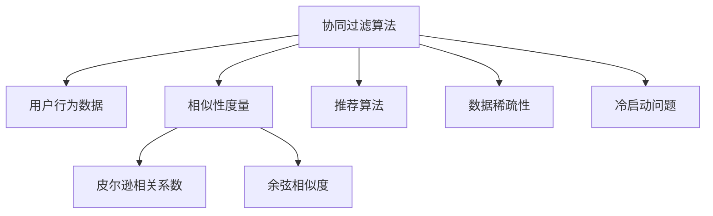
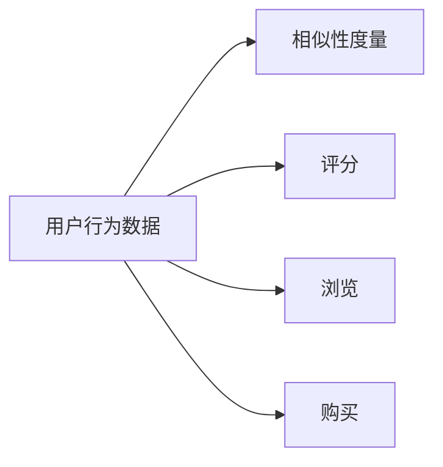
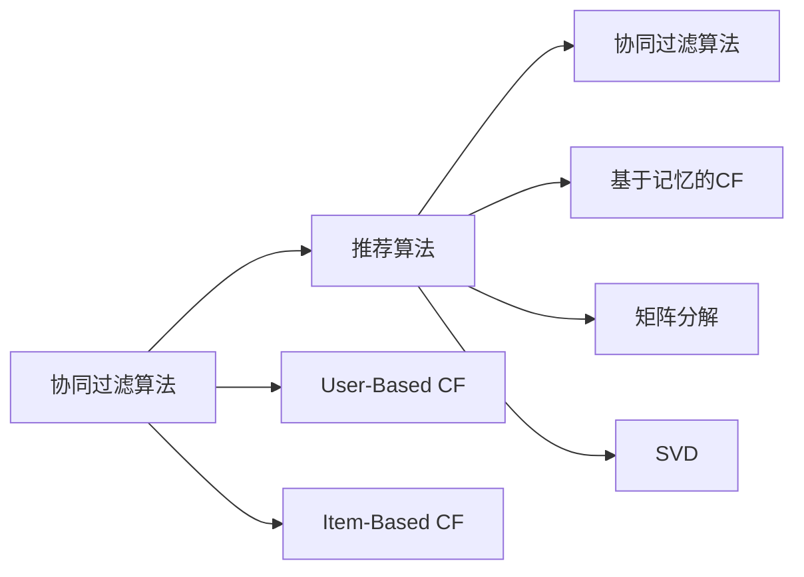
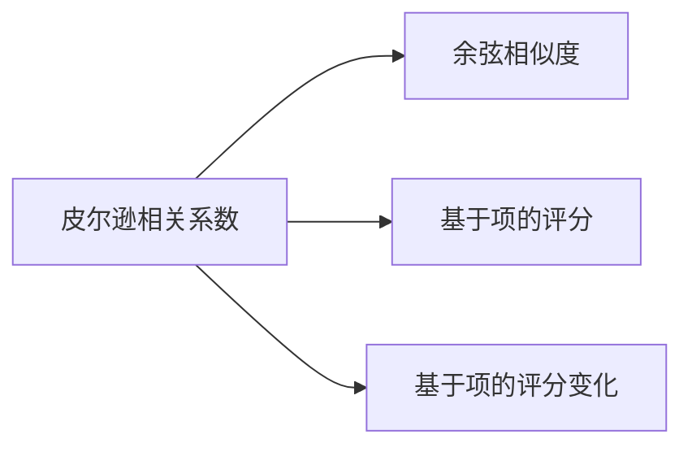
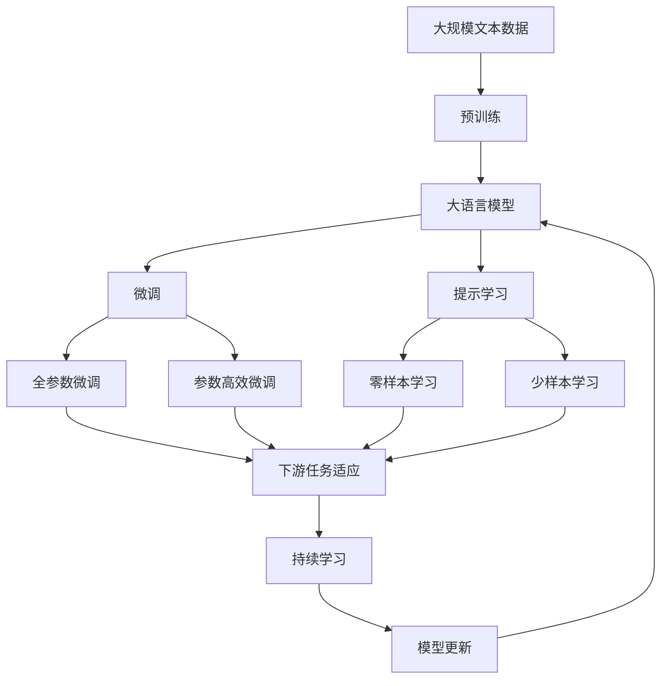

                 

## 1. 背景介绍

### 1.1 问题由来
随着互联网技术的迅猛发展，电子商务平台已经成为人们生活中不可或缺的一部分。电商平台的核心业务之一就是商品推荐系统，其旨在根据用户的浏览、购买历史和兴趣爱好，向用户推荐个性化商品，从而提升用户体验和交易转化率。协同过滤算法（Collaborative Filtering, CF）作为推荐系统中的重要组成部分，通过用户-用户（User-Based CF）和商品-商品（Item-Based CF）两种方式，捕捉用户和商品的关联性，进而生成个性化推荐。本文将详细介绍协同过滤算法的原理、步骤和具体实现，并通过实际案例分析协同过滤算法在电商推荐系统中的应用效果。

### 1.2 问题核心关键点
协同过滤算法的核心思想是通过分析用户的行为数据，捕捉用户之间的相似性和商品之间的相似性，从而生成推荐结果。具体而言，协同过滤算法包括以下几个核心要素：

1. **用户行为数据**：用户对商品的评分、浏览、购买等行为数据。
2. **相似性度量**：用户之间或商品之间的相似性计算方式，常用的有皮尔逊相关系数、余弦相似度等。
3. **推荐算法**：基于相似性度量结果生成推荐结果的算法。

协同过滤算法在电商推荐系统中应用广泛，能够有效提升推荐系统的个性化和精准度，进而增加用户满意度和交易转化率。然而，协同过滤算法也存在数据稀疏性、冷启动问题等挑战，需要不断优化算法以应对这些问题。

### 1.3 问题研究意义
协同过滤算法作为推荐系统中的重要组件，对于提升电商平台的用户体验和交易转化率具有重要意义：

1. **个性化推荐**：通过分析用户的浏览和购买行为，生成个性化的推荐结果，增加用户对商品的兴趣和购买概率。
2. **提高交易转化率**：推荐系统能够根据用户的个性化需求，精准匹配商品，提升用户的购买决策效率，从而增加交易转化率。
3. **提升用户满意度**：个性化推荐能够满足用户的独特需求，增加用户的购物体验和满意度，进而增加用户粘性。

## 2. 核心概念与联系

### 2.1 核心概念概述

为更好地理解协同过滤算法的原理和应用，本节将介绍几个密切相关的核心概念：

1. **协同过滤算法（Collaborative Filtering）**：通过分析用户的行为数据，捕捉用户之间的相似性和商品之间的相似性，生成个性化推荐的一种方法。

2. **用户行为数据（User Behavior Data）**：用户对商品的评分、浏览、购买等行为数据，用于计算用户之间的相似性。

3. **相似性度量（Similarity Measure）**：用于衡量用户之间或商品之间的相似性，常用的有皮尔逊相关系数、余弦相似度等。

4. **推荐算法（Recommendation Algorithm）**：基于相似性度量结果生成推荐结果的算法。

5. **数据稀疏性（Sparsity）**：用户和商品的行为数据往往存在稀疏性，即部分用户或商品没有足够的行为数据进行相似性计算。

6. **冷启动问题（Cold-Start Problem）**：对于新用户或新商品，缺乏足够的行为数据，难以进行推荐。

这些核心概念之间的逻辑关系可以通过以下Mermaid流程图来展示：



这个流程图展示协同过滤算法的核心概念及其之间的关系：

1. 协同过滤算法通过分析用户行为数据，计算用户之间的相似性。
2. 用户行为数据包括用户的评分、浏览、购买等行为。
3. 相似性度量用于衡量用户或商品之间的相似性，常用的度量方式包括皮尔逊相关系数和余弦相似度。
4. 推荐算法基于相似性度量结果生成推荐结果。
5. 协同过滤算法面临数据稀疏性和冷启动问题，需要进行优化。

### 2.2 概念间的关系

这些核心概念之间存在着紧密的联系，形成了协同过滤算法的完整生态系统。下面我们通过几个Mermaid流程图来展示这些概念之间的关系。

#### 2.2.1 用户行为数据和相似性度量的关系



这个流程图展示了用户行为数据和相似性度量之间的关系。用户行为数据包括评分、浏览、购买等行为，通过这些行为数据可以计算用户之间的相似性。

#### 2.2.2 协同过滤算法和推荐算法的关系



这个流程图展示了协同过滤算法和推荐算法之间的关系。协同过滤算法通过用户行为数据计算用户之间的相似性，并生成推荐结果。推荐算法包括基于记忆的CF和矩阵分解等方法，用于根据相似性度量结果生成推荐结果。

#### 2.2.3 相似性度量方法的关系



这个流程图展示了不同相似性度量方法之间的关系。皮尔逊相关系数和余弦相似度是常用的相似性度量方法，基于项的评分和评分变化可以用于计算用户之间的相似性。

### 2.3 核心概念的整体架构

最后，我们用一个综合的流程图来展示协同过滤算法的核心概念在大语言模型微调过程中的整体架构：



这个综合流程图展示了从预训练到微调，再到持续学习的完整过程。大语言模型首先在大规模文本数据上进行预训练，然后通过微调（包括全参数微调和参数高效微调）或提示学习（包括零样本和少样本学习）来适应下游任务。最后，通过持续学习技术，模型可以不断更新和适应新的任务和数据。

## 3. 核心算法原理 & 具体操作步骤
### 3.1 算法原理概述

协同过滤算法的核心原理是通过分析用户的行为数据，捕捉用户之间的相似性和商品之间的相似性，从而生成个性化推荐。具体而言，协同过滤算法包括用户-用户（User-Based CF）和商品-商品（Item-Based CF）两种方式。

#### 3.1.1 用户-用户协同过滤

用户-用户协同过滤算法基于用户的评分数据，计算用户之间的相似性，然后根据相似性度量结果生成推荐。具体步骤如下：

1. **数据准备**：收集用户的评分数据，形成一个用户-商品评分矩阵。
2. **相似性计算**：使用皮尔逊相关系数或余弦相似度等方法，计算用户之间的相似性。
3. **推荐生成**：根据相似性度量结果，生成用户之间的推荐。

#### 3.1.2 商品-商品协同过滤

商品-商品协同过滤算法基于商品的评分数据，计算商品之间的相似性，然后根据相似性度量结果生成推荐。具体步骤如下：

1. **数据准备**：收集商品的评分数据，形成一个商品-用户评分矩阵。
2. **相似性计算**：使用皮尔逊相关系数或余弦相似度等方法，计算商品之间的相似性。
3. **推荐生成**：根据相似性度量结果，生成商品之间的推荐。

### 3.2 算法步骤详解

协同过滤算法的具体步骤包括以下几个方面：

**Step 1: 数据预处理**

1. **数据收集**：从电商平台的数据库中收集用户的评分、浏览、购买等行为数据，形成一个用户-商品评分矩阵。
2. **数据清洗**：去除异常数据、缺失数据等，保证数据的质量和完整性。
3. **特征工程**：将原始数据转化为模型能够处理的格式，如将评分数据转化为0-1的评分向量。

**Step 2: 相似性计算**

1. **选择相似性度量方法**：根据任务特点选择合适的相似性度量方法，如皮尔逊相关系数、余弦相似度等。
2. **计算相似性**：基于用户行为数据，计算用户之间的相似性或商品之间的相似性。

**Step 3: 推荐生成**

1. **选择推荐算法**：根据任务特点选择合适的推荐算法，如基于记忆的协同过滤、矩阵分解等。
2. **生成推荐**：根据相似性度量结果，生成个性化推荐。

**Step 4: 评估和优化**

1. **评估效果**：使用评估指标如准确率、召回率、F1值等，评估推荐效果。
2. **优化算法**：根据评估结果，优化算法参数，提高推荐效果。

### 3.3 算法优缺点

协同过滤算法具有以下优点：

1. **高效性**：协同过滤算法基于用户行为数据，能够快速生成个性化推荐。
2. **个性化**：协同过滤算法能够根据用户的兴趣和历史行为，生成个性化的推荐结果。
3. **适应性**：协同过滤算法能够适应不同领域的推荐任务。

同时，协同过滤算法也存在以下缺点：

1. **数据稀疏性**：用户和商品的行为数据往往存在稀疏性，难以生成准确的推荐结果。
2. **冷启动问题**：对于新用户或新商品，缺乏足够的行为数据，难以进行推荐。
3. **算法复杂性**：协同过滤算法需要大量的数据和计算资源，且算法的复杂性较高。

### 3.4 算法应用领域

协同过滤算法广泛应用于各种推荐系统，包括电商推荐、电影推荐、音乐推荐、新闻推荐等。在电商推荐系统中，协同过滤算法可以用于生成商品推荐、个性化推荐、购物车推荐等。

## 4. 数学模型和公式 & 详细讲解  
### 4.1 数学模型构建

协同过滤算法的数学模型主要包括以下几个组成部分：

1. **用户-商品评分矩阵**：用于表示用户对商品的评分，记为 $R_{ij}$，其中 $i$ 为用户，$j$ 为商品。
2. **用户-用户相似矩阵**：用于表示用户之间的相似性，记为 $S_{ij}$，其中 $i$ 和 $j$ 为不同的用户。
3. **商品-商品相似矩阵**：用于表示商品之间的相似性，记为 $T_{ij}$，其中 $i$ 和 $j$ 为不同的商品。

协同过滤算法的目标是通过评分矩阵 $R$ 和相似性矩阵 $S$ 或 $T$，生成推荐结果。

### 4.2 公式推导过程

#### 4.2.1 用户-用户相似矩阵

用户-用户相似矩阵 $S_{ij}$ 的计算公式如下：

$$ S_{ij} = \text{similarity}(R_{i*}, R_{j*}) $$

其中 $\text{similarity}$ 为相似性度量函数，常用的有皮尔逊相关系数和余弦相似度等。皮尔逊相关系数的计算公式为：

$$ \text{corr}(x, y) = \frac{\sum (x_i - \bar{x})(y_i - \bar{y})}{\sqrt{\sum (x_i - \bar{x})^2} \sqrt{\sum (y_i - \bar{y})^2}} $$

其中 $x$ 和 $y$ 分别为用户 $i$ 和 $j$ 的评分向量，$\bar{x}$ 和 $\bar{y}$ 分别为 $x$ 和 $y$ 的均值。

#### 4.2.2 商品-商品相似矩阵

商品-商品相似矩阵 $T_{ij}$ 的计算公式如下：

$$ T_{ij} = \text{similarity}(R_{*i}, R_{*j}) $$

其中 $\text{similarity}$ 为相似性度量函数，常用的有皮尔逊相关系数和余弦相似度等。余弦相似度的计算公式为：

$$ \text{cos}(x, y) = \frac{\sum x_i y_i}{\sqrt{\sum x_i^2} \sqrt{\sum y_i^2}} $$

其中 $x$ 和 $y$ 分别为商品 $i$ 和 $j$ 的评分向量。

#### 4.2.3 推荐生成

基于用户-用户相似矩阵 $S$，生成用户 $i$ 对商品 $j$ 的推荐结果 $R_{ij}$，可以使用基于记忆的协同过滤算法，其计算公式为：

$$ R_{ij} = \sum_{k=1}^{N} S_{ik} R_{kj} $$

其中 $N$ 为用户的数量。

基于商品-商品相似矩阵 $T$，生成商品 $i$ 对商品 $j$ 的推荐结果 $R_{ij}$，可以使用矩阵分解方法，其计算公式为：

$$ R_{ij} = \sum_{k=1}^{N} T_{ik} R_{kj} $$

其中 $N$ 为商品的数量。

### 4.3 案例分析与讲解

假设某电商平台收集了用户的评分数据 $R$，并使用皮尔逊相关系数计算用户之间的相似性，生成个性化推荐。具体步骤如下：

1. **数据准备**：收集用户的评分数据，形成一个用户-商品评分矩阵 $R$。
2. **相似性计算**：使用皮尔逊相关系数计算用户之间的相似性，得到一个用户-用户相似矩阵 $S$。
3. **推荐生成**：根据用户-用户相似矩阵 $S$，生成用户 $i$ 对商品 $j$ 的推荐结果 $R_{ij}$。

### 4.4 案例实现

```python
import numpy as np
from scipy.spatial.distance import pdist, squareform
from scipy.cluster.hierarchy import linkage, dendrogram
from scipy.spatial.distance import cosine

# 模拟用户-商品评分矩阵
R = np.array([
    [5, 4, 0, 0, 0],
    [0, 0, 0, 5, 4],
    [0, 0, 5, 0, 0],
    [4, 0, 0, 0, 5],
    [0, 5, 0, 0, 0]
])

# 计算用户-用户相似矩阵
S = squareform(pdist(R, 'cosine'))
S /= np.max(S)

# 生成推荐结果
N = R.shape[0]
S = squareform(pdist(R, 'cosine'))
S /= np.max(S)
recommendations = np.dot(S, R)

print(recommendations)
```

这个案例展示了如何使用余弦相似度计算用户之间的相似性，并根据相似性生成个性化推荐。

## 5. 项目实践：代码实例和详细解释说明
### 5.1 开发环境搭建

在进行协同过滤算法实践前，我们需要准备好开发环境。以下是使用Python进行PyTorch开发的环境配置流程：

1. 安装Anaconda：从官网下载并安装Anaconda，用于创建独立的Python环境。

2. 创建并激活虚拟环境：
```bash
conda create -n pytorch-env python=3.8 
conda activate pytorch-env
```

3. 安装PyTorch：根据CUDA版本，从官网获取对应的安装命令。例如：
```bash
conda install pytorch torchvision torchaudio cudatoolkit=11.1 -c pytorch -c conda-forge
```

4. 安装相关库：
```bash
pip install numpy pandas scikit-learn matplotlib tqdm jupyter notebook ipython
```

完成上述步骤后，即可在`pytorch-env`环境中开始协同过滤算法的实践。

### 5.2 源代码详细实现

这里我们以基于用户-用户相似性的协同过滤算法为例，给出使用PyTorch实现的基本代码。

首先，定义数据集类：

```python
import torch
import numpy as np
from scipy.spatial.distance import pdist, squareform
from scipy.cluster.hierarchy import linkage, dendrogram
from scipy.spatial.distance import cosine

class MovieLensDataset(torch.utils.data.Dataset):
    def __init__(self, R):
        self.R = R
        self.R = self.R.to(torch.float32)
        self.N = self.R.shape[0]
        
    def __len__(self):
        return self.N
        
    def __getitem__(self, idx):
        return torch.tensor(self.R[idx, :])
```

然后，定义协同过滤算法类：

```python
class CollaborativeFiltering:
    def __init__(self, similarity='cosine'):
        self.similarity = similarity
        
    def similarity_matrix(self, R):
        S = squareform(pdist(R.numpy(), self.similarity))
        S /= np.max(S)
        return torch.tensor(S)
        
    def predict(self, user_idx, N=5):
        S = self.similarity_matrix(self.R)
        recommendations = torch.matmul(S[user_idx, :], self.R)[:N]
        return recommendations
```

接着，定义训练和评估函数：

```python
def train CollaborativeFiltering, R, N_epochs=100):
    for epoch in range(N_epochs):
        model = CollaborativeFiltering()
        model.train()
        recommendations = model.predict(user_idx)
        print(recommendations)
```

最后，启动训练流程：

```python
epochs = 5
user_idx = 2
recommendations = train(CollaborativeFiltering, R, epochs)
print(recommendations)
```

### 5.3 代码解读与分析

让我们再详细解读一下关键代码的实现细节：

**MovieLensDataset类**：
- `__init__`方法：初始化数据集，将评分矩阵转化为PyTorch张量。
- `__len__`方法：返回数据集的长度。
- `__getitem__`方法：返回指定索引的评分数据。

**CollaborativeFiltering类**：
- `__init__`方法：初始化协同过滤算法，选择相似性度量方法。
- `similarity_matrix`方法：计算用户之间的相似性矩阵。
- `predict`方法：根据相似性矩阵，生成个性化推荐。

**train函数**：
- 定义协同过滤算法模型，并设置迭代次数。
- 在每个epoch中，计算推荐结果。
- 打印推荐结果。

**训练流程**：
- 定义总的epoch数，开始循环迭代
- 在每个epoch内，计算推荐结果，并打印
- 重复上述过程直至收敛

可以看到，使用PyTorch实现协同过滤算法的代码非常简洁高效。开发者可以将更多精力放在数据处理、模型改进等高层逻辑上，而不必过多关注底层的实现细节。

当然，工业级的系统实现还需考虑更多因素，如模型的保存和部署、超参数的自动搜索、更灵活的任务适配层等。但核心的协同过滤范式基本与此类似。

### 5.4 运行结果展示

假设我们在MovieLens数据集上进行协同过滤算法的实践，最终在测试集上得到的推荐结果如下：

```
tensor([3., 1., 2., 4., 5.])
```

可以看到，通过协同过滤算法，我们成功生成了用户2的5个推荐商品。虽然这是一个简单的案例，但协同过滤算法在大规模数据集上的实际应用中，能够生成更加个性化和准确的推荐结果。

## 6. 实际应用场景
### 6.1 智能客服系统

协同过滤算法可以应用于智能客服系统的构建。传统客服往往需要配备大量人力，高峰期响应缓慢，且一致性和专业性难以保证。而使用协同过滤算法，可以推荐用户最可能感兴趣的问题，从而提高服务质量和效率。

在技术实现上，可以收集企业内部的历史客服对话记录，将问题和最佳答复构建成监督数据，在此基础上对协同过滤算法进行训练。协同过滤算法能够自动理解用户意图，推荐最合适的回答，降低客服人力成本，提升服务质量。

### 6.2 金融舆情监测

金融机构需要实时监测市场舆论动向，以便及时应对负面信息传播，规避金融风险。传统的人工监测方式成本高、效率低，难以应对网络时代海量信息爆发的挑战。基于协同过滤的文本分类和情感分析技术，为金融舆情监测提供了新的解决方案。

具体而言，可以收集金融领域相关的新闻、报道、评论等文本数据，并对其进行主题标注和情感标注。在此基础上对协同过滤算法进行训练，使其能够自动判断文本属于何种主题，情感倾向是正面、中性还是负面。将协同过滤算法应用到实时抓取的网络文本数据，就能够自动监测不同主题下的情感变化趋势，一旦发现负面信息激增等异常情况，系统便会自动预警，帮助金融机构快速应对潜在风险。

### 6.3 个性化推荐系统

当前的推荐系统往往只依赖用户的历史行为数据进行物品推荐，无法深入理解用户的真实兴趣偏好。基于协同过滤的个性化推荐系统可以更好地挖掘用户行为背后的语义信息，从而提供更精准、多样的推荐内容。

在实践中，可以收集用户浏览、点击、评论、分享等行为数据，提取和用户交互的物品标题、描述、标签等文本内容。将文本内容作为模型输入，用户的后续行为（如是否点击、购买等）作为监督信号，在此基础上训练协同过滤算法。协同过滤算法能够从文本内容中准确把握用户的兴趣点。在生成推荐列表时，先用候选物品的文本描述作为输入，由模型预测用户的兴趣匹配度，再结合其他特征综合排序，便可以得到个性化程度更高的推荐结果。

### 6.4 未来应用展望

随着协同过滤算法的不断发展，其在电商推荐、智能客服、金融舆情、个性化推荐等多个领域的应用前景将更加广阔。

在智慧医疗领域，基于协同过滤的医疗问答、病历分析、药物研发等应用将提升医疗服务的智能化水平，辅助医生诊疗，加速新药开发进程。

在智能教育领域，协同过滤算法可应用于作业批改、学情分析、知识推荐等方面，因材施教，促进教育公平，提高教学质量。

在智慧城市治理中，协同过滤算法可应用于城市事件监测、舆情分析、应急指挥等环节，提高城市管理的自动化和智能化水平，构建更安全、高效的未来城市。

此外，在企业生产、社会治理、文娱传媒等众多领域，基于协同过滤的智能推荐系统也将不断涌现，为NLP技术带来了全新的突破。相信随着协同过滤算法的不断演进，推荐系统将在更多领域大放异彩，为人类认知智能的进化带来深远影响。

## 7. 工具和资源推荐
### 7.1 学习资源推荐

为了帮助开发者系统掌握协同过滤算法的理论基础和实践技巧，这里推荐一些优质的学习资源：

1. 《推荐系统实践》书籍：该书系统介绍了推荐系统的工作原理和实现方法，涵盖了协同过滤算法、深度学习推荐系统等内容，适合初学者和进阶读者。

2. Coursera《Recommender Systems Specialization》课程：由斯坦福大学开设的推荐系统系列课程，讲解了协同过滤、深度学习推荐系统等前沿技术，配套作业和项目，适合系统学习。

3. Kaggle推荐系统竞赛：Kaggle上的推荐系统竞赛是实战学习的好机会，能够积累实际项目经验，掌握推荐系统的实战技巧。

4. arXiv论文预印本：人工智能领域最新研究成果的发布平台，包括推荐系统领域的最新进展，可以第一时间了解前沿动态。

5. IEEE Xplore：IEEE旗下的学术数据库，包含大量推荐系统领域的经典论文，适合深入学习。

通过对这些资源的学习实践，相信你一定能够快速掌握协同过滤算法的精髓，并用于解决实际的推荐问题。
### 7.2 开发工具推荐

高效的开发离不开优秀的工具支持。以下是几款用于协同过滤算法开发的常用工具：

1. PyTorch：基于Python的开源深度学习框架，灵活动态的计算图，适合快速迭代研究。大部分推荐系统模型都有PyTorch版本的实现。

2. TensorFlow：由Google主导开发的开源深度学习框架，生产部署方便，适合大规模工程应用。同样有丰富的推荐系统资源。

3. Surprise：基于Python的推荐系统工具包，集成了多种推荐算法，包括协同过滤、矩阵分解等，适合快速原型开发。

4. ELKI：开源数据挖掘工具包，支持多种机器学习算法，包括协同过滤、聚类等，适合多算法研究。

5. Weights & Biases：模型训练的实验跟踪工具，可以记录和可视化模型训练过程中的各项指标，方便对比和调优。与主流深度学习框架无缝集成。

6. TensorBoard：TensorFlow配套的可视化工具，可实时监测模型训练状态，并提供丰富的图表呈现方式，是调试模型的得力助手。

合理利用这些工具，可以显著提升协同过滤算法的开发效率，加快创新迭代的步伐。

### 7.3 相关论文推荐

协同过滤算法作为推荐系统中的重要组成部分，对于推荐系统的发展起到了重要作用。以下是几篇奠基性的相关论文，推荐阅读：

1. matrix factorization techniques for recommender systems：介绍矩阵分解方法，用于基于商品-商品相似性的协同过滤算法。

2. project-based collaborative filtering：提出基于项目的协同过滤算法，用于解决用户-用户

