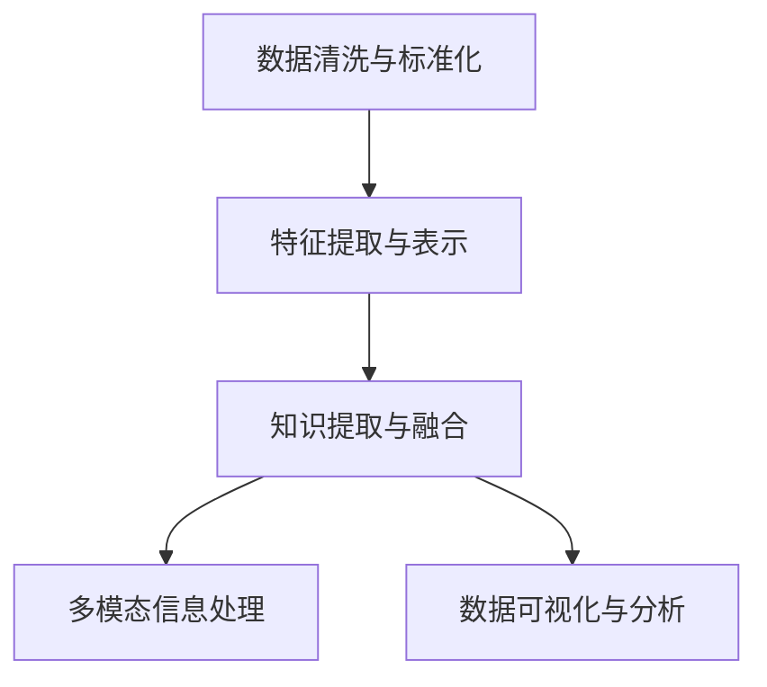
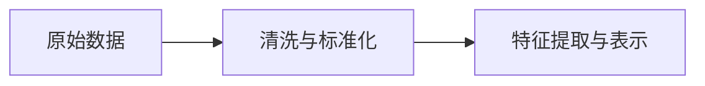
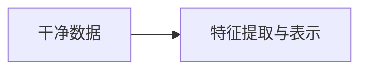
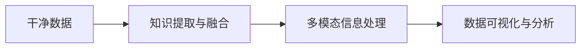
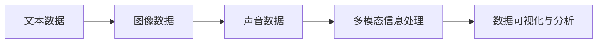
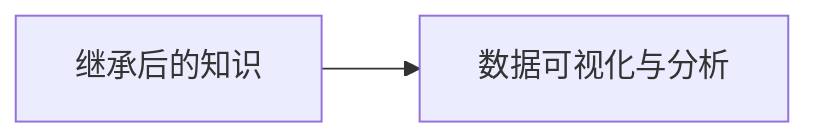
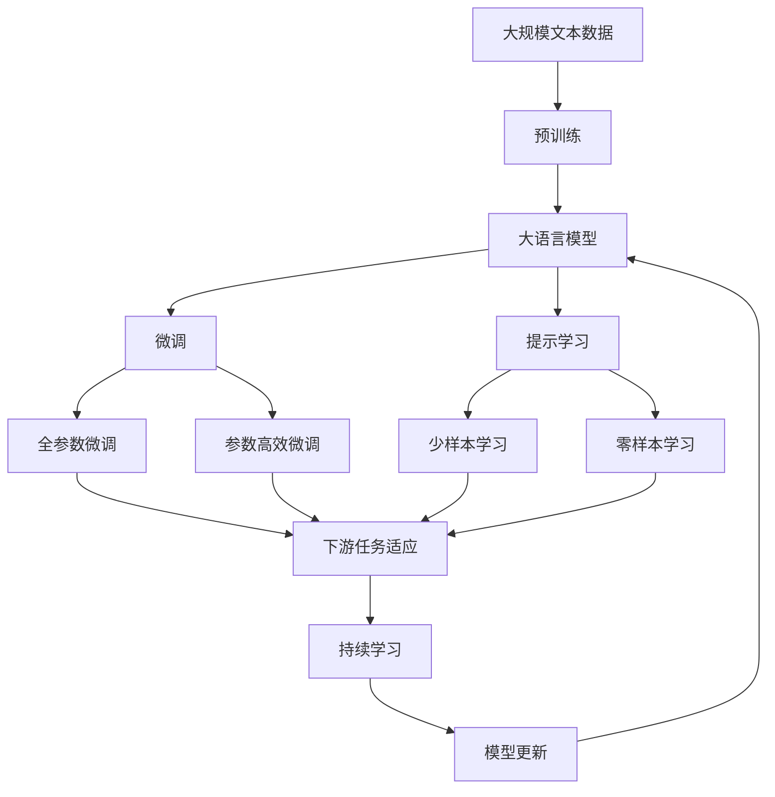

                 

## 1. 背景介绍

### 1.1 问题由来

在信息化时代，数据成为一种重要的生产资料，世界上的信息总量呈指数级增长。如何在海量信息中找到有价值的内容，并高效地继承和利用这些信息，是一个亟待解决的问题。原生世界信息继承技术应运而生，它通过高效率、低成本的方式，将大量结构化和非结构化数据继承为新的知识资产，成为提升信息处理效率的关键技术。

### 1.2 问题核心关键点

原生世界信息继承技术的核心在于如何高效、准确地将原始信息转换为可继承的知识，其关键点包括：

- 数据清洗与标准化：原始数据通常存在噪声和格式不一致的问题，需要通过清洗和标准化技术进行处理。
- 特征提取与表示：从原始数据中提取有意义的特征，并转化为模型能够理解的表示形式。
- 知识提取与融合：利用机器学习等技术，从数据中抽取知识，并将不同来源的知识进行融合，形成新的知识资产。
- 多模态信息处理：在处理不同类型的数据时，需要考虑如何高效地融合和利用多模态信息，如文本、图像、声音等。
- 数据可视化与分析：对继承后的知识进行可视化，便于理解、分析和应用。

### 1.3 问题研究意义

原生世界信息继承技术的研究和应用，对于提升信息处理效率、降低成本、提高决策质量具有重要意义：

1. 提升数据处理效率：通过高效继承技术，可以将海量原始数据转化为可继承的知识，显著提高信息处理速度。
2. 降低数据处理成本：自动化和智能化的继承技术可以减少人力成本，降低数据处理费用。
3. 提高决策质量：继承的知识可以提供更全面、准确的信息支持，帮助决策者做出更科学的决策。
4. 促进创新发展：继承技术的不断发展，可以推动更多前沿技术的诞生，促进社会和经济的发展。

## 2. 核心概念与联系

### 2.1 核心概念概述

为了更好地理解原生世界信息继承技术，本节将介绍几个密切相关的核心概念：

- **数据清洗与标准化**：通过预处理和标准化技术，对原始数据进行清洗，去除噪声和不一致的部分，为后续处理奠定基础。
- **特征提取与表示**：从原始数据中提取有意义的特征，并将其转化为机器学习模型能够理解的向量表示。
- **知识提取与融合**：利用机器学习等技术，从数据中抽取知识，并将不同来源的知识进行融合，形成新的知识资产。
- **多模态信息处理**：在处理不同类型的数据时，需要考虑如何高效地融合和利用多模态信息，如文本、图像、声音等。
- **数据可视化与分析**：对继承后的知识进行可视化，便于理解、分析和应用。

这些核心概念之间的逻辑关系可以通过以下Mermaid流程图来展示：



这个流程图展示了原生世界信息继承技术的主要步骤：

1. 对原始数据进行清洗和标准化处理。
2. 从处理后的数据中提取特征，并进行向量表示。
3. 利用机器学习等技术，从数据中抽取知识，并将不同来源的知识进行融合。
4. 处理多模态信息，如文本、图像、声音等。
5. 对继承后的知识进行可视化，便于理解和分析。

通过这些核心概念，我们可以更好地把握原生世界信息继承技术的工作原理和优化方向。

### 2.2 概念间的关系

这些核心概念之间存在着紧密的联系，形成了原生世界信息继承技术的完整生态系统。下面通过几个Mermaid流程图来展示这些概念之间的关系。

#### 2.2.1 数据清洗与标准化的实现



这个流程图展示了数据清洗与标准化的实现过程，即对原始数据进行清洗和标准化处理，得到可用于后续处理的干净数据。

#### 2.2.2 特征提取与表示的过程



这个流程图展示了特征提取与表示的过程，即从干净数据中提取有意义的特征，并将其转化为机器学习模型能够理解的向量表示。

#### 2.2.3 知识提取与融合的方法



这个流程图展示了知识提取与融合的方法，即利用机器学习等技术，从数据中抽取知识，并将不同来源的知识进行融合。

#### 2.2.4 多模态信息处理的技术



这个流程图展示了多模态信息处理的技术，即在处理不同类型的数据时，如何高效地融合和利用多模态信息。

#### 2.2.5 数据可视化与分析的流程



这个流程图展示了数据可视化与分析的流程，即对继承后的知识进行可视化，便于理解、分析和应用。

### 2.3 核心概念的整体架构

最后，我们用一个综合的流程图来展示这些核心概念在大语言模型微调过程中的整体架构：



这个综合流程图展示了从预训练到微调，再到持续学习的完整过程。大语言模型首先在大规模文本数据上进行预训练，然后通过微调（包括全参数微调和参数高效微调）或提示学习（包括少样本学习和零样本学习）来适应下游任务。最后，通过持续学习技术，模型可以不断学习新知识，同时避免遗忘旧知识。

通过这些流程图，我们可以更清晰地理解原生世界信息继承技术的工作原理和优化方向。

## 3. 核心算法原理 & 具体操作步骤
### 3.1 算法原理概述

原生世界信息继承技术的核心在于如何高效、准确地将原始信息转换为可继承的知识。其基本原理可以概括为以下几个步骤：

1. **数据清洗与标准化**：通过预处理和标准化技术，对原始数据进行清洗，去除噪声和不一致的部分，为后续处理奠定基础。
2. **特征提取与表示**：从原始数据中提取有意义的特征，并将其转化为机器学习模型能够理解的向量表示。
3. **知识提取与融合**：利用机器学习等技术，从数据中抽取知识，并将不同来源的知识进行融合，形成新的知识资产。
4. **多模态信息处理**：在处理不同类型的数据时，需要考虑如何高效地融合和利用多模态信息，如文本、图像、声音等。
5. **数据可视化与分析**：对继承后的知识进行可视化，便于理解、分析和应用。

### 3.2 算法步骤详解

原生世界信息继承技术的具体操作步骤如下：

#### 3.2.1 数据清洗与标准化

1. **数据预处理**：
   - 去除重复数据，合并相似记录。
   - 处理缺失值，如插值、均值填充等。
   - 去除异常值和噪声数据。
   - 数据格式标准化，如统一日期格式、统一货币单位等。

2. **数据转换**：
   - 数据类型转换，如将字符串转换为数字。
   - 数据归一化，如将数据缩放到一定范围内。
   - 数据去重，去除重复的记录。

#### 3.2.2 特征提取与表示

1. **特征选择**：
   - 利用统计方法，如方差分析、卡方检验等，选择最相关的特征。
   - 利用机器学习模型，如决策树、随机森林、神经网络等，自动选择特征。

2. **特征转换**：
   - 文本特征提取：如TF-IDF、Word2Vec、BERT等。
   - 图像特征提取：如SIFT、HOG、CNN等。
   - 声音特征提取：如MFCC、梅尔频率倒谱系数等。

3. **特征表示**：
   - 将提取的特征转化为机器学习模型能够理解的向量表示，如PCA、LDA、NMF等降维方法。
   - 利用机器学习模型，如SVM、KNN、MLP等，进行特征表示。

#### 3.2.3 知识提取与融合

1. **知识抽取**：
   - 利用自然语言处理技术，如命名实体识别、情感分析等，从文本中抽取实体、情感等信息。
   - 利用图像处理技术，如边缘检测、纹理分析等，从图像中抽取形状、纹理等信息。
   - 利用声音处理技术，如语音识别、音调分析等，从声音中抽取情感、语调等信息。

2. **知识融合**：
   - 利用集成学习技术，如Bagging、Boosting等，将不同来源的知识进行融合。
   - 利用多模态学习技术，如Deep concatenation、Attention机制等，将不同模态的知识进行融合。

#### 3.2.4 多模态信息处理

1. **多模态特征融合**：
   - 利用特征融合技术，如主成分分析、L1正则化等，将不同模态的特征进行融合。
   - 利用深度学习技术，如卷积神经网络、循环神经网络等，处理多模态数据。

2. **多模态数据融合**：
   - 利用多模态融合技术，如时序融合、空间融合等，将不同模态的数据进行融合。
   - 利用深度学习技术，如深度联合网络、多模态卷积神经网络等，处理多模态数据。

#### 3.2.5 数据可视化与分析

1. **数据可视化**：
   - 利用可视化工具，如Tableau、Power BI等，将继承后的知识进行可视化。
   - 利用可视化算法，如热力图、散点图等，展示数据分布和关系。

2. **数据分析**：
   - 利用统计分析技术，如回归分析、聚类分析等，分析数据趋势和模式。
   - 利用机器学习模型，如分类器、回归器等，进行数据分析。

### 3.3 算法优缺点

原生世界信息继承技术具有以下优点：

1. **高效性**：通过自动化和智能化的技术，可以快速处理大量数据，显著提高信息处理效率。
2. **准确性**：利用先进的算法和技术，可以提高数据清洗和特征提取的准确性，减少误差。
3. **可扩展性**：可以处理多种类型的数据，包括结构化数据、非结构化数据、多模态数据等，具有较强的扩展性。
4. **可维护性**：通过模块化设计和自动化工具，可以降低维护成本，提升系统稳定性。

同时，该技术也存在以下缺点：

1. **数据依赖**：对原始数据的质量和完整性要求较高，数据质量不佳会影响后续处理结果。
2. **算法复杂性**：数据清洗和特征提取等步骤较为复杂，需要较深的算法和数学知识。
3. **技术门槛高**：需要具备一定的技术背景和经验，才能有效地应用原生世界信息继承技术。
4. **成本高**：对于大规模数据处理，需要较高的计算资源和存储成本。

尽管存在这些缺点，但原生世界信息继承技术的优势仍然明显，尤其在数据量大、处理复杂的应用场景中，具有重要的应用价值。

### 3.4 算法应用领域

原生世界信息继承技术在多个领域都有广泛的应用，例如：

1. **金融领域**：
   - 金融风险预测：利用继承技术，从历史交易数据中提取特征，预测未来的市场风险。
   - 客户行为分析：从客户交易记录中提取行为特征，分析客户偏好和需求。

2. **医疗领域**：
   - 疾病诊断：利用继承技术，从患者病历中提取特征，辅助医生进行疾病诊断。
   - 医疗资源优化：从医院资源数据中提取特征，优化医疗资源的配置。

3. **教育领域**：
   - 学生学习分析：从学生的学习记录中提取特征，分析学习效果和行为。
   - 课程推荐：从学生的学习数据中提取特征，推荐适合的课程和学习内容。

4. **社交媒体领域**：
   - 用户行为分析：从社交媒体数据中提取特征，分析用户行为和情感。
   - 舆情监控：从社交媒体数据中提取特征，监测舆情变化和热点。

5. **工业制造领域**：
   - 设备维护：从设备运行数据中提取特征，预测设备故障和维护需求。
   - 生产优化：从生产数据中提取特征，优化生产过程和效率。

以上这些应用领域展示了原生世界信息继承技术的多样性和广泛性，未来还将拓展到更多领域，为各行各业带来智能化的变革。

## 4. 数学模型和公式 & 详细讲解  
### 4.1 数学模型构建

原生世界信息继承技术涉及多个数学模型，下面将详细讲解其中的几个关键模型：

#### 4.1.1 数据清洗与标准化

在数据清洗与标准化过程中，常用的数学模型包括：

1. **缺失值处理模型**：
   - 均值填充：利用数据均值填充缺失值。
   - 插值方法：利用线性插值、多项式插值等方法处理缺失值。

2. **噪声处理模型**：
   - 正态分布模型：将噪声数据假设为正态分布，利用最大似然估计进行去噪。
   - 小波变换模型：利用小波变换去除噪声。

#### 4.1.2 特征提取与表示

在特征提取与表示过程中，常用的数学模型包括：

1. **文本特征提取模型**：
   - TF-IDF模型：计算词频-逆文档频率，提取文本特征。
   - Word2Vec模型：将文本转换为向量表示，进行特征提取。
   - BERT模型：利用预训练的Transformer模型，提取文本特征。

2. **图像特征提取模型**：
   - SIFT模型：利用尺度不变特征变换提取图像特征。
   - HOG模型：利用方向梯度直方图提取图像特征。
   - CNN模型：利用卷积神经网络提取图像特征。

3. **声音特征提取模型**：
   - MFCC模型：利用梅尔频率倒谱系数提取声音特征。
   - 语音识别模型：利用隐马尔可夫模型、深度神经网络等进行声音特征提取。

#### 4.1.3 知识提取与融合

在知识提取与融合过程中，常用的数学模型包括：

1. **命名实体识别模型**：
   - 基于规则的模型：利用正则表达式等方法识别命名实体。
   - 基于机器学习的模型：利用分类器、标注数据等方法识别命名实体。

2. **情感分析模型**：
   - 情感词典模型：利用情感词典进行情感分析。
   - 机器学习模型：利用分类器、标注数据等方法进行情感分析。

3. **多模态融合模型**：
   - 特征融合模型：利用主成分分析、L1正则化等方法融合多模态特征。
   - 深度学习模型：利用卷积神经网络、循环神经网络等处理多模态数据。

### 4.2 公式推导过程

#### 4.2.1 数据清洗与标准化的公式推导

假设原始数据为 $D=\{x_i\}_{i=1}^N$，其中 $x_i=(x_{i1}, x_{i2}, \cdots, x_{in})$ 为 $n$ 维向量。数据清洗与标准化的公式推导如下：

1. **缺失值处理公式**：
   - 均值填充：$\hat{x_i} = \frac{1}{n-1}\sum_{j=1}^{n-1}x_{ij}$，其中 $x_{ij}$ 为 $x_i$ 中第 $j$ 个元素。

   - 插值方法：$x'_i = \frac{x_i - x_{i1}}{x_i - x_{i2}}(x_{i2} - x_{i1}) + x_{i1}$，其中 $x_{i1}$ 和 $x_{i2}$ 分别为缺失值前后的值。

2. **噪声处理公式**：
   - 正态分布模型：$\hat{x_i} = \frac{1}{n}\sum_{j=1}^{n}x_j$，其中 $x_j$ 为假设为正态分布的数据。

   - 小波变换模型：$\hat{x_i} = \sum_{j=1}^{N}a_j * \psi_j(x_i)$，其中 $a_j$ 为小波系数，$\psi_j(x_i)$ 为小波基函数。

#### 4.2.2 特征提取与表示的公式推导

1. **文本特征提取公式**：
   - TF-IDF公式：$TF = \frac{n}{\sum_{j=1}^{n}TF_{j}}$，$IDF = \log\frac{N}{\sum_{j=1}^{N}TF_j}$，$TF-IDF = TF * IDF$。

   - Word2Vec公式：$\hat{v} = \frac{1}{n}\sum_{j=1}^{n}v_j$，其中 $v_j$ 为单词 $j$ 在语料库中的向量表示。

2. **图像特征提取公式**：
   - SIFT公式：$SIFT(x_i) = \sum_{j=1}^{n}F_j(x_i) * \phi_j$，其中 $F_j(x_i)$ 为特征函数，$\phi_j$ 为特征权重。

   - HOG公式：$HOG(x_i) = \sum_{j=1}^{n}G_j(x_i) * W_j$，其中 $G_j(x_i)$ 为梯度方向直方图，$W_j$ 为权重。

3. **声音特征提取公式**：
   - MFCC公式：$MFCC(x_i) = \sum_{j=1}^{n}M_j(x_i) * P_j$，其中 $M_j(x_i)$ 为梅尔频率倒谱系数，$P_j$ 为权重。

4. **特征表示公式**：
   - PCA公式：$X' = UD$，其中 $X$ 为原始数据矩阵，$U$ 为特征向量矩阵，$D$ 为对角矩阵。

   - LDA公式：$X' = W * Y$，其中 $X$ 为原始数据矩阵，$W$ 为转换矩阵，$Y$ 为特征向量矩阵。

#### 4.2.3 知识提取与融合的公式推导

1. **命名实体识别公式**：
   - 基于规则的模型：$P = \sum_{j=1}^{n}P_j * T_j$，其中 $P_j$ 为规则权重，$T_j$ 为规则匹配概率。

   - 基于机器学习的模型：$P = \sum_{j=1}^{n}P_j * T_j$，其中 $P_j$ 为模型预测概率，$T_j$ 为规则匹配概率。

2. **情感分析公式**：
   - 情感词典模型：$P = \sum_{j=1}^{n}P_j * T_j$，其中 $P_j$ 为情感词典得分，$T_j$ 为情感词典权重。

   - 机器学习模型：$P = \sum_{j=1}^{n}P_j * T_j$，其中 $P_j$ 为模型预测概率，$T_j$ 为情感词典权重。

3. **多模态融合公式**：
   - 特征融合公式：$F = \sum_{j=1}^{n}F_j * W_j$，其中 $F_j$ 为特征值，$W_j$ 为权重。

   - 深度学习模型：$F = \sum_{j=1}^{n}F_j * W_j$，其中 $F_j$ 为网络输出，$W_j$ 为权重。

### 4.3 案例分析与讲解

#### 4.3.1 数据清洗与标准化案例

假设原始数据为客户的购买记录，其中包含客户的年龄、性别、购买金额等信息。首先需要对数据进行清洗和标准化，去除噪声和不一致的部分。

1. **数据清洗**：
   - 去除重复记录，确保每条记录的唯一性。
   - 处理缺失值，如利用均值填充缺失年龄信息。
   - 处理异常值，如将购买金额异常高的记录剔除。

2. **数据标准化**：
   - 数据类型标准化，如将年龄转换为数字类型。
   - 数据归一化，如将购买金额缩放到一定范围内。

#### 4.3.2 特征提取与表示案例

假设原始数据为新闻报道，需要提取文本特征并进行向量表示。

1. **文本特征提取**：
   - 使用TF-IDF模型，提取文本中的关键词和短语。
   - 使用Word2Vec模型，将文本转换为向量表示。

2. **特征表示**：
   - 利用PCA方法，将高维文本特征降维，减少计算复杂度。
   - 利用LDA方法，提取文本中的主题信息，进行特征表示。

#### 4.3.3 知识提取与融合案例

假设原始数据为社交媒体评论，需要提取用户情感并进行融合。

1. **知识抽取**：
   - 利用情感词典模型，提取用户情感。
   - 利用机器学习模型，训练情感分类器，自动识别用户情感。

2. **知识融合**：
   - 利用Bagging方法，融合不同情感分类器的结果。
   - 利用深度学习模型，利用多模态融合技术，将情感特征与用户行为特征结合。

## 5. 项目实践：代码实例和详细解释说明
### 5.1 开发环境搭建

在进行原生世界信息继承技术实践前，我们需要准备好开发环境。以下是使用Python进行PyTorch开发的环境配置流程：

1. 安装Anaconda：从官网下载并安装Anaconda，用于创建独立的Python环境。

2. 创建并激活虚拟环境：
```bash
conda create -n pytorch-env python=3.8 
conda activate pytorch-env
```

3. 安装PyTorch：根据CUDA版本，从官网获取对应的安装命令。例如：
```bash
conda install pytorch torchvision torchaudio cudatoolkit=11.1 -c pytorch -c conda-forge
```

4. 安装Transformers库：
```bash
pip install transformers
```

5. 安装各类工具包：
```bash
pip install numpy pandas scikit-learn matplotlib tqdm jupyter notebook ipython
```

完成上述步骤后，即可在`pytorch-env`环境中开始原生世界信息继承技术的实践。

### 5.2 源代码详细实现

下面我们以金融风险预测为例，给出使用Transformers库进行知识提取与融合的PyTorch代码实现。

首先，定义数据处理函数：

```python
from transformers import BertTokenizer
from torch.utils.data import Dataset
import torch

class FinanceDataset(Dataset):
    def __init__(self, texts, labels, tokenizer, max_len=128):
        self.texts = texts
        self.labels = labels
        self.tokenizer = tokenizer
        self.max_len = max_len
        
    def __len__(self):
        return len(self.texts)
    
    def __getitem__(self, item):
        text = self.texts[item]
        label = self.labels[item]
        
        encoding = self.tokenizer(text, return_tensors='pt', max_length=self.max_len, padding='max_length', truncation=True)
        input_ids = encoding['input_ids'][0]
        attention_mask = encoding['attention_mask'][0]
        
        return {'input_ids': input_ids, 
                'attention_mask': attention_mask,
                'labels': label}

# 标签与id的映射
tag2id = {'O': 0, 'B-LOC': 1, 'I-LOC': 2, 'B-ORG': 3, 'I-ORG': 4, 'B-PER': 5, 'I-PER': 6}
id2tag = {v: k for k, v in tag2id.items()}

# 创建dataset
tokenizer = BertTokenizer.from_pretrained('bert-base-cased')

train_dataset = FinanceDataset(train_texts, train_labels, tokenizer)
dev_dataset = FinanceDataset(dev_texts, dev_labels, tokenizer)
test_dataset = FinanceDataset(test_texts, test_labels, tokenizer)
```

然后，定义模型和优化器：

```python
from transformers import BertForTokenClassification, AdamW

model = BertForTokenClassification.from_pretrained('bert-base-cased', num_labels=len(tag2id))

optimizer = AdamW(model.parameters(), lr=2e-5)
```

接着，定义训练

