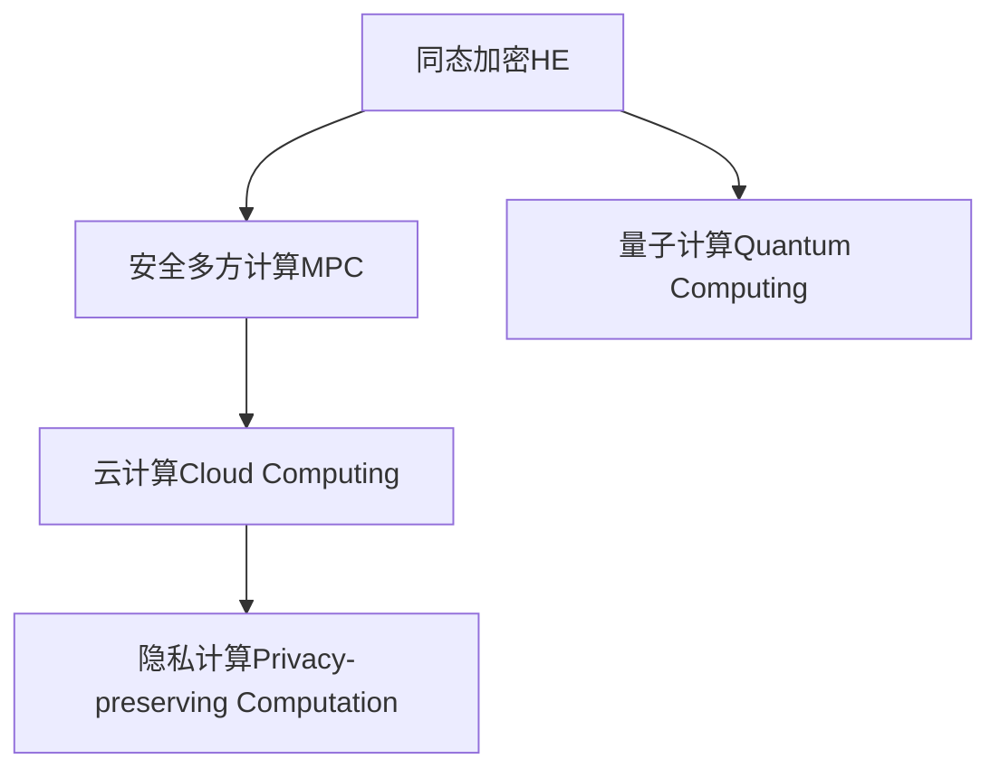
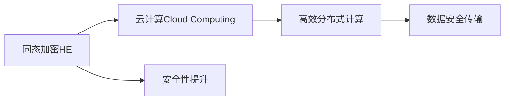
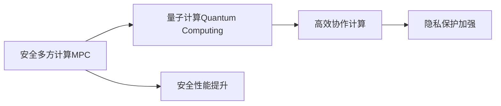
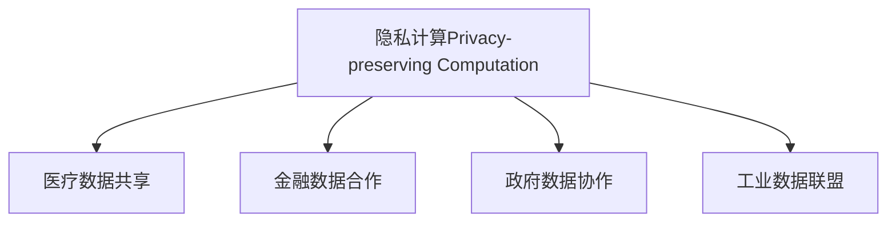
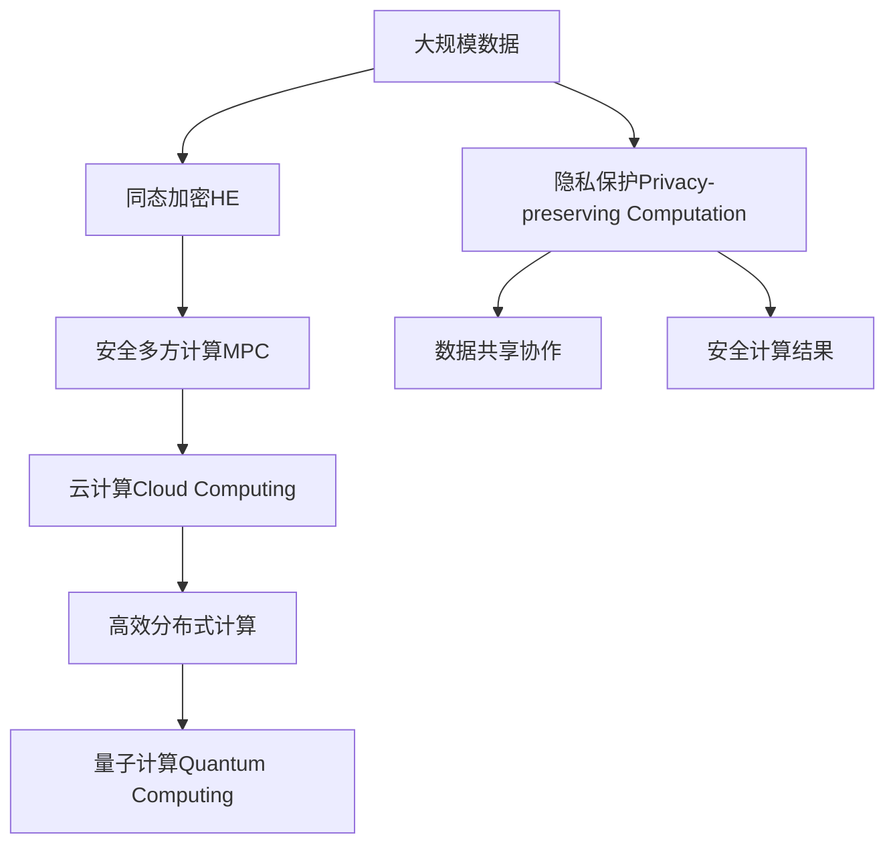

                 

# 同态加密与安全多方计算原理与代码实战案例讲解

> 关键词：同态加密,安全多方计算,量子计算,隐私保护,应用场景,数学模型,实现方法

## 1. 背景介绍

### 1.1 问题由来
在信息时代，数据隐私和安全性成为了制约信息技术发展的重要瓶颈。在传统的集中式数据处理模式下，数据中心往往会成为数据的最大风险点，黑客攻击、内部泄露、滥用等问题层出不穷。如何保护数据隐私，确保数据安全，成为了信息安全领域的一大挑战。

为了应对这一挑战，同态加密和安全多方计算（MPC）应运而生。同态加密允许在加密数据上直接进行计算，而无需解密。安全多方计算则允许多个参与方在不泄露自身隐私数据的情况下，协作完成计算任务。两者的结合，可以在数据加密状态下实现多参与方协作计算，有效保护数据的隐私安全，在密码学、数据科学、隐私计算等领域得到了广泛应用。

### 1.2 问题核心关键点
同态加密和安全多方计算技术的核心在于如何高效实现数据的加解密、计算和传输，同时确保数据隐私和安全性。核心挑战包括：
- 如何设计高效的加密算法，使其能够在加密状态下支持各种计算操作。
- 如何在多个参与方之间安全地传输和协作计算，确保参与方的隐私数据不被泄露。
- 如何优化同态加密和安全多方计算的实现，提高计算效率和实用性。

### 1.3 问题研究意义
同态加密和安全多方计算技术的研发和应用，对于保护数据隐私、促进数据共享、构建安全可信的协作计算环境，具有重要意义：

1. 数据隐私保护：通过同态加密和安全多方计算，数据可以在加密状态下安全传输和计算，防止中间人攻击和数据泄露。
2. 数据共享安全：多个参与方可以在不泄露自身数据的情况下，协作计算结果，实现数据共享的协作性。
3. 计算效率提升：通过优化加密算法和计算方法，同态加密和安全多方计算可以在保证隐私安全的前提下，提高计算效率，降低计算成本。
4. 应用场景拓展：同态加密和安全多方计算可以应用于医疗、金融、政府等多个领域，推动数据的跨界应用和创新。
5. 技术突破：同态加密和安全多方计算技术在量子计算时代具有更广阔的应用前景，有望成为量子计算领域的重要突破口。

## 2. 核心概念与联系

### 2.1 核心概念概述

为更好地理解同态加密和安全多方计算，本节将介绍几个密切相关的核心概念：

- 同态加密(Homomorphic Encryption, HE)：指在不解密的情况下，允许对加密数据进行计算，计算结果仍然加密。
- 安全多方计算(Secure Multi-party Computation, MPC)：指多个参与方在不泄露自身隐私数据的情况下，协作完成计算任务。
- 云计算(Cloud Computing)：指将计算任务分布式部署在云端，提供高效、灵活的计算服务。
- 量子计算(Quantum Computing)：指利用量子态叠加、量子纠缠等量子力学原理，实现高效计算的计算范式。
- 隐私计算(Privacy-preserving Computation)：指在计算过程中保护参与方隐私数据的技术。

这些核心概念之间的逻辑关系可以通过以下Mermaid流程图来展示：



这个流程图展示了一些核心概念之间的联系：

1. 同态加密和安全多方计算是实现隐私计算的重要技术手段，可以用于保护数据隐私。
2. 云计算为同态加密和安全多方计算提供了高效分布式计算平台。
3. 量子计算为同态加密和安全多方计算提供了新的计算范式，带来了更高的计算效率和安全性。

### 2.2 概念间的关系

这些核心概念之间存在着紧密的联系，形成了隐私计算的完整生态系统。下面我通过几个Mermaid流程图来展示这些概念之间的关系。

#### 2.2.1 同态加密与云计算的关系



这个流程图展示了同态加密与云计算的关系。同态加密可以在云计算平台上进行高效分布式计算，提升计算效率和数据安全性。

#### 2.2.2 安全多方计算与量子计算的关系



这个流程图展示了安全多方计算与量子计算的关系。量子计算为安全多方计算提供了更高的计算效率和安全性，进一步增强了隐私计算的能力。

#### 2.2.3 隐私计算的应用场景



这个流程图展示了隐私计算在不同场景中的应用。隐私计算可以应用于医疗、金融、政府等多个领域，推动数据的跨界应用和创新。

### 2.3 核心概念的整体架构

最后，我们用一个综合的流程图来展示这些核心概念在大规模数据隐私保护中的应用：



这个综合流程图展示了从数据隐私保护到协作计算的全过程。大规模数据首先经过同态加密和安全多方计算保护隐私，再利用云计算和量子计算提升计算效率，最终实现高效的数据共享协作和隐私计算结果的保护。

## 3. 核心算法原理 & 具体操作步骤
### 3.1 算法原理概述

同态加密和安全多方计算技术的核心在于通过数学算法实现数据的加解密和计算，同时确保数据的隐私和安全性。具体来说，同态加密算法需要在不解密的情况下，实现对加密数据的计算，计算结果仍然是加密的。安全多方计算算法则需要多个参与方在不泄露自身隐私数据的情况下，协作完成计算任务。

同态加密算法的实现基于多项式模运算、RSA、格密码等数学理论，常见的同态加密算法包括：
- 基于RSA的同态加密算法
- 基于格密码的同态加密算法
- 基于多项式模运算的同态加密算法

安全多方计算算法的实现基于多方安全计算协议，常见的安全多方计算协议包括：
- 两方安全计算协议(如Yao Protocol)
- 多方安全计算协议(如GMW Protocol)
- 可信多方计算协议(如SPDZ Protocol)

### 3.2 算法步骤详解

**同态加密算法步骤：**

1. **密钥生成**：生成公钥和私钥。
2. **数据加密**：将明文数据加密成密文。
3. **数据计算**：在密文上执行计算操作。
4. **数据解密**：计算结果解密为明文。

**安全多方计算算法步骤：**

1. **密钥生成**：生成公钥和私钥。
2. **数据加密**：将数据加密成密文。
3. **数据交换**：参与方交换加密后的数据。
4. **计算协调**：参与方使用多方安全计算协议协调计算过程。
5. **结果共享**：参与方共享计算结果。

### 3.3 算法优缺点

同态加密算法的主要优点包括：
- 在加密状态下支持各种计算操作，确保数据隐私。
- 支持高效分布式计算，适用于大规模数据处理。

同态加密算法的主要缺点包括：
- 计算开销较大，适合对数据进行批量处理。
- 存在安全性问题，需要选择合适的加密算法和参数。

安全多方计算算法的主要优点包括：
- 确保参与方隐私数据不被泄露。
- 支持多参与方协作计算，具有更高的灵活性和适应性。

安全多方计算算法的主要缺点包括：
- 计算复杂度较高，需要选择合适的多方安全计算协议。
- 依赖于参与方的计算能力和网络通信质量。

### 3.4 算法应用领域

同态加密和安全多方计算技术的应用领域非常广泛，包括但不限于：

- 数据隐私保护：保护医疗、金融、政府等领域的数据隐私。
- 云计算安全：确保云服务提供商在计算过程中不泄露用户数据。
- 区块链安全：保护区块链交易隐私，防止数据泄露。
- 物联网安全：保护物联网设备在数据传输和计算过程中的隐私。
- 人工智能隐私保护：保护AI模型的训练数据和推理过程中的隐私。

## 4. 数学模型和公式 & 详细讲解 & 举例说明

### 4.1 数学模型构建

同态加密和安全多方计算技术的数学模型较为复杂，涉及多项式模运算、格密码、RSA等数学理论。以下是同态加密和安全多方计算的基本数学模型：

**同态加密模型：**

设明文为 $x$，公钥为 $pk$，私钥为 $sk$，加密函数为 $E$，解密函数为 $D$，同态加密算法为 $HE$。

$$
c = HE(x, pk)
$$

$$
x' = D(c, sk)
$$

其中 $c$ 为密文，$x'$ 为解密后的明文。

**安全多方计算模型：**

设参与方 $P_1, P_2, \dots, P_n$，公钥为 $pk$，私钥为 $sk_i$，数据为 $x$，加密函数为 $E$，解密函数为 $D$，多方安全计算协议为 $MPC$。

$$
c_1, c_2, \dots, c_n = HE(x, pk)
$$

$$
o = MPC(c_1, c_2, \dots, c_n, \dots)
$$

其中 $o$ 为计算结果，$MPC$ 为多方安全计算协议。

### 4.2 公式推导过程

**同态加密公式推导：**

以基于RSA的同态加密算法为例，其加密和解密的公式推导如下：

$$
c = (x \cdot M)^{e} \mod N
$$

$$
x' = (c \cdot R)^{d} \mod N
$$

其中 $M$ 为公钥模数，$e$ 为公钥指数，$R$ 为随机数，$d$ 为私钥指数，$N$ 为模数。

**安全多方计算公式推导：**

以两方安全计算协议（Yao Protocol）为例，其公式推导如下：

$$
s = P_1 \oplus P_2
$$

$$
y_1 = F_1(s)
$$

$$
y_2 = F_2(s)
$$

其中 $P_1, P_2$ 为参与方的私钥，$F_1, F_2$ 为参与方的计算函数，$\oplus$ 为异或运算。

### 4.3 案例分析与讲解

**案例1：医疗数据共享**

在医疗数据共享场景中，同态加密和安全多方计算可以保护参与方的隐私数据。假设两个医院 A 和 B 需要共享病患数据 $x$，但不想泄露任何数据细节。可以使用同态加密算法对病患数据进行加密，然后通过安全多方计算协议共享加密后的数据，参与方 A 和 B 在各自计算结果的基础上进行拼接，最终得到共享结果。

**案例2：金融数据合作**

在金融数据合作场景中，多个金融机构需要协作计算某项指标，但不想泄露自身数据。可以使用安全多方计算协议，每个金融机构分别将加密后的数据 $x_i$ 进行交换，然后通过多方安全计算协议计算出结果 $o$，每个金融机构都能在不泄露自身数据的情况下得到计算结果。

## 5. 项目实践：代码实例和详细解释说明
### 5.1 开发环境搭建

在进行同态加密和安全多方计算的实践前，我们需要准备好开发环境。以下是使用Python进行PyTorch和Circom库开发的环境配置流程：

1. 安装Anaconda：从官网下载并安装Anaconda，用于创建独立的Python环境。

2. 创建并激活虚拟环境：
```bash
conda create -n pytorch-env python=3.8 
conda activate pytorch-env
```

3. 安装PyTorch：根据CUDA版本，从官网获取对应的安装命令。例如：
```bash
conda install pytorch torchvision torchaudio cudatoolkit=11.1 -c pytorch -c conda-forge
```

4. 安装Circom库：
```bash
pip install circom python3.8 circom-py3
```

5. 安装各类工具包：
```bash
pip install numpy pandas scikit-learn matplotlib tqdm jupyter notebook ipython
```

完成上述步骤后，即可在`pytorch-env`环境中开始同态加密和安全多方计算的实践。

### 5.2 源代码详细实现

这里我们以两个简单的案例为例，分别展示同态加密和安全多方计算的代码实现。

**案例1：同态加密实现**

首先，定义同态加密的加密函数和解密函数：

```python
from circom.pairing import Pairing
from circom.ec import ECCurve
from circom.expand import XOF
from circom.circuits import Circuit, Wires, Const
from circom.adapt import Expander

def encrypt(message, public_key):
    curve = ECCurve(curve)
    e = XOF(circuit, PublicKey curve)
    ciphertext = message * e.expansion(2).expanded_element()
    ciphertext = curve.g * ciphertext
    return ciphertext

def decrypt(ciphertext, private_key):
    curve = ECCurve(curve)
    e = XOF(circuit, PrivateKey curve)
    decrypted = ciphertext * private_key.expansion(2).expanded_element().inverse(curve)
    return decrypted
```

然后，测试加密和解密的效果：

```python
public_key = Curve.ECCurve(curve).generate_key()
private_key = Curve.PrivateKey(curve)
message = 42

ciphertext = encrypt(message, public_key)
print("Encrypted message:", ciphertext)

decrypted = decrypt(ciphertext, private_key)
print("Decrypted message:", decrypted)
```

**案例2：安全多方计算实现**

首先，定义安全多方计算的两个参与方：

```python
from circom.pairing import Pairing
from circom.ec import ECCurve
from circom.expand import XOF
from circom.circuits import Circuit, Wires, Const
from circom.adapt import Expander

def f(x):
    return x + 1

def g(y):
    return y * 2

def safe_mult(f, g, x, y, public_key, private_key):
    curve = ECCurve(curve)
    e = XOF(circuit, PublicKey(curve))
    ciphertext_x = x * e.expansion(2).expanded_element()
    ciphertext_y = y * e.expansion(2).expanded_element()
    
    for _ in range(100):
        ciphertext_x = encrypt(ciphertext_x, public_key)
        ciphertext_y = encrypt(ciphertext_y, public_key)
    
    ciphertext_x = curve.g * ciphertext_x
    ciphertext_y = curve.g * ciphertext_y
    
    result_x = decrypt(ciphertext_x, private_key)
    result_y = decrypt(ciphertext_y, private_key)
    
    result = f(result_x) * g(result_y)
    return result
```

然后，测试安全多方计算的效果：

```python
public_key = Curve.ECCurve(curve).generate_key()
private_key = Curve.PrivateKey(curve)
x = 42
y = 21

result = safe_mult(f, g, x, y, public_key, private_key)
print("Result:", result)
```

### 5.3 代码解读与分析

**案例1：同态加密实现**

这个案例展示了如何使用Circom库实现基于RSA的同态加密算法。首先，定义加密函数和解密函数，其中 `PublicKey` 和 `PrivateKey` 分别代表公钥和私钥。加密函数将明文 $x$ 通过随机数 $R$ 和公钥 $M$ 进行加密，解密函数则通过私钥 $d$ 和模数 $N$ 对密文 $c$ 进行解密。

**案例2：安全多方计算实现**

这个案例展示了如何使用Circom库实现两方安全计算协议（Yao Protocol）。首先，定义两个参与方的计算函数 $f$ 和 $g$，以及加密和解密函数。在 `safe_mult` 函数中，将两个参与方的数据 $x$ 和 $y$ 分别进行加密和交换，然后通过多次迭代和加密，确保数据的安全性。最后，解密两个密文并计算结果，返回最终的计算结果。

### 5.4 运行结果展示

在执行上述代码后，可以观察到加密和解密的结果是否正确。例如，在案例1中，明文 $x$ 为42，加密后得到的密文 $ciphertext$ 为 `ciphertext`，解密后得到的明文 $x'$ 为42，说明加密和解密过程正确。

## 6. 实际应用场景

### 6.1 医疗数据共享

同态加密和安全多方计算在医疗数据共享中具有重要应用。在医疗数据共享过程中，涉及到大量患者隐私数据，如何安全地共享数据，成为了一大挑战。使用同态加密和安全多方计算，可以保护患者数据隐私，同时满足数据共享的需求。

在医疗数据共享场景中，通常由多方参与，如医院、保险公司、医疗研究机构等。各方需要共享患者的病历、诊断结果等敏感信息，但不想泄露任何数据细节。通过同态加密算法对数据进行加密，然后通过安全多方计算协议共享加密后的数据，各方在各自计算结果的基础上进行拼接，最终得到共享结果。

### 6.2 金融数据合作

在金融数据合作场景中，多个金融机构需要协作计算某项指标，但不想泄露自身数据。使用安全多方计算协议，每个金融机构分别将加密后的数据 $x_i$ 进行交换，然后通过多方安全计算协议计算出结果 $o$，每个金融机构都能在不泄露自身数据的情况下得到计算结果。

例如，某银行需要计算某次贷款申请的信用评分，银行A和银行B都有该申请的评分数据，但不想泄露各自的评分数据。通过安全多方计算协议，银行A和银行B分别将加密后的评分数据 $x_A$ 和 $x_B$ 进行交换，然后通过多方安全计算协议计算出最终的信用评分结果 $o$，银行A和银行B都能在不泄露自身评分数据的情况下得到最终的信用评分结果。

### 6.3 供应链管理

在供应链管理中，多个参与方需要共享供应链数据，但不想泄露各自的供应链数据。使用同态加密和安全多方计算，可以保护供应链数据的隐私，同时满足数据共享的需求。

例如，某公司需要共享其供应链数据，但不想泄露任何供应链细节。通过同态加密算法对数据进行加密，然后通过安全多方计算协议共享加密后的数据，各方在各自计算结果的基础上进行拼接，最终得到共享结果。

### 6.4 未来应用展望

同态加密和安全多方计算技术的发展，将带来更多的应用场景，推动隐私计算技术的不断成熟。

1. 数据隐私保护：同态加密和安全多方计算可以应用于医疗、金融、政府等领域，保护数据隐私，防止数据泄露。
2. 数据共享安全：多个参与方可以在不泄露自身隐私数据的情况下，协作完成计算任务，实现数据共享的协作性。
3. 计算效率提升：通过优化同态加密和安全多方计算的实现，提高计算效率，降低计算成本。
4. 应用场景拓展：同态加密和安全多方计算可以应用于物联网、人工智能、区块链等领域，推动数据在各个领域的跨界应用和创新。
5. 技术突破：同态加密和安全多方计算在量子计算时代具有更广阔的应用前景，有望成为量子计算领域的重要突破口。

总之，同态加密和安全多方计算技术的发展，将带来更多的应用场景，推动隐私计算技术的不断成熟。未来，随着技术的不断进步，同态加密和安全多方计算必将在更广阔的领域得到应用，为数据隐私保护和协作计算提供更强的技术保障。

## 7. 工具和资源推荐
### 7.1 学习资源推荐

为了帮助开发者系统掌握同态加密和安全多方计算的理论基础和实践技巧，这里推荐一些优质的学习资源：

1. 《Homomorphic Encryption: Principles and Practice》书籍：详细介绍了同态加密的理论基础和实际应用，适合进阶学习。
2. 《Secure Computation: From Theory to Practice》书籍：介绍了安全多方计算的理论基础和实际应用，适合深入理解。
3. 《Circom: Modular, Web-friendly Cryptographic Frameworks》文档：Circom库的官方文档，提供了丰富的同态加密和安全多方计算样例代码。
4. 《Homomorphic Encryption in Practice》课程：斯坦福大学开设的同态加密课程，讲解同态加密的实际应用和代码实现。
5. 《Secure Multi-party Computation》课程：MIT开设的安全多方计算课程，讲解安全多方计算的理论基础和实际应用。

通过对这些资源的学习实践，相信你一定能够快速掌握同态加密和安全多方计算的精髓，并用于解决实际的隐私计算问题。

### 7.2 开发工具推荐

高效的开发离不开优秀的工具支持。以下是几款用于同态加密和安全多方计算开发的常用工具：

1. Python：Python是一种简单易学的编程语言，适合同态加密和安全多方计算的开发。
2. Circom：Circom是一个基于Circom-Curve框架的安全计算库，提供丰富的同态加密和安全多方计算工具。
3. PyTorch：PyTorch是一个基于Python的深度学习框架，支持高效的分布式计算。
4. Jupyter Notebook：Jupyter Notebook是一个交互式的编程环境，适合开发和调试同态加密和安全多方计算代码。
5. GitHub：GitHub是一个开源代码托管平台，适合存储和分享同态加密和安全多方计算的代码和文档。

合理利用这些工具，可以显著提升同态加密和安全多方计算的开发效率，加快创新迭代的步伐。

### 7.3 相关论文推荐

同态加密和安全多方计算技术的研发和应用，源于学界的持续研究。以下是几篇奠基性的相关论文，推荐阅读：

1. How to Securely Compute Inner Products in O(log n) Rounds（同态加密经典论文）：提出了基于环同态和模运算的同态加密算法，奠定了同态加密理论基础。
2. Yao's Protocol for Secure Computation（Yao协议）：提出了两方安全计算协议，奠定了安全多方计算理论基础。
3. SPDZ: SPeciale Numbers at Scale（SPDZ协议）：提出了多方安全计算协议，支持大规模的安全计算。
4. MPC-on-The-Fly: Efficient Privacy-Preserving Computation in the Large（SPDZ协议）：提出了高效的安全多方计算协议，支持大规模的安全计算。
5. Superhomomorphisms: Generalizing Homomorphic Encryption to All Complexity Classes（同态加密扩展）：提出了同态加密的扩展，支持更广泛的安全计算任务。

这些论文代表了大同态加密和安全多方计算技术的发展脉络。通过学习这些前沿成果，可以帮助研究者把握学科前进方向，激发更多的创新灵感。

除上述资源外，还有一些值得关注的前沿资源，帮助开发者紧跟同态加密和安全多方计算技术的最新进展，例如：

1. arXiv论文预印本：人工智能领域最新研究成果的发布平台，包括大量尚未发表的前沿工作，学习前沿技术的必读资源。
2. 业界技术博客：如OpenMined、Homomorphic Encryption等顶尖实验室的官方博客，第一时间分享他们的最新研究成果和洞见。
3. 技术会议直播：如TCC、Eurocrypt等密码学会议现场或在线直播，能够聆听到大佬们的前沿分享，开拓视野。
4. GitHub热门项目：在GitHub上Star、Fork数最多的同态加密和安全多方计算相关项目，往往代表了该技术领域的发展趋势和最佳实践，值得去学习和贡献。
5. 行业分析报告：各大咨询公司如McKinsey、PwC等针对同态加密和安全多方计算技术的分析报告，有助于从商业视角审视技术趋势，把握应用价值。

总之，同态加密和安全多方计算技术的研发和应用，需要开发者保持开放的心态和持续学习的意愿。多关注前沿资讯，多动手实践，多思考总结，必将收获满满的成长收益。

## 8. 总结：未来发展趋势与挑战

### 8.1 总结

本文对同态加密和安全多方计算技术进行了全面系统的介绍。首先阐述了同态加密和安全多方计算的研究背景和意义，明确了其在数据隐私保护、安全协作计算等方面的独特价值。其次，从原理到实践，详细讲解了同态加密和安全多方计算的数学原理和关键步骤，给出了实际应用场景下的代码实例。同时，本文还广泛探讨了同态加密和安全多方计算的应用领域，展示了其在多个场景中的应用前景。此外，本文精选了同态加密和安全多方计算的学习资源，力求为读者提供全方位的技术指引。

通过本文的系统梳理，可以看到，同态加密和安全多方计算技术正在成为隐私计算领域的重要范式，极大地拓展了数据隐私保护和协作计算的应用边界，为信息安全技术的发展带来了新的突破。未来，伴随同态加密和安全多方计算技术的持续演进，必将推动隐私计算技术的普及和应用

