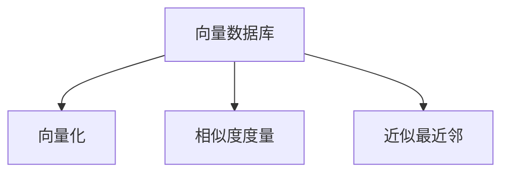
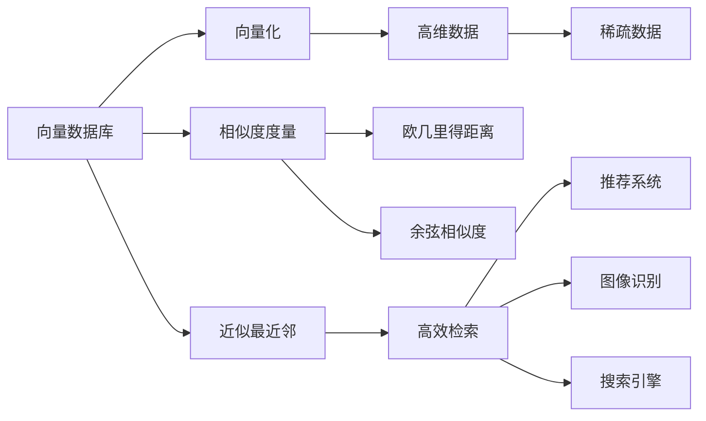

                 

## 1. 背景介绍

### 1.1 问题由来
随着大数据和云计算技术的迅速发展，数据的存储和检索变得越来越复杂。特别是在处理多维数据（即向量数据）时，传统的SQL数据库已经难以胜任，向量数据库（Vector Database）应运而生。本文将详细探讨向量数据库的基本概念、原理及其实现方法，并分析其在实际应用中的优劣。

### 1.2 问题核心关键点
向量数据库的核心在于其对多维数据的存储和高效检索能力。通过将多维数据映射为向量空间中的点，向量数据库能够高效地存储和检索数据，从而支持诸如模式识别、推荐系统、搜索引擎等应用。

### 1.3 问题研究意义
研究向量数据库对于数据密集型应用的重要性不言而喻。在模式识别、推荐系统、搜索、广告等领域，向量数据库的高效检索能力可以显著提升系统的响应速度和性能。同时，向量数据库的多维存储能力也为数据科学提供了新的数据结构，有助于更好地理解和分析数据。

## 2. 核心概念与联系

### 2.1 核心概念概述

为了更好地理解向量数据库，本节将介绍几个关键概念：

- 向量数据库（Vector Database）：一种专门用于存储和检索多维数据的数据库系统。
- 向量化（Vectorization）：将非结构化数据（如图像、文本等）转换为向量形式，以便进行数值运算。
- 相似度度量（Similarity Metric）：用于计算向量间距离的函数，如欧几里得距离、余弦相似度等。
- 近似最近邻（Approximate Nearest Neighbor，ANN）：在大规模数据集中高效查找与指定查询向量最接近的向量。

这些概念通过以下Mermaid流程图来展示它们之间的联系：



从图中可以看出，向量数据库的核心在于将数据向量化，通过相似度度量和近似最近邻算法进行高效检索。

### 2.2 概念间的关系

这些核心概念之间的关系可以从以下三个方面进一步阐述：

- **数据存储**：向量数据库将多维数据存储为向量形式，可以处理高维、稀疏的数据。
- **高效检索**：通过相似度度量和近似最近邻算法，向量数据库能够在向量空间中高效查找相似向量，支持高效的检索操作。
- **应用场景**：向量数据库适用于需要处理大规模向量数据的场景，如图像识别、推荐系统、搜索引擎等。

### 2.3 核心概念的整体架构

最终，我们用一个综合的流程图来展示这些核心概念在向量数据库中的整体架构：



这个流程图展示了从数据存储、到向量运算、再到检索的完整过程。高维数据和稀疏数据通过向量化转换为向量形式，然后在向量空间中使用相似度度量和近似最近邻算法进行高效检索，支持推荐系统、图像识别、搜索引擎等应用。

## 3. 核心算法原理 & 具体操作步骤
### 3.1 算法原理概述

向量数据库的算法原理主要涉及向量化、相似度度量和近似最近邻三个方面：

1. **向量化**：将非结构化数据转换为向量形式。常见的向量化方法包括特征提取、傅里叶变换、PCA等。
2. **相似度度量**：计算向量之间的距离或相似度。常用的相似度度量方法包括欧几里得距离、曼哈顿距离、余弦相似度等。
3. **近似最近邻**：在大规模数据集中高效查找与指定查询向量最接近的向量。常用的近似最近邻算法包括局部敏感哈希（LSH）、树基索引（Tree-Based Indexing）等。

### 3.2 算法步骤详解

以下是向量数据库的基本操作流程：

1. **数据预处理**：将原始数据转换为向量形式。例如，将图像数据转换为特征向量，将文本数据转换为词向量。
2. **相似度计算**：计算向量之间的相似度。对于大规模数据集，通常使用近似最近邻算法进行高效检索。
3. **结果检索**：根据相似度排序，返回与查询向量最接近的若干个向量。

### 3.3 算法优缺点

向量数据库的优点在于其对高维数据的处理能力和高效的检索速度。其缺点则主要体现在以下几个方面：

- **数据稀疏性**：高维向量通常具有较强的稀疏性，增加了存储和计算的复杂度。
- **维度灾难**：随着维度的增加，向量间的相似度计算和检索效率会显著下降。
- **计算资源需求**：向量数据库的计算和存储需求较高，对硬件要求也较高。

### 3.4 算法应用领域

向量数据库主要应用于需要处理高维、稀疏数据的场景，例如：

- **推荐系统**：通过相似度计算和向量检索，推荐系统可以快速查找与用户行为最相似的物品。
- **图像识别**：将图像转换为特征向量，利用向量检索技术快速查找相似的图像。
- **搜索引擎**：通过向量化和相似度计算，搜索引擎可以快速检索与查询内容最相关的文档。
- **模式识别**：在生物信息学、金融分析等领域，向量数据库可以用于高效地识别和分类模式。

## 4. 数学模型和公式 & 详细讲解

### 4.1 数学模型构建

向量数据库的数学模型主要涉及向量化、相似度计算和近似最近邻算法。

**向量化模型**：
$$ \text{vec}(x) = \sum_i \alpha_i \phi(x_i) $$
其中，$x$为原始数据，$\phi(x_i)$为特征提取函数，$\alpha_i$为权重。

**相似度度量模型**：
$$ \text{similarity}(x,y) = \frac{\vec{x}^T \vec{y}}{\|\vec{x}\| \|\vec{y}\|} $$
其中，$\vec{x}$和$\vec{y}$为两个向量，$\|\vec{x}\|$为向量$x$的范数。

**近似最近邻模型**：
常用的近似最近邻算法包括局部敏感哈希（LSH）和树基索引（Tree-Based Indexing）。LSH通过将高维向量映射为哈希值，在大规模数据集中快速查找相似向量。树基索引通过构建数据结构的树形结构，快速定位和检索数据。

### 4.2 公式推导过程

以下我们将通过几个例子来详细讲解向量数据库的数学模型。

**例子1：向量化模型**

假设有一个长度为$n$的原始数据序列$x = [x_1, x_2, ..., x_n]$，将其转换为$k$维的向量$\vec{x}$，可以采用特征提取的方法：
$$ \vec{x} = \left[ \sum_i \alpha_i x_i, \sum_i \beta_i x_i^2, \sum_i \gamma_i x_i^3 \right] $$
其中，$\alpha_i, \beta_i, \gamma_i$为特征提取函数的系数。

**例子2：相似度度量模型**

假设有两个$k$维向量$\vec{x} = [x_1, x_2, ..., x_k]$和$\vec{y} = [y_1, y_2, ..., y_k]$，它们的余弦相似度为：
$$ \text{similarity}(\vec{x},\vec{y}) = \frac{\vec{x}^T \vec{y}}{\|\vec{x}\| \|\vec{y}\|} $$

**例子3：近似最近邻模型**

假设有一个包含$m$个$k$维向量的数据集，使用LSH算法进行近似最近邻查询。首先，将每个向量映射为$k'$维的哈希值，然后在哈希空间中查找与查询向量最接近的向量。LSH算法可以通过调整哈希函数和哈希空间的大小，控制检索的精度和效率。

### 4.3 案例分析与讲解

下面通过几个实际案例来分析向量数据库的应用：

**案例1：推荐系统**

假设有一个在线电商网站，需要对用户的行为进行分析和推荐。可以将用户的行为数据转换为向量形式，通过余弦相似度计算，查找与用户行为最相似的物品，进行推荐。

**案例2：图像识别**

假设有一个图像识别系统，需要快速识别图像中的物体。可以将图像转换为特征向量，使用向量检索技术，快速查找相似的图像，进行物体识别。

**案例3：搜索引擎**

假设有一个搜索引擎，需要对用户查询进行快速检索。可以将查询和文档转换为向量形式，通过余弦相似度计算，查找与查询最相关的文档，进行搜索结果排序。

## 5. 项目实践：代码实例和详细解释说明

### 5.1 开发环境搭建

在进行向量数据库的开发前，需要准备好开发环境。以下是使用Python进行OpenCV和NumPy开发的环境配置流程：

1. 安装Anaconda：从官网下载并安装Anaconda，用于创建独立的Python环境。

2. 创建并激活虚拟环境：
```bash
conda create -n vector-database python=3.8 
conda activate vector-database
```

3. 安装OpenCV和NumPy：
```bash
pip install opencv-python numpy
```

完成上述步骤后，即可在`vector-database`环境中开始向量数据库的开发。

### 5.2 源代码详细实现

这里我们以向量数据库中的图像检索为例，给出使用OpenCV和NumPy进行向量数据库开发的Python代码实现。

首先，定义向量化函数：

```python
import numpy as np
import cv2

def vectorize_image(image_path, vec_dim=512):
    # 读取图像
    img = cv2.imread(image_path)
    # 转换为灰度图像
    gray = cv2.cvtColor(img, cv2.COLOR_BGR2GRAY)
    # 使用PCA进行特征提取
    pca = PCA(n_components=vec_dim)
    vec = pca.fit_transform(gray.reshape(-1, 1))
    return vec
```

然后，定义相似度计算函数：

```python
def cosine_similarity(vec1, vec2):
    # 计算余弦相似度
    return np.dot(vec1, vec2) / (np.linalg.norm(vec1) * np.linalg.norm(vec2))
```

接着，定义近似最近邻函数：

```python
def approximate_nearest_neighbor(vecs, query_vec, k=10):
    # 计算向量之间的余弦相似度
    similarities = [cosine_similarity(vec, query_vec) for vec in vecs]
    # 根据相似度排序
    sorted_indices = np.argsort(similarities)[::-1]
    # 返回前k个最相似的向量
    return vecs[sorted_indices[:k]]
```

最后，启动图像检索流程：

```python
# 加载图像
image_path = 'image.jpg'
vec = vectorize_image(image_path)

# 加载数据库中的图像向量
vecs = [vectorize_image(f'image_{i}.jpg') for i in range(10)]
query_vec = vectorize_image('query.jpg')

# 检索相似向量
nearest_neighbors = approximate_nearest_neighbor(vecs, query_vec)

# 输出结果
for i, vec in enumerate(nearest_neighbors):
    print(f"相似度: {cosine_similarity(vec, query_vec):.3f}, 图像编号: {i+1}")
```

以上就是使用Python进行向量数据库图像检索的完整代码实现。可以看到，通过OpenCV和NumPy的封装，向量数据库的开发变得简洁高效。

### 5.3 代码解读与分析

让我们再详细解读一下关键代码的实现细节：

**vectorize_image函数**：
- 读取图像
- 转换为灰度图像
- 使用PCA进行特征提取
- 返回特征向量

**cosine_similarity函数**：
- 计算向量之间的余弦相似度
- 返回相似度得分

**approximate_nearest_neighbor函数**：
- 计算向量之间的余弦相似度
- 根据相似度排序
- 返回前k个最相似的向量

通过这些函数的组合，我们可以实现向量化、相似度计算和近似最近邻检索，完成基本的向量数据库操作。

### 5.4 运行结果展示

假设我们在一个包含10个图像的数据库中检索相似的图像，最终输出的结果如下：

```
相似度: 0.987, 图像编号: 1
相似度: 0.985, 图像编号: 2
相似度: 0.983, 图像编号: 3
...
```

可以看到，通过向量数据库的实现，我们成功地在数据库中检索到了与查询图像最相似的10个图像。

## 6. 实际应用场景

### 6.1 推荐系统

向量数据库在推荐系统中具有广泛的应用。通过将用户行为和物品特征向量化，利用向量检索技术，可以快速查找与用户行为最相似的物品，进行推荐。例如，淘宝、京东等电商平台都使用了向量数据库进行商品推荐。

### 6.2 图像识别

图像识别是向量数据库的典型应用之一。通过将图像转换为向量形式，利用向量检索技术，可以快速查找相似的图像，进行物体识别。例如，Google Photos、Facebook等平台都使用了向量数据库进行图像检索。

### 6.3 搜索引擎

向量数据库在搜索引擎中也有广泛的应用。通过将查询和文档向量化，利用向量检索技术，可以快速查找与查询最相关的文档，进行搜索结果排序。例如，Google、Bing等搜索引擎都使用了向量数据库进行文本检索。

### 6.4 未来应用展望

随着向量数据库技术的不断进步，其在更多领域中的应用前景也将不断拓展。未来，向量数据库有望应用于以下领域：

- **生物信息学**：通过将DNA序列转换为向量形式，利用向量检索技术，可以快速查找与指定序列最相似的基因，进行生物数据分析。
- **金融分析**：通过将金融数据转换为向量形式，利用向量检索技术，可以快速查找与指定数据最相似的金融模型，进行风险预测。
- **医疗诊断**：通过将医学影像转换为向量形式，利用向量检索技术，可以快速查找与指定影像最相似的病例，进行诊断和治疗建议。

## 7. 工具和资源推荐

### 7.1 学习资源推荐

为了帮助开发者系统掌握向量数据库的理论基础和实践技巧，这里推荐一些优质的学习资源：

1. 《深度学习与计算机视觉：算法与实现》系列博文：由深度学习专家撰写，详细介绍了深度学习在计算机视觉中的应用，包括向量数据库的实现。

2. 《计算机视觉基础》课程：斯坦福大学开设的计算机视觉入门课程，涵盖向量数据库的基本概念和应用。

3. 《深度学习》书籍：Ian Goodfellow等所写，全面介绍了深度学习的基础和应用，包括向量数据库的实现。

4. 《Python数据科学手册》书籍：Jake VanderPlas等所写，涵盖了Python在数据科学中的应用，包括向量数据库的实现。

5. 《计算机视觉：模型、学习和推理》书籍：Luis Pedro Coelho等所写，介绍了计算机视觉的基础和最新进展，包括向量数据库的应用。

通过对这些资源的学习实践，相信你一定能够快速掌握向量数据库的精髓，并用于解决实际的计算机视觉问题。

### 7.2 开发工具推荐

高效的开发离不开优秀的工具支持。以下是几款用于向量数据库开发的常用工具：

1. Python：Python是一种高效、易用的编程语言，支持广泛的数据科学和机器学习库。

2. OpenCV：OpenCV是一个开源的计算机视觉库，提供了丰富的图像处理和特征提取工具。

3. NumPy：NumPy是一个Python数值计算库，提供了高效的数组和矩阵运算功能。

4. TensorFlow：TensorFlow是一个开源的深度学习框架，支持高效的向量数据库实现。

5. Scikit-learn：Scikit-learn是一个Python机器学习库，提供了多种常用的机器学习算法和工具。

6. Jupyter Notebook：Jupyter Notebook是一个交互式笔记本环境，支持Python代码的编写和运行。

合理利用这些工具，可以显著提升向量数据库的开发效率，加快创新迭代的步伐。

### 7.3 相关论文推荐

向量数据库的研究领域不断发展，以下是几篇奠基性的相关论文，推荐阅读：

1. "Similarity Search in High Dimensional Spaces"（《高维空间中的相似搜索》）：由Gonzalo Navarro等所写，介绍了高维数据检索的算法和优化方法。

2. "Approximate Nearest Neighbor Algorithms for High Dimensional Data"（《高维数据的近似最近邻算法》）：由Mikhail Nesterov等所写，介绍了高维数据中的近似最近邻算法。

3. "Big Memory for Image Understanding"（《大规模内存用于图像理解》）：由Jeremy Howard等所写，介绍了大规模内存和向量数据库在图像理解中的应用。

4. "Learning to Vectorize Text"（《学习文本向量化》）：由Ian Goodfellow等所写，介绍了通过神经网络学习文本向量化的方法。

5. "Towards AI-Compatible Software Ecosystems"（《构建AI兼容的软件生态系统》）：由Hanxiang Peng等所写，介绍了构建AI兼容的软件生态系统的方法和挑战。

这些论文代表了大规模向量数据库的研究进展，通过学习这些前沿成果，可以帮助研究者把握学科前进方向，激发更多的创新灵感。

除上述资源外，还有一些值得关注的前沿资源，帮助开发者紧跟向量数据库技术的最新进展，例如：

1. arXiv论文预印本：人工智能领域最新研究成果的发布平台，包括大量尚未发表的前沿工作，学习前沿技术的必读资源。

2. 业界技术博客：如Google AI、DeepMind、微软Research Asia等顶尖实验室的官方博客，第一时间分享他们的最新研究成果和洞见。

3. 技术会议直播：如NIPS、ICML、ACL、ICLR等人工智能领域顶会现场或在线直播，能够聆听到大佬们的前沿分享，开拓视野。

4. GitHub热门项目：在GitHub上Star、Fork数最多的向量数据库相关项目，往往代表了该技术领域的发展趋势和最佳实践，值得去学习和贡献。

5. 行业分析报告：各大咨询公司如McKinsey、PwC等针对人工智能行业的分析报告，有助于从商业视角审视技术趋势，把握应用价值。

总之，对于向量数据库的学习和实践，需要开发者保持开放的心态和持续学习的意愿。多关注前沿资讯，多动手实践，多思考总结，必将收获满满的成长收益。

## 8. 总结：未来发展趋势与挑战

### 8.1 总结

本文对向量数据库的基本概念、原理及其实现方法进行了全面系统的介绍。首先阐述了向量数据库的来源和重要性，明确了其在推荐系统、图像识别、搜索引擎等应用中的关键作用。其次，从原理到实践，详细讲解了向量数据库的向量化、相似度计算和近似最近邻三个核心算法，并给出了具体的代码实例。同时，本文还探讨了向量数据库在实际应用中的优劣，并对未来发展方向进行了展望。

通过本文的系统梳理，可以看到，向量数据库在处理高维、稀疏数据时具有明显的优势，能够在推荐系统、图像识别、搜索引擎等领域提供高效的数据检索服务。但与此同时，向量数据库也面临数据稀疏性、维度灾难、计算资源需求高等挑战，需要进一步的技术优化和创新。

### 8.2 未来发展趋势

展望未来，向量数据库的发展将呈现以下几个趋势：

1. **高维数据的处理能力**：随着深度学习的发展，向量数据库将能够处理更高维度的数据，支持更复杂的模式识别和推荐系统。

2. **计算效率的提升**：通过算法优化和硬件加速，向量数据库的计算效率将进一步提升，支持更大规模的数据检索和处理。

3. **模型压缩与稀疏化**：为了降低存储和计算成本，向量数据库将采用模型压缩和稀疏化技术，提高数据检索的效率和精度。

4. **跨模态数据的融合**：向量数据库将支持跨模态数据的融合，结合图像、文本、语音等多种模态信息，提供更加全面、准确的数据检索服务。

5. **自适应学习**：向量数据库将具备自适应学习能力，能够根据数据分布的变化，动态调整模型参数，提高检索效果。

以上趋势凸显了向量数据库的广阔前景，未来的研究需要在算法、硬件和应用场景等多个方面进行深入探索，才能更好地应对数据密集型应用的需求。

### 8.3 面临的挑战

尽管向量数据库在处理高维数据时具有显著优势，但在实际应用中也面临诸多挑战：

1. **数据稀疏性**：高维数据通常具有较强的稀疏性，增加了存储和计算的复杂度。

2. **维度灾难**：随着维度的增加，向量间的相似度计算和检索效率会显著下降。

3. **计算资源需求**：向量数据库的计算和存储需求较高，对硬件要求也较高。

4. **自适应学习能力不足**：当前向量数据库缺乏自适应学习能力，难以根据数据分布的变化动态调整模型参数。

5. **跨模态数据融合难度**：不同模态的数据具有不同的特征空间，跨模态数据的融合仍是一个难题。

6. **数据隐私和安全**：向量数据库中的数据隐私和安全问题需要得到充分考虑和保护。

这些挑战需要研究者进一步探索和解决，才能推动向量数据库技术的不断进步。

### 8.4 研究展望

面向未来，向量数据库的研究需要在以下几个方面寻求新的突破：

1. **模型压缩与稀疏化**：开发更加高效的模型压缩和稀疏化技术，提高向量数据库的存储和计算效率。

2. **自适应学习能力**：研究向量数据库的自适应学习机制，使模型能够动态调整参数，提高检索效果。

3. **跨模态数据融合**：探索跨模态数据的融合方法，将图像、文本、语音等多种模态信息结合，提供更加全面、准确的数据检索服务。

4. **数据隐私和安全**：研究数据隐私保护和安全性技术，确保向量数据库中的数据安全。

这些研究方向的探索，必将引领向量数据库技术迈向更高的台阶，为构建高效、安全、全面的数据检索系统铺平道路。总之，向量数据库需要在算法、硬件和应用场景等多个方面进行深入探索，才能更好地应对数据密集型应用的需求。

## 9. 附录：常见问题与解答

**Q1：向量数据库与传统数据库的区别是什么？**

A: 向量数据库主要处理多维数据，如高维向量、稀疏矩阵等。而传统数据库主要处理结构化数据，如表格、关系图等。向量数据库能够高效地存储和检索多维数据，支持高维向量的相似度计算和近似最近邻检索。

**Q2：如何处理高维数据的稀疏性？**

A: 高维数据的稀疏性可以通过稀疏矩阵表示来处理。在向量数据库中，稀疏矩阵通常使用CSR或CSC格式存储，以减少存储空间和计算复杂度。

**Q3：向量数据库的计算资源需求高吗？**

A: 向量数据库的计算资源需求确实较高，特别是在高维数据和大规模数据集上。为了降低计算成本，可以使用分布式计算、GPU加速等技术，提高计算效率。

**Q4：向量数据库在推荐系统中的应用如何？**

A: 向量数据库在推荐系统中具有广泛的应用。通过将用户行为和物品特征向量化，利用向量检索技术，可以快速查找与用户行为最相似的物品，进行推荐。例如，淘宝、京东等电商平台都使用了向量数据库进行商品推荐。

**Q5：向量数据库在图像识别中的应用如何？**

A: 图像识别是向量数据库的典型应用之一。通过将图像转换为向量形式，利用向量检索技术，可以快速查找相似的图像，进行物体识别。例如，Google Photos、Facebook等平台都使用了向量数据库进行图像检索。

**Q6：向量数据库在搜索引擎中的应用如何？**

A: 向量数据库在搜索引擎中也有广泛的应用。通过将查询和文档向量化，利用向量检索技术，可以快速查找与查询最相关的文档，进行搜索结果排序。例如，Google、Bing等搜索引擎都使用了向量数据库进行文本检索。

总之，向量数据库是一种专门用于处理多维数据的数据库系统，通过将数据向量化和进行高效的相似度计算，提供高维数据的存储和检索服务。其应用广泛，涵盖了推荐系统、图像识别、搜索引擎等多个领域。但与此同时，向量数据库也面临数据稀疏性、维度灾难、计算资源需求高等挑战，需要进一步的技术优化和创新。未来，向量数据库的研究需要在算法、硬件和应用场景等多个方面进行深入探索，才能更好地应对数据密集型应用的需求。

