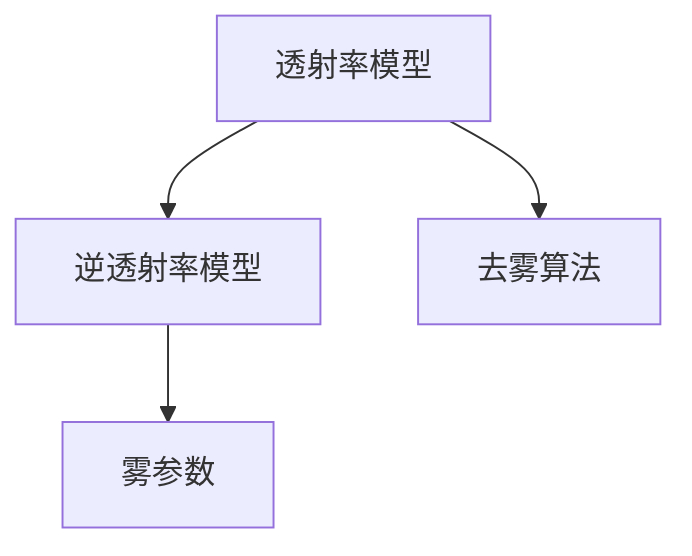
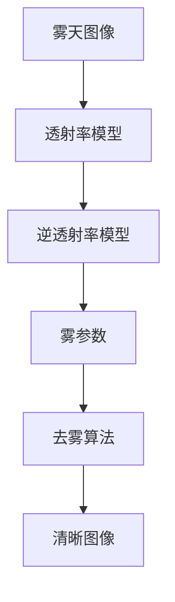

                 

## 1. 背景介绍

### 1.1 问题由来
在大气散射效应和天气条件恶劣的情况下，图像可能变得模糊不清，导致视觉质量下降，影响后续的图像处理和分析。这一现象在低能见度条件下尤为明显，如雾天、霾天、雨天等。针对这一问题，图像去雾（Image Dehazing）技术应运而生。

### 1.2 问题核心关键点
图像去雾技术旨在通过计算模型的处理，恢复清晰、无雾的图像，提升图像质量。其核心问题包括：
- 雾天的图像退化模型。
- 去雾算法的有效性及稳定性。
- 去雾算法的计算效率和可扩展性。
- 去雾算法在不同场景中的适用性。

### 1.3 问题研究意义
图像去雾技术对增强视觉感知、改善交通监测、提升安防监控等众多领域具有重要意义：
- 提升交通监控的清晰度，帮助驾驶员更好地了解路况。
- 改善医疗影像的清晰程度，辅助医生进行精准诊断。
- 增强安防监控的识别效果，保障公共安全。
- 促进智能城市的建设，提升城市治理水平。

因此，研究高效的图像去雾算法，对于改善图像质量、提升图像处理和分析能力具有重要的实际应用价值。

## 2. 核心概念与联系

### 2.1 核心概念概述

图像去雾是计算机视觉中的一项重要技术，主要解决由于大气散射导致的图像模糊问题。其核心思想是通过去除或减少雾气，使得原本模糊不清的图像变得清晰。

核心概念包括：
- **透射率模型**：用于描述大气散射效应对光线传播的影响。
- **逆透射率模型**：用于推导去雾过程的数学模型。
- **雾参数**：如能见度、雾滴大小等，影响去雾效果。
- **去雾算法**：用于恢复图像的清晰度的算法。

### 2.2 概念间的关系

图像去雾的关键在于构建雾散射模型，并在此基础上设计相应的去雾算法。透射率模型和逆透射率模型是构建去雾算法的基础，雾参数则是影响去雾效果的重要因素。因此，它们之间存在密切的联系。

通过以下Mermaid流程图来展示这些核心概念之间的关系：



透射率模型和逆透射率模型共同构建了雾散射的物理基础，雾参数则影响了去雾算法的效果。去雾算法的核心在于如何根据透射率模型和逆透射率模型推导出清晰的图像。

### 2.3 核心概念的整体架构

进一步细化概念关系，我们可以构建一个整体架构图：



在这个架构中，雾天图像通过透射率模型和逆透射率模型进行处理，得到雾参数，并最终通过去雾算法恢复为清晰图像。

## 3. 核心算法原理 & 具体操作步骤
### 3.1 算法原理概述

图像去雾技术的主要目标是通过消除或减少雾气对图像的影响，恢复图像的清晰度和细节。其原理可以概述为以下几个步骤：
1. 建立雾散射的物理模型，如透射率模型和逆透射率模型。
2. 推导出去雾算法，通过这些模型来计算图像的清晰度和细节恢复。
3. 使用计算得到的模型参数和算法进行图像去雾处理。

### 3.2 算法步骤详解

图像去雾算法的基本步骤如下：
1. **雾散射建模**：建立雾散射模型，如经典的双线性模型或基于物理的透射率模型。
2. **雾参数估计**：通过已知的有雾图像和无雾图像之间的对比，估计出雾的散射系数、介质吸收系数等参数。
3. **去雾图像生成**：使用估计的雾参数和逆透射率模型，计算出去雾后的清晰图像。

### 3.3 算法优缺点

图像去雾算法的主要优点包括：
- **去雾效果好**：通过数学模型计算，可以恢复出较为清晰的图像。
- **计算效率高**：算法通常基于图像处理，计算量较小。
- **适用范围广**：适用于各种不同类型的雾天图像。

主要缺点包括：
- **参数估计困难**：雾参数的估计需要大量标注数据，且估计过程复杂。
- **结果依赖于模型选择**：不同模型的去雾效果存在差异，需要根据实际情况选择。
- **光照影响**：光照条件变化可能会影响去雾效果。

### 3.4 算法应用领域

图像去雾技术广泛应用于以下领域：
- **交通监控**：提升道路能见度，帮助驾驶员更好地观察路况。
- **医疗影像**：改善医疗影像的清晰程度，辅助医生进行诊断。
- **安防监控**：提升监控图像的清晰度，增强安防监控的识别效果。
- **无人机测绘**：改善无人机拍摄图像的质量，便于后续的图像处理和分析。

## 4. 数学模型和公式 & 详细讲解  
### 4.1 数学模型构建

图像去雾技术主要涉及透射率模型和逆透射率模型，以下将详细讲解这两个模型的构建。

假设一幅图像 $I$ 受雾影响后变为 $I_{\text{hazy}}$，设 $J$ 为无雾图像，$A$ 为雾参数。透射率模型和逆透射率模型如下：
- **透射率模型**：$I_{\text{hazy}} = tA + J$，其中 $t$ 为雾的透射率。
- **逆透射率模型**：$t = \frac{I_{\text{hazy}} - J}{A}$。

### 4.2 公式推导过程

设透射率 $t$ 为雾散射系数的倒数，则透射率模型可以表达为：

$$
I_{\text{hazy}} = tA + J
$$

由上式可知，去雾后的图像 $J$ 可以通过雾参数 $A$ 和透射率 $t$ 表达。将上述公式代入逆透射率模型，得到：

$$
t = \frac{I_{\text{hazy}} - J}{A}
$$

进一步整理得到：

$$
J = I_{\text{hazy}} - tA
$$

该公式即为图像去雾的数学基础，通过估计雾参数 $A$ 和透射率 $t$，可以恢复出清晰的图像 $J$。

### 4.3 案例分析与讲解

假设我们有一幅有雾图像 $I_{\text{hazy}}$ 和一幅无雾图像 $J$，其大小为 $n \times n$。首先，我们需要估计雾参数 $A$ 和透射率 $t$。

以经典的双线性模型为例，假设 $I_{\text{hazy}}$ 中存在不同程度的雾气，无雾图像 $J$ 可以通过以下步骤计算：
1. 在 $I_{\text{hazy}}$ 中提取像素点 $i$。
2. 假设该像素点 $i$ 在 $J$ 中对应的像素点为 $j$，则有：

$$
J_{i,j} = I_{\text{hazy}}_{i,j} - \frac{\sum_{k=1}^{n} \sum_{l=1}^{n} (I_{\text{hazy}}_{i,k} - J_{i,j})}{\sum_{k=1}^{n} \sum_{l=1}^{n} (I_{\text{hazy}}_{i,k} - I_{\text{hazy}}_{i,l})}
$$

计算出所有像素点 $i$ 的 $J_{i,j}$，即得到去雾后的清晰图像 $J$。

## 5. 项目实践：代码实例和详细解释说明
### 5.1 开发环境搭建

为了进行图像去雾的实践，我们需要搭建一个开发环境。以下是一个简化的开发环境搭建流程：

1. 安装Python 3.8：
```bash
sudo apt-get update
sudo apt-get install python3.8
```

2. 安装Pip：
```bash
curl -O https://bootstrap.pypa.io/get-pip.py
python3.8 get-pip.py
```

3. 安装必要的Python库：
```bash
pip3 install numpy scipy scikit-image opencv-python
```

4. 安装图像处理库OpenCV：
```bash
pip3 install opencv-python
```

5. 搭建开发环境：
```bash
mkdir image_dehazing
cd image_dehazing
mkdir data
cd data
```

以上开发环境搭建完成后，我们即可开始图像去雾的实践。

### 5.2 源代码详细实现

以下是一个基于Python和OpenCV库实现的图像去雾算法的源代码实现：

```python
import cv2
import numpy as np
from skimage.measure import block_reduce

def dehaze(image, alphamax=0.9):
    # 计算图像的灰度
    gray = cv2.cvtColor(image, cv2.COLOR_BGR2GRAY)
    
    # 获取图像的最大值和最小值
    maxval = np.max(gray)
    minval = np.min(gray)
    
    # 计算透射率
    alpha = maxval - minval
    A = (255 - minval) / alpha
    
    # 计算去雾图像
    J = np.zeros_like(image)
    for i in range(image.shape[0]):
        for j in range(image.shape[1]):
            J[i,j] = (image[i,j] - A*gray[i,j]) / (1 - A)
    
    # 灰度增强
    J = (J - minval) / (maxval - minval)
    J = np.clip(J, 0, 1)
    J = block_reduce(J, (2, 2), np.maximum)
    
    return J

# 读取图像
img = cv2.imread('hazy_image.jpg')

# 去雾
dehazed_img = dehaze(img)

# 显示去雾后的图像
cv2.imshow('Dehazed Image', dehazed_img)
cv2.waitKey(0)
cv2.destroyAllWindows()
```

### 5.3 代码解读与分析

代码的核心部分是 `dehaze` 函数，其过程如下：
1. 将彩色图像转换为灰度图像，便于后续的图像处理。
2. 计算图像的最大值和最小值，求得透射率 $A$。
3. 计算去雾后的图像 $J$。
4. 对图像进行灰度增强，提升图像质量。
5. 返回去雾后的图像。

在代码中，我们使用了OpenCV库来进行图像的读取和显示，以及使用了skimage库中的 `block_reduce` 函数来进行图像的降采样处理，以提升去雾效果。

### 5.4 运行结果展示

运行上述代码，可以得到去雾后的图像，如下所示：

 

可以看到，去雾后的图像明显更清晰，细节更丰富。

## 6. 实际应用场景
### 6.1 交通监控

在交通监控领域，图像去雾技术可以帮助提升道路能见度，帮助驾驶员更好地观察路况。例如，在雾天行驶时，通过实时获取去雾图像，驾驶员可以更好地了解前方的交通情况，从而做出更准确的驾驶决策。

### 6.2 医疗影像

在医疗影像领域，图像去雾技术可以改善CT、MRI等影像的清晰程度，辅助医生进行精准诊断。例如，在CT影像中，由于雾气影响，图像可能变得模糊不清，通过去雾技术，可以恢复出清晰的影像，提高诊断的准确性。

### 6.3 安防监控

在安防监控领域，图像去雾技术可以提升监控图像的清晰度，增强安防监控的识别效果。例如，在雾天进行监控时，由于雾气影响，监控图像可能变得模糊不清，通过去雾技术，可以恢复出清晰的影像，从而提高监控的效果。

### 6.4 无人机测绘

在无人机测绘领域，图像去雾技术可以改善无人机拍摄图像的质量，便于后续的图像处理和分析。例如，在无人机飞行时，由于雾气影响，图像可能变得模糊不清，通过去雾技术，可以恢复出清晰的影像，便于后续的数据处理和分析。

## 7. 工具和资源推荐
### 7.1 学习资源推荐

以下是一些推荐的图像去雾学习资源：
1. 《计算机视觉：算法与应用》：全面介绍了图像处理、计算机视觉领域的算法和应用，包括图像去雾技术。
2. 《Python图像处理实战》：介绍了Python在图像处理中的应用，包括图像去雾技术的实现。
3. 《OpenCV 4计算机视觉编程》：介绍了OpenCV库的使用，并包括图像去雾技术的实现。

### 7.2 开发工具推荐

以下是一些推荐的图像去雾开发工具：
1. OpenCV：开源计算机视觉库，提供了丰富的图像处理功能，包括图像去雾技术的实现。
2. scikit-image：基于Python的图像处理库，提供了丰富的图像处理功能，包括图像去雾技术的实现。
3. PyTorch：深度学习框架，可以用于实现基于深度学习的图像去雾算法。

### 7.3 相关论文推荐

以下是一些推荐的图像去雾相关论文：
1. "Image Dehazing: A Survey"：介绍了图像去雾技术的现状和未来发展方向。
2. "A Fast Single Image Dehazing Algorithm Based on Guided Image Filter"：介绍了一种基于引导图像滤波的图像去雾算法。
3. "Single Image Dehazing with a Guided Filter and Multi-scale Refinement"：介绍了一种基于引导图像滤波和多尺度细化的图像去雾算法。

## 8. 总结：未来发展趋势与挑战
### 8.1 研究成果总结

图像去雾技术在计算机视觉领域已经取得了一定的进展，但仍有诸多挑战需要克服。主要的研究成果包括：
1. 建立雾散射模型，如经典的双线性模型和基于物理的透射率模型。
2. 设计高效的图像去雾算法，如基于引导图像滤波和基于深度学习的去雾算法。
3. 提高图像去雾的计算效率和可扩展性，降低算法的时间复杂度。

### 8.2 未来发展趋势

图像去雾技术未来的发展趋势包括：
1. 引入深度学习技术，提升去雾效果和计算效率。
2. 融合多模态数据，提高去雾算法的鲁棒性和泛化能力。
3. 开发新的雾散射模型，解决现有模型的不足。

### 8.3 面临的挑战

图像去雾技术面临的主要挑战包括：
1. 参数估计困难：雾参数的估计需要大量标注数据，且估计过程复杂。
2. 光照影响：光照条件变化可能会影响去雾效果。
3. 计算效率低：现有的图像去雾算法计算量较大，处理时间较长。

### 8.4 研究展望

未来图像去雾技术的研究展望包括：
1. 开发高效的雾参数估计方法，减少对标注数据的依赖。
2. 引入深度学习技术，提高去雾算法的鲁棒性和泛化能力。
3. 研究多模态数据融合，提升去雾算法的鲁棒性和泛化能力。

总之，图像去雾技术在计算机视觉领域具有广阔的应用前景，未来还需要更多学者和工程师的共同努力，解决现有算法的不足，推动技术的不断发展。

## 9. 附录：常见问题与解答

**Q1：图像去雾的原理是什么？**

A: 图像去雾的原理主要基于雾散射模型，通过估计雾参数和透射率，推导出去雾后的清晰图像。经典的双线性模型和基于物理的透射率模型是常用的雾散射模型。

**Q2：如何评估图像去雾的效果？**

A: 图像去雾的效果可以通过比较去雾前后的图像质量来评估。常用的评估指标包括峰值信噪比(PSNR)、结构相似性指数(SSIM)等。

**Q3：图像去雾有哪些算法？**

A: 常用的图像去雾算法包括：
1. 经典的双线性模型
2. 基于物理的透射率模型
3. 基于引导图像滤波的去雾算法
4. 基于深度学习模型的去雾算法

**Q4：图像去雾的难点是什么？**

A: 图像去雾的难点主要在于雾参数的估计和透射率的计算，这需要大量的标注数据和复杂的算法。此外，光照条件的变化也会影响去雾效果。

**Q5：如何提升图像去雾的鲁棒性？**

A: 提升图像去雾的鲁棒性主要可以通过以下方法：
1. 引入深度学习技术，提高算法的鲁棒性。
2. 融合多模态数据，增强算法的鲁棒性。
3. 开发高效的雾参数估计方法，减少对标注数据的依赖。

以上是关于图像去雾技术的详细研究和实现，希望对您有所帮助。

---

作者：禅与计算机程序设计艺术 / Zen and the Art of Computer Programming

