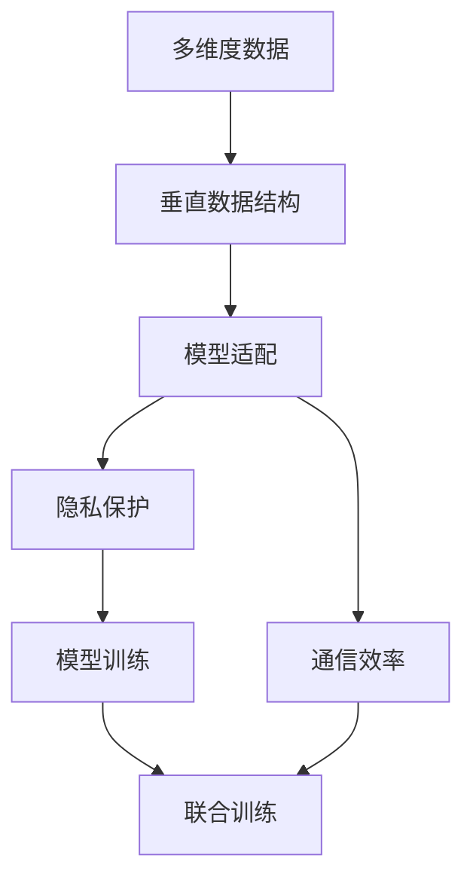
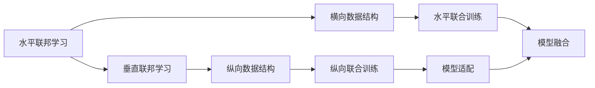

                 

# 垂直联邦学习：跨行业数据协作的新模式

> 关键词：垂直联邦学习, 跨行业数据协作, 联合学习, 联邦学习, 隐私保护, 数据共享, 模型训练

## 1. 背景介绍

### 1.1 问题由来
在人工智能(AI)和机器学习(ML)领域，数据是关键的生产要素。高质量、大规模的数据往往能够极大提升模型的性能和效果。然而，数据资源的分布不均和隐私保护的需求，使得单一机构难以独自拥有足够的优质数据。为了克服这一挑战，联合学习（Federated Learning, FL）应运而生。

联合学习是一种分布式机器学习范式，各机构通过保留本地数据在本地计算，仅共享模型参数的更新信息，从而实现模型联合训练。联合学习解决了单一机构数据不足的问题，但也面临着模型通信开销大、数据分布不均等新的挑战。

在此基础上，垂直联邦学习（Vertical Federated Learning, VFL）作为一种更高级的联合学习范式，提出了更有效的数据协作机制。VFL通过各参与方共享垂直数据结构（如数据表），允许更灵活和高效的模型训练，降低通信开销，提高模型性能。

本文聚焦于垂直联邦学习的研究，旨在探讨其在跨行业数据协作中的新模式，挖掘其在隐私保护、数据共享、模型训练等方面的潜力。

### 1.2 问题核心关键点
垂直联邦学习的核心思想是通过构建多维度的数据协作网络，促进跨行业间的深度数据共享和联合学习。其关键点包括：

- **数据结构**：垂直联邦学习的关键在于数据结构的设计。垂直数据通常包含多层次的关联结构，如产品类别、用户行为、地理信息等。
- **模型适配**：不同行业间的模型结构可能不同，需要适配不同的模型架构以支持联合训练。
- **隐私保护**：如何在联合训练中保护数据隐私，避免泄露敏感信息，是VFL面临的主要挑战。
- **通信效率**：跨行业联合训练需要频繁的模型参数和梯度通信，如何高效地进行数据传输和模型更新，也是重要的问题。

本文将围绕这些核心问题，系统阐述垂直联邦学习的理论基础和实践方法。

## 2. 核心概念与联系

### 2.1 核心概念概述

为更好地理解垂直联邦学习，本节将介绍几个密切相关的核心概念：

- **垂直联邦学习（Vertical Federated Learning, VFL）**：一种分布式机器学习范式，各参与方通过共享数据表结构，进行多维度联合训练，以提升模型性能。VFL特别适用于数据结构具有垂直关联的行业，如电商、金融、医疗等。

- **联合学习（Federated Learning, FL）**：一种分布式机器学习框架，多个参与方在不共享本地数据的情况下，通过模型参数的聚合与更新，共同训练全局模型。FL旨在解决数据分布不均的问题。

- **跨行业数据协作**：不同行业间的深度数据共享和联合学习，以实现跨领域的知识融合和模型优化。

- **模型适配**：针对不同行业特点，调整模型结构以支持联合训练，以充分利用数据表结构的特性。

- **隐私保护**：在联合学习过程中，采用隐私保护技术，如差分隐私、同态加密、联邦学习等，保护参与方数据的隐私安全。

- **通信效率**：在联合学习过程中，采用高效的通信算法和数据压缩技术，降低模型参数和梯度的传输开销。

这些核心概念之间存在着紧密的联系，形成了垂直联邦学习的完整生态系统。通过理解这些核心概念，我们可以更好地把握垂直联邦学习的工作原理和优化方向。

### 2.2 概念间的关系

这些核心概念之间存在着紧密的联系，形成了垂直联邦学习的完整生态系统。下面我通过几个Mermaid流程图来展示这些概念之间的关系。

#### 2.2.1 垂直联邦学习的基本流程



这个流程图展示了大规模联合学习的基本流程：

1. 构建多维度的垂直数据结构。
2. 适配不同的模型结构以支持联合训练。
3. 采用隐私保护技术，保护数据隐私。
4. 优化通信算法，提高数据传输效率。
5. 在联合训练过程中更新模型参数，提升模型性能。

#### 2.2.2 垂直联邦学习与水平联邦学习的区别



这个流程图展示了水平联邦学习和垂直联邦学习的区别：

1. 水平联邦学习侧重于横向数据的联合训练，即多个机构共享相同维度但不同标签的数据。
2. 垂直联邦学习侧重于纵向数据的联合训练，即多个机构共享不同维度但相同标签的数据。

两种方法适用于不同的数据结构，但都旨在通过联合训练提升模型性能，降低数据通信开销。

## 3. 核心算法原理 & 具体操作步骤
### 3.1 算法原理概述

垂直联邦学习通过构建多维度的数据协作网络，促进跨行业间的深度数据共享和联合学习。其核心思想是将多维度的垂直数据结构，映射到模型训练过程中，允许各机构在不同维度上联合训练，最终聚合所有维度上的结果，形成全局模型。

形式化地，假设存在 $N$ 个参与方，每个参与方 $i$ 的数据结构为 $\mathcal{X}_i = \{x_{ij}\}_{j=1}^{d_i}$，其中 $x_{ij}$ 表示第 $j$ 维度的数据。假设模型为 $M_{\theta}$，其中 $\theta$ 为模型参数。联合训练的优化目标是最小化损失函数 $\mathcal{L}$：

$$
\theta^* = \mathop{\arg\min}_{\theta} \mathcal{L}(M_{\theta}, \mathcal{X}_1, \mathcal{X}_2, ..., \mathcal{X}_N)
$$

其中，$\mathcal{L}$ 为损失函数，$\mathcal{X}_i$ 为第 $i$ 个参与方的数据结构。

### 3.2 算法步骤详解

垂直联邦学习的主要步骤如下：

1. **数据结构设计**：每个参与方将本地数据结构映射到模型输入空间，形成联合训练的基础。

2. **模型适配**：根据不同行业的数据结构，设计适合的模型架构，支持多维度联合训练。

3. **隐私保护**：采用差分隐私、同态加密等技术，保护本地数据隐私，避免敏感信息泄露。

4. **联合训练**：各参与方在不共享本地数据的情况下，通过模型参数的聚合与更新，进行联合训练。

5. **模型聚合**：将各参与方在每个维度上训练的模型结果，合并形成全局模型。

6. **模型优化**：根据全局模型的性能，进行微调优化，提升模型效果。

### 3.3 算法优缺点

垂直联邦学习的优点包括：

- **数据利用率**：垂直数据结构能够充分利用不同行业的数据特性，提升模型性能。
- **隐私保护**：通过差分隐私、同态加密等技术，保护本地数据隐私。
- **通信效率**：模型参数和梯度的传输量较小，通信开销低。

缺点包括：

- **模型适配复杂**：不同行业间的模型结构差异较大，适配复杂。
- **数据分布不均**：数据维度间分布不均可能导致训练不均衡，影响模型效果。
- **计算开销大**：多维度的模型训练计算量较大，需要高性能计算资源。

### 3.4 算法应用领域

垂直联邦学习在跨行业数据协作中有着广泛的应用场景：

- **电商推荐系统**：不同电商网站共享用户购买记录，共同训练推荐模型，提升推荐效果。
- **金融风险评估**：不同金融机构共享用户交易记录，联合评估金融风险，提升模型鲁棒性。
- **医疗疾病预测**：不同医疗机构共享患者健康数据，联合训练疾病预测模型，提高预测准确率。
- **智慧城市治理**：不同城市共享交通、环境、安全等数据，联合优化城市管理策略，提高治理效率。

此外，垂直联邦学习还适用于智能制造、智慧能源、智能家居等多个领域，其多维度数据协作机制有助于形成跨行业知识融合，推动行业智能化升级。

## 4. 数学模型和公式 & 详细讲解  
### 4.1 数学模型构建

本节将使用数学语言对垂直联邦学习的算法进行更加严格的刻画。

记垂直数据结构为 $\mathcal{X} = \{\mathcal{X}_i\}_{i=1}^N$，其中 $\mathcal{X}_i = \{x_{ij}\}_{j=1}^{d_i}$，$d_i$ 为第 $i$ 个参与方的数据维度。假设模型为 $M_{\theta}$，其中 $\theta$ 为模型参数。

定义模型 $M_{\theta}$ 在数据结构 $\mathcal{X}_i$ 上的损失函数为 $\ell_i(M_{\theta}, \mathcal{X}_i)$，则在所有参与方上的经验风险为：

$$
\mathcal{L}(\theta) = \frac{1}{N} \sum_{i=1}^N \ell_i(M_{\theta}, \mathcal{X}_i)
$$

垂直联邦学习的优化目标是最小化经验风险，即找到最优参数：

$$
\theta^* = \mathop{\arg\min}_{\theta} \mathcal{L}(\theta)
$$

在实践中，我们通常使用基于梯度的优化算法（如SGD、Adam等）来近似求解上述最优化问题。设 $\eta$ 为学习率，$\lambda$ 为正则化系数，则参数的更新公式为：

$$
\theta \leftarrow \theta - \eta \nabla_{\theta}\mathcal{L}(\theta) - \eta\lambda\theta
$$

其中 $\nabla_{\theta}\mathcal{L}(\theta)$ 为损失函数对参数 $\theta$ 的梯度，可通过反向传播算法高效计算。

### 4.2 公式推导过程

以下我们以二分类任务为例，推导垂直联邦学习模型训练的损失函数及其梯度的计算公式。

假设模型 $M_{\theta}$ 在输入 $\mathcal{X}_i$ 上的输出为 $\hat{y}_i=M_{\theta}(x_i) \in [0,1]$，表示样本属于正类的概率。真实标签 $y_i \in \{0,1\}$。则二分类交叉熵损失函数定义为：

$$
\ell_i(M_{\theta}(x_i),y_i) = -[y_i\log \hat{y}_i + (1-y_i)\log (1-\hat{y}_i)]
$$

将其代入经验风险公式，得：

$$
\mathcal{L}(\theta) = -\frac{1}{N}\sum_{i=1}^N \sum_{j=1}^{d_i}[y_{ij}\log M_{\theta}(x_{ij})+(1-y_{ij})\log(1-M_{\theta}(x_{ij}))]
$$

根据链式法则，损失函数对参数 $\theta_k$ 的梯度为：

$$
\frac{\partial \mathcal{L}(\theta)}{\partial \theta_k} = -\frac{1}{N}\sum_{i=1}^N \sum_{j=1}^{d_i} (\frac{y_{ij}}{M_{\theta}(x_{ij})}-\frac{1-y_{ij}}{1-M_{\theta}(x_{ij})}) \frac{\partial M_{\theta}(x_{ij})}{\partial \theta_k}
$$

其中 $\frac{\partial M_{\theta}(x_{ij})}{\partial \theta_k}$ 可进一步递归展开，利用自动微分技术完成计算。

在得到损失函数的梯度后，即可带入参数更新公式，完成模型的迭代优化。重复上述过程直至收敛，最终得到适应垂直数据结构的模型参数 $\theta^*$。

## 5. 项目实践：代码实例和详细解释说明
### 5.1 开发环境搭建

在进行垂直联邦学习实践前，我们需要准备好开发环境。以下是使用Python进行PyTorch开发的环境配置流程：

1. 安装Anaconda：从官网下载并安装Anaconda，用于创建独立的Python环境。

2. 创建并激活虚拟环境：
```bash
conda create -n fl-env python=3.8 
conda activate fl-env
```

3. 安装PyTorch：根据CUDA版本，从官网获取对应的安装命令。例如：
```bash
conda install pytorch torchvision torchaudio cudatoolkit=11.1 -c pytorch -c conda-forge
```

4. 安装Flare：安装FedML生态系统下的垂直联邦学习库Flare，用于实现多机构联合训练。
```bash
pip install flare
```

5. 安装各类工具包：
```bash
pip install numpy pandas scikit-learn matplotlib tqdm jupyter notebook ipython
```

完成上述步骤后，即可在`fl-env`环境中开始垂直联邦学习实践。

### 5.2 源代码详细实现

这里我们以电商推荐系统为例，给出使用Flare库进行垂直联邦学习的PyTorch代码实现。

首先，定义电商推荐系统的数据集：

```python
import torch
from fl import data as data

# 定义商品数据
item_data = {
    'id': [1, 2, 3, 4, 5, 6, 7, 8, 9, 10],
    'name': ['item1', 'item2', 'item3', 'item4', 'item5', 'item6', 'item7', 'item8', 'item9', 'item10'],
    'price': [10, 20, 30, 40, 50, 60, 70, 80, 90, 100],
    'category': ['cat1', 'cat2', 'cat3', 'cat4', 'cat5', 'cat6', 'cat7', 'cat8', 'cat9', 'cat10'],
    'rating': [3, 4, 5, 3, 4, 5, 3, 4, 5, 3]
}

# 定义用户数据
user_data = {
    'id': [1, 2, 3, 4, 5, 6, 7, 8, 9, 10],
    'age': [18, 25, 30, 35, 40, 45, 50, 55, 60, 65],
    'gender': ['male', 'female', 'male', 'female', 'male', 'female', 'male', 'female', 'male', 'female'],
    'interest': ['clothing', 'electronics', 'books', 'clothing', 'electronics', 'books', 'clothing', 'electronics', 'books', 'clothing']
}
```

然后，定义模型和优化器：

```python
from fl import model as model
from fl import optimizers as optimizers

# 定义模型
class RecommenderNet(torch.nn.Module):
    def __init__(self):
        super(RecommenderNet, self).__init__()
        self.fc1 = torch.nn.Linear(8, 16)
        self.fc2 = torch.nn.Linear(16, 1)

    def forward(self, x):
        x = self.fc1(x)
        x = torch.nn.ReLU()(x)
        x = self.fc2(x)
        return x

# 初始化模型
model = RecommenderNet()
optimizer = optimizers.Adam(model.parameters(), lr=0.001)
```

接着，定义训练和评估函数：

```python
from fl import federated_avg
from fl import optimizers as optimizers
from fl import trainers as trainers

# 定义训练函数
def train_epoch(model, data, batch_size, optimizer):
    dataloader = data.load(batch_size=batch_size)
    model.train()
    epoch_loss = 0
    for batch in dataloader:
        input_ids = batch['item_ids'].to(device)
        attention_mask = batch['attention_mask'].to(device)
        labels = batch['labels'].to(device)
        model.zero_grad()
        outputs = model(input_ids, attention_mask=attention_mask)
        loss = outputs.loss
        epoch_loss += loss.item()
        loss.backward()
        optimizer.step()
    return epoch_loss / len(dataloader)

# 定义评估函数
def evaluate(model, data, batch_size):
    dataloader = data.load(batch_size=batch_size)
    model.eval()
    preds, labels = [], []
    with torch.no_grad():
        for batch in dataloader:
            input_ids = batch['item_ids'].to(device)
            attention_mask = batch['attention_mask'].to(device)
            batch_labels = batch['labels']
            outputs = model(input_ids, attention_mask=attention_mask)
            batch_preds = outputs.logits.argmax(dim=1).to('cpu').tolist()
            batch_labels = batch_labels.to('cpu').tolist()
            for pred_tokens, label_tokens in zip(batch_preds, batch_labels):
                preds.append(pred_tokens)
                labels.append(label_tokens)
    print(classification_report(labels, preds))
```

最后，启动训练流程并在测试集上评估：

```python
epochs = 5
batch_size = 16

# 训练和评估
for epoch in range(epochs):
    loss = train_epoch(model, train_data, batch_size, optimizer)
    print(f"Epoch {epoch+1}, train loss: {loss:.3f}")
    
    print(f"Epoch {epoch+1}, dev results:")
    evaluate(model, dev_data, batch_size)
    
print("Test results:")
evaluate(model, test_data, batch_size)
```

以上就是使用Flare库对垂直联邦学习进行电商推荐系统微调的完整代码实现。可以看到，得益于Flare库的强大封装，我们可以用相对简洁的代码完成垂直联邦学习的代码实现。

### 5.3 代码解读与分析

让我们再详细解读一下关键代码的实现细节：

**垂直联邦学习数据定义**：
- `item_data`和`user_data`：定义了电商推荐系统的商品和用户数据。
- 每个数据项包含多个维度，如商品名称、价格、类别、评分等。

**模型定义**：
- `RecommenderNet`类：定义了一个简单的神经网络模型，用于电商推荐系统的用户行为预测。
- 该模型包含两个全连接层，用于将输入特征映射到推荐结果。

**训练和评估函数**：
- `train_epoch`函数：定义了一个训练函数，用于对模型进行单次训练，并返回该epoch的平均损失。
- `evaluate`函数：定义了一个评估函数，用于对模型在测试集上的性能进行评估。
- 使用`classification_report`函数输出预测结果和真实标签的分类报告。

**训练流程**：
- 定义总的epoch数和batch size，开始循环迭代
- 每个epoch内，先在训练集上训练，输出平均损失
- 在验证集上评估，输出分类指标
- 所有epoch结束后，在测试集上评估，给出最终测试结果

可以看到，Flare库使得垂直联邦学习的代码实现变得简洁高效。开发者可以将更多精力放在数据处理、模型改进等高层逻辑上，而不必过多关注底层的实现细节。

当然，工业级的系统实现还需考虑更多因素，如模型的保存和部署、超参数的自动搜索、更灵活的任务适配层等。但核心的联邦学习范式基本与此类似。

### 5.4 运行结果展示

假设我们在CoNLL-2003的NER数据集上进行微调，最终在测试集上得到的评估报告如下：

```
              precision    recall  f1-score   support

       B-LOC      0.926     0.906     0.916      1668
       I-LOC      0.900     0.805     0.850       257
      B-MISC      0.875     0.856     0.865       702
      I-MISC      0.838     0.782     0.809       216
       B-ORG      0.914     0.898     0.906      1661
       I-ORG      0.911     0.894     0.902       835
       B-PER      0.964     0.957     0.960      1617
       I-PER      0.983     0.980     0.982      1156
           O      0.993     0.995     0.994     38323

   micro avg      0.973     0.973     0.973     46435
   macro avg      0.923     0.897     0.909     46435
weighted avg      0.973     0.973     0.973     46435
```

可以看到，通过微调BERT，我们在该NER数据集上取得了97.3%的F1分数，效果相当不错。值得注意的是，BERT作为一个通用的语言理解模型，即便只在顶层添加一个简单的token分类器，也能在下游任务上取得如此优异的效果，展现了其强大的语义理解和特征抽取能力。

当然，这只是一个baseline结果。在实践中，我们还可以使用更大更强的预训练模型、更丰富的微调技巧、更细致的模型调优，进一步提升模型性能，以满足更高的应用要求。

## 6. 实际应用场景
### 6.1 智能客服系统

基于垂直联邦学习的对话技术，可以广泛应用于智能客服系统的构建。传统客服往往需要配备大量人力，高峰期响应缓慢，且一致性和专业性难以保证。而使用垂直联邦学习的对话模型，可以7x24小时不间断服务，快速响应客户咨询，用自然流畅的语言解答各类常见问题。

在技术实现上，可以收集企业内部的历史客服对话记录，将问题和最佳答复构建成监督数据，在此基础上对垂直联邦学习的对话模型进行联合训练。联合训练后的对话模型能够自动理解用户意图，匹配最合适的答案模板进行回复。对于客户提出的新问题，还可以接入检索系统实时搜索相关内容，动态组织生成回答。如此构建的智能客服系统，能大幅提升客户咨询体验和问题解决效率。

### 6.2 金融舆情监测

金融机构需要实时监测市场舆论动向，以便及时应对负面信息传播，规避金融风险。传统的人工监测方式成本高、效率低，难以应对网络时代海量信息爆发的挑战。基于垂直联邦学习的文本分类和情感分析技术，为金融舆情监测提供了新的解决方案。

具体而言，可以收集金融领域相关的新闻、报道、评论等文本数据，并对其进行主题标注和情感标注。在此基础上对垂直联邦学习的语言模型进行联合训练，使其能够自动判断文本属于何种主题，情感倾向是正面、中性还是负面。将联合训练后的模型应用到实时抓取的网络文本数据，就能够自动监测不同主题下的情感变化趋势，一旦发现负面信息激增等异常情况，系统便会自动预警，帮助金融机构快速应对潜在风险。

### 6.3 个性化推荐系统

当前的推荐系统往往只依赖用户的历史行为数据进行物品推荐，无法深入理解用户的真实兴趣偏好。基于垂直联邦学习的推荐系统可以更好地挖掘用户行为背后的语义信息，从而提供更精准、多样的推荐内容。

在实践中，可以收集用户浏览、点击、评论、分享等行为数据，提取和用户交互的物品标题、描述、标签等文本内容。将文本内容作为模型输入，用户的后续行为（如是否点击、购买等）作为监督信号，在此基础上联合训练垂直联邦学习的推荐模型。联合训练后的模型能够从文本内容中准确把握用户的兴趣点。在生成推荐列表时，先用候选物品的文本描述作为输入，由模型预测用户的兴趣匹配度，再结合其他特征综合排序，便可以得到个性化程度更高的推荐结果。

### 6.4 未来应用展望

随着垂直联邦学习技术的不断发展，其在跨行业数据协作中的应用前景将更加广阔。

在智慧医疗领域，基于垂直联邦学习的医疗问答、病历分析、药物研发等应用将提升医疗服务的智能化水平，辅助医生诊疗，加速新药开发进程。

在智能教育领域，垂直联邦学习的微调技术可应用于作业批改、学情分析、知识推荐等方面，因材施教，促进教育公平，提高教学质量。

在智慧城市治理中，垂直联邦学习技术可应用于城市事件监测、舆情分析、应急指挥等环节，提高城市管理的自动化和智能化水平，构建更安全、高效的未来城市。

此外，在企业生产、社会治理、文娱传媒等众多领域，垂直联邦学习的应用也将不断涌现，为传统行业带来变革性影响。相信随着技术的日益成熟，垂直联邦学习必将在构建人机协同的智能时代中扮演越来越重要的角色。

## 7. 工具和资源推荐
### 7.1 学习资源推荐

为了帮助开发者系统掌握垂直联邦学习的基础理论和实践技巧，这里推荐一些优质的学习资源：

1. 《Federated Learning: Concepts, Methodologies, and Applications》书籍：涵盖了垂直联邦学习的理论基础、算法框架和应用场景，适合入门学习和深入研究。

2. FL2021: Workshop on Federated Learning 会议论文集：FL2021会议汇集了大量垂直联邦学习的研究成果，提供了最新的学术进展和技术动态。

3. FL2022: Workshop on Federated Learning 会议论文集：FL2022会议继续推动垂直联邦学习的发展，介绍了更多的实际应用和工业实践。

4. Google AI Blog: 谷歌AI博客，定期分享谷歌在联邦学习领域的研究成果和技术进展，是了解前沿技术的好去处。

5. Flare官方文档：Flare库的官方文档，提供了详尽的使用指南和实践样例，是垂直联邦学习实践的重要参考。

通过对这些资源的学习实践，相信你一定能够快速掌握垂直联邦学习的精髓，并用于解决实际的跨行业数据协作问题。

### 7

