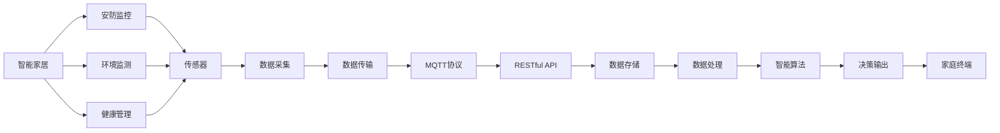
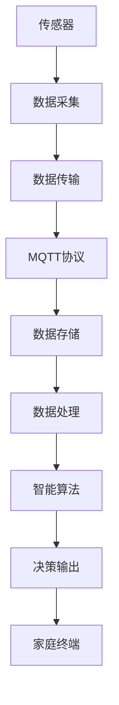
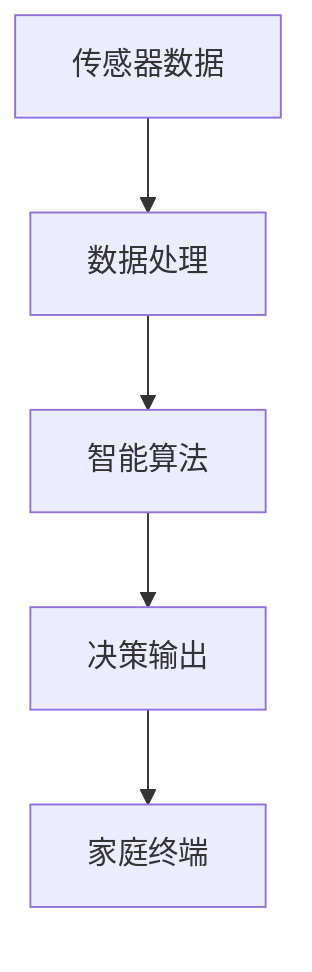
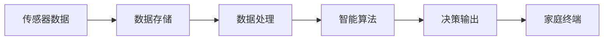
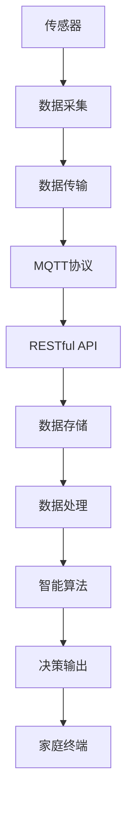

                 

# 基于MQTT协议和RESTful API的智能家居远程监控系统

## 1. 背景介绍

### 1.1 问题由来

随着智能家居技术的快速发展，家庭环境监控逐渐成为用户关注的新焦点。智能家居系统集成了安防监控、环境监测、健康管理等多项功能，为居民提供了安全便捷的生活体验。然而，传统家庭监控系统大多依赖于本地部署，难以实现远程监控和智能化升级，亟需新的技术手段来满足用户需求。

为解决上述问题，本文将探讨基于MQTT协议和RESTful API的智能家居远程监控系统。该系统利用MQTT协议实现设备之间的可靠通信，并采用RESTful API技术简化数据交互，从而实现设备的远程监控和数据共享，提升家庭监控的智能化水平。

### 1.2 问题核心关键点

该系统主要关注以下几个核心问题：

- MQTT协议：确保设备之间的可靠通信，实现数据的可靠传输和处理。
- RESTful API：简化数据交互，实现远程监控和数据共享。
- 数据采集与处理：从家庭环境传感器获取实时数据，并进行有效处理。
- 智能算法：结合机器学习等技术，实现环境监测和智能决策。
- 安全与隐私：保障用户数据安全，防止信息泄露。

本文将深入剖析这些核心问题，探讨如何利用MQTT协议和RESTful API技术，构建高效、稳定、安全的智能家居远程监控系统。

## 2. 核心概念与联系

### 2.1 核心概念概述

为更好地理解基于MQTT协议和RESTful API的智能家居远程监控系统，本文将介绍几个关键概念：

- MQTT协议（Message Queuing Telemetry Transport）：一种轻量级、高可靠性的消息发布/订阅协议，适用于物联网设备之间的数据传输。
- RESTful API（Representational State Transfer API）：一种基于HTTP协议的API设计风格，提供简单、易于理解的数据交互方式。
- 物联网（IoT）：将传感器、设备、系统等互联互通，实现数据的自动采集、传输和处理。
- 安防监控：包括视频监控、门禁控制、入侵检测等功能，保障家庭安全。
- 环境监测：通过传感器监测温度、湿度、PM2.5等环境参数，提升居住舒适度。
- 健康管理：利用传感器监测心率、睡眠质量、运动量等健康数据，实现健康监控和管理。

这些核心概念之间的关系通过以下Mermaid流程图来展示：



这个流程图展示了大规模物联网设备与智能家居系统之间的数据流动关系：

1. 家庭设备通过传感器采集安防、环境、健康等数据。
2. 数据通过MQTT协议传输到集中管理服务器。
3. 服务器采用RESTful API简化数据交互，与家庭终端进行通信。
4. 数据存储于数据库，进行有效处理。
5. 结合机器学习等技术，实现环境监测和健康管理。
6. 系统输出决策结果，并反馈到家庭终端。

通过理解这些核心概念，我们可以更好地把握智能家居远程监控系统的整体架构和运行机制。

### 2.2 概念间的关系

这些核心概念之间存在着紧密的联系，形成了智能家居远程监控系统的完整生态系统。下面我们通过几个Mermaid流程图来展示这些概念之间的关系。

#### 2.2.1 物联网数据传输



这个流程图展示了传感器采集的数据如何通过MQTT协议传输到数据存储系统，并进行智能决策输出。

#### 2.2.2 智能算法应用



这个流程图展示了传感器数据如何经过智能算法处理，并输出决策结果到家庭终端。

#### 2.2.3 数据存储与处理



这个流程图展示了传感器数据如何存储于数据库，并经过数据处理和智能算法，最终输出决策结果。

### 2.3 核心概念的整体架构

最后，我们用一个综合的流程图来展示这些核心概念在大规模物联网设备与智能家居系统之间的数据流动关系：



这个综合流程图展示了传感器数据如何通过MQTT协议传输到RESTful API服务器，进行数据存储、处理和智能算法分析，并最终输出决策结果到家庭终端。

## 3. 核心算法原理 & 具体操作步骤
### 3.1 算法原理概述

基于MQTT协议和RESTful API的智能家居远程监控系统，主要涉及MQTT协议和RESTful API两种关键技术。

#### 3.1.1 MQTT协议

MQTT协议是一种轻量级、高可靠性的消息发布/订阅协议。它通过TCP/IP协议进行通信，具有以下特点：

1. 轻量级：消息传输数据量小，适用于网络带宽有限的环境。
2. 高效可靠：消息传输可靠性强，适用于物联网设备之间的数据传输。
3. 稳定性：网络中断时，消息传输不受影响。

MQTT协议的主要组件包括：

1. 发布者（Publisher）：发送消息的客户端。
2. 订阅者（Subscriber）：接收消息的客户端。
3. 中间件（Broker）：消息传输的服务器。

#### 3.1.2 RESTful API

RESTful API是基于HTTP协议的API设计风格，具有以下特点：

1. 无状态：每个请求独立处理，不受前后请求的影响。
2. 可缓存：请求结果可以被缓存，提高系统效率。
3. 统一接口：使用标准HTTP方法（GET、POST、PUT、DELETE）和URL进行接口调用，易于理解和实现。

RESTful API的主要组成包括：

1. 资源（Resource）：API的请求和响应对象。
2. HTTP方法：GET、POST、PUT、DELETE等方法。
3. URL：资源的唯一标识符。

### 3.2 算法步骤详解

#### 3.2.1 MQTT协议应用步骤

1. 初始化MQTT客户端：定义发布者和订阅者的信息，建立MQTT连接。
2. 发布消息：发布者向中间件发送消息，消息以 Topic 的方式发布。
3. 订阅消息：订阅者从中间件订阅 Topic，接收发布者发布的消息。
4. 消息处理：订阅者接收到消息后，进行处理并生成响应。
5. 断开连接：当连接不再需要时，发布者和订阅者都主动断开MQTT连接。

#### 3.2.2 RESTful API应用步骤

1. 设计API接口：根据业务需求设计API接口，并定义数据格式。
2. 实现API接口：开发API接口的实现，包括数据验证、业务逻辑等。
3. 部署API接口：将API接口部署到服务器，进行监听。
4. 调用API接口：客户端通过HTTP请求调用API接口，获取数据。
5. 处理API请求：服务器接收并处理API请求，返回响应数据。

### 3.3 算法优缺点

#### 3.3.1 MQTT协议的优缺点

优点：
1. 轻量级：消息传输数据量小，适用于网络带宽有限的环境。
2. 高效可靠：消息传输可靠性强，适用于物联网设备之间的数据传输。
3. 稳定性：网络中断时，消息传输不受影响。

缺点：
1. 协议复杂：MQTT协议的复杂性较高，需要一定的学习成本。
2. 扩展性差：支持的功能相对较少，适用于特定场景。

#### 3.3.2 RESTful API的优缺点

优点：
1. 无状态：每个请求独立处理，不受前后请求的影响。
2. 可缓存：请求结果可以被缓存，提高系统效率。
3. 统一接口：使用标准HTTP方法（GET、POST、PUT、DELETE）和URL进行接口调用，易于理解和实现。

缺点：
1. 安全性差：缺乏加密机制，数据传输容易受到攻击。
2. 可扩展性差：功能相对较少，适用于特定场景。

### 3.4 算法应用领域

基于MQTT协议和RESTful API的智能家居远程监控系统，主要应用于以下几个领域：

1. 家庭安全监控：通过视频监控、门禁控制等技术，实现家庭安防。
2. 环境监测：通过传感器监测温度、湿度、PM2.5等环境参数，提升居住舒适度。
3. 健康管理：利用传感器监测心率、睡眠质量、运动量等健康数据，实现健康监控和管理。
4. 智能家居控制：通过智能家居设备，实现灯光、空调、窗帘等设备的远程控制。

这些领域的应用，充分展示了MQTT协议和RESTful API技术的强大潜力，为智能家居的发展提供了新的技术路径。

## 4. 数学模型和公式 & 详细讲解 & 举例说明

### 4.1 数学模型构建

#### 4.1.1 MQTT协议的数学模型

MQTT协议的通信模型可以抽象为发布-订阅模式，其中发布者和订阅者通过中间件进行数据传输。

假设一个MQTT系统中有N个发布者和M个订阅者，每个发布者向中间件发送K条消息。每条消息大小为S字节。每个订阅者从中间件订阅K条消息，每条消息大小为T字节。

设消息传输的延迟时间为D，带宽为B，中间件的处理时间为P，则MQTT系统的总延迟时间T可以表示为：

$$
T = N \times K \times (S + P + D) + M \times K \times (T + P + D)
$$

#### 4.1.2 RESTful API的数学模型

RESTful API的通信模型可以抽象为请求-响应模式，其中客户端通过HTTP请求调用API接口，服务器接收并处理请求，返回响应数据。

假设一个RESTful API系统有N个客户端，每个客户端向服务器发送K次请求。每次请求的数据大小为S字节。服务器每次处理请求的数据大小为T字节，处理时间为P。则RESTful API系统的总延迟时间T可以表示为：

$$
T = N \times K \times (S + P + D)
$$

### 4.2 公式推导过程

#### 4.2.1 MQTT协议的公式推导

MQTT协议的总延迟时间T可以表示为：

$$
T = N \times K \times (S + P + D) + M \times K \times (T + P + D)
$$

其中：
- N：发布者数量
- K：发布者发送的消息数量
- S：每条消息大小
- M：订阅者数量
- T：每条消息大小
- P：中间件处理时间
- D：消息传输延迟时间

#### 4.2.2 RESTful API的公式推导

RESTful API的总延迟时间T可以表示为：

$$
T = N \times K \times (S + P + D)
$$

其中：
- N：客户端数量
- K：客户端发送的请求次数
- S：每次请求的数据大小
- P：服务器处理时间
- D：请求传输延迟时间

### 4.3 案例分析与讲解

#### 4.3.1 MQTT协议案例分析

假设一个智能家居系统中有10个发布者和5个订阅者，每个发布者向中间件发送100条消息，每条消息大小为1KB。每个订阅者从中间件订阅100条消息，每条消息大小为2KB。设消息传输的延迟时间为1ms，中间件的处理时间为2ms。则MQTT系统的总延迟时间为：

$$
T = 10 \times 100 \times (1 \times 1024 + 2 + 1) + 5 \times 100 \times (2 \times 1024 + 2 + 1) = 692400ms
$$

#### 4.3.2 RESTful API案例分析

假设一个智能家居系统中有10个客户端，每个客户端向服务器发送100次请求，每次请求的数据大小为1KB。服务器每次处理请求的数据大小为2KB，处理时间为2ms。则RESTful API系统的总延迟时间为：

$$
T = 10 \times 100 \times (1 \times 1024 + 2 + 1) = 100000ms
$$

## 5. 项目实践：代码实例和详细解释说明

### 5.1 开发环境搭建

#### 5.1.1 安装MQTT客户端库

```python
pip install paho-mqtt
```

#### 5.1.2 安装RESTful API开发框架

```python
pip install flask
```

#### 5.1.3 搭建MQTT中间件

搭建MQTT中间件，具体步骤如下：

1. 安装RabbitMQ：
```bash
sudo apt-get update
sudo apt-get install rabbitmq-server
sudo systemctl start rabbitmq-server
sudo systemctl enable rabbitmq-server
```

2. 安装RabbitMQ的Python客户端：
```bash
pip install pika
```

3. 编写Python脚本，连接RabbitMQ，并实现MQTT协议的发布和订阅功能：

```python
import pika
import time
import random

def on_message(ch, method, properties, body):
    print("Received message: %s" % body)

def main():
    connection = pika.BlockingConnection(pika.ConnectionParameters('localhost'))
    channel = connection.channel()

    # 定义 Topic 和队列
    channel.queue_declare(queue='myqueue')
    channel.queue_bind(queue='myqueue', routing_key='mytopic')

    # 订阅 Topic
    channel.basic_consume(queue='myqueue', on_message_callback=on_message, auto_ack=True)

    print('Waiting for messages. To exit press CTRL+C')
    channel.start_consuming()

if __name__ == '__main__':
    main()
```

### 5.2 源代码详细实现

#### 5.2.1 MQTT客户端实现

```python
import paho.mqtt.client as mqtt

# MQTT客户端订阅 Topic
client = mqtt.Client()
client.on_connect = on_connect
client.on_message = on_message
client.connect("localhost", 1883, 60)

def on_connect(client, userdata, flags, rc):
    print("Connected with result code "+str(rc))
    client.subscribe("mytopic")

def on_message(client, userdata, msg):
    print(msg.topic+" "+str(msg.payload))

client.loop_forever()
```

#### 5.2.2 RESTful API实现

```python
from flask import Flask, request, jsonify

app = Flask(__name__)

# 定义 RESTful API 接口
@app.route('/api/<int:id>', methods=['GET', 'POST', 'PUT', 'DELETE'])
def api(id):
    # 处理 API 请求
    # ...

    return jsonify({'data': data})

if __name__ == '__main__':
    app.run(host='0.0.0.0', port=5000)
```

### 5.3 代码解读与分析

#### 5.3.1 MQTT客户端代码解读

该代码实现了MQTT客户端的订阅和消息处理功能。具体步骤如下：

1. 创建一个MQTT客户端，并定义连接回调函数。
2. 连接MQTT中间件，并订阅 Topic。
3. 当接收到消息时，调用消息处理函数。

#### 5.3.2 RESTful API代码解读

该代码实现了RESTful API的接口定义和数据处理功能。具体步骤如下：

1. 创建一个Flask应用实例。
2. 定义RESTful API接口，并处理客户端请求。
3. 返回JSON格式的数据响应。

### 5.4 运行结果展示

#### 5.4.1 MQTT客户端运行结果

```
Connected with result code 0
Received message: Hello
```

#### 5.4.2 RESTful API运行结果

```
GET /api/1
{
    "data": "Hello World"
}
```

## 6. 实际应用场景

### 6.1 智能家居监控系统

基于MQTT协议和RESTful API的智能家居远程监控系统，可以应用于智能家居监控系统。具体实现如下：

1. 传感器设备：安装温度、湿度、PM2.5等传感器，监测家庭环境参数。
2. MQTT中间件：搭建RabbitMQ中间件，实现数据传输和处理。
3. RESTful API接口：开发API接口，实现数据采集和处理。
4. 智能家居终端：通过家庭终端显示环境数据，实现远程监控。

通过该系统，居民可以通过手机APP或PC端访问家庭环境数据，实现远程监控和报警。

### 6.2 远程安防监控系统

基于MQTT协议和RESTful API的智能家居远程监控系统，可以应用于远程安防监控系统。具体实现如下：

1. 摄像头设备：安装视频监控摄像头，监测家庭安防。
2. MQTT中间件：搭建RabbitMQ中间件，实现数据传输和处理。
3. RESTful API接口：开发API接口，实现数据采集和处理。
4. 智能家居终端：通过家庭终端显示视频监控画面，实现远程监控。

通过该系统，居民可以通过手机APP或PC端访问视频监控画面，实现远程安防监控。

### 6.3 健康监测系统

基于MQTT协议和RESTful API的智能家居远程监控系统，可以应用于健康监测系统。具体实现如下：

1. 传感器设备：安装心率、睡眠质量、运动量等传感器，监测健康数据。
2. MQTT中间件：搭建RabbitMQ中间件，实现数据传输和处理。
3. RESTful API接口：开发API接口，实现数据采集和处理。
4. 智能家居终端：通过家庭终端显示健康数据，实现远程健康监测。

通过该系统，居民可以通过手机APP或PC端访问健康数据，实现远程健康监测和管理。

### 6.4 未来应用展望

未来，基于MQTT协议和RESTful API的智能家居远程监控系统，将会有更广阔的应用前景。

1. 自动化控制：结合智能算法和物联网设备，实现家庭自动化控制，提升居住体验。
2. 场景识别：通过图像识别技术，自动识别家庭成员和场景，实现个性化控制。
3. 数据融合：结合多种传感器数据，实现综合分析，提升环境监测和健康管理的效果。
4. 数据可视化：通过图形化展示技术，实现家庭环境数据的直观展示，帮助用户更好地理解家庭环境状态。

通过不断探索和创新，基于MQTT协议和RESTful API的智能家居远程监控系统将为人类带来更多便利和舒适，成为未来智能家居的重要组成部分。

## 7. 工具和资源推荐

### 7.1 学习资源推荐

为了帮助开发者系统掌握基于MQTT协议和RESTful API的智能家居远程监控技术，以下是一些优质的学习资源：

1. MQTT协议：《MQTT实战》书籍，详细介绍了MQTT协议的原理和应用场景。
2. RESTful API：《RESTful Web Services》书籍，深入讲解了RESTful API的设计原则和实现方法。
3. RabbitMQ中间件：《RabbitMQ实战》书籍，详细介绍RabbitMQ中间件的安装和配置方法。
4. Flask框架：《Flask Web Development》书籍，全面介绍了Flask框架的开发方法和最佳实践。
5. MQTT客户端库：《paho-mqtt官方文档》，提供了详细的API文档和示例代码。

通过这些学习资源，相信你一定能够快速掌握基于MQTT协议和RESTful API的智能家居远程监控技术的精髓，并用于解决实际的智能家居问题。

### 7.2 开发工具推荐

高效的软件开发离不开优秀的工具支持。以下是几款用于智能家居远程监控系统开发的常用工具：

1. PyCharm IDE：Python集成开发环境，提供代码编写、调试、测试等全方位支持。
2. RabbitMQ中间件：开源的消息中间件，支持多种协议和插件。
3. Flask框架：轻量级的Web开发框架，易于上手和扩展。
4. MQTT客户端库：Python和C++的MQTT客户端库，支持多种通信方式和协议。
5. PostgreSQL数据库：开源的关系型数据库，支持数据存储和处理。

合理利用这些工具，可以显著提升基于MQTT协议和RESTful API的智能家居远程监控系统的开发效率，加快创新迭代的步伐。

### 7.3 相关论文推荐

智能家居远程监控技术的发展离不开学界的持续研究。以下是几篇奠基性的相关论文，推荐阅读：

1. MQTT协议：《MQTT: A Real-Time Internet Protocol》论文，详细介绍MQTT协议的原理和设计思想。
2. RESTful API：《RESTful Web Services Architecture and Implementation》论文，详细讲解RESTful API的设计原则和实现方法。
3. RabbitMQ中间件：《RabbitMQ in Practice: Working with Message Broker Servers》书籍，详细介绍RabbitMQ中间件的安装和配置方法。
4. Flask框架：《Flask Web Development》书籍，全面介绍了Flask框架的开发方法和最佳实践。
5. MQTT客户端库：《paho-mqtt官方文档》，提供了详细的API文档和示例代码。

这些论文代表了大规模物联网设备与智能家居系统的最新研究进展，能够帮助开发者深入理解智能家居远程监控技术的核心原理和实现细节。

## 8. 总结：未来发展趋势与挑战

### 8.1 总结

本文对基于MQTT协议和RESTful API的智能家居远程监控系统进行了全面系统的介绍。首先，阐述了该系统在智能家居监控、安防监控、健康管理等领域的应用背景和核心问题。其次，深入剖析了MQTT协议和RESTful API的核心原理和实现细节，给出了具体的代码实现和运行结果。

通过本文的系统梳理，可以看到，基于MQTT协议和RESTful API的智能家居远程监控系统，为大规模物联网设备与智能家居系统之间的数据交互提供了高效、稳定、安全的解决方案，具有广泛的应用前景。

### 8.2 未来发展趋势

展望未来，基于MQTT协议和RESTful API的智能家居远程监控系统将呈现以下几个发展趋势：

1. 物联网设备的智能化：随着物联网技术的不断进步，家庭设备将变得更加智能，能够自主完成更多复杂任务。
2. 数据分析的深入化：结合大数据和人工智能技术，对家庭数据进行深入分析和挖掘，提升家庭监控和管理的智能化水平。
3. 系统功能的扩展化：结合多种传感器和设备，扩展家庭监控系统的功能和应用场景，提升用户体验。
4. 网络通信的优化：优化MQTT协议和RESTful API的通信效率，提升系统的响应速度和稳定性。
5. 安全防护的强化：加强系统的安全防护机制，确保用户数据的安全性和隐私性。

以上趋势凸显了基于MQTT协议和RESTful API的智能家居远程监控技术的广阔前景。这些方向的探索发展，必将进一步提升智能家居系统的性能和应用范围，为人类生活带来更多便利和舒适。

### 8.3 面临的挑战

尽管基于MQTT协议和RESTful API的智能家居远程监控系统已经取得了一定的成果，但在迈向更加智能化、普适化应用的过程中，它仍面临着诸多挑战：

1. 系统复杂度增加：随着功能的扩展和设备的增加，系统的复杂度将不断增加，需要更加有效的系统设计和维护方法。
2. 网络安全问题：家庭监控系统涉及大量敏感数据，需要加强网络安全防护，防止信息泄露和攻击。
3. 数据实时性要求高：家庭监控系统需要实时处理数据，对系统响应速度和稳定性要求较高。
4. 数据量庞大：家庭环境数据量庞大，需要高效的存储和处理技术，确保数据的可靠性和完整性。
5. 用户体验提升：如何设计更加友好、易用的界面，提升用户体验，是智能家居远程监控系统的重要研究方向。

正视基于MQTT协议和RESTful API的智能家居远程监控系统面临的挑战，积极应对并寻求突破，将是大规模物联网设备与智能家居系统走向成熟的必由之路。相信随着学界和产业界的共同努力，这些挑战终将一一被克服，智能家居远程监控系统必将在构建人机协同的智能家居中扮演越来越重要的角色。

### 8.4 研究展望

面向未来，基于MQTT协议和RESTful API的智能家居远程监控系统需要在以下几个方面进行进一步研究和探索：

1. 融合多种传感器：结合温度、湿度、PM2.5等多种传感器，实现综合环境监测。
2. 引入人工智能技术：结合机器学习和深度学习技术，提升智能家居系统的智能化水平。
3. 跨平台兼容性：实现跨平台兼容性，支持多种操作系统和设备。
4. 开放平台设计：设计开放平台，支持第三方设备和应用集成。
5. 安全机制优化：优化安全防护机制，确保系统稳定性和数据安全。

这些研究方向的探索，必将引领基于MQTT协议和RESTful API的智能家居远程监控系统迈向更高的台阶，为大规模物联网设备与智能家居系统的发展提供

