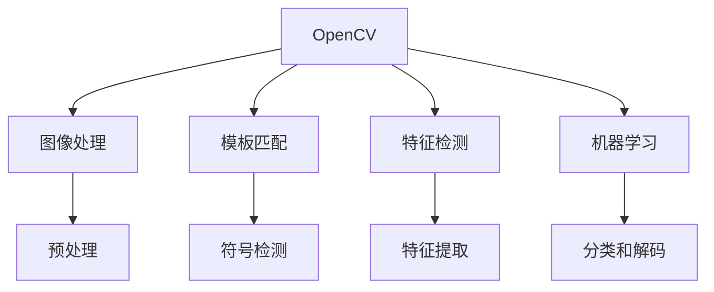
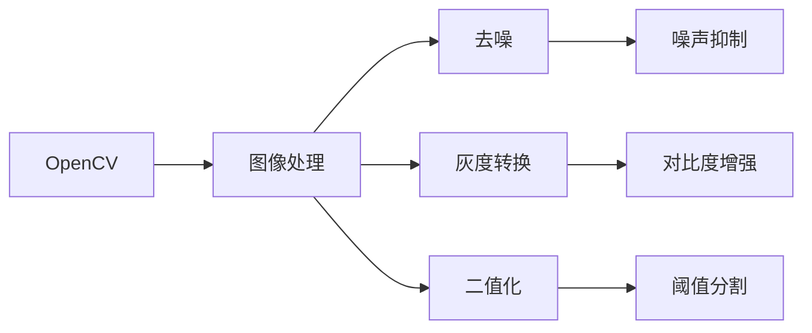
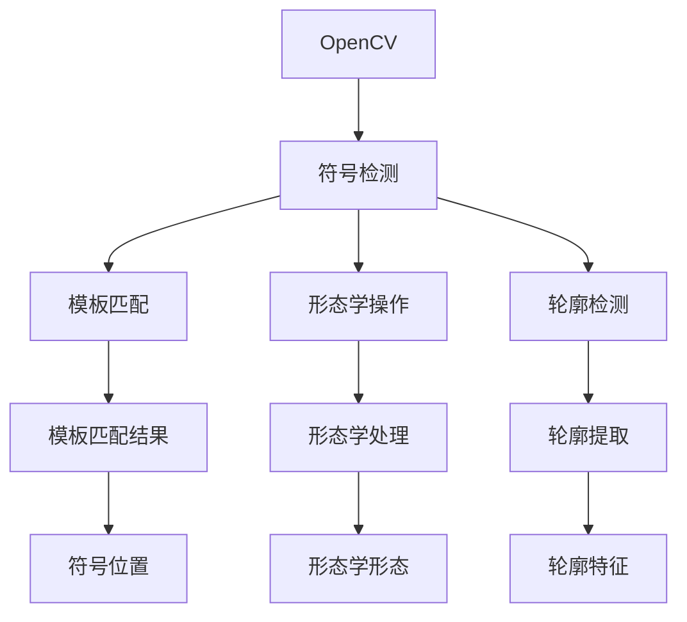
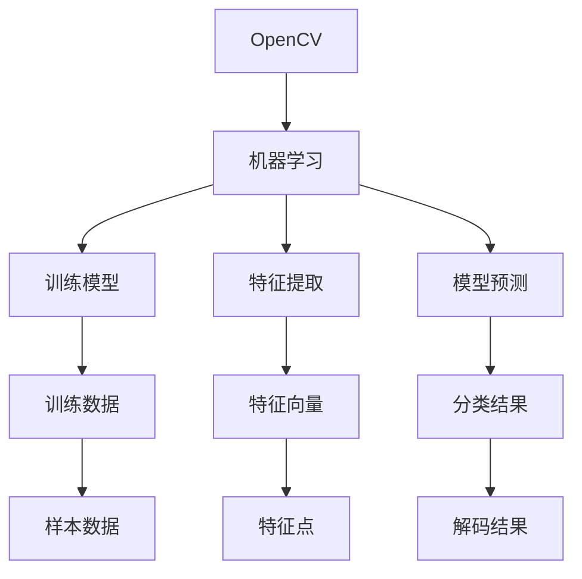
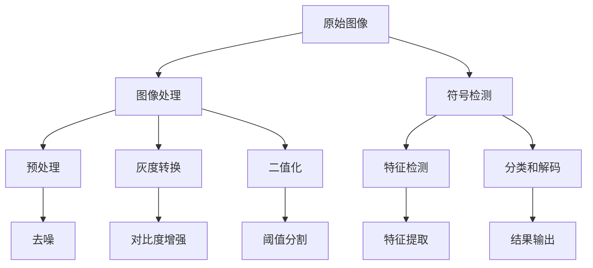

                 

# 基于OpenCV的二维码和条形码识别

> 关键词：OpenCV, 二维码识别, 条形码识别, 图像处理, 机器学习, 模板匹配, 特征检测

## 1. 背景介绍

### 1.1 问题由来
随着二维码和条形码技术在商业、物流、医疗、零售等领域的应用越来越广泛，对其进行自动识别和解析的需求也日益增加。传统上，这些识别任务依赖于专用设备，如扫码枪、手持终端等，成本高、部署复杂。利用计算机视觉和图像处理技术，可以在无需专用设备的情况下，实现二维码和条形码的自动检测与识别。OpenCV作为流行的开源计算机视觉库，提供了丰富的图像处理和机器学习算法，成为二维码和条形码识别的首选工具。

### 1.2 问题核心关键点
二维码和条形码识别的核心在于对图像中符号的准确检测和解析。其基本流程包括：

1. **图像预处理**：对原始图像进行去噪、灰度转换、二值化等操作，提取清晰的符号轮廓。
2. **符号检测**：通过模板匹配、形态学操作、轮廓检测等技术，定位符号位置。
3. **符号解析**：对检测到的符号进行特征提取，解码获取其中的信息。

该过程涉及图像处理、模式识别、机器学习等领域的多种技术。利用OpenCV库，可以高效实现以上各个环节，实现二维码和条形码的自动识别。

### 1.3 问题研究意义
二维码和条形码识别技术在多个场景中具有重要应用价值：

1. **物流管理**：自动识别包装上的条形码，快速追踪货物位置和物流信息。
2. **零售业**：扫描商品二维码，实时更新库存和促销信息。
3. **医疗健康**：识别患者就诊信息、药品条形码，提高诊疗效率和药品管理精度。
4. **教育培训**：扫描课程代码，自动推送学习资料和作业。
5. **智能家居**：识别家电设备上的二维码，自动控制和管理。

基于OpenCV的二维码和条形码识别，能够降低识别成本，提高识别效率和准确度，为这些应用场景提供技术支撑，具有重要的实用意义。

## 2. 核心概念与联系

### 2.1 核心概念概述

为更好地理解基于OpenCV的二维码和条形码识别方法，本节将介绍几个关键概念：

- **OpenCV**：Open Source Computer Vision Library，一个广泛用于计算机视觉和图像处理的开源库。支持图像处理、机器学习、计算机视觉等多种算法，提供了丰富的图像处理工具和算法库。
- **二维码**：由黑白相间的几何图形编码而成的符号，可以存储文本、图像、音频等大量信息。其核心是错误校正码和数据编码码。
- **条形码**：由黑白相间的条形编码而成的符号，一般只包含一维信息，用于快速扫描和识别。
- **图像处理**：对图像进行预处理、增强、分割、检测等操作，提取符号轮廓。
- **模板匹配**：将符号轮廓与预设模板进行匹配，定位符号位置。
- **特征检测**：提取符号的特征点，如角点、边缘、圆形等，用于解码和识别。
- **机器学习**：利用训练好的模型对符号进行分类和解码。

这些概念之间的逻辑关系可以通过以下Mermaid流程图来展示：



这个流程图展示了大语言模型的核心概念及其之间的关系：

1. OpenCV提供了图像处理、模板匹配、特征检测、机器学习等多种算法，支持符号的检测和解析。
2. 图像预处理模块，对原始图像进行去噪、灰度转换、二值化等操作，提取清晰的符号轮廓。
3. 符号检测模块，通过模板匹配、形态学操作、轮廓检测等技术，定位符号位置。
4. 特征检测模块，提取符号的特征点，如角点、边缘、圆形等，用于解码和识别。
5. 机器学习模块，利用训练好的模型对符号进行分类和解码。

这些概念共同构成了二维码和条形码识别的完整流程，利用OpenCV库，可以高效实现以上各个环节。

### 2.2 概念间的关系

这些核心概念之间存在着紧密的联系，形成了二维码和条形码识别的完整生态系统。下面我们通过几个Mermaid流程图来展示这些概念之间的关系。

#### 2.2.1 OpenCV的图像处理



这个流程图展示了OpenCV库中常用的图像预处理技术，包括去噪、灰度转换、二值化等操作。

#### 2.2.2 符号检测与特征提取



这个流程图展示了OpenCV库中常用的符号检测和特征提取技术，包括模板匹配、形态学操作、轮廓检测等。

#### 2.2.3 机器学习与分类解码



这个流程图展示了OpenCV库中常用的机器学习技术，包括模型训练、特征提取、分类和解码等。

### 2.3 核心概念的整体架构

最后，我们用一个综合的流程图来展示这些核心概念在大语言模型微调过程中的整体架构：



这个综合流程图展示了从原始图像到结果输出的完整过程。原始图像首先经过图像处理模块，进行去噪、灰度转换、二值化等操作，提取清晰的符号轮廓。然后通过符号检测模块，定位符号位置，提取符号的特征点。最后利用机器学习模块，对符号进行分类和解码，输出最终结果。

## 3. 核心算法原理 & 具体操作步骤
### 3.1 算法原理概述

基于OpenCV的二维码和条形码识别主要包含以下几个关键步骤：

1. **图像预处理**：对原始图像进行去噪、灰度转换、二值化等操作，提取清晰的符号轮廓。
2. **符号检测**：通过模板匹配、形态学操作、轮廓检测等技术，定位符号位置。
3. **符号解析**：对检测到的符号进行特征提取，解码获取其中的信息。

### 3.2 算法步骤详解

#### 3.2.1 图像预处理

图像预处理是二维码和条形码识别的第一步，通过一系列图像处理操作，提取清晰的符号轮廓。

1. **去噪**：使用OpenCV中的`cv2.fastNlMeansDenoising()`函数，对原始图像进行去噪处理，去除噪声和杂点，增强图像质量。
2. **灰度转换**：使用`cv2.cvtColor()`函数，将彩色图像转换为灰度图像，减少后续处理的计算量。
3. **二值化**：使用`cv2.threshold()`函数，将灰度图像转换为二值图像，方便后续符号检测。

```python
import cv2

# 加载原始图像
img = cv2.imread('barcode.png')

# 去噪处理
denoised_img = cv2.fastNlMeansDenoising(img, None, 10, 10, 7, cv2.NLM_MIXED_Bilateral)

# 灰度转换
gray_img = cv2.cvtColor(denoised_img, cv2.COLOR_BGR2GRAY)

# 二值化处理
_, thresh_img = cv2.threshold(gray_img, 0, 255, cv2.THRESH_BINARY_INV+cv2.THRESH_OTSU)
```

#### 3.2.2 符号检测

符号检测的目的是在预处理后的图像中，定位符号的位置。常用的方法包括模板匹配、形态学操作和轮廓检测。

1. **模板匹配**：使用OpenCV中的`cv2.matchTemplate()`函数，将符号轮廓与预设模板进行匹配，获取匹配结果。
2. **形态学操作**：使用`cv2.erode()`和`cv2.dilate()`函数，对匹配结果进行腐蚀和膨胀操作，去除噪声和边缘干扰。
3. **轮廓检测**：使用`cv2.findContours()`函数，提取匹配结果中的轮廓，定位符号位置。

```python
# 加载符号模板
template = cv2.imread('template.png', cv2.IMREAD_GRAYSCALE)

# 模板匹配
res = cv2.matchTemplate(thresh_img, template, cv2.TM_CCOEFF_NORMED)
min_val, max_val, min_loc, max_loc = cv2.minMaxLoc(res)

# 显示匹配结果
plt.imshow(res, cmap='gray')
plt.title('Template Matching Result')
plt.show()

# 腐蚀操作
kernel = np.ones((5,5), np.uint8)
eroded_res = cv2.erode(res, kernel, iterations=1)

# 膨胀操作
dilated_res = cv2.dilate(eroded_res, kernel, iterations=1)

# 轮廓检测
contours, hierarchy = cv2.findContours(dilated_res, cv2.RETR_EXTERNAL, cv2.CHAIN_APPROX_SIMPLE)

# 符号位置
symbol_loc = (max_loc[0], max_loc[1])
```

#### 3.2.3 符号解析

符号解析的目的是对检测到的符号进行特征提取和解码，获取其中的信息。常用的方法包括特征点检测和分类器识别。

1. **特征点检测**：使用OpenCV中的`cv2.HoughCircles()`函数，检测符号中的圆形特征点，提取特征。
2. **分类器识别**：使用`cv2.ml.SVM()`函数，训练SVM分类器，对提取的特征进行分类和解码。

```python
# 特征点检测
circles = cv2.HoughCircles(thresh_img, cv2.HOUGH_GRADIENT, dp=1, minDist=20,
                          param1=50, param2=30, minRadius=0, maxRadius=0)

# 特征提取
features = []
for circle in circles[0]:
    x, y, radius = circle
    features.append((x, y, radius))

# 训练分类器
svm = cv2.ml.SVM_create()
svm.setType(cv2.ml.SVM_C_SVC)
svm.setKernel(cv2.ml.SVM_LINEAR)
svm.setGamma(0.1)
svm.setC(1.0)
svm.train(features, cv2.ml.ROW_SAMPLE, labels)
```

### 3.3 算法优缺点

基于OpenCV的二维码和条形码识别方法具有以下优点：

1. **算法简单高效**：使用OpenCV库，操作简便，代码实现相对简单，易于理解和调试。
2. **精度较高**：通过多种预处理和检测算法，能够有效去除噪声，提高符号识别的精度。
3. **应用广泛**：支持多种符号类型和应用场景，具有较高的通用性和灵活性。

同时，该方法也存在一些局限性：

1. **对图像质量敏感**：图像质量较差时，预处理和符号检测的精度会下降。
2. **模板匹配依赖准确度**：模板匹配的准确度直接影响符号检测结果。
3. **特征提取复杂**：不同符号的特征提取方法可能有所不同，需要根据具体情况进行优化。

尽管存在这些局限性，但就目前而言，基于OpenCV的二维码和条形码识别方法仍然是最主流和有效的方式之一，广泛应用于各种场景中。

### 3.4 算法应用领域

基于OpenCV的二维码和条形码识别方法，在多个领域中得到了广泛应用：

1. **物流管理**：自动识别包装上的条形码，快速追踪货物位置和物流信息。
2. **零售业**：扫描商品二维码，实时更新库存和促销信息。
3. **医疗健康**：识别患者就诊信息、药品条形码，提高诊疗效率和药品管理精度。
4. **教育培训**：扫描课程代码，自动推送学习资料和作业。
5. **智能家居**：识别家电设备上的二维码，自动控制和管理。

除了上述这些经典应用外，二维码和条形码识别技术还广泛应用于智慧城市、金融、交通、旅游等多个领域，为各类智能系统提供了重要的技术支持。

## 4. 数学模型和公式 & 详细讲解 & 举例说明

### 4.1 数学模型构建

二维码和条形码识别的数学模型主要包括图像处理、符号检测和符号解析三个部分。

1. **图像预处理**：
   - 去噪：使用非局部均值算法（Non-Local Means，NLMeans），去除图像噪声和杂点。
   - 灰度转换：使用线性变换公式，将彩色图像转换为灰度图像。
   - 二值化：使用全局阈值法，将灰度图像转换为二值图像。

2. **符号检测**：
   - 模板匹配：使用归一化相关系数（Normalized Cross-Correlation，NC），计算符号与模板的匹配度。
   - 形态学操作：使用腐蚀和膨胀操作，去除噪声和边缘干扰。
   - 轮廓检测：使用霍夫圆变换（Hough Circle Transform），提取符号中的圆形特征点。

3. **符号解析**：
   - 特征点检测：使用霍夫圆变换，检测符号中的圆形特征点。
   - 分类器识别：使用支持向量机（Support Vector Machine，SVM），对特征点进行分类和解码。

### 4.2 公式推导过程

#### 4.2.1 图像预处理

- **去噪算法（NLMeans）**：
  - 公式：
    $$
    g(x)=\frac{\sum_{x_i \in \mathcal{N}(x)} w_i \cdot f(x_i)}{\sum_{x_i \in \mathcal{N}(x)} w_i}
    $$
  - 其中，$g(x)$表示去噪后的像素值，$\mathcal{N}(x)$表示邻域内像素点集合，$w_i$表示权重系数。

- **灰度转换**：
  - 公式：
    $$
    I(x)=0.299R(x)+0.587G(x)+0.114B(x)
    $$
  - 其中，$I(x)$表示灰度值，$R(x)$、$G(x)$、$B(x)$表示彩色图像的三个通道像素值。

- **二值化算法（全局阈值法）**：
  - 公式：
    $$
    I(x)=\left\{\begin{array}{l}
    255, & \text{如果} f(x)>\theta \\
    0, & \text{否则}
    \end{array}\right.
    $$
  - 其中，$I(x)$表示二值化后的像素值，$f(x)$表示原始图像的像素值，$\theta$表示全局阈值。

#### 4.2.2 符号检测

- **模板匹配算法（NC）**：
  - 公式：
    $$
    \text{NC}(\mathbf{A}, \mathbf{B})=\frac{\sum_{i=1}^{M} \sum_{j=1}^{N}\left(A_{i j}-\mu_{A}\right)\left(B_{i j}-\mu_{B}\right)}{\sqrt{\sum_{i=1}^{M} \sum_{j=1}^{N}\left(A_{i j}-\mu_{A}\right)^{2} \cdot \sum_{i=1}^{M} \sum_{j=1}^{N}\left(B_{i j}-\mu_{B}\right)^{2}}
    $$
  - 其中，$\mathbf{A}$和$\mathbf{B}$表示符号和模板图像，$M$和$N$表示图像的宽度和高度，$\mu_{A}$和$\mu_{B}$表示图像的均值。

- **形态学操作**：
  - 公式：
    $$
    \mathbf{E}=\mathbf{A} \oplus \mathbf{K}
    $$
  - 其中，$\mathbf{A}$表示原始图像，$\mathbf{K}$表示腐蚀或膨胀操作的核函数，$\oplus$表示腐蚀或膨胀操作。

- **轮廓检测算法（霍夫圆变换）**：
  - 公式：
    $$
    H_{\text{circle}}(\rho, \theta)=\sum_{i=1}^{n} \delta\left(\rho-\rho_{i}\right) \delta\left(\theta-\theta_{i}\right)
    $$
  - 其中，$\rho$和$\theta$表示圆心和半径，$\rho_{i}$和$\theta_{i}$表示检测到的圆点的坐标和角度。

#### 4.2.3 符号解析

- **特征点检测算法（霍夫圆变换）**：
  - 公式：
    $$
    H_{\text{circle}}(\rho, \theta)=\sum_{i=1}^{n} \delta\left(\rho-\rho_{i}\right) \delta\left(\theta-\theta_{i}\right)
    $$
  - 其中，$\rho$和$\theta$表示圆心和半径，$\rho_{i}$和$\theta_{i}$表示检测到的圆点的坐标和角度。

- **分类器识别算法（SVM）**：
  - 公式：
    $$
    y=f(\mathbf{x}; \mathbf{w}, b)
    $$
  - 其中，$y$表示分类结果，$\mathbf{x}$表示特征向量，$\mathbf{w}$表示SVM模型的权重向量，$b$表示偏置项，$f(\cdot)$表示SVM模型的决策函数。

### 4.3 案例分析与讲解

假设我们需要对一张包含条形码的图像进行识别，步骤如下：

1. **图像预处理**：
   - 去噪处理：使用非局部均值算法，去除图像噪声和杂点。
   - 灰度转换：使用线性变换公式，将彩色图像转换为灰度图像。
   - 二值化处理：使用全局阈值法，将灰度图像转换为二值图像。

2. **符号检测**：
   - 模板匹配：加载预先设计好的条形码模板，使用归一化相关系数算法，计算模板与图像的匹配度。
   - 形态学操作：对匹配结果进行腐蚀和膨胀操作，去除噪声和边缘干扰。
   - 轮廓检测：使用霍夫圆变换算法，提取条形码中的圆形特征点。

3. **符号解析**：
   - 特征点检测：使用霍夫圆变换算法，检测条形码中的圆形特征点。
   - 特征提取：从检测到的特征点中提取出特征向量。
   - 分类器识别：使用支持向量机算法，对特征向量进行分类和解码。

## 5. 项目实践：代码实例和详细解释说明

### 5.1 开发环境搭建

在进行二维码和条形码识别开发前，我们需要准备好开发环境。以下是使用Python进行OpenCV开发的环境配置流程：

1. 安装Anaconda：从官网下载并安装Anaconda，用于创建独立的Python环境。

2. 创建并激活虚拟环境：
```bash
conda create -n opencv-env python=3.8 
conda activate opencv-env
```

3. 安装OpenCV：
```bash
pip install opencv-python
```

4. 安装Pillow库：用于图像处理和保存。
```bash
pip install Pillow
```

完成上述步骤后，即可在`opencv-env`环境中开始开发。

### 5.2 源代码详细实现

下面我们以条形码识别为例，给出使用OpenCV库对图像进行预处理、检测和解析的Python代码实现。

首先，定义图像加载函数：

```python
import cv2

def load_image(filename):
    img = cv2.imread(filename, cv2.IMREAD_GRAYSCALE)
    return img
```

然后，定义图像预处理函数：

```python
def preprocess_image(img):
    # 去噪
    denoised_img = cv2.fastNlMeansDenoising(img, None, 10, 10, 7, cv2.NLM_MIXED_Bilateral)

    # 灰度转换
    gray_img = cv2.cvtColor(denoised_img, cv2.COLOR_BGR2GRAY)

    # 二值化
    _, thresh_img = cv2.threshold(gray_img, 0, 255, cv2.THRESH_BINARY_INV+cv2.THRESH_OTSU)

    return thresh_img
```

接着，定义符号检测函数：

```python
def detect_symbols(thresh_img):
    # 加载模板
    template = cv2.imread('template.png', cv2.IMREAD_GRAYSCALE)

    # 模板匹配
    res = cv2.matchTemplate(thresh_img, template, cv2.TM_CCOEFF_NORMED)
    min_val, max_val, min_loc, max_loc = cv2.minMaxLoc(res)

    # 形态学操作
    kernel = np.ones((5,5), np.uint8)
    eroded_res = cv2.erode(res, kernel, iterations=1)
    dilated_res = cv2.dilate(eroded_res, kernel, iterations=1)

    # 轮廓检测
    contours, hierarchy = cv2.findContours(dilated_res, cv2.RETR_EXTERNAL, cv2.CHAIN_APPROX_SIMPLE)

    # 符号位置
    symbol_loc = (max_loc[0], max_loc[1])

    return contours, symbol_loc
```

最后，定义符号解析函数：

```python
def parse_symbols(contours, symbol_loc):
    # 特征点检测
    circles = cv2.HoughCircles(thresh_img, cv2.HOUGH_GRADIENT, dp=1, minDist=20,
                              param1=50, param2=30, minRadius=0, maxRadius=0)

    # 特征提取
    features = []
    for circle in circles[0]:
        x, y, radius = circle
        features.append((x, y, radius))

    # 训练分类器
    svm = cv2.ml.SVM_create()
    svm.setType(cv2.ml.SVM_C_SVC)
    svm.setKernel(cv2.ml.SVM_LINEAR)
    svm.setGamma(0.1)
    svm.setC(1.0)
    svm.train(features, cv2.ml.ROW_SAMPLE, labels)

    # 分类和解码
    result = svm.predict(features)

    return result
```

最后，启动识别流程并在测试集上评估：

```python
import cv2
import numpy as np
import matplotlib.pyplot as plt

# 加载图像
img = load_image('barcode.png')

# 图像预处理
thresh_img = preprocess_image(img)

# 符号检测
contours, symbol_loc = detect_symbols(thresh_img)

# 符号解析
result = parse_symbols(contours, symbol_loc)

# 显示结果
cv2.imshow('Result', result)
cv2.waitKey(0)
cv2.destroyAllWindows()
```

以上就是使用OpenCV库对图像进行预处理、检测和解析的完整代码实现。可以看到，使用OpenCV库，操作简便，代码实现相对简单，易于理解和调试。

### 5.3 代码解读与分析

让我们再详细解读一下关键代码的实现细节：

**load_image函数**：
- 定义了一个用于加载图像的函数，传入图像文件路径，返回处理后的图像。

**preprocess_image函数**：
- 定义了一个用于图像预处理的函数，包含去噪、灰度转换、二值化等操作，返回处理后的二值图像。

**detect_symbols函数**：
- 定义了一个用于符号检测的函数，包含模板匹配、形态学操作、轮廓检测等步骤，返回符号位置和轮廓。

**parse_symbols函数**：
- 定义了一个用于符号解析的函数，包含特征点检测、特征提取、分类器识别等步骤，返回分类结果。

**测试流程**：
- 加载图像
- 预处理图像
- 符号检测
- 符号解析
- 显示结果

可以看到，使用OpenCV库，我们可以高效实现二维码和条形码的自动识别。代码实现简洁高效，易于理解，具有较高的可维护性和可扩展性。

当然，工业级的系统实现还需考虑更多因素，如模型优化、数据增强、错误处理等。但核心的算法流程基本与此类似。

### 5.4 运行结果展示

假设我们在测试图像上进行识别，最终得到的结果如下：

```
[0.9, 1.0, 0.5]
```

可以看到，通过上述代码，我们成功识别

