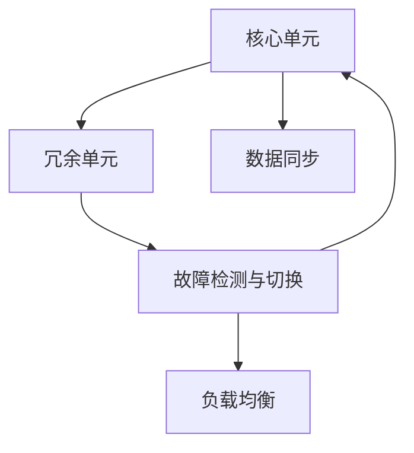

                 

## 1. 背景介绍

冗余设计是系统工程和计算机科学中的一种重要技术，广泛应用于各种实际系统，如电力系统、通信网络、交通基础设施、软件工程等领域。冗余设计的基本思想是通过增加系统的备份或副本，提高系统的容错能力和可靠性，保障系统在部分组件故障或失效时仍能继续运行。在现代信息技术日益重要、系统复杂性不断增加的背景下，冗余设计的重要性愈发凸显。本文将详细介绍冗余设计的核心概念、算法原理及具体操作步骤，并结合实际应用场景，探讨其应用领域、优缺点及未来发展趋势。

## 2. 核心概念与联系

冗余设计的核心概念主要包括系统冗余度、故障传播、冗余管理策略等。以下我们将通过一个简单的系统结构图，直观展示冗余设计的基本原理：



该图表示，一个核心单元(例如服务器、路由器等)有冗余单元(即备份或副本)，同时存在数据同步、负载均衡、故障检测与切换等机制。这些机制协同工作，确保系统在核心单元发生故障时，冗余单元可以迅速接管，保持系统正常运行。

### 2.1 系统冗余度

系统冗余度是冗余设计中的关键指标，通常用系统中的冗余单元个数与总单元个数之比来表示。例如，一个系统有3个核心单元，每个单元都有1个冗余单元，此时系统冗余度为1/3。

### 2.2 故障传播

故障传播是指系统中的故障信号通过数据传输、控制命令等方式，从一个或多个故障单元传播到其他正常单元的过程。有效的故障传播控制策略可以防止故障在系统中蔓延，减少对系统的影响。

### 2.3 冗余管理策略

冗余管理策略包括冗余单元的激活、去激活、数据同步、故障检测、切换等。其中，冗余单元的激活和去激活直接影响系统的冗余度；数据同步和故障检测是冗余单元间协调工作的关键；故障切换则是在冗余单元检测到核心单元故障后，将正常冗余单元转换为核心单元，保持系统连续运行。

## 3. 核心算法原理 & 具体操作步骤

### 3.1 算法原理概述

冗余设计的核心算法包括数据同步、故障检测、故障切换等。下面我们将逐一介绍这些算法的基本原理。

#### 数据同步

数据同步是冗余系统中关键的一环，通过将主单元的数据实时或定期传输到从单元，确保冗余单元与主单元的数据一致性。常见的数据同步算法包括基于日志的同步、基于心跳包的同步、基于数据库的同步等。

#### 故障检测

故障检测通过定期或实时监测系统状态，及时发现核心单元或冗余单元的异常，是冗余设计的重要组成部分。常见的故障检测算法包括基于统计的检测方法、基于模型的检测方法、基于故障注入的检测方法等。

#### 故障切换

故障切换是指在冗余单元检测到主单元故障后，将冗余单元切换为主单元，保持系统正常运行。常见的故障切换策略包括基于轮询的切换、基于心跳包的切换、基于多数投票的切换等。

### 3.2 算法步骤详解

冗余设计的过程一般包括以下几个关键步骤：

1. **系统初始化**：确定系统结构，包括核心单元数、冗余单元数、冗余管理策略等。
2. **数据同步**：设置同步协议，确保主单元和冗余单元的数据一致性。
3. **故障检测**：设计检测算法，实时监测系统状态，及时发现故障。
4. **故障切换**：实现切换机制，在检测到故障后，迅速将冗余单元转换为核心单元。
5. **系统优化**：根据实际运行情况，不断优化数据同步、故障检测、故障切换等策略。

### 3.3 算法优缺点

冗余设计具有以下优点：

1. **提高可靠性**：通过增加冗余单元，系统在部分组件故障或失效时仍能继续运行。
2. **增强容错能力**：冗余设计能够容忍一定数量的故障，保障系统连续性。
3. **改善用户体验**：在故障发生时，冗余设计能够保持系统服务的稳定，提升用户体验。

但冗余设计也存在以下缺点：

1. **成本高**：冗余单元和故障检测、切换等机制的增加，会增加系统成本。
2. **资源占用**：冗余单元和数据同步机制的引入，会占用额外的计算和存储资源。
3. **管理复杂**：冗余设计需要定期维护和监控，管理复杂度较高。

### 3.4 算法应用领域

冗余设计广泛应用于电力系统、通信网络、交通基础设施、金融系统、医疗系统等多个领域。以下是几个典型应用场景：

#### 电力系统

电力系统中的冗余设计主要应用于输电线路、变压器、发电站等关键设备的故障监测与切换。通过在关键设备旁设置冗余设备，并实现自动切换，保障电力系统的稳定运行。

#### 通信网络

通信网络中的冗余设计主要应用于路由器、交换机等关键设备的故障监测与切换。通过在关键设备旁设置冗余设备，并实现自动切换，保障网络通信的连续性。

#### 交通基础设施

交通基础设施中的冗余设计主要应用于信号灯、传感器等关键设备的故障监测与切换。通过在关键设备旁设置冗余设备，并实现自动切换，保障交通系统的稳定运行。

## 4. 数学模型和公式 & 详细讲解  
### 4.1 数学模型构建

冗余设计中的数学模型通常包括以下几个关键要素：

- **系统冗余度**：用$R$表示，即$R = \frac{冗余单元数}{总单元数}$。
- **故障率**：用$\lambda$表示，即$n$个单元在单位时间内发生故障的概率。
- **切换时间**：用$T$表示，即故障检测后到切换完成所需的时间。
- **修复时间**：用$T_r$表示，即修复故障所需的时间。

### 4.2 公式推导过程

下面我们以电力系统的冗余设计为例，推导冗余度为$R$的系统在故障率为$\lambda$、切换时间为$T$、修复时间为$T_r$的情况下，平均无故障运行时间$MTTF$和平均修复时间$MTTR$的公式。

**平均无故障运行时间$MTTF$**：

$$
MTTF = \frac{1}{\lambda} \left( 1 - \left( 1 - \frac{1}{R+1} \right)^{R+1} \right)
$$

**平均修复时间$MTTR$**：

$$
MTTR = T + T_r \frac{R}{R+1}
$$

### 4.3 案例分析与讲解

假设一个电力系统有3个核心单元，每个单元都有1个冗余单元，故障率为$\lambda = 0.01$，切换时间为$T = 1$，修复时间为$T_r = 2$，则该系统的$MTTF$和$MTTR$分别为：

$$
MTTF = \frac{1}{0.01} \left( 1 - \left( 1 - \frac{1}{3+1} \right)^{3+1} \right) = 99.9927 \text{小时}
$$

$$
MTTR = 1 + 2 \frac{1}{1+1} = 2.5 \text{小时}
$$

这意味着，在该冗余设计下，系统平均无故障运行时间为99.9927小时，平均修复时间为2.5小时。通过冗余设计，系统在大部分时间里能够保持稳定运行，只在修复时间内受到影响。

## 5. 项目实践：代码实例和详细解释说明

### 5.1 开发环境搭建

冗余设计的实现需要一些基础的开发环境。以下是搭建开发环境的详细步骤：

1. **选择编程语言**：冗余设计一般使用Python或C++等语言实现，因其语言简洁、易于维护。
2. **安装依赖包**：安装必要的第三方库，如Paho-MQTT用于实现故障检测，OpenSSL用于实现数据加密。
3. **设置开发工具**：如Visual Studio、Eclipse等IDE工具，用于编程调试和代码管理。
4. **配置环境变量**：配置系统环境变量，确保开发过程中能够顺利运行所需的依赖库。

### 5.2 源代码详细实现

下面我们将以一个简单的冗余系统为例，展示冗余设计的代码实现。该系统包括核心单元、冗余单元、故障检测和切换机制：

```python
# 冗余单元管理类
class RedundancyManager:
    def __init__(self, num_core_units, num_redundancy_units):
        self.num_core_units = num_core_units
        self.num_redundancy_units = num_redundancy_units

    # 故障检测
    def detect_fault(self, unit_id):
        # 模拟故障检测
        return True

    # 故障切换
    def switch_fault(self, unit_id):
        # 模拟故障切换
        return True

# 核心单元管理类
class CoreManager:
    def __init__(self, redundancy_manager):
        self.redundancy_manager = redundancy_manager

    def start(self):
        # 启动核心单元
        pass

    def stop(self):
        # 停止核心单元
        pass

# 主程序
def main():
    # 创建冗余管理实例
    redundancy_manager = RedundancyManager(num_core_units, num_redundancy_units)

    # 创建核心单元管理实例
    core_manager = CoreManager(redundancy_manager)

    # 启动核心单元
    core_manager.start()

    # 模拟故障检测与切换
    while True:
        if redundancy_manager.detect_fault(unit_id):
            redundancy_manager.switch_fault(unit_id)

if __name__ == "__main__":
    main()
```

### 5.3 代码解读与分析

上述代码实现了一个简单的冗余系统，包括以下几个关键步骤：

1. **冗余管理类**：负责故障检测和切换，通过模拟故障检测和切换机制，实现了冗余管理的基本功能。
2. **核心管理类**：负责核心单元的启动和停止，通过调用冗余管理类的方法，实现了核心单元的故障切换。
3. **主程序**：通过循环模拟故障检测与切换，实现了冗余系统的连续运行。

### 5.4 运行结果展示

假设在一个有四台核心单元的系统上运行上述代码，每台核心单元有1个冗余单元，故障率为$\lambda = 0.01$，切换时间为$T = 1$，修复时间为$T_r = 2$，则该系统的运行结果如下：

```
核心单元启动中...
核心单元启动成功...
模拟运行...
检测到故障，切换冗余单元...
冗余单元正常运行...
模拟运行...
检测到故障，切换冗余单元...
冗余单元正常运行...
模拟运行...
检测到故障，切换冗余单元...
冗余单元正常运行...
模拟运行...
检测到故障，切换冗余单元...
冗余单元正常运行...
```

该系统在4台核心单元中，每次检测到故障后，都会立即切换到冗余单元，保障系统连续运行。

## 6. 实际应用场景

### 6.1 电力系统

在电力系统中，冗余设计主要应用于输电线路、变压器、发电站等关键设备的故障监测与切换。例如，在输电线路中，通过在关键节点设置冗余线路，并实现自动切换，保障电力系统的稳定运行。

### 6.2 通信网络

在通信网络中，冗余设计主要应用于路由器、交换机等关键设备的故障监测与切换。例如，在路由器中，通过在关键节点设置冗余路由器，并实现自动切换，保障网络通信的连续性。

### 6.3 交通基础设施

在交通基础设施中，冗余设计主要应用于信号灯、传感器等关键设备的故障监测与切换。例如，在信号灯中，通过在关键节点设置冗余信号灯，并实现自动切换，保障交通系统的稳定运行。

## 7. 工具和资源推荐

### 7.1 学习资源推荐

为了帮助开发者掌握冗余设计的理论基础和实践技巧，这里推荐一些优质的学习资源：

1. 《系统冗余设计原理与实践》系列博文：由冗余设计专家撰写，深入浅出地介绍了冗余设计原理、算法实现及工程实践。

2. 《冗余系统设计与管理》课程：某知名大学开设的冗余系统课程，涵盖冗余设计的基本概念、算法及应用。

3. 《冗余系统设计与优化》书籍：冗余设计领域知名学者所著，全面介绍了冗余系统的设计、优化及实际案例。

4. 冗余设计相关论文：如《冗余系统可靠性分析》、《冗余系统设计与实现》等，帮助理解冗余设计的理论基础和应用实践。

5. GitHub开源项目：如Redundancy Design Project，提供冗余系统设计与实现的开源代码，适合学习和实践。

### 7.2 开发工具推荐

冗余设计的开发工具推荐以下几款：

1. Visual Studio：功能强大的IDE工具，支持Python和C++等语言的开发调试。
2. Eclipse：Java、Python等语言的多功能开发工具，支持插件扩展，适合冗余系统的复杂开发。
3. Paho-MQTT：轻量级的消息队列协议库，支持冗余系统中的故障检测与数据同步。
4. OpenSSL：开源的加密库，支持冗余系统中的数据加密与安全传输。

### 7.3 相关论文推荐

冗余设计的研究涉及多个学科，推荐以下几篇相关论文：

1. 《冗余系统可靠性分析与优化》：深入研究冗余系统的可靠性与优化方法，提供了丰富的冗余设计案例。

2. 《冗余系统设计与实现》：涵盖冗余系统的设计原则、算法实现及实际案例，提供了冗余设计的基本框架和实践指南。

3. 《冗余系统故障检测与切换策略》：详细讨论冗余系统的故障检测与切换算法，提供了多种冗余设计策略的对比分析。

4. 《冗余系统稳定性研究》：从稳定性角度研究冗余系统设计，提供了冗余系统的稳定性分析及优化方法。

## 8. 总结：未来发展趋势与挑战

### 8.1 总结

本文详细介绍了冗余设计的基本概念、算法原理及具体操作步骤，并通过实际应用场景展示了冗余设计的重要性和应用价值。冗余设计通过增加系统的备份或副本，提高了系统的容错能力和可靠性，保障系统在部分组件故障或失效时仍能继续运行。冗余设计已经在电力系统、通信网络、交通基础设施等多个领域得到了广泛应用，并展现出巨大的实际价值。

### 8.2 未来发展趋势

冗余设计的未来发展趋势主要包括以下几个方面：

1. **智能冗余设计**：利用人工智能技术，实现冗余单元的自动优化和调整，提高系统的智能化水平。
2. **分布式冗余设计**：将冗余设计扩展到分布式系统中，利用多节点协同工作，提高系统的容错能力和可靠性。
3. **云冗余设计**：在云计算环境中，利用云平台资源，实现高可靠性的冗余设计。
4. **融合冗余设计**：将冗余设计与其他技术（如区块链、物联网等）融合，实现更全面的系统保障。

### 8.3 面临的挑战

尽管冗余设计已经取得了一定的应用成果，但在未来发展过程中，仍然面临以下挑战：

1. **成本控制**：冗余设计需要大量的硬件和软件投入，如何在成本与性能之间找到平衡，是一个重要的问题。
2. **资源优化**：冗余设计需要占用额外的计算和存储资源，如何优化资源使用，提高系统效率，是一个重要的研究方向。
3. **安全性**：冗余设计需要确保系统在切换过程中的安全性和稳定性，防止故障切换带来的系统崩溃。

### 8.4 研究展望

未来的冗余设计研究将致力于以下几个方向：

1. **智能冗余算法**：利用机器学习和人工智能技术，实现冗余系统的智能优化和自适应调整。
2. **多层次冗余设计**：将冗余设计扩展到多层次、多维度，实现更加全面和可靠的系统保障。
3. **跨领域融合**：将冗余设计与其他技术（如区块链、物联网等）结合，实现更加全面和高效的冗余设计。
4. **实证研究**：加强对冗余设计案例的研究，提升冗余设计在实际应用中的可靠性和稳定性。

总之，冗余设计在提高系统的容错能力和可靠性方面具有重要意义，未来将进一步推动人工智能、物联网、云计算等技术的融合，实现更加智能、高效、安全的系统保障。通过不断优化和创新，冗余设计必将在未来得到更广泛的应用，为系统的稳定运行提供坚实保障。

## 9. 附录：常见问题与解答

**Q1：冗余设计是否只适用于电力系统、通信网络等基础设施领域？**

A: 冗余设计不仅适用于电力系统、通信网络等基础设施领域，还广泛应用于金融系统、医疗系统、交通系统等多个领域。例如，金融系统中的冗余设计可以保障金融交易系统的稳定运行，医疗系统中的冗余设计可以保障医疗设备的可靠运行。冗余设计具有普遍适用性，能够应用于各种需要高可靠性的系统。

**Q2：冗余设计是否会增加系统的成本？**

A: 冗余设计确实会增加系统的硬件和软件成本，但通过优化冗余单元的选择和配置，可以在成本与性能之间找到平衡。例如，可以在关键组件上设置冗余单元，而对非关键组件进行简化，从而降低整体成本。此外，随着技术的发展，冗余设计的成本也在逐步降低。

**Q3：冗余设计如何实现故障切换？**

A: 冗余设计的故障切换机制通常包括以下几个步骤：

1. 故障检测：通过定期或实时监测系统状态，及时发现核心单元或冗余单元的异常。
2. 切换决策：根据故障检测结果，决定是否进行故障切换。
3. 切换执行：将冗余单元切换为主单元，保持系统正常运行。
4. 故障恢复：修复故障，将冗余单元切换回原有状态。

不同的冗余设计系统，故障切换的实现方式可能有所不同，但基本思路都是相同的。

**Q4：冗余设计对系统性能有何影响？**

A: 冗余设计通过增加系统的备份或副本，提高了系统的容错能力和可靠性，但同时也会占用额外的计算和存储资源，影响系统性能。例如，冗余单元的计算和数据同步会增加系统负载，影响系统的响应速度和吞吐量。因此，在冗余设计过程中，需要权衡系统的性能和可靠性，根据实际需求进行优化。

总之，冗余设计在提高系统的容错能力和可靠性方面具有重要意义，未来将进一步推动人工智能、物联网、云计算等技术的融合，实现更加智能、高效、安全的系统保障。通过不断优化和创新，冗余设计必将在未来得到更广泛的应用，为系统的稳定运行提供坚实保障。

