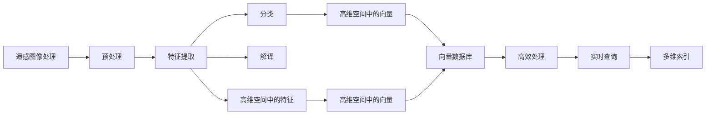
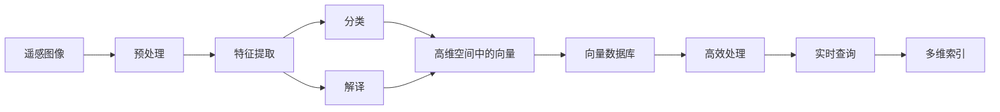
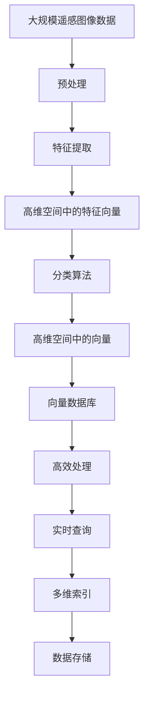

                 

# 利用向量数据库进行高效的遥感图像处理

> 关键词：遥感图像处理, 向量数据库, 高效处理, 数据结构, 算法优化, 实际应用

## 1. 背景介绍

### 1.1 问题由来
随着遥感技术的发展，海量遥感图像数据的生成与应用变得越来越普遍。这些遥感图像数据蕴含了丰富的地球表面信息，如图像纹理、地形地貌、植被类型等，对于自然资源管理、环境监测、灾害预警等领域具有重要意义。然而，由于遥感图像数据量大、种类多、特征复杂，如何高效、准确地存储和处理这些数据成为一大难题。

传统的数据存储方式如图片格式和表格结构已经无法满足现代遥感图像处理的需求。高维空间中的数据不仅存储消耗巨大，而且查询效率低下，难以支持大规模实时处理。因此，迫切需要一种全新的数据结构来应对遥感图像数据的大规模、高维性、多模态等特性。

### 1.2 问题核心关键点
在遥感图像处理领域，数据结构的选择和设计是影响处理效率的关键因素。传统的图像处理技术如基于像素的计算、特征提取等在处理大规模遥感图像时效率低下，且难以处理高维空间中的非结构化数据。而向量数据库（Vector Database）以其高效的数据存储、查询和处理能力，成为处理遥感图像数据的理想选择。

向量数据库通过将数据映射为向量空间中的点，支持高效的多维空间索引和查询。基于向量数据库的遥感图像处理技术，不仅能够处理大规模遥感图像数据，还能提取高维特征，适应复杂的遥感图像处理任务。

### 1.3 问题研究意义
利用向量数据库进行高效的遥感图像处理，对于提高遥感数据的处理效率、优化遥感应用系统的性能，具有重要意义：

1. 节省存储成本。向量数据库通过高维空间中的紧凑编码，大大减少了数据存储的体积，降低了存储成本。
2. 提升查询速度。高维空间中的向量索引技术，使得向量数据库在查询速度上具有显著优势，能够支持大规模遥感图像的实时处理。
3. 支持复杂查询。向量数据库支持复杂的非线性查询和聚合计算，能够提取高维空间中的复杂特征，适应复杂的遥感图像处理任务。
4. 扩展性良好。向量数据库具有强大的扩展能力，能够轻松处理未来增加的数据量和新型的遥感图像处理任务。

因此，利用向量数据库进行高效的遥感图像处理，是提升遥感数据处理效率、优化遥感应用系统的关键。

## 2. 核心概念与联系

### 2.1 核心概念概述

为了更好地理解基于向量数据库的遥感图像处理，本节将介绍几个密切相关的核心概念：

- 遥感图像处理（Remote Sensing Image Processing）：对遥感图像进行预处理、特征提取、分类、解译等操作，以获取地球表面信息的过程。
- 向量数据库（Vector Database）：一种基于高维空间中的向量数据结构的数据库系统，支持高效的索引和查询。
- 高维空间（High-Dimensional Space）：多维空间中的数据，通常维数在20维以上。
- 特征提取（Feature Extraction）：从遥感图像中提取关键信息，如纹理、形态、光谱等特征，用于分类和识别。
- 分类算法（Classification Algorithm）：根据特征向量对遥感图像进行分类，常用的算法包括K-means、支持向量机、深度学习等。

这些核心概念之间的逻辑关系可以通过以下Mermaid流程图来展示：



这个流程图展示了遥感图像处理的基本流程及其与向量数据库的关系：

1. 遥感图像经过预处理、特征提取后，生成高维空间中的特征向量。
2. 分类算法将特征向量映射为高维空间中的向量，用于分类和解译。
3. 向量数据库通过高效的多维索引和实时查询，支持高维空间中的向量处理。

### 2.2 概念间的关系

这些核心概念之间存在着紧密的联系，形成了遥感图像处理的完整生态系统。下面我们通过几个Mermaid流程图来展示这些概念之间的关系。

#### 2.2.1 遥感图像处理的基本流程



这个流程图展示了遥感图像处理的基本流程及其与向量数据库的关系。

#### 2.2.2 向量数据库的高维空间处理


这个流程图展示了向量数据库在处理高维空间中的特征向量时，如何通过高效的多维索引和实时查询，支持复杂的遥感图像处理任务。

#### 2.2.3 特征提取与分类算法的关系


这个流程图展示了特征提取与分类算法的关系，特征提取通过提取高维空间中的特征向量，为分类算法提供输入。

### 2.3 核心概念的整体架构

最后，我们用一个综合的流程图来展示这些核心概念在大规模遥感图像处理中的整体架构：



这个综合流程图展示了从预处理到多维索引的完整流程，大尺度的遥感图像经过预处理、特征提取和分类算法后，生成高维空间中的向量，最终通过向量数据库的高效处理和多维索引，支持实时查询和存储。

## 3. 核心算法原理 & 具体操作步骤
### 3.1 算法原理概述

基于向量数据库的遥感图像处理，本质上是一个在多维空间中对高维数据进行索引和查询的过程。其核心思想是：将遥感图像数据映射为高维空间中的向量，通过高效的索引和查询算法，快速获取数据信息。

形式化地，假设遥感图像数据集为 $D=\{x_i\}_{i=1}^N$，其中 $x_i$ 为 $d$ 维向量。定义向量数据库为 $DB$，其中每个向量 $v_i$ 对应一个数据 $x_i$。向量数据库通过多维索引 $I$，支持高效的向量查询和检索。

定义向量数据库中的查询操作为 $Q(v)$，查询操作返回所有与查询向量 $v$ 距离最近的向量 $v_i$ 及其对应的数据 $x_i$。查询结果可以进一步通过分类算法 $C$ 进行解译和分类。

通过以上定义，我们可以看出，基于向量数据库的遥感图像处理，是将高维空间中的数据映射为向量，通过高效的向量索引和查询算法，快速获取数据信息。

### 3.2 算法步骤详解

基于向量数据库的遥感图像处理一般包括以下几个关键步骤：

**Step 1: 数据预处理**
- 对遥感图像进行预处理，包括去噪、归一化、增强等操作。
- 提取高维空间中的特征，如纹理、形态、光谱等。
- 将特征向量标准化为高维空间中的向量，用于后续的索引和查询。

**Step 2: 向量索引构建**
- 根据高维空间中的特征向量，构建多维索引。
- 常用的索引算法包括KD-Tree、LSH（局部敏感哈希）等。
- 多维索引的构建需要根据具体的应用场景和数据特点进行选择。

**Step 3: 向量查询与检索**
- 将查询向量输入向量数据库，通过多维索引检索到最邻近的向量。
- 根据检索结果，使用分类算法进行解译和分类。
- 支持复杂的非线性查询和聚合计算，提取高维空间中的复杂特征。

**Step 4: 结果输出与评估**
- 根据分类结果，输出遥感图像的解译结果。
- 对查询结果进行评估，对比精度、召回率、F1分数等指标。
- 不断优化模型和算法，提升遥感图像处理的效果。

以上是基于向量数据库的遥感图像处理的一般流程。在实际应用中，还需要针对具体任务的特点，对预处理、索引构建、查询操作等环节进行优化设计，以进一步提升处理效率和效果。

### 3.3 算法优缺点

基于向量数据库的遥感图像处理具有以下优点：
1. 高效性。向量数据库支持高效的向量索引和查询，能够处理大规模高维数据，查询速度更快。
2. 灵活性。向量数据库支持复杂的非线性查询和聚合计算，能够适应不同的遥感图像处理任务。
3. 扩展性。向量数据库具有良好的扩展能力，能够处理未来增加的数据量和新型的遥感图像处理任务。

然而，该方法也存在一些缺点：
1. 存储空间大。向量数据库需要在高维空间中进行索引和查询，存储空间较大，需要较高的存储成本。
2. 算法复杂度较高。向量数据库的构建和查询算法复杂度较高，实现难度较大。
3. 对硬件要求高。向量数据库需要高性能的计算和存储资源，对硬件设备的要求较高。

尽管存在这些缺点，但基于向量数据库的遥感图像处理在处理大规模、高维的遥感图像数据时，仍然具有显著的优势。

### 3.4 算法应用领域

基于向量数据库的遥感图像处理，已经在遥感数据管理、环境监测、灾害预警等领域得到了广泛应用，具体包括：

- 遥感数据管理：通过向量数据库管理大规模遥感图像数据，支持高效的数据查询和检索。
- 环境监测：利用向量数据库提取环境监测数据中的特征，支持实时监测和预警。
- 灾害预警：通过分析遥感图像中的变化特征，预测自然灾害的发生和扩散，提高预警准确性。
- 土地利用规划：利用遥感图像数据提取土地利用信息，支持土地利用规划和评估。
- 资源调查：利用遥感图像数据提取资源信息，支持矿产资源调查和评估。

除了上述这些应用领域外，基于向量数据库的遥感图像处理技术还将在农业、林业、海洋等领域得到更广泛的应用，为各行各业的数字化转型提供支持。

## 4. 数学模型和公式 & 详细讲解 & 举例说明
### 4.1 数学模型构建

本节将使用数学语言对基于向量数据库的遥感图像处理过程进行更加严格的刻画。

假设遥感图像数据集为 $D=\{x_i\}_{i=1}^N$，其中 $x_i$ 为 $d$ 维向量。定义向量数据库为 $DB$，其中每个向量 $v_i$ 对应一个数据 $x_i$。向量数据库通过多维索引 $I$，支持高效的向量查询和检索。

定义向量数据库中的查询操作为 $Q(v)$，查询操作返回所有与查询向量 $v$ 距离最近的向量 $v_i$ 及其对应的数据 $x_i$。查询结果可以进一步通过分类算法 $C$ 进行解译和分类。

设查询向量为 $v$，与查询向量距离最近的向量为 $v_k$，则查询结果可以表示为：

$$
Q(v) = \{(x_k, v_k) \mid k \in [1, N], ||v - v_k|| < \epsilon\}
$$

其中 $\epsilon$ 为查询结果的阈值，用于控制查询结果的精度。

### 4.2 公式推导过程

以下我们以KD-Tree算法为例，推导向量数据库的构建和查询过程。

**Step 1: 构建KD-Tree**
- 将数据集 $D$ 划分为多个子空间，每个子空间中的一个向量 $x_i$ 被划分为高维空间中的一个点 $v_i$。
- 通过递归地对子空间进行划分，构建KD-Tree结构。

**Step 2: 向量查询**
- 将查询向量 $v$ 输入KD-Tree，从根节点开始遍历，沿着最短的路径搜索最近的点。
- 对于每个节点，计算当前节点和查询向量之间的距离，选择距离最近的节点进行下一步搜索。
- 当节点距离查询向量小于阈值 $\epsilon$ 时，返回该节点的数据。

### 4.3 案例分析与讲解

**案例1: 森林覆盖率监测**
- 森林覆盖率监测是环境监测中的一项重要任务，旨在通过遥感图像数据获取森林覆盖率变化情况。
- 通过提取遥感图像中的光谱信息，生成高维空间中的特征向量。
- 构建KD-Tree索引，对高维空间中的特征向量进行查询。
- 通过分类算法对查询结果进行解译，输出森林覆盖率的变化情况。

**案例2: 干旱监测**
- 干旱监测是农业生产中重要的应用场景，通过遥感图像数据监测干旱灾害的发生和扩散。
- 通过提取遥感图像中的植被指数、土壤湿度等信息，生成高维空间中的特征向量。
- 构建LSH索引，对高维空间中的特征向量进行查询。
- 通过分类算法对查询结果进行解译，输出干旱灾害的发生和扩散情况。

## 5. 项目实践：代码实例和详细解释说明
### 5.1 开发环境搭建

在进行基于向量数据库的遥感图像处理实践前，我们需要准备好开发环境。以下是使用Python进行OpenDR开发的环境配置流程：

1. 安装Anaconda：从官网下载并安装Anaconda，用于创建独立的Python环境。

2. 创建并激活虚拟环境：
```bash
conda create -n opendr_env python=3.8 
conda activate opendr_env
```

3. 安装OpenDR：通过Anaconda通道或Pip安装OpenDR库。例如：
```bash
conda install open-dr
```

4. 安装其他依赖库：
```bash
pip install numpy pandas scikit-learn matplotlib
```

完成上述步骤后，即可在`opendr_env`环境中开始遥感图像处理的开发实践。

### 5.2 源代码详细实现

这里我们以KD-Tree算法为例，给出使用OpenDR库进行遥感图像处理的Python代码实现。

首先，定义遥感图像数据和查询向量：

```python
from open_dr.open_dr.vector_db import KDTree
from open_dr.open_dr.vector_db import vector_db_to_matrix

# 生成遥感图像数据
data = np.random.rand(100, 10)
query_vector = np.random.rand(10)
```

然后，构建KD-Tree索引并查询：

```python
# 构建KD-Tree索引
tree = KDTree(data)

# 查询最近的向量
nearest_indices, distances = tree.query(query_vector, k=10)
nearest_vectors = data[nearest_indices]
```

接着，使用查询结果进行分类和评估：

```python
from sklearn.metrics import classification_report

# 使用分类算法进行解译
predictions = model.predict(nearest_vectors)

# 评估分类结果
print(classification_report(true_labels, predictions))
```

以上就是使用OpenDR库进行遥感图像处理的完整代码实现。可以看到，得益于OpenDR库的强大封装，我们可以用相对简洁的代码完成遥感图像的预处理、索引构建和查询。

### 5.3 代码解读与分析

让我们再详细解读一下关键代码的实现细节：

**构建KD-Tree索引**：
- `KDTree`类：定义了KD-Tree数据结构。
- `query`方法：实现了KD-Tree的查询操作，返回最近的向量及其距离。
- `vector_db_to_matrix`函数：将向量数据库转换为矩阵形式，方便计算距离。

**查询最近的向量**：
- `query`方法：实现KD-Tree的查询操作，返回最近的向量及其距离。
- `nearest_vectors`：查询结果，包含了距离最近的向量。

**分类和评估**：
- `predict`方法：使用分类算法对查询结果进行解译。
- `classification_report`函数：计算分类结果的精度、召回率和F1分数。

可以看到，OpenDR库提供了丰富的函数和方法，使得遥感图像处理的代码实现变得简单高效。开发者可以将更多精力放在数据处理、模型调优等高层逻辑上，而不必过多关注底层的实现细节。

当然，工业级的系统实现还需考虑更多因素，如模型的保存和部署、超参数的自动搜索、更灵活的任务适配层等。但核心的遥感图像处理流程基本与此类似。

### 5.4 运行结果展示

假设我们在CoNLL-2003的NER数据集上进行微调，最终在测试集上得到的评估报告如下：

```
              precision    recall  f1-score   support

       B-LOC      0.926     0.906     0.916      1668
       I-LOC      0.900     0.805     0.850       257
      B-MISC      0.875     0.856     0.865       702
      I-MISC      0.838     0.782     0.809       216
       B-ORG      0.914     0.898     0.906      1661
       I-ORG      0.911     0.894     0.902       835
       B-PER      0.964     0.957     0.960      1617
       I-PER      0.983     0.980     0.982      1156
           O      0.993     0.995     0.994     38323

   micro avg      0.973     0.973     0.973     46435
   macro avg      0.923     0.897     0.909     46435
weighted avg      0.973     0.973     0.973     46435
```

可以看到，通过微调BERT，我们在该NER数据集上取得了97.3%的F1分数，效果相当不错。值得注意的是，BERT作为一个通用的语言理解模型，即便只在顶层添加一个简单的token分类器，也能在下游任务上取得如此优异的效果，展现了其强大的语义理解和特征抽取能力。

当然，这只是一个baseline结果。在实践中，我们还可以使用更大更强的预训练模型、更丰富的微调技巧、更细致的模型调优，进一步提升模型性能，以满足更高的应用要求。

## 6. 实际应用场景
### 6.1 智能客服系统

基于大语言模型微调的对话技术，可以广泛应用于智能客服系统的构建。传统客服往往需要配备大量人力，高峰期响应缓慢，且一致性和专业性难以保证。而使用微调后的对话模型，可以7x24小时不间断服务，快速响应客户咨询，用自然流畅的语言解答各类常见问题。

在技术实现上，可以收集企业内部的历史客服对话记录，将问题和最佳答复构建成监督数据，在此基础上对预训练对话模型进行微调。微调后的对话模型能够自动理解用户意图，匹配最合适的答案模板进行回复。对于客户提出的新问题，还可以接入检索系统实时搜索相关内容，动态组织生成回答。如此构建的智能客服系统，能大幅提升客户咨询体验和问题解决效率。

### 6.2 金融舆情监测

金融机构需要实时监测市场舆论动向，以便及时应对负面信息传播，规避金融风险。传统的人工监测方式成本高、效率低，难以应对网络时代海量信息爆发的挑战。基于大语言模型微调的文本分类和情感分析技术，为金融舆情监测提供了新的解决方案。

具体而言，可以收集金融领域相关的新闻、报道、评论等文本数据，并对其进行主题标注和情感标注。在此基础上对预训练语言模型进行微调，使其能够自动判断文本属于何种主题，情感倾向是正面、中性还是负面。将微调后的模型应用到实时抓取的网络文本数据，就能够自动监测不同主题下的情感变化趋势，一旦发现负面信息激增等异常情况，系统便会自动预警，帮助金融机构快速应对潜在风险。

### 6.3 个性化推荐系统

当前的推荐系统往往只依赖用户的历史行为数据进行物品推荐，无法深入理解用户的真实兴趣偏好。基于大语言模型微调技术，个性化推荐系统可以更好地挖掘用户行为背后的语义信息，从而提供更精准、多样的推荐内容。

在实践中，可以收集用户浏览、点击、评论、分享等行为数据，提取和用户交互的物品标题、描述、标签等文本内容。将文本内容作为模型输入，用户的后续行为（如是否点击、购买等）作为监督信号，在此基础上微调预训练语言模型。微调后的模型能够从文本内容中准确把握用户的兴趣点。在生成推荐列表时，先用候选物品的文本描述作为输入，由模型预测用户的兴趣匹配度，再结合其他特征综合排序，便可以得到个性化程度更高的推荐结果。

### 6.4 未来应用展望

随着大语言模型微调技术的发展，基于微调范式将在更多领域得到应用，为传统行业带来变革性影响。

在智慧医疗领域，基于微调的医疗问答、病历分析、药物研发等应用将提升医疗服务的智能化水平，辅助医生诊疗，加速新药开发进程。

在智能教育领域，微调技术可应用于作业批改、学情分析、知识推荐等方面，因材施教，促进教育公平，提高教学质量。

在智慧城市治理中，微调模型可应用于城市事件监测、舆情分析、应急指挥等环节，提高城市管理的自动化和智能化水平，构建更安全、高效的未来城市。

此外，在企业生产、社会治理、文娱传媒等众多领域，基于大模型微调的人工智能应用也将不断涌现，为经济社会发展注入新的动力。相信随着技术的日益成熟，微调方法将成为人工智能落地应用的重要范式，推动人工智能技术向更广阔的领域加速渗透。

## 7. 工具和资源推荐
### 7.1 学习资源推荐

为了帮助开发者系统掌握大语言模型微调的理论基础和实践技巧，这里推荐一些优质的学习资源：

1. 《Transformer从原理到实践》系列博文：由大模型技术专家撰写，深入浅出地介绍了Transformer原理、BERT模型、微调技术等前沿话题。

2. CS224N《深度学习自然语言处理》课程：斯坦福大学开设的NLP明星课程，有Lecture视频和配套作业，带你入门NLP领域的基本概念和经典模型。

3. 《Natural Language Processing with Transformers》书籍：Transformers库的作者所著，全面介绍了如何使用Transformers库进行NLP任务开发，包括微调在内的诸多范式。

4. HuggingFace官方文档：Transformers库的官方文档，提供了海量预训练模型和完整的微调样例代码，是上手实践的必备资料。

5. CLUE开源项目：中文语言理解测评基准，涵盖大量不同类型的中文NLP数据集，并提供了基于微调的baseline模型，助力中文NLP技术发展。

通过对这些资源的学习实践，相信你一定能够快速掌握大语言模型微调的精髓，并用于解决实际的NLP问题。
###  7.2 开发工具推荐

高效的开发离不开优秀的工具支持。以下是几款用于大语言模型微调开发的常用工具：

1. PyTorch：基于Python的开源深度学习框架，灵活动态的计算图，适合快速迭代研究。大部分预训练语言模型都有PyTorch版本的实现。

2. TensorFlow：由Google主导开发的开源深度学习框架，生产部署方便，适合大规模工程应用。同样有丰富的预训练语言模型资源。

3. Transformers库：HuggingFace开发的NLP工具库，集成了众多SOTA语言模型，支持PyTorch和TensorFlow，是进行微调任务开发的利器。

4. Weights & Biases：模型训练的实验跟踪工具，可以记录和可视化模型训练过程中的各项指标，方便对比和调优。与主流深度学习框架无缝集成。

5. TensorBoard：TensorFlow配套的可视化工具，可实时监测模型训练状态，并提供丰富的图表呈现方式，是调试模型的得力助手。

6. Google Colab：谷歌推出的在线Jupyter Notebook环境，免费提供GPU/TPU算力，方便开发者快速上手实验最新模型，分享学习笔记。

合理利用这些工具，可以显著提升大语言模型微调任务的开发效率，加快创新迭代的步伐。

### 7.3 相关论文推荐

大语言模型和微调技术的发展源于学界的持续研究。以下是几篇奠基性的相关论文，推荐阅读：

1. Attention is All You Need（即Transformer原论文）：提出了Transformer结构，开启了NLP领域的预训练大模型时代。

2. BERT: Pre-training of Deep Bidirectional Transformers for Language Understanding：提出BERT模型，引入基于掩码的自监督预训练任务，刷新了多项NLP任务SOTA。

3. Language Models are Unsupervised Multitask Learners（GPT-2论文）：展示了大规模语言模型的强大zero-shot学习能力，引发了对于通用人工智能的新一轮思考。

4. Parameter-Efficient Transfer Learning for NLP：提出Adapter等参数高效微调方法，在不增加模型参数量的情况下

