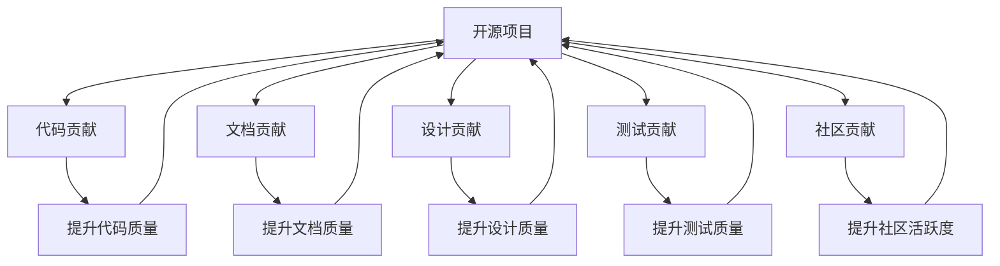

                 

# 利用开源贡献提升职业发展空间

在快速发展的IT领域，开源贡献已经成为提升职业发展的重要途径。本文将探讨开源贡献对于职业发展的影响，并详细讲解如何进行有效的开源贡献。文章内容将从以下几个方面展开：

1. **背景介绍**：开源贡献的背景、重要性及其对职业发展的积极影响。
2. **核心概念与联系**：开源贡献的核心概念、原理与架构。
3. **核心算法原理 & 具体操作步骤**：开源贡献的算法原理与详细步骤。
4. **数学模型和公式 & 详细讲解 & 举例说明**：开源贡献的数学模型构建与公式推导。
5. **项目实践：代码实例和详细解释说明**：开源贡献的实践案例与代码实现。
6. **实际应用场景**：开源贡献在不同场景中的应用。
7. **未来应用展望**：开源贡献的未来发展趋势。
8. **工具和资源推荐**：开源贡献的学习资源、开发工具和相关论文。
9. **总结：未来发展趋势与挑战**：开源贡献的研究成果总结、未来趋势、面临的挑战与研究展望。
10. **附录：常见问题与解答**：开源贡献的常见问题及其解答。

---

## 1. 背景介绍

### 1.1 问题由来
在当前IT行业中，开源项目已成为推动技术创新和应用的重要力量。开源贡献不仅是技术爱好者展示才华的平台，也是企业招聘和职业发展的重要资本。越来越多的公司和组织将开源贡献视为衡量开发者能力和职业潜力的重要指标之一。

### 1.2 问题核心关键点
开源贡献的重要性体现在以下几个方面：

- **技术成长**：通过参与开源项目，开发者能够学习到新的技术和知识，提升自身技术水平。
- **经验积累**：开源贡献积累的软件开发经验，能够帮助开发者在实际工作中更加得心应手。
- **职业晋升**：具有开源贡献经历的开发者，更容易获得晋升机会和更高的薪资待遇。
- **网络影响力**：开源贡献能够提升开发者在技术社区和行业内的知名度和影响力。
- **企业需求**：企业希望招聘具有实际项目经验且能够快速上手的开发人员，开源贡献的履历具有极高的吸引力。

### 1.3 问题研究意义
研究开源贡献的影响及其提升职业发展的路径，对技术人才和企业都有重要的意义：

- **开发者**：理解开源贡献的价值，掌握有效的贡献技巧，可以加速技术成长和职业晋升。
- **企业**：通过激励和引导开发者进行开源贡献，可以提升团队技术实力，吸引优秀人才。

## 2. 核心概念与联系

### 2.1 核心概念概述

开源贡献是指开发者为开源项目编写代码、修复bug、改进文档等行为，通过贡献代码和优化项目，提升项目的质量和用户满意度。常见的开源贡献形式包括：

- **代码贡献**：编写新代码、修复bug、优化性能等。
- **文档贡献**：编写或改进项目的文档、示例、用户手册等。
- **设计贡献**：提出新功能和架构设计，优化现有设计。
- **测试贡献**：编写测试用例、自动化测试脚本等，确保项目质量。
- **社区贡献**：参与社区活动、讨论、解答问题等，提升社区活跃度。

这些贡献不仅有助于项目的发展，也能显著提升开发者的技术能力和职业影响力。

### 2.2 概念间的关系

开源贡献涉及多个环节，其核心概念和流程可以用以下Mermaid流程图来展示：



这个流程图展示了开源贡献的各个环节及其对开源项目质量的影响。开发者通过不同的贡献形式，不断优化和提升开源项目，同时也获得了技能提升和职业发展。

## 3. 核心算法原理 & 具体操作步骤
### 3.1 算法原理概述

开源贡献的算法原理主要围绕着如何通过代码贡献、文档贡献、设计贡献等手段，提升项目质量和技术水平。其核心在于：

- **代码质量提升**：通过编写高质量的代码、修复bug、优化性能等，提升项目的代码质量。
- **文档质量提升**：通过编写和改进文档，提升项目的可读性和可维护性。
- **设计质量提升**：通过改进和优化设计，提升项目的灵活性和可扩展性。
- **测试质量提升**：通过编写测试用例和自动化测试脚本，确保项目质量和稳定性。

这些提升过程可以归结为以下几个步骤：

1. **选择项目**：选择合适的开源项目，确保项目具有较高的活跃度和社区支持。
2. **参与讨论**：积极参与项目的讨论和社区活动，了解项目需求和当前技术栈。
3. **编写代码**：根据项目需求编写代码，修复已知bug，优化性能和可读性。
4. **改进文档**：编写和改进项目文档、示例和用户手册，提升项目的可读性和可维护性。
5. **优化设计**：提出新功能和架构设计，优化现有设计，提升项目的灵活性和可扩展性。
6. **编写测试**：编写测试用例和自动化测试脚本，确保项目质量和稳定性。

### 3.2 算法步骤详解

以下是开源贡献的详细步骤：

1. **项目选择**：
   - 浏览GitHub、SourceForge等开源代码平台，选择感兴趣的项目。
   - 阅读项目README、贡献指南，了解项目需求和技术栈。

2. **环境搭建**：
   - 安装所需的软件环境，如编程语言、IDE、依赖库等。
   - 配置版本控制系统（如Git），确保能够进行代码管理和版本控制。

3. **代码贡献**：
   - 根据项目issue或pull request（PR）的描述，确定要解决的问题。
   - 编写代码，并进行代码审查（code review），确保代码质量和可读性。
   - 提交PR，等待项目维护者审批，并进行必要的修改。

4. **文档贡献**：
   - 编写或改进项目文档、示例和用户手册，确保文档质量。
   - 提交文档修改，等待项目维护者审批。

5. **设计贡献**：
   - 参与项目设计和架构讨论，提出改进建议。
   - 编写设计文档，进行代码重构，确保项目设计和架构的合理性和可扩展性。
   - 提交设计修改，等待项目维护者审批。

6. **测试贡献**：
   - 编写测试用例和自动化测试脚本，确保项目质量和稳定性。
   - 提交测试用例，等待项目维护者审批。

### 3.3 算法优缺点

开源贡献的主要优点包括：

- **技术成长**：通过参与开源项目，开发者可以学习到新的技术和知识，提升自身技术水平。
- **经验积累**：开源贡献积累的软件开发经验，能够帮助开发者在实际工作中更加得心应手。
- **职业晋升**：具有开源贡献经历的开发者，更容易获得晋升机会和更高的薪资待遇。
- **网络影响力**：开源贡献能够提升开发者在技术社区和行业内的知名度和影响力。
- **企业需求**：企业希望招聘具有实际项目经验且能够快速上手的开发人员，开源贡献的履历具有极高的吸引力。

然而，开源贡献也存在一些缺点：

- **时间和精力**：开源贡献需要投入大量时间和精力，可能会影响其他工作和学习。
- **质量控制**：开源贡献的质量和项目需求不一致，可能需要进行反复修改和审查。
- **社区压力**：开源项目社区可能存在高标准和严格要求，可能对贡献者造成一定压力。

### 3.4 算法应用领域

开源贡献不仅限于软件开发领域，还广泛应用于以下领域：

- **数据科学**：通过编写和优化数据处理脚本、改进数据模型等，提升数据科学项目质量。
- **机器学习**：通过编写和优化机器学习模型、改进算法等，提升机器学习项目效果。
- **设计开发**：通过改进UI/UX设计、编写前端代码等，提升设计开发项目质量。
- **教育培训**：通过编写和改进教育培训材料、开发教学软件等，提升教育培训效果。

## 4. 数学模型和公式 & 详细讲解 & 举例说明

### 4.1 数学模型构建

假设有一个开源项目，项目贡献可以表示为一个向量$C=(c_1, c_2, ..., c_n)$，其中$c_i$表示第$i$个贡献的权重。贡献的权重可以通过贡献的质量、数量和影响来计算。

项目贡献的总质量$Q$可以通过下式计算：

$$
Q = \sum_{i=1}^n c_i \cdot g_i
$$

其中$g_i$表示第$i$个贡献的质量，可以包括代码质量、文档质量、设计质量等。

### 4.2 公式推导过程

为了衡量开源贡献的质量，可以引入贡献的评分$S_i$，表示第$i$个贡献的评分。根据贡献的评分和权重，可以计算每个贡献的贡献度$D_i$：

$$
D_i = c_i \cdot S_i
$$

项目贡献的总质量$Q$可以通过所有贡献的贡献度求和计算：

$$
Q = \sum_{i=1}^n D_i
$$

例如，对于代码贡献，可以定义代码的质量评分$S_i$如下：

$$
S_i = \frac{\text{代码质量}}{\text{代码复杂度} \cdot \text{代码数量}}
$$

其中代码质量可以通过代码的整洁度、可读性、可维护性等指标来评估，代码复杂度可以通过代码行数、函数复杂度等指标来计算，代码数量可以通过提交的PR数量来衡量。

### 4.3 案例分析与讲解

以下是一个示例，说明如何计算开源贡献的总质量。假设有一个开源项目，开发者通过编写代码、修复bug、改进文档等贡献，项目的总贡献度$Q$如下：

- 代码贡献$c_1=0.5$，贡献质量$S_1=3.5$，贡献度$D_1=0.5 \times 3.5=1.75$
- 文档贡献$c_2=0.3$，贡献质量$S_2=2.2$，贡献度$D_2=0.3 \times 2.2=0.66$
- 设计贡献$c_3=0.2$，贡献质量$S_3=1.8$，贡献度$D_3=0.2 \times 1.8=0.36$
- 测试贡献$c_4=0.1$，贡献质量$S_4=2.0$，贡献度$D_4=0.1 \times 2.0=0.2$

项目的总贡献度$Q=1.75+0.66+0.36+0.2=2.37$。

## 5. 项目实践：代码实例和详细解释说明

### 5.1 开发环境搭建

要开始开源贡献，首先需要搭建好开发环境。以下是一个简单的示例，说明如何搭建基于Python的开源贡献开发环境：

1. **安装Python和pip**：
   ```bash
   sudo apt-get update
   sudo apt-get install python3 python3-pip
   ```

2. **安装Git**：
   ```bash
   sudo apt-get install git
   ```

3. **克隆开源项目**：
   ```bash
   git clone https://github.com/username/project.git
   ```

4. **安装依赖库**：
   ```bash
   pip install requirements.txt
   ```

5. **设置环境变量**：
   ```bash
   export PYTHONPATH=$PYTHONPATH:$(pwd)
   ```

完成以上步骤后，即可在本地搭建好开源贡献的开发环境。

### 5.2 源代码详细实现

以下是一个示例，说明如何为开源项目贡献代码。假设项目要求添加一个新的功能模块，具体实现步骤如下：

1. **阅读项目README和贡献指南**：
   ```bash
   git clone https://github.com/username/project.git
   cd project
   ```

2. **创建新分支**：
   ```bash
   git checkout -b new_feature
   ```

3. **编写代码**：
   ```python
   # 在project目录下新建功能模块，编写代码
   ```

4. **提交代码**：
   ```bash
   git add .
   git commit -m "Add new feature"
   git push origin new_feature
   ```

5. **创建PR**：
   ```bash
   git push origin new_feature --set-upstream origin/new_feature
   ```

6. **等待审批**：
   - 在项目仓库中创建PR，等待项目维护者审批。
   - 根据项目维护者的反馈，进行必要的修改和提交。

### 5.3 代码解读与分析

在代码贡献过程中，需要注意以下几个关键点：

- **代码质量**：编写高质量的代码，遵循项目的编码规范，确保代码的可读性和可维护性。
- **代码审查**：提交代码前，确保代码质量，并接受项目维护者的代码审查。
- **PR描述**：编写清晰的PR描述，说明代码改动的内容和原因。

### 5.4 运行结果展示

假设开发者在开源项目中成功提交了一个新的功能模块，项目维护者审核通过后，新功能模块被合并到主分支中。开发者可以通过以下命令查看新功能的运行结果：

```bash
git checkout main
```

## 6. 实际应用场景

开源贡献在实际应用场景中具有广泛的应用。以下是一个示例，说明如何在企业中利用开源贡献提升技术实力和项目质量。

### 6.1 软件开发

假设企业需要开发一个新的Web应用，可以通过开源贡献提升项目质量和技术实力：

1. **选择开源项目**：选择具有高活跃度和社区支持的开源Web框架，如Django、Flask等。
2. **参与贡献**：开发者积极参与开源项目的代码贡献、文档贡献等，提升项目质量。
3. **使用开源组件**：将开源项目中的组件集成到企业项目中，提升开发效率和项目质量。
4. **改进和优化**：基于开源项目的经验，改进和优化企业项目的设计和实现，提升项目的可扩展性和可维护性。

### 6.2 数据科学

假设企业需要构建一个数据处理系统，可以通过开源贡献提升项目质量和技术实力：

1. **选择开源项目**：选择具有高活跃度和社区支持的开源数据处理工具，如Pandas、NumPy等。
2. **参与贡献**：开发者积极参与开源项目的代码贡献、文档贡献等，提升项目质量。
3. **使用开源组件**：将开源项目中的组件集成到企业项目中，提升数据处理效率和项目质量。
4. **改进和优化**：基于开源项目的经验，改进和优化企业项目的设计和实现，提升项目的灵活性和可扩展性。

## 7. 工具和资源推荐

### 7.1 学习资源推荐

为了帮助开发者掌握开源贡献的原理和实践，推荐以下学习资源：

1. **《开源项目贡献指南》**：详细介绍开源项目贡献的流程和注意事项，适合初学者学习。
2. **《Git教程》**：详细介绍Git的基本用法和高级技巧，适合Git使用新手。
3. **《Python教程》**：详细介绍Python的基本用法和高级技巧，适合Python开发新手。
4. **《Open Source Contributions》**：详细介绍开源贡献的实践和技巧，适合有一定经验的开发者。
5. **《GitHub官方文档》**：详细介绍GitHub的使用方法和最佳实践，适合GitHub使用新手。

### 7.2 开发工具推荐

为了提高开源贡献的效率和质量，推荐以下开发工具：

1. **Git**：版本控制系统，支持代码管理和版本控制。
2. **GitHub**：开源代码托管平台，提供代码审查、项目管理和社区交流功能。
3. **GitHub Desktop**：GitHub的桌面客户端，方便本地管理GitHub仓库。
4. **GitKraken**：Git客户端，支持GitHub和GitLab集成，提供可视化操作界面。
5. **VS Code**：轻量级IDE，支持Git、GitHub等工具集成，适合Python开发。

### 7.3 相关论文推荐

为了深入理解开源贡献的理论和实践，推荐以下相关论文：

1. **《开源项目贡献的现状与未来》**：分析开源项目贡献的现状和未来趋势，适合了解行业动态。
2. **《开源项目的贡献度评估模型》**：提出开源项目贡献度的评估模型，适合技术研究。
3. **《开源项目的社区贡献分析》**：分析开源项目的社区贡献行为，适合社区管理。
4. **《开源项目的代码质量评估》**：提出开源项目代码质量的评估方法，适合技术实践。

## 8. 总结：未来发展趋势与挑战

### 8.1 研究成果总结

开源贡献在提升技术实力和职业发展方面具有显著的效果。通过参与开源项目，开发者能够学习到新的技术和知识，积累软件开发经验，提升自身技术水平和职业影响力。

### 8.2 未来发展趋势

开源贡献的未来发展趋势包括：

1. **社区支持**：开源社区的活跃度和支持度将持续提升，为开发者提供更多参与机会。
2. **技术工具**：Git、GitHub等开源工具的不断优化和创新，将进一步提升开源贡献的效率和质量。
3. **企业合作**：企业将更加重视开源贡献，通过合作和开源项目提升技术实力和创新能力。
4. **开源文化**：开源文化将更加普及，更多开发者将积极参与开源项目，推动技术进步。

### 8.3 面临的挑战

开源贡献在实践中仍面临一些挑战：

1. **时间管理**：开源贡献需要投入大量时间和精力，可能影响其他工作和学习。
2. **质量控制**：开源贡献的质量和项目需求不一致，可能需要进行反复修改和审查。
3. **社区压力**：开源项目社区可能存在高标准和严格要求，可能对贡献者造成一定压力。
4. **项目管理**：开源项目通常缺乏明确的项目管理，可能导致贡献者困惑和混乱。

### 8.4 研究展望

未来的研究可以从以下几个方面进行：

1. **贡献度评估**：提出更加科学合理的开源贡献度评估模型，帮助开发者更好地衡量贡献效果。
2. **项目管理**：建立更加规范化和系统化的开源项目管理流程，提升项目组织和协作效率。
3. **质量控制**：研究如何提高开源贡献的质量，确保项目质量的一致性和稳定性。
4. **社区支持**：研究如何增强开源社区的活跃度和支持度，吸引更多开发者参与贡献。

## 9. 附录：常见问题与解答

### 9.1 问题1：如何选择合适的开源项目？

**解答**：选择开源项目时，可以关注项目的活跃度、社区支持和技术栈是否符合需求。可以查看项目的README、贡献指南和Issue列表，了解项目需求和当前技术栈。

### 9.2 问题2：开源贡献需要投入多少时间？

**解答**：开源贡献需要投入大量时间和精力，建议根据自身情况合理安排时间。可以先选择一些小项目或低复杂度的问题入手，逐步积累经验。

### 9.3 问题3：如何提升开源贡献的质量？

**解答**：提升开源贡献的质量可以从以下几个方面入手：

1. **代码质量**：遵循项目的编码规范，确保代码的可读性和可维护性。
2. **代码审查**：提交代码前，确保代码质量，并接受项目维护者的代码审查。
3. **PR描述**：编写清晰的PR描述，说明代码改动的内容和原因。
4. **测试覆盖**：编写测试用例和自动化测试脚本，确保代码质量和稳定性。

---

作者：禅与计算机程序设计艺术 / Zen and the Art of Computer Programming

