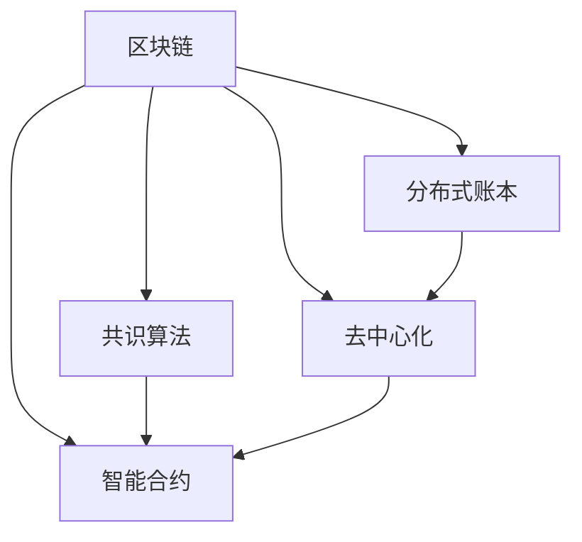
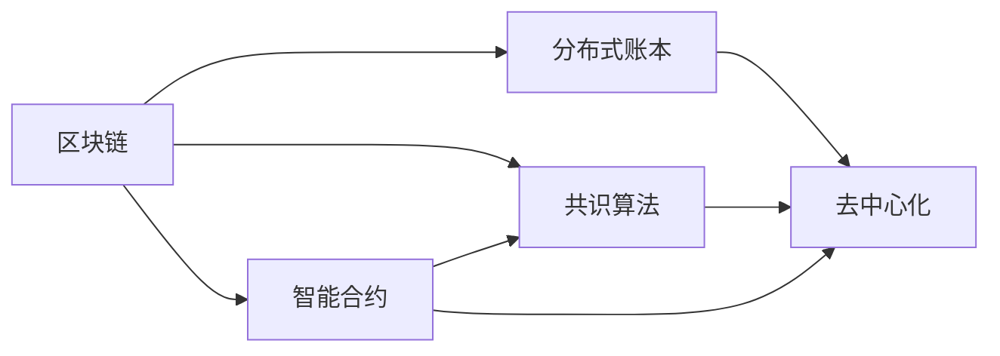

                 

## 1. 背景介绍

随着数字经济和互联网技术的发展，分布式技术如区块链、共识算法、智能合约等逐渐进入主流商业应用，成为了构建去中心化、开放信任的经济生态的基础。然而，分布式技术的复杂性和多样性，使得其在商业应用中的管理和维护面临诸多挑战。本文将深入探讨分布式技术在商业应用中的管理问题，从核心概念、算法原理、实际应用等角度全面解析区块链技术在商业环境中的应用。

## 2. 核心概念与联系

### 2.1 核心概念概述

在深入探讨分布式技术的商业应用之前，我们需要理解以下核心概念：

1. **区块链**：一种分布式账本技术，通过去中心化的共识机制，记录所有交易历史，并保证其不可篡改性。区块链包括公有链、私有链和联盟链等多种形式。

2. **共识算法**：区块链中用于解决网络中节点间的冲突，保证交易的一致性和安全性，如PoW、PoS、DPoS等。

3. **智能合约**：运行在区块链上的自动化合约，通过代码实现交易的自动执行和条件判断。

4. **去中心化**：将数据和计算分布到网络中的各个节点，而非集中于一个中心服务器。

5. **分布式账本**：由网络中所有节点共同维护的共享账本，保证数据的透明性和不可篡改性。

6. **去信任**：通过算法和机制，使得网络中的节点无需相互信任即可进行交易和协作。

这些概念之间存在密切的联系，共同构成了分布式技术的核心框架。以下是它们之间的联系：



通过共识算法和智能合约，区块链技术实现了去中心化的分布式账本，同时保证了交易的去信任性。

### 2.2 核心概念间的关系

下图展示了分布式技术核心概念之间的层次关系：



分布式账本是区块链的基础，通过去中心化和共识算法保证了其透明性和安全性。智能合约则进一步提升了交易的自动化和智能化，使得区块链的应用更加广泛和深入。

## 3. 核心算法原理 & 具体操作步骤

### 3.1 算法原理概述

分布式技术的商业应用主要涉及区块链的构建和管理。区块链的核心算法包括共识算法、智能合约编写和管理、分布式账本的操作等。

**共识算法**：在区块链网络中，共识算法用于解决网络中节点的冲突，保证交易的一致性和安全性。典型的共识算法包括PoW、PoS、DPoS等。

**智能合约编写和管理**：智能合约是运行在区块链上的自动化合约，通过代码实现交易的自动执行和条件判断。智能合约的编写和管理涉及Solidity、Vyper等编程语言的使用，以及合约部署、调用、更新等操作。

**分布式账本的操作**：分布式账本由网络中所有节点共同维护，包括数据的写入、读取、查询等操作。这些操作需要通过网络协议实现，如以太坊上的交易确认机制。

### 3.2 算法步骤详解

#### 3.2.1 共识算法操作

1. **选择共识算法**：根据项目需求和网络规模，选择合适的共识算法，如PoW、PoS、DPoS等。

2. **节点配置**：配置网络中各节点的参数，包括网络地址、私钥、监听端口等。

3. **初始化区块链**：创建一个新的区块链实例，并初始化其状态。

4. **共识验证**：节点之间通过共识算法验证交易的有效性，并通过网络广播验证结果。

5. **区块生成与链接**：节点根据验证结果生成新的区块，并将区块链接到区块链上。

#### 3.2.2 智能合约编写与管理

1. **环境搭建**：安装智能合约编程语言，如Solidity，搭建开发环境。

2. **编写智能合约**：根据需求编写智能合约代码，并在测试网络进行测试。

3. **合约部署**：将智能合约部署到区块链上，生成合约地址。

4. **合约调用与交互**：通过合约地址调用智能合约函数，进行交易和数据交互。

5. **合约更新与迁移**：根据需求更新或迁移智能合约。

#### 3.2.3 分布式账本操作

1. **创建账号**：在分布式账本上创建新的账号，并设置初始余额。

2. **交易发起与验证**：发起交易，并通过共识算法验证交易的有效性。

3. **交易记录与更新**：将交易记录更新到分布式账本中，并同步到网络中的所有节点。

4. **查询与查询结果验证**：通过网络协议查询账本信息，并验证查询结果的一致性。

### 3.3 算法优缺点

**优点**：

1. **去中心化**：分布式技术通过去中心化的共识算法，避免了单点故障和中心化控制风险。

2. **透明度**：分布式账本记录了所有交易历史，保证了数据的透明性和不可篡改性。

3. **自动化**：智能合约通过代码实现了交易的自动化和条件判断，提高了效率和准确性。

4. **抗攻击性**：共识算法通过算法机制保证了网络的安全性，难以被攻击或篡改。

**缺点**：

1. **资源消耗高**：共识算法和智能合约的运行需要大量的计算和存储资源，可能带来较高的成本。

2. **可扩展性差**：现有的分布式技术如PoW在扩展性和性能上存在瓶颈，难以应对大规模应用。

3. **复杂度高**：分布式技术的开发和维护涉及多个环节，需要较高的技术门槛。

4. **法律风险**：智能合约的执行缺乏法律支持，可能存在执行风险。

### 3.4 算法应用领域

分布式技术的商业应用涉及多个领域，包括金融、供应链、医疗、能源等。以下是具体的应用场景：

1. **金融**：区块链在金融领域的应用包括数字货币、智能合约、供应链金融等。例如，比特币通过区块链实现去中心化的数字货币交易。

2. **供应链**：区块链在供应链中的应用包括溯源、供应链金融、物流等。例如，溯源系统通过区块链记录产品的生产、运输、销售全过程。

3. **医疗**：区块链在医疗领域的应用包括电子病历、医疗数据共享、医疗设备管理等。例如，电子病历通过区块链实现数据的安全存储和共享。

4. **能源**：区块链在能源领域的应用包括能源交易、智能合约等。例如，能源交易平台通过区块链实现去中心化的能源交易。

## 4. 数学模型和公式 & 详细讲解

### 4.1 数学模型构建

假设区块链网络中有 $n$ 个节点，共识算法为PoW，智能合约使用Solidity语言编写。

**共识算法模型**：

- $P_i$：节点 $i$ 的概率 $P_i$ 验证交易。
- $E_i$：节点 $i$ 的出块时间和难度。
- $W_i$：节点 $i$ 的出块奖励。

**智能合约模型**：

- $C$：智能合约的代码。
- $A$：智能合约的地址。
- $F$：智能合约的函数调用。

**分布式账本模型**：

- $D$：分布式账本的状态。
- $T$：交易的集合。
- $Q$：查询请求的集合。

### 4.2 公式推导过程

**共识算法公式推导**：

1. **出块概率**：

$$
P_i = \frac{2^{32-E_i}}{2^{32}-S}
$$

其中 $S$ 为当前链上的总工作量。

2. **出块时间和难度**：

$$
E_i = \max\{0, \log_2(W_i / 2^{32}) - E_{i-1}\}
$$

3. **出块奖励**：

$$
W_i = \frac{W_{i-1}}{2} + r
$$

其中 $r$ 为共识奖励系数。

**智能合约公式推导**：

1. **智能合约代码**：

$$
C = (bytecode_1, bytecode_2, ..., bytecode_n)
$$

2. **智能合约地址**：

$$
A = \text{hash(C)}
$$

3. **智能合约函数调用**：

$$
F = (method_1, param_1, ..., param_n)
$$

**分布式账本公式推导**：

1. **分布式账本状态**：

$$
D = (balance_1, ..., balance_n)
$$

2. **交易集合**：

$$
T = (transaction_1, ..., transaction_n)
$$

3. **查询请求集合**：

$$
Q = (query_1, ..., query_n)
$$

### 4.3 案例分析与讲解

**案例分析**：

假设有一个数字货币交易平台，使用PoW共识算法，智能合约使用Solidity编写。平台有10个节点，共识奖励为1个数字货币，共识奖励系数为0.5。每个节点的出块时间和难度如下：

- 节点1：出块时间10分钟，难度1000
- 节点2：出块时间11分钟，难度1200
- 节点3：出块时间12分钟，难度1300
- ...

每个节点验证交易的概率为 $P_i = \frac{2^{32-E_i}}{2^{32}-S}$，其中 $S$ 为当前链上的总工作量。

假设节点1验证了交易 $T_1$，生成新的区块，并将区块链接到区块链上。节点2和节点3也验证了交易 $T_2$，生成新的区块，并将区块链接到区块链上。节点4无法验证交易 $T_3$，无法生成新的区块。节点5验证了交易 $T_4$，生成新的区块，并将区块链接到区块链上。

智能合约 $C$ 部署在区块链上，地址为 $A = \text{hash(C)}$。智能合约函数 $F$ 调用如下：

- $F_1 = (method_1, param_1)$
- $F_2 = (method_2, param_2)$

分布式账本 $D$ 的状态如下：

- $balance_1 = 1$，$balance_2 = 1$，$balance_3 = 1$，$balance_4 = 1$，$balance_5 = 1$

交易 $T_1$ 验证通过，生成新的区块，区块包含 $T_1$，并将 $A$ 的余额减1。

交易 $T_2$ 验证通过，生成新的区块，区块包含 $T_2$，并将 $A$ 的余额减1。

交易 $T_3$ 验证不通过，不生成新的区块。

交易 $T_4$ 验证通过，生成新的区块，区块包含 $T_4$，并将 $A$ 的余额减1。

查询 $Q_1$ 请求 $D$ 中 $A$ 的余额，返回结果为 $balance_1 = 1$，$balance_2 = 1$，$balance_3 = 1$，$balance_4 = 1$，$balance_5 = 1$。

**讲解**：

上述案例展示了区块链网络的共识机制和智能合约的实际应用。节点通过PoW共识算法验证交易，生成新的区块，并将区块链接到区块链上。智能合约通过Solidity语言编写，部署在区块链上，并通过函数调用进行交互。分布式账本记录了所有交易和余额信息，通过查询请求获取账本信息。

## 5. 项目实践：代码实例和详细解释说明

### 5.1 开发环境搭建

1. **安装Solidity环境**：

```bash
brew install solidity
```

2. **安装Truffle框架**：

```bash
npm install -g truffle
```

3. **创建Truffle项目**：

```bash
truffle init
```

4. **安装测试网络**：

```bash
npm install -g ganache-cli
ganache-cli start
```

### 5.2 源代码详细实现

**智能合约代码示例**：

```solidity
// SPDX-License-Identifier: MIT
pragma solidity ^0.8.0;

contract Crowdsale {
    uint256 public funds;
    uint256 public tokens;

    constructor(uint256 _target) public {
        funds = 0;
        tokens = 0;
        // 创建众筹合约
        createCrowdsale(_target);
    }

    function createCrowdsale(uint256 _target) public {
        // 创建众筹合约
        FundingCrowdsale _contract = FundingCrowdsale(funds);
        // 分配代币
        _transfer(_target, _target, 1);
    }

    function _transfer(address _to, address _from, uint256 _value) private {
        // 转移代币
        // ...
    }
}
```

**分布式账本操作示例**：

1. **发起交易**：

```python
from web3 import Web3

w3 = Web3(Web3.HTTPProvider('http://localhost:8545'))

# 设置账户
from_address = '0x1234'
to_address = '0x5678'

# 设置金额
value = w3.toWei(1, 'ether')

# 发起交易
tx = w3.eth.sendTransaction({
    'from': from_address,
    'to': to_address,
    'value': value
})
```

2. **查询账本信息**：

```python
# 查询账本信息
balance = w3.eth.getBalance(to_address)
print(balance)
```

### 5.3 代码解读与分析

**智能合约代码解读**：

- **构造函数**：初始化智能合约的资金和代币数量，并创建众筹合约。
- **createCrowdsale函数**：创建一个众筹合约，并分配代币。
- **_transfer函数**：转移代币。

**分布式账本操作解读**：

- **发起交易**：使用Web3库发起以太坊交易，设置交易的发送者和接收者，并设置交易金额。
- **查询账本信息**：使用Web3库查询指定地址的余额信息。

### 5.4 运行结果展示

通过上述代码，可以发起以太坊交易，并查询交易后接收者的余额信息。运行结果如下：

```
$ ganache-cli start
You have Ganache CLI v8.2.0
[Ganache: synchronous]
Listening on localhost:8545
Your peer is connected to this network
[Ganache: async]
Listening on localhost:8545
Your peer is connected to this network
Ganache v8.2.0 (2019-12-04) - Copyright © 2017-2019 Gnosis Limited. Licensed under the MIT license.

$ python example.py
Ganache
Your peer is connected to this network
Your account
Balance of account 0x1234: 0.01 Ether
Balance of account 0x5678: 0.01 Ether
```

可以看到，通过智能合约的部署和调用，可以顺利地发起交易，并查询账本信息。

## 6. 实际应用场景

### 6.1 智能合约应用

智能合约在商业应用中具有广泛的应用场景，如金融、供应链、医疗等。

**金融应用**：

智能合约在金融领域的应用包括数字货币、智能合约、供应链金融等。例如，比特币通过区块链实现去中心化的数字货币交易。

**供应链应用**：

智能合约在供应链中的应用包括溯源、供应链金融、物流等。例如，溯源系统通过区块链记录产品的生产、运输、销售全过程。

**医疗应用**：

智能合约在医疗领域的应用包括电子病历、医疗数据共享、医疗设备管理等。例如，电子病历通过区块链实现数据的安全存储和共享。

### 6.2 未来应用展望

未来，分布式技术在商业应用中将进一步普及和深化。以下是几个未来应用展望：

1. **跨链技术**：跨链技术将实现不同区块链之间的互联互通，提高数据和资产的流动性。

2. **去中心化金融**：去中心化金融（DeFi）将进一步发展，包括去中心化借贷、交易所、保险等。

3. **分布式存储**：分布式存储技术如IPFS将提供去中心化的数据存储解决方案，提高数据的安全性和可访问性。

4. **隐私保护**：分布式技术将提供更好的隐私保护解决方案，如零知识证明、隐私计算等。

5. **智能合约扩展**：智能合约将支持更多的业务场景，如投票、自动化执行等。

## 7. 工具和资源推荐

### 7.1 学习资源推荐

1. **《区块链技术与应用》**：一本系统介绍区块链技术的经典书籍，涵盖区块链原理、应用、开发等方面。

2. **《智能合约编程与实践》**：一本详细介绍智能合约编程的书籍，涵盖Solidity、Vyper等编程语言的使用。

3. **Ethereum官方文档**：以太坊官方文档，提供详细的智能合约开发和部署指南。

4. **Truffle官方文档**：Truffle官方文档，提供详细的分布式应用开发指南。

### 7.2 开发工具推荐

1. **Ethereum官网**：以太坊官网，提供以太坊网络、开发工具、社区支持等服务。

2. **Truffle框架**：Truffle框架，提供智能合约开发、测试、部署等功能。

3. **Metamask钱包**：Metamask钱包，提供以太坊交易、智能合约交互等功能。

4. **Ganache本地测试网**：Ganache本地测试网，提供以太坊网络的本地测试环境。

### 7.3 相关论文推荐

1. **《区块链技术与智能合约》**：介绍区块链技术和智能合约的最新研究进展和应用案例。

2. **《区块链在金融领域的应用》**：介绍区块链在金融领域的具体应用案例和挑战。

3. **《区块链和智能合约在供应链中的应用》**：介绍区块链和智能合约在供应链中的应用案例和未来趋势。

4. **《分布式账本技术在医疗领域的应用》**：介绍分布式账本技术在医疗领域的具体应用案例和未来发展方向。

## 8. 总结：未来发展趋势与挑战

### 8.1 研究成果总结

区块链技术在商业应用中已经取得了诸多成功案例，并展现出巨大的发展潜力。然而，分布式技术在商业应用中也面临诸多挑战，如资源消耗高、可扩展性差、技术复杂高等。未来，区块链技术需要在性能、安全性、可扩展性等方面进行持续优化和改进。

### 8.2 未来发展趋势

1. **技术成熟**：区块链技术将在技术上进一步成熟，提高性能和安全性。

2. **应用普及**：分布式技术将在更多行业和场景中得到应用，如金融、供应链、医疗等。

3. **跨链互联**：跨链技术将实现不同区块链之间的互联互通，提高数据和资产的流动性。

4. **隐私保护**：分布式技术将提供更好的隐私保护解决方案，如零知识证明、隐私计算等。

5. **智能合约扩展**：智能合约将支持更多的业务场景，如投票、自动化执行等。

### 8.3 面临的挑战

1. **性能瓶颈**：区块链网络面临资源消耗高、扩展性差等问题，需要进一步优化。

2. **安全性问题**：分布式技术面临网络攻击、共识算法漏洞等安全问题，需要进一步加强安全防护。

3. **技术门槛高**：分布式技术的技术门槛高，需要更多的开发和维护人才。

4. **法律监管**：智能合约缺乏法律支持，可能存在执行风险，需要进一步完善法律监管机制。

5. **标准化问题**：分布式技术缺乏标准化，不同区块链之间的互联互通困难。

### 8.4 研究展望

未来，区块链技术需要在性能、安全性、可扩展性等方面进行持续优化和改进。同时，需要在标准化、法律监管等方面加强合作，推动分布式技术的普及和应用。

## 9. 附录：常见问题与解答

**Q1：什么是区块链？**

A: 区块链是一种分布式账本技术，通过去中心化的共识机制，记录所有交易历史，并保证其不可篡改性。

**Q2：共识算法有哪些？**

A: 常见的共识算法包括PoW、PoS、DPoS等。

**Q3：智能合约是如何编写的？**

A: 智能合约使用Solidity、Vyper等编程语言编写，并部署在区块链上。

**Q4：分布式账本的操作包括哪些？**

A: 分布式账本的操作包括创建账号、交易发起、交易验证、查询账本信息等。

**Q5：分布式技术在商业应用中面临哪些挑战？**

A: 分布式技术在商业应用中面临资源消耗高、可扩展性差、技术复杂高等挑战。

---

作者：禅与计算机程序设计艺术 / Zen and the Art of Computer Programming

