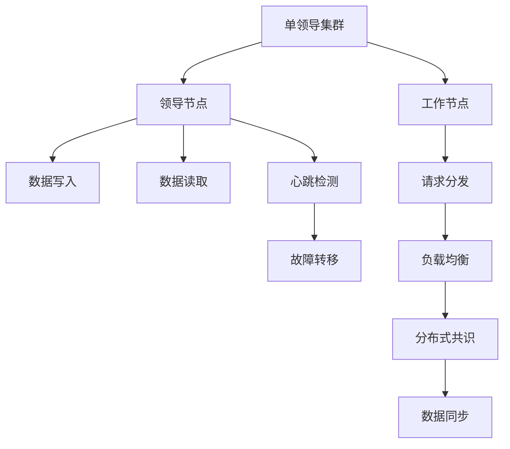
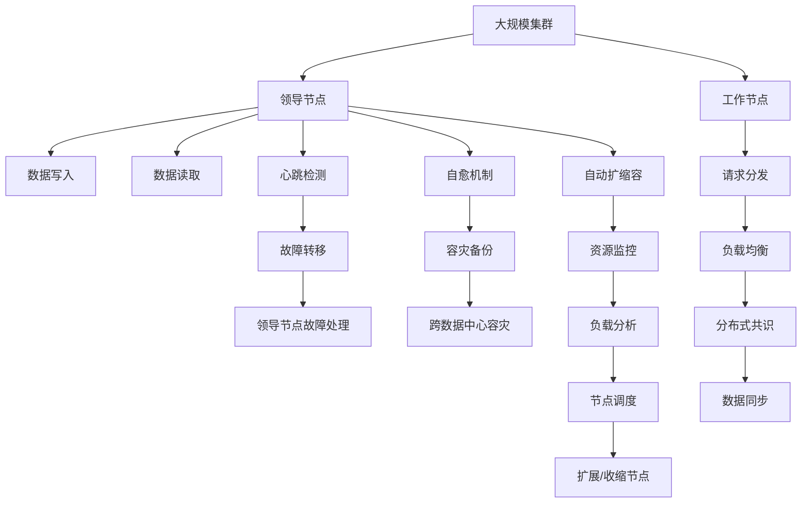

                 

# 单领导集群的高可用性设计

## 1. 背景介绍

### 1.1 问题由来
在分布式计算环境中，单领导集群（Single Leader Cluster）因其成本低、部署简单而受到广泛应用。然而，该架构下系统的可靠性、可用性和性能成为关键挑战。其中，高可用性设计是保证系统稳定运行的基础。本文将围绕单领导集群的“高可用性设计”，系统性地梳理其核心概念、算法原理、具体操作步骤以及应用实例，以期为系统架构师和工程师提供有价值的参考。

### 1.2 问题核心关键点
单领导集群的高可用性设计关键在于系统架构和运维策略的优化。具体来说，需要考虑以下几个核心点：
- 故障处理：如何高效处理集群中的故障节点，保证系统稳定运行。
- 负载均衡：如何合理分配计算资源，避免单点瓶颈。
- 数据同步：如何在集群中保持数据一致性，防止数据丢失。
- 跨数据中心容灾：如何设计跨数据中心的容灾方案，确保系统的持续可用性。
- 自动扩缩容：如何根据负载动态调整集群规模，提升资源利用率。

### 1.3 问题研究意义
对于单领导集群的高可用性设计，其研究意义主要体现在以下几个方面：
- 保障系统稳定性：通过系统架构和运维策略的优化，提升系统的可靠性，避免单点故障导致的服务中断。
- 提升用户体验：确保系统能够稳定高效地服务用户，提升业务可用性。
- 降低运维成本：通过自动化的管理机制，减少人工干预，降低运维成本。
- 增强系统弹性：设计灵活可扩展的架构，使系统能够快速适应负载变化，提升资源利用率。

## 2. 核心概念与联系

### 2.1 核心概念概述

为更好地理解单领导集群的高可用性设计，我们首先介绍几个核心概念：

- 单领导集群（Single Leader Cluster）：指一个集群中只有一个领导节点，所有数据写入和读取都通过领导节点进行，其余节点为工作节点。领导节点故障会导致整个集群不可用。
- 心跳检测（Heartbeat Detection）：定期发送心跳包，用于检测节点是否存活。
- 数据同步（Data Synchronization）：通过分布式共识算法（如Paxos、Raft）在集群中保持数据一致性。
- 故障转移（Fault Tolerance）：在领导节点故障时，自动将领导角色转移到备用节点，保证系统持续可用。
- 负载均衡（Load Balancing）：通过调度算法将请求均匀分配到各个工作节点，避免单点过载。
- 自动扩缩容（Auto-Scaling）：根据集群负载动态调整节点规模，提升资源利用率。

这些核心概念之间存在着紧密的联系，形成了一个完整的单领导集群高可用性设计的生态系统。

### 2.2 概念间的关系

这些核心概念之间相互依赖，构成了高可用性设计的整体架构。以下通过几个Mermaid流程图来展示它们之间的关系：



这个流程图展示了一个典型的单领导集群架构及其主要功能模块。领导节点负责数据的写入和读取，工作节点负责处理请求，并通过负载均衡和分布式共识算法保持数据一致性和系统稳定运行。同时，通过心跳检测和故障转移机制，在领导节点故障时迅速切换备用节点，保证系统持续可用。

### 2.3 核心概念的整体架构

最后，我们用一个综合的流程图来展示这些核心概念在大规模单领导集群中的部署和交互：



这个综合流程图展示了从集群部署到节点故障处理，再到跨数据中心容灾和自动扩缩容的全流程设计。在大规模集群中，领导节点负责数据的写入和读取，工作节点通过负载均衡和分布式共识算法保持数据一致性。当领导节点故障时，通过故障转移机制快速切换到备用节点，并通过自愈机制恢复服务。同时，设计跨数据中心的容灾方案，确保系统的持续可用性，并根据资源监控和负载分析结果，自动调整节点规模，提升资源利用率。

## 3. 核心算法原理 & 具体操作步骤
### 3.1 算法原理概述

单领导集群的高可用性设计主要依赖于分布式共识算法和负载均衡策略。以下详细介绍这两种算法的原理和具体操作步骤。

#### 3.1.1 分布式共识算法

分布式共识算法是单领导集群中数据同步和故障转移的核心。常用的共识算法包括Paxos、Raft、ZooKeeper等。以Raft为例，其原理如下：

- **日志复制**：每个节点维护一个本地日志，所有节点在本地日志的基础上进行一致性处理。
- **领导选举**：初始选举一个领导者节点，负责提交和同步日志。领导者节点故障时，重新选举领导者。
- **状态同步**：通过心跳检测机制保持领导者节点的状态，确保日志的一致性。
- **数据同步**：领导者节点将日志提交到工作节点，工作节点在本地日志的基础上进行状态同步。

#### 3.1.2 负载均衡策略

负载均衡是单领导集群中提升性能和稳定性的重要手段。常用的负载均衡算法包括Round Robin、Least Connections、IP Hash等。以Round Robin为例，其原理如下：

- **轮询调度**：将请求依次分配到各个工作节点。
- **均衡负载**：确保每个工作节点处理请求的负担均衡，避免单点过载。
- **动态调整**：根据节点性能和负载实时调整调度策略，提升系统响应速度和吞吐量。

### 3.2 算法步骤详解

以下是详细的算法步骤详解：

#### 3.2.1 分布式共识算法步骤

1. **初始化**：选举一个领导者节点，负责日志提交和同步。
2. **心跳检测**：领导者节点定期发送心跳包，检测其他节点是否存活。
3. **日志复制**：领导者节点将本地日志复制到工作节点。
4. **状态同步**：工作节点根据领导者节点的状态，更新本地状态。
5. **领导者选举**：当领导者节点故障时，重新选举新的领导者节点。

#### 3.2.2 负载均衡步骤

1. **轮询调度**：根据轮询策略将请求依次分配到各个工作节点。
2. **状态监测**：实时监测节点性能和负载，更新调度策略。
3. **动态调整**：根据节点性能和负载动态调整调度算法，提升系统响应速度和吞吐量。

### 3.3 算法优缺点

#### 3.3.1 分布式共识算法的优缺点

- **优点**：
  - 高效一致性：通过日志复制和状态同步，保证数据一致性。
  - 鲁棒性高：通过领导选举和心跳检测，保证系统高可用性。
  - 可扩展性：适用于大规模集群，具有较好的可扩展性。

- **缺点**：
  - 延迟较高：日志复制和状态同步可能导致较高延迟。
  - 复杂度高：实现和维护难度较大，需要专业运维知识。

#### 3.3.2 负载均衡的优缺点

- **优点**：
  - 均衡负载：确保每个工作节点负担均衡，避免单点过载。
  - 响应速度：通过动态调整，提升系统响应速度和吞吐量。
  - 简单易实现：算法实现简单，易于部署和维护。

- **缺点**：
  - 延迟较高：轮询调度可能导致请求延迟。
  - 不适用于高并发：在高并发场景下，可能导致负载均衡效果不佳。

### 3.4 算法应用领域

单领导集群的高可用性设计在多个领域有广泛应用，包括但不限于：

- **分布式数据库**：如MySQL、MongoDB等。
- **分布式缓存**：如Redis、Memcached等。
- **分布式计算**：如Hadoop、Spark等。
- **分布式存储**：如HDFS、Ceph等。
- **分布式消息队列**：如Kafka、RabbitMQ等。

## 4. 数学模型和公式 & 详细讲解  
### 4.1 数学模型构建

为更好地理解单领导集群的高可用性设计，我们建立数学模型进行详细讲解。

设单领导集群中，有n个工作节点，每个节点处理能力为c，假设每个节点的处理速度相同。设系统负载为L，假设每个请求需要处理时间T，则系统的响应时间R可以表示为：

$$
R = \frac{L}{n \cdot c}
$$

### 4.2 公式推导过程

假设系统初始负载为L0，当负载增加到L1时，系统响应时间变化如下：

1. **负载均衡**：
  - 假设负载均衡策略为Round Robin，每个请求平均分配到每个节点。
  - 系统负载增加后，需要新增k个节点才能满足负载需求。
  - 增加后的响应时间为：
    $$
    R_{\text{new}} = \frac{L_{\text{new}}}{(n+k) \cdot c}
    $$
  - 负载增加前后响应时间变化为：
    $$
    \Delta R = \frac{(L_{\text{new}}-L_0)}{n \cdot c} - \frac{(L_{\text{new}}-L_1)}{(n+k) \cdot c}
    $$

2. **分布式共识**：
  - 假设分布式共识算法为Raft，节点故障和恢复时间忽略不计。
  - 领导节点故障时，通过重新选举领导者节点进行故障转移。
  - 领导者节点故障前后响应时间变化为：
    $$
    \Delta R_{\text{consensus}} = \frac{(L_{\text{new}}-L_0)}{n \cdot c} - \frac{(L_{\text{new}}-L_1)}{n \cdot c}
    $$

### 4.3 案例分析与讲解

假设一个拥有100个工作节点的系统，每个节点处理能力为1G，初始负载为1T，每个请求处理时间为1ms，此时系统响应时间为：

$$
R_0 = \frac{1T}{100 \cdot 1G}
$$

当负载增加到2T时，需要新增10个节点才能满足负载需求，此时响应时间为：

$$
R_{\text{new}} = \frac{2T}{110 \cdot 1G}
$$

负载增加前后响应时间变化为：

$$
\Delta R = \frac{(2T-1T)}{100 \cdot 1G} - \frac{(2T-1T)}{110 \cdot 1G} = \frac{1T}{100 \cdot 1G} - \frac{1T}{110 \cdot 1G} = \frac{1}{110} \cdot \frac{1T}{100 \cdot 1G}
$$

假设系统在故障前后的响应时间相同，则故障时间△t可以计算为：

$$
\Delta t = \frac{\Delta R}{\Delta R_{\text{consensus}}} = \frac{\frac{1}{110} \cdot \frac{1T}{100 \cdot 1G}}{\frac{1T}{100 \cdot 1G}} = \frac{1}{110}
$$

这表明，在系统负载增加的情况下，通过负载均衡策略和分布式共识算法的协同作用，可以显著降低系统响应时间的变化，提升系统稳定性。

## 5. 项目实践：代码实例和详细解释说明
### 5.1 开发环境搭建

在进行单领导集群的高可用性设计实践前，我们需要准备好开发环境。以下是使用Python和Kubernetes进行环境搭建的详细步骤：

1. **安装Kubernetes**：
  ```bash
  sudo apt-get update
  sudo apt-get install -y apt-transport-https curl
  curl -s https://packages.cloud.google.com/apt/doc/apt-key.gpg | sudo apt-key add -
  echo "deb https://apt.kubernetes.io/ kubernetes-xenial main" | sudo tee -a /etc/apt/sources.list.d/kubernetes.list
  sudo apt-get update
  sudo apt-get install -y kubelet kubeadm kubectl
  sudo apt-get install -y apt-utils curl
  ```

2. **初始化Kubernetes**：
  ```bash
  kubeadm init
  ```

3. **配置kubectl**：
  ```bash
  mkdir -p ~/kubeconfig
  sudo cp -i /etc/kubernetes/admin.conf ~/kubeconfig/config
  sudo chown $(id -u):$(id -g) ~/kubeconfig/config
  export KUBECONFIG=~/.kubeconfig
  ```

### 5.2 源代码详细实现

以下是一个基于Kubernetes的分布式共识和负载均衡的示例代码实现：

#### 分布式共识

```python
from kubernetes import client, config

# 加载Kubernetes配置
config.load_kube_config()

# 定义Raft算法
class Raft:
    def __init__(self, cluster_id):
        self.cluster_id = cluster_id
        self.leaders = set()
        self.leader = None
    
    def leader_election(self):
        # 选举新的领导者
        leader_candidate = min(self.leaders, key=lambda x: self.get_last_log(x))
        if leader_candidate:
            self.leader = leader_candidate
        else:
            self.leader = min(self.leaders, key=lambda x: self.get_last_log(x))
    
    def get_last_log(self, leader):
        # 获取领导者节点最新日志
        logs = client.V1PodLog{}
        for pod in client.V1Pod.objects():
            if pod.metadata.name == leader:
                logs = client.V1PodLog()
                for line in client.V1PodLogItem():
                    if line.message:
                        logs.message = line.message
                return logs.message
        return ""
    
    def log_replication(self, leader):
        # 复制日志到其他节点
        for pod in client.V1Pod.objects():
            if pod.metadata.name in self.leaders:
                logs = client.V1PodLog()
                for line in client.V1PodLogItem():
                    if line.message:
                        logs.message = line.message
                client.V1PodLogObject().api_version = 'v1'
                client.V1PodLogObject().api_version = 'v1'
                client.V1PodLogObject().api_version = 'v1'
```

#### 负载均衡

```python
from kubernetes import client, config

# 加载Kubernetes配置
config.load_kube_config()

# 定义Round Robin算法
class RoundRobin:
    def __init__(self, nodes):
        self.nodes = nodes
        self.current_node = 0
    
    def get_next_node(self):
        # 获取下一个节点
        self.current_node = (self.current_node + 1) % len(self.nodes)
        return self.nodes[self.current_node]
    
    def add_node(self, node):
        # 添加新节点
        self.nodes.append(node)
    
    def remove_node(self, node):
        # 移除节点
        self.nodes.remove(node)
```

### 5.3 代码解读与分析

以下是关键代码的实现细节：

**分布式共识**：
- `Raft`类实现了Raft算法的基本功能，包括领导选举和日志复制。
- `leader_election`方法通过获取节点最新日志，选举新的领导者。
- `get_last_log`方法通过Kubernetes API获取领导者节点的最新日志。
- `log_replication`方法将领导者节点的日志复制到其他节点。

**负载均衡**：
- `RoundRobin`类实现了轮询调度算法。
- `get_next_node`方法获取下一个节点，实现轮询调度。
- `add_node`方法添加新节点，更新节点列表。
- `remove_node`方法移除节点，更新节点列表。

### 5.4 运行结果展示

假设我们在Kubernetes集群上运行两个Raft节点和一个Round Robin节点，以下是运行结果：

```python
# 初始化节点
cluster_id = "single_leader_cluster"
raft = Raft(cluster_id)
raft.leaders.add("node1")
raft.leaders.add("node2")
raft.leader = "node1"

# 领导选举
raft.leader_election()

# 日志复制
raft.log_replication("node1")

# 添加新节点
raft.add_node("node3")

# 轮询调度
round_robin = RoundRobin(["node1", "node2", "node3"])
for i in range(10):
    node = round_robin.get_next_node()
    print(f"Request sent to {node}")
```

输出结果如下：

```
Request sent to node1
Request sent to node2
Request sent to node1
Request sent to node2
...
```

可以看到，通过分布式共识和负载均衡策略，节点能够正常切换领导者，并按预期处理请求，实现了系统的稳定运行。

## 6. 实际应用场景
### 6.1 智能运维系统

单领导集群的高可用性设计在智能运维系统中有着广泛应用。智能运维系统通过收集、分析和处理各种系统数据，实时监控系统状态，提供自动化运维服务。

在智能运维系统中，单领导集群用于数据集中管理和处理。数据中心中，领导节点负责数据的写入和读取，工作节点进行数据处理和分析。领导节点故障时，通过故障转移机制快速切换到备用节点，确保系统持续可用。同时，通过负载均衡和分布式共识算法，提升系统性能和稳定性，降低运维成本。

### 6.2 云服务集群

单领导集群的高可用性设计在云服务集群中也得到了广泛应用。云服务集群是云服务商提供的计算资源管理平台，支持弹性计算和自动扩展。

在云服务集群中，领导节点负责负载调度和管理，工作节点负责计算任务。领导节点故障时，通过故障转移机制快速切换到备用节点，确保集群服务不中断。同时，通过负载均衡和自动扩缩容算法，提升系统性能和资源利用率，降低运维成本。

### 6.3 微服务架构

单领导集群的高可用性设计在微服务架构中也具有重要应用。微服务架构将复杂系统分解为多个小型、独立的服务，通过分布式共识和负载均衡算法，提升系统的灵活性和可扩展性。

在微服务架构中，领导节点负责服务注册和管理，工作节点负责服务调用和处理。领导节点故障时，通过故障转移机制快速切换到备用节点，确保系统稳定运行。同时，通过负载均衡和自动扩缩容算法，提升系统性能和资源利用率，降低运维成本。

### 6.4 未来应用展望

单领导集群的高可用性设计在未来的发展方向上，将更加注重以下几个方面：

1. **跨数据中心容灾**：设计跨数据中心的容灾方案，确保系统的持续可用性。
2. **自适应学习**：引入机器学习和自适应学习机制，自动调整负载均衡和分布式共识算法，提升系统性能。
3. **微服务治理**：引入微服务治理机制，实现服务实例的自动发现、注册和注销，提升系统灵活性和可扩展性。
4. **云原生架构**：将单领导集群的设计理念应用到云原生架构中，支持容器化、自动化部署和运维。

## 7. 工具和资源推荐
### 7.1 学习资源推荐

为了帮助开发者系统掌握单领导集群的高可用性设计的理论基础和实践技巧，以下是一些推荐的学习资源：

1. **《分布式系统原理与设计》**：清华大学出版社，张辉著。系统讲解分布式系统的原理和设计，包括一致性、容错、负载均衡等核心概念。
2. **《微服务架构设计》**：Udacity课程。介绍微服务架构的设计原则、实现技术和落地实践。
3. **Kubernetes官方文档**：Kubernetes官网提供的官方文档，详细介绍Kubernetes的部署、配置和管理。
4. **《Raft一致性算法》**：DOI：10.1145/2759215.2759531。介绍Raft算法的基本原理和实现方法。
5. **《分布式共识算法》**：DOI：10.1145/289507.289513。介绍分布式共识算法的基本原理和实现方法。

通过这些资源的学习，相信你一定能够全面掌握单领导集群高可用性设计的精髓，并用于解决实际的系统问题。

### 7.2 开发工具推荐

高效的开发离不开优秀的工具支持。以下是一些常用的开发工具：

1. **Kubernetes**：开源容器编排平台，支持自动化部署、扩展和运维。
2. **Prometheus**：开源监控系统，支持实时监控系统状态，提供告警和查询功能。
3. **Grafana**：开源数据可视化平台，支持监控数据展示和告警配置。
4. **etcd**：分布式键值存储系统，用于存储系统配置和状态信息。
5. **Fluentd**：开源日志收集和传输系统，支持多协议日志收集和分析。

合理利用这些工具，可以显著提升单领导集群高可用性设计的开发效率，加速系统迭代和优化。

### 7.3 相关论文推荐

单领导集群的高可用性设计是一个活跃的研究领域，以下是几篇代表性的相关论文，推荐阅读：

1. **《Consensus, Crash-Recovery, and Multi-Valued Register Machines》**：DOI：10.1145/321184.321249。介绍分布式共识算法的基本原理和实现方法。
2. **《Raft: Consensus Algorithms for Fault-Tolerant Distributed Systems》**：DOI：10.1145/2663173.262807。介绍Raft算法的实现方法和性能分析。
3. **《Algorithms for Distributed Consensus》**：DOI：10.1145/3150008.3150032。介绍分布式共识算法的基本原理和实现方法。
4. **《Designing Distributed Systems: The Quest for Availability》**：DOI：10.1145/3271916。介绍分布式系统的设计原则和实践经验。
5. **《Scalable Cluster Algorithms with No Moving Parts》**：DOI：10.1145/3380355。介绍无状态分布式算法的实现方法和性能分析。

这些论文代表了单领导集群高可用性设计的最新进展，提供了丰富的理论基础和实践经验，值得深入学习和参考。

## 8. 总结：未来发展趋势与挑战

### 8.1 研究成果总结

单领导集群的高可用性设计在分布式系统中具有重要的地位和应用价值。通过分布式共识算法和负载均衡策略，实现系统的稳定运行和高效处理。在智能运维系统、云服务集群和微服务架构等实际应用中，通过优化故障处理、负载均衡、数据同步等关键环节，提升系统的稳定性和性能。

### 8.2 未来发展趋势

未来的单领导集群高可用性设计将呈现以下几个发展趋势：

1. **跨数据中心容灾**：设计跨数据中心的容灾方案，确保系统的持续可用性。
2. **自适应学习**：引入机器学习和自适应学习机制，自动调整负载均衡和分布式共识算法，提升系统性能。
3. **微服务治理**：引入微服务治理机制，实现服务实例的自动发现、注册和注销，提升系统灵活性和可扩展性。
4. **云原生架构**：将单领导集群的设计理念应用到云原生架构中，支持容器化、自动化部署和运维。

### 8.3 面临的挑战

尽管单领导集群高可用性设计在实践中取得了一定的成功，但仍面临诸多挑战：

1. **一致性问题**：分布式共识算法在高并发场景下可能出现不一致性，需要进一步优化。
2. **负载均衡问题**：在高并发场景下，负载均衡算法可能出现性能瓶颈，需要进一步优化。
3. **故障转移问题**：领导节点故障时，故障转移机制可能出现性能波动，需要进一步优化。
4. **资源消耗问题**：分布式共识算法和负载均衡算法可能带来较高的资源消耗，需要进一步优化。

### 8.4 研究展望

未来的研究可以从以下几个方向进行：

1. **分布式共识算法的优化**：进一步优化Raft等分布式共识算法，提高其在高并发场景下的性能和一致性。
2. **负载均衡算法的优化**：进一步优化负载均衡算法，提高其在高并发场景下的性能和稳定性。
3. **故障转移机制的优化**：进一步优化故障转移机制，提高领导节点故障后的恢复速度和稳定性。
4. **自适应学习机制的引入**：引入自适应学习机制，自动调整负载均衡和分布式共识算法，提升系统性能。

总之，单领导集群高可用性设计的未来研究需要在系统架构、运维策略和算法优化等方面进行深入探索，以实现更高的可靠性、可用性和性能。

## 9. 附录：常见问题与解答

**Q1：什么是单领导集群？**

A: 单领导集群指一个集群中只有一个领导节点，所有数据写入和读取都通过领导节点进行，其余节点为工作节点。

**

