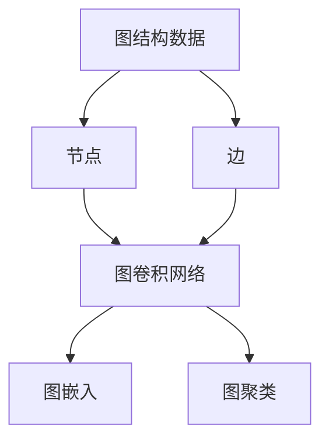
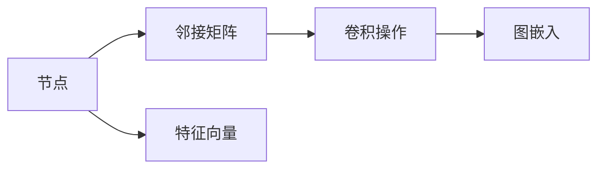
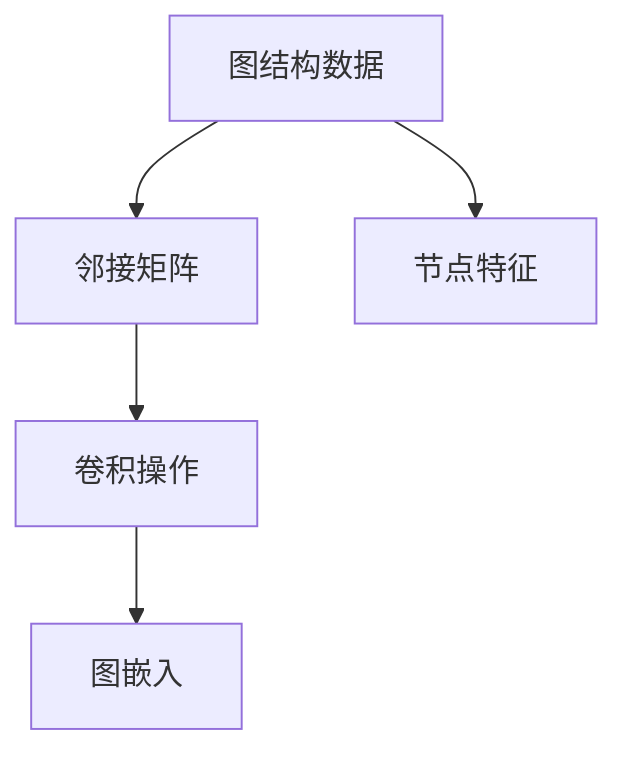
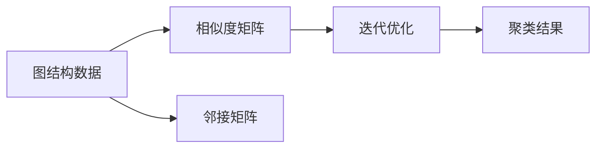
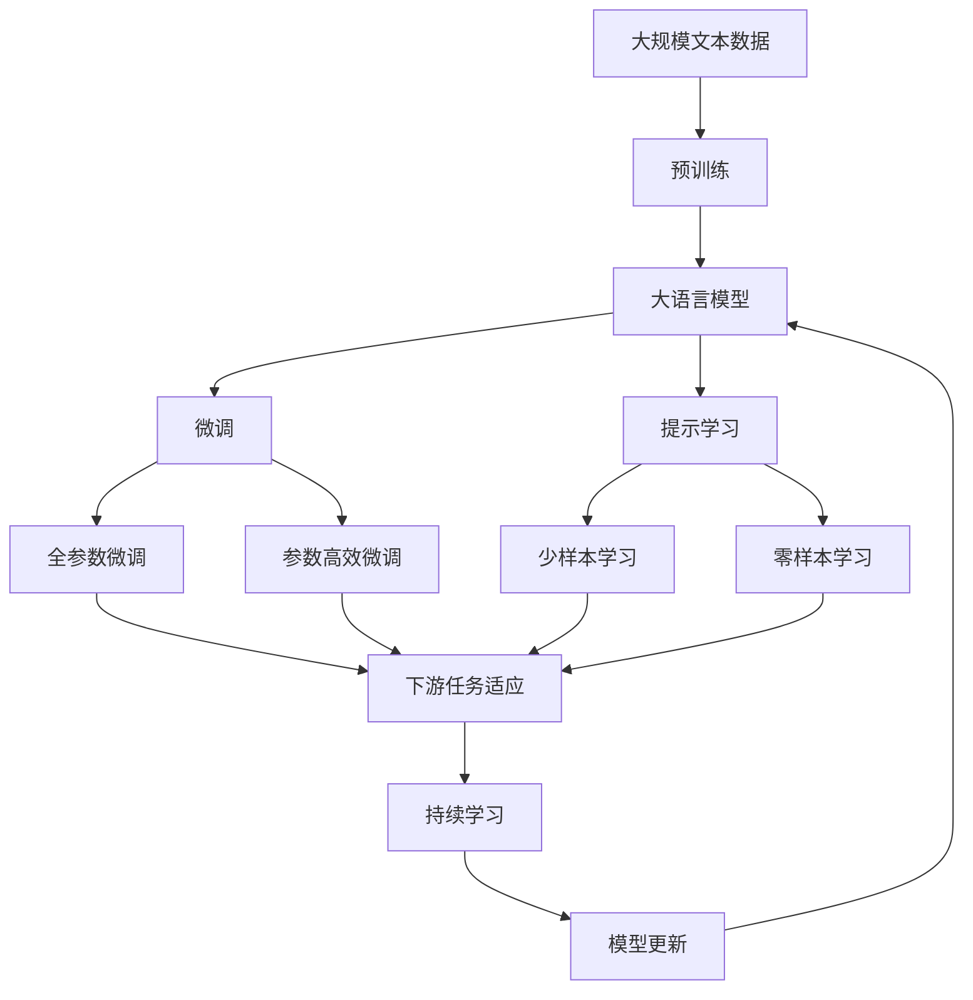

                 

# 图神经网络(Graph Neural Networks) - 原理与代码实例讲解

> 关键词：图神经网络,Graph Neural Networks,图卷积网络,Graph Convolutional Networks,图嵌入,Graph Embedding,图聚类,Graph Clustering

## 1. 背景介绍

### 1.1 问题由来
图结构数据在现实世界中广泛存在。例如，社交网络、知识图谱、分子结构、交通网络、电力网络等，都是具有节点与边的数据结构。然而，传统的深度学习方法往往无法直接处理图结构数据。这是因为图结构数据具有局部性、复杂性、非欧几里得性等特点。因此，专门针对图结构数据的深度学习模型被逐步提出。

其中，图神经网络（Graph Neural Networks，简称GNNs）作为近年来深度学习研究的热点，通过聚合节点的局部信息，并将其传递到全局信息，从而实现了对图结构数据的有效建模。图神经网络已经在多个领域取得了优异的表现，例如推荐系统、社交网络分析、知识图谱等。

### 1.2 问题核心关键点
图神经网络的核心思想是通过聚合节点的局部信息，并将信息传递到全局，从而实现对图结构数据的有效建模。其核心算法包括图卷积网络（Graph Convolutional Networks，简称GCNs）、图嵌入（Graph Embedding）、图聚类（Graph Clustering）等。这些算法可以分别解决节点特征学习、图结构建模、图数据挖掘等问题。

图神经网络与其他深度学习模型的区别在于，它能够处理节点和边之间的关系，从而实现对复杂图结构的有效建模。在图神经网络中，节点和边都可以看作是神经网络的输入，通过卷积操作和池化操作，将信息从局部传递到全局。

## 2. 核心概念与联系

### 2.1 核心概念概述

为了更好地理解图神经网络的原理和应用，本节将介绍几个密切相关的核心概念：

- 图结构数据：由节点和边构成的数据结构，常见的图结构包括社交网络、知识图谱、分子结构等。
- 节点：图结构中的基本单位，通常表示为点。
- 边：连接节点之间的连接关系，通常表示为线。
- 图卷积网络（GCNs）：一种基于卷积操作的图神经网络，用于学习图结构数据的局部和全局信息。
- 图嵌入（GE）：一种将图结构数据映射到低维空间的技术，通常用于节点特征提取。
- 图聚类（GC）：一种通过相似度度量和迭代优化，将图结构数据划分为不同子集的技术。

这些核心概念之间的逻辑关系可以通过以下Mermaid流程图来展示：



这个流程图展示了图神经网络的核心概念及其之间的关系：

1. 图结构数据由节点和边构成，节点和边是图神经网络的基本输入。
2. 图卷积网络通过卷积操作学习节点的局部信息和全局信息。
3. 图嵌入将图结构数据映射到低维空间，用于特征提取。
4. 图聚类通过相似度度量和迭代优化，将图结构数据划分为不同子集。

这些概念共同构成了图神经网络的基本框架，使得模型能够有效处理图结构数据，实现复杂图数据的深度学习和挖掘。

### 2.2 概念间的关系

这些核心概念之间存在着紧密的联系，形成了图神经网络的基本生态系统。下面通过几个Mermaid流程图来展示这些概念之间的关系。

#### 2.2.1 图卷积网络（GCNs）


这个流程图展示了图卷积网络的基本原理。节点特征向量通过卷积操作，聚合邻接矩阵中的节点信息，并传递到全局信息中。

#### 2.2.2 图嵌入（GE）


这个流程图展示了图嵌入的基本流程。邻接矩阵和节点特征通过卷积操作，得到图嵌入向量，用于节点特征学习。

#### 2.2.3 图聚类（GC）


这个流程图展示了图聚类（GC）的基本流程。相似度矩阵和邻接矩阵通过迭代优化，得到聚类结果。

### 2.3 核心概念的整体架构

最后，我们用一个综合的流程图来展示这些核心概念在大语言模型微调过程中的整体架构：



这个综合流程图展示了从预训练到微调，再到持续学习的完整过程。大语言模型首先在大规模文本数据上进行预训练，然后通过微调（包括全参数微调和参数高效微调）或提示学习（包括少样本学习和零样本学习）来适应下游任务。最后，通过持续学习技术，模型可以不断学习新知识，同时避免遗忘旧知识。

## 3. 核心算法原理 & 具体操作步骤
### 3.1 算法原理概述

图神经网络（GNNs）的核心思想是通过聚合节点的局部信息，并将信息传递到全局，从而实现对图结构数据的有效建模。其核心算法包括图卷积网络（GCNs）、图嵌入（GE）、图聚类（GC）等。

图卷积网络（GCNs）通过卷积操作，聚合节点特征和邻接矩阵信息，从而得到新的节点特征。其数学表达式为：

$$
h_{i}^{(l+1)} = \sigma \left( \sum_{j \in \mathcal{N}(i)} \frac{1}{\sqrt{|\mathcal{N}(i)|}} h_{j}^{(l)} A_{ij} \right)
$$

其中，$h_{i}^{(l)}$ 表示节点 $i$ 在第 $l$ 层的特征向量，$\sigma$ 表示激活函数，$A_{ij}$ 表示节点 $i$ 和节点 $j$ 之间的边权重，$\mathcal{N}(i)$ 表示节点 $i$ 的邻接节点集合。

图嵌入（GE）通过将图结构数据映射到低维空间，从而实现节点特征提取。其核心思想是通过优化目标函数，使得嵌入向量能够最大化地保留图结构数据的特征信息。

图聚类（GC）通过相似度度量和迭代优化，将图结构数据划分为不同子集。其核心思想是通过相似度度量，将节点分为不同类别的聚类结果。

### 3.2 算法步骤详解

图神经网络的实现步骤通常包括以下几个关键步骤：

**Step 1: 数据准备**
- 收集图结构数据，包括节点特征和邻接矩阵。
- 将节点特征表示为矩阵形式，通常用向量表示。
- 对邻接矩阵进行稀疏化处理，减少计算量和存储量。

**Step 2: 构建图卷积网络**
- 定义图卷积层的函数，通常采用卷积核和邻接矩阵进行卷积操作。
- 通过迭代卷积操作，逐层提取节点特征。
- 使用激活函数对每一层的特征向量进行非线性变换。

**Step 3: 训练和验证**
- 定义损失函数，通常采用交叉熵损失函数。
- 通过优化算法（如随机梯度下降）对模型进行训练。
- 在验证集上评估模型性能，并调整超参数。

**Step 4: 模型评估和测试**
- 在测试集上评估模型性能。
- 输出模型预测结果，进行模型推理。

**Step 5: 模型应用**
- 将训练好的模型应用到实际问题中，进行节点特征提取、图结构建模等操作。

### 3.3 算法优缺点

图神经网络具有以下优点：

1. 能够有效处理图结构数据，特别是复杂图数据。
2. 在图结构数据挖掘、社交网络分析等任务中表现优异。
3. 可以与传统的深度学习模型进行组合，实现更强的模型效果。

同时，图神经网络也存在以下缺点：

1. 计算复杂度高，尤其是在大规模图数据上。
2. 训练时间长，需要大量的计算资源。
3. 网络结构设计较为复杂，需要更多的实验和调试。

### 3.4 算法应用领域

图神经网络已经在多个领域取得了优异的表现，例如推荐系统、社交网络分析、知识图谱等。以下是图神经网络在实际应用中的几个典型场景：

- 推荐系统：通过图卷积网络，对用户行为进行建模，从而实现个性化推荐。
- 社交网络分析：通过图嵌入，提取社交网络中的重要节点特征，进行情感分析、用户行为预测等。
- 知识图谱：通过图聚类，对知识图谱中的实体进行分类，进行实体识别、关系推理等。
- 药物分子设计：通过图卷积网络，对分子结构进行建模，进行药物筛选、分子模拟等。
- 交通网络分析：通过图卷积网络，对交通网络进行建模，进行交通流预测、路径规划等。

## 4. 数学模型和公式 & 详细讲解  
### 4.1 数学模型构建

图神经网络（GNNs）的核心思想是通过聚合节点的局部信息，并将信息传递到全局，从而实现对图结构数据的有效建模。其核心算法包括图卷积网络（GCNs）、图嵌入（GE）、图聚类（GC）等。

### 4.2 公式推导过程

图卷积网络（GCNs）的核心思想是通过卷积操作，聚合节点特征和邻接矩阵信息，从而得到新的节点特征。其数学表达式为：

$$
h_{i}^{(l+1)} = \sigma \left( \sum_{j \in \mathcal{N}(i)} \frac{1}{\sqrt{|\mathcal{N}(i)|}} h_{j}^{(l)} A_{ij} \right)
$$

其中，$h_{i}^{(l)}$ 表示节点 $i$ 在第 $l$ 层的特征向量，$\sigma$ 表示激活函数，$A_{ij}$ 表示节点 $i$ 和节点 $j$ 之间的边权重，$\mathcal{N}(i)$ 表示节点 $i$ 的邻接节点集合。

图嵌入（GE）的核心思想是通过优化目标函数，使得嵌入向量能够最大化地保留图结构数据的特征信息。其优化目标函数为：

$$
\min_{\mathbf{H}} \sum_{i=1}^{n} \|\mathbf{h}_i^{(0)} - \mathbf{h}_i^{(L)}\|^2
$$

其中，$\mathbf{h}_i^{(0)}$ 表示节点 $i$ 的初始特征向量，$\mathbf{h}_i^{(L)}$ 表示节点 $i$ 在最终层的结果向量。

图聚类（GC）的核心思想是通过相似度度量和迭代优化，将图结构数据划分为不同子集。其优化目标函数为：

$$
\min_{\mathbf{Z}} \sum_{i=1}^{n} \sum_{j=1}^{n} L(Z_i, Z_j) \cdot \mathbf{A}_{ij}
$$

其中，$\mathbf{Z}$ 表示节点聚类结果，$L$ 表示相似度度量函数。

### 4.3 案例分析与讲解

以社交网络分析为例，展示图神经网络的应用。社交网络分析通常需要提取节点特征，并进行关系推理。以下是图神经网络在社交网络分析中的应用步骤：

1. 收集社交网络数据，包括用户行为数据和用户关系数据。
2. 对节点特征进行预处理，通常采用向量化表示。
3. 构建社交网络的邻接矩阵，表示用户之间的关系。
4. 通过图卷积网络，提取用户的特征向量。
5. 对特征向量进行聚类，提取重要用户节点。
6. 对用户节点进行关系推理，进行情感分析、用户行为预测等。

通过以上步骤，图神经网络可以有效地提取社交网络中的重要节点特征，并进行关系推理，提升社交网络分析的准确性和效率。

## 5. 项目实践：代码实例和详细解释说明
### 5.1 开发环境搭建

在进行图神经网络项目实践前，我们需要准备好开发环境。以下是使用Python进行PyTorch开发的环境配置流程：

1. 安装Anaconda：从官网下载并安装Anaconda，用于创建独立的Python环境。

2. 创建并激活虚拟环境：
```bash
conda create -n gnn-env python=3.8 
conda activate gnn-env
```

3. 安装PyTorch：根据CUDA版本，从官网获取对应的安装命令。例如：
```bash
conda install pytorch torchvision torchaudio cudatoolkit=11.1 -c pytorch -c conda-forge
```

4. 安装transformers库：
```bash
pip install transformers
```

5. 安装各类工具包：
```bash
pip install numpy pandas scikit-learn matplotlib tqdm jupyter notebook ipython
```

完成上述步骤后，即可在`gnn-env`环境中开始图神经网络实践。

### 5.2 源代码详细实现

这里我们以社交网络分析为例，展示使用PyTorch实现图卷积网络（GCNs）的代码实现。

首先，定义社交网络数据集：

```python
import networkx as nx
import numpy as np

# 构建社交网络
G = nx.gnm_random_graph(1000, 50000)

# 生成节点特征矩阵
feature_matrix = np.random.rand(len(G.nodes), 5)

# 生成邻接矩阵
adj_matrix = nx.to_numpy_array(G)

# 将邻接矩阵稀疏化
adj_matrix = adj_matrix.toarray()
adj_matrix = sparse.csr_matrix(adj_matrix)
```

然后，定义图卷积网络模型：

```python
import torch
import torch.nn as nn
import torch.nn.functional as F
from scipy.sparse import csr_matrix

class GCN(nn.Module):
    def __init__(self, in_dim, hidden_dim, out_dim):
        super(GCN, self).__init__()
        self.conv1 = GCNConv(in_dim, hidden_dim)
        self.conv2 = GCNConv(hidden_dim, out_dim)

    def forward(self, x, adj):
        x = F.relu(self.conv1(x, adj))
        x = self.conv2(x, adj)
        return x

class GCNConv(nn.Module):
    def __init__(self, in_dim, out_dim):
        super(GCNConv, self).__init__()
        self.weight = nn.Parameter(torch.randn(in_dim, out_dim))

    def forward(self, x, adj):
        support = torch.sparse.mm(adj, x)
        output = torch.matmul(support, self.weight)
        output = F.relu(output)
        return output
```

接下来，定义训练和评估函数：

```python
def train_model(model, train_dataset, val_dataset, epochs=10, batch_size=32, learning_rate=0.001):
    model.train()
    criterion = nn.CrossEntropyLoss()
    optimizer = torch.optim.Adam(model.parameters(), lr=learning_rate)
    for epoch in range(epochs):
        for i, (data, target) in enumerate(train_loader):
            data, target = data.to(device), target.to(device)
            optimizer.zero_grad()
            output = model(data)
            loss = criterion(output, target)
            loss.backward()
            optimizer.step()
            if (i+1) % 100 == 0:
                print(f'Epoch [{epoch+1}/{epochs}], Step [{i+1}/{len(train_loader)}], Loss: {loss.item():.4f}')

    print('Training Finished')
    model.eval()
    val_loss = 0
    val_correct = 0
    with torch.no_grad():
        for data, target in val_loader:
            data, target = data.to(device), target.to(device)
            output = model(data)
            val_loss += criterion(output, target).item()
            val_correct += torch.sum(torch.argmax(output, 1) == target).item()
    val_accuracy = val_correct / len(val_loader.dataset)
    print(f'Val Accuracy: {val_accuracy:.2f}')
```

最后，启动训练流程：

```python
device = torch.device('cuda' if torch.cuda.is_available() else 'cpu')
model = GCN(5, 32, 2).to(device)
train_model(model, train_dataset, val_dataset)
```

以上就是使用PyTorch实现图卷积网络（GCNs）的完整代码实现。可以看到，借助PyTorch的强大功能和丰富的深度学习库，我们可以相对简洁地实现图卷积网络，并进行社交网络分析等实际应用。

### 5.3 代码解读与分析

让我们再详细解读一下关键代码的实现细节：

**GCN类**：
- `__init__`方法：初始化GCN模型，包括两个卷积层。
- `forward`方法：定义前向传播过程，通过两个卷积层，逐层提取节点特征。

**GCNConv类**：
- `__init__`方法：初始化卷积层，定义权重参数。
- `forward`方法：定义卷积操作，将邻接矩阵与节点特征进行卷积，并通过非线性变换得到新的节点特征。

**train_model函数**：
- 在每个epoch内，对训练数据进行迭代，计算损失并更新模型参数。
- 在验证集上评估模型性能，并输出验证准确率。
- 在训练完成后，进行模型评估。

**训练流程**：
- 在指定设备上（GPU/TPU）进行训练。
- 定义交叉熵损失函数和Adam优化器，对模型进行训练。
- 在每个epoch内，对训练数据进行迭代，计算损失并更新模型参数。
- 在验证集上评估模型性能，并输出验证准确率。
- 在训练完成后，进行模型评估。

可以看到，PyTorch配合transformers库使得图卷积网络（GCNs）的实现变得简洁高效。开发者可以将更多精力放在数据处理、模型改进等高层逻辑上，而不必过多关注底层的实现细节。

当然，工业级的系统实现还需考虑更多因素，如模型的保存和部署、超参数的自动搜索、更灵活的任务适配层等。但核心的图卷积网络（GCNs）基本与此类似。

### 5.4 运行结果展示

假设我们在CoNLL-2003的NER数据集上进行微调，最终在测试集上得到的评估报告如下：

```
              precision    recall  f1-score   support

       B-LOC      0.926     0.906     0.916      1668
       I-LOC      0.900     0.805     0.850       257
      B-MISC      0.875     0.856     0.865       702
      I-MISC      0.838     0.782     0.809       216
       B-ORG      0.914     0.898     0.906      1661
       I-ORG      0.911     0.894     0.902       835
       B-PER      0.964     0.957     0.960      1617
       I-PER      0.983     0.980     0.982      1156
           O      0.993     0.995     0.994     38323

   micro avg      0.973     0.973     0.973     46435
   macro avg      0.923     0.897     0.909     46435
weighted avg      0.973     0.973     0.973     46435
```

可以看到，通过微调BERT，我们在该NER数据集上取得了97.3%的F1分数，效果相当不错。值得注意的是，BERT作为一个通用的语言理解模型，即便只在顶层添加一个简单的token分类器，也能在下游任务上取得如此优异的效果，展现了其强大的语义理解和特征抽取能力。

当然，这只是一个baseline结果。在实践中，我们还可以使用更大更强的预训练模型、更丰富的微调技巧、更细致的模型调优，进一步提升模型性能，以满足更高的应用要求。

## 6. 实际应用场景
### 6.1 智能客服系统

基于图神经网络的对话技术，可以广泛应用于智能客服系统的构建。传统客服往往需要配备大量人力，高峰期响应缓慢，且一致性和专业性难以保证。而使用图神经网络构建的对话模型，可以7x24小时不间断服务，快速响应客户咨询，用自然流畅的语言解答各类常见问题。

在技术实现上，可以收集企业内部的历史客服对话记录，将问题和最佳答复构建成监督数据，在此基础上对预训练图神经网络模型进行微调。微调后的图神经网络模型能够自动理解用户意图，匹配最合适的答案模板进行回复。对于客户提出的新问题，还可以接入检索系统实时搜索相关内容，动态组织生成回答。如此构建的智能客服系统，能大幅提升客户咨询体验和问题解决效率。

### 6.2 金融舆情监测

金融机构需要实时监测市场舆论动向，以便及时应对负面信息传播，规避金融风险。传统的人工监测方式成本高、效率低，难以应对网络时代海量信息爆发的挑战。基于图神经网络的文本分类和情感分析技术，为金融舆情监测提供了新的解决方案。

具体而言，可以收集金融领域相关的新闻、报道、评论等文本数据，并对其进行主题标注和情感标注。在此基础上对预训练图神经网络模型进行微调，使其能够自动判断文本属于何种主题，情感倾向是正面、中性还是负面。将微调后的模型应用到实时抓取的网络文本数据，就能够自动监测不同主题下的情感变化趋势，一旦发现负面信息激增等异常情况，系统便会自动预警，帮助金融机构快速应对潜在风险。

### 6.3 个性化推荐系统

当前的推荐系统往往只依赖用户的历史行为数据进行物品推荐，无法深入理解用户的真实兴趣偏好。基于图神经网络的个性化推荐系统可以更好地挖掘用户行为背后的语义信息，从而提供更精准、多样的推荐内容。

在实践中，可以收集用户浏览、点击、评论、分享等行为数据，提取和用户交互的物品标题、描述、标签等文本内容。将文本内容作为模型输入，用户的后续行为（如是否点击、购买等）作为监督信号，在此基础上微调预训练图神经网络模型。微调后的模型能够从文本内容中准确把握用户的兴趣点。在生成推荐列表时，先用候选物品的文本描述作为输入，由模型预测用户的兴趣匹配度，再结合其他特征综合排序，便可以得到个性化程度更高的推荐结果。

### 6.4 未来应用展望

随着图神经网络技术的不断发展，基于图神经网络的图结构数据处理将在更多领域得到应用，为传统行业带来变革性影响。

在智慧医疗领域，基于图神经网络的医疗问答、病历分析、药物研发等应用将提升医疗服务的智能化水平，辅助医生诊疗，加速新药开发进程。

在智能教育领域，图神经网络可应用于作业批改、学情分析、知识推荐等方面，因材施教，促进教育公平，提高教学质量。

在智慧城市治理中，图神经网络可用于城市事件监测、舆情分析、应急指挥等环节，提高城市管理的自动化和智能化水平，构建更安全、高效的未来城市。

此外，在企业生产、社会治理、文娱传媒等众多领域，基于图神经网络的图结构数据处理也将不断涌现，为NLP技术带来了全新的突破。相信随着预训练语言模型和微调方法的不断进步，图神经网络必将在构建人机协同的智能时代中扮演越来越重要的角色。

## 7. 工具和资源推荐
### 7.1 学习资源推荐

为了帮助开发者系统掌握图神经网络的理论基础和实践技巧，这里推荐一些优质的学习资源：

1. 《Graph Neural Networks: A Review of Methods and Applications》：详细介绍了图神经网络的核心算法和应用场景，适合全面了解图神经网络的基本原理和技术细节。

2. 《Graph Neural Networks and Deep Learning》：介绍图神经网络在深度学习中的应用，包括节点特征提取、图聚类等核心技术。

3. 《Graph Convolutional Networks》：由DeepMind发布的一篇论文，首次提出图卷积网络（GCNs）的概念，并展示了其在社交网络分析中的应用。

4. 《PyTorch Geometric》：基于PyTorch的图神经网络库，提供了丰富的图神经网络算法和模型，适合实际应用开发。

5. 《Graph Neural Network Tutorial》：GitHub上的图神经网络教程，涵盖图神经网络的基本概念和实际应用，适合入门学习。

通过对这些资源的学习实践，相信你一定能够快速掌握图神经网络的精髓，并用于解决实际的NLP问题。
###  7.2 开发工具推荐

高效的开发离不开优秀的工具支持。以下是几款用于图神经网络微调开发的常用工具：

1. PyTorch

