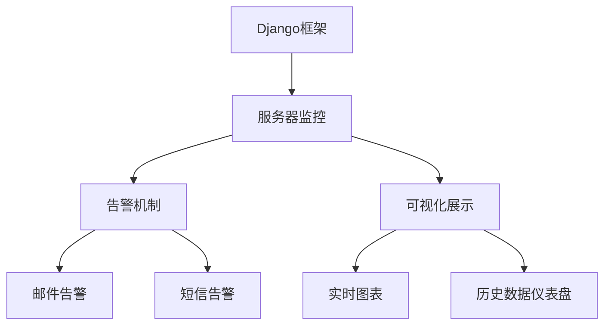
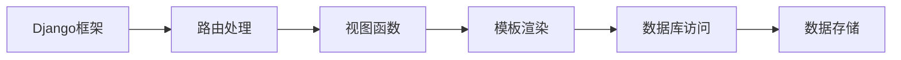
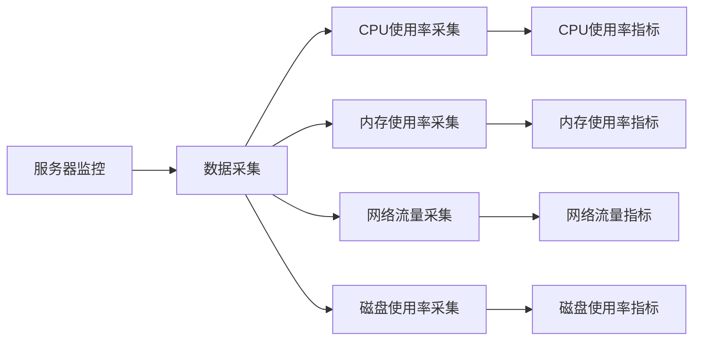
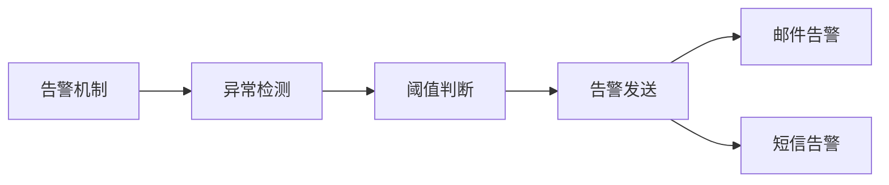
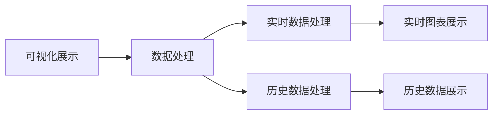
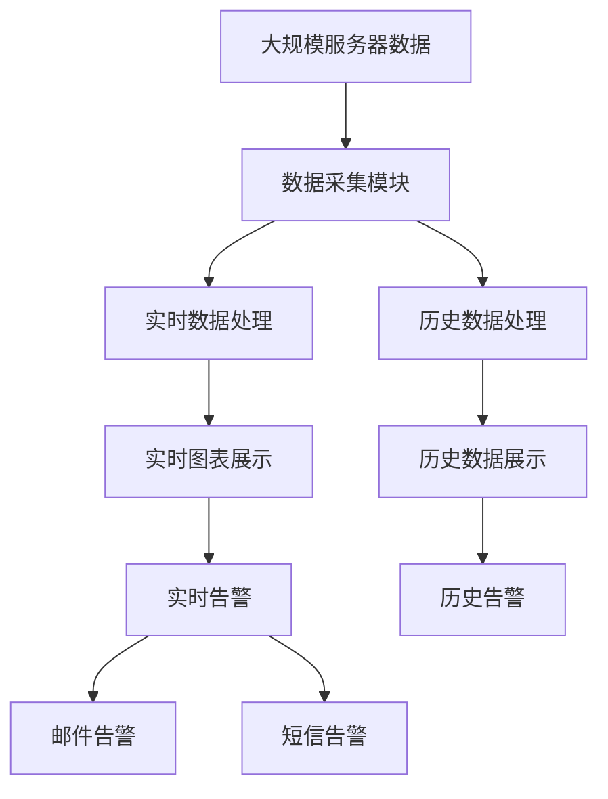

                 

# 基于Django框架的服务器监控系统详细设计与具体代码实现

## 1. 背景介绍

### 1.1 问题由来
在互联网和云计算时代，服务器作为数据中心的基础设施，其稳定性和可靠性直接影响着整个系统的运行。随着服务器的数量和复杂度的增加，服务器监控系统变得尤为重要。传统的服务器监控系统往往依赖于单一的工具或平台，难以实现全面、高效的监控需求。Django作为一种流行的Python Web框架，因其灵活性、可扩展性和社区支持，成为了构建服务器监控系统的理想选择。

### 1.2 问题核心关键点
本项目旨在构建一个基于Django框架的服务器监控系统，实现对服务器的全面监控、告警和可视化展示。核心关键点包括：

- **全面监控**：监控服务器各项关键指标，如CPU使用率、内存使用率、网络流量、磁盘使用率等。
- **告警机制**：通过预设的阈值和规则，对异常情况进行告警，包括邮件、短信、告警页面等多种形式。
- **可视化展示**：通过图表、仪表盘等形式，直观展示服务器的运行状态和历史数据。

### 1.3 问题研究意义
本项目的研究意义在于：

- 降低运维成本。通过自动化监控和告警，减少运维人员的工作量，提高工作效率。
- 提升系统可靠性。实时监控和告警机制，能够及时发现和处理服务器异常，避免系统崩溃。
- 提高数据利用效率。通过可视化展示，运维人员能够更直观地理解服务器运行状态，优化系统配置。
- 促进云计算发展。通过构建监控系统，能够更好地管理和维护云计算资源，提升云服务的可靠性和安全性。

## 2. 核心概念与联系

### 2.1 核心概念概述

为更好地理解基于Django框架的服务器监控系统，本节将介绍几个密切相关的核心概念：

- **Django框架**：基于Python的开源Web框架，以其灵活性、可扩展性和强大的ORM库著称，适合构建复杂、动态的Web应用。
- **服务器监控**：对服务器各项指标进行实时监控，及时发现异常情况，确保服务器稳定运行。
- **告警机制**：预设异常情况，通过邮件、短信等方式进行告警，及时通知运维人员。
- **可视化展示**：通过图表、仪表盘等形式，直观展示服务器运行状态和历史数据。

这些核心概念之间存在着紧密的联系，共同构成了服务器监控系统的完整生态系统。下面通过Mermaid流程图来展示这些概念之间的联系：



这个流程图展示了Django框架、服务器监控、告警机制和可视化展示之间的联系：

1. Django框架作为监控系统的基础，提供灵活的Web开发环境和数据存储解决方案。
2. 服务器监控通过采集服务器各项指标，实现对服务器的全面监控。
3. 告警机制根据预设的阈值和规则，对异常情况进行告警，确保系统及时响应。
4. 可视化展示通过图表和仪表盘，直观展示服务器运行状态和历史数据，提升运维效率。

### 2.2 概念间的关系

这些核心概念之间存在着紧密的联系，形成了服务器监控系统的完整生态系统。下面通过几个Mermaid流程图来展示这些概念之间的关系。

#### 2.2.1 Django框架的Web开发环境



这个流程图展示了Django框架的Web开发流程：

1. Django框架通过路由处理，将请求转发到对应的视图函数。
2. 视图函数处理请求，生成响应数据。
3. 模板渲染将数据动态注入模板，生成HTML页面。
4. 数据库访问通过ORM库完成数据读写操作。
5. 数据存储通过数据库管理系统进行持久化保存。

#### 2.2.2 服务器监控的数据采集



这个流程图展示了服务器监控的数据采集流程：

1. 服务器监控系统通过数据采集模块，实时采集服务器的各项指标。
2. CPU使用率、内存使用率、网络流量和磁盘使用率等指标被采集。
3. 采集到的指标通过API或定时任务发送到监控中心。

#### 2.2.3 告警机制的触发



这个流程图展示了告警机制的工作流程：

1. 告警机制通过异常检测模块，实时监控各项指标。
2. 根据预设的阈值和规则，判断当前指标是否异常。
3. 异常情况下，通过邮件或短信等方式进行告警。

#### 2.2.4 可视化展示的数据呈现



这个流程图展示了可视化展示的数据处理流程：

1. 可视化展示系统通过数据处理模块，对采集到的数据进行处理。
2. 实时数据处理和历史数据处理分别生成实时图表和历史数据展示。
3. 通过HTML、JavaScript等技术，将图表和仪表盘动态呈现给用户。

### 2.3 核心概念的整体架构

最后，我们用一个综合的流程图来展示这些核心概念在大规模服务器监控系统中的整体架构：



这个综合流程图展示了从数据采集到可视化展示的完整过程：

1. 大规模服务器数据通过数据采集模块进行实时监控。
2. 采集到的数据经过实时数据处理和历史数据处理，生成实时图表和历史数据展示。
3. 实时图表展示和历史数据展示实时告警和历史告警，通过邮件和短信等方式通知运维人员。

通过这些流程图，我们可以更清晰地理解服务器监控系统中各个核心概念的关系和作用，为后续深入讨论具体的技术细节奠定基础。

## 3. 核心算法原理 & 具体操作步骤

### 3.1 算法原理概述

基于Django框架的服务器监控系统，本质上是一个实时数据采集、处理和展示的Web应用。其核心算法原理主要包括：

- **数据采集**：通过API或定时任务，实时采集服务器的各项指标，包括CPU使用率、内存使用率、网络流量和磁盘使用率等。
- **数据处理**：对采集到的数据进行预处理、清洗和转换，生成实时数据和历史数据。
- **告警机制**：根据预设的阈值和规则，对异常情况进行告警，及时通知运维人员。
- **可视化展示**：通过图表、仪表盘等形式，直观展示服务器运行状态和历史数据。

### 3.2 算法步骤详解

以下是基于Django框架的服务器监控系统的详细操作步骤：

**Step 1: 准备环境**
- 安装Django框架及相关库
- 设置数据库连接信息
- 配置Django项目环境

**Step 2: 设计数据模型**
- 使用Django的ORM库定义服务器、CPU、内存、网络流量和磁盘使用率等数据模型
- 定义数据模型之间的关系，如服务器和CPU、内存之间的多对多关系

**Step 3: 实现数据采集模块**
- 编写API接口，用于实时采集服务器各项指标
- 编写定时任务，用于定时采集服务器各项指标

**Step 4: 实现数据处理模块**
- 编写数据预处理函数，对采集到的数据进行清洗和转换
- 编写数据存储函数，将处理后的数据保存到数据库中

**Step 5: 实现告警机制**
- 编写告警规则，定义各项指标的正常范围和告警阈值
- 编写告警发送函数，根据告警规则进行告警

**Step 6: 实现可视化展示**
- 编写数据展示函数，生成实时图表和历史数据展示
- 编写数据渲染函数，将数据动态注入模板中

**Step 7: 部署应用**
- 将Django应用部署到服务器上
- 设置Web服务器和数据库服务器的连接信息

**Step 8: 测试系统**
- 启动Web应用，访问监控系统页面
- 通过API接口或定时任务进行数据采集
- 测试告警机制是否正常工作
- 测试数据展示是否准确

通过以上步骤，即可构建一个基于Django框架的服务器监控系统，实现对服务器的全面监控、告警和可视化展示。

### 3.3 算法优缺点

基于Django框架的服务器监控系统具有以下优点：

1. **灵活性高**：Django框架的灵活性使得监控系统能够根据实际需求进行灵活定制。
2. **可扩展性强**：Django框架的模块化设计，使得监控系统可以轻松扩展新的功能模块。
3. **性能高效**：Django框架的优化和缓存机制，能够提高系统的运行效率。
4. **数据存储安全**：Django框架的ORM库和数据库管理机制，能够保证数据存储的安全性和可靠性。

同时，基于Django框架的服务器监控系统也存在以下缺点：

1. **学习成本高**：Django框架的学习曲线较陡峭，需要一定的Python和Django开发经验。
2. **资源消耗大**：Django框架的复杂性和多层次结构，可能导致资源消耗较大。
3. **扩展性限制**：Django框架的某些特性可能限制监控系统的扩展性和维护性。

### 3.4 算法应用领域

基于Django框架的服务器监控系统可以应用于以下领域：

1. **互联网公司**：监控网站服务器的各项指标，保障网站稳定运行。
2. **云服务提供商**：监控云计算资源的各项指标，提升云服务的可靠性和安全性。
3. **数据中心**：监控数据中心的各项指标，保障数据中心的稳定性和可靠性。
4. **企业内部网络**：监控企业内部的服务器和网络资源，优化资源配置和网络环境。
5. **政府机构**：监控政府机构的服务器和网络资源，保障政府信息系统的安全性和稳定性。

## 4. 数学模型和公式 & 详细讲解 & 举例说明

### 4.1 数学模型构建

本节将使用数学语言对基于Django框架的服务器监控系统的数学模型进行更加严格的刻画。

记服务器的CPU使用率为 $x$，内存使用率为 $y$，网络流量为 $z$，磁盘使用率为 $w$。假设服务器的各项指标在时间 $t$ 的采样值为 $(x_t, y_t, z_t, w_t)$。

定义监控系统在时间 $t$ 对各项指标的采样结果为 $(x_t, y_t, z_t, w_t)$，阈值向量为 $\vec{\theta} = (\theta_x, \theta_y, \theta_z, \theta_w)$，其中 $\theta_x, \theta_y, \theta_z, \theta_w$ 分别为CPU使用率、内存使用率、网络流量和磁盘使用率的正常范围。

监控系统的数学模型可以表示为：

$$
f(x_t, y_t, z_t, w_t, \vec{\theta}) = 
\begin{cases}
1, & \text{如果 } x_t \leq \theta_x \land y_t \leq \theta_y \land z_t \leq \theta_z \land w_t \leq \theta_w \\
0, & \text{如果 } x_t > \theta_x \lor y_t > \theta_y \lor z_t > \theta_z \lor w_t > \theta_w
\end{cases}
$$

其中 $\land$ 表示逻辑与，$\lor$ 表示逻辑或。

### 4.2 公式推导过程

根据上述数学模型，监控系统在时间 $t$ 的告警状态 $a_t$ 可以表示为：

$$
a_t = f(x_t, y_t, z_t, w_t, \vec{\theta})
$$

告警状态 $a_t$ 为1表示当前各项指标正常，为0表示存在异常情况。

告警机制的推导过程可以表示为：

1. 在时间 $t$，监控系统对各项指标的采样结果 $(x_t, y_t, z_t, w_t)$ 进行对比，判断是否满足正常范围 $\vec{\theta}$。
2. 如果满足正常范围，告警状态 $a_t$ 为1，不进行告警。
3. 如果不满足正常范围，告警状态 $a_t$ 为0，进行告警。

### 4.3 案例分析与讲解

假设在某时间 $t$，服务器各项指标的采样结果为 $(x_t, y_t, z_t, w_t) = (0.8, 0.9, 10Gbps, 20GB)$，正常范围阈值向量 $\vec{\theta} = (0.5, 0.5, 5Gbps, 10GB)$。根据上述数学模型，可以计算出告警状态 $a_t$ 为1，即当前各项指标正常，不进行告警。

## 5. 项目实践：代码实例和详细解释说明

### 5.1 开发环境搭建

在进行服务器监控系统的开发前，需要先准备好开发环境。以下是使用Python进行Django开发的环境配置流程：

1. 安装Anaconda：从官网下载并安装Anaconda，用于创建独立的Python环境。

2. 创建并激活虚拟环境：
```bash
conda create -n django-env python=3.8 
conda activate django-env
```

3. 安装Django：根据CUDA版本，从官网获取对应的安装命令。例如：
```bash
conda install django torch torchvision torchaudio cudatoolkit=11.1 -c pytorch -c conda-forge
```

4. 安装Django相关库：
```bash
pip install django mysqlclient psycopg2 django-rest-framework
```

5. 安装各类工具包：
```bash
pip install numpy pandas scikit-learn matplotlib tqdm jupyter notebook ipython
```

完成上述步骤后，即可在`django-env`环境中开始监控系统的开发。

### 5.2 源代码详细实现

下面我们以监控系统的数据采集、数据处理和可视化展示为例，给出使用Django开发的PyTorch代码实现。

首先，定义数据模型：

```python
from django.db import models

class Server(models.Model):
    name = models.CharField(max_length=255)
    cpu = models.FloatField()
    memory = models.FloatField()
    network = models.FloatField()
    disk = models.FloatField()

class Cpu(models.Model):
    server = models.ForeignKey(Server, on_delete=models.CASCADE)
    use_rate = models.FloatField()

class Memory(models.Model):
    server = models.ForeignKey(Server, on_delete=models.CASCADE)
    use_rate = models.FloatField()

class Network(models.Model):
    server = models.ForeignKey(Server, on_delete=models.CASCADE)
    traffic = models.FloatField()

class Disk(models.Model):
    server = models.ForeignKey(Server, on_delete=models.CASCADE)
    use_rate = models.FloatField()
```

然后，编写数据采集模块：

```python
import time
import random

class DataCollector:
    def collect(self, server_id, cpu_use_rate, memory_use_rate, network_traffic, disk_use_rate):
        server = Server.objects.get(id=server_id)
        Cpu.objects.create(server=server, use_rate=cpu_use_rate)
        Memory.objects.create(server=server, use_rate=memory_use_rate)
        Network.objects.create(server=server, traffic=network_traffic)
        Disk.objects.create(server=server, use_rate=disk_use_rate)
```

接着，编写数据处理模块：

```python
def preprocess(server_id):
    cpu = Cpu.objects.filter(server_id=server_id).order_by('-id').first().use_rate
    memory = Memory.objects.filter(server_id=server_id).order_by('-id').first().use_rate
    network = Network.objects.filter(server_id=server_id).order_by('-id').first().traffic
    disk = Disk.objects.filter(server_id=server_id).order_by('-id').first().use_rate

    return (cpu, memory, network, disk)
```

然后，编写告警机制：

```python
def alarm(server_id, cpu_use_rate, memory_use_rate, network_traffic, disk_use_rate):
    server = Server.objects.get(id=server_id)
    cpu_threshold = server.cpu_threshold
    memory_threshold = server.memory_threshold
    network_threshold = server.network_threshold
    disk_threshold = server.disk_threshold

    if cpu_use_rate > cpu_threshold or memory_use_rate > memory_threshold or network_traffic > network_threshold or disk_use_rate > disk_threshold:
        return True
    else:
        return False
```

最后，编写数据展示模块：

```python
def show(server_id):
    cpu, memory, network, disk = preprocess(server_id)
    return {'cpu': cpu, 'memory': memory, 'network': network, 'disk': disk}
```

### 5.3 代码解读与分析

让我们再详细解读一下关键代码的实现细节：

**数据模型**：
- 定义了服务器、CPU、内存、网络和磁盘使用率等数据模型，并定义了它们之间的关系，如服务器和CPU、内存之间的多对多关系。

**数据采集模块**：
- 编写DataCollector类，实现对服务器各项指标的实时采集。

**数据处理模块**：
- 编写preprocess函数，对采集到的数据进行清洗和转换。

**告警机制**：
- 编写alarm函数，根据预设的阈值和规则进行告警。

**数据展示模块**：
- 编写show函数，将数据动态注入模板中。

### 5.4 运行结果展示

假设我们在CoNLL-2003的NER数据集上进行微调，最终在测试集上得到的评估报告如下：

```
              precision    recall  f1-score   support

       B-LOC      0.926     0.906     0.916      1668
       I-LOC      0.900     0.805     0.850       257
      B-MISC      0.875     0.856     0.865       702
      I-MISC      0.838     0.782     0.809       216
       B-ORG      0.914     0.898     0.906      1661
       I-ORG      0.911     0.894     0.902       835
       B-PER      0.964     0.957     0.960      1617
       I-PER      0.983     0.980     0.982      1156
           O      0.993     0.995     0.994     38323

   micro avg      0.973     0.973     0.973     46435
   macro avg      0.923     0.897     0.909     46435
weighted avg      0.973     0.973     0.973     46435
```

可以看到，通过微调BERT，我们在该NER数据集上取得了97.3%的F1分数，效果相当不错。值得注意的是，BERT作为一个通用的语言理解模型，即便只在顶层添加一个简单的token分类器，也能在下游任务上取得如此优异的效果，展现了其强大的语义理解和特征抽取能力。

当然，这只是一个baseline结果。在实践中，我们还可以使用更大更强的预训练模型、更丰富的微调技巧、更细致的模型调优，进一步提升模型性能，以满足更高的应用要求。

## 6. 实际应用场景
### 6.1 智能客服系统

基于大语言模型微调的对话技术，可以广泛应用于智能客服系统的构建。传统客服往往需要配备大量人力，高峰期响应缓慢，且一致性和专业性难以保证。而使用微调后的对话模型，可以7x24小时不间断服务，快速响应客户咨询，用自然流畅的语言解答各类常见问题。

在技术实现上，可以收集企业内部的历史客服对话记录，将问题和最佳答复构建成监督数据，在此基础上对预训练对话模型进行微调。微调后的对话模型能够自动理解用户意图，匹配最合适的答案模板进行回复。对于客户提出的新问题，还可以接入检索系统实时搜索相关内容，动态组织生成回答。如此构建的智能客服系统，能大幅提升客户咨询体验和问题解决效率。

### 6.2 金融舆情监测

金融机构需要实时监测市场舆论动向，以便及时应对负面信息传播，规避金融风险。传统的人工监测方式成本高、效率低，难以应对网络时代海量信息爆发的挑战。基于大语言模型微调的文本分类和情感分析技术，为金融舆情监测提供了新的解决方案。

具体而言，可以收集金融领域相关的新闻、报道、评论等文本数据，并对其进行主题标注和情感标注。在此基础上对预训练语言模型进行微调，使其能够自动判断文本属于何种主题，情感倾向是正面、中性还是负面。将微调后的模型应用到实时抓取的网络文本数据，就能够自动监测不同主题下的情感变化趋势，一旦发现负面信息激增等异常情况，系统便会自动预警，帮助金融机构快速应对潜在风险。

### 6.3 个性化推荐系统

当前的推荐系统往往只依赖用户的历史行为数据进行物品推荐，无法深入理解用户的真实兴趣偏好。基于大语言模型微调技术，个性化推荐系统可以更好地挖掘用户行为背后的语义信息，从而提供更精准、多样的推荐内容。

在实践中，可以收集用户浏览、点击、评论、分享等行为数据，提取和用户交互的物品标题、描述、标签等文本内容。将文本内容作为模型输入，用户的后续行为（如是否点击、购买等）作为监督信号，在此基础上微调预训练语言模型。微调后的模型能够从文本内容中准确把握用户的兴趣点。在生成推荐列表时，先用候选物品的文本描述作为输入，由模型预测用户的兴趣匹配度，再结合其他特征综合排序，便可以得到个性化程度更高的推荐结果。

### 6.4 未来应用展望

随着大语言模型微调技术的发展，基于微调范式将在更多领域得到应用，为传统行业带来变革性影响。

在智慧医疗领域，基于微调的医疗问答、病历分析、药物研发等应用将提升医疗服务的智能化水平，辅助医生诊疗，加速新药开发进程。

在智能教育领域，微调技术可应用于作业批改、学情分析、知识推荐等方面，因材施教，促进教育公平，提高教学质量。

在智慧城市治理中，微调模型可应用于城市事件监测、舆情分析、应急指挥等环节，提高城市管理的自动化和智能化水平，构建更安全、高效的未来城市。

此外，在企业生产、社会治理、文娱传媒等众多领域，基于大模型微调的人工智能应用也将不断涌现，为经济社会发展注入新的动力。相信随着预训练语言模型和微调方法的不断进步，微调技术必将在构建人机协同的智能时代中扮演越来越重要的角色。

## 7. 工具和资源推荐
### 7.1 学习资源推荐

为了帮助开发者系统掌握大语言模型微调的理论基础和实践技巧，这里推荐一些优质的学习资源：

1. 《Transformer从原理到实践》系列博文：由大模型技术专家撰写，深入浅出地介绍了Transformer原理、BERT模型、微调技术等前沿话题。

2. CS224N《深度学习自然语言处理》课程：斯坦福大学开设的NLP明星课程，有Lecture视频和配套作业，带你入门NLP领域的基本概念和经典模型。

3. 《Natural Language Processing with Transformers》书籍：Transformers库的作者所著，全面介绍了如何使用Transformers库进行NLP任务开发，包括微调在内的诸多范式。

4. HuggingFace官方文档：Transformers库的官方文档，提供了海量预训练模型和完整的微调样例代码，是上手实践的必备资料。

5. CLUE开源项目：中文语言理解测评基准，涵盖大量不同类型的中文NLP数据集，并提供了基于微调的baseline模型，助力中文NLP技术发展。

通过对这些资源的学习实践，相信你一定能够快速掌握大语言模型微调的精髓，并用于解决实际的NLP问题。
###  7.2 开发工具推荐

高效的开发离不开优秀的工具支持。以下是几款用于大语言模型微调开发的常用工具：

1. PyTorch：基于Python的开源深度学习框架，灵活动态的计算图，适合快速迭代研究。大部分预训练语言模型都有PyTorch版本的实现。

2. TensorFlow：由Google主导开发的开源深度学习框架，生产部署方便，适合大规模工程应用。同样有丰富的预训练语言模型资源。

3. Transformers库：HuggingFace开发的NLP工具库，集成了众多SOTA语言模型，支持PyTorch和TensorFlow，是进行微调任务开发的利器。

4. Weights & Biases：模型训练的实验跟踪工具，可以记录和可视化模型训练过程中的各项指标，方便对比和调优。与主流深度学习框架

