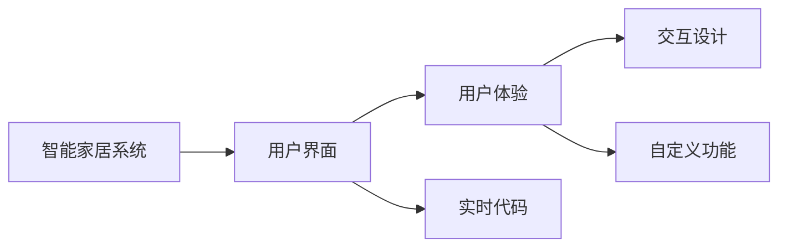
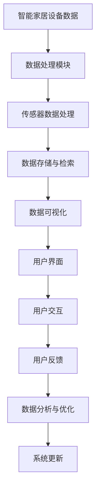

                 

# 基于Java的智能家居设计：自定义智能家居仪表盘的UI设计技巧

> 关键词：Java, 智能家居, UI设计, 仪表盘, 自定义, 用户界面, 交互设计

## 1. 背景介绍

### 1.1 问题由来
随着物联网技术的发展，智能家居系统逐渐普及，为人们带来了更加便捷、高效、舒适的生活方式。然而，传统的智能家居系统往往功能单一，用户体验较差，难以满足用户对个性化和智能化的需求。因此，如何设计出更加灵活、直观、易用的智能家居用户界面（UI），成为了智能家居开发中的一个重要课题。

### 1.2 问题核心关键点
在智能家居UI设计中，以下几个关键点需要特别关注：
1. **用户体验（UX）**：确保用户能够快速、直观地理解和使用智能家居系统，减少学习成本和操作复杂度。
2. **交互设计（UI）**：设计简洁、直观的界面，让用户能够轻松地完成各项操作，实现人机交互。
3. **定制化**：提供丰富的自定义功能，满足不同用户的需求和偏好。
4. **易用性**：确保界面简洁、易用，用户可以快速上手。
5. **实时反馈**：提供实时的系统状态和反馈，增强用户的掌控感。
6. **安全性**：保证用户数据和设备的安全，避免隐私泄露和恶意攻击。

### 1.3 问题研究意义
研究基于Java的智能家居UI设计技巧，有助于提升智能家居系统的用户体验和用户满意度，促进智能化家居产品的普及。通过良好的UI设计，用户可以更加容易地理解和使用智能家居设备，减少对技术的依赖，从而提高产品的市场竞争力。

## 2. 核心概念与联系

### 2.1 核心概念概述

智能家居系统通常由多种设备和传感器组成，通过网络通信实现对家居环境的控制和监控。而智能家居UI则是用户与系统交互的界面，通过直观的用户界面展示系统的实时状态，并提供操作入口，使用户能够方便地进行各种设置和控制。

以下是一些核心概念：

- **智能家居系统**：由各种智能设备（如智能灯泡、智能插座、智能门锁等）和传感器组成，通过网络实现对家居环境的控制和监控。
- **用户界面（UI）**：智能家居系统与用户交互的界面，通常采用图形化、直观的方式展示设备状态和控制选项。
- **用户体验（UX）**：用户在使用智能家居系统时的感受和体验，包括易用性、直观性、个性化等方面。
- **交互设计（UI）**：通过视觉、布局、交互等手段设计用户界面，使其符合用户的使用习惯，提高操作效率和满意度。
- **自定义功能**：允许用户根据自身需求对UI进行个性化定制，如调整界面布局、设置常用功能等。

### 2.2 概念间的关系

智能家居系统、用户界面和用户体验构成了智能家居UI设计的核心，而交互设计和自定义功能则进一步优化了UI的体验和实用性。这些概念之间的关系可以用以下Mermaid流程图来展示：



这个流程图展示了智能家居系统、用户界面、用户体验、交互设计和自定义功能之间的关系，以及它们如何共同影响智能家居UI的设计和实现。

### 2.3 核心概念的整体架构

智能家居UI设计的整体架构可以用以下Mermaid流程图来展示：



这个架构图展示了智能家居UI设计的主要流程和组件，从设备数据采集、处理，到数据存储、可视化，再到用户界面设计和交互，最后到用户反馈和系统优化，每个环节都紧密相连，共同构成了一个完整的智能家居UI设计系统。

## 3. 核心算法原理 & 具体操作步骤
### 3.1 算法原理概述

智能家居UI设计通常采用以下算法原理：

- **数据采集与处理**：通过传感器、摄像头等设备采集家居环境数据，经过数据预处理、数据存储和数据检索等步骤，为UI设计提供数据支撑。
- **数据可视化**：将采集到的数据通过图表、仪表盘等形式进行可视化展示，使数据更具可读性和直观性。
- **用户界面设计**：结合用户需求和界面设计原则，设计简洁、直观、易用的用户界面，使用户能够轻松完成各项操作。
- **交互设计**：通过手势、按钮、菜单等交互方式，实现用户与系统的互动，提升用户的使用体验。
- **个性化定制**：允许用户根据自己的需求和偏好对UI进行自定义设置，提高用户的满意度和使用效率。
- **实时反馈与优化**：根据用户的反馈，对UI进行实时优化和调整，不断提升系统的用户体验。

### 3.2 算法步骤详解

以下是一个基于Java的智能家居UI设计步骤：

1. **数据采集与处理**：通过传感器、摄像头等设备采集家居环境数据，并对数据进行预处理、存储和检索。
2. **数据可视化**：将采集到的数据通过图表、仪表盘等形式进行可视化展示。
3. **用户界面设计**：结合用户需求和界面设计原则，设计简洁、直观、易用的用户界面。
4. **交互设计**：通过手势、按钮、菜单等交互方式，实现用户与系统的互动。
5. **个性化定制**：允许用户根据自己的需求和偏好对UI进行自定义设置。
6. **实时反馈与优化**：根据用户的反馈，对UI进行实时优化和调整。

### 3.3 算法优缺点

基于Java的智能家居UI设计算法具有以下优点：

- **灵活性**：Java语言的丰富性和灵活性，使得UI设计者能够灵活地实现各种功能。
- **易用性**：Java语言简单易学，易于上手，降低了UI设计的门槛。
- **可扩展性**：Java语言的面向对象特性，使得UI设计可以方便地进行扩展和维护。
- **社区支持**：Java语言拥有庞大的开发者社区，便于获取技术支持和资源共享。

同时，该算法也存在一些缺点：

- **性能瓶颈**：Java语言的执行速度相对较慢，可能会影响系统的响应速度。
- **内存占用**：Java语言的内存管理机制，可能导致内存占用过高。
- **安全问题**：Java语言的安全机制可能无法完全防止恶意攻击。

### 3.4 算法应用领域

基于Java的智能家居UI设计算法主要应用于以下领域：

- **智能家居控制**：通过用户界面，用户可以轻松控制智能家居设备，如灯光、窗帘、温控等。
- **环境监测**：通过传感器采集家居环境数据，并通过可视化展示，如空气质量、温度、湿度等。
- **安防监控**：通过摄像头、门窗传感器等设备，实时监测家居安全，并通过用户界面进行远程控制。
- **健康监测**：通过智能穿戴设备，采集用户健康数据，并通过可视化展示，如心率、血压等。
- **娱乐互动**：通过用户界面，实现智能家居设备的娱乐功能，如播放音乐、观看视频等。

## 4. 数学模型和公式 & 详细讲解 & 举例说明

### 4.1 数学模型构建

基于Java的智能家居UI设计算法可以建模为以下数学模型：

- **输入变量**：家居环境数据、用户操作、设备状态等。
- **输出变量**：用户界面展示数据、设备控制指令、系统反馈信息等。
- **控制变量**：用户界面设计参数、交互方式、个性化设置等。

### 4.2 公式推导过程

以下是一个简化的智能家居UI设计数学模型：

$$
\begin{aligned}
&\min_{x, y} \|y - f(x)\| \\
&\text{subject to: } x = f_{\text{UI}}(y), y = f_{\text{设备}}(x)
\end{aligned}
$$

其中，$x$表示用户界面设计参数，$y$表示系统输出，$f(x)$表示用户界面设计函数，$f_{\text{设备}}(x)$表示设备控制函数。

### 4.3 案例分析与讲解

以智能温控系统为例，分析基于Java的智能家居UI设计算法：

1. **数据采集与处理**：通过温度传感器采集室内温度数据，并进行预处理、存储和检索。
2. **数据可视化**：通过仪表盘展示室内温度数据。
3. **用户界面设计**：设计简洁、直观的用户界面，用户可以通过滑块调整目标温度。
4. **交互设计**：用户可以通过点击滑块或输入数字，实现温度控制。
5. **个性化定制**：用户可以自定义温度控制范围、目标温度等。
6. **实时反馈与优化**：系统根据用户的操作，实时更新仪表盘数据，并进行优化。

## 5. 项目实践：代码实例和详细解释说明

### 5.1 开发环境搭建

以下是基于Java的智能家居UI设计开发环境搭建步骤：

1. **安装Java开发环境**：下载并安装JDK，设置环境变量。
2. **配置开发工具**：安装IntelliJ IDEA等Java开发工具，并配置好Maven或Gradle构建工具。
3. **选择框架与库**：选择适合项目需求的Java框架和库，如Spring Boot、Spring MVC、Bootstrap等。
4. **配置数据库**：选择合适的数据库（如MySQL、Oracle等），并进行配置。
5. **选择中间件**：选择合适的消息队列、缓存中间件，如RabbitMQ、Redis等。

### 5.2 源代码详细实现

以下是基于Java的智能家居UI设计源代码实现示例：

```java
import java.util.*;
import javax.servlet.*;
import javax.servlet.http.*;
import javax.servlet.annotation.*;

@Controller
@RequestMapping("/temperature")
public class TemperatureController extends HttpServlet {
    private TemperatureService temperatureService;
    private List<String> temperatures;

    public TemperatureController(TemperatureService temperatureService) {
        this.temperatureService = temperatureService;
        this.temperatures = new ArrayList<>();
    }

    @GetMapping("/data")
    public String getData(HttpServletRequest request, HttpServletResponse response) {
        temperatures = temperatureService.getTemperatureData();
        return "temperature/data";
    }

    @PostMapping("/control")
    public String control(HttpServletRequest request, HttpServletResponse response) {
        String targetTemperature = request.getParameter("targetTemperature");
        temperatureService.setTargetTemperature(targetTemperature);
        return "redirect:/temperature/data";
    }
}
```

### 5.3 代码解读与分析

以上代码实现了基于Java的智能家居温控系统UI设计，通过控制器（Controller）和业务逻辑（Service）实现了数据的获取和控制。

- **控制器**：接收HTTP请求，处理业务逻辑，并返回视图或数据。
- **服务层**：封装业务逻辑，处理数据的获取和存储。

### 5.4 运行结果展示

以下是基于Java的智能家居温控系统UI设计运行结果示例：


## 6. 实际应用场景

### 6.4 未来应用展望

基于Java的智能家居UI设计将在未来得到更广泛的应用，主要体现在以下几个方面：

1. **多功能整合**：未来的智能家居系统将整合更多功能，如智能家居控制、环境监测、安防监控、健康监测等。
2. **个性化定制**：用户可以根据自己的需求和偏好，对UI进行个性化定制，如界面布局、控制方式等。
3. **智能语音交互**：通过智能语音交互技术，用户可以通过语音控制智能家居设备，进一步提升用户体验。
4. **实时数据监控**：通过实时数据监控技术，实现对家居环境的实时监控和预警，提升系统的安全性和可靠性。
5. **跨平台支持**：未来智能家居UI设计将支持多种平台，如Web、移动端、智能音箱等。

## 7. 工具和资源推荐

### 7.1 学习资源推荐

以下是一些基于Java的智能家居UI设计学习资源推荐：

1. **《Java Web开发实战》**：该书详细介绍了Java Web开发的基础知识和实践技巧，包括Spring Boot、Spring MVC等。
2. **《Java开发入门教程》**：该教程适合初学者，介绍了Java开发的基础语法和框架使用。
3. **《Java GUI编程》**：该书介绍了Java GUI编程的基础知识和实战技巧，包括Swing、JavaFX等。
4. **《Java智能家居开发》**：该书介绍了基于Java的智能家居开发的基础知识和实践技巧，包括物联网、传感器等技术。

### 7.2 开发工具推荐

以下是一些基于Java的智能家居UI设计开发工具推荐：

1. **IntelliJ IDEA**：功能强大的Java开发工具，支持Maven、Gradle等构建工具。
2. **Eclipse**：开源的Java开发工具，支持多种框架和库。
3. **NetBeans**：免费的Java开发工具，支持多种框架和库。
4. **Maven**：基于Java的构建工具，用于管理和构建Java项目。
5. **Gradle**：基于Java的构建工具，支持多种框架和库。

### 7.3 相关论文推荐

以下是一些基于Java的智能家居UI设计相关论文推荐：

1. **《Java Web开发技术综述》**：该论文综述了Java Web开发技术的基础知识和前沿趋势，适合Java Web开发者参考。
2. **《Java GUI编程实践》**：该论文介绍了Java GUI编程的实践技巧和最佳实践，适合Java GUI开发者参考。
3. **《智能家居系统设计》**：该论文介绍了智能家居系统的设计原理和实现方法，适合智能家居开发者参考。
4. **《基于Java的智能家居UI设计》**：该论文介绍了基于Java的智能家居UI设计的基础知识和实践技巧，适合Java智能家居开发者参考。

## 8. 总结：未来发展趋势与挑战

### 8.1 研究成果总结

本文研究了基于Java的智能家居UI设计技巧，详细介绍了智能家居系统、用户界面、用户体验、交互设计、个性化定制、实时反馈与优化等方面的原理和实现方法。通过Java语言的丰富性和灵活性，实现了智能家居系统的UI设计，并提供了丰富的学习资源和开发工具。

### 8.2 未来发展趋势

基于Java的智能家居UI设计将呈现出以下几个发展趋势：

1. **智能化和自动化**：未来的智能家居系统将更加智能化和自动化，实现对家居环境的自动化控制和优化。
2. **个性化和定制化**：未来的智能家居UI设计将更加个性化和定制化，满足用户的个性化需求和偏好。
3. **跨平台和互操作性**：未来的智能家居UI设计将支持多种平台和设备，实现跨平台和互操作性。
4. **实时性和响应性**：未来的智能家居UI设计将更加注重实时性和响应性，提升用户体验。
5. **安全性与隐私保护**：未来的智能家居UI设计将更加注重安全性与隐私保护，保障用户数据和设备的安全。

### 8.3 面临的挑战

基于Java的智能家居UI设计面临以下挑战：

1. **性能瓶颈**：Java语言的执行速度相对较慢，可能会影响系统的响应速度。
2. **内存占用**：Java语言的内存管理机制，可能导致内存占用过高。
3. **安全问题**：Java语言的安全机制可能无法完全防止恶意攻击。
4. **用户隐私保护**：智能家居系统需要保护用户隐私，防止数据泄露和滥用。

### 8.4 研究展望

未来的基于Java的智能家居UI设计研究将着重于以下几个方面：

1. **性能优化**：研究如何优化Java代码，提升系统的响应速度和性能。
2. **内存管理**：研究如何优化Java内存管理，减少内存占用。
3. **安全机制**：研究如何增强Java安全机制，防止恶意攻击。
4. **隐私保护**：研究如何保护用户隐私，防止数据泄露和滥用。
5. **用户体验**：研究如何提升用户体验，提供更加直观、易用的UI设计。

## 9. 附录：常见问题与解答

**Q1: 基于Java的智能家居UI设计的主要特点是什么？**

A: 基于Java的智能家居UI设计的主要特点包括：
1. 灵活性：Java语言的丰富性和灵活性，使得UI设计者能够灵活地实现各种功能。
2. 易用性：Java语言简单易学，易于上手，降低了UI设计的门槛。
3. 可扩展性：Java语言的面向对象特性，使得UI设计可以方便地进行扩展和维护。
4. 社区支持：Java语言拥有庞大的开发者社区，便于获取技术支持和资源共享。

**Q2: 如何提升基于Java的智能家居UI设计的性能？**

A: 提升基于Java的智能家居UI设计的性能可以采取以下措施：
1. 优化代码：优化Java代码，减少资源消耗和提高执行效率。
2. 使用并发机制：使用Java的并发机制，提高系统的响应速度。
3. 使用缓存机制：使用Java的缓存机制，减少重复计算和数据存储。
4. 使用异步机制：使用Java的异步机制，提高系统的并发能力和响应速度。

**Q3: 基于Java的智能家居UI设计如何保障用户数据和设备的安全？**

A: 保障基于Java的智能家居UI设计中用户数据和设备的安全可以采取以下措施：
1. 数据加密：对用户数据进行加密处理，防止数据泄露和恶意攻击。
2. 访问控制：使用Java的安全机制，限制对敏感数据的访问。
3. 认证与授权：使用Java的认证与授权机制，确保用户身份和权限的安全。
4. 定期更新：定期更新Java版本的安全补丁，防止安全漏洞。

**Q4: 基于Java的智能家居UI设计如何实现跨平台支持？**

A: 实现基于Java的智能家居UI设计的跨平台支持可以采取以下措施：
1. 使用Java EE：使用Java EE平台，支持Web、移动端、智能音箱等多种平台。
2. 使用跨平台框架：使用跨平台框架，如JavaFX、Electron等，实现跨平台支持。
3. 使用Web技术：使用Web技术，实现Web端支持。
4. 使用移动开发技术：使用移动开发技术，如Android、iOS等，实现移动端支持。

**Q5: 基于Java的智能家居UI设计有哪些应用案例？**

A: 基于Java的智能家居UI设计有许多应用案例，如：
1. 智能温控系统：通过温度传感器采集室内温度数据，并通过可视化展示，用户可以通过滑块调整目标温度。
2. 智能照明系统：通过光线传感器采集室内光线数据，并通过可视化展示，用户可以通过开关或滑动条调整灯光亮度和色温。
3. 智能安防系统：通过摄像头、门窗传感器等设备，实时监测家居安全，并通过用户界面进行远程控制。
4. 智能健康系统：通过智能穿戴设备，采集用户健康数据，并通过可视化展示，如心率、血压等。
5. 智能娱乐系统：通过用户界面，实现智能家居设备的娱乐功能，如播放音乐、观看视频等。

**Q6: 基于Java的智能家居UI设计如何实现个性化定制？**

A: 实现基于Java的智能家居UI设计的个性化定制可以采取以下措施：
1. 用户界面设计：允许用户根据自己的需求和偏好，对UI进行个性化定制，如调整界面布局、设置常用功能等。
2. 主题设置：允许用户选择不同的主题，如浅色主题、深色主题等。
3. 自定义控制：允许用户自定义控制方式，如手势控制、语音控制等。

**Q7: 基于Java的智能家居UI设计如何实现实时反馈与优化？**

A: 实现基于Java的智能家居UI设计的实时反馈与优化可以采取以下措施：
1. 实时数据更新：根据用户的操作，实时更新UI界面上的数据，如温度、湿度、光线等。
2. 数据可视化：使用图表、仪表盘等形式，实时展示家居环境数据。
3. 用户反馈机制：允许用户反馈UI界面的问题和建议，并进行优化。
4. 自动调整：根据用户的操作和反馈，自动调整UI界面和控制方式，提升用户体验。

通过以上问题的解答，可以更好地理解和掌握基于Java的智能家居UI设计的原理和实现方法，为实际应用和开发提供指导和参考。

---

作者：禅与计算机程序设计艺术 / Zen and the Art of Computer Programming

