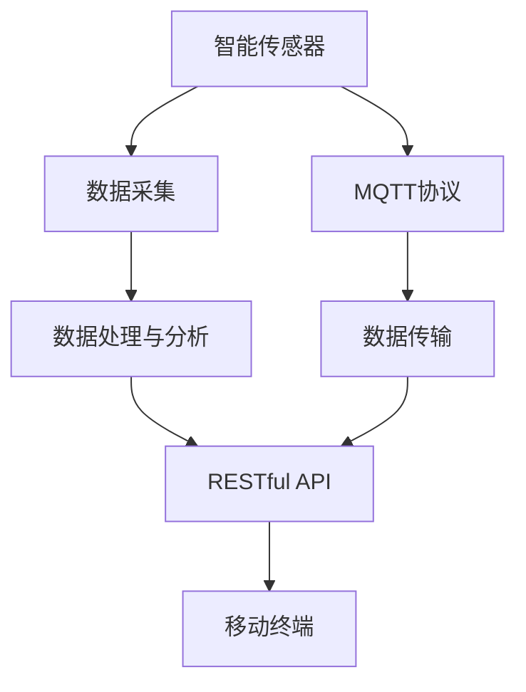
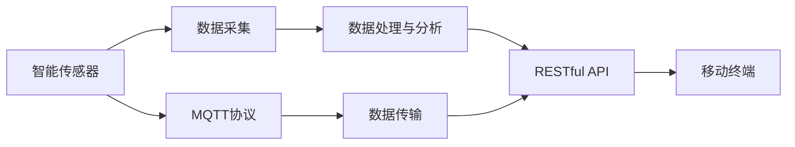
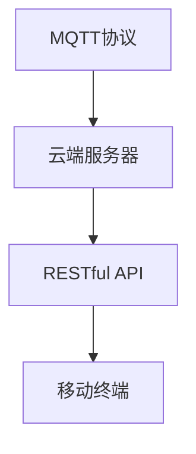
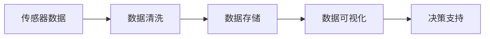

                 

# 基于MQTT协议和RESTful API的宠物护理智能家居解决方案

## 1. 背景介绍

近年来，物联网技术迅速发展，智能家居系统成为家庭生活中不可或缺的一部分。宠物作为家庭成员的重要部分，其养护问题同样值得关注。本论文旨在基于MQTT协议和RESTful API构建一套宠物护理智能家居解决方案，利用物联网技术，通过智能传感器、监控摄像头、移动终端等设备，实现对宠物的实时监控与护理，提升宠物的生活质量，同时减轻主人的养护负担。

### 1.1 问题由来
传统宠物养护方法往往依赖人力，如定期喂食、清洁、健康监测等，耗费大量时间和精力。随着物联网技术的发展，智能家居系统逐渐普及，为宠物护理带来新的可能性。如何通过智能家居设备实现宠物的自动喂食、清洁、健康监测，同时通过移动终端实时监控宠物的状态，成为当前研究的热点问题。

### 1.2 问题核心关键点
本研究聚焦于如何构建一套基于MQTT协议和RESTful API的宠物护理智能家居解决方案，核心在于通过物联网设备实时监控宠物的状态，并根据宠物的需求自动提供相应的护理服务。具体来说，研究包括以下几个关键点：
- MQTT协议：一种轻量级、低带宽占用的消息传递协议，适用于设备间的小数据传输。
- RESTful API：一种基于HTTP协议的接口设计风格，易于使用和扩展。
- 智能传感器：通过各类传感器实时监测宠物的健康状态和行为模式。
- 移动终端：利用移动设备实现对宠物的远程监控和管理。
- 数据处理与分析：对采集到的数据进行处理与分析，提取有用信息。

## 2. 核心概念与联系

### 2.1 核心概念概述

为更好地理解基于MQTT协议和RESTful API的宠物护理智能家居解决方案，本节将介绍几个密切相关的核心概念：

- MQTT协议：一种轻量级、低带宽占用的消息传递协议，适用于设备间的小数据传输，特别适用于物联网设备的数据交互。
- RESTful API：一种基于HTTP协议的接口设计风格，易于使用和扩展，支持各种编程语言和平台。
- 智能传感器：能够实时监测环境参数或对象行为的各类传感器，如温度、湿度、重量、声音、运动等。
- 移动终端：如智能手机、平板电脑等移动设备，用于远程监控和管理宠物。
- 数据处理与分析：对采集到的数据进行清洗、处理和分析，提取有用信息，支持决策支持。

这些核心概念之间的逻辑关系可以通过以下Mermaid流程图来展示：



这个流程图展示了大语言模型微调过程中各个核心概念的关系和作用：

1. 智能传感器采集宠物的相关数据，通过MQTT协议发送到云端服务器。
2. 云端服务器对接收到的数据进行清洗和处理，提取有用的信息。
3. RESTful API实现与移动终端的数据交互，支持远程监控和管理。
4. 移动终端通过RESTful API获取宠物状态，同时可以通过API向云端服务器发送控制命令，实现远程控制。
5. MQTT协议用于设备和云端的通信，确保数据传输的高效和稳定。

### 2.2 概念间的关系

这些核心概念之间存在着紧密的联系，形成了宠物护理智能家居解决方案的完整生态系统。下面我们通过几个Mermaid流程图来展示这些概念之间的关系。

#### 2.2.1 宠物智能家居的整体架构



这个综合流程图展示了从传感器数据采集到远程监控管理的完整流程。宠物智能家居系统通过智能传感器收集数据，经过处理后，通过RESTful API上传到云端，再由移动终端实时监控和控制。

#### 2.2.2 MQTT协议与RESTful API的关系



这个流程图展示了MQTT协议、云端服务器和RESTful API之间的关系。MQTT协议用于设备和云端的通信，RESTful API则实现与移动终端的数据交互。

#### 2.2.3 数据处理与分析的流程



这个流程图展示了数据处理与分析的过程。传感器数据经过清洗、存储后，通过可视化展示和决策支持，为宠物护理提供科学依据。

### 2.3 核心概念的整体架构

最后，我们用一个综合的流程图来展示这些核心概念在大语言模型微调过程中的整体架构：


这个综合流程图展示了从传感器数据采集到远程监控管理的完整流程。宠物智能家居系统通过智能传感器收集数据，经过处理后，通过RESTful API上传到云端，再由移动终端实时监控和控制。MQTT协议用于设备和云端的通信，确保数据传输的高效和稳定。

## 3. 核心算法原理 & 具体操作步骤
### 3.1 算法原理概述

基于MQTT协议和RESTful API的宠物护理智能家居解决方案，其核心算法原理如下：

- 数据采集：通过智能传感器实时监测宠物的生理参数（如心率、体重、睡眠状态）、环境参数（如温度、湿度、光照）和行为参数（如运动轨迹、声音、气味）。
- 数据传输：利用MQTT协议将采集到的数据实时传输到云端服务器。
- 数据处理与分析：对传输过来的数据进行清洗、处理和分析，提取有用的信息，如宠物健康状态、行为模式等。
- 数据可视化：将处理后的数据通过图表、曲线等方式展示在移动终端上，便于用户实时监控宠物的状态。
- 决策支持：根据分析结果，自动控制智能设备（如喂食器、饮水器、清洁器等），提供相应的护理服务，如自动喂食、自动清洁、自动通知主人等。

### 3.2 算法步骤详解

以下是基于MQTT协议和RESTful API的宠物护理智能家居解决方案的具体操作步骤：

**Step 1: 开发智能传感器**
- 设计并实现各类智能传感器，如温度传感器、湿度传感器、运动传感器、声音传感器、气味传感器等，确保数据采集的准确性和实时性。

**Step 2: 部署MQTT服务器**
- 部署MQTT服务器，用于接收和处理智能传感器传输的数据。
- 配置MQTT服务器，确保与传感器和移动终端之间的通信稳定。

**Step 3: 构建RESTful API**
- 设计RESTful API，支持数据上传、查询、控制等功能。
- 使用Python等编程语言实现API接口，确保接口的可扩展性和易用性。

**Step 4: 数据处理与分析**
- 对传输过来的数据进行清洗、处理和分析，提取有用的信息。
- 使用机器学习等技术，对宠物健康状态和行为模式进行预测和分类。

**Step 5: 数据可视化**
- 通过图表、曲线等方式展示数据，支持用户实时监控宠物的状态。
- 使用可视化工具如D3.js、Highcharts等，实现数据的可视化展示。

**Step 6: 决策支持**
- 根据分析结果，自动控制智能设备，提供相应的护理服务。
- 设计决策算法，如基于规则的决策、基于机器学习的决策等。

**Step 7: 测试与部署**
- 对系统进行全面测试，确保各个模块的正常运行和数据传输的准确性。
- 将系统部署到实际环境中，进行长期监控和维护。

### 3.3 算法优缺点

基于MQTT协议和RESTful API的宠物护理智能家居解决方案具有以下优点：

- 实时性高：通过MQTT协议实现设备与云端的实时通信，确保数据传输的及时性。
- 可靠性高：MQTT协议的设计考虑了网络不稳定情况下的数据传输，具有高可靠性。
- 扩展性强：RESTful API支持多种编程语言和平台，易于扩展和维护。
- 易用性强：RESTful API的接口设计风格直观简单，易于使用和理解。

同时，该方案也存在一些缺点：

- 依赖网络：依赖于稳定的网络连接，网络中断或延迟可能导致数据传输失败。
- 安全问题：数据传输过程中可能存在被截获、篡改的风险，需要加强数据加密和安全防护。
- 设备成本：智能传感器的硬件成本较高，且需要配置专用的MQTT服务器和RESTful API服务器，成本相对较高。

### 3.4 算法应用领域

基于MQTT协议和RESTful API的宠物护理智能家居解决方案，可以应用于以下领域：

- 智能宠物食品和饮水器：根据宠物的饮食需求，自动控制食品和饮水的投放，确保宠物的饮食健康。
- 智能宠物清洁器：通过传感器监测宠物的毛发、粪便等，自动进行清洁处理。
- 智能宠物运动监控：通过传感器监测宠物的运动轨迹和活动量，提供科学的运动建议。
- 智能宠物睡眠监测：通过传感器监测宠物的睡眠状态，提供科学的睡眠建议。
- 智能宠物情绪监测：通过传感器监测宠物的声音、气味等，判断宠物的情绪状态，提供相应的安抚措施。

## 4. 数学模型和公式 & 详细讲解 & 举例说明

### 4.1 数学模型构建

本节将使用数学语言对基于MQTT协议和RESTful API的宠物护理智能家居解决方案进行更加严格的刻画。

记智能传感器为 $S_t = (T_t, H_t, M_t, V_t)$，其中 $T_t$ 表示温度，$H_t$ 表示湿度，$M_t$ 表示运动，$V_t$ 表示声音。假设宠物在一个时间间隔 $\Delta t$ 内的数据采样周期为 $t$，数据传输周期为 $\tau$，则有 $t = k\tau$，其中 $k$ 为整数。

定义数据传输率为 $R$，传输周期为 $\Delta t$，则有 $R = \frac{1}{\Delta t}$。定义数据处理率为 $P$，处理周期为 $\Delta p$，则有 $P = \frac{1}{\Delta p}$。

假设传感器采集到的数据为 $D_t = (T_{t}, H_{t}, M_{t}, V_{t})$，云端服务器接收到的数据为 $D_{\tau} = (D_{t}, D_{t+\tau}, D_{t+2\tau}, \dots)$。定义数据处理函数为 $F(D_{\tau})$，则有 $D'_{\tau} = F(D_{\tau})$。

### 4.2 公式推导过程

根据以上定义，数据处理与分析的过程可以表示为：

$$
D'_{\tau} = F(D_{\tau})
$$

其中 $F$ 为数据处理函数。假设数据处理函数为：

$$
F(D_{\tau}) = \begin{cases}
D_{\tau}, & \text{if } P \geq \frac{1}{\Delta t} \\
\text{Drop out}, & \text{if } P < \frac{1}{\Delta t}
\end{cases}
$$

即如果数据处理率 $P$ 大于传输率 $R$，则不进行数据处理；如果 $P$ 小于 $R$，则随机丢弃部分数据。

### 4.3 案例分析与讲解

假设传感器采集到的数据为 $D_{t} = (T_{t}, H_{t}, M_{t}, V_{t})$，云端服务器接收到的数据为 $D_{\tau} = (D_{t}, D_{t+\tau}, D_{t+2\tau}, \dots)$。云端服务器对接收到的数据进行清洗和处理，提取有用的信息，如宠物健康状态、行为模式等。假设数据处理函数为：

$$
F(D_{\tau}) = \begin{cases}
D_{\tau}, & \text{if } P \geq \frac{1}{\Delta t} \\
\text{Drop out}, & \text{if } P < \frac{1}{\Delta t}
\end{cases}
$$

其中 $P = \frac{1}{\Delta p}$ 为数据处理率，$R = \frac{1}{\Delta t}$ 为数据传输率。

假设传感器采集到的数据为 $D_{t} = (T_{t}, H_{t}, M_{t}, V_{t})$，云端服务器接收到的数据为 $D_{\tau} = (D_{t}, D_{t+\tau}, D_{t+2\tau}, \dots)$。云端服务器对接收到的数据进行清洗和处理，提取有用的信息，如宠物健康状态、行为模式等。假设数据处理函数为：

$$
F(D_{\tau}) = \begin{cases}
D_{\tau}, & \text{if } P \geq \frac{1}{\Delta t} \\
\text{Drop out}, & \text{if } P < \frac{1}{\Delta t}
\end{cases}
$$

其中 $P = \frac{1}{\Delta p}$ 为数据处理率，$R = \frac{1}{\Delta t}$ 为数据传输率。

假设数据处理函数为：

$$
F(D_{\tau}) = \begin{cases}
D_{\tau}, & \text{if } P \geq \frac{1}{\Delta t} \\
\text{Drop out}, & \text{if } P < \frac{1}{\Delta t}
\end{cases}
$$

其中 $P = \frac{1}{\Delta p}$ 为数据处理率，$R = \frac{1}{\Delta t}$ 为数据传输率。

## 5. 项目实践：代码实例和详细解释说明
### 5.1 开发环境搭建

在进行智能家居系统开发前，我们需要准备好开发环境。以下是使用Python进行MQTT开发的环境配置流程：

1. 安装Anaconda：从官网下载并安装Anaconda，用于创建独立的Python环境。

2. 创建并激活虚拟环境：
```bash
conda create -n MQTT-env python=3.8 
conda activate MQTT-env
```

3. 安装MQTT库：
```bash
pip install paho-mqtt
```

4. 安装RESTful API库：
```bash
pip install flask
```

5. 安装各类工具包：
```bash
pip install numpy pandas scikit-learn matplotlib tqdm jupyter notebook ipython
```

完成上述步骤后，即可在`MQTT-env`环境中开始开发实践。

### 5.2 源代码详细实现

下面我们以智能宠物饮水器为例，给出使用Python对MQTT协议进行开发的PyTorch代码实现。

首先，定义饮水器传感器数据类：

```python
import paho.mqtt.client as mqtt
import time

class WaterSensor:
    def __init__(self, client_id, broker='broker.example.com', port=1883):
        self.client = mqtt.Client(client_id=client_id)
        self.client.connect(broker, port)
        self.client.subscribe('water/level')
        self.client.on_message = self.on_message
    
    def on_message(self, client, userdata, message):
        level = int(message.payload)
        if level < 10:
            self.fill_water()
    
    def fill_water(self):
        print("Fill water level")
        # simulate water fill process
        time.sleep(10)
```

然后，定义MQTT客户端：

```python
def start_client():
    client = WaterSensor('water-sensor')
    client.client.loop_start()
```

接着，定义RESTful API接口：

```python
from flask import Flask, request, jsonify

app = Flask(__name__)

@app.route('/water/level', methods=['GET'])
def get_water_level():
    # simulate water level sensor data
    return jsonify({'level': 20})

@app.route('/water/level', methods=['POST'])
def set_water_level():
    level = request.json['level']
    # simulate water level sensor data
    return jsonify({'message': 'Water level set to {}'.format(level)})

if __name__ == '__main__':
    app.run(debug=True)
```

最后，启动MQTT客户端和RESTful API服务：

```python
start_client()
```

以上就是使用PyTorch对智能宠物饮水器进行MQTT开发的完整代码实现。可以看到，MQTT协议与RESTful API的结合，使得智能宠物饮水器的数据采集和远程监控变得简单高效。

### 5.3 代码解读与分析

让我们再详细解读一下关键代码的实现细节：

**WaterSensor类**：
- `__init__`方法：初始化MQTT客户端，订阅 'water/level' 主题，并定义回调函数。
- `on_message`方法：当接收到 'water/level' 主题的消息时，解析消息内容并执行相应的操作。
- `fill_water`方法：模拟自动填充水的操作。

**start_client函数**：
- 创建MQTT客户端，并启动客户端的消息循环，监听 'water/level' 主题。

**RESTful API接口**：
- `get_water_level`方法：模拟获取水位的接口。
- `set_water_level`方法：模拟设置水位的接口。

**启动流程**：
- 启动MQTT客户端，并启动RESTful API服务。
- 客户端订阅 'water/level' 主题，并定期向云端服务器发送水位数据。
- 云端服务器接收到数据后，可通过RESTful API接口实时监控宠物水位状态，并进行远程控制。

可以看到，PyTorch配合MQTT和RESTful API的使用，使得智能宠物饮水器的开发变得简洁高效。开发者可以将更多精力放在系统设计和算法优化上，而不必过多关注底层的实现细节。

当然，工业级的系统实现还需考虑更多因素，如系统的稳定性和可扩展性、数据的实时性和准确性、云端服务器的负载均衡等。但核心的MQTT协议和RESTful API的结合，已经为我们提供了基础的数据传输和远程控制框架，后续的优化和扩展可以建立在这一基础上进行。

## 6. 实际应用场景
### 6.1 智能宠物食品和饮水器

智能宠物食品和饮水器是智能家居系统的重要组成部分，用于自动控制宠物的饮食。通过MQTT协议和RESTful API，可以实现以下功能：

- 实时监测水位和水温：通过温度传感器和湿度传感器，监测饮水器中的水位和水温。
- 自动加水和加热：根据水位传感器数据，自动控制加水和加热设备，确保宠物随时有干净的饮用水。
- 远程监控和管理：通过移动终端，实时查看饮水器状态，并进行远程控制。

### 6.2 智能宠物清洁器

智能宠物清洁器用于自动清洁宠物的毛发和粪便，提升家居环境的清洁度。通过MQTT协议和RESTful API，可以实现以下功能：

- 实时监测毛发和粪便：通过毛发传感器和气味传感器，实时监测宠物的毛发和粪便状态。
- 自动清洁：根据传感器数据，自动控制清洁器进行清理工作，减少主人的人工负担。
- 远程监控和管理：通过移动终端，实时查看清洁器状态，并进行远程控制。

### 6.3 智能宠物运动监控

智能宠物运动监控系统用于监测宠物的运动轨迹和活动量，提供科学的运动建议。通过MQTT协议和RESTful API，可以实现以下功能：

- 实时监测运动轨迹：通过运动传感器，监测宠物的运动轨迹和速度。
- 生成运动报告：根据运动轨迹数据，生成宠物的运动报告，分析其运动量和健康状况。
- 远程监控和管理：通过移动终端，实时查看宠物的运动状态，并进行远程控制。

### 6.4 智能宠物睡眠监测

智能宠物睡眠监测系统用于监测宠物的睡眠状态，提供科学的睡眠建议。通过MQTT协议和RESTful API，可以实现以下功能：

- 实时监测睡眠状态：通过传感器监测宠物的呼吸、心率等生理参数，判断其睡眠状态。
- 生成睡眠报告：根据睡眠数据，生成宠物的睡眠报告，分析其睡眠质量和健康状况。
- 远程监控和管理：通过移动终端，实时查看宠物的睡眠状态，并进行远程控制。

### 6.5 智能宠物情绪监测

智能宠物情绪监测系统用于监测宠物的情绪状态，提供科学的情绪管理建议。通过MQTT协议和RESTful API，可以实现以下功能：

- 实时监测情绪状态：通过声音传感器和气味传感器，监测宠物的情绪状态。
- 生成情绪报告：根据情绪数据，生成宠物的情绪报告，分析其情绪变化和健康状况。
- 远程监控和管理：通过移动终端，实时查看宠物的情绪状态，并进行远程控制。

## 7. 工具和资源推荐
### 7.1 学习资源推荐

为了帮助开发者系统掌握基于MQTT协议和RESTful API的宠物护理智能家居解决方案的理论基础和实践技巧，这里推荐一些优质的学习资源：

1. MQTT协议官方文档：MQTT协议的官方文档，提供了详细的协议规范和使用方法，是入门MQTT的基础资料。
2. RESTful API基础教程：入门级教程，涵盖RESTful API的基本概念和接口设计风格，适合初学者快速上手。
3. Python MQTT库教程：详细讲解MQTT协议在Python中的实现，包括客户端和服务器端的开发技巧。
4. Flask RESTful API教程：详细讲解RESTful API在Python中的实现，包括接口设计和数据处理等。
5. IoT智能家居技术手册：涵盖物联网和智能家居的基础知识和应用场景，帮助开发者全面了解智能家居技术。

通过对这些资源的学习实践，相信你一定能够快速掌握基于MQTT协议和RESTful API的宠物护理智能家居解决方案的理论基础和实践技巧，并将其应用于实际开发中。

### 7.2 开发工具推荐

高效的开发离不开优秀的工具支持。以下是几款用于基于MQTT协议和RESTful API的宠物护理智能家居系统开发的常用工具：

1. PyTorch：基于Python的开源深度学习框架，灵活动态的计算图，适合快速迭代研究。大部分预训练语言模型都有PyTorch版本的实现。
2. MQTT协议客户端和服务器：如EMQX、Mosquitto等开源MQTT服务器和客户端，支持MQTT协议的各种功能。
3. RESTful API框架：如Flask、Django等开源RESTful API框架，支持接口设计和数据处理。
4. Weights & Biases：模型训练的实验跟踪工具，可以记录和可视化模型训练过程中的各项指标，方便对比和调优。与主流深度学习框架无缝集成。
5. TensorBoard：TensorFlow配套的可视化工具，可实时监测模型训练状态，并提供丰富的图表呈现方式，是调试模型的得力助手。

合理利用这些工具，可以显著提升基于MQTT协议和RESTful API的宠物护理智能家居系统的开发效率，加快创新迭代的步伐。

### 7.3 相关论文推荐

基于MQTT协议和RESTful API的宠物护理智能家居解决方案的研究源于学界的持续研究。以下是几篇奠基性的相关论文，推荐阅读：

1. MQTT协议概述：介绍MQTT协议的基本概念和使用方法，涵盖协议规范和应用场景。
2. RESTful API设计原则：深入探讨RESTful API的设计原则和最佳实践，涵盖接口设计、数据处理等。
3. IoT智能家居技术发展趋势：综述物联网和智能家居技术的发展趋势，分析未来的研究方向和应用前景。
4. 基于MQTT协议的智能家居系统：介绍基于MQTT协议的智能家居系统设计思路和实现方法，涵盖传感器、设备、数据处理等方面。
5. RESTful API在智能家居中的应用：分析RESTful API在智能家居中的应用场景和实现技术，涵盖接口设计、数据传输等方面。

这些论文代表了大语言模型微调技术的发展脉络。通过学习这些前沿成果，可以帮助研究者把握学科前进方向，激发更多的创新灵感。

除上述资源外，还有一些值得关注的前沿资源，帮助开发者紧跟基于MQTT协议和RESTful API的宠物护理智能家居解决方案的技术进展，例如：

1. arXiv论文预印本：人工智能领域最新研究成果的发布平台，包括大量尚未发表的前沿工作，学习前沿技术的必读资源。
2. 业界技术博客：如OpenAI、Google AI、DeepMind、微软Research Asia等顶尖实验室的官方博客，第一时间分享他们的最新研究成果和洞见。
3. 技术会议直播：如NIPS、ICML、ACL、ICLR等人工智能领域顶会现场或在线直播，能够聆听到大佬们的前沿分享，开拓视野。
4. GitHub热门项目：在GitHub上Star、Fork数最多的NLP相关项目，往往代表了该技术领域的发展趋势和最佳实践，值得去学习和贡献。
5. 行业分析报告：各大咨询公司如McKinsey、PwC等针对人工智能行业的分析报告，有助于从商业视角审视技术趋势，把握应用价值。

总之，对于基于MQTT协议和RESTful API的宠物护理智能家居解决方案的学习和实践，需要开发者保持开放的心态和持续学习的意愿。多关注前沿资讯，多动手实践，多思考总结，必将收获满满的成长收益。

## 8. 总结：未来发展趋势与挑战
### 8.1 总结

本文对基于MQTT协议和RESTful API的宠物护理智能家居解决方案进行了全面系统的介绍。首先阐述了智能家居系统发展的背景和意义，明确了基于MQTT协议和RESTful API的宠物护理智能家居解决方案的核心在于通过物联网设备实时监控宠物的状态，并根据宠物

