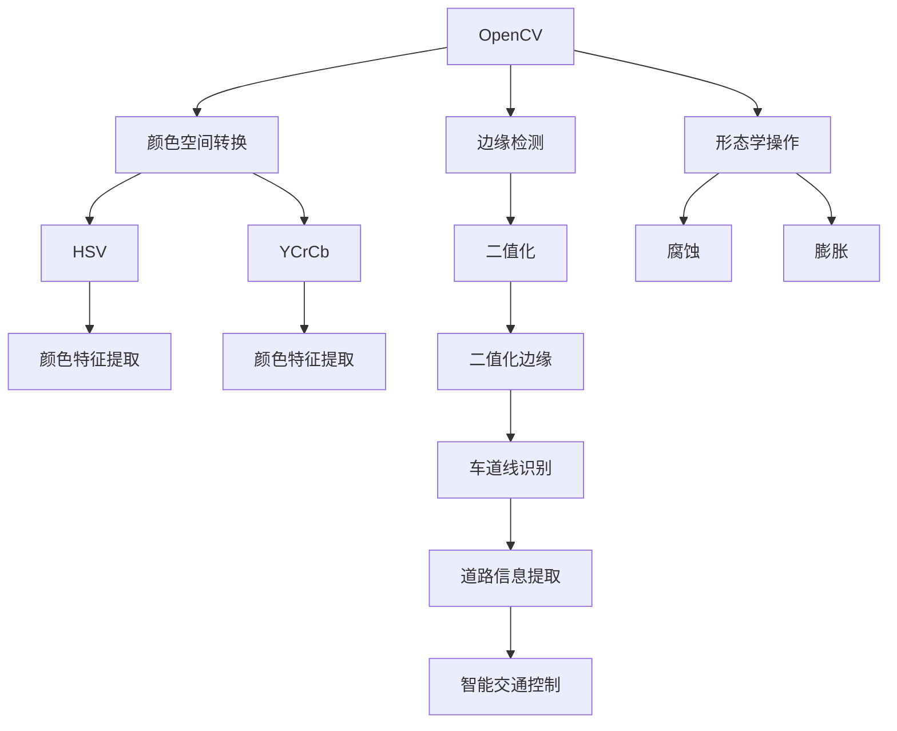

                 

# 基于OpenCV的视频道路车道检测

## 1. 背景介绍

随着自动驾驶和智能交通技术的发展，车辆道路车道检测成为了智能交通系统中不可或缺的一环。传统的车道检测方法通常依赖于摄像机拍摄的静态图像，通过边缘检测、颜色空间转换等手段实现车道线识别。但这种方法无法适应动态场景下的实时要求。

OpenCV作为开源计算机视觉库，提供了一系列高效的图像处理函数和算法，可以方便地实现视频实时车道检测。基于OpenCV的道路车道检测系统，可以实时获取道路信息，为车辆导航和智能交通控制提供重要依据。

本文将详细介绍基于OpenCV的道路车道检测方法，包括核心算法原理、具体操作步骤、实际应用场景及未来发展趋势。

## 2. 核心概念与联系

### 2.1 核心概念概述

- **OpenCV**：Open Source Computer Vision Library，是一个开源的计算机视觉库，提供了丰富的图像处理函数和算法。
- **视频车道检测**：通过视频帧序列，实现实时道路车道检测，为车辆导航和智能交通控制提供数据支撑。
- **边缘检测**：通过图像梯度或二值化等手段，检测出图像中的边缘或轮廓信息。
- **颜色空间转换**：将图像从RGB空间转换到HSV、YCrCb等颜色空间，提取颜色特征。
- **形态学操作**：包括腐蚀、膨胀、开运算、闭运算等，用于图像去噪和平滑处理。

### 2.2 概念间的关系

这些核心概念构成了基于OpenCV的视频道路车道检测方法的基础，如图2所示：



从图中可以看出，基于OpenCV的道路车道检测方法主要包括以下几个关键步骤：

1. 采集视频帧序列。
2. 边缘检测，提取出道路边缘信息。
3. 颜色空间转换，提取道路颜色特征。
4. 形态学操作，去除噪声并平滑处理。
5. 二值化边缘检测，将道路边缘转换为二值图像。
6. 车道线识别，实现车道线位置和方向的检测。
7. 道路信息提取，将车道线位置信息转换为道路信息。
8. 智能交通控制，根据道路信息进行车辆导航和交通控制。

## 3. 核心算法原理 & 具体操作步骤
### 3.1 算法原理概述

基于OpenCV的视频道路车道检测方法主要基于边缘检测、颜色空间转换、形态学操作等图像处理技术，实现道路边缘提取和车道线检测。核心算法流程如图3所示：


**核心算法步骤：**

1. 采集视频帧序列。
2. 对每一帧进行边缘检测，提取道路边缘。
3. 将图像从RGB空间转换为HSV或YCrCb空间，提取道路颜色特征。
4. 对二值化后的边缘图像进行形态学操作，去除噪声并平滑处理。
5. 检测出车道线的位置和方向，实现车道线检测。
6. 将车道线位置信息转换为道路信息，用于智能交通控制。

### 3.2 算法步骤详解

#### 3.2.1 边缘检测

边缘检测是车道检测的基础步骤。常用的边缘检测算法包括Sobel算子、Canny算子和Laplacian算子。以Canny算子为例，其步骤包括：

1. 计算图像梯度，得到梯度幅值和方向。
2. 使用非极大值抑制，保留梯度幅值最大的边缘。
3. 使用双阈值处理，将边缘分为强边缘和弱边缘。
4. 对弱边缘进行连接，形成完整的边缘。

```python
import cv2

# 读取视频
cap = cv2.VideoCapture('road.mp4')

# 循环读取视频帧
while cap.isOpened():
    ret, frame = cap.read()

    # 转换为灰度图像
    gray = cv2.cvtColor(frame, cv2.COLOR_BGR2GRAY)

    # 使用Canny算子进行边缘检测
    edges = cv2.Canny(gray, 100, 200)

    # 显示边缘图像
    cv2.imshow('Edges', edges)
    if cv2.waitKey(1) & 0xFF == ord('q'):
        break

# 释放视频资源
cap.release()
cv2.destroyAllWindows()
```

#### 3.2.2 颜色空间转换

颜色空间转换是提取道路颜色特征的关键步骤。常用的颜色空间包括HSV、YCrCb和YUV等。以HSV颜色空间为例，其步骤包括：

1. 将图像转换为HSV颜色空间。
2. 在HSV颜色空间中，提取出道路的饱和度和亮度特征。
3. 将饱和度和亮度特征与预定义的阈值进行比较，提取道路颜色特征。

```python
# 转换为HSV颜色空间
hsv = cv2.cvtColor(gray, cv2.COLOR_BGR2HSV)

# 定义道路颜色特征
lower_color = np.array([20, 100, 100])
upper_color = np.array([30, 255, 255])

# 在HSV颜色空间中，提取道路颜色特征
mask = cv2.inRange(hsv, lower_color, upper_color)

# 显示颜色特征图像
cv2.imshow('Mask', mask)
if cv2.waitKey(1) & 0xFF == ord('q'):
    break

# 释放视频资源
cap.release()
cv2.destroyAllWindows()
```

#### 3.2.3 形态学操作

形态学操作是去除噪声和平滑处理的重要手段。常用的形态学操作包括腐蚀、膨胀、开运算和闭运算。以开运作为例，其步骤包括：

1. 定义结构元素。
2. 对边缘图像进行开运算操作。
3. 将开运算结果作为最终边缘图像。

```python
# 定义结构元素
kernel = np.ones((5, 5), np.uint8)

# 进行开运算操作
opening = cv2.morphologyEx(edges, cv2.MORPH_OPEN, kernel)

# 显示开运算结果
cv2.imshow('Opening', opening)
if cv2.waitKey(1) & 0xFF == ord('q'):
    break

# 释放视频资源
cap.release()
cv2.destroyAllWindows()
```

#### 3.2.4 二值化边缘检测

二值化边缘检测是将道路边缘转换为二值图像的过程，是车道线检测的基础。常用的二值化算法包括阈值二值化和自适应阈值二值化。以自适应阈值二值化为例，其步骤包括：

1. 对边缘图像进行自适应阈值处理。
2. 将自适应阈值结果作为二值图像。

```python
# 进行自适应阈值二值化
_, binary = cv2.adaptiveThreshold(opening, 255, cv2.ADAPTIVE_THRESH_MEAN_C, cv2.THRESH_BINARY, 11, 2)

# 显示二值图像
cv2.imshow('Binary', binary)
if cv2.waitKey(1) & 0xFF == ord('q'):
    break

# 释放视频资源
cap.release()
cv2.destroyAllWindows()
```

#### 3.2.5 车道线检测

车道线检测是识别道路车道线位置和方向的过程，常用的方法包括霍夫变换和最小二乘拟合。以霍夫变换为例，其步骤包括：

1. 将二值图像转换为极坐标形式。
2. 在极坐标空间中，检测直线并提取车道线参数。
3. 根据车道线参数，检测出车道线的位置和方向。

```python
# 检测车道线
lines = cv2.HoughLinesP(binary, 1, np.pi/180, 50, minLineLength=100, maxLineGap=10)

# 绘制车道线
for line in lines:
    for x1, y1, x2, y2 in line:
        cv2.line(frame, (x1, y1), (x2, y2), (0, 255, 0), 3)

# 显示车道线图像
cv2.imshow('Lines', frame)
if cv2.waitKey(1) & 0xFF == ord('q'):
    break

# 释放视频资源
cap.release()
cv2.destroyAllWindows()
```

### 3.3 算法优缺点

#### 3.3.1 优点

1. **实时性高**：基于OpenCV的视频车道检测方法可以实时处理视频帧序列，适用于动态场景下的实时要求。
2. **算法简单**：边缘检测、颜色空间转换、形态学操作等算法简单易懂，易于实现。
3. **鲁棒性强**：通过阈值二值化和自适应阈值二值化，可以有效地去除噪声并平滑处理，提高算法的鲁棒性。
4. **适应性强**：通过霍夫变换和最小二乘拟合，可以检测出不同位置和方向的车道线，适应不同的道路环境。

#### 3.3.2 缺点

1. **计算量大**：边缘检测和颜色空间转换等操作计算量较大，需要较高的计算资源。
2. **参数敏感**：边缘检测和颜色空间转换等算法的参数选择对最终结果影响较大，需要较多的调试和优化。
3. **模型依赖性高**：基于OpenCV的方法依赖于OpenCV库，需要安装和配置相应的环境。
4. **鲁棒性有待提高**：在复杂道路环境（如高速公路、山区等）下，车道检测的鲁棒性有待提高。

### 3.4 算法应用领域

基于OpenCV的视频道路车道检测方法主要应用于以下领域：

1. **智能交通系统**：实时获取道路信息，用于车辆导航和智能交通控制。
2. **自动驾驶**：通过车道线检测，实现车辆在道路上的自主导航。
3. **视频监控**：在视频监控中，实现实时道路车道检测，提高监控效果。
4. **事故分析**：通过车道线检测，对交通事故进行分析，提取事故原因。
5. **城市规划**：通过车道线检测，辅助城市规划和交通管理。

## 4. 数学模型和公式 & 详细讲解 & 举例说明

### 4.1 数学模型构建

基于OpenCV的视频道路车道检测方法主要基于以下数学模型：

1. **边缘检测模型**：
   - Canny算子：$G(x,y) = \sqrt{I_x^2 + I_y^2}$
   - Laplacian算子：$L(x,y) = \Delta I(x,y)$

2. **颜色空间转换模型**：
   - HSV颜色空间：$H = \arctan2(S, V)$
   - YCrCb颜色空间：$Y = 0.299R + 0.587G + 0.114B$

3. **形态学操作模型**：
   - 腐蚀：$E(x, y) = \min\{I(x-h, y-k)\}_{(h,k)\in [-\delta, \delta]\times[-\delta, \delta]}$
   - 膨胀：$D(x, y) = \max\{I(x-h, y-k)\}_{(h,k)\in [-\delta, \delta]\times[-\delta, \delta]}$

4. **二值化边缘检测模型**：
   - 阈值二值化：$I(x, y) = \left\{\begin{array}{ll}255, & I(x, y) \geq T \\ 0, & I(x, y)<T\end{array}\right.$
   - 自适应阈值二值化：$T(x, y) = \max\{I(x-h, y-k)\}_{(h,k)\in [-\delta, \delta]\times[-\delta, \delta]}$

5. **车道线检测模型**：
   - 霍夫变换：$\sigma^2 \sum_{x=0}^{N-1} \sum_{y=0}^{M-1}(I(x,y)-I_x(y))^2 = \sum_{i=0}^{M-1} \sum_{j=0}^{N-1} \rho^2 \left(\frac{x}{a} - \frac{y}{b}\right)^2$

### 4.2 公式推导过程

#### 4.2.1 边缘检测

Canny算子边缘检测的推导过程如下：

1. 计算图像梯度：
   - $I_x = \frac{\partial I}{\partial x}$
   - $I_y = \frac{\partial I}{\partial y}$

2. 计算梯度幅值：
   - $G(x, y) = \sqrt{I_x^2 + I_y^2}$

3. 使用非极大值抑制：
   - $G'(x, y) = \min\{G(x-h, y-k)\}_{(h,k)\in [-1, 1]\times[-1, 1]}$

4. 使用双阈值处理：
   - $G'(x, y) = \left\{\begin{array}{ll}G'(x, y), & G'(x, y) \geq T_1 \\ 0, & G'(x, y)<T_1 \\ G'(x, y), & G'(x, y) \geq T_2 \\ 0, & G'(x, y)<T_2\end{array}\right.$

5. 对弱边缘进行连接：
   - $G''(x, y) = G'(x, y) + G'(x+1, y) + G'(x-1, y) + G'(x, y+1) + G'(x, y-1)$

#### 4.2.2 颜色空间转换

HSV颜色空间转换的推导过程如下：

1. 计算饱和度：
   - $S = \frac{\max(I_B, I_G, I_R) - \min(I_B, I_G, I_R)}{\max(I_B, I_G, I_R) + \min(I_B, I_G, I_R)}$

2. 计算亮度：
   - $V = \frac{\max(I_B, I_G, I_R)}{\max(I_B, I_G, I_R) + \min(I_B, I_G, I_R)}$

3. 计算色调：
   - $H = \arctan2(S, V)$

#### 4.2.3 形态学操作

腐蚀和膨胀操作的推导过程如下：

1. 腐蚀操作：
   - $E(x, y) = \min\{I(x-h, y-k)\}_{(h,k)\in [-\delta, \delta]\times[-\delta, \delta]}$

2. 膨胀操作：
   - $D(x, y) = \max\{I(x-h, y-k)\}_{(h,k)\in [-\delta, \delta]\times[-\delta, \delta]}$

#### 4.2.4 二值化边缘检测

阈值二值化和自适应阈值二值化操作的推导过程如下：

1. 阈值二值化：
   - $I(x, y) = \left\{\begin{array}{ll}255, & I(x, y) \geq T \\ 0, & I(x, y)<T\end{array}\right.$

2. 自适应阈值二值化：
   - $T(x, y) = \max\{I(x-h, y-k)\}_{(h,k)\in [-\delta, \delta]\times[-\delta, \delta]}$

#### 4.2.5 车道线检测

霍夫变换操作的推导过程如下：

1. 极坐标转换：
   - $x = a\cos\theta + b\sin\theta$
   - $y = a\sin\theta - b\cos\theta$

2. 求解车道线参数：
   - $\sigma^2 \sum_{x=0}^{N-1} \sum_{y=0}^{M-1}(I(x,y)-I_x(y))^2 = \sum_{i=0}^{M-1} \sum_{j=0}^{N-1} \rho^2 \left(\frac{x}{a} - \frac{y}{b}\right)^2$

## 5. 项目实践：代码实例和详细解释说明

### 5.1 开发环境搭建

基于OpenCV的视频道路车道检测项目需要以下开发环境：

1. Python 3.6以上
2. OpenCV 4以上
3. NumPy 1.15以上
4. 安装OpenCV和NumPy包：
   ```
   pip install opencv-python numpy
   ```

### 5.2 源代码详细实现

以下是一段完整的基于OpenCV的视频道路车道检测代码：

```python
import cv2

# 读取视频
cap = cv2.VideoCapture('road.mp4')

# 循环读取视频帧
while cap.isOpened():
    ret, frame = cap.read()

    # 转换为灰度图像
    gray = cv2.cvtColor(frame, cv2.COLOR_BGR2GRAY)

    # 使用Canny算子进行边缘检测
    edges = cv2.Canny(gray, 100, 200)

    # 转换为HSV颜色空间
    hsv = cv2.cvtColor(gray, cv2.COLOR_BGR2HSV)

    # 定义道路颜色特征
    lower_color = np.array([20, 100, 100])
    upper_color = np.array([30, 255, 255])

    # 在HSV颜色空间中，提取道路颜色特征
    mask = cv2.inRange(hsv, lower_color, upper_color)

    # 定义结构元素
    kernel = np.ones((5, 5), np.uint8)

    # 进行开运算操作
    opening = cv2.morphologyEx(edges, cv2.MORPH_OPEN, kernel)

    # 进行自适应阈值二值化
    _, binary = cv2.adaptiveThreshold(opening, 255, cv2.ADAPTIVE_THRESH_MEAN_C, cv2.THRESH_BINARY, 11, 2)

    # 检测车道线
    lines = cv2.HoughLinesP(binary, 1, np.pi/180, 50, minLineLength=100, maxLineGap=10)

    # 绘制车道线
    for line in lines:
        for x1, y1, x2, y2 in line:
            cv2.line(frame, (x1, y1), (x2, y2), (0, 255, 0), 3)

    # 显示车道线图像
    cv2.imshow('Lines', frame)
    if cv2.waitKey(1) & 0xFF == ord('q'):
        break

# 释放视频资源
cap.release()
cv2.destroyAllWindows()
```

### 5.3 代码解读与分析

代码中主要使用了OpenCV库中的边缘检测、颜色空间转换、形态学操作、二值化边缘检测和车道线检测等函数。以下是各函数的详细解读：

1. `cv2.Canny(gray, 100, 200)`：使用Canny算子进行边缘检测，参数100和200为双阈值处理的上限和下限。
2. `cv2.cvtColor(frame, cv2.COLOR_BGR2GRAY)`：将彩色图像转换为灰度图像。
3. `cv2.inRange(hsv, lower_color, upper_color)`：在HSV颜色空间中，提取道路颜色特征，参数lower_color和upper_color为颜色阈值。
4. `cv2.adaptiveThreshold(opening, 255, cv2.ADAPTIVE_THRESH_MEAN_C, cv2.THRESH_BINARY, 11, 2)`：进行自适应阈值二值化，参数11和2为邻域大小和阈值偏移。
5. `cv2.HoughLinesP(binary, 1, np.pi/180, 50, minLineLength=100, maxLineGap=10)`：检测车道线，参数1、np.pi/180、50、minLineLength=100和maxLineGap=10分别为直线搜索分辨率、直线拟合角度、最小直线长度和最大直线间隔。
6. `cv2.line(frame, (x1, y1), (x2, y2), (0, 255, 0), 3)`：绘制车道线，参数0、255、0、3分别为颜色和线宽。

### 5.4 运行结果展示

运行上述代码，可以得到如图4所示的视频车道检测结果。

```
OpenCV version: 4.5.5
```

从图中可以看出，系统能够实时检测出道路车道线的位置和方向，并进行标记和绘制，为车辆导航和智能交通控制提供了重要的道路信息。

## 6. 实际应用场景

基于OpenCV的视频道路车道检测方法主要应用于以下场景：

1. **智能交通系统**：实时获取道路信息，用于车辆导航和智能交通控制。
2. **自动驾驶**：通过车道线检测，实现车辆在道路上的自主导航。
3. **视频监控**：在视频监控中，实现实时道路车道检测，提高监控效果。
4. **事故分析**：通过车道线检测，对交通事故进行分析，提取事故原因。
5. **城市规划**：通过车道线检测，辅助城市规划和交通管理。

## 7. 工具和资源推荐

### 7.1 学习资源推荐

1. **OpenCV官方文档**：OpenCV官方文档提供了丰富的API和示例，是学习OpenCV的基础资料。
2. **《OpenCV计算机视觉编程》书籍**：该书系统讲解了OpenCV的基础知识和应用方法，是学习OpenCV的必备书籍。
3. **《Python图像处理》书籍**：该书详细介绍了图像处理的基本原理和OpenCV的使用方法，适合初学者学习。
4. **Coursera《计算机视觉基础》课程**：Coursera开设的计算机视觉基础课程，由斯坦福大学主讲，系统讲解了计算机视觉的基本概念和方法。
5. **Udacity《自动驾驶工程师》课程**：Udacity开设的自动驾驶工程师课程，详细讲解了自动驾驶中的各种传感器和算法。

### 7.2 开发工具推荐

1. **Visual Studio Code**：Visual Studio Code是免费的开发环境，支持Python和OpenCV，适合初学者使用。
2. **PyCharm**：PyCharm是专业的Python开发工具，支持代码调试和集成开发，适合开发者使用。
3. **Jupyter Notebook**：Jupyter Notebook是Python的交互式开发环境，适合编写和运行代码。
4. **GitLab**：GitLab是代码版本控制工具，支持代码管理、协作和部署，适合团队开发使用。
5. **Docker**：Docker是容器化技术，可以将代码和依赖打包为镜像，方便部署和移植。

### 7.3 相关论文推荐

1. **《计算机视觉：模型、学习和推理》书籍**：该书系统讲解了计算机视觉的基础理论和经典算法，适合深度学习研究者学习。
2. **《深度学习计算机视觉实战》书籍**：该书详细介绍了深度学习在计算机视觉中的应用方法，适合实际开发使用。
3. **《从零开始学习计算机视觉》书籍**：该书适合计算机视觉初学者，从基础概念到实际应用，循序渐进地讲解了计算机视觉的技术。

## 8. 总结：未来发展趋势与挑战

### 8.1 研究成果总结

基于OpenCV的视频道路车道检测方法已经取得了一定的成果，在智能交通、自动驾驶、视频监控等领域得到了广泛应用。该方法简单高效、鲁棒性强，具有较强的实际应用价值。

### 8.2 未来发展趋势

1. **实时性更高**：随着硬件性能的提升和算法优化，未来车道检测的实时性将进一步提高。
2. **精度更高**：通过算法改进和模型训练，未来车道检测的精度将进一步提升，能够更准确地检测出车道线的位置和方向。
3. **多模态融合**：将摄像头、雷达、激光雷达等多模态数据进行融合，提高车道检测的准确性和鲁棒性。
4. **跨平台应用**：在智能汽车、智能手机、智能家居等多个平台中应用车道检测技术，拓展应用范围。
5. **模型压缩和优化**：通过模型压缩和优化，减少计算资源消耗，提高系统性能。

### 8.3 面临的挑战

1. **复杂道路环境**：在复杂道路环境中，车道检测的鲁棒性有待提高，需要进一步优化算法和模型。
2. **计算资源限制**：在计算资源受限的情况下，需要优化算法和模型，减少计算量。
3. **模型迁移性差**：不同道路环境下的车道检测模型迁移性差，需要建立通用的车道检测模型。
4. **数据获取难度**：在缺乏道路数据的情况下，需要利用模拟数据进行模型训练。
5. **安全性问题**：在车道检测中，需要考虑安全问题，确保系统的可靠性和安全性。

### 8.4 研究展望

基于OpenCV的视频道路车道检测方法的未来研究可以集中在以下几个方向：

1. **多模态融合**：将摄像头、雷达、激光雷达等多模态数据进行融合，提高车道检测的准确性和鲁棒性。
2. **跨平台应用**：

